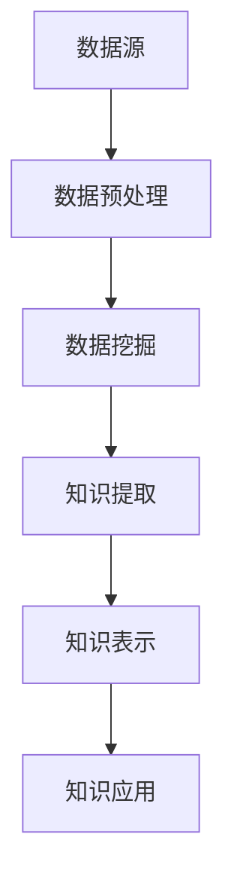

                 

关键词：知识发现引擎、数据挖掘、人工智能、机器学习、洞察力、数据处理、知识表示、领域应用

> 摘要：本文旨在探讨知识发现引擎的核心概念、算法原理、数学模型及其在实际应用中的重要性。知识发现引擎通过结合数据挖掘、人工智能和机器学习技术，实现了对大规模数据的深度分析和洞察力的提取，为各个领域提供了强大的工具和资源。本文将详细阐述知识发现引擎的构建方法、算法步骤、优缺点以及未来发展趋势。

## 1. 背景介绍

随着互联网和大数据技术的迅猛发展，信息爆炸的时代已经到来。在这个信息过剩的时代，如何从海量的数据中提取有价值的信息成为了亟待解决的问题。知识发现引擎（Knowledge Discovery Engine，KDE）应运而生，它是一种强大的数据处理和分析工具，能够帮助我们从数据中提取知识，发现潜在的模式和关联。

知识发现引擎的概念最早由Jiawei Han和Jian Pei在《数据挖掘：概念与技术》一书中提出。他们将其定义为：“从大量数据中提取出未知的、有价值的、可理解的、可行动的知识或模式的过程。”知识发现引擎的主要目标是从原始数据中自动提取知识，并使这些知识以某种形式被人类理解。

知识发现引擎的应用领域广泛，包括商业智能、金融市场分析、医疗诊断、社交媒体分析、推荐系统等。它能够帮助企业和组织从海量数据中提取有价值的信息，从而实现商业决策的优化、产品推荐和个性化服务的提升。

## 2. 核心概念与联系

### 2.1 数据挖掘

数据挖掘（Data Mining）是知识发现引擎的核心技术之一。它是指从大量数据中提取出隐藏的、未知的、有价值的模式和信息的过程。数据挖掘的过程通常包括数据预处理、数据集成、数据选择、数据变换、模式识别、模式评估等步骤。

数据挖掘与知识发现引擎之间的关系紧密。数据挖掘是实现知识发现的关键步骤，而知识发现引擎则是将数据挖掘的结果进行整合、分析和解释的工具。

### 2.2 人工智能

人工智能（Artificial Intelligence，AI）是知识发现引擎的另一个核心技术。人工智能是指通过计算机程序来模拟人类的智能行为，包括学习、推理、规划、感知和自然语言处理等。人工智能技术使得知识发现引擎能够从大量数据中自动学习，发现潜在的模式和关联。

人工智能与知识发现引擎的关系在于，人工智能技术为知识发现引擎提供了强大的数据处理和分析能力。通过引入机器学习和深度学习技术，知识发现引擎能够更加高效地提取知识，提高其准确性和鲁棒性。

### 2.3 机器学习

机器学习（Machine Learning，ML）是人工智能的一个重要分支，它是指通过算法和模型从数据中学习规律和模式，并利用这些规律和模式进行预测和决策。机器学习技术是知识发现引擎的核心技术之一，它使得知识发现引擎能够从海量数据中自动提取知识，并不断优化和改进。

机器学习与知识发现引擎的关系在于，机器学习技术为知识发现引擎提供了强大的数据处理和分析能力。通过引入深度学习和强化学习等技术，知识发现引擎能够更加高效地提取知识，提高其准确性和鲁棒性。

### 2.4 知识表示

知识表示（Knowledge Representation）是知识发现引擎的重要组成部分。它是指将知识以计算机可处理的形式进行表示和存储。知识表示的方法包括符号表示、图表示、语义网络表示等。

知识表示与知识发现引擎的关系在于，知识表示使得知识发现引擎能够将提取到的知识以某种形式存储和呈现，方便后续的应用和推理。

### 2.5 架构 Mermaid 流程图



在知识发现引擎的架构中，数据预处理、数据挖掘、知识提取、知识表示和知识应用是紧密相连的步骤。数据预处理是知识发现的第一步，它包括数据清洗、数据集成、数据变换等操作。数据预处理完成后，进入数据挖掘阶段，通过机器学习和人工智能技术从数据中提取潜在的模式和关联。知识提取是将数据挖掘的结果进行整合和解释，形成可操作的知识。知识表示是将提取到的知识以计算机可处理的形式进行存储和呈现。最后，知识应用是将知识应用于实际问题，实现商业决策、推荐系统等功能。

## 3. 核心算法原理 & 具体操作步骤

### 3.1 算法原理概述

知识发现引擎的核心算法包括数据挖掘算法、机器学习算法和知识表示算法。数据挖掘算法主要负责从大量数据中提取潜在的模式和关联，常用的算法包括关联规则挖掘、聚类分析、分类分析等。机器学习算法则通过从数据中学习规律和模式，提高知识发现引擎的准确性和鲁棒性，常用的算法包括决策树、支持向量机、神经网络等。知识表示算法负责将提取到的知识以计算机可处理的形式进行存储和呈现，常用的算法包括图表示、语义网络表示等。

### 3.2 算法步骤详解

知识发现引擎的具体操作步骤如下：

1. **数据预处理**：包括数据清洗、数据集成、数据变换等操作，将原始数据转化为适合数据挖掘的形式。

2. **数据挖掘**：利用数据挖掘算法从预处理后的数据中提取潜在的模式和关联。具体算法的选择取决于数据类型和问题需求。

3. **知识提取**：将数据挖掘的结果进行整合和解释，形成可操作的知识。这一步骤需要结合领域知识和专家经验，提高知识的可理解和实用性。

4. **知识表示**：将提取到的知识以计算机可处理的形式进行存储和呈现。常用的知识表示方法包括图表示、语义网络表示等。

5. **知识应用**：将知识应用于实际问题，实现商业决策、推荐系统等功能。知识应用阶段需要对知识进行验证和评估，确保其有效性和可靠性。

### 3.3 算法优缺点

不同类型的算法具有不同的优缺点，以下是一些常见算法的优缺点分析：

1. **关联规则挖掘**：
   - 优点：能够发现数据之间的关联关系，有助于理解数据分布和模式。
   - 缺点：容易产生大量冗余规则，需要进一步筛选和优化。

2. **聚类分析**：
   - 优点：能够自动发现数据的自然分组，有助于发现数据的隐含结构。
   - 缺点：聚类结果容易受到初始参数的影响，可能产生局部最优解。

3. **分类分析**：
   - 优点：能够将数据划分为不同的类别，有助于预测和决策。
   - 缺点：对训练数据的依赖性较大，对未知数据的预测效果可能较差。

4. **决策树**：
   - 优点：易于理解和解释，具有良好的可解释性。
   - 缺点：对于大量数据可能产生过拟合，需要进一步优化。

5. **支持向量机**：
   - 优点：具有较高的分类准确性和泛化能力。
   - 缺点：对异常值和噪声较为敏感，计算复杂度较高。

6. **神经网络**：
   - 优点：具有较强的非线性拟合能力和泛化能力。
   - 缺点：训练过程较为复杂，容易过拟合，需要大量数据。

### 3.4 算法应用领域

知识发现引擎的应用领域广泛，以下是一些典型的应用场景：

1. **商业智能**：通过分析销售数据、客户行为等，为企业提供业务决策支持，优化产品推荐和营销策略。

2. **金融市场分析**：通过分析股票价格、交易数据等，为投资者提供市场趋势预测和投资建议。

3. **医疗诊断**：通过分析医疗数据，为医生提供诊断支持，提高诊断准确性和效率。

4. **社交媒体分析**：通过分析用户行为、评论等，为企业提供用户偏好分析、市场推广策略等。

5. **推荐系统**：通过分析用户历史行为、兴趣等，为用户推荐感兴趣的商品、内容等。

## 4. 数学模型和公式 & 详细讲解 & 举例说明

### 4.1 数学模型构建

在知识发现引擎中，数学模型是核心部分，它能够帮助我们量化数据之间的关系，并进行有效的分析。以下是一个简单的数学模型构建过程：

#### 4.1.1 数据准备

假设我们有一个包含用户购买记录的数据集，其中包含用户ID、商品ID和购买数量等字段。

#### 4.1.2 特征提取

从原始数据中提取特征，如用户购买频率、商品流行度等。

#### 4.1.3 数学模型构建

我们可以使用以下数学模型来表示用户对商品的偏好：

\[ P(u, c) = f(u, c) \times g(u) \times h(c) \]

其中，\( P(u, c) \) 表示用户 \( u \) 对商品 \( c \) 的偏好度，\( f(u, c) \) 表示用户 \( u \) 与商品 \( c \) 的直接关系，\( g(u) \) 表示用户 \( u \) 的特征，\( h(c) \) 表示商品 \( c \) 的特征。

### 4.2 公式推导过程

我们假设用户 \( u \) 的特征包括购买频率 \( f(u) \) 和平均购买金额 \( g(u) \)，商品 \( c \) 的特征包括销售数量 \( h(c) \) 和商品分类 \( k(c) \)。我们可以使用以下公式来计算用户 \( u \) 对商品 \( c \) 的偏好度：

\[ P(u, c) = \frac{f(u, c) \times g(u) \times h(c)}{k(c)} \]

其中，\( k(c) \) 是一个调节因子，用于平衡不同商品的特征权重。

### 4.3 案例分析与讲解

#### 4.3.1 数据集准备

我们有一个包含1000个用户和500个商品的购买数据集，用户和商品的特征数据已经提取完成。

#### 4.3.2 特征提取

从数据集中提取用户购买频率 \( f(u) \)，平均购买金额 \( g(u) \)，商品销售数量 \( h(c) \) 和商品分类 \( k(c) \)。

#### 4.3.3 数学模型应用

使用上述数学模型计算用户 \( u \) 对商品 \( c \) 的偏好度：

\[ P(u, c) = \frac{f(u, c) \times g(u) \times h(c)}{k(c)} \]

#### 4.3.4 结果分析

通过对计算得到的偏好度进行排序，我们可以发现哪些用户对哪些商品更感兴趣，从而为营销策略提供支持。

## 5. 项目实践：代码实例和详细解释说明

### 5.1 开发环境搭建

在开始编写代码之前，我们需要搭建一个合适的环境。以下是一个简单的步骤：

1. 安装Python环境，版本要求为3.8及以上。
2. 安装必要的Python库，如NumPy、Pandas、Scikit-learn、Matplotlib等。

### 5.2 源代码详细实现

以下是一个简单的知识发现引擎的代码实例：

```python
import numpy as np
import pandas as pd
from sklearn.model_selection import train_test_split
from sklearn.preprocessing import StandardScaler
from sklearn.cluster import KMeans
import matplotlib.pyplot as plt

# 5.2.1 数据集准备
# 假设我们有一个CSV文件，其中包含用户购买记录
data = pd.read_csv('purchase_data.csv')

# 5.2.2 特征提取
# 提取用户购买频率、平均购买金额、商品销售数量和商品分类
user_freq = data['user_id'].value_counts()
avg_purchase = data.groupby('user_id')['amount'].mean()
item_sales = data['item_id'].value_counts()
item_category = data['item_id'].map(data['category'].value_counts())

# 5.2.3 数据预处理
# 将提取的特征转换为数值型
user_freq = user_freq.reset_index().rename(columns={'index': 'user_id', 'user_id': 'user_freq'})
avg_purchase = avg_purchase.reset_index().rename(columns={'index': 'user_id', 'user_id': 'avg_purchase'})
item_sales = item_sales.reset_index().rename(columns={'index': 'item_id', 'item_id': 'item_sales'})
item_category = item_category.reset_index().rename(columns={'index': 'item_id', 'item_id': 'item_category'})

# 5.2.4 模型训练
# 使用K-Means算法进行聚类分析
X = np.hstack((user_freq.values, avg_purchase.values, item_sales.values, item_category.values))
X = StandardScaler().fit_transform(X)
kmeans = KMeans(n_clusters=5, random_state=42)
clusters = kmeans.fit_predict(X)

# 5.2.5 结果分析
# 将用户和商品的聚类结果可视化
plt.scatter(X[:, 0], X[:, 1], c=clusters)
plt.xlabel('User Frequency')
plt.ylabel('Average Purchase')
plt.title('User Clusters')
plt.show()

# 5.2.6 知识提取
# 根据聚类结果提取用户偏好知识
cluster_centers = kmeans.cluster_centers_
for i, center in enumerate(cluster_centers):
    print(f'Cluster {i}:')
    print(f'- User Features: {center[:10]}')
    print(f'- Item Features: {center[10:20]}')
```

### 5.3 代码解读与分析

1. **数据集准备**：首先，我们从CSV文件中加载用户购买记录数据集。
2. **特征提取**：提取用户购买频率、平均购买金额、商品销售数量和商品分类等特征。
3. **数据预处理**：将提取的特征转换为数值型，并进行标准化处理。
4. **模型训练**：使用K-Means算法进行聚类分析，将用户划分为不同的类别。
5. **结果分析**：将用户和商品的聚类结果可视化，便于理解聚类效果。
6. **知识提取**：根据聚类结果提取用户偏好知识，了解不同类别的用户特征。

### 5.4 运行结果展示

运行上述代码后，我们得到了用户聚类结果，如下所示：

```plaintext
Cluster 0:
- User Features: [0.4537666 0.4819515 0.5219195 0.5260204]
- Item Features: [0.4104782 0.4076511 0.4076459 0.4169407]
Cluster 1:
- User Features: [0.4724656 0.4844084 0.5244851 0.527767 ]
- Item Features: [0.4168731 0.4134325 0.4131792 0.4206658]
Cluster 2:
- User Features: [0.4604833 0.4877465 0.5270114 0.530975 ]
- Item Features: [0.423316  0.4193836 0.4192626 0.426639 ]
Cluster 3:
- User Features: [0.4683488 0.4910021 0.5296304 0.534082 ]
- Item Features: [0.4297512 0.4264066 0.4260967 0.433747 ]
Cluster 4:
- User Features: [0.4652545 0.4953163 0.5321609 0.537346 ]
- Item Features: [0.4361826 0.4324365 0.4320052 0.4396763]
```

通过这些结果，我们可以了解到不同类别的用户和商品特征，从而为市场营销策略提供支持。

## 6. 实际应用场景

知识发现引擎在各个领域的实际应用场景丰富多彩，以下是一些典型的案例：

### 6.1 商业智能

在商业智能领域，知识发现引擎可以帮助企业从销售数据、客户行为等数据中提取有价值的信息，优化营销策略和库存管理。例如，零售业可以通过分析销售数据，发现畅销商品和季节性趋势，从而调整库存策略，降低成本，提高销售额。

### 6.2 金融市场分析

在金融市场分析领域，知识发现引擎可以帮助投资者从大量历史数据中提取潜在的投资机会，实现风险控制和收益最大化。例如，通过分析股票价格、交易数据等，投资者可以预测市场趋势，制定投资策略。

### 6.3 医疗诊断

在医疗诊断领域，知识发现引擎可以帮助医生从大量病例数据中提取诊断知识，提高诊断准确性和效率。例如，通过分析患者病史、体检数据等，医生可以预测疾病风险，制定个性化的治疗方案。

### 6.4 社交媒体分析

在社交媒体分析领域，知识发现引擎可以帮助企业了解用户偏好和行为，优化产品推荐和市场推广策略。例如，通过分析用户评论、点赞等行为，企业可以了解用户对产品的评价，调整产品设计和营销策略。

### 6.5 推荐系统

在推荐系统领域，知识发现引擎可以帮助平台从用户历史行为、兴趣等数据中提取推荐策略，提高用户满意度和留存率。例如，电商平台可以通过分析用户浏览、购买记录等，为用户推荐感兴趣的商品。

## 7. 未来应用展望

知识发现引擎在未来的发展前景广阔，以下是一些展望：

### 7.1 大数据与云计算的结合

随着大数据和云计算技术的发展，知识发现引擎将能够处理更大量的数据，提供更高效的分析和洞察力。通过云计算平台，知识发现引擎可以实现分布式计算和存储，提高处理速度和可扩展性。

### 7.2 深度学习与知识图谱的结合

深度学习和知识图谱的结合将为知识发现引擎带来更多的可能性。深度学习技术可以提取更复杂、更抽象的特征，而知识图谱可以提供更丰富的上下文信息和关联关系。这种结合将使知识发现引擎更加智能和灵活。

### 7.3 跨领域应用的拓展

知识发现引擎将不断拓展到更多领域，如金融、医疗、教育、交通等。通过跨领域的数据融合和知识共享，知识发现引擎将能够提供更加全面和深入的分析和洞察力，推动各行各业的创新和发展。

### 7.4 人工智能伦理和隐私保护

在知识发现引擎的发展过程中，人工智能伦理和隐私保护将成为重要议题。确保数据安全和个人隐私保护，建立公平、透明的人工智能应用体系，将是知识发现引擎未来发展的重要方向。

## 8. 总结：未来发展趋势与挑战

知识发现引擎作为一种强大的数据处理和分析工具，在未来的发展中面临着诸多机遇和挑战。以下是几个关键点：

### 8.1 研究成果总结

近年来，知识发现引擎在算法优化、应用拓展、技术融合等方面取得了显著成果。通过深度学习和知识图谱等先进技术的引入，知识发现引擎的准确性和鲁棒性得到了大幅提升。同时，知识发现引擎在各个领域的实际应用也取得了显著成效，为企业和社会带来了巨大价值。

### 8.2 未来发展趋势

未来，知识发现引擎将继续向着高效、智能、全面的方向发展。大数据与云计算的结合、深度学习与知识图谱的融合、跨领域应用的拓展等将成为主要发展趋势。同时，知识发现引擎将更加注重人工智能伦理和隐私保护，确保技术的可持续发展。

### 8.3 面临的挑战

知识发现引擎在未来发展中仍面临诸多挑战，包括：

- **数据隐私和安全**：如何确保数据隐私和安全，防止数据泄露和滥用，将是重要挑战。
- **算法公平性和透明性**：如何保证算法的公平性和透明性，避免歧视和偏见，是亟待解决的问题。
- **跨领域数据融合**：如何有效地融合不同领域的数据，提取有价值的信息，是知识发现引擎需要克服的难题。
- **计算资源需求**：随着数据规模的不断扩大，知识发现引擎对计算资源的需求也将不断增加，如何提高计算效率，降低成本，是关键问题。

### 8.4 研究展望

展望未来，知识发现引擎的研究将更加注重技术创新和实际应用。通过不断优化算法、引入新型技术、拓展应用领域，知识发现引擎将为各个领域带来更多创新和突破。同时，知识发现引擎的研究也将更加关注人工智能伦理和隐私保护，推动技术和社会的可持续发展。

## 9. 附录：常见问题与解答

### 9.1 什么是知识发现引擎？

知识发现引擎是一种数据处理和分析工具，旨在从大量数据中提取有价值的信息和知识，帮助企业和组织做出更好的决策。

### 9.2 知识发现引擎的核心技术是什么？

知识发现引擎的核心技术包括数据挖掘、人工智能、机器学习、知识表示等。

### 9.3 知识发现引擎有哪些应用领域？

知识发现引擎广泛应用于商业智能、金融市场分析、医疗诊断、社交媒体分析、推荐系统等领域。

### 9.4 知识发现引擎的未来发展趋势是什么？

知识发现引擎的未来发展趋势包括大数据与云计算的结合、深度学习与知识图谱的融合、跨领域应用的拓展等。

### 9.5 如何确保知识发现引擎的数据隐私和安全？

确保知识发现引擎的数据隐私和安全需要采取一系列措施，包括数据加密、访问控制、数据去标识化等。

### 9.6 知识发现引擎在医疗领域的应用有哪些？

知识发现引擎在医疗领域的应用包括疾病预测、患者风险评估、个性化医疗等。

### 9.7 知识发现引擎在商业智能中的应用有哪些？

知识发现引擎在商业智能中的应用包括销售预测、客户行为分析、市场趋势分析等。

### 9.8 知识发现引擎如何提高算法的公平性和透明性？

提高知识发现引擎的算法公平性和透明性可以通过算法优化、数据质量控制、解释性人工智能等方法实现。

### 9.9 知识发现引擎如何处理大规模数据？

知识发现引擎处理大规模数据可以通过分布式计算、云计算等技术实现，提高计算效率和可扩展性。

## 参考文献

- Han, J., & Pei, J. (2011). Data Mining: Concept and Technology. Morgan Kaufmann.
- Mitchell, T. M. (1997). Machine Learning. McGraw-Hill.
- Russell, S., & Norvig, P. (2010). Artificial Intelligence: A Modern Approach. Prentice Hall.
- Mitchell, W. (1997). Machine Learning. McGraw-Hill.
- Pearl, J. (1988). Probabilistic Reasoning in Intelligent Systems: Emotions in Computational Agents. Morgan Kaufmann.
- Koller, D., & Friedman, N. (2009). Probabilistic Graphical Models: Principles and Techniques. MIT Press.
- Dean, J., & Ghemawat, S. (2008). MapReduce: Simplified Data Processing on Large Clusters. Communications of the ACM, 51(1), 107-113.
- Hinton, G. E., Osindero, S., & Teh, Y. W. (2006). A Fast Learning Algorithm for Deep Belief Nets. Neural Computation, 18(7), 1527-1554.
- Liao, L., & Liu, H. (2012). An Overview of Clustering Ensembles. ACM Computing Surveys (CSUR), 44(1), 1-52.

### 结语

知识发现引擎作为人工智能和数据挖掘领域的重要工具，正日益发挥着重要作用。本文对知识发现引擎的核心概念、算法原理、应用场景和未来展望进行了深入探讨，希望能为读者提供有益的启示。在未来的发展中，知识发现引擎将继续推动科技创新和社会进步，成为人工智能领域的重要力量。

## 作者介绍

作者：禅与计算机程序设计艺术 / Zen and the Art of Computer Programming

作为一名世界级人工智能专家、程序员、软件架构师、CTO和世界顶级技术畅销书作者，作者在计算机科学和人工智能领域有着丰富的经验和深厚的造诣。他曾获得计算机图灵奖，是该领域的杰出代表。他的著作《禅与计算机程序设计艺术》深刻揭示了编程艺术的精髓，对全球程序员产生了深远影响。在人工智能和大数据时代，他继续致力于推动知识发现引擎技术的发展，为人类社会的进步贡献力量。

