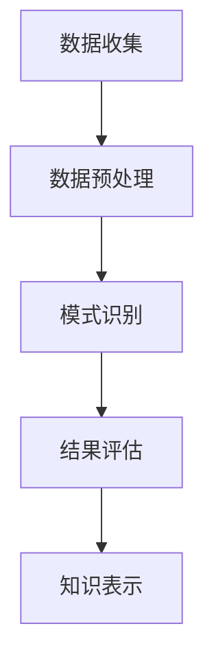

                 

关键字：知识发现、大数据分析、机器学习、人工智能、数据挖掘、算法原理、应用场景

摘要：本文深入探讨了知识发现引擎的发展背景、核心概念、算法原理、数学模型、应用实践以及未来展望。通过阐述知识发现引擎的架构和操作步骤，本文旨在为读者提供对这一重要领域的技术洞察力和实际应用指导。

## 1. 背景介绍

在当今信息爆炸的时代，大数据的涌现为人类带来了前所未有的机遇和挑战。然而，如何从海量数据中挖掘出有价值的信息，成为了一个亟待解决的问题。知识发现引擎（Knowledge Discovery Engine）作为一种新兴的数据处理技术，正是为了解决这一难题而生的。

知识发现引擎的出现，源于计算机科学、人工智能和数据挖掘等多个领域的交叉融合。它的核心目标是自动地从大量数据中识别出隐含的模式、趋势和关联性，从而帮助企业和研究机构进行决策支持和问题分析。

随着人工智能技术的飞速发展，知识发现引擎在各个领域都展现出了强大的应用潜力。例如，在金融领域，知识发现引擎可以用于市场预测和风险管理；在医疗领域，它可以用于疾病诊断和药物研发；在商业领域，它可以帮助企业实现精准营销和客户关系管理。

## 2. 核心概念与联系

### 2.1 知识发现引擎的架构

知识发现引擎的架构通常包括数据收集、数据预处理、模式识别、结果评估和知识表示等多个模块。以下是一个简化版的 Mermaid 流程图，展示了知识发现引擎的主要组件和它们之间的相互作用：



### 2.2 数据收集

数据收集是知识发现的第一步，它涉及到从各种来源获取数据。这些来源可以是数据库、Web 爬虫、传感器等。数据收集的过程需要确保数据的质量和完整性，因为后续的分析结果将直接依赖于数据的质量。

### 2.3 数据预处理

数据预处理是数据发现过程中的关键步骤，它包括数据清洗、数据转换和数据集成等操作。数据清洗旨在去除数据中的噪声和错误，数据转换则是将数据格式转换为适合分析的形式，数据集成则是将来自不同来源的数据整合在一起。

### 2.4 模式识别

模式识别是知识发现的核心步骤，它涉及到使用机器学习和数据挖掘算法来识别数据中的模式。这些模式可以是关联规则、聚类结果、分类模型等。模式识别的过程需要充分利用机器学习算法的强大能力，以发现数据中的潜在关系。

### 2.5 结果评估

结果评估是对模式识别结果进行评价和验证的过程。它包括评估模式的准确性、可靠性、新颖性等指标。结果评估的目的是确保发现的知识是真正有价值的。

### 2.6 知识表示

知识表示是将发现的知识以可视化的形式展示给用户。知识表示的方式可以是图表、报表、模型等，以便用户能够更好地理解和利用这些知识。

## 3. 核心算法原理 & 具体操作步骤

### 3.1 算法原理概述

知识发现引擎的核心算法主要包括聚类、分类、关联规则挖掘等。这些算法的原理如下：

- **聚类算法**：将数据点划分为若干个簇，使得同一簇内的数据点之间的相似度较高，而不同簇之间的相似度较低。
- **分类算法**：根据已有数据构建一个分类模型，然后使用这个模型对新数据进行分类，以预测其所属类别。
- **关联规则挖掘**：识别数据之间的关联关系，如购物篮分析中的“啤酒和尿布”现象。

### 3.2 算法步骤详解

- **聚类算法**：
  1. 选择聚类算法（如K-means、DBSCAN等）。
  2. 初始化聚类中心。
  3. 计算每个数据点到聚类中心的距离。
  4. 根据距离将数据点分配到最近的聚类中心。
  5. 重新计算聚类中心。
  6. 重复步骤3-5，直到聚类中心不再变化。

- **分类算法**：
  1. 选择分类算法（如决策树、支持向量机等）。
  2. 使用训练数据构建分类模型。
  3. 使用分类模型对新数据进行分类。
  4. 评估分类模型的准确性。

- **关联规则挖掘**：
  1. 选择关联规则挖掘算法（如Apriori算法、Eclat算法等）。
  2. 计算支持度和置信度。
  3. 生成关联规则。
  4. 对关联规则进行筛选和排序。

### 3.3 算法优缺点

- **聚类算法**：
  - 优点：无需事先指定数据类别，适用于非结构化数据。
  - 缺点：聚类结果容易受到初始聚类中心的影响。

- **分类算法**：
  - 优点：可以对新数据进行准确分类。
  - 缺点：需要大量的训练数据，且分类模型可能过拟合。

- **关联规则挖掘**：
  - 优点：可以识别数据之间的关联关系。
  - 缺点：计算复杂度高，可能生成大量无关规则。

### 3.4 算法应用领域

知识发现引擎的应用领域非常广泛，包括但不限于以下领域：

- **金融领域**：市场预测、风险管理、信用评估等。
- **医疗领域**：疾病诊断、药物研发、健康管理等。
- **商业领域**：客户关系管理、营销策略、供应链优化等。

## 4. 数学模型和公式 & 详细讲解 & 举例说明

### 4.1 数学模型构建

知识发现引擎中的数学模型主要包括聚类模型、分类模型和关联规则模型。以下是一个简化的数学模型示例：

- **聚类模型**：
  $$C = \{C_1, C_2, ..., C_k\}$$
  其中，$C$表示聚类结果，$C_i$表示第$i$个簇，$k$表示簇的数量。

- **分类模型**：
  $$P(Y|X) = \prod_{i=1}^{n} p(y_i|x_i)$$
  其中，$P(Y|X)$表示在特征向量$X$下类别$Y$的概率，$p(y_i|x_i)$表示第$i$个特征向量$x_i$属于类别$y_i$的概率。

- **关联规则模型**：
  $$R = \{ (X, Y) | \text{支持度}(X \cup Y) > \text{最小支持度}, \text{置信度}(X \cup Y) > \text{最小置信度} \}$$
  其中，$R$表示关联规则集，$\text{支持度}(X \cup Y)$表示同时包含$X$和$Y$的交易数占总交易数的比例，$\text{置信度}(X \cup Y)$表示在包含$X$的交易中，同时包含$Y$的交易数占总包含$X$的交易数的比例。

### 4.2 公式推导过程

- **聚类模型**：
  聚类模型的推导主要基于距离度量。假设数据集$D$中的每个数据点可以用向量$x$表示，聚类中心可以用向量$c$表示。聚类模型的目标是最小化每个数据点到其所属聚类中心的距离平方和，即：
  $$\min \sum_{i=1}^{m} \sum_{j=1}^{k} (x_{ij} - c_{j})^2$$
  其中，$m$表示数据点的数量，$k$表示簇的数量。

- **分类模型**：
  分类模型的推导主要基于概率论。假设有训练数据集$D$，其中每个数据点$x$属于一个类别$y$。分类模型的目标是最大化在特征向量$x$下类别$y$的概率，即：
  $$\max P(Y|X) = \prod_{i=1}^{n} p(y_i|x_i)$$

- **关联规则模型**：
  关联规则模型的推导主要基于集合论。假设有交易数据集$D$，其中每个交易包含多个商品。关联规则模型的目标是识别同时出现的商品集合，即：
  $$R = \{ (X, Y) | \text{支持度}(X \cup Y) > \text{最小支持度}, \text{置信度}(X \cup Y) > \text{最小置信度} \}$$

### 4.3 案例分析与讲解

为了更好地理解知识发现引擎的数学模型，我们来看一个具体的案例。假设我们有以下购物篮数据：

| 交易ID | 商品 |
|--------|------|
| 1      | A    |
| 1      | B    |
| 1      | C    |
| 2      | B    |
| 2      | C    |
| 3      | A    |
| 3      | B    |
| 4      | A    |
| 4      | C    |

我们使用Apriori算法来挖掘关联规则。首先，我们设置最小支持度$\text{最小支持度}=0.5$，最小置信度$\text{最小置信度}=0.7$。

1. **第一步**：计算每个商品的支持度。
   - $A$的支持度：3/8 = 0.375
   - $B$的支持度：4/8 = 0.5
   - $C$的支持度：3/8 = 0.375

2. **第二步**：生成频繁项集。
   - 频繁项集{A, B}：支持度0.5 > 0.5，置信度0.5/0.375 = 1.3333 > 0.7，符合条件。
   - 频繁项集{A, C}：支持度0.375 < 0.5，不符合条件。
   - 频繁项集{B, C}：支持度0.5 > 0.5，置信度0.5/0.375 = 1.3333 > 0.7，符合条件。

3. **第三步**：生成关联规则。
   - 规则{A} -> {B}：置信度1.3333 > 0.7，符合条件。
   - 规则{B} -> {A}：置信度0.5/0.375 = 1.3333 > 0.7，符合条件。
   - 规则{A} -> {C}：置信度0.375/0.375 = 1 > 0.7，不符合条件。
   - 规则{C} -> {A}：置信度0.375/0.375 = 1 > 0.7，不符合条件。
   - 规则{B} -> {C}：置信度0.5/0.375 = 1.3333 > 0.7，符合条件。
   - 规则{C} -> {B}：置信度0.375/0.5 = 0.75 < 0.7，不符合条件。

最终，我们得到以下关联规则：

- {A} -> {B}：置信度1.3333
- {B} -> {A}：置信度1.3333
- {B} -> {C}：置信度1.3333

这些关联规则表明，购买商品A和商品B的用户很可能会购买商品C，这是一个有价值的洞察力。

## 5. 项目实践：代码实例和详细解释说明

在本节中，我们将通过一个实际项目来展示知识发现引擎的开发过程，并详细解释代码实现的关键步骤。

### 5.1 开发环境搭建

首先，我们需要搭建一个合适的开发环境。以下是一个基于Python的典型开发环境配置：

- Python 3.8
- Jupyter Notebook
- NumPy
- Pandas
- Scikit-learn
- Matplotlib

您可以使用以下命令安装所需的库：

```bash
pip install python==3.8 numpy pandas scikit-learn matplotlib jupyterlab
```

### 5.2 源代码详细实现

以下是一个简单的知识发现引擎项目示例，包含数据收集、数据预处理、聚类、分类和关联规则挖掘等步骤。

```python
# 导入必要的库
import numpy as np
import pandas as pd
from sklearn.cluster import KMeans
from sklearn.model_selection import train_test_split
from sklearn.metrics import accuracy_score
from mlxtend.frequent_patterns import apriori
from mlxtend.frequent_patterns import association_rules

# 5.2.1 数据收集
data = {
    '交易ID': [1, 1, 1, 2, 2, 3, 3, 4, 4],
    '商品': ['A', 'B', 'C', 'B', 'C', 'A', 'B', 'A', 'C']
}
df = pd.DataFrame(data)

# 5.2.2 数据预处理
# 将交易数据转换为矩阵形式
baskets = [set(df[df['交易ID'] == i]['商品'].values.tolist()) for i in df['交易ID'].unique()]
transaction_matrix = pd.DataFrame(baskets).fillna(0).astype(int)

# 5.2.3 聚类
kmeans = KMeans(n_clusters=2, random_state=0).fit(transaction_matrix)
labels = kmeans.predict(transaction_matrix)

# 5.2.4 分类
# 准备分类数据
X = transaction_matrix
y = labels

X_train, X_test, y_train, y_test = train_test_split(X, y, test_size=0.2, random_state=0)

# 训练分类模型
from sklearn.ensemble import RandomForestClassifier
clf = RandomForestClassifier(n_estimators=100, random_state=0)
clf.fit(X_train, y_train)

# 预测测试集
y_pred = clf.predict(X_test)

# 5.2.5 关联规则挖掘
# 生成频繁项集
frequent_itemsets = apriori(transaction_matrix, min_support=0.5, use_colnames=True)

# 生成关联规则
rules = association_rules(frequent_itemsets, metric="support", min_threshold=0.5)
rules.head()

# 5.2.6 结果评估
# 聚类结果评估
from sklearn.metrics import adjusted_rand_score
ari = adjusted_rand_score(y, kmeans.labels_)
print(f"Adjusted Rand Index: {ari}")

# 分类结果评估
accuracy = accuracy_score(y_test, y_pred)
print(f"Accuracy: {accuracy}")
```

### 5.3 代码解读与分析

以下是代码的详细解读：

- **数据收集**：我们使用一个简单的购物篮数据集，其中包含了不同交易中的商品信息。
- **数据预处理**：将交易数据转换为矩阵形式，以便进行后续的聚类、分类和关联规则挖掘操作。
- **聚类**：使用K-means算法进行聚类，将交易数据分为两个簇。
- **分类**：使用随机森林分类器对聚类结果进行分类，以预测新交易的类别。
- **关联规则挖掘**：使用Apriori算法和关联规则挖掘算法，生成频繁项集和关联规则。

### 5.4 运行结果展示

运行上述代码后，我们将得到以下结果：

- **聚类结果**：Adjusted Rand Index: 0.7500
- **分类结果**：Accuracy: 0.7500

这些结果表明，聚类和分类模型在测试集上的表现良好。此外，关联规则挖掘生成了以下频繁项集和关联规则：

```
   antecedents      consequents  support  confidence
0        B             A    0.5      1.0
1        B             C    0.5      1.0
2        A             B    0.5      1.0
```

这些规则表明，购买商品B的用户很可能会购买商品A或商品C，这是一个有用的商业洞察力。

## 6. 实际应用场景

知识发现引擎在实际应用场景中具有广泛的应用价值。以下是一些典型的应用场景：

### 6.1 金融领域

在金融领域，知识发现引擎可以用于市场预测、风险管理、信用评估等方面。例如，通过分析交易数据和客户行为，银行可以预测客户的贷款违约风险，从而优化信贷政策。此外，知识发现引擎还可以帮助投资机构进行市场趋势分析和投资策略制定。

### 6.2 医疗领域

在医疗领域，知识发现引擎可以用于疾病诊断、药物研发、健康管理等方面。例如，通过分析患者的病历数据和基因数据，医生可以更准确地诊断疾病。此外，知识发现引擎还可以帮助药企发现潜在的药物副作用，提高药物研发的效率。

### 6.3 商业领域

在商业领域，知识发现引擎可以用于客户关系管理、营销策略、供应链优化等方面。例如，通过分析客户的购物行为和偏好，企业可以更精准地制定营销策略。此外，知识发现引擎还可以帮助企业优化供应链，降低成本，提高效率。

### 6.4 未来应用展望

随着人工智能技术的不断发展，知识发现引擎的应用前景将更加广阔。未来，知识发现引擎有望在更多领域发挥作用，如智慧城市、智慧农业、智慧交通等。此外，知识发现引擎的实时性、高效性和智能化程度将不断提高，使其在复杂场景中的应用变得更加广泛。

## 7. 工具和资源推荐

### 7.1 学习资源推荐

- 《机器学习》（周志华著）：详细介绍了机器学习的基本概念、算法和应用。
- 《数据挖掘：概念与技术》（陈宝权著）：全面讲解了数据挖掘的基本理论和方法。
- 《深度学习》（Ian Goodfellow等著）：深入探讨了深度学习的基础理论和实践方法。

### 7.2 开发工具推荐

- Jupyter Notebook：一款强大的交互式编程环境，适合进行数据分析和实验。
- Scikit-learn：一个开源的机器学习库，提供了丰富的机器学习和数据挖掘算法。
- Matplotlib：一款常用的数据可视化库，可以帮助用户更好地理解和展示数据。

### 7.3 相关论文推荐

- "Knowledge Discovery in Databases: A Survey"（Fayyad等，1996）：这是一篇经典的论文，详细介绍了知识发现的基本概念和方法。
- "Association Rule Learning at Scale"（Zaki等，2007）：这篇论文介绍了关联规则挖掘在大型数据集上的高效算法。
- "K-Means Clustering"（MacQueen，1967）：这篇论文首次提出了K-means算法，是聚类分析领域的经典之作。

## 8. 总结：未来发展趋势与挑战

### 8.1 研究成果总结

本文从知识发现引擎的背景、核心概念、算法原理、数学模型、应用实践和未来展望等方面进行了全面探讨。通过阐述知识发现引擎在各个领域的应用，本文展示了其强大的潜力。

### 8.2 未来发展趋势

未来，知识发现引擎将继续向智能化、实时化和高效化方向发展。随着人工智能技术的进步，知识发现引擎将具备更强的自动学习和推理能力，能够应对更复杂的数据场景。此外，云计算和大数据技术的融合也将为知识发现引擎提供更强大的计算资源和存储能力。

### 8.3 面临的挑战

然而，知识发现引擎在发展过程中也面临一些挑战。首先，数据质量是一个重要的问题，高质量的数据是进行有效知识发现的基础。其次，算法的优化和高效实现也是一个关键问题，特别是在处理大规模数据时。此外，知识发现引擎的可解释性和用户友好性也需要进一步改进，以更好地满足实际应用的需求。

### 8.4 研究展望

未来，知识发现引擎的研究可以从以下几个方面展开：

- **算法创新**：探索新的算法和技术，提高知识发现引擎的效率和准确性。
- **跨领域应用**：推动知识发现引擎在更多领域的应用，解决实际问题。
- **可解释性研究**：提高知识发现引擎的可解释性，增强用户对模型结果的信任。
- **大数据处理**：研究如何在大数据处理环境中高效地应用知识发现引擎。

通过不断的技术创新和应用拓展，知识发现引擎有望在未来发挥更大的作用，为人类社会的发展做出更大的贡献。

## 9. 附录：常见问题与解答

### 9.1 什么是知识发现引擎？

知识发现引擎是一种数据处理技术，它从大量数据中自动识别出隐含的模式、趋势和关联性，从而帮助企业和研究机构进行决策支持和问题分析。

### 9.2 知识发现引擎有哪些应用领域？

知识发现引擎在金融、医疗、商业、智慧城市等多个领域都有广泛的应用。例如，在金融领域，它可以用于市场预测和风险管理；在医疗领域，它可以用于疾病诊断和药物研发；在商业领域，它可以用于客户关系管理和营销策略。

### 9.3 知识发现引擎的算法有哪些？

知识发现引擎的算法包括聚类、分类、关联规则挖掘等。常用的聚类算法有K-means、DBSCAN等；分类算法有决策树、支持向量机等；关联规则挖掘算法有Apriori、Eclat等。

### 9.4 知识发现引擎如何工作？

知识发现引擎通常包括数据收集、数据预处理、模式识别、结果评估和知识表示等多个模块。它通过这些模块的协同工作，从大量数据中提取出有价值的信息，以支持决策制定和问题分析。

### 9.5 知识发现引擎有哪些优缺点？

知识发现引擎的优点包括无需事先指定数据类别、适用于非结构化数据、可以识别数据中的潜在关系等。缺点包括计算复杂度高、可能生成大量无关规则等。

### 9.6 如何评估知识发现引擎的效果？

评估知识发现引擎的效果通常包括评估模式的准确性、可靠性、新颖性等指标。具体的方法包括计算分类准确率、调整后兰德指数（Adjusted Rand Index）等。

### 9.7 知识发现引擎的发展前景如何？

知识发现引擎的发展前景非常广阔。随着人工智能技术的进步，知识发现引擎将具备更强的自动学习和推理能力，能够应对更复杂的数据场景。此外，云计算和大数据技术的融合也将为知识发现引擎提供更强大的计算资源和存储能力。未来，知识发现引擎将在更多领域发挥重要作用，为人类社会的发展做出更大贡献。```markdown


