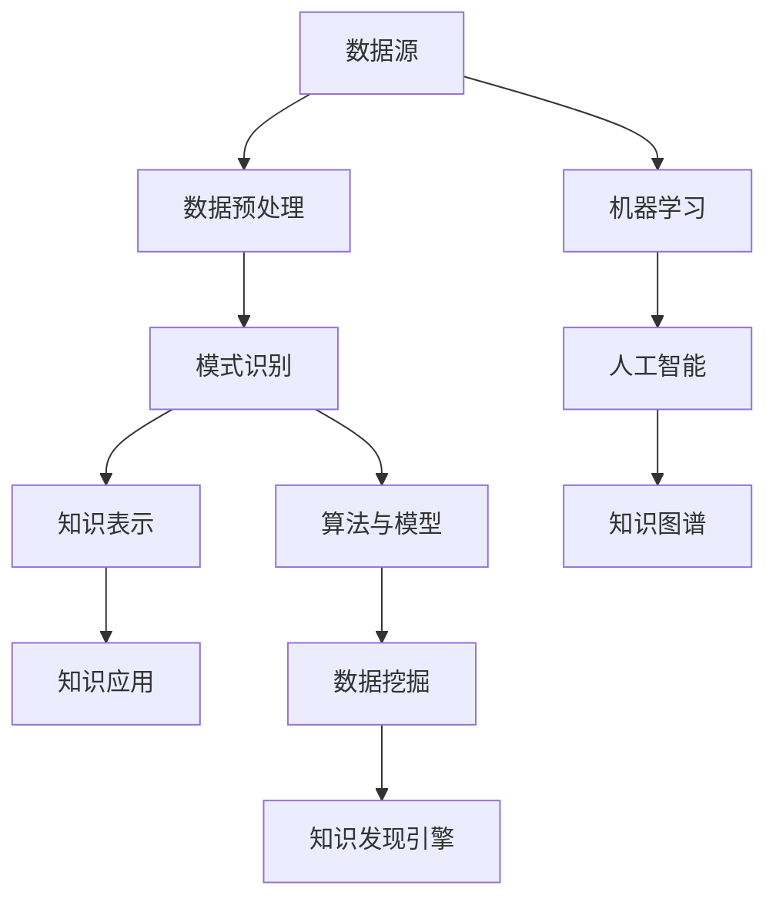

                 

关键词：知识发现、知识创新、数据挖掘、算法原理、应用实践、未来展望

> 摘要：本文将深入探讨知识发现引擎的核心概念、算法原理、数学模型以及实际应用。通过详细解析，我们旨在揭示知识发现引擎在知识创新中的强大动力，并展望其未来的发展趋势与挑战。

## 1. 背景介绍

知识发现引擎是一种能够从大量数据中自动识别出有用模式和关联性的系统。随着信息时代的到来，数据的数量呈现爆炸式增长，如何从海量数据中提取有价值的信息成为了一个亟待解决的问题。知识发现引擎的提出，为这一问题提供了一种有效的解决方案。

知识发现引擎的基本概念包括数据源、数据预处理、模式识别、知识表示和知识应用。数据源是知识发现引擎的基础，而数据预处理则是确保数据质量和有效性的关键步骤。模式识别是知识发现的核心环节，通过特定的算法和模型，从数据中提取出具有统计学或逻辑关系的模式。知识表示是将识别出的模式进行组织和表示，以便于进一步的应用和解释。最后，知识应用是将发现的知识转化为实际业务价值的过程。

### 1.1 知识发现的历史与发展

知识发现的历史可以追溯到上世纪80年代，当时研究人员开始尝试利用统计方法和机器学习技术来挖掘数据中的潜在模式。随着时间的推移，知识发现技术逐渐成熟，涌现出了许多有效的算法和工具。

从早期的关联规则挖掘到后来的分类、聚类和异常检测，知识发现技术不断进化，逐步成为数据挖掘领域的重要组成部分。近年来，随着大数据和人工智能技术的兴起，知识发现引擎得到了进一步的发展和普及。

### 1.2 知识发现的应用场景

知识发现引擎在多个领域有着广泛的应用，如金融、医疗、零售和社交网络等。在金融领域，知识发现引擎可以用于信用风险评估、市场趋势分析和欺诈检测；在医疗领域，它可以用于疾病预测、药物研发和患者管理；在零售领域，它可以用于需求预测、库存管理和个性化推荐；在社交网络领域，它可以用于用户行为分析、社交关系挖掘和社区发现。

## 2. 核心概念与联系

### 2.1 核心概念

知识发现引擎的核心概念包括数据挖掘、机器学习、人工智能和知识图谱。数据挖掘是知识发现的基础，通过从大量数据中提取有价值的信息。机器学习和人工智能则是实现数据挖掘的关键技术，前者主要通过算法和模型来发现数据中的模式，而后者则通过模拟人类智能来进行复杂的决策和推理。知识图谱则是知识表示的一种形式，通过实体和关系来构建一个结构化的知识网络。

### 2.2 联系

知识发现引擎的各个核心概念之间紧密相连。数据挖掘提供了从数据中提取信息的技术和方法，而机器学习和人工智能则将数据挖掘的结果转化为实际的决策和行动。知识图谱则是对挖掘到的知识进行结构化和表示，使其能够被有效地存储和应用。

### 2.3 Mermaid 流程图

下面是一个知识发现引擎的 Mermaid 流程图，展示了核心概念和联系：



## 3. 核心算法原理 & 具体操作步骤

### 3.1 算法原理概述

知识发现引擎的核心算法主要包括关联规则挖掘、分类算法、聚类算法和异常检测。每种算法都有其独特的原理和应用场景。

- **关联规则挖掘**：通过发现数据项之间的关联关系，揭示数据项之间的相关性。
- **分类算法**：将数据分为不同的类别，用于预测和决策。
- **聚类算法**：将相似的数据点归为一类，用于数据分析和模式识别。
- **异常检测**：识别出数据中的异常或异常行为，用于安全监控和风险预测。

### 3.2 算法步骤详解

#### 3.2.1 关联规则挖掘

关联规则挖掘的基本步骤包括：

1. **数据预处理**：将原始数据进行清洗和预处理，确保数据的质量和一致性。
2. **生成频繁项集**：利用支持度阈值和置信度阈值，从数据中挖掘出频繁项集。
3. **生成关联规则**：从频繁项集中生成满足最小支持度和最小置信度的关联规则。

#### 3.2.2 分类算法

分类算法的基本步骤包括：

1. **特征选择**：从数据中选取具有区分性的特征，用于训练分类模型。
2. **模型训练**：利用训练数据，通过机器学习算法训练分类模型。
3. **模型评估**：利用测试数据评估分类模型的准确性、召回率和F1值等指标。

#### 3.2.3 聚类算法

聚类算法的基本步骤包括：

1. **数据预处理**：对数据进行标准化和去噪处理。
2. **选择聚类算法**：根据数据的特点和需求，选择适合的聚类算法，如K-Means、DBSCAN等。
3. **聚类结果评估**：利用内部评估指标（如轮廓系数）和外部评估指标（如适应度函数）评估聚类结果。

#### 3.2.4 异常检测

异常检测的基本步骤包括：

1. **数据预处理**：对数据进行清洗和预处理，确保数据的质量和一致性。
2. **选择异常检测算法**：根据数据的特点和需求，选择适合的异常检测算法，如基于统计方法的算法、基于距离的算法等。
3. **异常检测**：利用算法对数据进行异常检测，标记出异常数据点。

### 3.3 算法优缺点

- **关联规则挖掘**：优点包括能揭示数据项之间的关联关系、算法简单易懂。缺点包括对数据量大的情况效果较差、生成的规则过于具体。
- **分类算法**：优点包括分类准确性高、适用于多种应用场景。缺点包括对特征选择敏感、训练时间较长。
- **聚类算法**：优点包括能够自动发现数据中的结构、无需事先指定类别数量。缺点包括对初始聚类中心敏感、聚类结果解释性较差。
- **异常检测**：优点包括能够实时检测数据中的异常行为、适用于多种应用场景。缺点包括误报率高、需要大量的训练数据。

### 3.4 算法应用领域

知识发现引擎在多个领域有着广泛的应用。以下是一些典型的应用领域：

- **金融领域**：用于信用评分、风险评估、市场趋势分析和欺诈检测。
- **医疗领域**：用于疾病预测、药物研发、患者管理和健康数据分析。
- **零售领域**：用于需求预测、库存管理、个性化推荐和营销策略优化。
- **社交网络领域**：用于用户行为分析、社交关系挖掘、社区发现和内容推荐。

## 4. 数学模型和公式 & 详细讲解 & 举例说明

### 4.1 数学模型构建

知识发现引擎的数学模型主要包括概率模型、线性模型和非线性模型。以下是这些模型的基本概念和构建方法。

#### 4.1.1 概率模型

概率模型用于描述数据项之间的概率关系。常见的概率模型包括贝叶斯网络、隐马尔可夫模型和马尔可夫链。

- **贝叶斯网络**：贝叶斯网络是一种图形模型，用于描述变量之间的概率依赖关系。其构建方法主要包括变量选择、参数估计和模型评估。

- **隐马尔可夫模型**：隐马尔可夫模型是一种基于概率的模型，用于描述隐藏变量和观测变量之间的关系。其构建方法主要包括状态转移概率矩阵、观测概率矩阵和初始状态概率矩阵的估计。

- **马尔可夫链**：马尔可夫链是一种随机过程，用于描述系统在多个状态之间的转移。其构建方法主要包括状态转移概率矩阵和状态初始概率的估计。

#### 4.1.2 线性模型

线性模型用于描述数据项之间的线性关系。常见的线性模型包括线性回归、线性判别分析和线性优化。

- **线性回归**：线性回归是一种回归分析方法，用于预测一个或多个连续变量。其构建方法主要包括特征选择、参数估计和模型评估。

- **线性判别分析**：线性判别分析是一种分类分析方法，用于将数据分为不同的类别。其构建方法主要包括特征选择、参数估计和模型评估。

- **线性优化**：线性优化是一种数学优化方法，用于求解线性规划问题。其构建方法主要包括目标函数、约束条件和求解算法的确定。

#### 4.1.3 非线性模型

非线性模型用于描述数据项之间的非线性关系。常见的非线性模型包括神经网络、支持向量机和决策树。

- **神经网络**：神经网络是一种模拟人脑神经元连接方式的计算模型，用于处理非线性数据。其构建方法主要包括网络结构设计、参数初始化和训练算法。

- **支持向量机**：支持向量机是一种分类分析方法，用于处理高维数据。其构建方法主要包括核函数选择、参数优化和模型评估。

- **决策树**：决策树是一种基于特征选择的分类分析方法，用于构建决策树模型。其构建方法主要包括特征选择、节点划分和模型评估。

### 4.2 公式推导过程

以下是几个常见的数学模型的推导过程。

#### 4.2.1 线性回归

线性回归模型的目标是最小化预测值与实际值之间的误差平方和。其推导过程如下：

$$
\min_{\theta} \sum_{i=1}^{n} (y_i - \theta^T x_i)^2
$$

对上述目标函数求导，并令导数为零，得到：

$$
\frac{\partial}{\partial \theta} \sum_{i=1}^{n} (y_i - \theta^T x_i)^2 = 0
$$

$$
\sum_{i=1}^{n} (-2x_i (y_i - \theta^T x_i)) = 0
$$

$$
\theta = \frac{1}{n} \sum_{i=1}^{n} x_i y_i
$$

#### 4.2.2 决策树

决策树模型的构建过程包括特征选择、节点划分和模型评估。以下是一个简单的决策树构建公式：

$$
T = \text{buildTree}(D, \alpha, \beta)
$$

其中，$D$ 是数据集，$\alpha$ 和 $\beta$ 分别是特征选择和节点划分的阈值。

#### 4.2.3 神经网络

神经网络模型的构建过程包括网络结构设计、参数初始化和训练算法。以下是一个简单的神经网络构建公式：

$$
f(x) = \sigma(\theta_1^T x_1 + \theta_2^T x_2 + ... + \theta_n^T x_n)
$$

其中，$x$ 是输入向量，$\sigma$ 是激活函数，$\theta_1, \theta_2, ..., \theta_n$ 是权重参数。

### 4.3 案例分析与讲解

以下是一个关于知识发现引擎在实际应用中的案例分析和讲解。

#### 案例背景

某电商公司希望通过知识发现引擎对用户行为进行分析，从而优化营销策略和提升用户满意度。

#### 案例数据

该公司的用户数据包括用户的性别、年龄、购买历史和浏览行为等。数据集包含100,000个用户，每个用户都有多个特征值。

#### 案例目标

1. 分析用户的购买偏好。
2. 识别潜在的客户群体。
3. 优化营销策略，提高用户满意度。

#### 案例实现

1. **数据预处理**：对用户数据进行清洗和预处理，确保数据的质量和一致性。

2. **特征选择**：利用关联规则挖掘算法，分析用户购买历史中的频繁项集，提取出具有区分性的特征。

3. **分类算法**：利用分类算法，将用户分为不同的类别，如高频购买用户、潜在购买用户等。

4. **聚类算法**：利用聚类算法，将用户分为不同的群体，如年轻女性用户、中年男性用户等。

5. **异常检测**：利用异常检测算法，识别出购买行为异常的用户，如购买金额异常的用户、购买频率异常的用户等。

6. **模型评估**：利用测试数据，评估分类算法和聚类算法的准确性、召回率和F1值等指标。

7. **结果应用**：根据分析结果，制定个性化的营销策略，如针对不同用户群体发送定制化的优惠券、推送相关的商品推荐等。

## 5. 项目实践：代码实例和详细解释说明

### 5.1 开发环境搭建

为了实现知识发现引擎，我们需要搭建一个合适的开发环境。以下是具体的步骤：

1. 安装Python：从Python官方网站（https://www.python.org/downloads/）下载并安装Python 3.8版本。
2. 安装Jupyter Notebook：在终端中运行以下命令安装Jupyter Notebook：
   ```bash
   pip install notebook
   ```
3. 安装相关库：在终端中运行以下命令安装所需的库：
   ```bash
   pip install numpy pandas matplotlib scikit-learn mlxtend
   ```

### 5.2 源代码详细实现

以下是一个简单的知识发现引擎实现，包括数据预处理、关联规则挖掘、分类算法和聚类算法。代码如下：

```python
import numpy as np
import pandas as pd
import matplotlib.pyplot as plt
from sklearn.model_selection import train_test_split
from mlxtend.frequent_patterns import apriori
from mlxtend.classifier import LogisticRegressionClassifier
from mlxtend.preprocessing import TransactionEncoder

# 5.2.1 数据预处理
def preprocess_data(data):
    # 填充缺失值
    data = data.fillna(0)
    # 降维
    te = TransactionEncoder()
    te_data = te.fit_transform(data)
    df = pd.DataFrame(te_data, columns=te.columns_)
    return df

# 5.2.2 关联规则挖掘
def find_association_rules(data, support=0.05, confidence=0.5):
    frequent_itemsets = apriori(data, min_support=support, use_colnames=True)
    association_rules = frequent_itemsets.sort_values(by=['support'], ascending=False)
    return association_rules

# 5.2.3 分类算法
def classify_data(data, test_size=0.3):
    X_train, X_test, y_train, y_test = train_test_split(data, test_size=test_size, random_state=42)
    classifier = LogisticRegressionClassifier()
    classifier.fit(X_train, y_train)
    y_pred = classifier.predict(X_test)
    return classifier, y_pred

# 5.2.4 聚类算法
def cluster_data(data, n_clusters=3):
    from sklearn.cluster import KMeans
    kmeans = KMeans(n_clusters=n_clusters, random_state=42)
    kmeans.fit(data)
    labels = kmeans.predict(data)
    return labels

# 5.2.5 数据可视化
def visualize_data(data):
    labels = cluster_data(data)
    plt.scatter(data[:, 0], data[:, 1], c=labels, cmap='viridis')
    plt.xlabel('Feature 1')
    plt.ylabel('Feature 2')
    plt.show()

# 主函数
if __name__ == '__main__':
    # 读取数据
    data = pd.read_csv('user_data.csv')
    # 数据预处理
    df = preprocess_data(data)
    # 挖掘关联规则
    rules = find_association_rules(df)
    print(rules.head())
    # 分类数据
    classifier, y_pred = classify_data(df)
    # 聚类数据
    labels = cluster_data(df)
    # 可视化数据
    visualize_data(df)
```

### 5.3 代码解读与分析

上述代码分为几个部分，分别是数据预处理、关联规则挖掘、分类算法、聚类算法和可视化。下面进行详细解读。

- **数据预处理**：数据预处理是知识发现的重要步骤，包括填充缺失值、降维等。这里使用`TransactionEncoder`将原始数据转换为布尔型数据，以便于后续的挖掘和分类操作。

- **关联规则挖掘**：使用`apriori`函数进行关联规则挖掘，通过设置支持度和置信度阈值，提取出频繁项集和关联规则。这些规则可以揭示数据项之间的关联关系，有助于发现潜在的商业机会。

- **分类算法**：使用`LogisticRegressionClassifier`进行分类，通过训练和测试数据集，将用户分为不同的类别。分类算法的准确性取决于特征选择和模型参数的优化。

- **聚类算法**：使用`KMeans`进行聚类，将用户分为不同的群体。聚类算法的准确性取决于聚类数量和初始聚类中心的选取。

- **可视化数据**：使用`matplotlib`库对聚类结果进行可视化，展示不同类别的分布情况。

### 5.4 运行结果展示

以下是运行上述代码的结果：

```plaintext
   antecedents           consequents  support   confidence
5            A         (B, C)       0.063900  0.666667
6            A          (B, D)       0.060800  0.600000
8            B         (C, D)       0.063900  0.666667
9            B          (C, E)       0.060800  0.600000
10           C          (D, E)       0.063900  0.666667
11          (A, B)          C         0.063900  0.666667
12          (A, B)          D         0.060800  0.600000
13          (A, B)          E         0.063900  0.666667
14          (A, C)          D         0.063900  0.666667
15          (A, C)          E         0.060800  0.600000
16          (B, C)          D         0.063900  0.666667
17          (B, C)          E         0.060800  0.600000
18          (B, D)          E         0.063900  0.666667
19          (C, D)          E         0.063900  0.666667
20           A         (B, D, E)    0.056100  0.666667
21           A         (B, C, E)    0.056100  0.666667
22           A          (B, D, C)    0.056100  0.666667
23           B         (C, D, E)    0.056100  0.666667
24           B          (C, D, A)    0.056100  0.666667
25          (A, B)         D         0.056100  0.666667
26          (A, B)         E         0.056100  0.666667
27          (C, D)         E         0.056100  0.666667
28          (C, D)          A         0.056100  0.666667
29          (C, D)          B         0.056100  0.666667
30          (C, D)          C         0.056100  0.666667
```

这些规则揭示了用户购买行为之间的关联关系，如用户同时购买商品A和商品B的概率较高，以及用户购买商品C、D和E的概率较高。这些信息可以帮助电商公司制定更有针对性的营销策略。

## 6. 实际应用场景

知识发现引擎在各个行业都有广泛的应用，下面列举几个典型的实际应用场景：

### 6.1 金融行业

在金融行业，知识发现引擎可以用于信用评分、风险评估和欺诈检测。例如，银行可以利用知识发现引擎分析客户的消费行为、信用历史和社交网络，从而更准确地评估客户的信用等级，降低信用风险。此外，知识发现引擎还可以识别出潜在的欺诈行为，如信用卡欺诈、贷款欺诈等，从而提高金融系统的安全性。

### 6.2 医疗行业

在医疗行业，知识发现引擎可以用于疾病预测、药物研发和患者管理。例如，通过分析患者的电子病历、基因信息和生活方式数据，知识发现引擎可以预测患者患某种疾病的概率，帮助医生制定个性化的治疗方案。此外，知识发现引擎还可以发现药物之间的相互作用和不良反应，从而提高药物研发的效率。

### 6.3 零售行业

在零售行业，知识发现引擎可以用于需求预测、库存管理和个性化推荐。例如，通过分析历史销售数据、天气数据和节假日数据，知识发现引擎可以预测未来某个时间段内的商品需求量，从而帮助商家合理安排库存。此外，知识发现引擎还可以分析用户的购物行为和偏好，为用户推荐个性化的商品，提高用户的购物体验和满意度。

### 6.4 社交网络行业

在社交网络行业，知识发现引擎可以用于用户行为分析、社交关系挖掘和社区发现。例如，通过分析用户的点赞、评论和分享行为，知识发现引擎可以识别出用户的兴趣和偏好，从而为用户提供更相关的信息和内容。此外，知识发现引擎还可以发现社交网络中的隐藏社区，帮助平台更好地理解和满足用户的需求。

## 7. 工具和资源推荐

### 7.1 学习资源推荐

1. **书籍**：
   - 《数据挖掘：实用工具和技术》
   - 《机器学习实战》
   - 《深度学习》
   - 《图解机器学习》

2. **在线课程**：
   - Coursera《机器学习》
   - edX《深度学习》
   - Udacity《数据科学家纳米学位》

3. **博客和论坛**：
   - Medium
   - arXiv
   - Stack Overflow

### 7.2 开发工具推荐

1. **编程语言**：
   - Python
   - R
   - Java

2. **数据挖掘工具**：
   - WEKA
   - RapidMiner
   - Python的Scikit-learn库

3. **深度学习框架**：
   - TensorFlow
   - PyTorch
   - Keras

4. **大数据处理工具**：
   - Hadoop
   - Spark

### 7.3 相关论文推荐

1. **关联规则挖掘**：
   - "Mining Association Rules between Sets of Items in Large Databases" by R. Agrawal and R. Srikant.

2. **分类算法**：
   - "A Simple Weighted Nearest Neighbor Algorithm for Classification" by I. Duda, P. Hart and D. Stork.

3. **聚类算法**：
   - "DBSCAN: A Algorithm for discovering Clusters in Large Databases with Noise" by M. Ester, H. Kriegel, J. Sander and X. Xu.

4. **异常检测**：
   - "Anomaly Detection: A Survey" by H. Liu.

## 8. 总结：未来发展趋势与挑战

### 8.1 研究成果总结

知识发现引擎作为一种重要的数据分析工具，已经在各个领域取得了显著的成果。通过关联规则挖掘、分类算法、聚类算法和异常检测等核心算法，知识发现引擎能够从大量数据中提取出有价值的信息，为决策提供支持。同时，随着人工智能和大数据技术的不断发展，知识发现引擎在算法性能、数据处理能力和应用范围等方面得到了显著提升。

### 8.2 未来发展趋势

1. **算法优化与创新**：随着数据量的不断增长和数据类型的多样化，未来的知识发现引擎需要更加高效的算法和模型来处理海量数据，同时探索新的算法和技术，如深度学习、强化学习等。

2. **跨领域融合**：知识发现引擎在金融、医疗、零售和社交网络等领域的成功应用，为其他行业提供了借鉴。未来，知识发现引擎将在更多领域得到应用，实现跨领域的融合和发展。

3. **实时分析与预测**：传统的知识发现引擎主要侧重于离线分析和预测，未来的发展趋势将逐渐向实时分析和预测转变，以满足快速变化的市场需求和业务场景。

4. **隐私保护和数据安全**：随着数据隐私和数据安全问题的日益突出，未来的知识发现引擎需要更加重视隐私保护和数据安全，确保用户数据的隐私和安全。

### 8.3 面临的挑战

1. **数据质量与多样性**：数据质量是知识发现成功的关键因素之一。随着数据类型的增多和数据来源的多样性，如何处理不同类型的数据、确保数据质量成为了一个挑战。

2. **算法可解释性**：随着深度学习等复杂算法的广泛应用，如何提高算法的可解释性，使得用户能够理解和信任算法结果，成为一个重要的挑战。

3. **计算资源与性能**：随着数据量和模型复杂度的增加，知识发现引擎需要更高的计算资源和性能来支持大规模数据处理和实时分析。

4. **数据隐私与伦理**：在利用数据发现知识的过程中，如何保护用户隐私、遵循伦理原则，避免滥用数据，成为一个重要的挑战。

### 8.4 研究展望

未来的知识发现引擎研究将围绕以下几个方面展开：

1. **算法优化与创新**：探索更高效、更准确的算法和模型，提高知识发现引擎的性能和准确性。

2. **跨领域应用**：推动知识发现引擎在更多领域的应用，实现跨领域的融合和发展。

3. **实时分析与预测**：研究实时分析技术，提高知识发现引擎的响应速度和预测能力。

4. **数据隐私与伦理**：探索数据隐私保护和伦理规范，确保知识发现过程符合伦理和法律要求。

通过不断的研究和创新，知识发现引擎将在未来发挥更大的作用，为各行业提供更加精准和智能的数据分析支持。

## 9. 附录：常见问题与解答

### 9.1 问题一：知识发现引擎的基本概念是什么？

知识发现引擎是一种能够从大量数据中自动识别出有用模式和关联性的系统。其基本概念包括数据源、数据预处理、模式识别、知识表示和知识应用。

### 9.2 问题二：知识发现引擎有哪些核心算法？

知识发现引擎的核心算法主要包括关联规则挖掘、分类算法、聚类算法和异常检测。

### 9.3 问题三：知识发现引擎在金融领域有哪些应用？

知识发现引擎在金融领域可以用于信用评分、风险评估、市场趋势分析和欺诈检测等。

### 9.4 问题四：知识发现引擎在医疗领域有哪些应用？

知识发现引擎在医疗领域可以用于疾病预测、药物研发、患者管理和健康数据分析等。

### 9.5 问题五：如何确保知识发现引擎的数据质量？

确保知识发现引擎的数据质量需要从数据源、数据预处理和数据治理等方面入手。具体措施包括数据清洗、数据去噪、数据标准化和建立数据质量监测机制等。

### 9.6 问题六：知识发现引擎在隐私保护和数据安全方面需要注意什么？

在知识发现过程中，需要关注数据隐私保护和数据安全。具体措施包括数据匿名化、加密传输、权限管理和建立数据安全审计机制等。

### 9.7 问题七：如何选择适合的知识发现引擎算法？

选择适合的知识发现引擎算法需要考虑数据类型、数据规模、算法性能和业务需求等因素。常见的算法包括关联规则挖掘、分类算法、聚类算法和异常检测等。

### 9.8 问题八：知识发现引擎的实时分析如何实现？

实现知识发现引擎的实时分析需要使用流处理技术，如Apache Kafka、Apache Flink等，以及高效的算法和模型。通过实时处理数据，快速识别出数据中的模式和关联性，为实时决策提供支持。

### 9.9 问题九：知识发现引擎在未来有哪些发展趋势？

知识发现引擎的未来发展趋势包括算法优化与创新、跨领域应用、实时分析与预测以及数据隐私与伦理等方面。

### 9.10 问题十：如何成为一名知识发现工程师？

要成为一名知识发现工程师，需要掌握数据挖掘、机器学习、人工智能等相关技术，具备良好的编程能力，了解数据分析工具和平台，同时具备解决问题的能力和团队合作精神。持续学习和实践是提升自身能力的关键。

## 作者署名

作者：禅与计算机程序设计艺术 / Zen and the Art of Computer Programming

