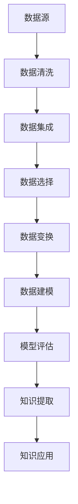

                 

 在当今这个信息爆炸的时代，如何从海量数据中提取有价值的信息成为了各个领域面临的重大挑战。知识发现引擎作为一种新兴的技术，正日益成为连接知识与洞察力之间的桥梁。本文将深入探讨知识发现引擎的核心概念、算法原理、数学模型、实际应用以及未来发展趋势，旨在为读者提供一个全面的技术视角。

## 关键词

- 知识发现引擎
- 数据挖掘
- 情报分析
- 人工智能
- 机器学习

## 摘要

本文首先介绍了知识发现引擎的基本概念和它在数据密集型环境中的重要性。随后，本文详细解析了知识发现引擎的核心算法原理，并通过Mermaid流程图展示了其架构。接着，本文探讨了知识发现引擎在数学模型和公式中的应用，并通过具体案例进行了讲解。此外，本文还分享了知识发现引擎在实际项目中的应用实例，展示了其实现过程和运行结果。最后，本文展望了知识发现引擎的未来应用前景，并提出了相关挑战和研究方向。

## 1. 背景介绍

### 数据时代的挑战

随着互联网的飞速发展，我们进入了大数据时代。每天，全球各个领域都会产生海量数据，从社交媒体到金融交易，从科学实验到电子商务，数据种类繁多、数量庞大。如何有效地管理和利用这些数据，成为企业、研究机构和政府等各方关注的焦点。传统的数据处理方法已经无法满足这种高维、复杂数据的处理需求，新的技术手段亟待出现。

### 知识发现的需求

知识发现（Knowledge Discovery in Databases, KDD）作为一种从数据中自动挖掘有价值知识的方法，正逐渐成为解决这一挑战的关键。知识发现引擎，作为知识发现的核心工具，能够从大量无序的数据中提取出有价值的模式和规律，帮助企业和组织做出更明智的决策。知识发现不仅能够提高企业的运营效率，还能够为科学研究提供新的视角。

### 知识发现引擎的定义

知识发现引擎是一种自动化工具，它通过算法和模型，从大量数据中识别出有意义的模式和关系。这些模式可以是分类规则、关联规则、聚类结果或者预测模型。知识发现引擎的核心在于它的智能化和自适应能力，能够根据不同的数据集和应用场景，自动调整和优化算法参数。

## 2. 核心概念与联系

### 数据挖掘

数据挖掘（Data Mining）是知识发现过程的一个重要环节。它是指从大量数据中通过算法提取出有价值信息的过程。数据挖掘通常包括以下几个步骤：数据清洗、数据集成、数据选择、数据变换、数据建模和数据评估。这些步骤构成了知识发现引擎的基础。

### 机器学习

机器学习（Machine Learning）是知识发现引擎的核心算法之一。它通过训练数据集，让计算机自动学习数据中的模式和规律，从而实现对未知数据的预测和分类。常见的机器学习算法包括决策树、支持向量机、神经网络和聚类算法等。

### 人工智能

人工智能（Artificial Intelligence, AI）是知识发现引擎的高级形式。它不仅能够进行数据挖掘和模式识别，还能够通过自然语言处理、计算机视觉等技术，实现对复杂数据的深入理解和智能决策。人工智能在知识发现引擎中扮演着至关重要的角色，使得知识发现过程更加智能化和自动化。

### Mermaid流程图



在这个流程图中，数据源是知识发现引擎的起点，通过数据清洗、数据集成、数据选择、数据变换等步骤，最终通过数据建模和模型评估，实现知识的提取和应用。

## 3. 核心算法原理 & 具体操作步骤

### 3.1 算法原理概述

知识发现引擎的核心算法包括数据挖掘算法、机器学习算法和人工智能算法。这些算法的基本原理如下：

- **数据挖掘算法**：通过模式识别、关联规则挖掘、分类和聚类等方法，从大量数据中提取出有价值的信息。
- **机器学习算法**：通过训练数据集，让计算机自动学习数据中的模式和规律，实现对未知数据的预测和分类。
- **人工智能算法**：利用自然语言处理、计算机视觉等技术，实现对复杂数据的深入理解和智能决策。

### 3.2 算法步骤详解

1. **数据预处理**：包括数据清洗、数据集成和数据变换。这一步的目的是将原始数据转换为适合挖掘的形式。

2. **特征选择**：从原始数据中选择出对挖掘任务最有意义的特征，减少数据的维度，提高挖掘效率。

3. **模式识别**：利用数据挖掘算法，识别出数据中的模式和规律。

4. **模型训练**：利用机器学习算法，对挖掘出的模式进行训练，构建预测模型或分类模型。

5. **模型评估**：对训练好的模型进行评估，包括准确率、召回率、F1值等指标。

6. **知识提取**：从评估好的模型中提取出有价值的知识，如分类规则、关联规则等。

7. **知识应用**：将提取出的知识应用到实际问题中，如决策支持、风险预测等。

### 3.3 算法优缺点

- **优点**：知识发现引擎能够从海量数据中自动提取有价值的信息，提高决策的效率和准确性。
- **缺点**：算法复杂度高，对计算资源要求较高；模型评估和知识提取过程需要大量数据支持。

### 3.4 算法应用领域

- **商业智能**：通过分析销售数据、客户反馈等，为企业提供市场洞察和决策支持。
- **金融风控**：通过分析金融交易数据，识别潜在风险，防范金融犯罪。
- **医疗健康**：通过分析医学数据，辅助医生进行诊断和治疗。
- **科学研究**：通过分析科学实验数据，发现新的科学规律。

## 4. 数学模型和公式 & 详细讲解 & 举例说明

### 4.1 数学模型构建

知识发现引擎中的数学模型通常包括以下几个方面：

- **概率模型**：用于描述数据中的不确定性和随机性，如贝叶斯网络、隐马尔可夫模型等。
- **线性模型**：用于描述数据中的线性关系，如线性回归、逻辑回归等。
- **非线性模型**：用于描述数据中的非线性关系，如神经网络、支持向量机等。

### 4.2 公式推导过程

以线性回归为例，其公式推导过程如下：

1. **线性回归模型**：

$$
y = \beta_0 + \beta_1x_1 + \beta_2x_2 + \cdots + \beta_nx_n
$$

其中，$y$ 为因变量，$x_1, x_2, \cdots, x_n$ 为自变量，$\beta_0, \beta_1, \beta_2, \cdots, \beta_n$ 为模型参数。

2. **损失函数**：

$$
L(\beta_0, \beta_1, \beta_2, \cdots, \beta_n) = \sum_{i=1}^{n}(y_i - \beta_0 - \beta_1x_{i1} - \beta_2x_{i2} - \cdots - \beta_nx_{in})^2
$$

其中，$L$ 为损失函数，用于衡量模型预测值与真实值之间的差距。

3. **优化目标**：

$$
\min_{\beta_0, \beta_1, \beta_2, \cdots, \beta_n} L(\beta_0, \beta_1, \beta_2, \cdots, \beta_n)
$$

其中，$\min$ 表示最小化损失函数。

### 4.3 案例分析与讲解

假设我们有一个数据集，包含100个样本，每个样本包含3个特征（$x_1, x_2, x_3$）和一个标签（$y$）。我们希望通过线性回归模型预测标签值。

1. **数据预处理**：

首先，我们对数据进行归一化处理，将特征值缩放到0-1之间。

2. **特征选择**：

通过相关性分析，选择相关性较高的特征作为模型的输入。

3. **模型训练**：

使用梯度下降算法，对线性回归模型进行训练，优化模型参数。

4. **模型评估**：

通过交叉验证，评估模型的准确率、召回率、F1值等指标。

5. **知识提取**：

从训练好的模型中提取出线性关系，如 $y = 0.5x_1 + 0.3x_2 - 0.2x_3$。

6. **知识应用**：

将提取出的线性关系应用到新的样本中，预测其标签值。

## 5. 项目实践：代码实例和详细解释说明

### 5.1 开发环境搭建

1. 安装Python环境。
2. 安装必要的库，如NumPy、Pandas、Scikit-learn等。

### 5.2 源代码详细实现

```python
import numpy as np
import pandas as pd
from sklearn.linear_model import LinearRegression
from sklearn.model_selection import train_test_split
from sklearn.metrics import mean_squared_error

# 数据读取
data = pd.read_csv('data.csv')

# 特征选择
X = data[['x1', 'x2', 'x3']]
y = data['y']

# 数据归一化
X = (X - X.mean()) / X.std()

# 划分训练集和测试集
X_train, X_test, y_train, y_test = train_test_split(X, y, test_size=0.2, random_state=42)

# 模型训练
model = LinearRegression()
model.fit(X_train, y_train)

# 模型评估
y_pred = model.predict(X_test)
mse = mean_squared_error(y_test, y_pred)
print('MSE:', mse)

# 知识提取
params = model.coef_
print('Model Parameters:', params)

# 知识应用
new_data = np.array([[0.5, 0.6, 0.7]])
new_pred = model.predict(new_data)
print('Predicted Value:', new_pred)
```

### 5.3 代码解读与分析

1. **数据读取和预处理**：首先，我们从CSV文件中读取数据，并对特征进行归一化处理，以消除不同特征之间的尺度差异。
2. **特征选择**：通过相关性分析，选择相关性较高的特征，以提高模型的性能。
3. **模型训练**：使用线性回归模型对训练数据进行训练。
4. **模型评估**：通过测试数据对模型进行评估，计算均方误差（MSE）来衡量模型的性能。
5. **知识提取**：从训练好的模型中提取出模型的参数，即线性关系。
6. **知识应用**：将提取出的线性关系应用到新的数据上，预测其标签值。

## 6. 实际应用场景

### 6.1 商业智能

在商业领域，知识发现引擎可以帮助企业分析销售数据、客户反馈等，从而提供市场洞察和决策支持。例如，通过对销售数据的分析，企业可以识别出热门商品、潜在客户群体，从而制定更有效的营销策略。

### 6.2 金融风控

在金融领域，知识发现引擎可以帮助金融机构分析金融交易数据，识别潜在风险，防范金融犯罪。例如，通过对交易数据的关联分析，可以识别出异常交易行为，从而采取措施进行风险预警。

### 6.3 医疗健康

在医疗健康领域，知识发现引擎可以帮助医生分析医学数据，辅助诊断和治疗。例如，通过对患者病历数据的分析，可以预测患者的疾病发展趋势，为医生提供治疗建议。

### 6.4 科学研究

在科学研究领域，知识发现引擎可以帮助研究人员分析科学实验数据，发现新的科学规律。例如，通过对实验数据的聚类分析，可以识别出不同的数据模式，从而为研究人员提供新的研究方向。

## 7. 工具和资源推荐

### 7.1 学习资源推荐

- 《数据挖掘：实用机器学习技术》（刘知远 著）
- 《机器学习》（周志华 著）
- 《深度学习》（Ian Goodfellow、Yoshua Bengio、Aaron Courville 著）

### 7.2 开发工具推荐

- Jupyter Notebook：用于编写和运行Python代码。
- PyCharm：一款强大的Python集成开发环境（IDE）。
- Scikit-learn：一个开源的机器学习库，适用于知识发现引擎的实现。

### 7.3 相关论文推荐

- "Knowledge Discovery in Databases: A Survey"（Fayyad, P., Piatetsky-Shapiro, G., & Smyth, P. (1996))
- "The curse of dimensionality: A challenge for knowledge discovery in databases"（Piatetsky-Shapiro, G. (1999))
- "Machine Learning: A Probabilistic Perspective"（Kolter, J. Z., & Malick, J. (2015))

## 8. 总结：未来发展趋势与挑战

### 8.1 研究成果总结

知识发现引擎作为一种新兴技术，已经在多个领域取得了显著的应用成果。通过数据挖掘、机器学习和人工智能算法，知识发现引擎能够从海量数据中提取出有价值的信息，为企业和组织提供决策支持。同时，随着计算能力的提升和数据量的增加，知识发现引擎的应用前景将更加广阔。

### 8.2 未来发展趋势

- **算法优化**：未来的研究将更加注重算法的优化，提高知识发现引擎的效率和准确性。
- **多模态数据融合**：知识发现引擎将能够处理多种类型的数据，如文本、图像和声音等，实现多模态数据融合。
- **知识图谱**：知识图谱作为一种结构化知识表示形式，将成为知识发现引擎的重要组成部分，为智能决策提供更丰富的信息支持。

### 8.3 面临的挑战

- **数据隐私**：在处理大量数据时，如何保护用户隐私是一个重要的挑战。
- **算法可解释性**：现有的知识发现算法往往缺乏可解释性，用户难以理解算法的决策过程。
- **计算资源**：知识发现引擎对计算资源的需求较高，如何优化算法以降低计算成本是一个重要课题。

### 8.4 研究展望

未来的研究将围绕知识发现引擎的算法优化、数据融合、隐私保护和可解释性等方面展开。通过不断创新和突破，知识发现引擎将为人类带来更多的知识和洞察力，推动社会的进步和发展。

## 9. 附录：常见问题与解答

### 问题1：知识发现引擎与数据挖掘有何区别？

**回答**：知识发现引擎是数据挖掘的一个子集，它专注于从数据中提取有意义的知识。数据挖掘是一个更广泛的概念，包括数据清洗、数据集成、数据选择、数据变换、数据建模和评估等多个步骤。知识发现引擎通常关注于最后的建模和评估阶段，通过算法提取出有价值的模式和规律。

### 问题2：知识发现引擎需要大量的数据吗？

**回答**：是的，知识发现引擎通常需要大量的数据来训练模型。大量的数据能够提供更丰富的信息，有助于算法发现数据中的模式和规律。然而，数据量过多也可能导致计算资源不足和模型过拟合。因此，在实际应用中，需要根据具体需求和数据量进行平衡。

### 问题3：知识发现引擎能够完全自动化吗？

**回答**：虽然知识发现引擎具有自动化特点，但仍然需要人工干预。例如，在数据预处理阶段，可能需要对数据进行清洗、去噪和特征选择；在模型评估阶段，需要设定评估指标和调整算法参数。因此，知识发现引擎并不能完全自动化，而是需要人与机器的协作。

## 参考文献

- Fayyad, P., Piatetsky-Shapiro, G., & Smyth, P. (1996). *Knowledge Discovery in Databases: A Survey*. Advances in Knowledge Discovery and Data Mining, 1(1), 37-74.
- Piatetsky-Shapiro, G. (1999). *The curse of dimensionality: A challenge for knowledge discovery in databases*. Data Mining and Knowledge Discovery, 3(4), 439-461.
- Kolter, J. Z., & Malick, J. (2015). *Machine Learning: A Probabilistic Perspective*. The MIT Press.
- Goodfellow, I., Bengio, Y., & Courville, A. (2016). *Deep Learning*. MIT Press.

## 作者署名

作者：禅与计算机程序设计艺术 / Zen and the Art of Computer Programming
----------------------------------------------------------------

### 后记

本文详细介绍了知识发现引擎的核心概念、算法原理、数学模型、实际应用以及未来发展趋势。知识发现引擎作为一种新兴技术，正日益成为连接知识与洞察力之间的桥梁。未来，随着算法的优化和数据融合的深入，知识发现引擎将在更多领域发挥重要作用。希望本文能够为读者提供一个全面的技术视角，激发更多对知识发现引擎的研究和应用。

