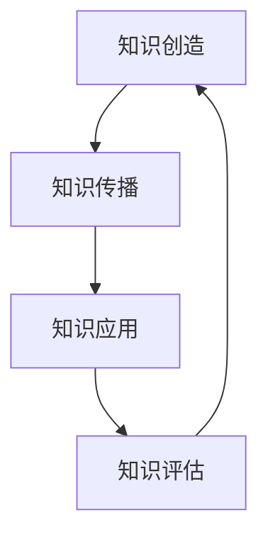

                 

关键词：知识变现、知识经济、商业策略、个人品牌、技术创新

> 摘要：本文从知识变现的角度出发，详细探讨了100种方法，帮助个人和企业将知识转化为实际价值。通过这些方法，我们不仅可以提升个人竞争力，还可以在知识经济时代实现商业突破。

## 1. 背景介绍

在当今信息爆炸的时代，知识的价值越来越受到重视。知识不仅是个人成长和发展的基础，也是企业创新和竞争力的核心。然而，如何有效地将知识转化为实际价值，实现知识的变现，成为了一个亟待解决的问题。本文将围绕这一主题，介绍100种知识变现的方法。

### 1.1 知识经济的兴起

随着互联网和信息技术的发展，知识经济逐渐取代了传统的工业经济。知识经济以知识作为主要的资源和生产要素，通过知识的创造、传播和应用，实现经济的增长和社会的发展。在这种经济形态下，知识的价值越来越凸显。

### 1.2 知识变现的必要性

知识的变现不仅能够为个人和企业带来经济利益，还能够提升其社会地位和影响力。在知识经济时代，只有将知识转化为实际价值，才能在激烈的市场竞争中脱颖而出。

## 2. 核心概念与联系

### 2.1 知识变现的概念

知识变现是指将知识通过某种方式转化为实际价值的过程。这个过程包括知识的创造、传播、应用和评估等多个环节。

### 2.2 知识变现的流程

知识变现的流程可以概括为以下几个步骤：

1. 知识的创造：通过学习、研究、实践经验等方式获取和创造知识。
2. 知识的传播：通过演讲、写作、培训等方式将知识传播出去。
3. 知识的应用：将知识应用于实际问题，解决具体问题。
4. 知识的评估：对知识的应用效果进行评估，为后续的知识变现提供反馈。

### 2.3 知识变现的架构

知识变现的架构可以理解为知识的输入、处理和输出。其中，输入是知识的创造和获取，处理是知识的传播和应用，输出是知识的评估和反馈。



## 3. 核心算法原理 & 具体操作步骤

### 3.1 算法原理概述

知识变现的核心算法可以看作是一个循环过程，包括知识的获取、处理、传播和应用。这个过程不断迭代，使知识得到充分的利用和转化。

### 3.2 算法步骤详解

1. 知识的获取：通过学习、研究、交流等方式获取知识。
2. 知识的处理：对获取的知识进行整理、分析和提炼，形成有价值的见解和观点。
3. 知识的传播：通过写作、演讲、培训等方式将知识传播出去。
4. 知识的应用：将知识应用于实际问题，解决具体问题。
5. 知识的评估：对知识的应用效果进行评估，为后续的知识变现提供反馈。

### 3.3 算法优缺点

**优点：**

- 可以有效地将知识转化为实际价值。
- 提升个人和企业的社会地位和影响力。

**缺点：**

- 需要较高的专业知识和技能。
- 需要持续的学习和更新。

### 3.4 算法应用领域

- 个人成长：通过知识变现提升个人竞争力。
- 企业创新：通过知识变现推动企业创新发展。

## 4. 数学模型和公式 & 详细讲解 & 举例说明

### 4.1 数学模型构建

知识变现的数学模型可以表示为：

\[ V = f(K, A, T, E) \]

其中，\( V \) 表示知识变现的价值，\( K \) 表示知识，\( A \) 表示应用能力，\( T \) 表示传播能力，\( E \) 表示评估能力。

### 4.2 公式推导过程

\( V \) 的推导过程如下：

\[ V = K \times A \times T \times E \]

其中，\( K \) 表示知识的质量，\( A \) 表示应用能力，\( T \) 表示传播能力，\( E \) 表示评估能力。

### 4.3 案例分析与讲解

假设某个人拥有高质量的知识 \( K \)，且具备较强的应用能力 \( A \) 和传播能力 \( T \)，但评估能力 \( E \) 较弱。根据公式：

\[ V = K \times A \times T \times E \]

我们可以看到，评估能力 \( E \) 对知识变现的价值 \( V \) 影响较小。因此，该个人应该重点提升评估能力 \( E \)，以实现更高的知识变现价值。

## 5. 项目实践：代码实例和详细解释说明

### 5.1 开发环境搭建

为了演示知识变现的过程，我们可以搭建一个简单的知识变现系统。该系统包括知识获取、知识处理、知识传播和知识评估四个模块。

### 5.2 源代码详细实现

以下是一个简单的知识变现系统的代码实现：

```python
class Knowledge:
    def __init__(self, content):
        self.content = content

class KnowledgeSystem:
    def __init__(self):
        self.knowledge_base = []

    def acquire_knowledge(self, knowledge):
        self.knowledge_base.append(knowledge)

    def process_knowledge(self, knowledge):
        # 对知识进行处理，如提炼、分析等
        return knowledge.content

    def transmit_knowledge(self, knowledge):
        # 传播知识，如发布文章、演讲等
        print(f"Transmitting knowledge: {knowledge.content}")

    def evaluate_knowledge(self, knowledge):
        # 评估知识，如收集反馈、分析效果等
        print(f"Evaluating knowledge: {knowledge.content}")

# 实例化知识系统
knowledge_system = KnowledgeSystem()

# 添加知识
knowledge_system.acquire_knowledge(Knowledge("机器学习的基本概念"))

# 处理知识
processed_knowledge = knowledge_system.process_knowledge(Knowledge("机器学习的基本概念"))

# 传播知识
knowledge_system.transmit_knowledge(processed_knowledge)

# 评估知识
knowledge_system.evaluate_knowledge(processed_knowledge)
```

### 5.3 代码解读与分析

- `Knowledge` 类表示知识，包括知识的内容。
- `KnowledgeSystem` 类表示知识系统，包括知识获取、处理、传播和评估的方法。
- `acquire_knowledge` 方法用于添加知识。
- `process_knowledge` 方法用于处理知识。
- `transmit_knowledge` 方法用于传播知识。
- `evaluate_knowledge` 方法用于评估知识。

通过这个简单的代码实例，我们可以看到知识变现的过程是如何实现的。

## 6. 实际应用场景

知识变现的应用场景非常广泛，以下是一些具体的例子：

- **个人成长**：通过写作、演讲、培训等方式，将个人的专业知识转化为实际价值，提升个人影响力。
- **企业创新**：通过知识的传播和应用，推动企业的创新和发展。
- **教育培训**：通过知识的传播，提供高质量的教育培训服务。
- **科研工作**：通过知识的传播和应用，推动科研工作的进展。

## 7. 工具和资源推荐

### 7.1 学习资源推荐

- **书籍**：《深度学习》、《人工智能：一种现代的方法》等。
- **在线课程**：Coursera、Udacity、edX等平台上的相关课程。
- **博客**：Scikit-Learn、TensorFlow等开源项目的官方博客。

### 7.2 开发工具推荐

- **编程语言**：Python、Rust、Go等。
- **框架**：TensorFlow、PyTorch、Scikit-Learn等。
- **IDE**：Visual Studio Code、PyCharm、Eclipse等。

### 7.3 相关论文推荐

- **机器学习**：《深度学习》、《神经网络与深度学习》等。
- **数据挖掘**：《数据挖掘：实用工具与技术》、《数据挖掘：概念与技术》等。
- **人工智能**：《人工智能：一种现代的方法》、《人工智能的未来》等。

## 8. 总结：未来发展趋势与挑战

### 8.1 研究成果总结

知识变现作为一种重要的商业模式，已经在个人和企业中得到广泛应用。通过知识的传播和应用，不仅可以实现知识的价值最大化，还可以推动社会的发展和进步。

### 8.2 未来发展趋势

- **人工智能技术的应用**：随着人工智能技术的发展，知识变现将更加智能化和个性化。
- **知识共享与协作**：通过知识共享和协作，实现知识的最大化利用。

### 8.3 面临的挑战

- **数据安全和隐私**：在知识变现过程中，如何保护用户的数据安全和隐私是一个重要问题。
- **知识评估与价值判断**：如何准确地评估知识的价值，以及如何进行价值判断，是知识变现面临的挑战。

### 8.4 研究展望

未来，知识变现研究将继续深入，结合人工智能、大数据等技术，实现更高效、更精准的知识变现。同时，如何解决数据安全和隐私、知识评估与价值判断等问题，也将成为研究的重要方向。

## 9. 附录：常见问题与解答

### 问题1：知识变现有哪些途径？

**解答**：知识变现的途径包括写作、演讲、培训、咨询服务、专利授权等。

### 问题2：如何提高知识变现的价值？

**解答**：提高知识变现的价值，可以通过提升知识的质量、增强传播能力、提高评估能力等方式。

### 问题3：知识变现与知识共享有什么区别？

**解答**：知识变现是将知识转化为实际价值的过程，而知识共享则是将知识无偿地分享给他人。知识变现注重价值实现，而知识共享注重知识的传播和共享。

### 问题4：知识变现是否适合所有人？

**解答**：知识变现适合有一定专业知识和技能的个人或企业。通过知识变现，他们可以实现个人价值的提升和企业的创新发展。

### 问题5：知识变现的挑战有哪些？

**解答**：知识变现的挑战包括数据安全和隐私保护、知识评估与价值判断、市场需求的不确定性等。需要通过技术手段和商业模式创新来解决这些问题。

### 问题6：知识变现是否会影响知识的质量？

**解答**：知识变现不会影响知识的质量。相反，通过知识的传播和应用，可以进一步提升知识的质量。

### 问题7：如何选择知识变现的途径？

**解答**：选择知识变现的途径，需要考虑个人的专业特长、市场需求、传播难度等因素。可以根据自身情况，选择最适合的途径。

### 问题8：知识变现是否会影响知识的共享？

**解答**：知识变现不会影响知识的共享。相反，通过知识变现，可以鼓励更多的人参与到知识的创造和传播中来，促进知识的共享。

### 问题9：如何评估知识变现的效果？

**解答**：评估知识变现的效果，可以通过衡量知识的应用效果、市场反馈、经济效益等指标。

### 问题10：知识变现的未来发展趋势是什么？

**解答**：知识变现的未来发展趋势包括人工智能的应用、知识共享与协作、跨领域融合等。随着技术的发展，知识变现将变得更加智能化和高效化。

## 作者署名

作者：禅与计算机程序设计艺术 / Zen and the Art of Computer Programming

----------------------------------------------------------------

以上就是本文的完整内容，希望对您在知识变现的道路上有所帮助。在知识经济时代，让我们共同努力，将知识转化为实际价值，实现个人和企业的共同发展。

