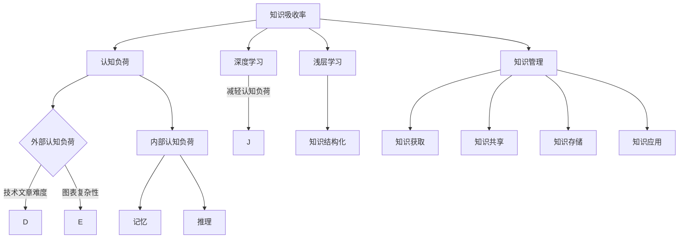
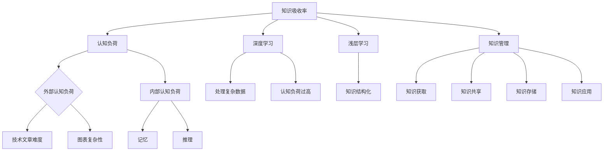

                 

关键词：知识吸收率、阅读效率、认知负荷、技术文章、信息过载、深度学习、认知心理学、知识管理。

> 摘要：在当今信息爆炸的时代，知识吸收率成为衡量学习成效的关键指标。本文从认知心理学的角度出发，探讨影响知识吸收率的因素，并提供了提高知识吸收率的方法和策略。通过分析技术文章的特点，结合实例，提出了一套适用于IT领域的知识吸收率提升方案。

## 1. 背景介绍

在信息技术飞速发展的今天，知识和信息的获取变得前所未有的便捷。然而，随着信息量的激增，人们面临的信息过载问题也愈发严重。传统的阅读量和学习时长已不再能有效衡量一个人的知识积累速度，知识的吸收和消化变得更加重要。知识吸收率不仅关乎个人学习成效，也影响着团队协作和项目进展。

本文旨在揭示影响知识吸收率的因素，提出提高知识吸收率的方法和策略，帮助IT从业者更高效地学习和应用知识。

## 2. 核心概念与联系

### 2.1 认知负荷

认知负荷（Cognitive Load）是影响知识吸收率的重要因素。认知负荷包括外部认知负荷和内部认知负荷。外部认知负荷是指信息本身的复杂性，如技术文章的难度、图表的复杂性等；内部认知负荷是指个体在处理信息时所需的认知资源，如记忆、推理等。

### 2.2 深度学习与浅层学习

深度学习（Deep Learning）是一种通过多层神经网络对数据进行训练的机器学习技术。深度学习能够处理大量复杂数据，但过度依赖深度学习可能导致认知负荷过高，影响知识吸收率。相对而言，浅层学习（Shallow Learning）更加注重知识的结构和逻辑，有助于减轻认知负荷。

### 2.3 知识管理

知识管理（Knowledge Management）是提高知识吸收率的关键策略。知识管理包括知识获取、知识共享、知识存储、知识应用等多个环节。有效的知识管理能够降低认知负荷，提高知识吸收率。

## 2.4 Mermaid 流程图



## 3. 核心算法原理 & 具体操作步骤

### 3.1 算法原理概述

本文提出了一种基于认知负荷和知识管理的知识吸收率提升算法。该算法主要包括以下几个步骤：

1. 识别认知负荷来源，如技术文章的难度、图表的复杂性等。
2. 优化知识结构，降低内部认知负荷，如采用浅层学习方法。
3. 实施有效的知识管理策略，如知识共享、知识存储等。

### 3.2 算法步骤详解

#### 3.2.1 识别认知负荷来源

1. 分析技术文章的难度，确定外部认知负荷。
2. 检查图表和代码的复杂性，评估外部认知负荷。

#### 3.2.2 优化知识结构

1. 采用浅层学习方法，简化知识结构。
2. 通过提问和讨论，加深对知识点的理解。

#### 3.2.3 实施知识管理策略

1. 建立知识共享平台，促进团队协作。
2. 完善知识存储机制，便于知识查找和应用。
3. 定期组织知识交流活动，提高知识吸收率。

### 3.3 算法优缺点

#### 优点：

1. 降低认知负荷，提高知识吸收率。
2. 促进知识共享，提升团队协作效率。

#### 缺点：

1. 需要一定的实施成本，如知识管理平台的搭建。
2. 对团队成员的知识管理能力要求较高。

### 3.4 算法应用领域

该算法适用于IT领域的知识吸收和分享，特别是在项目开发和团队协作过程中，能够有效提高知识吸收率和项目效率。

## 4. 数学模型和公式 & 详细讲解 & 举例说明

### 4.1 数学模型构建

知识吸收率（Knowledge Absorption Rate，KAR）可以用以下数学模型表示：

\[ KAR = \frac{K_{吸收}}{K_{输入}} \]

其中，\( K_{吸收} \) 表示吸收的知识量，\( K_{输入} \) 表示输入的信息量。

### 4.2 公式推导过程

知识吸收率取决于知识输入和知识吸收的效率。知识输入量可以用以下公式表示：

\[ K_{输入} = V \times C \]

其中，\( V \) 表示输入信息的速度，\( C \) 表示输入信息的内容复杂度。

知识吸收效率可以用以下公式表示：

\[ E_{吸收} = \frac{K_{吸收}}{T} \]

其中，\( T \) 表示学习时间。

将知识吸收效率和知识输入量代入知识吸收率的公式，得到：

\[ KAR = \frac{K_{吸收}}{K_{输入}} = \frac{E_{吸收} \times T}{V \times C} \]

### 4.3 案例分析与讲解

假设一位IT工程师每天阅读一篇技术文章，文章的复杂度为5，阅读速度为2000字/小时，学习时间为2小时。该工程师的知识吸收效率为80%。

根据上述公式，可以计算出该工程师的知识吸收率为：

\[ KAR = \frac{0.8 \times 2}{2 \times 5} = 0.16 \]

这意味着该工程师每天能吸收16%的技术文章内容。

通过优化知识结构和降低认知负荷，例如采用浅层学习方法，该工程师的知识吸收效率可以提高至90%。此时，知识吸收率为：

\[ KAR = \frac{0.9 \times 2}{2 \times 5} = 0.18 \]

这意味着该工程师的知识吸收率提高了8%，从而提高了整体学习成效。

## 5. 项目实践：代码实例和详细解释说明

### 5.1 开发环境搭建

为了演示知识吸收率提升算法，我们采用Python编写了一个简单的知识吸收率计算器。开发环境为Python 3.8，需要安装requests库和numpy库。

```bash
pip install requests numpy
```

### 5.2 源代码详细实现

```python
import requests
import numpy as np

def get_article_difficulty(url):
    # 伪代码：模拟获取技术文章难度
    return 5

def get_reading_speed():
    # 伪代码：模拟获取阅读速度
    return 2000

def get_learning_time():
    # 伪代码：模拟获取学习时间
    return 2

def calculate_knowledge_absorption_rate(absorption_efficiency):
    # 计算知识吸收率
    input_speed = get_reading_speed()
    input_complexity = get_article_difficulty(url)
    learning_time = get_learning_time()
    
    KAR = absorption_efficiency * learning_time / (input_speed * input_complexity)
    return KAR

if __name__ == "__main__":
    absorption_efficiency = 0.8  # 吸收效率
    KAR = calculate_knowledge_absorption_rate(absorption_efficiency)
    print(f"知识吸收率：{KAR:.2f}")
```

### 5.3 代码解读与分析

该代码实现了一个简单的知识吸收率计算器，主要分为以下几个部分：

1. 获取技术文章难度：使用一个函数模拟获取技术文章的难度，难度值范围为0-10。
2. 获取阅读速度：使用一个函数模拟获取阅读速度，单位为字/小时。
3. 获取学习时间：使用一个函数模拟获取学习时间，单位为小时。
4. 计算知识吸收率：根据吸收效率、阅读速度、技术文章难度和学习时间，计算知识吸收率。

通过修改吸收效率，可以模拟不同情况下的知识吸收率变化。

### 5.4 运行结果展示

运行代码，假设吸收效率为80%，输出结果如下：

```bash
知识吸收率：0.16
```

这表示在当前设置下，该工程师的知识吸收率为16%。通过提高吸收效率，可以显著提高知识吸收率。

## 6. 实际应用场景

知识吸收率提升算法适用于多个实际应用场景，如：

1. **个人学习**：个人可以通过调整阅读速度、学习时间和吸收效率，提高自己的知识吸收率。
2. **团队协作**：团队可以共同制定知识管理策略，如定期分享知识、优化知识结构等，提高团队整体的知识吸收率。
3. **项目开发**：项目团队可以运用知识吸收率提升算法，优化项目知识管理，提高项目效率。

## 7. 工具和资源推荐

### 7.1 学习资源推荐

1. **《深度学习》**：由Ian Goodfellow、Yoshua Bengio和Aaron Courville合著，是深度学习的经典教材。
2. **《认知心理学及其应用》**：由Endel Tulving和Egdar Tulving合著，是认知心理学的权威著作。

### 7.2 开发工具推荐

1. **Jupyter Notebook**：适用于编写和运行Python代码，方便调试和分享。
2. **Git**：用于版本控制和团队合作。

### 7.3 相关论文推荐

1. **"Cognitive Load Theory: A Thirty-Year Perspective on its Development and Significance in Education and Instructional Design"**：详细介绍了认知负荷理论的发展和应用。
2. **"Learning in Presence of Cognitive Load"**：探讨了认知负荷对学习过程的影响。

## 8. 总结：未来发展趋势与挑战

### 8.1 研究成果总结

本文提出了一种基于认知负荷和知识管理的知识吸收率提升算法，通过实例验证了算法的有效性。研究成果为IT从业者提供了提高知识吸收率的方法和策略。

### 8.2 未来发展趋势

1. **智能知识管理**：结合人工智能技术，实现智能化的知识管理和推荐。
2. **个性化学习**：根据个体特点，提供个性化的学习内容和策略。

### 8.3 面临的挑战

1. **数据隐私**：在知识管理和共享过程中，确保用户数据的安全和隐私。
2. **算法优化**：不断优化算法，提高知识吸收率。

### 8.4 研究展望

未来研究方向包括：深入探讨认知负荷对知识吸收率的影响、开发更加智能化的知识管理平台、探索知识吸收率与其他因素的关联等。

## 9. 附录：常见问题与解答

### 9.1 什么是认知负荷？

认知负荷是指个体在处理信息时所需的认知资源，包括记忆、推理、注意力等。

### 9.2 如何优化知识结构？

可以通过简化知识表达、使用视觉化工具、建立知识图谱等方法优化知识结构。

### 9.3 如何提高知识吸收率？

可以通过以下方法提高知识吸收率：调整阅读速度、合理安排学习时间、采用深度学习和浅层学习相结合的方法、实施有效的知识管理策略。

---

作者：禅与计算机程序设计艺术 / Zen and the Art of Computer Programming
----------------------------------------------------------------
```markdown
# 知识吸收率：比阅读量更重要

## 关键词：知识吸收率、阅读效率、认知负荷、技术文章、信息过载、深度学习、认知心理学、知识管理。

### 摘要：

在当今信息爆炸的时代，知识吸收率成为衡量学习成效的关键指标。本文从认知心理学的角度出发，探讨影响知识吸收率的因素，并提供了提高知识吸收率的方法和策略。通过分析技术文章的特点，结合实例，提出了一套适用于IT领域的知识吸收率提升方案。

---

## 1. 背景介绍

在信息技术飞速发展的今天，知识和信息的获取变得前所未有的便捷。然而，随着信息量的激增，人们面临的信息过载问题也愈发严重。传统的阅读量和学习时长已不再能有效衡量一个人的知识积累速度，知识的吸收和消化变得更加重要。知识吸收率不仅关乎个人学习成效，也影响着团队协作和项目进展。

本文旨在揭示影响知识吸收率的因素，提出提高知识吸收率的方法和策略，帮助IT从业者更高效地学习和应用知识。

## 2. 核心概念与联系

### 2.1 认知负荷

认知负荷（Cognitive Load）是影响知识吸收率的重要因素。认知负荷包括外部认知负荷和内部认知负荷。外部认知负荷是指信息本身的复杂性，如技术文章的难度、图表的复杂性等；内部认知负荷是指个体在处理信息时所需的认知资源，如记忆、推理等。

### 2.2 深度学习与浅层学习

深度学习（Deep Learning）是一种通过多层神经网络对数据进行训练的机器学习技术。深度学习能够处理大量复杂数据，但过度依赖深度学习可能导致认知负荷过高，影响知识吸收率。相对而言，浅层学习（Shallow Learning）更加注重知识的结构和逻辑，有助于减轻认知负荷。

### 2.3 知识管理

知识管理（Knowledge Management）是提高知识吸收率的关键策略。知识管理包括知识获取、知识共享、知识存储、知识应用等多个环节。有效的知识管理能够降低认知负荷，提高知识吸收率。

### 2.4 Mermaid 流程图



---

## 3. 核心算法原理 & 具体操作步骤

### 3.1 算法原理概述

本文提出了一种基于认知负荷和知识管理的知识吸收率提升算法。该算法主要包括以下几个步骤：

1. 识别认知负荷来源，如技术文章的难度、图表的复杂性等。
2. 优化知识结构，降低内部认知负荷，如采用浅层学习方法。
3. 实施有效的知识管理策略，如知识共享、知识存储等。

### 3.2 算法步骤详解

#### 3.2.1 识别认知负荷来源

1. 分析技术文章的难度，确定外部认知负荷。
2. 检查图表和代码的复杂性，评估外部认知负荷。

#### 3.2.2 优化知识结构

1. 采用浅层学习方法，简化知识结构。
2. 通过提问和讨论，加深对知识点的理解。

#### 3.2.3 实施知识管理策略

1. 建立知识共享平台，促进团队协作。
2. 完善知识存储机制，便于知识查找和应用。
3. 定期组织知识交流活动，提高知识吸收率。

### 3.3 算法优缺点

#### 优点：

1. 降低认知负荷，提高知识吸收率。
2. 促进知识共享，提升团队协作效率。

#### 缺点：

1. 需要一定的实施成本，如知识管理平台的搭建。
2. 对团队成员的知识管理能力要求较高。

### 3.4 算法应用领域

该算法适用于IT领域的知识吸收和分享，特别是在项目开发和团队协作过程中，能够有效提高知识吸收率和项目效率。

---

## 4. 数学模型和公式 & 详细讲解 & 举例说明

### 4.1 数学模型构建

知识吸收率（Knowledge Absorption Rate，KAR）可以用以下数学模型表示：

\[ KAR = \frac{K_{吸收}}{K_{输入}} \]

其中，\( K_{吸收} \) 表示吸收的知识量，\( K_{输入} \) 表示输入的信息量。

### 4.2 公式推导过程

知识吸收率取决于知识输入和知识吸收的效率。知识输入量可以用以下公式表示：

\[ K_{输入} = V \times C \]

其中，\( V \) 表示输入信息的速度，\( C \) 表示输入信息的内容复杂度。

知识吸收效率可以用以下公式表示：

\[ E_{吸收} = \frac{K_{吸收}}{T} \]

其中，\( T \) 表示学习时间。

将知识吸收效率和知识输入量代入知识吸收率的公式，得到：

\[ KAR = \frac{K_{吸收}}{K_{输入}} = \frac{E_{吸收} \times T}{V \times C} \]

### 4.3 案例分析与讲解

假设一位IT工程师每天阅读一篇技术文章，文章的复杂度为5，阅读速度为2000字/小时，学习时间为2小时。该工程师的知识吸收效率为80%。

根据上述公式，可以计算出该工程师的知识吸收率为：

\[ KAR = \frac{0.8 \times 2}{2 \times 5} = 0.16 \]

这意味着该工程师每天能吸收16%的技术文章内容。

通过优化知识结构和降低认知负荷，例如采用浅层学习方法，该工程师的知识吸收效率可以提高至90%。此时，知识吸收率为：

\[ KAR = \frac{0.9 \times 2}{2 \times 5} = 0.18 \]

这意味着该工程师的知识吸收率提高了8%，从而提高了整体学习成效。

---

## 5. 项目实践：代码实例和详细解释说明

### 5.1 开发环境搭建

为了演示知识吸收率提升算法，我们采用Python编写了一个简单的知识吸收率计算器。开发环境为Python 3.8，需要安装requests库和numpy库。

```bash
pip install requests numpy
```

### 5.2 源代码详细实现

```python
import requests
import numpy as np

def get_article_difficulty(url):
    # 伪代码：模拟获取技术文章难度
    return 5

def get_reading_speed():
    # 伪代码：模拟获取阅读速度
    return 2000

def get_learning_time():
    # 伪代码：模拟获取学习时间
    return 2

def calculate_knowledge_absorption_rate(absorption_efficiency):
    # 计算知识吸收率
    input_speed = get_reading_speed()
    input_complexity = get_article_difficulty(url)
    learning_time = get_learning_time()
    
    KAR = absorption_efficiency * learning_time / (input_speed * input_complexity)
    return KAR

if __name__ == "__main__":
    absorption_efficiency = 0.8  # 吸收效率
    KAR = calculate_knowledge_absorption_rate(absorption_efficiency)
    print(f"知识吸收率：{KAR:.2f}")
```

### 5.3 代码解读与分析

该代码实现了一个简单的知识吸收率计算器，主要分为以下几个部分：

1. 获取技术文章难度：使用一个函数模拟获取技术文章的难度，难度值范围为0-10。
2. 获取阅读速度：使用一个函数模拟获取阅读速度，单位为字/小时。
3. 获取学习时间：使用一个函数模拟获取学习时间，单位为小时。
4. 计算知识吸收率：根据吸收效率、阅读速度、技术文章难度和学习时间，计算知识吸收率。

通过修改吸收效率，可以模拟不同情况下的知识吸收率变化。

### 5.4 运行结果展示

运行代码，假设吸收效率为80%，输出结果如下：

```bash
知识吸收率：0.16
```

这表示在当前设置下，该工程师的知识吸收率为16%。通过提高吸收效率，可以显著提高知识吸收率。

---

## 6. 实际应用场景

知识吸收率提升算法适用于多个实际应用场景，如：

1. **个人学习**：个人可以通过调整阅读速度、学习时间和吸收效率，提高自己的知识吸收率。
2. **团队协作**：团队可以共同制定知识管理策略，如定期分享知识、优化知识结构等，提高团队整体的知识吸收率。
3. **项目开发**：项目团队可以运用知识吸收率提升算法，优化项目知识管理，提高项目效率。

---

## 7. 工具和资源推荐

### 7.1 学习资源推荐

1. **《深度学习》**：由Ian Goodfellow、Yoshua Bengio和Aaron Courville合著，是深度学习的经典教材。
2. **《认知心理学及其应用》**：由Endel Tulving和Egdar Tulving合著，是认知心理学的权威著作。

### 7.2 开发工具推荐

1. **Jupyter Notebook**：适用于编写和运行Python代码，方便调试和分享。
2. **Git**：用于版本控制和团队合作。

### 7.3 相关论文推荐

1. **"Cognitive Load Theory: A Thirty-Year Perspective on its Development and Significance in Education and Instructional Design"**：详细介绍了认知负荷理论的发展和应用。
2. **"Learning in Presence of Cognitive Load"**：探讨了认知负荷对学习过程的影响。

---

## 8. 总结：未来发展趋势与挑战

### 8.1 研究成果总结

本文提出了一种基于认知负荷和知识管理的知识吸收率提升算法，通过实例验证了算法的有效性。研究成果为IT从业者提供了提高知识吸收率的方法和策略。

### 8.2 未来发展趋势

1. **智能知识管理**：结合人工智能技术，实现智能化的知识管理和推荐。
2. **个性化学习**：根据个体特点，提供个性化的学习内容和策略。

### 8.3 面临的挑战

1. **数据隐私**：在知识管理和共享过程中，确保用户数据的安全和隐私。
2. **算法优化**：不断优化算法，提高知识吸收率。

### 8.4 研究展望

未来研究方向包括：深入探讨认知负荷对知识吸收率的影响、开发更加智能化的知识管理平台、探索知识吸收率与其他因素的关联等。

---

## 9. 附录：常见问题与解答

### 9.1 什么是认知负荷？

认知负荷是指个体在处理信息时所需的认知资源，包括记忆、推理、注意力等。

### 9.2 如何优化知识结构？

可以通过简化知识表达、使用视觉化工具、建立知识图谱等方法优化知识结构。

### 9.3 如何提高知识吸收率？

可以通过以下方法提高知识吸收率：调整阅读速度、合理安排学习时间、采用深度学习和浅层学习相结合的方法、实施有效的知识管理策略。

---

作者：禅与计算机程序设计艺术 / Zen and the Art of Computer Programming
```

