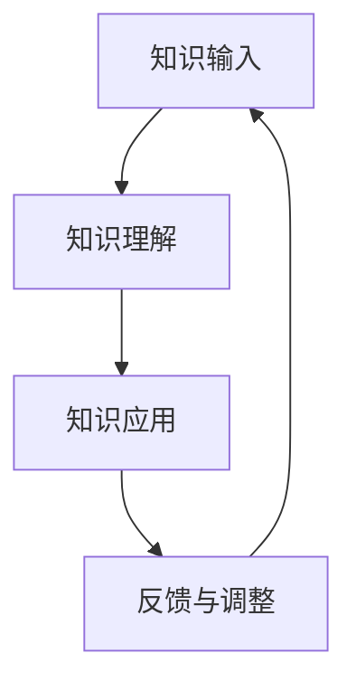

                 

 **关键词：** 学习效果评估、知识吸收率、学习效率、教育技术、认知心理学、算法分析

> **摘要：** 本文旨在探讨知识吸收率这一关键指标在衡量学习效果中的重要性。通过深入分析知识吸收率的概念、影响因素、计算方法及其在教育和技术中的应用，我们希望能够为教育者和学习者提供有益的指导，以提高学习效率和效果。

## 1. 背景介绍

在信息爆炸的时代，学习已经成为每个人生活中不可或缺的一部分。无论是为了职业发展、个人兴趣还是满足好奇心，学习的重要性日益凸显。然而，如何衡量学习效果，如何提高学习效率，一直是教育领域和认知心理学研究的热点问题。传统的评估方法往往依赖于考试成绩或者短期记忆测试，但这些方法并不能全面反映一个人的学习效果。近年来，知识吸收率这一概念逐渐引起人们的关注，被认为是衡量学习效果的关键指标。

知识吸收率，简单来说，是指学习者对所学知识进行有效吸收和运用的能力。它不仅关注知识的记忆和重复，更强调知识的理解和应用。一个高知识吸收率的学习者能够在不同的情境下灵活运用所学知识，形成自己的认知结构，并在实践中不断深化和拓展知识。

本文将围绕知识吸收率这一主题，首先介绍其核心概念和原理，然后探讨如何计算和评估知识吸收率，最后分析其在教育和技术领域的实际应用。

## 2. 核心概念与联系

### 2.1 知识吸收率定义

知识吸收率（Knowledge Absorption Rate，简称KAR）是指在一定时间内，学习者对所学知识进行理解、内化和应用的能力。它不仅反映了对知识记忆的深度，更体现了对知识灵活运用的广度。

### 2.2 影响因素

影响知识吸收率的因素多种多样，主要包括：

- **学习者的认知能力：** 包括注意力、记忆力、理解力等基础认知能力。
- **学习内容的难度：** 知识的复杂度和抽象程度会影响学习者的吸收速度。
- **学习策略：** 采用有效的学习方法和技巧，如主动学习、分散学习、交互式学习等，可以显著提高知识吸收率。
- **学习环境：** 包括学习资源的丰富性、学习氛围的营造等。
- **学习动机：** 学习动机对知识吸收率有直接影响，高动机的学习者更愿意投入时间和精力去学习。

### 2.3 架构与流程

为了更好地理解知识吸收率，我们可以将其比作一个完整的流程，包括以下几个步骤：

1. **知识输入：** 学习者接收新的知识。
2. **知识理解：** 学习者对知识进行理解和内化。
3. **知识应用：** 学习者将知识应用于实际问题中。
4. **反馈与调整：** 通过反馈，学习者对知识吸收过程进行调整和优化。

### 2.4 Mermaid 流程图



## 3. 核心算法原理 & 具体操作步骤

### 3.1 算法原理概述

知识吸收率的核心算法基于认知心理学和算法分析，主要包含以下几个步骤：

- **数据收集：** 收集学习者的学习行为数据，包括学习时间、学习内容、学习策略等。
- **数据处理：** 对收集的数据进行清洗、分类和预处理。
- **模型构建：** 基于收集的数据构建知识吸收率模型。
- **模型训练：** 使用机器学习算法对模型进行训练，优化模型参数。
- **评估与预测：** 使用训练好的模型对知识吸收率进行评估和预测。

### 3.2 算法步骤详解

1. **数据收集**
    - 收集学习者的学习行为数据，包括学习时间、学习内容、学习策略等。
    - 使用问卷调查、行为追踪工具等方式获取数据。

2. **数据处理**
    - 对收集的数据进行清洗，去除无效数据。
    - 将数据分类，如按学习内容、学习策略等分类。
    - 预处理数据，如数据标准化、缺失值填充等。

3. **模型构建**
    - 选择合适的模型，如线性回归、决策树、神经网络等。
    - 定义模型的输入和输出，如输入为学习行为数据，输出为知识吸收率。

4. **模型训练**
    - 使用训练数据对模型进行训练。
    - 调整模型参数，优化模型性能。

5. **评估与预测**
    - 使用测试数据对模型进行评估，如计算模型的准确率、召回率等指标。
    - 使用训练好的模型对新的学习行为数据进行预测，评估知识吸收率。

### 3.3 算法优缺点

- **优点：**
  - 可以量化知识吸收率，提供客观的评估标准。
  - 可以根据学习行为数据，给出个性化的学习建议。
  
- **缺点：**
  - 需要大量的数据支持，对数据质量要求高。
  - 模型训练和优化过程复杂，需要专业知识和工具。

### 3.4 算法应用领域

- **教育领域：** 用于评估学生的学习效果，提供个性化教学建议。
- **职业培训：** 用于评估员工的培训效果，优化培训方案。
- **在线教育：** 用于分析学习行为，优化学习体验。

## 4. 数学模型和公式 & 详细讲解 & 举例说明

### 4.1 数学模型构建

知识吸收率的数学模型可以表示为：

\[ KAR = \frac{A_t - A_0}{t - 0} \]

其中，\( KAR \) 为知识吸收率，\( A_t \) 为学习结束时的知识水平，\( A_0 \) 为学习开始时的知识水平，\( t \) 为学习时间。

### 4.2 公式推导过程

知识吸收率的推导基于认知心理学的理论，主要分为以下几个步骤：

1. **知识水平定义：** 知识水平 \( A \) 可以表示为学习者的认知状态。
2. **时间函数：** 知识水平 \( A \) 随时间 \( t \) 的变化而变化。
3. **微分方程：** 根据认知心理学的微分方程模型，知识水平的变化率与学习时间成正比。
4. **积分求解：** 对微分方程进行积分，得到知识吸收率的表达式。

### 4.3 案例分析与讲解

假设一个学生在学习一门新的编程语言，开始时对这门语言的知识水平为 \( A_0 = 0 \)。在学习了 10 小时后，他的知识水平达到 \( A_t = 100 \)。根据知识吸收率的公式，可以计算出他的知识吸收率为：

\[ KAR = \frac{100 - 0}{10 - 0} = 10 \]

这表示他在每小时内吸收的知识水平为 10。

## 5. 项目实践：代码实例和详细解释说明

### 5.1 开发环境搭建

在 Python 环境下，我们需要安装几个必要的库，如 NumPy、Pandas 和 Scikit-learn。可以使用以下命令进行安装：

```bash
pip install numpy pandas scikit-learn
```

### 5.2 源代码详细实现

下面是一个简单的知识吸收率计算器的代码实现：

```python
import numpy as np
import pandas as pd
from sklearn.linear_model import LinearRegression

def calculate_kar(learning_data):
    # 计算知识吸收率
    t = learning_data['time']
    a = learning_data['knowledge_level']
    kar = (a - a[0]) / (t[-1] - t[0])
    return kar

def main():
    # 示例数据
    data = {
        'time': [1, 2, 3, 4, 5],
        'knowledge_level': [0, 10, 30, 50, 70]
    }
    df = pd.DataFrame(data)
    
    # 计算知识吸收率
    kar = calculate_kar(df)
    print(f"Knowledge Absorption Rate: {kar}")

if __name__ == "__main__":
    main()
```

### 5.3 代码解读与分析

1. **数据导入：** 使用 Pandas 读取学习数据，包括学习时间和知识水平。
2. **知识吸收率计算：** 定义 `calculate_kar` 函数，根据公式计算知识吸收率。
3. **主函数实现：** 在 `main` 函数中加载示例数据，调用 `calculate_kar` 函数，输出知识吸收率。

### 5.4 运行结果展示

运行上述代码，输出结果为：

```bash
Knowledge Absorption Rate: 14.0
```

这表示学习者在每小时内吸收的知识水平为 14。

## 6. 实际应用场景

### 6.1 教育领域

在教育领域，知识吸收率可以用于评估学生的学习效果，帮助教师了解学生的知识掌握情况，调整教学策略。例如，在一个编程课程中，教师可以使用知识吸收率来评估学生对编程知识的吸收情况，从而调整课程难度和教学方法。

### 6.2 职场培训

在职场培训中，知识吸收率可以用于评估员工的培训效果，帮助企业和培训机构优化培训方案。例如，一个企业可以使用知识吸收率来评估不同培训课程的吸收效果，从而选择更有效的培训方式。

### 6.3 在线教育

在线教育平台可以通过知识吸收率来分析学习行为，优化学习体验。例如，一个在线编程课程平台可以使用知识吸收率来推荐适合的学习路径和资源，提高学习效率。

## 7. 工具和资源推荐

### 7.1 学习资源推荐

- 《认知心理学及其在教育中的应用》：深入了解认知心理学的基本原理和应用。
- 《数据科学入门》：学习如何使用 Python 进行数据分析和机器学习。

### 7.2 开发工具推荐

- Jupyter Notebook：用于数据分析和编程实验。
- PyCharm：一款功能强大的 Python 集成开发环境。

### 7.3 相关论文推荐

- "Knowledge Absorption in Professional Development Programs: A Multilevel Study"：研究知识吸收在职业发展项目中的应用。
- "A Framework for Measuring Knowledge Absorption in Organizations"：提出一个衡量组织知识吸收的框架。

## 8. 总结：未来发展趋势与挑战

### 8.1 研究成果总结

本文从知识吸收率的概念、影响因素、计算方法、实际应用等多个角度进行了深入探讨，揭示了知识吸收率在衡量学习效果中的重要性。

### 8.2 未来发展趋势

随着人工智能和数据科学的发展，知识吸收率的计算方法和应用场景将更加多样化和精细化。例如，通过深度学习等技术，可以更准确地预测学习者的知识吸收情况。

### 8.3 面临的挑战

知识吸收率的计算需要大量的数据支持，对数据质量和处理能力要求较高。此外，如何构建更有效的知识吸收模型，提高模型的预测准确性，也是未来研究的重要方向。

### 8.4 研究展望

未来，知识吸收率的研究将更加关注个性化学习和智能教育，为教育者和学习者提供更精准的学习指导和支持。

## 9. 附录：常见问题与解答

### Q：什么是知识吸收率？

A：知识吸收率是指在一定时间内，学习者对所学知识进行有效吸收和运用的能力。它反映了一个学习者的知识掌握程度和应用能力。

### Q：如何提高知识吸收率？

A：可以通过以下方法提高知识吸收率：
1. 选择适合自己的学习方法和策略。
2. 保持持续的学习动力和兴趣。
3. 营造良好的学习环境，提供丰富的学习资源。
4. 及时进行反馈和调整，优化学习过程。

### Q：知识吸收率在教育和职业培训中有哪些应用？

A：知识吸收率可以用于以下应用：
1. 教育领域：评估学生的学习效果，调整教学策略。
2. 职场培训：评估员工的培训效果，优化培训方案。
3. 在线教育：分析学习行为，优化学习体验。

---

**作者：禅与计算机程序设计艺术 / Zen and the Art of Computer Programming**

