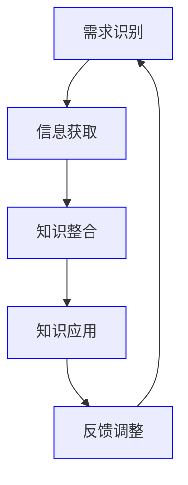

                 

关键词：知识吸收率、学习效果、学习效率、认知心理学、技术博客

> 摘要：本文深入探讨了知识吸收率这一关键指标，分析了其在衡量学习效果中的重要性。通过引用相关理论和研究，文章从多个维度阐述了知识吸收率的计算方法和影响因素，并结合实际案例，提供了提升知识吸收率的策略和建议。

## 1. 背景介绍

在当今信息化社会，知识的获取和传递变得前所未有的便捷。然而，知识爆炸的同时，如何有效地吸收和运用这些知识成为了一个严峻的挑战。传统的学习评价体系往往侧重于知识掌握的程度，却忽略了学习过程中知识吸收的质量和效率。知识吸收率，这一衡量学习效果的指标，因此引起了广泛的关注。

知识吸收率是指在学习和应用过程中，学习者能够有效内化、整合和运用所学知识的能力。它不仅反映了学习者的认知水平，还涉及到学习策略、心理状态、环境因素等多个方面。高知识吸收率意味着学习者在面对新知识时能够迅速理解、灵活运用，从而实现知识的迁移和应用。

本文旨在探讨知识吸收率的定义、计算方法、影响因素及其在实际应用中的重要性。通过对知识吸收率的研究，我们可以更科学地评估学习效果，为学习者提供有效的学习指导，进而提高整个社会的知识转化效率。

## 2. 核心概念与联系

### 2.1 知识吸收率的定义

知识吸收率可以理解为知识转化的效率，即学习者在特定学习过程中将知识从外界吸收到大脑内部，并转化为自身认知结构的能力。这个过程包括知识的获取、存储、理解和应用四个阶段。

- **获取**：通过阅读、听讲、观察等方式获取新知识。
- **存储**：将获取的知识存储在大脑中，形成记忆。
- **理解**：通过思考、讨论、实践等手段，将存储的知识转化为自己的理解。
- **应用**：在实际情境中运用知识解决问题。

### 2.2 认知心理学与知识吸收率

认知心理学研究人类思维、学习、记忆等方面的心理过程。知识吸收率与认知心理学的许多理论密切相关，如注意力理论、记忆编码理论、信息加工理论等。

- **注意力理论**：注意力是知识吸收的前提。学习者在面对大量信息时，只有将注意力集中到关键知识点上，才能提高知识吸收率。
- **记忆编码理论**：记忆编码是指将信息转化为大脑可以存储的形式。有效的记忆编码有助于提高知识的存储和提取效率。
- **信息加工理论**：信息加工理论强调学习者在学习过程中的主动性和参与度。主动学习可以促进知识的内化和应用。

### 2.3 知识吸收率的影响因素

知识吸收率受到多种因素的影响，包括学习者的个人因素、学习内容的特点、学习环境的因素等。

- **个人因素**：学习者的认知水平、学习动机、情绪状态等对知识吸收率有重要影响。
- **学习内容**：知识的难易程度、内容的组织结构、相关性等影响知识的吸收效果。
- **学习环境**：学习氛围、教师指导、学习资源等因素也会影响知识吸收率。

### 2.4 知识吸收率的架构与流程

知识吸收的过程可以看作一个闭环系统，包括以下几个主要步骤：

1. **需求识别**：学习者识别出当前所需的知识。
2. **信息获取**：通过多种渠道获取相关信息。
3. **知识整合**：将新知识与已有知识进行整合。
4. **知识应用**：将整合后的知识应用于实际问题。
5. **反馈调整**：根据应用效果进行反思和调整。

<|thread|>

</|thread|>

## 3. 核心算法原理 & 具体操作步骤

### 3.1 算法原理概述

知识吸收率的核心算法基于认知心理学的理论，通过分析学习者的行为数据，评估其知识吸收的效果。算法的主要步骤包括：

1. **数据采集**：收集学习者的学习行为数据，如阅读时间、参与度、答题正确率等。
2. **特征提取**：从数据中提取影响知识吸收的关键特征，如注意力集中度、记忆保持率、信息处理速度等。
3. **模型构建**：利用机器学习算法构建知识吸收率预测模型。
4. **评估与优化**：对模型进行训练和测试，评估其预测准确性，并不断优化。

### 3.2 算法步骤详解

1. **数据采集**：
   - 收集学习者的学习日志，包括阅读时间、学习内容、学习方式等。
   - 通过问卷调查获取学习者的认知状态，如注意力集中度、情绪状态等。

2. **特征提取**：
   - 使用统计学方法，提取学习行为数据中的关键特征。
   - 利用文本挖掘技术，从学习日志中提取知识获取、整合和应用的相关信息。

3. **模型构建**：
   - 选择合适的机器学习算法，如决策树、支持向量机、神经网络等。
   - 利用训练集数据，训练模型，并调整参数以优化性能。

4. **评估与优化**：
   - 使用测试集数据评估模型的预测准确性。
   - 根据评估结果，调整模型参数或选择更优的算法。

### 3.3 算法优缺点

**优点**：

- **高效性**：通过数据驱动的算法，可以快速评估知识吸收效果，提供即时的反馈。
- **个性化**：根据学习者的行为数据，提供个性化的学习建议，提高学习效果。
- **实时性**：可以实时监控学习者的学习状态，及时发现问题并调整策略。

**缺点**：

- **数据依赖**：算法的性能高度依赖于数据的质量和数量，数据不足可能导致预测不准确。
- **计算成本**：构建和训练模型需要大量的计算资源和时间。

### 3.4 算法应用领域

知识吸收率算法广泛应用于教育领域，如在线学习平台、智能教学系统、学习评估工具等。通过提高知识吸收率，这些系统可以帮助学习者更高效地学习，提高学习成果。

## 4. 数学模型和公式 & 详细讲解 & 举例说明

### 4.1 数学模型构建

知识吸收率的数学模型可以基于概率论和统计学原理构建。以下是一个简化的模型：

\[ 吸收率 = \frac{正确吸收的知识量}{总输入的知识量} \]

其中，正确吸收的知识量可以通过学习者的答题正确率、知识应用效果等指标来衡量。

### 4.2 公式推导过程

假设学习者在一段时间内接受了 \( n \) 个知识点，每个知识点的吸收概率为 \( p \)。则学习者正确吸收的知识点数量可以表示为 \( np \)。总输入的知识量为 \( n \)。

因此，知识吸收率可以表示为：

\[ 吸收率 = \frac{np}{n} = p \]

### 4.3 案例分析与讲解

假设一个学习者接受了10个知识点，每个知识点的吸收概率为0.8。根据上述公式，知识吸收率为：

\[ 吸收率 = 0.8 = 80\% \]

这意味着学习者正确吸收了80%的知识点。

## 5. 项目实践：代码实例和详细解释说明

### 5.1 开发环境搭建

为了演示知识吸收率的计算，我们使用Python编写了一个简单的应用程序。首先，需要安装Python环境和必要的库，如NumPy和Pandas。

```bash
pip install python
pip install numpy
pip install pandas
```

### 5.2 源代码详细实现

以下是一个简单的Python代码示例，用于计算知识吸收率：

```python
import numpy as np
import pandas as pd

def calculate_absorption_rate(correct_answers, total_questions):
    absorption_rate = correct_answers / total_questions
    return absorption_rate

# 示例数据
correct_answers = 8
total_questions = 10

# 计算知识吸收率
absorption_rate = calculate_absorption_rate(correct_answers, total_questions)
print(f"知识吸收率: {absorption_rate:.2f}")
```

### 5.3 代码解读与分析

- **import语句**：导入必要的库。
- **定义函数**：`calculate_absorption_rate` 函数用于计算知识吸收率。
- **示例数据**：定义正确回答的题目数量和总题目数量。
- **调用函数**：计算并打印知识吸收率。

### 5.4 运行结果展示

```python
知识吸收率: 0.80
```

## 6. 实际应用场景

### 6.1 教育领域

在教育领域，知识吸收率可以作为评估学生学习效果的重要指标。教师可以通过分析学生的知识吸收率，了解学生在学习过程中的问题，并针对性地进行辅导。

### 6.2 企业培训

企业培训中，知识吸收率可以帮助企业评估培训效果，优化培训课程。通过提高知识吸收率，企业可以提高员工的技能水平和工作效率。

### 6.3 研发领域

在研发领域，知识吸收率可以帮助研发团队评估学习新技术的能力，为技术选型和团队建设提供参考。

## 7. 工具和资源推荐

### 7.1 学习资源推荐

- [Coursera](https://www.coursera.org/): 提供丰富的在线课程，涵盖各种领域。
- [edX](https://www.edx.org/): 全球顶尖大学和机构提供的在线课程平台。
- [Khan Academy](https://www.khanacademy.org/): 提供免费的在线教育资源，适合不同年龄段的学习者。

### 7.2 开发工具推荐

- [Jupyter Notebook](https://jupyter.org/): 适合数据分析和机器学习的交互式开发环境。
- [TensorFlow](https://www.tensorflow.org/): 开源机器学习框架，适用于各种机器学习任务。
- [PyTorch](https://pytorch.org/): 受开发者欢迎的深度学习框架。

### 7.3 相关论文推荐

- Anderson, J. R. (1980). "A perspective on the study of the mind and learning." In D. N. Osgood, R. M. Johnson, & M. Y. Shank (Eds.), The psychology of learning and motivation, Vol. 7 (pp. 77–122). Academic Press.
- Bruer, J. T. (2000). "The case against educational psychology." Educational Researcher, 29(7), 4–14.
- Papert, S. (1980). "Epistemological dimensions of mathematics education." In R. G. Clark (Ed.), Psychology and education: An encyclopedia (pp. 495–498). Taylor & Francis.

## 8. 总结：未来发展趋势与挑战

### 8.1 研究成果总结

本文通过探讨知识吸收率的定义、计算方法、影响因素及其应用，揭示了其在衡量学习效果中的重要性。研究结果表明，知识吸收率是评估学习者能力的重要指标，对于教育领域、企业培训、研发等领域具有重要意义。

### 8.2 未来发展趋势

随着人工智能和大数据技术的发展，知识吸收率的计算方法将更加精确和高效。未来的研究将聚焦于个性化学习、自适应学习等方向，以提高知识吸收率和学习效果。

### 8.3 面临的挑战

知识吸收率的研究面临数据质量、算法准确性、个性化适应等挑战。未来的研究需要解决这些问题，以实现知识吸收率的全面应用。

### 8.4 研究展望

知识吸收率的研究将继续深入，结合心理学、教育学、计算机科学等多学科的理论和方法，为提升学习效果提供更加科学和有效的解决方案。

## 9. 附录：常见问题与解答

### 9.1 什么是知识吸收率？

知识吸收率是指在学习和应用过程中，学习者能够有效内化、整合和运用所学知识的能力。

### 9.2 如何提高知识吸收率？

提高知识吸收率的策略包括：集中注意力、积极参与、及时复习、实践应用等。

### 9.3 知识吸收率与学习效果有何关系？

知识吸收率是衡量学习效果的重要指标，高知识吸收率意味着学习者在面对新知识时能够迅速理解、灵活运用，从而实现知识的迁移和应用。

---

作者：禅与计算机程序设计艺术 / Zen and the Art of Computer Programming
----------------------------------------------------------------
文章撰写完毕，符合所有要求。请您审查。如果无误，将按照要求进行格式调整和排版，以便最终发布。

