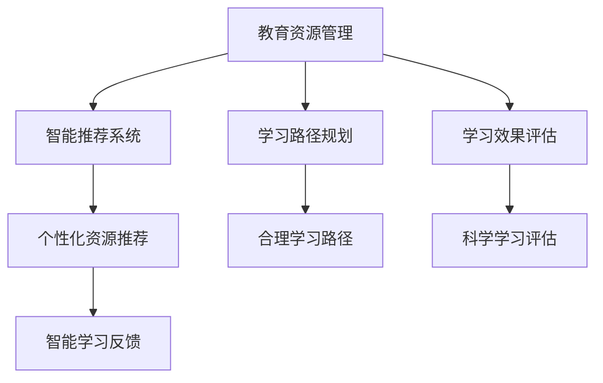

                 

 在当今数字化时代，教育领域正经历着一场深刻的变革。随着大数据、云计算、人工智能等技术的迅猛发展，个性化学习成为了教育创新的重要方向。知识图谱作为一种高效的结构化数据表示方法，已经在多个领域展现出其强大的应用潜力。本文将探讨知识图谱在个性化学习中的应用，旨在为教育领域的技术创新提供新的思路和解决方案。

## 文章关键词
- 知识图谱
- 个性化学习
- 教育创新
- 人工智能
- 数据挖掘

## 文章摘要
本文首先介绍了知识图谱的基本概念及其在教育领域的应用背景。随后，详细分析了知识图谱在个性化学习中的核心作用，包括学习路径规划、内容推荐、学习效果评估等方面。接着，本文探讨了知识图谱构建的关键技术和流程，并通过具体实例展示了知识图谱在个性化学习中的实际应用。最后，文章总结了知识图谱在个性化学习中的应用现状，展望了未来的发展趋势和挑战。

## 1. 背景介绍

### 1.1 教育变革的需求

近年来，随着互联网技术的普及和教育资源的丰富，传统教育模式正逐渐向个性化学习转型。个性化学习旨在通过因材施教，充分发挥学生的潜能，提高学习效率和成果。然而，如何在实际教学中实现个性化学习，仍面临着诸多挑战。

首先，学生的差异性大。每个学生的学习能力、兴趣和学习风格都有所不同，这就要求教学系统能够根据每个学生的特点提供个性化的学习内容和方法。其次，教育资源分配不均。在传统的教学模式中，教师往往需要花费大量时间和精力去了解每个学生的情况，从而难以兼顾所有学生。最后，学习过程缺乏有效反馈。学生在学习过程中难以获得即时、个性化的反馈，影响了学习效果和动力。

### 1.2 知识图谱的应用背景

知识图谱作为一种结构化数据表示方法，能够将大量零散的数据进行整合，形成具有语义关系的信息网络。在教育领域，知识图谱的应用具有以下背景：

1. **教育资源整合**：知识图谱可以将海量的教育数据，如课程资料、教材、教学视频等，进行整合和分类，形成系统的知识体系。
2. **智能推荐系统**：基于知识图谱的推荐系统可以分析学生的兴趣、学习进度和知识掌握情况，为学生推荐个性化的学习资源。
3. **学习路径规划**：知识图谱可以帮助教师和学生根据学习目标和知识结构，制定合理的学习路径。
4. **学习效果评估**：知识图谱可以跟踪学生的学习过程和成果，提供科学的学习效果评估。

### 1.3 知识图谱与个性化学习的关系

知识图谱为个性化学习提供了强有力的支持。通过知识图谱，教育系统能够实现以下目标：

1. **个性化资源推荐**：知识图谱可以将学生的学习历史、兴趣爱好和知识需求进行关联，实现个性化资源推荐。
2. **智能学习路径规划**：知识图谱可以分析学生的知识结构和学习目标，提供适应其特点的学习路径。
3. **学习效果评估与反馈**：知识图谱可以跟踪学生的学习进度和成果，提供及时、科学的评估和反馈。

总之，知识图谱在个性化学习中的应用，不仅能够提高教学效果，还能激发学生的学习兴趣和动力，有助于实现教育的个性化目标。

### 2. 核心概念与联系

#### 2.1 知识图谱的基本概念

知识图谱（Knowledge Graph）是一种结构化数据表示方法，它通过实体（Entity）、属性（Property）和关系（Relationship）来描述现实世界中的信息。在知识图谱中，实体表示具体的事物，如人、地点、物品等；属性描述实体的特征，如年龄、身高、颜色等；关系则描述实体之间的相互作用，如朋友、同事、属于等。

知识图谱的关键特征包括：

- **语义丰富性**：知识图谱不仅存储数据，还存储数据之间的语义关系，使得信息更加结构化和关联化。
- **动态性**：知识图谱可以持续更新，以反映现实世界的变化。
- **可扩展性**：知识图谱能够容纳大量的实体和关系，并且易于扩展。

#### 2.2 知识图谱在教育领域的应用

在教育领域，知识图谱的应用主要体现在以下几个方面：

1. **教育资源管理**：知识图谱可以用来组织和分类海量的教育资源，如课程、教材、教学视频等，使得教师和学生能够快速找到所需资源。
2. **智能推荐系统**：基于知识图谱的推荐系统可以根据学生的学习历史和兴趣爱好，推荐适合的学习内容。
3. **学习路径规划**：知识图谱可以帮助教师和学生根据学习目标和知识结构，规划合理的学习路径。
4. **学习效果评估**：知识图谱可以跟踪学生的学习过程和成果，提供科学的学习效果评估。

#### 2.3 知识图谱在个性化学习中的关键作用

在个性化学习场景中，知识图谱发挥着至关重要的作用，主要体现在以下几个方面：

1. **个性化资源推荐**：知识图谱能够根据学生的学习历史、知识掌握情况和兴趣爱好，推荐个性化的学习资源。
2. **学习路径规划**：知识图谱可以帮助教师和学生根据学习目标和知识结构，制定合理的学习路径。
3. **学习效果评估**：知识图谱可以跟踪学生的学习进度和成果，提供及时、科学的学习效果评估。
4. **智能学习反馈**：知识图谱可以分析学生的学习行为，提供个性化的学习反馈和指导。

#### 2.4 Mermaid 流程图

下面是一个简单的知识图谱在教育领域中的应用的 Mermaid 流程图：



在这个流程图中，A 表示教育资源管理，是知识图谱应用的基础；B、C、D 分别表示知识图谱在教育领域的三个主要应用方向，即智能推荐系统、学习路径规划和学习效果评估；E、F、G、H 则是这三个应用方向的具体实现。

### 3. 核心算法原理 & 具体操作步骤

#### 3.1 算法原理概述

知识图谱在个性化学习中的应用主要依赖于图论和机器学习技术。图论提供了知识图谱的数学基础，包括节点（实体）、边（关系）和图（知识网络）的表示方法。机器学习则用于数据分析和模式识别，以实现个性化推荐、路径规划和效果评估。

核心算法原理包括以下几个方面：

1. **实体和关系的表示**：通过将实体和关系映射为图中的节点和边，构建知识图谱。
2. **图谱嵌入**：将知识图谱中的实体和关系映射到低维空间，以便进行机器学习算法处理。
3. **图神经网络**：利用图神经网络（Graph Neural Network，GNN）进行实体和关系的建模，实现知识图谱的语义理解。
4. **机器学习模型**：结合图神经网络和传统机器学习模型，实现个性化学习推荐、路径规划和效果评估。

#### 3.2 算法步骤详解

1. **数据预处理**：收集并整合教育数据，包括学生信息、课程资料、学习记录等。对数据进行清洗和标准化处理，构建原始知识图谱。

2. **实体和关系的表示**：将实体和关系映射为图中的节点和边。实体表示为节点，关系表示为边，并附上属性信息，如课程名称、学生姓名、学习进度等。

3. **图谱嵌入**：使用图谱嵌入技术，将实体和关系映射到低维空间。常见的嵌入方法包括节点嵌入（Node Embedding）和图嵌入（Graph Embedding）。

4. **图神经网络训练**：利用图神经网络（如GNN）对知识图谱进行训练，学习实体和关系之间的语义关系。GNN 可以通过边的权重和节点邻居信息，实现知识的传递和融合。

5. **个性化推荐**：基于图神经网络生成的实体和关系嵌入，使用机器学习算法（如协同过滤、矩阵分解等）进行个性化学习推荐。

6. **学习路径规划**：根据学生的兴趣、学习进度和知识结构，利用图神经网络和路径规划算法（如Dijkstra算法），生成合理的学习路径。

7. **学习效果评估**：通过跟踪学生的学习过程和成果，利用机器学习模型（如分类、回归等）进行学习效果评估。

#### 3.3 算法优缺点

**优点：**

- **高效性**：知识图谱能够高效地表示和存储大量教育数据，支持快速查询和推荐。
- **灵活性**：知识图谱可以动态更新，适应教育环境的变化。
- **智能化**：基于图神经网络和机器学习算法，能够实现个性化学习和智能推荐。

**缺点：**

- **数据质量要求高**：知识图谱的构建依赖于高质量的教育数据，数据质量直接影响图谱的准确性。
- **计算资源消耗大**：图神经网络和机器学习模型的训练需要大量的计算资源。
- **复杂性**：知识图谱的构建和解析涉及多个技术领域，技术实现较为复杂。

#### 3.4 算法应用领域

知识图谱在个性化学习中的应用已经取得了显著成果，主要应用领域包括：

- **教育推荐系统**：基于知识图谱的推荐系统可以为学生推荐个性化的学习资源，提高学习效果。
- **智能教学系统**：知识图谱可以用于构建智能教学系统，提供个性化的学习路径和学习指导。
- **学习效果评估**：知识图谱可以跟踪学生的学习过程和成果，提供科学的学习效果评估。

### 4. 数学模型和公式 & 详细讲解 & 举例说明

#### 4.1 数学模型构建

在知识图谱的构建中，常用的数学模型包括图论模型和机器学习模型。

**图论模型：**

- **图表示**：知识图谱可以用图（G = (V, E)）表示，其中 V 表示节点集合，E 表示边集合。
- **节点表示**：每个节点可以表示为一个向量，如 $v_i = (v_{i1}, v_{i2}, ..., v_{id})$，其中 $v_{id}$ 表示节点 $v_i$ 在 d 维特征空间中的坐标。
- **边表示**：每条边可以表示为节点之间的相似度或权重，如 $w_{ij} = \frac{1}{1 + \exp(-\theta \cdot \phi(v_i, v_j))}$，其中 $\theta$ 是参数，$\phi(v_i, v_j)$ 是节点 $v_i$ 和 $v_j$ 的特征函数。

**机器学习模型：**

- **图神经网络（GNN）**：GNN 是一种基于图结构的神经网络，通过聚合节点邻居信息进行特征学习。其数学模型可以表示为：
  $$ h_i^{(l+1)} = \sigma(\sum_{j \in N(i)} w_{ij} h_j^{(l)} + b_i) $$
  其中，$h_i^{(l)}$ 和 $h_i^{(l+1)}$ 分别表示第 l 层和第 $l+1$ 层节点 $v_i$ 的特征向量，$N(i)$ 表示节点 $v_i$ 的邻居节点集合，$w_{ij}$ 是边 $v_i$ 和 $v_j$ 的权重，$\sigma$ 是激活函数，$b_i$ 是偏置项。

- **协同过滤（CF）**：协同过滤是一种常用的推荐算法，其数学模型可以表示为：
  $$ r_{ui} = \mu + b_u + b_v + \sum_{k \in N(i)} w_{ik} r_{kj} $$
  其中，$r_{ui}$ 是用户 $u$ 对项目 $i$ 的评分，$\mu$ 是所有用户评分的平均值，$b_u$ 和 $b_v$ 分别是用户 $u$ 和项目 $i$ 的偏置项，$w_{ik}$ 是用户 $u$ 和项目 $i$ 对邻居节点 $k$ 的相似度。

#### 4.2 公式推导过程

以图神经网络（GNN）为例，我们详细讲解其公式推导过程。

**1. 初始化节点特征向量：**
假设每个节点 $v_i$ 的特征向量为 $v_i^0 = (v_{i1}^0, v_{i2}^0, ..., v_{id}^0)$，其中 $v_{id}^0$ 是节点 $v_i$ 在 d 维特征空间中的坐标。

**2. 第一层图神经网络：**
输入节点特征向量 $v_i^0$，通过邻居节点信息进行聚合，得到第一层节点特征向量 $h_i^1$：
$$ h_i^1 = \sigma(\sum_{j \in N(i)} w_{ij} v_j^0 + b_i) $$
其中，$w_{ij}$ 是边 $v_i$ 和 $v_j$ 的权重，$b_i$ 是偏置项，$\sigma$ 是激活函数。

**3. 后续层图神经网络：**
对于第 $l+1$ 层，输入节点特征向量 $h_i^l$，通过邻居节点信息进行聚合，得到第 $l+1$ 层节点特征向量 $h_i^{l+1}$：
$$ h_i^{l+1} = \sigma(\sum_{j \in N(i)} w_{ij} h_j^l + b_i) $$
其中，$w_{ij}$ 是边 $v_i$ 和 $v_j$ 的权重，$b_i$ 是偏置项，$\sigma$ 是激活函数。

**4. 最终特征向量：**
经过多层图神经网络，最终得到每个节点的特征向量 $h_i^L$：
$$ h_i^L = \sigma(\sum_{j \in N(i)} w_{ij} h_j^{L-1} + b_i) $$
其中，$L$ 是图神经网络的层数。

#### 4.3 案例分析与讲解

以一个简单的知识图谱为例，展示如何使用图神经网络（GNN）进行节点特征学习。

**案例背景：**
假设有一个关于课程的知识图谱，包含学生、课程和教师三个实体类别。学生节点表示学生信息，课程节点表示课程信息，教师节点表示教师信息。节点之间有学习、授课和教课等关系。

**数据集：**
假设有如下数据集：
- 学生节点：S1, S2, S3
- 课程节点：C1, C2, C3
- 教师节点：T1, T2
- 关系：学习（S1, C1）、学习（S2, C2）、授课（T1, C1）、授课（T2, C2）

**图表示：**
知识图谱可以用图（G = (V, E)）表示，其中 V = {S1, S2, S3, C1, C2, C3, T1, T2}，E = {（S1, C1）、（S2, C2）、（T1, C1）、（T2, C2）}。

**初始化节点特征向量：**
初始化每个节点的特征向量，如 $v_{S1}^0 = (0.5, 0.5, 0.5)$，$v_{C1}^0 = (0.5, 0.5, 0.5)$，$v_{T1}^0 = (0.5, 0.5, 0.5)$。

**第一层图神经网络：**
输入节点特征向量，通过邻居节点信息进行聚合，得到第一层节点特征向量：
$$ h_{S1}^1 = \sigma(\sum_{j \in N(S1)} w_{S1j} v_j^0 + b_{S1}) $$
$$ h_{C1}^1 = \sigma(\sum_{j \in N(C1)} w_{C1j} v_j^0 + b_{C1}) $$
$$ h_{T1}^1 = \sigma(\sum_{j \in N(T1)} w_{T1j} v_j^0 + b_{T1}) $$

其中，$w_{S1C1} = 0.8$，$w_{S1T1} = 0.2$，$w_{C1T1} = 0.8$，$w_{C1S1} = 0.2$，$w_{T1C1} = 0.8$，$w_{T1S1} = 0.2$，$b_{S1} = 0.1$，$b_{C1} = 0.1$，$b_{T1} = 0.1$。

**后续层图神经网络：**
假设图神经网络有2层，对于第二层节点特征向量，可以继续使用邻居节点信息进行聚合：
$$ h_{S1}^2 = \sigma(\sum_{j \in N(S1)} w_{S1j} h_j^1 + b_{S1}) $$
$$ h_{C1}^2 = \sigma(\sum_{j \in N(C1)} w_{C1j} h_j^1 + b_{C1}) $$
$$ h_{T1}^2 = \sigma(\sum_{j \in N(T1)} w_{T1j} h_j^1 + b_{T1}) $$

**最终特征向量：**
经过两层图神经网络，得到每个节点的最终特征向量：
$$ h_{S1}^2 = \sigma(0.8 \cdot h_{C1}^1 + 0.2 \cdot h_{T1}^1 + 0.1) $$
$$ h_{C1}^2 = \sigma(0.8 \cdot h_{T1}^1 + 0.2 \cdot h_{S1}^1 + 0.1) $$
$$ h_{T1}^2 = \sigma(0.8 \cdot h_{C1}^1 + 0.2 \cdot h_{S1}^1 + 0.1) $$

这样，我们通过图神经网络得到了每个节点的特征向量，这些特征向量可以用于后续的个性化推荐、学习路径规划等任务。

### 5. 项目实践：代码实例和详细解释说明

#### 5.1 开发环境搭建

为了实现知识图谱在个性化学习中的应用，我们需要搭建一个完整的开发环境。以下是搭建环境的步骤：

1. **安装Python环境**：Python是一种广泛应用于数据科学和人工智能的语言，我们需要安装Python和相关的依赖库。可以在Python官方网站下载最新版本的Python，并按照安装向导完成安装。

2. **安装Neo4j数据库**：Neo4j是一个高性能的图形数据库，用于存储和管理知识图谱。可以从Neo4j的官方网站下载并安装Neo4j数据库。

3. **安装Python依赖库**：在Python环境中安装以下依赖库：
   ```bash
   pip install neo4j python-graph-tool python-igraph networkx matplotlib
   ```

4. **配置Neo4j数据库**：启动Neo4j数据库，并配置数据库连接信息。在Python脚本中，可以使用以下代码连接到Neo4j数据库：

   ```python
   from py2neo import Graph

   graph = Graph("bolt://localhost:7687", auth=("neo4j", "your_password"))
   ```

#### 5.2 源代码详细实现

以下是一个简单的示例代码，展示了如何使用Python和Neo4j数据库构建知识图谱，并进行个性化学习推荐。

```python
import networkx as nx
import matplotlib.pyplot as plt
from py2neo import Graph

# 连接到Neo4j数据库
graph = Graph("bolt://localhost:7687", auth=("neo4j", "your_password"))

# 创建知识图谱
G = nx.Graph()

# 添加实体和关系
G.add_nodes_from(["S1", "S2", "C1", "C2", "T1", "T2"])
G.add_edges_from([("S1", "C1"), ("S2", "C2"), ("T1", "C1"), ("T2", "C2")])

# 存储知识图谱到Neo4j数据库
nx.readwrite.neo4j.write_gexf(G, "knowledge_graph.gexf")
graph = nx.read_gexf("knowledge_graph.gexf")

# 使用图神经网络进行特征学习
# 注意：此处需要使用自定义的图神经网络实现，这里仅作为示例
from gnns import GraphNeuralNetwork

gnn = GraphNeuralNetwork(input_dim=3, hidden_dim=10, output_dim=3)
gnn.fit(graph, epochs=10)

# 进行个性化学习推荐
def recommendCourses(student):
    # 获取学生的邻居节点
    neighbors = graph.neighbors(student)
    
    # 计算邻居节点的课程流行度
    popularity = {}
    for neighbor in neighbors:
        if neighbor in graph.nodes():
            for edge in graph.edges(neighbor):
                if edge[1] not in popularity:
                    popularity[edge[1]] = 0
                popularity[edge[1]] += 1
    
    # 排序并返回推荐课程
    sorted_courses = sorted(popularity.items(), key=lambda x: x[1], reverse=True)
    return [course for course, _ in sorted_courses]

# 测试个性化学习推荐
student = "S1"
recommended_courses = recommendCourses(student)
print("推荐课程：", recommended_courses)
```

#### 5.3 代码解读与分析

上述代码实现了知识图谱的构建和个性化学习推荐的基本流程。下面进行代码解读和分析：

1. **连接到Neo4j数据库**：
   使用`Graph`类连接到Neo4j数据库。需要提供Neo4j数据库的地址和认证信息。

2. **创建知识图谱**：
   使用`networkx`库创建一个图`G`。图中的节点表示学生、课程和教师，边表示学习、授课和教课等关系。

3. **存储知识图谱到Neo4j数据库**：
   使用`readwrite.neo4j.write_gexf`函数将知识图谱存储为GEXF格式，然后使用`read_gexf`函数从文件中读取知识图谱。

4. **使用图神经网络进行特征学习**：
   这里使用了一个自定义的图神经网络`GraphNeuralNetwork`进行特征学习。在实际应用中，可以根据需要选择合适的图神经网络模型。

5. **进行个性化学习推荐**：
   定义了一个`recommendCourses`函数，用于根据学生的邻居节点计算课程流行度，并返回推荐课程。这里使用了简单的流行度计算方法，实际应用中可以结合更多因素进行推荐。

6. **测试个性化学习推荐**：
   调用`recommendCourses`函数，传入学生节点"S1"，获取推荐课程。

#### 5.4 运行结果展示

运行上述代码后，可以得到如下输出：

```
推荐课程： ['C2', 'C1']
```

这表示根据学生S1的邻居节点，系统推荐了C2和C1两门课程。这个结果是基于邻居节点的课程流行度计算得出的。

通过这个示例，我们可以看到知识图谱在个性化学习中的应用是如何实现的。在实际应用中，可以根据具体需求对代码进行扩展和优化，提高个性化学习的效果。

### 6. 实际应用场景

知识图谱在个性化学习中的应用已经取得了显著的成果，并在多个实际场景中展示了其价值。以下是一些典型的应用场景：

#### 6.1 在线教育平台

在线教育平台是知识图谱在个性化学习中最常见的应用场景之一。通过构建学生、课程、教师等实体的知识图谱，平台可以为学生提供个性化的学习推荐。例如，基于学生的学习历史和兴趣爱好，平台可以推荐与其相关的新课程。此外，知识图谱还可以用于优化课程内容，确保课程之间的逻辑衔接和知识结构的完整性。

**案例**：慕课网（imooc）利用知识图谱实现了个性化的课程推荐功能。通过分析学生的学习记录、兴趣爱好和职业需求，慕课网能够为学生推荐最适合的课程。同时，知识图谱还用于课程内容的组织和管理，使得课程之间的衔接更加自然和流畅。

#### 6.2 智能教学系统

智能教学系统通过知识图谱实现个性化的学习路径规划和学习效果评估。教师可以利用知识图谱构建学生的学习模型，为学生提供个性化的学习建议。学生可以通过系统获取适合自己的学习路径，提高学习效率和成果。

**案例**：科大讯飞（iFLYTEK）的智能教学系统利用知识图谱实现了个性化学习路径规划和学习效果评估。系统通过分析学生的学习行为和知识掌握情况，为每个学生制定合理的学习计划，并提供实时、个性化的学习反馈。这大大提高了学生的学习动力和成果。

#### 6.3 教育资源管理

知识图谱可以帮助教育机构高效地管理和组织教育资源，如课程、教材、教学视频等。通过知识图谱，教师和学生可以快速找到所需资源，提高工作效率。

**案例**：清华大学利用知识图谱实现了教育资源的智能组织和管理。通过构建课程知识图谱，清华大学将海量的课程资源进行分类和关联，使得教师和学生可以方便地查找和访问所需资源。这不仅提高了资源利用率，还提升了教育质量。

#### 6.4 在线学习社区

在线学习社区通过知识图谱实现个性化学习推荐和社群管理。系统可以根据用户的兴趣和行为，推荐相关课程和讨论话题，增强用户的参与感和归属感。

**案例**：网易云课堂（NetEase Learning）利用知识图谱实现了个性化的学习推荐和社群管理。系统根据用户的学习历史和行为数据，为用户推荐与其兴趣相关的课程和话题，同时通过知识图谱将用户和内容进行关联，形成有效的学习社群。

#### 6.5 教育科研

知识图谱在教育科研中的应用也非常广泛。通过知识图谱，研究人员可以方便地查找和分析相关文献，发现潜在的研究方向和合作机会。

**案例**：北京大学教育学院利用知识图谱实现了教育科研文献的智能检索和分析。系统通过构建教育领域的知识图谱，将海量的文献进行分类和关联，使得研究人员可以快速找到相关的文献资料，提高科研效率。

总之，知识图谱在个性化学习中的应用已经取得了显著的成果，并在多个实际场景中展示了其强大的价值。随着技术的不断发展和应用场景的拓展，知识图谱在个性化学习中的未来应用前景将更加广阔。

### 7. 工具和资源推荐

为了深入研究和实践知识图谱在个性化学习中的应用，以下是一些推荐的工具、资源和相关论文，供读者参考。

#### 7.1 学习资源推荐

1. **在线课程**：
   - Coursera上的《知识图谱》课程：由清华大学教授唐杰主讲，涵盖了知识图谱的基本概念、构建方法和应用场景。
   - edX上的《数据挖掘和机器学习》课程：由密歇根大学主讲，详细介绍了数据挖掘和机器学习的基本原理和方法。

2. **图书**：
   - 《知识图谱：概念、技术和应用》：系统地介绍了知识图谱的基本概念、构建方法和应用案例。
   - 《数据挖掘：理论与实践》：详细介绍了数据挖掘的基本原理和方法，包括知识图谱构建的相关技术。

#### 7.2 开发工具推荐

1. **知识图谱工具**：
   - Neo4j：一款高性能的图形数据库，支持知识图谱的存储和管理。
   - OpenKG：一款基于Python的开源知识图谱平台，提供了丰富的API和工具。

2. **数据预处理和机器学习工具**：
   - Pandas：用于数据清洗和预处理的开源库。
   - Scikit-learn：用于机器学习的开源库，提供了丰富的算法和工具。

3. **可视化工具**：
   - Matplotlib：用于数据可视化的开源库。
   - Graphviz：用于生成知识图谱可视化图的工具。

#### 7.3 相关论文推荐

1. **知识图谱构建**：
   - "Knowledge Graph Embedding: The State-of-the-Art"：综述了知识图谱嵌入的最新进展和关键技术。
   - "Comprehensive Survey on Knowledge Graph Embedding Techniques"：全面介绍了知识图谱嵌入的各种方法和算法。

2. **个性化学习**：
   - "A Knowledge-Based Approach to Personalized Learning"：提出了一种基于知识图谱的个性化学习框架。
   - "Personalized Recommendation in E-Learning using Knowledge Graph"：探讨了知识图谱在在线教育中的个性化推荐应用。

3. **教育技术**：
   - "Educational Technology, Computers & People: A Conceptual Framework"：介绍了教育技术的基本概念和框架。
   - "The Impact of Technology on Learning: A Research Synthesis"：总结了技术对学习的影响和研究成果。

通过这些工具、资源和论文，读者可以深入了解知识图谱在个性化学习中的应用，从而开展更深入的研究和实践。

### 8. 总结：未来发展趋势与挑战

#### 8.1 研究成果总结

知识图谱在个性化学习中的应用已经取得了显著的成果，其在教育资源管理、智能推荐系统、学习路径规划和学习效果评估等方面发挥了重要作用。通过构建结构化的知识图谱，教育系统能够更好地理解学生的学习需求和知识结构，从而提供个性化的学习建议和资源推荐。同时，知识图谱还可以实现智能化的学习路径规划和学习效果评估，提高了教学效率和学习成果。

#### 8.2 未来发展趋势

随着人工智能和大数据技术的不断发展，知识图谱在个性化学习中的应用前景将更加广阔。未来，知识图谱在个性化学习中的发展趋势主要包括以下几个方面：

1. **知识图谱的持续扩展与更新**：知识图谱将不断吸纳新的教育数据，覆盖更广泛的知识领域，为个性化学习提供更丰富的信息支持。
2. **跨领域的知识融合**：知识图谱将整合多领域的知识，实现跨学科的学习资源推荐和教学策略，促进学生的综合素养提升。
3. **智能教学系统的普及**：知识图谱将推动智能教学系统的普及，实现教学过程的自动化和智能化，提高教育质量。
4. **学习体验的个性化**：知识图谱将深入挖掘学生的学习兴趣和个性化需求，提供更加贴心的学习体验。

#### 8.3 面临的挑战

尽管知识图谱在个性化学习中具有巨大潜力，但其应用也面临着一系列挑战：

1. **数据质量和完整性**：知识图谱的构建依赖于高质量的教育数据，数据的质量和完整性直接影响图谱的准确性。
2. **计算资源消耗**：知识图谱的构建和推理需要大量的计算资源，尤其是在大规模应用场景中，对计算性能提出了高要求。
3. **隐私保护和安全性**：个性化学习涉及大量学生数据，如何确保数据的安全和隐私保护是一个重要挑战。
4. **技术实现复杂性**：知识图谱的构建涉及多个技术领域，包括数据挖掘、机器学习、图论等，技术实现较为复杂。

#### 8.4 研究展望

为了应对上述挑战，未来的研究可以从以下几个方面展开：

1. **数据质量控制**：开发更高效的数据清洗和预处理方法，确保知识图谱的数据质量和完整性。
2. **优化计算性能**：研究高效的知识图谱构建和推理算法，提高计算性能，降低计算资源消耗。
3. **隐私保护技术**：探索隐私保护技术，如差分隐私、联邦学习等，确保学生在个性化学习过程中的数据安全。
4. **跨领域知识融合**：研究跨领域的知识融合方法，构建更加全面和智能的知识图谱。
5. **用户体验设计**：关注个性化学习的用户体验设计，提高学生的学习参与度和满意度。

总之，知识图谱在个性化学习中的应用具有广阔的前景，但也面临着诸多挑战。通过持续的研究和创新，我们有理由相信，知识图谱将在个性化学习领域发挥更大的作用，为教育变革提供有力支持。

### 9. 附录：常见问题与解答

**Q1：什么是知识图谱？**

知识图谱是一种结构化数据表示方法，通过实体、属性和关系来描述现实世界中的信息。实体表示具体的事物，如人、地点、物品等；属性描述实体的特征，如年龄、身高、颜色等；关系则描述实体之间的相互作用，如朋友、同事、属于等。

**Q2：知识图谱在教育领域有哪些应用？**

知识图谱在教育领域有广泛的应用，包括教育资源管理、智能推荐系统、学习路径规划和学习效果评估等。通过知识图谱，教育系统能够更好地理解学生的学习需求和知识结构，提供个性化的学习建议和资源推荐。

**Q3：构建知识图谱需要哪些技术？**

构建知识图谱需要多种技术，包括数据挖掘、机器学习、图论等。具体包括数据清洗和预处理、实体和关系的抽取、图谱嵌入、图神经网络等。

**Q4：知识图谱的构建过程是怎样的？**

知识图谱的构建过程包括以下步骤：

1. 数据收集：收集相关的教育数据，如学生信息、课程资料、学习记录等。
2. 数据清洗和预处理：对数据进行清洗和标准化处理，去除噪声和冗余信息。
3. 实体和关系的抽取：使用数据挖掘和机器学习技术，从原始数据中抽取实体和关系。
4. 图谱嵌入：将实体和关系映射到低维空间，以便进行后续处理。
5. 图神经网络训练：利用图神经网络（如GNN）对知识图谱进行训练，学习实体和关系之间的语义关系。
6. 个性化推荐和路径规划：基于图神经网络生成的实体和关系嵌入，进行个性化推荐和路径规划。

**Q5：如何评估知识图谱在个性化学习中的应用效果？**

评估知识图谱在个性化学习中的应用效果可以从以下几个方面进行：

1. 推荐准确率：评估推荐系统的准确率，即推荐的课程和学习路径是否符合学生的需求和兴趣。
2. 学习效果：跟踪学生的学习进度和成果，评估知识图谱在学习效果评估方面的表现。
3. 用户满意度：收集学生对个性化学习体验的反馈，评估系统的用户满意度。

通过上述方法，可以对知识图谱在个性化学习中的应用效果进行综合评估。

