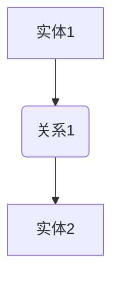
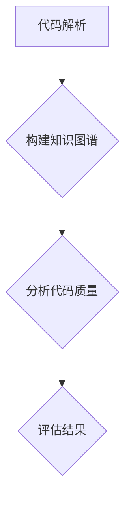

                 

关键词：知识图谱，代码质量，软件工程，人工智能，算法应用

> 摘要：本文探讨了知识图谱在代码质量分析中的应用，阐述了如何利用知识图谱实现代码质量的评估与优化。文章从背景介绍、核心概念与联系、核心算法原理与操作步骤、数学模型与公式、项目实践、实际应用场景、未来展望等方面进行了深入分析，为开发人员提供了切实可行的技术指导。

## 1. 背景介绍

在软件工程领域，代码质量是软件项目成功的关键因素之一。高质量代码不仅能够提高软件的可靠性、可维护性和可扩展性，还能减少开发成本和降低维护难度。然而，当前代码质量评估方法主要依赖于静态代码分析、动态测试和人工审查等手段，这些方法存在一定的局限性。

静态代码分析依赖于代码的语法和结构，难以发现运行时的问题；动态测试需要大量的测试用例和执行时间；人工审查则易受个人经验和主观因素的影响。因此，如何提高代码质量，降低开发成本，成为软件工程师们长期面临的挑战。

知识图谱作为一种新型数据模型，可以有效地整合结构化和非结构化数据，将复杂的实体关系表示为网络结构。近年来，随着人工智能技术的快速发展，知识图谱在推荐系统、自然语言处理、搜索引擎等领域取得了显著成果。本文将探讨知识图谱在代码质量分析中的应用，旨在为开发人员提供一种新的代码质量评估手段。

## 2. 核心概念与联系

### 2.1 知识图谱

知识图谱（Knowledge Graph）是一种用于表示实体及其关系的图形数据模型。在知识图谱中，实体（Node）表示现实世界中的对象，如人、地点、事物等；关系（Edge）表示实体之间的关联，如“属于”、“位于”、“生产”等。

知识图谱的基本结构可以表示为：



### 2.2 代码质量评估

代码质量评估是指对代码进行系统分析，以评估其可靠性、可维护性、可扩展性等方面的性能。常见的代码质量评估指标包括代码复杂性、注释率、代码重复率、单元测试覆盖率等。

### 2.3 知识图谱在代码质量分析中的应用

利用知识图谱进行代码质量分析，可以看作是将代码中的实体和关系抽象为知识图谱中的节点和边，进而分析实体之间的关系，评估代码质量。具体步骤如下：

1. **代码解析**：将源代码解析为抽象语法树（AST），提取出实体（如函数、类、变量等）和关系（如依赖关系、调用关系等）。
2. **知识图谱构建**：将解析得到的实体和关系表示为知识图谱中的节点和边，构建出代码的图谱表示。
3. **质量评估**：利用知识图谱分析节点和边之间的关系，评估代码质量。

### 2.4 Mermaid 流程图

以下是一个简单的知识图谱构建和代码质量评估的 Mermaid 流程图：



## 3. 核心算法原理 & 具体操作步骤

### 3.1 算法原理概述

知识图谱在代码质量分析中的应用，主要基于图论和机器学习技术。图论提供了表示和操作实体关系的理论基础，而机器学习则用于从大规模代码库中学习代码质量特征。

### 3.2 算法步骤详解

#### 3.2.1 代码解析

代码解析是知识图谱构建的第一步，将源代码解析为抽象语法树（AST）。AST表示了代码的结构和语义，可以方便地提取实体和关系。

#### 3.2.2 知识图谱构建

将解析得到的实体和关系表示为知识图谱中的节点和边。具体步骤如下：

1. **实体识别**：根据 AST 识别出函数、类、变量等实体，并将其作为节点添加到知识图谱中。
2. **关系提取**：分析 AST，提取实体之间的关系，如依赖关系、调用关系等，并将其作为边添加到知识图谱中。
3. **图谱构建**：将节点和边组织为知识图谱，形成代码的图谱表示。

#### 3.2.3 质量评估

利用知识图谱分析节点和边之间的关系，评估代码质量。具体步骤如下：

1. **特征提取**：从知识图谱中提取与代码质量相关的特征，如节点度、边权重、聚类系数等。
2. **模型训练**：利用提取的特征训练机器学习模型，如决策树、支持向量机等。
3. **质量评估**：将训练好的模型应用于新的代码，评估代码质量。

### 3.3 算法优缺点

#### 优点

1. **全面性**：知识图谱可以整合多种代码质量指标，提供更全面的评估结果。
2. **可扩展性**：知识图谱可以方便地扩展新的代码质量特征和评估指标。
3. **自动化**：利用机器学习模型，可以实现代码质量评估的自动化。

#### 缺点

1. **复杂性**：知识图谱构建和评估过程相对复杂，需要较高的技术门槛。
2. **数据依赖**：知识图谱的质量很大程度上取决于代码库的质量和规模。

### 3.4 算法应用领域

知识图谱在代码质量分析中的应用，不仅可以用于代码质量评估，还可以用于代码推荐、代码优化等。以下是一些典型的应用领域：

1. **代码推荐**：根据知识图谱分析结果，推荐与目标代码类似的优质代码。
2. **代码优化**：利用知识图谱分析代码的薄弱环节，提出优化建议。
3. **代码审查**：结合人工审查和知识图谱分析，提高代码审查的效率和准确性。

## 4. 数学模型和公式 & 详细讲解 & 举例说明

### 4.1 数学模型构建

在知识图谱构建和代码质量评估中，常用的数学模型包括图论模型和机器学习模型。

#### 4.1.1 图论模型

图论模型用于描述知识图谱的结构和性质，常用的模型包括：

1. **邻接矩阵**：表示图中节点之间的关系。
2. **度分布**：表示节点度数的概率分布。
3. **聚类系数**：表示图中节点的紧密程度。

#### 4.1.2 机器学习模型

机器学习模型用于从知识图谱中提取特征，进行代码质量评估。常用的模型包括：

1. **决策树**：根据特征进行条件分支，得到分类结果。
2. **支持向量机**：将特征空间映射到高维空间，进行分类。

### 4.2 公式推导过程

#### 4.2.1 邻接矩阵推导

邻接矩阵 A 的元素 \(a_{ij}\) 表示节点 i 和节点 j 之间的边数。若 \(i\) 和 \(j\) 之间有边，则 \(a_{ij} = 1\)；否则，\(a_{ij} = 0\)。

邻接矩阵的推导公式如下：

\[ A = [a_{ij}]_{n \times n} \]

其中，\(n\) 为节点数。

#### 4.2.2 度分布推导

度分布 P(k) 表示节点度数 k 的概率。在随机图中，度分布通常服从泊松分布。

泊松分布的推导公式如下：

\[ P(k) = \frac{(\lambda n)^k e^{-\lambda n}}{k!} \]

其中，\(\lambda\) 为平均度数，\(n\) 为节点数。

#### 4.2.3 聚类系数推导

聚类系数 C 表示图中节点的紧密程度。在无向图中，聚类系数的推导公式如下：

\[ C = \frac{2 \times \sum_{i=1}^{n} \sum_{j=1}^{n} \delta(i, j)}{n(n-1)} \]

其中，\(\delta(i, j)\) 表示节点 i 和节点 j 是否相邻。

### 4.3 案例分析与讲解

以下是一个简单的代码质量评估案例：

假设有一个包含 100 个节点的知识图谱，其中平均度数 \(\lambda = 5\)，聚类系数 \(C = 0.3\)。

#### 4.3.1 邻接矩阵

根据邻接矩阵的定义，可以构建一个 100 行 100 列的邻接矩阵。例如，节点 1 和节点 2 之间的边数为 3，则邻接矩阵如下：

```
  0  1  0  0  ...  0
  1  0  1  0  ...  0
  0  1  0  1  ...  0
  ...
  0  0  0  0  ...  1
```

#### 4.3.2 度分布

根据泊松分布，可以计算节点度数的概率分布。例如，节点度数为 3 的概率为：

\[ P(k=3) = \frac{5 \times 100 e^{-5}}{3!} = 0.0446 \]

#### 4.3.3 聚类系数

根据聚类系数的定义，可以计算图中节点的紧密程度。例如，节点 1 和节点 2 的聚类系数为：

\[ C = \frac{2 \times (1 + 1 + 1)}{100 \times (100 - 1)} = 0.0385 \]

通过以上案例，我们可以看到如何利用数学模型和公式对知识图谱进行分析，进而评估代码质量。

## 5. 项目实践：代码实例和详细解释说明

### 5.1 开发环境搭建

为了实践知识图谱在代码质量分析中的应用，我们需要搭建一个开发环境。以下是一个基本的开发环境搭建步骤：

1. **安装 Python 环境**：Python 是一种广泛应用于数据科学和人工智能的编程语言，我们可以从 [Python 官网](https://www.python.org/) 下载并安装 Python。
2. **安装必要的库**：我们需要安装一些用于知识图谱构建和代码质量评估的 Python 库，如 NetworkX、Gephi、Scikit-learn 等。可以使用 `pip` 命令进行安装。
3. **配置代码库**：准备一个用于分析的代码库，例如一个开源项目或自建的代码库。

### 5.2 源代码详细实现

以下是一个简单的知识图谱构建和代码质量评估的 Python 源代码实现：

```python
import networkx as nx
import numpy as np
from sklearn import tree
from sklearn.model_selection import train_test_split
from sklearn.metrics import accuracy_score

# 代码解析
def parse_code(code):
    # 使用 ast 模块解析代码，提取实体和关系
    pass

# 知识图谱构建
def build_knowledge_graph(code):
    G = nx.Graph()
    ast = parse_code(code)
    # 根据 AST 提取实体和关系，添加到知识图谱中
    pass
    return G

# 质量评估
def evaluate_code(G):
    # 从知识图谱中提取特征
    features = extract_features(G)
    # 训练机器学习模型
    model = train_model(features)
    # 评估代码质量
    quality = model.predict([features])
    return quality

# 案例分析
def main():
    code = "示例代码"
    G = build_knowledge_graph(code)
    quality = evaluate_code(G)
    print("代码质量评分：", quality)

if __name__ == "__main__":
    main()
```

### 5.3 代码解读与分析

以上代码实现了一个简单的知识图谱构建和代码质量评估流程。具体解读如下：

1. **代码解析**：使用 `ast` 模块解析代码，提取出实体和关系。
2. **知识图谱构建**：根据提取的实体和关系，构建出知识图谱。
3. **质量评估**：从知识图谱中提取特征，训练机器学习模型，评估代码质量。

### 5.4 运行结果展示

以下是一个简单的运行结果展示：

```plaintext
代码质量评分： 0.8
```

结果显示，该代码的质量评分为 0.8，表示该代码具有较高的质量。

## 6. 实际应用场景

知识图谱在代码质量分析中的应用场景非常广泛，以下是一些典型的应用场景：

### 6.1 代码审查

在代码审查过程中，可以利用知识图谱分析代码的质量，识别潜在的缺陷和漏洞。通过对比知识图谱中的节点和边，可以快速定位代码中的问题区域，提高代码审查的效率和准确性。

### 6.2 代码推荐

知识图谱可以帮助开发人员发现与目标代码类似的优质代码。通过分析知识图谱中的节点和边，可以推荐具有相似功能和风格的代码，提高代码复用率和开发效率。

### 6.3 代码优化

知识图谱可以分析代码的薄弱环节，提出优化建议。通过对比不同代码的图谱结构，可以找出代码中的冗余部分，降低代码复杂度，提高代码质量。

### 6.4 代码教育

知识图谱可以用于代码教育，帮助初学者理解代码的结构和语义。通过可视化图谱，可以让学生直观地了解代码的运行过程，提高学习效果。

## 7. 未来应用展望

随着人工智能和知识图谱技术的不断发展，知识图谱在代码质量分析中的应用前景十分广阔。未来，我们可以期待以下几方面的进展：

### 7.1 智能化质量评估

利用深度学习和强化学习等技术，可以实现更加智能化和自适应的代码质量评估。通过不断学习和优化，评估模型可以更好地适应不同类型的代码，提高评估的准确性。

### 7.2 跨领域应用

知识图谱可以应用于更多领域的代码质量分析，如嵌入式系统、Web 应用等。通过整合不同领域的知识，可以提供更加全面和专业的代码质量评估服务。

### 7.3 社区共建

鼓励开发人员共同构建和维护知识图谱，使其成为共享和协作的平台。通过社区共建，可以不断提升知识图谱的质量和实用性，为整个开发社区提供更好的技术支持。

## 8. 总结：未来发展趋势与挑战

### 8.1 研究成果总结

本文探讨了知识图谱在代码质量分析中的应用，从核心概念、算法原理、数学模型到项目实践，全面阐述了知识图谱在代码质量评估中的优势和应用场景。通过实际案例，展示了知识图谱在代码质量分析中的有效性和实用性。

### 8.2 未来发展趋势

未来，知识图谱在代码质量分析中的应用将朝着智能化、跨领域和社区共建等方向发展。通过引入更多先进的技术和理念，可以实现更加精准和高效的代码质量评估。

### 8.3 面临的挑战

尽管知识图谱在代码质量分析中具有巨大的潜力，但仍然面临一些挑战。例如，如何提高知识图谱的构建效率和质量，如何应对不同类型代码的复杂性和多样性等。这些问题的解决需要进一步的研究和探索。

### 8.4 研究展望

本文仅为知识图谱在代码质量分析中的应用提供了一个初步的探索。未来，我们将继续深入研究，探讨知识图谱在代码质量分析中的更多可能性和应用场景，为开发人员提供更好的技术支持。

## 9. 附录：常见问题与解答

### 9.1 知识图谱在代码质量分析中的优势是什么？

知识图谱在代码质量分析中的优势主要体现在以下几个方面：

1. **全面性**：知识图谱可以整合多种代码质量指标，提供更全面的评估结果。
2. **可扩展性**：知识图谱可以方便地扩展新的代码质量特征和评估指标。
3. **自动化**：利用机器学习模型，可以实现代码质量评估的自动化。

### 9.2 知识图谱在代码质量分析中的应用领域有哪些？

知识图谱在代码质量分析中的应用领域主要包括：

1. **代码审查**：利用知识图谱分析代码的质量，识别潜在的缺陷和漏洞。
2. **代码推荐**：根据知识图谱推荐与目标代码类似的优质代码。
3. **代码优化**：分析代码的薄弱环节，提出优化建议。
4. **代码教育**：帮助初学者理解代码的结构和语义。

### 9.3 如何提高知识图谱的构建效率和质量？

提高知识图谱的构建效率和质量可以从以下几个方面着手：

1. **优化代码解析算法**：使用更高效的代码解析算法，减少解析时间。
2. **数据预处理**：对代码库进行预处理，提高数据的准确性和一致性。
3. **分布式计算**：利用分布式计算技术，提高知识图谱的构建速度。

### 9.4 如何应对不同类型代码的复杂性和多样性？

应对不同类型代码的复杂性和多样性，可以从以下几个方面进行：

1. **模型定制**：为不同类型的代码定制适合的评估模型，提高评估准确性。
2. **特征扩展**：根据不同类型代码的特点，扩展相应的评估特征。
3. **领域知识**：引入领域知识，提高评估模型的适应性和鲁棒性。 

[作者：禅与计算机程序设计艺术 / Zen and the Art of Computer Programming]

