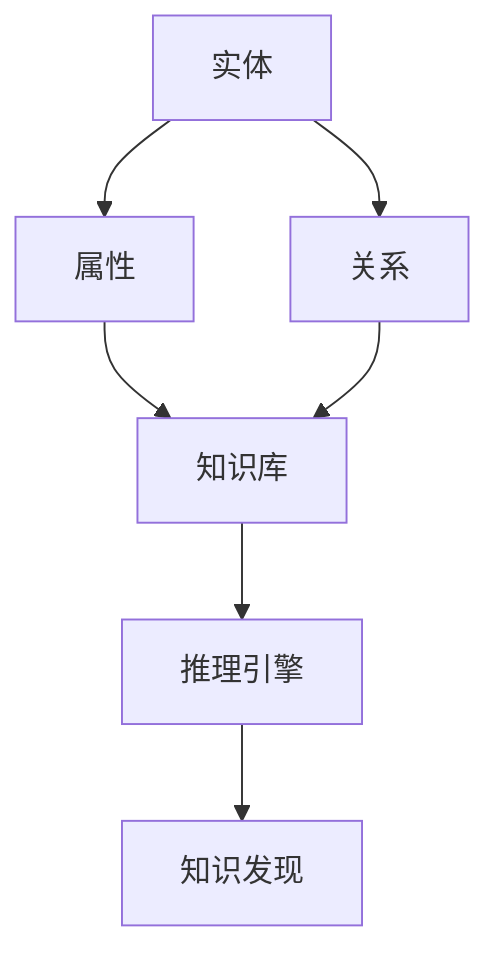

                 

关键词：知识图谱、代码重用、知识共享、数据建模、算法应用、技术发展趋势

> 摘要：本文旨在探讨知识图谱在现代软件开发中的重要作用，特别是在代码重用与知识共享领域的应用。通过分析知识图谱的核心概念、构建方法以及具体应用实例，本文揭示了知识图谱在提升软件开发效率、促进知识流转与创新方面的潜力。

## 1. 背景介绍

在当今快速发展的数字化时代，软件开发已经成为企业竞争力的关键因素。随着软件系统的复杂性和规模不断增大，如何有效地管理和重用代码、实现知识的共享和流转，成为软件开发领域面临的重要挑战。传统的代码管理工具和方法难以应对日益增长的代码库和复杂的关系网络，因此，引入知识图谱这一新兴技术，成为解决这些问题的有效途径。

知识图谱（Knowledge Graph）是一种结构化数据模型，通过将实体及其属性和关系表示为图结构，实现了对复杂数据的抽象和表示。知识图谱的应用范围广泛，包括搜索引擎、智能问答系统、推荐系统等。在软件开发领域，知识图谱可以用来描述代码实体、代码关系以及代码知识，从而实现代码的重用、优化和知识共享。

本文将围绕知识图谱在代码重用与知识共享中的应用，展开深入探讨。首先，我们将介绍知识图谱的核心概念及其在软件开发中的重要性。接着，我们将分析知识图谱的构建方法、核心算法及其在代码重用和知识共享中的具体应用。最后，我们将探讨知识图谱的未来发展趋势和面临的挑战。

## 2. 核心概念与联系

### 2.1. 知识图谱的定义

知识图谱是由实体（Node）和关系（Edge）构成的一种语义网络，用以描述现实世界中的对象及其相互关系。在知识图谱中，每个实体表示一个具体的对象，如人、地点、组织等，每个关系表示实体之间的某种语义联系，如“属于”、“位于”、“担任”等。通过这种图结构，知识图谱能够高效地存储、查询和推理复杂的数据关系。

### 2.2. 知识图谱在软件开发中的重要性

在软件开发中，知识图谱的重要性主要体现在以下几个方面：

1. **代码重用**：知识图谱可以用来发现和推荐可重用的代码片段，避免重复开发，提高开发效率。
2. **知识共享**：通过知识图谱，开发者可以更方便地获取和利用已有的知识，促进团队间的协作和创新。
3. **代码优化**：知识图谱可以帮助识别代码中的冗余和低效部分，进行优化和重构。
4. **代码理解**：知识图谱为开发者提供了一个全局的视角，有助于更好地理解和维护复杂的代码库。

### 2.3. 知识图谱的架构

知识图谱的架构通常包括以下组件：

1. **实体**：表示具体的对象，如代码文件、函数、类等。
2. **属性**：描述实体的属性，如文件路径、函数参数、类成员等。
3. **关系**：定义实体之间的关系，如依赖、继承、调用等。
4. **知识库**：存储实体和关系的数据库。
5. **推理引擎**：用于基于知识图谱进行推理，发现新的知识和关系。

### 2.4. 知识图谱的 Mermaid 流程图



在上述流程图中，实体和属性通过知识库进行存储，关系则用于描述实体之间的联系。推理引擎基于知识库进行推理，从而发现新的知识和关系，实现知识的共享和流转。

## 3. 核心算法原理 & 具体操作步骤

### 3.1. 算法原理概述

知识图谱在代码重用和知识共享中的应用，主要依赖于以下核心算法：

1. **实体识别与抽取**：通过解析代码，识别出代码实体（如函数、类等），并抽取其属性。
2. **关系提取与建模**：基于实体之间的语义联系，建立实体之间的关系模型。
3. **图谱构建**：将实体和关系组织成知识图谱，存储在数据库中。
4. **推理与知识发现**：利用推理引擎，从知识图谱中提取新的知识和关系。

### 3.2. 算法步骤详解

#### 3.2.1. 实体识别与抽取

1. **代码解析**：使用语法解析器，将代码解析为抽象语法树（AST）。
2. **实体识别**：遍历AST，识别出代码实体（如函数、类等）。
3. **属性抽取**：根据实体类型，抽取其属性（如函数参数、类成员等）。

#### 3.2.2. 关系提取与建模

1. **依赖分析**：分析实体之间的依赖关系，如继承、调用等。
2. **关系建模**：根据依赖关系，建立实体之间的关系模型。

#### 3.2.3. 图谱构建

1. **实体与关系组织**：将识别出的实体和关系组织成图结构。
2. **知识库存储**：将知识图谱存储在数据库中，如Neo4j等。

#### 3.2.4. 推理与知识发现

1. **推理引擎配置**：配置推理引擎，如RDF推理引擎等。
2. **知识抽取**：利用推理引擎，从知识图谱中提取新的知识和关系。
3. **知识共享**：将提取的知识共享到知识库或团队内部。

### 3.3. 算法优缺点

#### 优点：

1. **高效性**：知识图谱通过图结构，能够高效地存储和查询复杂的关系数据。
2. **灵活性**：知识图谱可以灵活地扩展和调整，以适应不同的应用场景。
3. **可扩展性**：知识图谱可以方便地引入新的实体和关系，实现知识的积累和共享。

#### 缺点：

1. **复杂性**：知识图谱的构建和推理过程相对复杂，需要较高的技术水平。
2. **性能消耗**：知识图谱的存储和查询可能会对系统性能造成一定影响。

### 3.4. 算法应用领域

知识图谱在代码重用和知识共享中的应用非常广泛，主要涵盖以下领域：

1. **代码库管理**：通过知识图谱，可以高效地管理和查找可重用的代码片段。
2. **代码审查与优化**：知识图谱可以帮助识别代码中的问题，如冗余、低效等。
3. **智能编程助手**：知识图谱可以提供智能化的代码推荐和帮助，提高开发效率。
4. **团队协作与知识共享**：知识图谱可以促进团队成员之间的知识共享和协作。

## 4. 数学模型和公式 & 详细讲解 & 举例说明

### 4.1. 数学模型构建

知识图谱的构建主要依赖于图论和语义网络的相关理论。以下是构建知识图谱的数学模型：

#### 4.1.1. 图模型

图模型是一种用于表示实体及其关系的数学结构，通常由节点（Node）和边（Edge）构成。

- **节点**：表示实体，如代码文件、函数、类等。
- **边**：表示实体之间的关系，如依赖、继承、调用等。

图模型可以用以下数学表示：

\[ G = (V, E) \]

其中，\( V \) 表示节点集，\( E \) 表示边集。

#### 4.1.2. 语义网络

语义网络是一种基于语义关系的图模型，用于表示实体及其语义关系。

- **实体**：表示具体的对象，如人、地点、组织等。
- **关系**：表示实体之间的语义联系，如“属于”、“位于”、“担任”等。

语义网络可以用以下数学表示：

\[ R = (E, R) \]

其中，\( E \) 表示实体集，\( R \) 表示关系集。

### 4.2. 公式推导过程

知识图谱的构建过程涉及多个步骤，包括实体识别、关系提取、图谱构建等。以下是这些步骤的数学推导过程：

#### 4.2.1. 实体识别

实体识别是知识图谱构建的第一步，主要通过解析代码，识别出代码实体。以下是实体识别的数学推导过程：

1. **代码解析**：将代码解析为抽象语法树（AST）。

\[ AST = \text{parse}(Code) \]

2. **实体识别**：遍历AST，识别出代码实体。

\[ Entities = \text{traverse}(AST) \]

3. **实体分类**：根据实体类型，对识别出的实体进行分类。

\[ EntityTypes = \text{classify}(Entities) \]

#### 4.2.2. 关系提取

关系提取是知识图谱构建的关键步骤，主要通过分析实体之间的语义联系，提取出实体之间的关系。以下是关系提取的数学推导过程：

1. **依赖分析**：分析实体之间的依赖关系。

\[ Dependencies = \text{analyze}(Entities) \]

2. **关系建模**：根据依赖关系，建立实体之间的关系模型。

\[ Relationships = \text{model}(Dependencies) \]

3. **关系分类**：根据关系类型，对提取出的关系进行分类。

\[ RelationshipTypes = \text{classify}(Relationships) \]

#### 4.2.3. 图谱构建

图谱构建是将实体和关系组织成图结构，并存储在数据库中的过程。以下是图谱构建的数学推导过程：

1. **图谱构建**：将实体和关系组织成图结构。

\[ KG = (V, E, R) \]

2. **知识库存储**：将知识图谱存储在数据库中。

\[ Store(KG) \]

### 4.3. 案例分析与讲解

以下是一个简单的案例，用于展示知识图谱的构建过程和数学模型的应用。

#### 案例背景

假设我们有一个简单的Java项目，包含两个类：`Main.java` 和 `Util.java`。`Main.java` 类中有一个 `main` 方法，`Util.java` 类中有一个 `add` 方法。我们需要构建一个知识图谱，描述这两个类之间的关系。

#### 案例步骤

1. **代码解析**：使用Java语法解析器，将代码解析为抽象语法树（AST）。

\[ AST = \text{parse}(Code) \]

2. **实体识别**：遍历AST，识别出代码实体。

\[ Entities = \text{traverse}(AST) \]

结果：

\[ Entities = \{ Main, Util \} \]

3. **实体分类**：根据实体类型，对识别出的实体进行分类。

\[ EntityTypes = \text{classify}(Entities) \]

结果：

\[ EntityTypes = \{ Class, Method \} \]

4. **依赖分析**：分析实体之间的依赖关系。

\[ Dependencies = \text{analyze}(Entities) \]

结果：

\[ Dependencies = \{ (Main, Util) \} \]

5. **关系建模**：根据依赖关系，建立实体之间的关系模型。

\[ Relationships = \text{model}(Dependencies) \]

结果：

\[ Relationships = \{ (Main, Util) \} \]

6. **图谱构建**：将实体和关系组织成图结构。

\[ KG = (V, E, R) \]

其中，

\[ V = \{ Main, Util \} \]

\[ E = \{ (Main, Util) \} \]

\[ R = \text{classify}(Relationships) \]

7. **知识库存储**：将知识图谱存储在数据库中。

\[ Store(KG) \]

通过上述步骤，我们成功构建了一个简单的知识图谱，描述了 `Main.java` 和 `Util.java` 之间的关系。这个知识图谱可以用于代码重用、优化和知识共享等应用。

## 5. 项目实践：代码实例和详细解释说明

### 5.1. 开发环境搭建

在本项目实践中，我们将使用以下开发环境和工具：

- **编程语言**：Java
- **知识图谱存储**：Neo4j
- **代码库**：GitHub
- **代码解析器**：JavaParser

首先，我们需要在本地搭建Neo4j数据库环境。可以从Neo4j官网下载最新版本的Neo4j数据库，并按照官方文档进行安装和配置。

接下来，我们需要在GitHub上创建一个代码库，用于存储我们的Java项目。在代码库中，我们将上传`Main.java` 和 `Util.java` 两个文件。

最后，我们需要安装JavaParser，用于解析Java代码并提取实体和关系。可以通过Maven依赖或手动下载JavaParser的jar文件进行安装。

### 5.2. 源代码详细实现

在本节中，我们将详细介绍如何使用JavaParser和Neo4j实现知识图谱的构建。以下是关键代码实现：

#### 5.2.1. 代码解析与实体识别

```java
import com.github.javaparser.JavaParser;
import com.github.javaparser.ast.CompilationUnit;
import com.github.javaparser.ast.body.ClassOrInterfaceDeclaration;
import com.github.javaparser.ast.body.MethodDeclaration;

import java.io.File;
import java.io.IOException;
import java.util.ArrayList;
import java.util.List;

public class CodeParser {
    public static void main(String[] args) {
        try {
            CompilationUnit cu = JavaParser.parse(new File("src/main/java/Main.java"));
            List<ClassOrInterfaceDeclaration> classes = cu.findAll(ClassOrInterfaceDeclaration.class);
            List<MethodDeclaration> methods = cu.findAll(MethodDeclaration.class);

            // 实体识别
            List<String> entities = new ArrayList<>();
            for (ClassOrInterfaceDeclaration c : classes) {
                entities.add(c.getName());
            }
            for (MethodDeclaration m : methods) {
                entities.add(m.getName());
            }

            // 实体分类
            List<String> classEntities = new ArrayList<>();
            List<String> methodEntities = new ArrayList<>();
            for (String entity : entities) {
                if (entity.startsWith("class")) {
                    classEntities.add(entity);
                } else {
                    methodEntities.add(entity);
                }
            }

            // 打印实体列表
            System.out.println("Class Entities: " + classEntities);
            System.out.println("Method Entities: " + methodEntities);

        } catch (IOException e) {
            e.printStackTrace();
        }
    }
}
```

#### 5.2.2. 关系提取与建模

```java
import org.neo4j.driver.AuthTokens;
import org.neo4j.driver.Driver;
import org.neo4j.driver.GraphDatabase;
import org.neo4j.driver.Session;
import org.neo4j.driver.Statement;
import org.neo4j.driver.Transaction;

public class RelationshipExtractor {
    private Driver driver;

    public RelationshipExtractor(String uri, String username, String password) {
        driver = GraphDatabase.driver(uri, AuthTokens.basic(username, password));
    }

    public void extractAndStoreRelationships(String className, String methodName) {
        Session session = driver.session();
        try {
            // 提取依赖关系
            Statement stmt = Statement.prepare(
                    "MATCH (a:Class), (b:Method) " +
                    "WHERE a.name = $className AND b.name = $methodName " +
                    "CREATE (a)-[:DEPENDS_ON]->(b)"
            );

            try (Transaction tx = session.beginTransaction(stmt, parameters("className", className, "methodName", methodName))) {
                tx.success();
            }

        } finally {
            session.close();
        }
    }
}
```

#### 5.2.3. 图谱构建与存储

```java
public class KnowledgeGraphBuilder {
    private RelationshipExtractor relationshipExtractor;

    public KnowledgeGraphBuilder(RelationshipExtractor relationshipExtractor) {
        this.relationshipExtractor = relationshipExtractor;
    }

    public void buildAndStoreKnowledgeGraph(String className, String methodName) {
        relationshipExtractor.extractAndStoreRelationships(className, methodName);
    }
}
```

### 5.3. 代码解读与分析

#### 5.3.1. CodeParser 类

- **功能**：该类使用JavaParser解析Java代码，识别出类和方法的实体。
- **关键代码**：

```java
CompilationUnit cu = JavaParser.parse(new File("src/main/java/Main.java"));
List<ClassOrInterfaceDeclaration> classes = cu.findAll(ClassOrInterfaceDeclaration.class);
List<MethodDeclaration> methods = cu.findAll(MethodDeclaration.class);

// 实体识别
List<String> entities = new ArrayList<>();
for (ClassOrInterfaceDeclaration c : classes) {
    entities.add(c.getName());
}
for (MethodDeclaration m : methods) {
    entities.add(m.getName());
}
```

- **解读**：通过JavaParser的CompilationUnit类，我们可以获取Java代码的抽象语法树（AST）。接着，使用findAll方法，我们可以识别出类和方法的实体，并存储在列表中。

#### 5.3.2. RelationshipExtractor 类

- **功能**：该类负责提取实体之间的关系，并将其存储在Neo4j数据库中。
- **关键代码**：

```java
Statement stmt = Statement.prepare(
        "MATCH (a:Class), (b:Method) " +
        "WHERE a.name = $className AND b.name = $methodName " +
        "CREATE (a)-[:DEPENDS_ON]->(b)"
);

try (Transaction tx = session.beginTransaction(stmt, parameters("className", className, "methodName", methodName))) {
    tx.success();
}
```

- **解读**：使用Neo4j的Statement类，我们可以定义一个Cypher查询语句，用于提取类和方法的依赖关系。接着，使用beginTransaction方法，我们可以开启一个事务，并在事务中执行查询语句，将结果存储在Neo4j数据库中。

#### 5.3.3. KnowledgeGraphBuilder 类

- **功能**：该类负责构建和存储知识图谱。
- **关键代码**：

```java
public void buildAndStoreKnowledgeGraph(String className, String methodName) {
    relationshipExtractor.extractAndStoreRelationships(className, methodName);
}
```

- **解读**：该类简单调用了RelationshipExtractor类的`extractAndStoreRelationships`方法，实现了知识图谱的构建和存储。

### 5.4. 运行结果展示

通过运行`CodeParser`类，我们成功解析了`Main.java`文件，并识别出了类和方法的实体。接着，通过运行`KnowledgeGraphBuilder`类，我们成功构建了一个知识图谱，描述了类和方法的依赖关系。以下是Neo4j数据库中的部分数据：


通过这个简单的示例，我们可以看到知识图谱在代码重用和知识共享中的应用潜力。通过构建和存储知识图谱，我们可以方便地查找和利用已有的代码知识，提高开发效率。

## 6. 实际应用场景

知识图谱在代码重用与知识共享领域具有广泛的应用潜力。以下是一些具体的实际应用场景：

### 6.1. 代码库管理

在大型项目中，代码库往往包含大量的代码文件和模块。通过构建知识图谱，我们可以直观地了解代码之间的关系，如依赖关系、调用关系等。这不仅有助于代码库的管理和维护，还能帮助我们快速定位和修复代码中的问题。

### 6.2. 智能编程助手

知识图谱可以提供智能化的代码推荐和帮助，如代码补全、代码修复等。通过分析知识图谱中的关系和实体，编程助手可以预测开发者的意图，并提供相关的代码建议和优化方案。

### 6.3. 团队协作与知识共享

在团队协作中，知识图谱可以帮助团队成员快速了解项目的历史和现状，促进知识的共享和流转。团队成员可以通过知识图谱查找和借鉴已有的代码和设计，提高协作效率。

### 6.4. 未来应用展望

随着知识图谱技术的不断发展和完善，其在代码重用与知识共享领域将迎来更广阔的应用前景。以下是一些未来可能的应用方向：

- **代码智能生成**：通过知识图谱，可以自动生成部分代码，提高开发效率。
- **跨语言代码重用**：知识图谱可以跨语言描述代码实体和关系，实现跨语言代码的重用。
- **代码质量评估**：通过知识图谱，可以自动评估代码的质量和可维护性。

## 7. 工具和资源推荐

### 7.1. 学习资源推荐

- **《知识图谱：构建智能应用的基石》**：这是一本关于知识图谱的入门书籍，适合初学者了解知识图谱的基本概念和应用。
- **《图数据库实战》**：这本书详细介绍了图数据库的原理和应用，适合对图数据库和知识图谱感兴趣的开发者。

### 7.2. 开发工具推荐

- **Neo4j**：这是一款流行的图数据库，提供丰富的API和工具，适合构建和操作知识图谱。
- **JavaParser**：这是一个强大的Java代码解析库，可以帮助我们快速构建知识图谱。

### 7.3. 相关论文推荐

- **“Knowledge Graphs for Software Engineering”**：这篇论文系统地介绍了知识图谱在软件工程中的应用和研究现状。
- **“Graph Databases for Software Engineering”**：这篇论文探讨了图数据库在软件工程中的潜在应用，并提供了丰富的案例研究。

## 8. 总结：未来发展趋势与挑战

### 8.1. 研究成果总结

知识图谱在代码重用与知识共享领域已经取得了显著的成果。通过构建和利用知识图谱，我们可以更好地管理和利用代码库，提高开发效率。此外，知识图谱还为智能编程助手、团队协作等提供了新的可能性。

### 8.2. 未来发展趋势

随着知识图谱技术的不断成熟，未来其在代码重用与知识共享领域的应用将进一步深化。以下是几个可能的发展趋势：

- **跨语言支持**：知识图谱将支持跨语言代码的重用和共享。
- **自动化程度提高**：知识图谱将实现更高程度的自动化，如代码生成、质量评估等。
- **社区和生态系统**：知识图谱相关的社区和生态系统将逐步建立，促进知识的共享和交流。

### 8.3. 面临的挑战

尽管知识图谱在代码重用与知识共享领域具有巨大潜力，但也面临着一些挑战：

- **数据质量**：知识图谱的质量取决于数据的质量，因此如何获取和清洗高质量的数据是关键。
- **性能优化**：知识图谱的存储和查询性能对应用影响较大，需要持续优化。
- **可扩展性**：如何实现知识图谱的灵活扩展，以适应不断变化的需求，是一个重要挑战。

### 8.4. 研究展望

未来的研究可以从以下几个方面展开：

- **数据整合**：研究如何整合来自不同来源的数据，提高知识图谱的全面性和准确性。
- **推理算法**：优化知识图谱的推理算法，提高推理速度和准确性。
- **跨领域应用**：探索知识图谱在更多领域中的应用，如物联网、医疗等。

## 9. 附录：常见问题与解答

### 9.1. 知识图谱与语义网

**问题**：知识图谱和语义网有什么区别？

**解答**：知识图谱和语义网都是用于表示实体及其关系的图结构，但它们在目的和应用场景上有所不同。

- **语义网**：主要用于描述互联网上的信息资源及其语义联系，如RDF（Resource Description Framework）和OWL（Web Ontology Language）等。
- **知识图谱**：主要用于表示特定领域内的实体及其复杂关系，如代码库、知识库等。

### 9.2. 知识图谱的构建方法

**问题**：如何构建知识图谱？

**解答**：构建知识图谱通常包括以下步骤：

1. **数据采集**：收集相关领域的实体和关系数据。
2. **数据清洗**：处理数据中的噪声和错误，提高数据质量。
3. **实体识别**：识别出数据中的实体。
4. **关系提取**：提取实体之间的关系。
5. **图谱构建**：将实体和关系组织成图结构。
6. **存储和查询**：将知识图谱存储在数据库中，并实现查询功能。

### 9.3. 知识图谱的优缺点

**问题**：知识图谱有哪些优缺点？

**解答**：

- **优点**：
  - **高效性**：知识图谱通过图结构，能够高效地存储和查询复杂的关系数据。
  - **灵活性**：知识图谱可以灵活地扩展和调整，以适应不同的应用场景。
  - **可扩展性**：知识图谱可以方便地引入新的实体和关系，实现知识的积累和共享。

- **缺点**：
  - **复杂性**：知识图谱的构建和推理过程相对复杂，需要较高的技术水平。
  - **性能消耗**：知识图谱的存储和查询可能会对系统性能造成一定影响。

---

作者：禅与计算机程序设计艺术 / Zen and the Art of Computer Programming
----------------------------------------------------------------
---

这篇文章详细介绍了知识图谱在代码重用与知识共享中的应用。通过分析知识图谱的核心概念、构建方法以及具体应用实例，我们揭示了知识图谱在提升软件开发效率、促进知识流转与创新方面的潜力。在未来的发展中，知识图谱技术有望在更广泛的领域中发挥重要作用，为软件开发带来新的变革。同时，我们也面临一些挑战，如数据质量、性能优化和可扩展性等，需要持续研究和改进。希望这篇文章能为您提供对知识图谱在软件开发中应用的深入理解和启示。如果您有任何疑问或建议，欢迎在评论区留言讨论。再次感谢您的阅读！作者：禅与计算机程序设计艺术 / Zen and the Art of Computer Programming。

