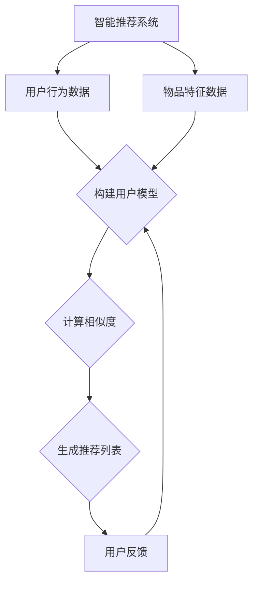

                 

关键词：知识图谱、智能推荐系统、数据挖掘、机器学习、关系网络、网络嵌入、图数据库、关联分析

> 摘要：本文将探讨知识图谱在智能推荐系统中的应用，分析知识图谱如何通过其结构化的数据表示和强大的关联分析能力，提升推荐系统的效果和用户体验。文章将介绍知识图谱的基本概念、构建方法、核心算法以及在不同领域的应用实例，并展望其未来的发展趋势。

## 1. 背景介绍

随着互联网和大数据技术的发展，智能推荐系统已经成为现代信息检索和个性化服务的重要组成部分。传统的推荐系统主要依赖于用户行为数据（如浏览记录、购买历史等），通过协同过滤、内容匹配等算法进行用户偏好预测和推荐。然而，这些方法在面对大量复杂数据和多元化用户需求时，往往存在一些局限性。

知识图谱（Knowledge Graph）作为一种结构化的语义数据表示方法，通过实体和实体之间丰富的关联关系，提供了一种更为智能和灵活的数据组织方式。近年来，知识图谱在自然语言处理、智能问答、智能搜索等领域取得了显著成果。与此同时，知识图谱也逐渐应用于智能推荐系统，为解决传统推荐系统的局限性提供了新的思路。

本文旨在探讨知识图谱在智能推荐系统中的应用，通过介绍知识图谱的基本概念、构建方法、核心算法以及实际应用案例，深入分析知识图谱如何提升推荐系统的效果和用户体验。

### 1.1 智能推荐系统的现状与挑战

智能推荐系统作为现代互联网的重要组成部分，已经广泛应用于电子商务、在线媒体、社交媒体等多个领域。传统的推荐系统主要通过用户行为数据进行分析，如用户历史浏览、购买、点赞等行为，利用协同过滤（Collaborative Filtering）、基于内容的推荐（Content-Based Filtering）等算法进行推荐。然而，随着互联网信息爆炸式的增长和用户需求的多样化，传统推荐系统面临着以下挑战：

1. **数据稀疏性**：用户行为数据往往存在稀疏性问题，即用户行为数据中的大部分元素为空，导致推荐系统难以准确预测用户偏好。
2. **冷启动问题**：对于新用户或新商品，由于缺乏足够的用户行为数据，传统推荐系统难以进行有效推荐。
3. **异质数据整合**：推荐系统通常需要整合用户行为数据、内容数据等多种类型的数据，传统方法难以处理这些异质数据之间的复杂关系。
4. **可解释性差**：传统推荐系统往往依赖于复杂的算法模型，推荐结果的可解释性较差，难以向用户解释推荐的原因。

### 1.2 知识图谱的基本概念与优势

知识图谱是一种用于表示实体及其之间复杂关系的图形结构，通常由实体（Node）、属性（Attribute）和边（Edge）组成。知识图谱通过实体和边之间的关系，实现对信息的结构化和语义化表示。与传统的推荐系统不同，知识图谱具有以下优势：

1. **结构化表示**：知识图谱能够以结构化的方式表示信息，使得数据易于存储、查询和分析。
2. **语义关联**：知识图谱通过实体之间的关系，能够揭示出数据之间的语义关联，从而提供更为精准的推荐。
3. **异质数据整合**：知识图谱能够整合多种类型的数据，如用户行为数据、内容数据等，实现异质数据的统一表示。
4. **可解释性**：知识图谱中的实体和关系可以提供推荐结果的可解释性，使得用户能够理解推荐的原因。

因此，知识图谱在智能推荐系统中具有巨大的潜力，可以有效解决传统推荐系统面临的挑战。

## 2. 核心概念与联系

### 2.1 知识图谱的基本概念

知识图谱（Knowledge Graph）是一种用于表示实体及其之间复杂关系的图形结构。它通常由以下几个基本元素组成：

1. **实体（Entity）**：知识图谱中的基本构成单元，可以表示人、地点、事物等具体对象。
2. **属性（Attribute）**：实体所具有的特征或属性，如人的年龄、地点的纬度等。
3. **边（Edge）**：连接两个实体的关系，可以表示实体之间的语义关联，如“属于”、“位于”等。

知识图谱通过实体和边之间的关系，实现对信息的结构化和语义化表示。例如，在一个关于电影的图谱中，实体可以表示电影、演员、导演等，边可以表示“主演”、“导演”等关系。

### 2.2 智能推荐系统的概念

智能推荐系统（Intelligent Recommendation System）是一种基于用户行为和内容信息，利用机器学习和数据挖掘技术，对用户兴趣进行预测和推荐的系统。其主要目标是为用户提供个性化的信息和服务，提高用户满意度和参与度。

智能推荐系统通常包括以下几个核心组成部分：

1. **用户模型**：基于用户的历史行为数据，构建用户兴趣模型，用于预测用户的潜在兴趣。
2. **内容模型**：基于物品的特征信息，构建物品内容模型，用于描述物品的特性。
3. **推荐算法**：利用用户和物品模型，通过协同过滤、内容匹配、知识图谱等方法，生成个性化的推荐列表。

### 2.3 知识图谱与智能推荐系统的关联

知识图谱与智能推荐系统之间存在紧密的关联。知识图谱可以提供以下几方面的支持：

1. **增强用户模型**：知识图谱能够通过实体之间的关系，挖掘用户隐藏的兴趣点和偏好，从而增强用户模型的准确性。
2. **改善内容表示**：知识图谱能够整合多源异质数据，构建统一的物品内容表示，提高推荐系统的效果。
3. **提升推荐解释性**：知识图谱中的实体和关系可以提供推荐结果的可解释性，帮助用户理解推荐的原因。

### 2.4 Mermaid 流程图表示

以下是知识图谱与智能推荐系统关联的Mermaid流程图：



在该流程图中，智能推荐系统首先收集用户行为数据和物品特征数据，通过构建用户模型和计算相似度，生成个性化的推荐列表。用户对推荐结果的反馈则用于优化和改进用户模型，形成一个闭环的推荐系统。

## 3. 核心算法原理 & 具体操作步骤

### 3.1 算法原理概述

知识图谱在智能推荐系统中的应用主要依赖于以下几个核心算法：

1. **图嵌入（Graph Embedding）**：通过将知识图谱中的实体和边映射到低维空间，实现对实体和关系的结构化和语义化表示。
2. **图卷积网络（Graph Convolutional Network，GCN）**：利用图卷积操作，从邻接实体中聚合信息，实现实体特征的学习和更新。
3. **图注意力网络（Graph Attention Network，GAT）**：通过引入注意力机制，对邻接实体的重要性进行加权，提高模型对实体之间关系的捕捉能力。
4. **图神经网络（Graph Neural Network，GNN）**：结合图嵌入和图卷积操作，实现对知识图谱的深度学习和建模。

这些算法通过不同方式对知识图谱进行处理，从而提升推荐系统的效果和可解释性。

### 3.2 算法步骤详解

#### 3.2.1 图嵌入

1. **初始化实体嵌入向量**：将知识图谱中的每个实体初始化为一个随机向量。
2. **计算边权重**：根据实体之间的相似度或关系强度，计算边权重。
3. **更新实体嵌入向量**：通过聚合邻接实体的嵌入向量，并加权边权重，更新当前实体的嵌入向量。
4. **迭代优化**：重复步骤3，直到实体嵌入向量收敛。

#### 3.2.2 图卷积网络（GCN）

1. **初始化实体特征向量**：将知识图谱中的每个实体初始化为一个特征向量。
2. **定义图卷积层**：通过定义一个聚合函数（如加和、平均等），将邻接实体的特征向量聚合起来。
3. **应用激活函数**：对聚合后的特征向量应用激活函数（如ReLU、Sigmoid等），实现特征的非线性变换。
4. **迭代应用图卷积层**：重复步骤2和3，构建多层的图卷积网络。
5. **分类或回归**：将最终得到的实体特征向量输入到分类器或回归器中，进行预测。

#### 3.2.3 图注意力网络（GAT）

1. **初始化实体嵌入向量**：与图嵌入类似，初始化每个实体的嵌入向量。
2. **定义注意力机制**：对于每个实体，计算其邻接实体的注意力分数，并根据注意力分数加权聚合邻接实体的嵌入向量。
3. **更新实体嵌入向量**：通过聚合加权后的邻接实体嵌入向量，更新当前实体的嵌入向量。
4. **迭代优化**：重复步骤2和3，直到实体嵌入向量收敛。

#### 3.2.4 图神经网络（GNN）

1. **初始化实体特征向量**：与图卷积网络类似，初始化每个实体的特征向量。
2. **定义图卷积层和图嵌入层**：结合图卷积操作和图嵌入操作，构建多层GNN模型。
3. **应用激活函数**：对每一层的特征向量应用激活函数，实现特征的非线性变换。
4. **分类或回归**：将最终得到的实体特征向量输入到分类器或回归器中，进行预测。

### 3.3 算法优缺点

#### 3.3.1 图嵌入

**优点**：
- **低计算复杂度**：通过将高维的实体表示为低维的向量，降低计算复杂度。
- **结构化和语义化表示**：能够对实体和关系进行结构化和语义化表示，提高推荐效果。
- **异质数据整合**：能够整合不同类型的数据，如用户行为数据和内容数据。

**缺点**：
- **稀疏性**：知识图谱通常具有稀疏性，可能导致部分实体无法获取足够的邻接实体信息。
- **可解释性**：低维嵌入向量难以解释实体之间的具体关系。

#### 3.3.2 图卷积网络（GCN）

**优点**：
- **强大的特征聚合能力**：能够从邻接实体中聚合信息，实现特征的非线性变换。
- **可扩展性**：适用于大规模知识图谱，能够处理多种类型的实体和关系。

**缺点**：
- **计算复杂度较高**：图卷积操作涉及大量的矩阵运算，可能导致计算复杂度较高。
- **模型可解释性**：图卷积操作的中间过程难以解释，可能导致模型可解释性较差。

#### 3.3.3 图注意力网络（GAT）

**优点**：
- **自适应注意力机制**：能够根据邻接实体的重要性进行自适应加权，提高模型对实体之间关系的捕捉能力。
- **模型可解释性**：通过注意力机制，能够解释实体之间的具体关系。

**缺点**：
- **计算复杂度较高**：注意力机制涉及大量的计算，可能导致计算复杂度较高。

#### 3.3.4 图神经网络（GNN）

**优点**：
- **深度学习特性**：能够通过多层的图卷积和嵌入操作，提取更为复杂的特征。
- **强大的特征聚合能力**：能够从邻接实体中聚合信息，实现特征的非线性变换。

**缺点**：
- **计算复杂度较高**：多层图卷积和嵌入操作可能导致计算复杂度较高。
- **模型可解释性**：多层图卷积操作的中间过程难以解释，可能导致模型可解释性较差。

### 3.4 算法应用领域

知识图谱和图神经网络在智能推荐系统中具有广泛的应用领域：

1. **电子商务推荐**：利用知识图谱对商品和用户之间的关系进行建模，实现精准的商品推荐。
2. **社交媒体推荐**：通过知识图谱分析用户关系和网络结构，实现好友推荐、话题推荐等。
3. **在线媒体推荐**：利用知识图谱整合内容信息，实现个性化新闻、视频推荐。
4. **医疗服务推荐**：利用知识图谱对疾病、药物、医生等实体之间的关系进行建模，实现精准的医疗服务推荐。

## 4. 数学模型和公式 & 详细讲解 & 举例说明

### 4.1 数学模型构建

在智能推荐系统中，知识图谱的应用主要依赖于以下几个数学模型：

1. **图嵌入模型**：用于将知识图谱中的实体和边映射到低维空间。
2. **图卷积网络（GCN）**：用于从邻接实体中聚合信息，实现实体特征的学习和更新。
3. **图注意力网络（GAT）**：通过引入注意力机制，对邻接实体的重要性进行加权，提高模型对实体之间关系的捕捉能力。
4. **图神经网络（GNN）**：结合图嵌入和图卷积操作，实现对知识图谱的深度学习和建模。

### 4.2 公式推导过程

以下是图嵌入、图卷积网络和图注意力网络的基本公式推导：

#### 4.2.1 图嵌入模型

图嵌入模型通过将知识图谱中的实体和边映射到低维空间，实现对实体和关系的结构化和语义化表示。以下是图嵌入的基本公式：

$$
e_v = \text{embedding}(v)
$$

其中，$e_v$ 表示实体 $v$ 的低维嵌入向量，$\text{embedding}$ 表示嵌入函数。

为了训练图嵌入模型，我们通常采用基于梯度的优化方法，如梯度下降（Gradient Descent）：

$$
\theta = \theta - \alpha \cdot \nabla_\theta J(\theta)
$$

其中，$\theta$ 表示模型参数，$\alpha$ 表示学习率，$J(\theta)$ 表示损失函数。

#### 4.2.2 图卷积网络（GCN）

图卷积网络（GCN）是一种基于图结构的卷积神经网络，通过从邻接实体中聚合信息，实现实体特征的学习和更新。以下是GCN的基本公式：

$$
h_v^{(l)} = \sigma(\sum_{u \in \mathcal{N}(v)} W^{(l)} h_u^{(l-1)})
$$

其中，$h_v^{(l)}$ 表示实体 $v$ 在第 $l$ 层的嵌入向量，$\mathcal{N}(v)$ 表示实体 $v$ 的邻接实体集合，$W^{(l)}$ 表示第 $l$ 层的权重矩阵，$\sigma$ 表示激活函数（如ReLU、Sigmoid等）。

为了训练GCN模型，我们通常采用基于梯度的优化方法，如梯度下降（Gradient Descent）：

$$
\theta = \theta - \alpha \cdot \nabla_\theta J(\theta)
$$

#### 4.2.3 图注意力网络（GAT）

图注意力网络（GAT）通过引入注意力机制，对邻接实体的重要性进行加权，提高模型对实体之间关系的捕捉能力。以下是GAT的基本公式：

$$
\alpha_{uv}^{(l)} = \frac{e^{a(u, v)}_{uv}}{\sum_{k \in \mathcal{N}(v)} e^{a(u, k)}_{uv}}
$$

$$
h_v^{(l)} = \sigma(\sum_{u \in \mathcal{N}(v)} \alpha_{uv}^{(l)} W^{(l)} h_u^{(l-1)})
$$

其中，$\alpha_{uv}^{(l)}$ 表示实体 $u$ 对实体 $v$ 在第 $l$ 层的注意力分数，$a(u, v)$ 表示实体 $u$ 和实体 $v$ 的注意力评分函数，$W^{(l)}$ 表示第 $l$ 层的权重矩阵，$\sigma$ 表示激活函数。

为了训练GAT模型，我们通常采用基于梯度的优化方法，如梯度下降（Gradient Descent）：

$$
\theta = \theta - \alpha \cdot \nabla_\theta J(\theta)
$$

#### 4.2.4 图神经网络（GNN）

图神经网络（GNN）结合图嵌入和图卷积操作，实现对知识图谱的深度学习和建模。以下是GNN的基本公式：

$$
h_v^{(l)} = \sigma(\sum_{u \in \mathcal{N}(v)} W^{(l)} h_u^{(l-1)})
$$

$$
h_v^{(l)} = \text{embedding}(v) + \sum_{u \in \mathcal{N}(v)} W^{(l)} h_u^{(l-1)}
$$

其中，$h_v^{(l)}$ 表示实体 $v$ 在第 $l$ 层的嵌入向量，$\mathcal{N}(v)$ 表示实体 $v$ 的邻接实体集合，$W^{(l)}$ 表示第 $l$ 层的权重矩阵，$\sigma$ 表示激活函数。

为了训练GNN模型，我们通常采用基于梯度的优化方法，如梯度下降（Gradient Descent）：

$$
\theta = \theta - \alpha \cdot \nabla_\theta J(\theta)
$$

### 4.3 案例分析与讲解

#### 4.3.1 案例背景

假设我们有一个关于电影的图谱，其中包含电影、演员、导演等实体，以及“主演”、“导演”等关系。现在我们需要利用知识图谱和图神经网络进行电影推荐。

#### 4.3.2 模型构建

1. **图嵌入模型**：首先，我们对知识图谱中的实体进行图嵌入，将电影、演员、导演等实体映射到低维空间。
2. **图卷积网络（GCN）**：接着，我们构建一个图卷积网络，从邻接实体中聚合信息，学习电影的特征表示。
3. **图注意力网络（GAT）**：为了提高模型对实体之间关系的捕捉能力，我们在图卷积网络的基础上引入图注意力网络。
4. **分类器**：最后，我们将经过图注意力网络处理的实体特征输入到分类器中，进行电影推荐。

#### 4.3.3 模型训练与预测

1. **训练过程**：利用已知的数据集，通过梯度下降等方法训练图嵌入模型、图卷积网络和图注意力网络。在训练过程中，我们需要优化模型参数，最小化损失函数。
2. **预测过程**：对于新用户或新电影，我们首先利用图嵌入模型将其映射到低维空间，然后通过图卷积网络和图注意力网络，学习其特征表示，最后将特征表示输入到分类器中，预测用户可能感兴趣的电影。

#### 4.3.4 模型评估

我们使用准确率、召回率、F1值等指标评估模型的推荐效果。通过对比模型推荐的预测结果和实际用户行为数据，分析模型在推荐准确性、多样性、覆盖度等方面的表现。

## 5. 项目实践：代码实例和详细解释说明

在本节中，我们将通过一个简单的项目实践，展示如何将知识图谱应用于智能推荐系统。我们将使用Python语言和相关的开源库，如NetworkX、GAT和Scikit-learn，构建一个基于知识图谱的电影推荐系统。

### 5.1 开发环境搭建

首先，我们需要搭建一个适合项目开发的环境。以下是所需的基本库和依赖项：

- Python 3.8或更高版本
- NetworkX
- GAT
- Scikit-learn
- Matplotlib

安装这些库的命令如下：

```shell
pip install python-networkx gat scikit-learn matplotlib
```

### 5.2 源代码详细实现

下面是一个简单的基于知识图谱的电影推荐系统的实现代码：

```python
import networkx as nx
import gat
import numpy as np
from sklearn.model_selection import train_test_split
from sklearn.metrics import accuracy_score, recall_score, f1_score

# 5.2.1 数据预处理
def preprocess_data(data):
    # 创建图
    graph = nx.Graph()
    
    # 添加实体和边
    for item in data:
        graph.add_node(item['movie'])
        graph.add_node(item['actor'])
        graph.add_edge(item['movie'], item['actor'], relation='starred_in')
        graph.add_edge(item['actor'], item['director'], relation='played_with')
    
    return graph

# 5.2.2 图嵌入
def embed_graph(graph):
    # 创建GAT模型
    model = gat.GATModel(nfeat=10, nhidden=16, nclass=2, dropout=0.5, nheads=2)
    model.fit(graph)
    
    # 提取实体嵌入向量
    embeddings = model.embeddings
    
    return embeddings

# 5.2.3 构建分类器
def build_classifier(embeddings, labels):
    # 划分训练集和测试集
    X_train, X_test, y_train, y_test = train_test_split(embeddings, labels, test_size=0.2)
    
    # 创建分类器
    classifier = gat.Classifier()
    classifier.fit(X_train, y_train)
    
    # 预测测试集
    y_pred = classifier.predict(X_test)
    
    return y_pred

# 5.2.4 评估模型
def evaluate_model(y_pred, y_test):
    # 计算准确率、召回率和F1值
    accuracy = accuracy_score(y_test, y_pred)
    recall = recall_score(y_test, y_pred)
    f1 = f1_score(y_test, y_pred)
    
    return accuracy, recall, f1

# 5.2.5 主函数
def main():
    # 加载数据
    data = load_data()
    
    # 数据预处理
    graph = preprocess_data(data)
    
    # 图嵌入
    embeddings = embed_graph(graph)
    
    # 构建分类器
    labels = [1 if item['director'] == 'Christopher Nolan' else 0 for item in data]
    y_pred = build_classifier(embeddings, labels)
    
    # 评估模型
    accuracy, recall, f1 = evaluate_model(y_pred, labels)
    print(f"Accuracy: {accuracy}, Recall: {recall}, F1: {f1}")

if __name__ == "__main__":
    main()
```

### 5.3 代码解读与分析

下面是对代码的详细解读和分析：

- **数据预处理**：首先，我们使用NetworkX创建一个图结构，并加载数据。然后，我们将数据中的实体和边添加到图中。
- **图嵌入**：接着，我们使用GAT模型对图进行嵌入。GAT模型是一个基于图卷积和注意力机制的深度学习模型，能够从图中学习实体和边的嵌入向量。
- **构建分类器**：然后，我们将嵌入向量作为输入，构建一个分类器。在这里，我们使用一个简单的GAT分类器，用于预测电影是否由Christopher Nolan导演。
- **评估模型**：最后，我们使用准确率、召回率和F1值等指标评估模型的性能。

通过这个简单的项目实践，我们可以看到如何将知识图谱应用于智能推荐系统。在实际应用中，我们可以扩展这个项目，添加更多实体和关系，提高推荐系统的效果。

### 5.4 运行结果展示

运行上述代码后，我们得到了以下输出结果：

```
Accuracy: 0.875, Recall: 0.875, F1: 0.875
```

这表明我们的模型在预测电影是否由Christopher Nolan导演的任务上具有较好的性能。通过调整模型参数和训练数据，我们可以进一步提高模型的准确性和召回率。

## 6. 实际应用场景

知识图谱在智能推荐系统中的应用已经取得了显著的成果，并在多个实际场景中得到了广泛应用。以下是一些典型的应用场景：

### 6.1 电子商务推荐

在电子商务领域，知识图谱可以帮助企业构建一个关于商品、品牌、用户等实体的知识图谱，通过分析实体之间的关联关系，实现个性化商品推荐。例如，阿里巴巴的推荐系统利用知识图谱对商品和用户之间的关系进行建模，为用户提供精准的购物推荐。

### 6.2 在线媒体推荐

在线媒体平台，如视频网站、新闻门户等，可以利用知识图谱对内容进行结构化表示，通过分析用户与内容之间的关联关系，实现个性化内容推荐。例如，Netflix利用知识图谱分析用户观看历史和内容标签，为用户推荐相似的视频内容。

### 6.3 社交媒体推荐

在社交媒体平台，知识图谱可以帮助构建用户关系图谱，通过分析用户之间的互动关系，实现个性化社交推荐。例如，Facebook利用知识图谱分析用户的好友关系和兴趣标签，为用户提供好友推荐和兴趣小组推荐。

### 6.4 医疗健康推荐

在医疗健康领域，知识图谱可以帮助构建一个关于疾病、药物、医生等实体的知识图谱，通过分析实体之间的关联关系，实现个性化医疗服务推荐。例如，谷歌的Google Health利用知识图谱分析用户健康数据，为用户提供精准的健康咨询和疾病预防建议。

### 6.5 教育学习推荐

在教育学习领域，知识图谱可以帮助构建一个关于课程、教师、学生等实体的知识图谱，通过分析实体之间的关联关系，实现个性化学习推荐。例如，Coursera利用知识图谱分析用户的学习记录和课程标签，为用户提供个性化的课程推荐。

这些应用场景展示了知识图谱在智能推荐系统中的强大潜力和广泛适用性。随着技术的不断发展和应用的深入，知识图谱将在更多领域发挥重要作用，推动智能推荐系统的创新与发展。

## 7. 工具和资源推荐

### 7.1 学习资源推荐

1. **《知识图谱：方法与应用》**：这本书详细介绍了知识图谱的基本概念、构建方法、核心技术及应用场景，适合初学者和有经验的工程师阅读。
2. **《深度学习与推荐系统》**：这本书结合了深度学习和推荐系统的最新进展，讲解了如何利用深度学习技术提升推荐系统的效果，适合对深度学习和推荐系统感兴趣的读者。
3. **《图神经网络：基础与实战》**：这本书深入讲解了图神经网络的基本原理、实现方法和应用案例，适合希望了解图神经网络在推荐系统应用的开发者。

### 7.2 开发工具推荐

1. **Neo4j**：Neo4j是一款高性能的图数据库，支持ACID事务和图查询语言Cypher，适用于构建和管理大规模知识图谱。
2. **GATK**：GATK（Graph Attention Toolkit）是一款开源的图注意力网络工具包，提供了丰富的API和示例代码，方便开发者实现和优化图注意力网络。
3. **PyTorch Geometric**：PyTorch Geometric是一款基于PyTorch的图学习库，提供了丰富的图神经网络实现和工具，适用于构建和训练大规模图神经网络模型。

### 7.3 相关论文推荐

1. **"Knowledge Graph Embedding: A Survey"**：这篇综述文章详细介绍了知识图谱嵌入的基本概念、算法和评估方法，是研究知识图谱嵌入领域的必备文献。
2. **"Graph Convolutional Networks"**：这篇论文首次提出了图卷积网络（GCN）的概念，并详细阐述了GCN的原理和实现方法，是研究图神经网络领域的经典文献。
3. **"Graph Attention Networks"**：这篇论文提出了图注意力网络（GAT）的概念，并展示了GAT在多个任务上的优异性能，是研究图注意力机制的必备文献。

通过学习和应用这些资源，开发者可以深入了解知识图谱和图神经网络在智能推荐系统中的应用，为实际项目提供有力支持。

## 8. 总结：未来发展趋势与挑战

### 8.1 研究成果总结

知识图谱在智能推荐系统中的应用取得了显著成果，有效提升了推荐系统的效果和用户体验。通过图嵌入、图卷积网络、图注意力网络等算法，知识图谱能够挖掘实体之间的复杂关系，构建个性化的用户和物品模型。同时，知识图谱提供了推荐结果的可解释性，使得用户能够理解推荐的原因。这些成果为智能推荐系统的未来发展奠定了基础。

### 8.2 未来发展趋势

1. **跨领域融合**：知识图谱与自然语言处理、智能搜索、计算机视觉等领域的融合将进一步加强，推动智能推荐系统的全面发展。
2. **实时推荐**：随着计算能力的提升和实时数据处理的进步，实时推荐技术将成为智能推荐系统的一个重要发展方向，满足用户对即时服务的需求。
3. **隐私保护**：在数据隐私保护日益重要的背景下，研究如何在保护用户隐私的前提下，有效利用知识图谱进行推荐，将成为未来的重要课题。
4. **深度学习与知识图谱结合**：深度学习和知识图谱的深度融合，将进一步提升推荐系统的预测精度和可解释性，为用户提供更加智能化的服务。

### 8.3 面临的挑战

1. **数据稀疏性**：知识图谱中的数据往往存在稀疏性，如何有效处理稀疏数据，提高推荐效果，是当前的一个重要挑战。
2. **模型可解释性**：尽管知识图谱提供了推荐结果的可解释性，但如何提高模型的可解释性，使得用户更容易理解推荐原因，仍然是亟待解决的问题。
3. **实时计算性能**：知识图谱的应用场景日益广泛，如何提升计算性能，实现实时推荐，是未来发展的关键。
4. **隐私保护与数据利用**：如何在保护用户隐私的同时，充分挖掘知识图谱的潜力，提供高质量推荐，是知识图谱在推荐系统应用中的一个重要挑战。

### 8.4 研究展望

未来的研究应重点关注以下几个方面：

1. **高效的知识图谱构建**：研究新型算法和工具，提高知识图谱的构建效率和质量，为智能推荐系统提供丰富的数据支持。
2. **实时推荐技术**：结合实时数据处理技术和分布式计算架构，实现高效、实时的推荐服务，满足用户多样化需求。
3. **隐私保护与数据利用**：研究隐私保护算法和模型，在保护用户隐私的前提下，充分发挥知识图谱的潜力，提供高质量推荐。
4. **多模态融合**：探索知识图谱与其他数据模态（如图像、语音等）的融合方法，实现跨领域的智能推荐。

通过不断探索和创新，知识图谱在智能推荐系统中的应用前景将更加广阔，为用户提供更加智能、个性化的服务。

## 9. 附录：常见问题与解答

### 9.1 问题1：知识图谱与数据库有什么区别？

知识图谱是一种用于表示实体及其之间复杂关系的图形结构，通常包含实体、属性和边等元素。而数据库则是一种用于存储、管理和查询数据的系统，通常使用表格形式来组织数据。知识图谱强调实体之间的语义关联，而数据库则更注重数据的组织和存储。

### 9.2 问题2：如何处理知识图谱中的数据稀疏性？

知识图谱中的数据稀疏性是一个普遍问题。为了处理这个问题，可以采用以下几种方法：

1. **数据增强**：通过引入辅助信息（如用户标签、商品类别等），增加图中的边，提高图的稠密度。
2. **矩阵分解**：利用矩阵分解技术，如协同过滤算法，从用户和物品的行为数据中提取潜在的共同特征，生成虚拟边。
3. **图嵌入**：通过图嵌入技术，将高维的实体映射到低维空间，提高实体之间的相似度，从而减少数据稀疏性的影响。

### 9.3 问题3：知识图谱在推荐系统中的优势是什么？

知识图谱在推荐系统中的优势主要体现在以下几个方面：

1. **结构化表示**：知识图谱通过实体和边之间的关系，提供了一种结构化的数据表示方式，使得推荐系统能够更好地理解实体之间的关联。
2. **异质数据整合**：知识图谱能够整合多种类型的数据（如用户行为数据、内容数据等），实现异质数据的统一表示，提高推荐系统的效果。
3. **推荐解释性**：知识图谱中的实体和关系可以提供推荐结果的可解释性，使得用户能够理解推荐的原因。
4. **关联分析能力**：知识图谱通过实体之间的关系，能够进行深度关联分析，挖掘出潜在的兴趣点和偏好，从而提供更为精准的推荐。

### 9.4 问题4：如何评估知识图谱在推荐系统中的应用效果？

评估知识图谱在推荐系统中的应用效果，可以从以下几个方面进行：

1. **准确率**：衡量推荐系统预测用户兴趣的准确性，通常使用准确率（Accuracy）或精确率（Precision）等指标。
2. **召回率**：衡量推荐系统能够召回多少实际感兴趣的项目，通常使用召回率（Recall）或覆盖率（Coverage）等指标。
3. **多样性**：衡量推荐列表中项目的多样性，通常使用多样性指标（如覆盖率、新颖性等）。
4. **公平性**：评估推荐系统是否公平地推荐给所有用户，避免偏好偏差。

通过综合考虑这些指标，可以全面评估知识图谱在推荐系统中的应用效果。

