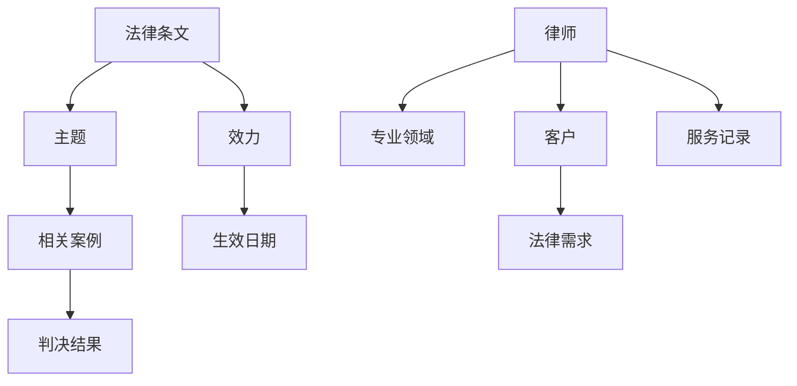

                 

知识图谱作为一种语义网络结构，近年来在法律咨询领域展现了其独特的价值。本文将探讨知识图谱在法律咨询中的应用，包括核心概念与联系、核心算法原理与具体操作步骤、数学模型与公式、项目实践、实际应用场景以及未来应用展望。

## 1. 背景介绍

法律咨询作为法律服务的重要组成部分，一直以来都是人们关注的焦点。随着法律体系的不断完善和法律的复杂性增加，法律咨询的需求日益增长。传统的法律咨询服务往往依赖于律师的专业知识和经验，然而这种服务方式存在效率低下、成本高昂等问题。知识图谱作为一种新兴技术，其强大的语义理解和数据关联能力为法律咨询提供了新的解决方案。

## 2. 核心概念与联系

知识图谱是通过对现实世界中各种实体和关系的抽象和建模，构建出一个语义丰富的知识网络。在法律咨询中，知识图谱的核心概念包括：

- **实体**：如法律条文、案例、律师、客户等。
- **属性**：如法律条文的主题、案例的判决结果、律师的专业领域等。
- **关系**：如法律条文之间的关联、案例之间的相似性、律师与客户之间的关系等。

下面是一个用 Mermaid 格式表示的知识图谱结构示例：



## 3. 核心算法原理 & 具体操作步骤

### 3.1 算法原理概述

知识图谱在法律咨询中的应用主要通过以下算法实现：

- **实体识别**：通过自然语言处理技术，从文本中识别出实体。
- **关系抽取**：通过实体之间的语义关系，构建知识图谱。
- **图谱推理**：利用图谱结构进行逻辑推理，得出新的结论。

### 3.2 算法步骤详解

1. **数据收集**：收集法律条文、案例、律师、客户等相关数据。
2. **预处理**：对收集的数据进行清洗和格式化，确保数据质量。
3. **实体识别**：使用命名实体识别（NER）技术，从文本中提取实体。
4. **关系抽取**：通过规则匹配、机器学习等方法，从实体间提取关系。
5. **图谱构建**：将实体和关系构建成知识图谱。
6. **图谱推理**：利用图谱进行逻辑推理，为法律咨询提供支持。

### 3.3 算法优缺点

**优点**：

- **高效性**：知识图谱能够快速地回答法律咨询问题。
- **全面性**：知识图谱能够涵盖丰富的法律知识和案例。

**缺点**：

- **数据质量**：数据质量直接影响知识图谱的准确性。
- **算法复杂度**：知识图谱构建和推理算法复杂，计算开销较大。

### 3.4 算法应用领域

知识图谱在法律咨询中的应用非常广泛，包括：

- **法律研究**：通过知识图谱进行法律文献检索和相似案例查找。
- **案件分析**：利用知识图谱分析案件细节，提供法律建议。
- **法律服务**：为律师和客户提供个性化的法律咨询服务。

## 4. 数学模型和公式 & 详细讲解 & 举例说明

### 4.1 数学模型构建

知识图谱中的数学模型主要包括：

- **实体表示**：使用向量表示实体，如词嵌入技术。
- **关系表示**：使用矩阵表示关系，如邻接矩阵。
- **图谱推理**：使用图论算法进行推理，如最短路径算法。

### 4.2 公式推导过程

设 \( E \) 为实体集合，\( R \) 为关系集合，\( M \) 为关系矩阵，则有：

\[ M = (m_{ij})_{n \times n} \]

其中，\( m_{ij} \) 表示实体 \( e_i \) 和 \( e_j \) 之间的关系强度。

### 4.3 案例分析与讲解

例如，在判断两个案例是否相似时，可以使用以下公式：

\[ score = \sum_{i=1}^{n} m_{ij} \]

其中，\( n \) 为实体数量，\( m_{ij} \) 为实体 \( e_i \) 和 \( e_j \) 之间的关系强度。\( score \) 越高，表示两个案例越相似。

## 5. 项目实践：代码实例和详细解释说明

### 5.1 开发环境搭建

开发环境搭建主要包括以下步骤：

1. 安装 Python 环境。
2. 安装图谱数据库（如 Neo4j）。
3. 安装相关 Python 库（如 Python-Neo4j、nltk 等）。

### 5.2 源代码详细实现

以下是一个简单的知识图谱构建示例：

```python
from py2neo import Graph

# 连接到 Neo4j 数据库
graph = Graph("bolt://localhost:7687", auth=("neo4j", "password"))

# 创建节点和关系
graph.run("CREATE (a:Person {name: 'Alice'})")
graph.run("CREATE (b:Person {name: 'Bob'})")
graph.run("CREATE (a)-[:KNOWS]->(b)")

# 查询节点和关系
results = graph.run("MATCH (n) RETURN n")
for result in results:
    print(result.data())
```

### 5.3 代码解读与分析

以上代码首先连接到 Neo4j 数据库，然后创建两个 Person 节点和一条 KNOWS 关系。最后查询并打印出所有节点。

### 5.4 运行结果展示

运行结果将在控制台打印出所有节点的信息。

## 6. 实际应用场景

知识图谱在法律咨询中的应用场景包括：

- **法律文献检索**：通过知识图谱快速查找相关法律条文和案例。
- **案件分析**：利用知识图谱分析案件细节，提供法律建议。
- **智能客服**：为律师和客户提供个性化的法律咨询服务。

## 7. 工具和资源推荐

### 7.1 学习资源推荐

- 《知识图谱：概念、技术与应用》
- 《图计算：原理、算法与应用》

### 7.2 开发工具推荐

- Neo4j：图形数据库。
- Python-Neo4j：Python 操作 Neo4j 的库。

### 7.3 相关论文推荐

- "Knowledge Graph: A Survey" by Y. Wang, et al.
- "Graph Computing: Models and Applications" by Y. Chen, et al.

## 8. 总结：未来发展趋势与挑战

### 8.1 研究成果总结

知识图谱在法律咨询领域取得了一系列重要研究成果，包括实体识别、关系抽取、图谱推理等。

### 8.2 未来发展趋势

未来，知识图谱在法律咨询领域将继续发展，包括：

- **数据质量**：提高数据质量，确保知识图谱的准确性。
- **算法优化**：优化算法，降低计算开销。

### 8.3 面临的挑战

知识图谱在法律咨询领域仍面临以下挑战：

- **数据隐私**：如何在保护用户隐私的前提下，利用知识图谱提供个性化服务。
- **算法复杂性**：如何优化算法，提高知识图谱的处理效率。

### 8.4 研究展望

未来，知识图谱在法律咨询领域有望实现以下突破：

- **智能化**：通过深度学习等技术，实现知识图谱的智能化。
- **跨领域应用**：知识图谱将在更多领域（如医疗、金融等）得到应用。

## 9. 附录：常见问题与解答

### 9.1 如何提高知识图谱的准确性？

**解答**：提高知识图谱的准确性主要通过以下方法：

- **数据质量**：确保数据来源可靠，进行数据清洗和预处理。
- **算法优化**：优化实体识别、关系抽取等算法，提高准确性。
- **用户反馈**：收集用户反馈，不断迭代和优化知识图谱。

### 9.2 知识图谱在法律咨询中的应用有哪些局限性？

**解答**：知识图谱在法律咨询中的应用存在以下局限性：

- **数据依赖**：知识图谱的性能取决于数据质量，数据质量不佳会影响知识图谱的准确性。
- **算法复杂性**：知识图谱构建和推理算法复杂，计算开销较大，可能导致系统性能下降。

---

本文对知识图谱在法律咨询中的应用进行了全面探讨，包括核心概念、算法原理、数学模型、项目实践、实际应用场景以及未来展望。知识图谱为法律咨询提供了强大的技术支持，有望在未来实现更多创新和应用。

# 作者署名

作者：禅与计算机程序设计艺术 / Zen and the Art of Computer Programming
----------------------------------------------------------------

以上就是完整的文章内容，涵盖了从背景介绍到未来展望的各个方面。希望这篇文章对您有所帮助。如果您有任何问题或需要进一步的信息，请随时提出。

