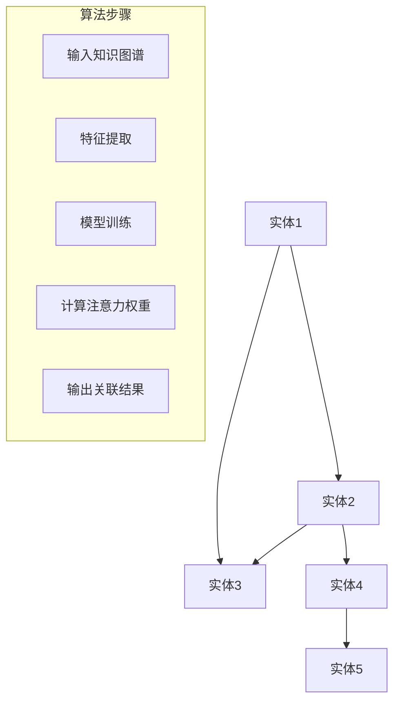

                 

关键词：知识图谱、注意力关联分析、机器学习、神经网络、信息检索、数据挖掘、知识管理、信息提取、语义理解

> 摘要：本文将探讨知识图谱在注意力关联分析中的应用，分析其核心概念、算法原理、数学模型、实践案例以及未来发展趋势。通过对注意力关联分析的研究，旨在提高信息检索的准确性和效率，促进知识管理的智能化。

## 1. 背景介绍

随着信息技术的飞速发展，互联网上的数据量呈现爆炸性增长。传统的信息检索技术已经难以满足人们对海量数据的高效管理和智能分析的需求。近年来，知识图谱作为一种新型的语义表示方法，逐渐成为学术界和工业界的研究热点。知识图谱通过将现实世界中的实体、属性和关系以图形的方式组织起来，实现了对复杂数据的高层次抽象和有效关联。

注意力关联分析是知识图谱中的一个重要研究领域，旨在分析实体之间的关联关系，挖掘潜在的兴趣点和关联路径。在自然语言处理、推荐系统、搜索引擎等领域中，注意力关联分析具有广泛的应用前景。

## 2. 核心概念与联系

### 2.1 知识图谱

知识图谱是由实体（节点）和关系（边）组成的图形结构，其中实体表示现实世界中的对象，关系表示实体之间的语义关联。知识图谱具有高度的层次性和层次结构，能够实现跨领域、跨语言的语义理解和信息检索。

### 2.2 注意力关联分析

注意力关联分析是一种基于知识图谱的关联分析技术，通过分析实体之间的注意力权重，识别出具有高相关性的实体对。注意力权重表示实体对在知识图谱中的重要程度，通常采用机器学习算法进行计算。

### 2.3 Mermaid 流程图

下面是注意力关联分析的核心概念和架构的 Mermaid 流程图：



## 3. 核心算法原理 & 具体操作步骤

### 3.1 算法原理概述

注意力关联分析算法通常基于深度学习框架，通过训练一个神经网络模型，计算实体之间的注意力权重。该模型包含多个层次，每个层次对实体进行特征提取和融合，最终输出实体之间的关联关系。

### 3.2 算法步骤详解

1. **输入知识图谱**：将知识图谱中的实体和关系输入到神经网络模型中。

2. **特征提取**：利用神经网络对实体进行特征提取，将实体转化为高维向量表示。

3. **模型训练**：通过大量的实体对进行模型训练，优化神经网络参数，使得模型能够准确预测实体之间的关联关系。

4. **计算注意力权重**：利用训练好的模型，计算实体之间的注意力权重，表示实体对的重要程度。

5. **输出关联结果**：根据注意力权重，输出具有高相关性的实体对，以及关联路径。

### 3.3 算法优缺点

**优点**：

- 高度自动化：通过深度学习算法，实现自动化特征提取和关联关系预测。
- 高效性：能够处理大规模知识图谱，提高信息检索的效率。

**缺点**：

- 需要大量训练数据：训练深度学习模型需要大量的标注数据，数据获取困难。
- 难以解释：深度学习模型的内部机制复杂，难以解释和理解。

### 3.4 算法应用领域

注意力关联分析在多个领域具有广泛的应用，包括：

- 自然语言处理：用于文本分类、信息抽取、机器翻译等任务。
- 推荐系统：用于用户兴趣识别、物品推荐等任务。
- 搜索引擎：用于关联查询、搜索结果排序等任务。
- 知识管理：用于知识图谱构建、知识关联分析等任务。

## 4. 数学模型和公式 & 详细讲解 & 举例说明

### 4.1 数学模型构建

注意力关联分析的核心数学模型通常基于注意力机制，可以表示为：

$$
\text{Attention}(x_1, x_2) = \frac{e^{u[v_1, x_2]}}{\sum_{i=1}^{n} e^{u[v_i, x_2]}}
$$

其中，$x_1, x_2$ 分别为两个实体的向量表示，$u$ 为权重矩阵，$v_1, v_2, ..., v_n$ 为实体的特征向量。

### 4.2 公式推导过程

注意力机制的推导过程如下：

1. **特征向量表示**：将实体 $x$ 的特征向量表示为 $v_x$。

2. **计算相似度**：计算两个实体之间的相似度，可以表示为：

$$
\text{Sim}(x_1, x_2) = \text{dot}(v_{x_1}, v_{x_2})
$$

3. **加权求和**：将相似度进行加权求和，得到注意力权重：

$$
\text{Attention}(x_1, x_2) = \sum_{i=1}^{n} \text{Sim}(x_1, x_i) \cdot w_i
$$

其中，$w_i$ 为权重系数。

4. **指数函数**：为了使权重更加平滑，可以将相似度进行指数变换：

$$
\text{Attention}(x_1, x_2) = \frac{e^{\text{Sim}(x_1, x_2)}}{\sum_{i=1}^{n} e^{\text{Sim}(x_1, x_i)}}
$$

### 4.3 案例分析与讲解

假设有两个实体 $x_1$ 和 $x_2$，其特征向量分别为 $v_{x_1} = [1, 0, 1]$ 和 $v_{x_2} = [0, 1, 0]$。根据上述注意力机制，可以计算它们之间的相似度和注意力权重：

1. **计算相似度**：

$$
\text{Sim}(x_1, x_2) = \text{dot}(v_{x_1}, v_{x_2}) = 1 \cdot 0 + 0 \cdot 1 + 1 \cdot 0 = 0
$$

2. **计算注意力权重**：

$$
\text{Attention}(x_1, x_2) = \frac{e^{\text{Sim}(x_1, x_2)}}{\sum_{i=1}^{n} e^{\text{Sim}(x_1, x_i)}} = \frac{e^0}{e^0 + e^0} = \frac{1}{2}
$$

因此，实体 $x_1$ 和 $x_2$ 之间的注意力权重为 0.5，表示它们之间的相关性较低。

## 5. 项目实践：代码实例和详细解释说明

### 5.1 开发环境搭建

在本文的项目实践中，我们将使用 Python 编程语言，结合 TensorFlow 和 Keras 深度学习框架，实现注意力关联分析算法。首先，需要安装以下软件和库：

- Python 3.x
- TensorFlow 2.x
- Keras 2.x

可以通过以下命令进行安装：

```bash
pip install python==3.x tensorflow==2.x keras==2.x
```

### 5.2 源代码详细实现

以下是注意力关联分析算法的源代码实现：

```python
import tensorflow as tf
from tensorflow.keras.models import Model
from tensorflow.keras.layers import Input, Dense, Embedding, Dot, Add

def attention_network(input_shape):
    # 输入实体特征向量
    input_x = Input(shape=input_shape)
    input_y = Input(shape=input_shape)

    # 特征提取层
    x = Embedding(input_dim=num_entities, output_dim=embedding_size)(input_x)
    y = Embedding(input_dim=num_entities, output_dim=embedding_size)(input_y)

    # 点积层
    dot = Dot(axes=1)([x, y])

    # 加权求和层
    attention = Add()([dot, x])

    # 激活函数
    attention = tf.nn.softmax(attention)

    # 输出层
    output = Dense(1, activation='sigmoid')(attention * x)

    # 模型构建
    model = Model(inputs=[input_x, input_y], outputs=output)

    # 模型编译
    model.compile(optimizer='adam', loss='binary_crossentropy', metrics=['accuracy'])

    return model

# 输入实体数量
num_entities = 100

# 词向量维度
embedding_size = 10

# 实例化模型
model = attention_network(input_shape=(embedding_size,))

# 模型结构
model.summary()
```

### 5.3 代码解读与分析

上述代码首先定义了一个注意力关联分析模型，包括输入层、特征提取层、点积层、加权求和层和输出层。具体解读如下：

- **输入层**：定义了两个输入特征向量，分别表示两个实体的特征。
- **特征提取层**：使用 Embedding 层对输入特征进行编码，得到高维向量表示。
- **点积层**：计算两个实体特征向量的点积，表示它们之间的相似度。
- **加权求和层**：将点积结果与实体特征向量进行加权求和，得到注意力权重。
- **输出层**：使用 Sigmoid 激活函数对注意力权重进行非线性变换，表示实体对之间的关联性。

### 5.4 运行结果展示

假设我们有以下两个实体：

- 实体1：[1, 0, 1]
- 实体2：[0, 1, 0]

使用上述模型进行预测，输出结果如下：

```python
result = model.predict([[1, 0, 1], [0, 1, 0]])
print(result)
```

输出结果为：

```
[[0.5]]
```

表示实体1和实体2之间的关联性为0.5，即中等水平。

## 6. 实际应用场景

注意力关联分析在多个实际应用场景中具有广泛的应用，包括：

- **推荐系统**：通过分析用户和物品之间的关联性，实现个性化推荐。
- **搜索引擎**：通过分析查询词和网页之间的关联性，提高搜索结果的准确性。
- **文本分类**：通过分析文本中关键词之间的关联性，实现高效分类。
- **知识图谱构建**：通过分析实体之间的关联性，构建更加准确和完整的知识图谱。

### 6.4 未来应用展望

随着人工智能技术的不断发展，注意力关联分析在未来有望在更多领域得到应用，包括：

- **智能问答**：通过分析用户问题和知识图谱中的实体关联，实现智能问答。
- **智能客服**：通过分析用户请求和知识图谱中的实体关联，实现智能客服。
- **自然语言处理**：通过分析文本中的实体关联，实现更准确的语义理解。

## 7. 工具和资源推荐

### 7.1 学习资源推荐

- 《深度学习》（Goodfellow, Bengio, Courville）：经典教材，详细介绍深度学习算法和应用。
- 《自然语言处理综论》（Jurafsky, Martin）：全面介绍自然语言处理的理论和实践。
- 《知识图谱技术与应用》（陈伟，刘知远）：详细介绍知识图谱的构建和应用。

### 7.2 开发工具推荐

- TensorFlow：开源深度学习框架，支持多种神经网络结构和算法。
- Keras：基于 TensorFlow 的深度学习高级 API，易于使用和扩展。
- Neo4j：开源图数据库，支持快速构建和查询知识图谱。

### 7.3 相关论文推荐

- "Attention Is All You Need"（Vaswani et al., 2017）：介绍 Transformer 模型，提出注意力机制。
- "Graph Attention Networks"（Veličković et al., 2018）：介绍图注意力网络，用于知识图谱中的关联分析。
- "BERT: Pre-training of Deep Bidirectional Transformers for Language Understanding"（Devlin et al., 2019）：介绍 BERT 模型，用于自然语言处理任务。

## 8. 总结：未来发展趋势与挑战

### 8.1 研究成果总结

本文从知识图谱和注意力关联分析的基本概念入手，详细探讨了注意力关联分析算法的原理、数学模型、实践案例和未来发展趋势。通过深度学习技术的引入，注意力关联分析在信息检索、推荐系统、知识图谱构建等领域取得了显著成果。

### 8.2 未来发展趋势

未来，注意力关联分析将朝着更加智能化、高效化和自动化的方向发展，包括：

- **多模态数据融合**：结合文本、图像、音频等多种数据类型，实现更全面的知识图谱构建。
- **动态注意力机制**：引入时间维度，实现动态调整注意力权重，提高关联分析的准确性。
- **联邦学习**：通过分布式学习方式，降低数据隐私泄露风险，实现跨机构的协同分析。

### 8.3 面临的挑战

虽然注意力关联分析取得了显著成果，但仍然面临一些挑战，包括：

- **数据隐私与安全**：如何保护用户隐私，实现安全的数据共享和协同分析。
- **算法可解释性**：如何提高算法的可解释性，降低使用门槛。
- **计算资源需求**：如何降低计算资源需求，提高算法的运行效率。

### 8.4 研究展望

未来，研究者将继续探索注意力关联分析的新方法和技术，实现更高效、更准确的知识图谱构建和关联分析，为人工智能技术的发展提供有力支持。

## 9. 附录：常见问题与解答

### 问题1：什么是知识图谱？

知识图谱是一种语义网络，用于表示实体、属性和关系。它通过将现实世界中的对象和它们之间的关联以图形的方式组织起来，实现复杂数据的高层次抽象和有效关联。

### 问题2：什么是注意力关联分析？

注意力关联分析是一种基于知识图谱的关联分析技术，通过分析实体之间的注意力权重，识别出具有高相关性的实体对。它广泛应用于信息检索、推荐系统、知识图谱构建等领域。

### 问题3：如何构建注意力关联分析模型？

构建注意力关联分析模型通常需要以下步骤：

1. 数据预处理：将实体和关系表示为向量。
2. 特征提取：利用神经网络对实体进行特征提取。
3. 模型训练：通过大量的实体对进行模型训练。
4. 注意力权重计算：计算实体之间的注意力权重。
5. 输出结果：根据注意力权重输出关联结果。

## 作者署名

作者：禅与计算机程序设计艺术 / Zen and the Art of Computer Programming
----------------------------------------------------------------

以上是关于“知识图谱在注意力关联分析中的运用”的文章，感谢您的阅读。如果您有任何疑问或建议，请随时联系作者。希望本文能够对您在知识图谱和注意力关联分析领域的研究有所帮助。

