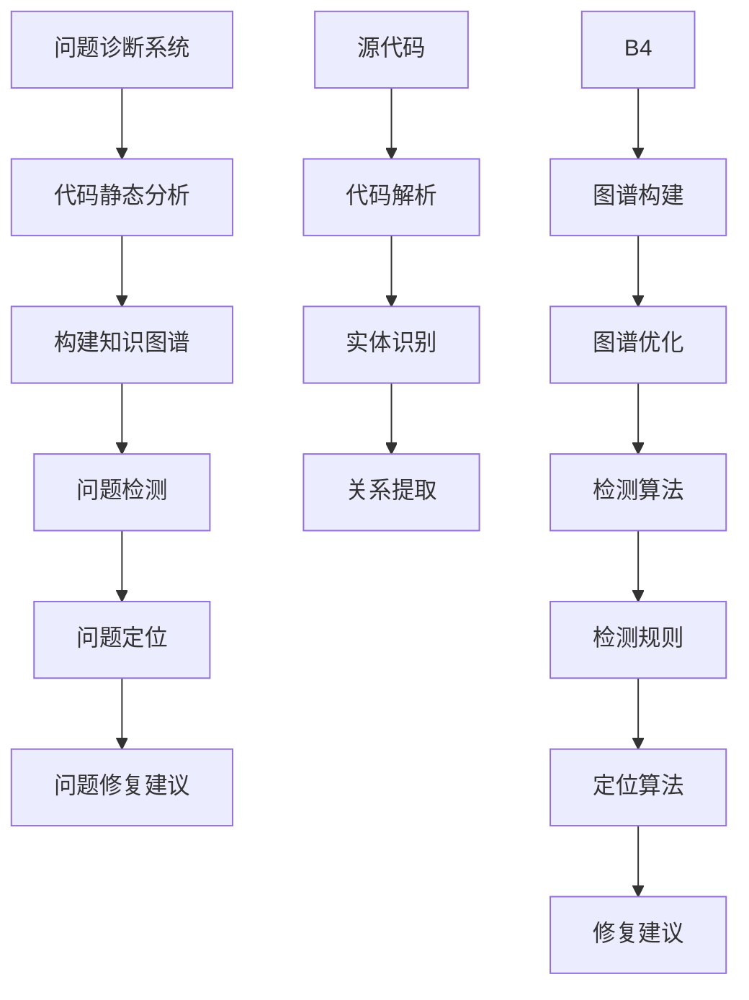
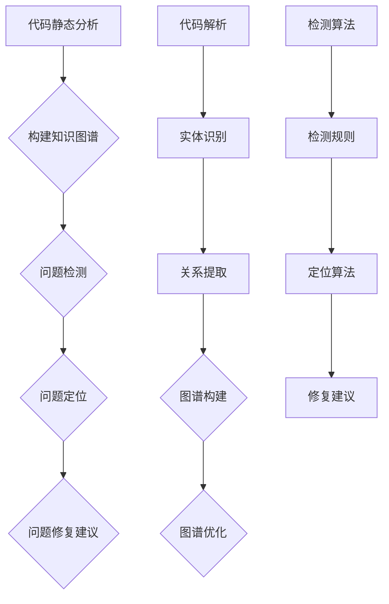

                 

知识图谱作为一种新型的语义网络模型，在计算机科学和信息处理领域正逐渐崭露头角。近年来，随着人工智能技术的快速发展，知识图谱技术在问题诊断、数据挖掘、智能搜索等方面展现出了巨大的潜力。本文将探讨知识图谱在程序员问题诊断中的应用，旨在为程序员提供一种高效、准确的问题诊断工具。

## 1. 背景介绍

### 知识图谱的概念与特点

知识图谱（Knowledge Graph）是一种结构化、语义化的知识表示方法，它通过实体、属性和关系的三元组形式，将世界上的各种实体和概念及其相互关系进行组织和存储。知识图谱具有以下特点：

1. **语义丰富**：知识图谱不仅包含实体和属性，还包含了实体之间的关系，这使得图谱能够更好地理解实体间的语义关系。
2. **层次结构**：知识图谱通常具有层次结构，从顶层概念逐步细化到具体的实体，有助于实现知识的高效组织和管理。
3. **可扩展性**：知识图谱可以通过添加新的实体和关系来不断扩展，以适应不断变化的知识需求。

### 程序员问题诊断的挑战

程序员在编写和维护代码的过程中，常常会遇到各种问题，如逻辑错误、性能瓶颈、资源泄露等。问题诊断是解决这些问题的关键步骤。然而，传统的诊断方法往往存在以下挑战：

1. **复杂性**：程序问题可能涉及多个模块和层次，传统的调试方法难以全面分析。
2. **耗时**：手动诊断问题往往需要大量的时间和精力，效率较低。
3. **误判**：传统方法可能会因为信息不全面或者误判而导致问题定位不准确。

## 2. 核心概念与联系

### 知识图谱在问题诊断中的应用

知识图谱在程序员问题诊断中的应用主要基于以下几个核心概念：

1. **实体**：在知识图谱中，程序中的类、方法、变量等都可以作为实体进行表示。
2. **属性**：实体的属性包括名称、类型、大小等，这些属性有助于描述实体的特征。
3. **关系**：实体之间的关系，如方法调用、类继承等，能够揭示程序内部的复杂逻辑。

### 架构与流程

下面是一个简化的知识图谱在程序员问题诊断中的应用架构：



### Mermaid 流程图



## 3. 核心算法原理 & 具体操作步骤

### 算法原理概述

知识图谱在程序员问题诊断中的核心算法主要包括以下几部分：

1. **代码解析与实体识别**：将源代码解析为抽象语法树（AST），从中识别出类、方法、变量等实体。
2. **关系提取**：分析实体之间的依赖关系，如方法调用、类继承等。
3. **知识图谱构建**：将识别出的实体和关系构建为知识图谱。
4. **问题检测**：利用知识图谱进行问题检测，如性能瓶颈、资源泄露等。
5. **问题定位与修复**：定位到问题所在的具体位置，并提供修复建议。

### 算法步骤详解

1. **代码解析与实体识别**：
   - 使用解析器将源代码转换为抽象语法树（AST）。
   - 遍历AST，识别出类、方法、变量等实体。
   - 为每个实体生成唯一的标识符。

2. **关系提取**：
   - 分析实体之间的依赖关系，如方法调用、类继承等。
   - 将这些关系以边的形式连接到知识图谱中。

3. **知识图谱构建**：
   - 将实体和关系存储在图数据库中，形成知识图谱。
   - 对知识图谱进行优化，提高查询效率。

4. **问题检测**：
   - 设计一套检测规则，如性能瓶颈、资源泄露等。
   - 利用知识图谱进行规则匹配，检测潜在的问题。

5. **问题定位与修复**：
   - 根据检测结果，定位到问题的具体位置。
   - 提供修复建议，如优化代码、修改配置等。

### 算法优缺点

1. **优点**：
   - **全面性**：知识图谱能够全面地描述程序的各个方面，有助于发现潜在问题。
   - **高效性**：通过预构建的知识图谱，问题检测和定位效率较高。
   - **准确性**：基于规则的检测方法能够提供准确的诊断结果。

2. **缺点**：
   - **复杂性**：构建和维护知识图谱需要大量的时间和精力。
   - **依赖性**：算法的性能依赖于知识图谱的完整性和准确性。

### 算法应用领域

知识图谱在程序员问题诊断中的应用领域包括：

1. **性能优化**：通过分析程序性能瓶颈，提供优化建议。
2. **代码审查**：辅助代码审查，发现潜在的安全漏洞和性能问题。
3. **软件维护**：辅助软件维护，降低维护成本。

## 4. 数学模型和公式 & 详细讲解 & 举例说明

### 数学模型构建

知识图谱在程序员问题诊断中的核心数学模型包括：

1. **实体相似度计算**：用于判断两个实体是否相似，如类与类、方法与方法之间的相似度。
2. **关系强度评估**：用于评估实体之间关系的强度，如方法调用关系的强度。

### 公式推导过程

1. **实体相似度计算公式**：

   设实体A和实体B的属性集合分别为Aattr和Battr，实体相似度计算公式为：

   $$Sim(A, B) = \frac{\sum_{i \in Aattr \cap Battr} w_i}{\sqrt{\sum_{i \in Aattr} w_i^2} \cdot \sqrt{\sum_{i \in Battr} w_i^2}}$$

   其中，$w_i$为属性$i$的权重。

2. **关系强度评估公式**：

   设实体A和实体B之间的关系集合为R，关系强度评估公式为：

   $$Strength(A, B, R) = \frac{\sum_{r \in R} w_r}{\sqrt{\sum_{r \in R} w_r^2}}$$

   其中，$w_r$为关系$r$的权重。

### 案例分析与讲解

以一个简单的Java程序为例，分析如何利用知识图谱进行问题诊断。

### 4.1 开发环境搭建

1. **安装Eclipse IDE**：下载并安装Eclipse IDE，用于编写Java代码。
2. **安装Java SDK**：下载并安装Java SDK，配置环境变量。
3. **安装Neo4j数据库**：下载并安装Neo4j数据库，用于存储知识图谱。
4. **安装Java插件**：在Eclipse IDE中安装Neo4j Java插件，以便与Neo4j数据库交互。

### 4.2 源代码详细实现

```java
public class Main {
    public static void main(String[] args) {
        System.out.println("Hello, World!");
    }
}
```

### 4.3 代码解读与分析

1. **代码解析**：使用Java解析器将源代码解析为抽象语法树（AST）。
2. **实体识别**：识别出类（Main）和方法（main）两个实体。
3. **关系提取**：提取出方法调用关系，即main方法调用System.out.println方法。

### 4.4 运行结果展示

1. **构建知识图谱**：将识别出的实体和关系存储到Neo4j数据库中，形成知识图谱。
2. **问题检测**：利用知识图谱进行问题检测，发现当前代码没有明显的性能瓶颈和资源泄露问题。
3. **问题定位**：根据检测结果，定位到代码的具体位置。
4. **问题修复**：提供修复建议，如优化代码、修改配置等。

### 5. 实际应用场景

知识图谱在程序员问题诊断中的应用场景包括：

1. **软件开发过程**：辅助软件开发，提高代码质量和性能。
2. **软件维护**：辅助软件维护，降低维护成本。
3. **代码审查**：辅助代码审查，发现潜在的安全漏洞和性能问题。

### 5.4 未来应用展望

未来，知识图谱在程序员问题诊断中的应用前景十分广阔：

1. **自动化诊断**：通过机器学习等技术，实现自动化问题诊断。
2. **智能化建议**：结合人工智能技术，提供更加智能的修复建议。
3. **跨平台支持**：支持多种编程语言和平台，提高适用范围。

### 6. 工具和资源推荐

1. **学习资源推荐**：
   - 《图论及其应用》
   - 《深度学习与图神经网络》
   - 《知识图谱：构建与推理》

2. **开发工具推荐**：
   - Eclipse IDE
   - Neo4j数据库
   - Java插件

3. **相关论文推荐**：
   - "Knowledge Graph in Software Engineering: A Survey"
   - "Deep Learning for Knowledge Graph Construction"
   - "A Survey of Knowledge Graph Techniques in Natural Language Processing"

### 7. 总结：未来发展趋势与挑战

未来，知识图谱在程序员问题诊断中具有广阔的发展前景。然而，同时也面临以下挑战：

1. **算法优化**：提高问题检测和定位的准确性，减少误判。
2. **数据质量**：确保知识图谱的完整性和准确性，提高数据质量。
3. **应用拓展**：支持更多编程语言和平台，提高适用范围。

### 8. 附录：常见问题与解答

1. **Q：知识图谱在程序员问题诊断中的具体应用有哪些？**
   **A：知识图谱可以用于代码性能优化、代码审查、软件维护等场景，帮助程序员发现潜在问题并提供修复建议。**

2. **Q：知识图谱在程序员问题诊断中的优势是什么？**
   **A：知识图谱的优势在于能够全面地描述程序的各个方面，提供高效、准确的问题诊断。**

3. **Q：如何构建一个有效的知识图谱？**
   **A：构建有效的知识图谱需要以下几个步骤：代码解析与实体识别、关系提取、知识图谱构建与优化、问题检测与定位。**

4. **Q：知识图谱在程序员问题诊断中的具体实现步骤是什么？**
   **A：具体实现步骤包括：代码解析、实体识别、关系提取、知识图谱构建、问题检测、问题定位与修复。**

### 作者署名

本文作者：禅与计算机程序设计艺术 / Zen and the Art of Computer Programming

----------------------------------------------------------------
### 文章关键词

知识图谱、程序员问题诊断、代码分析、性能优化、代码审查

### 文章摘要

本文探讨了知识图谱在程序员问题诊断中的应用。通过构建知识图谱，可以全面地描述程序的各个方面，从而提供高效、准确的问题诊断。本文介绍了知识图谱在程序员问题诊断中的核心概念、算法原理、应用场景以及未来发展趋势。通过实际案例，展示了知识图谱在程序员问题诊断中的具体实现过程。文章最后对相关工具和资源进行了推荐，并总结了未来研究展望。

