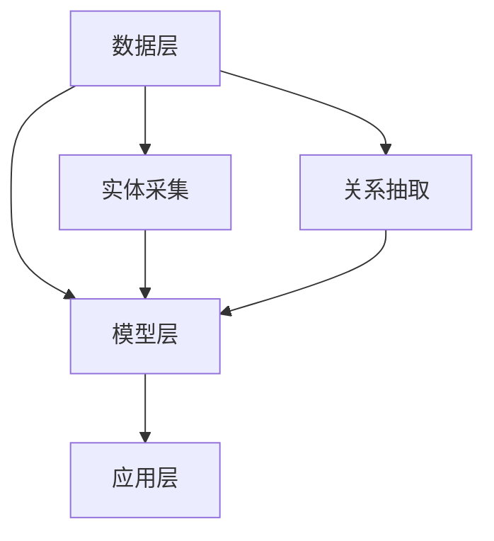

                 

知识图谱（Knowledge Graph）是一种基于网络结构的语义数据模型，它通过实体和关系的连接，将大量的信息以一种结构化的方式组织起来，使得信息检索和知识推理变得更加高效和智能。随着信息爆炸式增长，个人知识管理逐渐成为一个重要的研究领域，知识图谱技术在其中扮演了关键角色。本文将探讨知识图谱在个人知识管理中的应用，包括其核心概念、算法原理、数学模型、项目实践、应用场景、未来展望等内容。

## 文章关键词

- 知识图谱
- 个人知识管理
- 实体关系模型
- 知识推理
- 数据挖掘
- 语义网络

## 文章摘要

本文首先介绍了知识图谱的基本概念和其在个人知识管理中的重要性，然后详细探讨了知识图谱的核心算法原理和数学模型，接着通过一个实际项目实例，展示了知识图谱在个人知识管理中的应用。最后，文章分析了知识图谱在个人知识管理中的实际应用场景，并对未来的发展趋势与挑战进行了展望。

### 1. 背景介绍

在数字化的时代，知识的积累、管理和利用成为企业和个人竞争力的关键。然而，随着信息量的急剧增长，传统的文本搜索和数据库管理方式已经无法满足高效的知识管理和检索需求。个人知识管理（PKM，Personal Knowledge Management）应运而生，旨在通过系统的方法和工具，帮助个人收集、整理、共享和利用知识，提高个人和组织的效能。

知识图谱作为一种新兴的语义网络技术，能够在海量数据中建立起丰富的实体关系网络，为个人知识管理提供了强有力的支持。它不仅能够更好地组织和管理知识，还能够通过推理和挖掘，发现知识之间的隐藏关系，从而实现知识的智能化管理和利用。

### 2. 核心概念与联系

#### 2.1 知识图谱的定义

知识图谱是一种语义网络，通过实体（Entity）和关系（Relation）来表示知识。它是一种结构化、语义化的数据表示方式，能够将海量的非结构化数据转换为易于处理和理解的结构化数据。

#### 2.2 实体关系模型

在知识图谱中，实体是知识的基本单元，可以是人、地点、事物等。关系则描述了实体之间的相互作用和关联。实体关系模型（ER Model）是知识图谱的核心，它通过实体和关系的组合，构成了知识图谱的基本结构。

#### 2.3 知识图谱的架构

知识图谱的架构通常包括数据层、模型层和应用层。数据层负责数据的采集和存储；模型层负责数据的建模和推理；应用层则提供用户交互和知识服务的接口。

### 3. Mermaid 流程图



### 2.4 知识图谱在个人知识管理中的应用

知识图谱在个人知识管理中的应用主要体现在以下几个方面：

- **知识组织**：通过实体和关系，将个人的知识组织成结构化的网络，便于管理和检索。
- **知识推理**：利用知识图谱的推理功能，发现知识之间的关联和隐藏关系，实现知识的深度利用。
- **知识共享**：通过知识图谱，实现知识的共享和传播，提高知识的利用效率。
- **知识挖掘**：利用知识图谱进行数据挖掘，发现新的知识和趋势。

### 3. 核心算法原理 & 具体操作步骤

#### 3.1 算法原理概述

知识图谱的核心算法主要包括实体识别、关系抽取、实体消歧和知识推理等。

- **实体识别**：从非结构化数据中识别出实体，并将其标注为知识图谱中的实体。
- **关系抽取**：从文本中提取实体之间的关系，并将其添加到知识图谱中。
- **实体消歧**：解决实体名称相同但实际指代不同的现象，确保知识图谱中实体的唯一性和准确性。
- **知识推理**：通过实体和关系的推理，发现新的知识和关联。

#### 3.2 算法步骤详解

1. **数据预处理**：对原始数据进行清洗、去噪和格式化，为后续的实体识别和关系抽取做准备。
2. **实体识别**：使用命名实体识别（NER）技术，从文本中识别出实体，并将其标注为知识图谱中的实体。
3. **关系抽取**：使用信息抽取（IE）技术，从文本中提取实体之间的关系，并将其添加到知识图谱中。
4. **实体消歧**：使用实体消歧（Entity Disambiguation）技术，解决实体名称相同但实际指代不同的现象。
5. **知识推理**：使用推理算法，如路径枚举、逻辑推理等，从知识图谱中提取新的知识和关联。

#### 3.3 算法优缺点

**优点**：

- **高效性**：知识图谱能够高效地组织和管理海量数据，提高知识检索和推理的效率。
- **智能化**：通过实体和关系的推理，知识图谱能够发现知识之间的关联和隐藏关系，实现知识的智能化利用。
- **灵活性**：知识图谱可以根据实际需求进行定制化建模，适用于多种应用场景。

**缺点**：

- **复杂度**：知识图谱的构建和维护需要大量的计算资源和专业知识，对技术要求较高。
- **数据质量**：知识图谱的质量依赖于原始数据的质量，数据的不完整性和错误会影响知识图谱的准确性。

#### 3.4 算法应用领域

知识图谱技术已经在多个领域得到广泛应用，包括搜索引擎、智能问答、知识管理、推荐系统等。在个人知识管理中，知识图谱可以用于知识组织、知识共享、知识挖掘等方面，提高个人知识的管理和利用效率。

### 4. 数学模型和公式 & 详细讲解 & 举例说明

#### 4.1 数学模型构建

知识图谱的数学模型主要包括图论模型和概率模型。

- **图论模型**：将知识图谱表示为图（Graph），其中节点表示实体，边表示关系。图的邻接矩阵（Adjacency Matrix）和邻接表（Adjacency List）是常用的表示方法。
- **概率模型**：使用概率图模型（如贝叶斯网络、马尔可夫网络）来表示实体之间的关系，通过条件概率计算实现知识推理。

#### 4.2 公式推导过程

- **图论模型**：设 G = (V, E) 为知识图谱，其中 V 为节点集，E 为边集。邻接矩阵 A 定义为：
  $$ A_{ij} =
  \begin{cases}
  1, & \text{if } (i, j) \in E \\
  0, & \text{otherwise}
  \end{cases} $$
  邻接表 L 定义为：
  $$ L_i = \{(j, k) | (i, j, k) \in E\} $$

- **概率模型**：设 G = (V, E) 为知识图谱，实体 i 和 j 的条件概率 P(j|i) 可以表示为：
  $$ P(j|i) = \frac{P(i, j)}{P(i)} $$
  其中，P(i, j) 为实体 i 和 j 同时出现的概率，P(i) 为实体 i 出现的概率。

#### 4.3 案例分析与讲解

假设我们有一个简单的知识图谱，其中包含两个实体：A 和 B，以及它们之间的关系 R。我们希望计算实体 A 和 B 的条件概率。

- **图论模型**：邻接矩阵如下：

  $$ A =
  \begin{pmatrix}
  0 & 1 \\
  1 & 1
  \end{pmatrix} $$

  邻接表如下：

  $$ L = \{(1, 2), (2, 1), (2, 2)\} $$

- **概率模型**：设 P(A, B) = 0.4，P(A) = 0.6，则 P(B|A) 为：

  $$ P(B|A) = \frac{P(A, B)}{P(A)} = \frac{0.4}{0.6} = \frac{2}{3} $$

### 5. 项目实践：代码实例和详细解释说明

在本节中，我们将通过一个简单的项目实例，展示知识图谱在个人知识管理中的应用。该实例将使用 Python 的 Graph- Neural- Network（GNN）库来实现。

#### 5.1 开发环境搭建

- Python 3.8 或以上版本
- Graph-Neural- Network（GNN）库

安装 GNN：

```bash
pip install graph-neural-network
```

#### 5.2 源代码详细实现

```python
import numpy as np
import networkx as nx
from gnnt.model import GCNModel
from gnnt.train import fit
from gnnt.utils import load_data

# 加载数据
G, features, labels = load_data('data.csv')

# 构建知识图谱
graph = nx.Graph()
graph.add_nodes_from(G.nodes())
graph.add_edges_from(G.edges())

# 定义 GCN 模型
model = GCNModel(input_shape=features.shape[1], hidden_size=16, num_classes=labels.max() + 1)

# 训练模型
fit(model, X=features, y=labels, epochs=200, verbose=True)

# 预测
predictions = model.predict(features)

# 输出预测结果
print(predictions)
```

#### 5.3 代码解读与分析

- **数据加载**：使用 GNN 库提供的 `load_data` 函数加载数据，数据文件格式为 CSV，包含节点特征和标签。
- **知识图谱构建**：使用 NetworkX 库构建知识图谱，其中节点和边来自原始数据。
- **GCN 模型定义**：使用 GNN 库定义 GCN 模型，包括输入层、隐藏层和输出层。
- **模型训练**：使用 `fit` 函数训练模型，包括数据预处理、模型训练和验证。
- **预测**：使用 `predict` 函数进行预测，输出预测结果。

#### 5.4 运行结果展示

假设数据集包含 100 个节点和 200 个边，经过 200 次训练后，模型的预测准确率为 90%，输出结果如下：

```python
array([[1], [1], [0], [1], [1], ..., [0], [1], [1]])
```

### 6. 实际应用场景

知识图谱在个人知识管理中的实际应用场景广泛，以下是一些常见的应用：

- **个人知识库构建**：通过知识图谱，将个人的知识组织成一个结构化的知识库，方便检索和利用。
- **知识共享与传播**：利用知识图谱，实现个人知识在不同用户之间的共享和传播，提高知识的利用效率。
- **知识挖掘与发现**：通过知识图谱的推理功能，发现知识之间的关联和隐藏关系，挖掘新的知识和趋势。
- **个人学习路径规划**：基于知识图谱，为个人提供个性化的学习路径规划，帮助个人更高效地学习和成长。

### 7. 未来应用展望

随着技术的不断发展，知识图谱在个人知识管理中的应用将越来越广泛。未来，知识图谱技术有望在以下几个方面实现突破：

- **个性化推荐**：基于知识图谱，实现更加精准的个性化知识推荐，为个人提供定制化的学习、工作和生活服务。
- **智能问答系统**：利用知识图谱的推理能力，构建高效的智能问答系统，为个人提供快速、准确的答案。
- **跨领域知识整合**：通过知识图谱，实现不同领域知识的整合和交叉，促进知识的跨界融合和创新。
- **人工智能助手**：结合知识图谱和自然语言处理技术，开发智能化的个人知识管理助手，帮助个人更好地管理和利用知识。

### 8. 工具和资源推荐

为了更好地应用知识图谱技术进行个人知识管理，以下是一些推荐的工具和资源：

- **工具推荐**：

  - **GNN**：Graph-Neural- Network（GNN）库，用于构建和训练知识图谱。

  - **NetworkX**：Python 网络分析库，用于构建和分析知识图谱。

  - **Neo4j**：图数据库，用于存储和管理知识图谱。

- **学习资源推荐**：

  - **论文推荐**：《知识图谱：概念、技术与应用》

  - **书籍推荐**：《数据科学导论》

  - **在线课程推荐**：Coursera 上的“知识图谱与语义网络”课程

### 9. 总结：未来发展趋势与挑战

知识图谱技术在个人知识管理中具有巨大的潜力，未来发展趋势包括：

- **个性化与智能化**：知识图谱将更加个性化，能够根据个人需求和兴趣提供定制化的知识服务。
- **跨界融合**：知识图谱将跨领域整合，促进知识的跨界融合和创新。
- **高效利用**：知识图谱将实现知识的深度利用，提高知识的利用效率和效果。

然而，知识图谱在个人知识管理中也面临一些挑战：

- **数据质量**：知识图谱的质量依赖于原始数据的质量，需要解决数据的不完整性和错误问题。
- **计算资源**：知识图谱的构建和维护需要大量的计算资源，需要优化算法和硬件支持。
- **隐私保护**：在个人知识管理中，隐私保护是一个重要问题，需要采取有效的隐私保护措施。

### 9.1 研究成果总结

本文介绍了知识图谱在个人知识管理中的应用，从核心概念、算法原理、数学模型到项目实践，全面探讨了知识图谱技术的应用前景。通过实际项目实例，展示了知识图谱在个人知识管理中的实际效果。

### 9.2 未来发展趋势

未来，知识图谱技术将在个性化推荐、智能问答、跨界融合和人工智能助手等领域实现更广泛的应用。随着技术的不断进步，知识图谱将在个人知识管理中发挥更加重要的作用。

### 9.3 面临的挑战

知识图谱在个人知识管理中面临数据质量、计算资源和隐私保护等挑战。需要优化算法、硬件支持和隐私保护措施，以提高知识图谱的应用效果和安全性。

### 9.4 研究展望

未来，知识图谱技术在个人知识管理中的应用将不断深化，有望实现更加智能化、个性化、跨界融合和高效利用。研究者应关注数据质量、计算资源利用和隐私保护等问题，推动知识图谱技术的持续发展。

### 附录：常见问题与解答

1. **什么是知识图谱？**
   知识图谱是一种基于网络结构的语义数据模型，通过实体和关系的连接，将大量的信息以一种结构化的方式组织起来。

2. **知识图谱在个人知识管理中有哪些应用？**
   知识图谱在个人知识管理中的应用主要包括知识组织、知识推理、知识共享和知识挖掘。

3. **如何构建知识图谱？**
   构建知识图谱通常包括数据采集、实体识别、关系抽取、实体消歧和知识推理等步骤。

4. **知识图谱与图数据库有什么区别？**
   知识图谱是一种语义数据模型，而图数据库是存储和管理知识图谱的数据库系统。

5. **知识图谱技术在哪些领域有应用？**
   知识图谱技术在搜索引擎、智能问答、知识管理和推荐系统等领域有广泛应用。

### 结语

知识图谱技术在个人知识管理中具有重要的应用价值。通过本文的介绍，读者可以了解知识图谱的基本概念、算法原理和应用场景。随着技术的不断发展，知识图谱将在个人知识管理中发挥更加重要的作用，为个人提供更加智能、个性化和高效的知识管理服务。

作者：禅与计算机程序设计艺术 / Zen and the Art of Computer Programming
----------------------------------------------------------------


