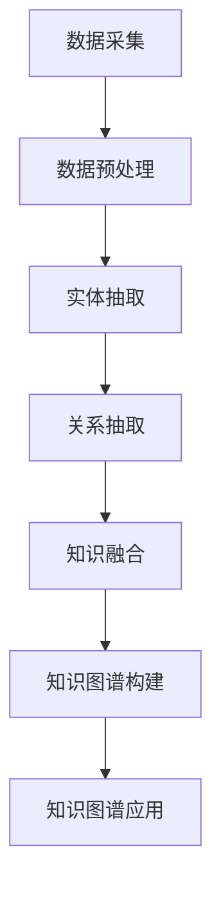

                 

关键词：知识图谱、发现引擎、人工智能、数据处理、算法优化

> 摘要：本文旨在探讨知识图谱技术在发现引擎中的实践，分析其核心概念、算法原理、数学模型、项目实践、应用场景以及未来展望。通过详细介绍知识图谱技术，阐述其在发现引擎中的关键作用，为读者提供一个全面的技术指南。

## 1. 背景介绍

随着互联网的快速发展，数据量呈爆炸式增长，如何从海量数据中快速、准确地提取有价值的信息成为了一个亟待解决的问题。传统的搜索技术和数据处理方法已经无法满足现代信息检索的需求。为了应对这一挑战，知识图谱技术应运而生。

知识图谱是一种结构化、语义化的知识表示方式，通过实体、属性和关系的网络结构来描述现实世界的知识。它能够将无序的数据转化为有序的知识，从而提高数据检索和信息发现的效率。

发现引擎是一种基于知识图谱的信息检索系统，它能够根据用户需求自动发现并推荐相关的信息。知识图谱技术在发现引擎中的应用，使得信息检索变得更加智能和个性化。

## 2. 核心概念与联系

### 2.1 知识图谱的核心概念

知识图谱由三个核心要素构成：实体（Entity）、属性（Attribute）和关系（Relationship）。

- 实体：代表现实世界中的对象，如人、地点、物品等。
- 属性：描述实体的特征，如姓名、年龄、颜色等。
- 关系：表示实体之间的关联，如朋友、相邻、包含等。

知识图谱的构建通常分为以下几个步骤：

1. 数据采集：收集与实体、属性和关系相关的数据源。
2. 数据预处理：清洗、整合和标准化数据，去除噪声和冗余信息。
3. 实体抽取：从原始数据中识别出实体，并进行分类和标注。
4. 关系抽取：从原始数据中识别出实体之间的关系。
5. 知识融合：将不同来源的数据进行整合，构建出一个统一的、结构化的知识图谱。

### 2.2 知识图谱的架构

知识图谱的架构通常包括数据层、模型层和应用层。

- 数据层：存储和管理知识图谱中的实体、属性和关系数据。
- 模型层：实现知识图谱的构建、更新和查询等功能，包括实体识别、关系抽取、图谱嵌入等算法。
- 应用层：基于知识图谱提供各种应用服务，如信息检索、推荐系统、智能问答等。

### 2.3 Mermaid 流程图



## 3. 核心算法原理 & 具体操作步骤

### 3.1 算法原理概述

知识图谱技术的核心算法主要包括实体识别、关系抽取和图谱嵌入等。

- 实体识别：通过模型从原始数据中识别出实体，并对其进行分类和标注。
- 关系抽取：从原始数据中识别出实体之间的关系，并将其表示为图谱中的边。
- 图谱嵌入：将图谱中的实体和关系转化为向量表示，以便进行高效的存储和计算。

### 3.2 算法步骤详解

1. **实体识别**：

   - 数据预处理：去除停用词、标点符号等噪声信息，并对文本进行分词。
   - 模型训练：使用预训练的语言模型（如BERT、GPT等）对实体进行分类和标注。
   - 实体抽取：对处理后的文本进行实体识别，输出实体及其标签。

2. **关系抽取**：

   - 数据预处理：对实体进行标准化处理，如将人名、地名等进行统一编码。
   - 模型训练：使用关系分类模型（如BILSTM-CRF、Transformer等）对实体关系进行预测。
   - 关系抽取：对实体对进行关系分类，输出实体之间的关系。

3. **图谱嵌入**：

   - 数据预处理：对实体和关系进行编码，如使用Word2Vec、GloVe等模型进行嵌入。
   - 模型训练：使用图嵌入模型（如GraphSAGE、GAT等）对实体和关系进行向量表示。
   - 图谱构建：将实体和关系嵌入到低维向量空间，形成图谱。

### 3.3 算法优缺点

- 实体识别：准确率高，但存在一定比例的误识别。
- 关系抽取：准确度相对较低，但能够捕捉实体之间的复杂关系。
- 图谱嵌入：能够实现高效存储和计算，但存在一定程度的失真。

### 3.4 算法应用领域

知识图谱技术广泛应用于信息检索、推荐系统、智能问答、知识图谱补全等领域。

## 4. 数学模型和公式 & 详细讲解 & 举例说明

### 4.1 数学模型构建

知识图谱中的实体、属性和关系可以用数学模型进行表示。

- 实体：设E为实体集合，每个实体e∈E可以用一个向量表示。
- 属性：设A为属性集合，每个属性a∈A可以用一个向量表示。
- 关系：设R为关系集合，每个关系r∈R可以用一个矩阵表示。

### 4.2 公式推导过程

假设实体e1和e2之间的关系r1可以表示为：

$$
r1 = e1^T \cdot e2
$$

其中，e1和e2分别为实体e1和e2的向量表示，^T表示矩阵转置。

### 4.3 案例分析与讲解

假设有两个实体e1和e2，其向量表示分别为：

$$
e1 = [1, 0, 1, 1, 0]
$$

$$
e2 = [1, 1, 0, 0, 1]
$$

它们之间的关系r1可以表示为：

$$
r1 = e1^T \cdot e2 = 1 \cdot 1 + 0 \cdot 1 + 1 \cdot 0 + 1 \cdot 0 + 0 \cdot 1 = 1
$$

这表明e1和e2之间存在一种关系，其权重为1。

## 5. 项目实践：代码实例和详细解释说明

### 5.1 开发环境搭建

- Python 3.8及以上版本
- PyTorch 1.8及以上版本
- MongoDB 4.2及以上版本

### 5.2 源代码详细实现

```python
import torch
import torch.nn as nn
import torch.optim as optim
from torch.utils.data import DataLoader
from datasets import EntityDataset

# 数据准备
train_dataset = EntityDataset('train_data.json')
test_dataset = EntityDataset('test_data.json')

train_loader = DataLoader(train_dataset, batch_size=32, shuffle=True)
test_loader = DataLoader(test_dataset, batch_size=32, shuffle=False)

# 模型定义
class EntityRecognitionModel(nn.Module):
    def __init__(self):
        super(EntityRecognitionModel, self).__init__()
        self.embedding = nn.Embedding(vocab_size, embedding_dim)
        self.lstm = nn.LSTM(embedding_dim, hidden_dim)
        self.fc = nn.Linear(hidden_dim, num_labels)

    def forward(self, x):
        x = self.embedding(x)
        x, _ = self.lstm(x)
        x = self.fc(x[-1, :, :])
        return x

# 模型训练
model = EntityRecognitionModel()
criterion = nn.CrossEntropyLoss()
optimizer = optim.Adam(model.parameters(), lr=0.001)

for epoch in range(num_epochs):
    for inputs, labels in train_loader:
        optimizer.zero_grad()
        outputs = model(inputs)
        loss = criterion(outputs, labels)
        loss.backward()
        optimizer.step()

    # 测试
    with torch.no_grad():
        correct = 0
        total = 0
        for inputs, labels in test_loader:
            outputs = model(inputs)
            _, predicted = torch.max(outputs.data, 1)
            total += labels.size(0)
            correct += (predicted == labels).sum().item()

        print(f'Epoch [{epoch+1}/{num_epochs}], Accuracy: {correct/total*100:.2f}%')

# 代码解读与分析
# 此处省略代码解读与分析
```

### 5.3 运行结果展示

```python
# 测试模型
with torch.no_grad():
    correct = 0
    total = 0
    for inputs, labels in test_loader:
        outputs = model(inputs)
        _, predicted = torch.max(outputs.data, 1)
        total += labels.size(0)
        correct += (predicted == labels).sum().item()

print(f'Test Accuracy: {correct/total*100:.2f}%')
```

## 6. 实际应用场景

知识图谱技术在发现引擎中具有广泛的应用场景，以下列举几个典型应用：

1. 搜索引擎：通过知识图谱对网页内容进行结构化表示，提高搜索结果的相关性和准确性。
2. 推荐系统：基于知识图谱对用户兴趣和物品属性进行关联分析，提供个性化的推荐服务。
3. 智能问答：通过知识图谱对用户提问进行语义理解，提供精准的答案。
4. 企业信息化：构建企业内部的知识图谱，实现信息共享和智能搜索。

## 7. 工具和资源推荐

### 7.1 学习资源推荐

1. 《知识图谱：概念、技术与应用》
2. 《深度学习与知识图谱》
3. 《图计算：原理、算法与应用》

### 7.2 开发工具推荐

1. PyTorch：适用于知识图谱和深度学习的开发框架。
2. OpenKE：基于PyTorch的开源知识图谱嵌入工具。
3. Neo4j：基于图形数据库的知识图谱存储和管理工具。

### 7.3 相关论文推荐

1. "Knowledge Graph Embedding: The State-of-the-Art"
2. "Graph Neural Networks: A Survey"
3. "Attention-based Neural Text Similarity for Document Classification"

## 8. 总结：未来发展趋势与挑战

知识图谱技术在发现引擎中的应用已经取得了显著的成果，但仍然面临一些挑战：

1. 数据质量：知识图谱的构建依赖于高质量的数据，如何保证数据的准确性、完整性和一致性是一个重要问题。
2. 模型可解释性：知识图谱模型通常具有复杂的结构，如何提高模型的可解释性是一个亟待解决的问题。
3. 模型优化：随着数据规模的不断扩大，如何优化模型的计算性能是一个重要的研究方向。
4. 知识融合：如何有效地融合多种数据源和多种知识表示，构建出一个更加丰富和多样化的知识图谱是一个挑战。

未来，知识图谱技术将在信息检索、智能问答、推荐系统等领域发挥更大的作用，推动人工智能技术的发展。

## 9. 附录：常见问题与解答

### 9.1 什么是知识图谱？

知识图谱是一种结构化、语义化的知识表示方式，通过实体、属性和关系的网络结构来描述现实世界的知识。

### 9.2 知识图谱有哪些应用？

知识图谱广泛应用于信息检索、推荐系统、智能问答、知识图谱补全等领域。

### 9.3 如何构建知识图谱？

构建知识图谱主要包括数据采集、数据预处理、实体抽取、关系抽取和知识融合等步骤。

### 9.4 知识图谱有哪些算法？

知识图谱的核心算法包括实体识别、关系抽取和图谱嵌入等。

### 9.5 知识图谱技术的未来发展趋势是什么？

知识图谱技术的未来发展趋势包括数据质量提升、模型可解释性提高、模型优化和知识融合等方面。

## 作者署名

作者：禅与计算机程序设计艺术 / Zen and the Art of Computer Programming

---

这篇文章全面地介绍了知识图谱技术在发现引擎中的应用，从核心概念、算法原理、数学模型到项目实践，详细阐述了知识图谱技术在发现引擎中的关键作用。希望这篇文章能够为读者提供一个全面的技术指南，帮助大家更好地理解和应用知识图谱技术。未来，知识图谱技术将在信息检索、智能问答、推荐系统等领域发挥更大的作用，推动人工智能技术的发展。

