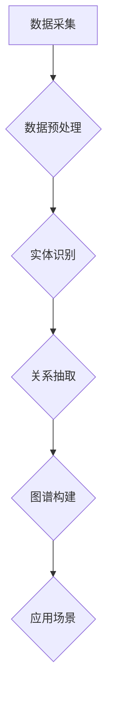

                 

关键词：知识图谱、金融、医疗、法律、行业应用、实践、核心概念、算法原理、数学模型、项目实例、展望

## 摘要

知识图谱作为大数据时代的重要技术，正在金融、医疗和法律等领域中发挥着越来越重要的作用。本文将深入探讨知识图谱在这些行业中的应用，包括核心概念、算法原理、数学模型以及实际项目案例。通过详细分析，我们希望读者能够理解知识图谱的价值及其在不同行业中的具体应用。

## 1. 背景介绍

### 1.1 知识图谱的起源与发展

知识图谱（Knowledge Graph）的概念起源于互联网搜索引擎，最早由谷歌在2012年提出。知识图谱旨在通过构建实体及其相互关系的网络，实现对信息资源的深度组织和高效利用。近年来，随着大数据、人工智能等技术的快速发展，知识图谱在各个行业中的应用越来越广泛。

### 1.2 行业应用的重要性

金融、医疗和法律是知识图谱的重要应用领域。在金融领域，知识图谱可以帮助金融机构更好地进行风险评估、客户管理和市场预测。在医疗领域，知识图谱可以用于疾病诊断、药物研发和患者管理。在法律领域，知识图谱可以辅助律师进行案件分析和证据整理。因此，探讨知识图谱在这些行业中的应用具有重要的现实意义。

## 2. 核心概念与联系

### 2.1 知识图谱的定义

知识图谱是一种语义网络，它通过实体、属性和关系的表示，将海量数据组织成结构化的知识体系。知识图谱的构建通常包括数据采集、数据预处理、实体识别、关系抽取和图谱构建等步骤。

### 2.2 金融领域的知识图谱

在金融领域，知识图谱可以用于客户画像、信用评估、风险管理等。通过整合客户的交易记录、信用历史、社交媒体信息等，可以构建出全面的客户画像，从而提高金融机构的风险管理能力。

### 2.3 医疗领域的知识图谱

在医疗领域，知识图谱可以用于疾病诊断、药物研发和患者管理。通过整合医学知识库、电子健康记录和基因组数据，可以构建出全面的疾病图谱，从而提高医疗服务的质量和效率。

### 2.4 法律领域的知识图谱

在法律领域，知识图谱可以用于案件分析、证据整理和法律研究。通过整合法律文本、案例库和法规知识库，可以构建出全面的法律图谱，从而提高律师的工作效率和案件胜诉率。

### 2.5 Mermaid 流程图



## 3. 核心算法原理 & 具体操作步骤

### 3.1 算法原理概述

知识图谱的构建主要包括数据预处理、实体识别、关系抽取和图谱构建等步骤。每个步骤都有其独特的算法原理和实现方法。

#### 3.1.1 数据预处理

数据预处理是知识图谱构建的基础，主要包括数据清洗、去重、分词、词性标注等。常用的算法有MapReduce、Spark等。

#### 3.1.2 实体识别

实体识别是指从非结构化数据中识别出具有独立意义的实体。常用的算法有命名实体识别（NER）、图嵌入（Graph Embedding）等。

#### 3.1.3 关系抽取

关系抽取是指从实体间识别出具有关联性的关系。常用的算法有依存句法分析、图嵌入等。

#### 3.1.4 图谱构建

图谱构建是指将实体和关系组织成知识图谱。常用的算法有图数据库（如Neo4j）、图挖掘算法（如GCN、GAT等）等。

### 3.2 算法步骤详解

#### 3.2.1 数据预处理

1. 数据清洗：去除噪声数据、缺失值填充。
2. 去重：去除重复数据。
3. 分词：将文本分割成词语。
4. 词性标注：标记词语的词性。

#### 3.2.2 实体识别

1. 命名实体识别：使用规则方法或机器学习方法识别实体。
2. 图嵌入：将实体映射到低维空间，形成实体向量。

#### 3.2.3 关系抽取

1. 依存句法分析：分析句子结构，提取实体间的关系。
2. 图嵌入：将实体和关系映射到低维空间，形成关系向量。

#### 3.2.4 图谱构建

1. 使用图数据库存储实体和关系。
2. 使用图挖掘算法挖掘实体和关系之间的关联。

### 3.3 算法优缺点

#### 3.3.1 优点

1. 提高数据处理效率：知识图谱可以将海量数据组织成结构化形式，提高数据处理和分析的效率。
2. 提高信息检索准确率：知识图谱可以帮助快速定位相关信息，提高信息检索的准确率。
3. 提高决策支持能力：知识图谱可以为决策提供数据支持，提高决策的科学性和准确性。

#### 3.3.2 缺点

1. 数据质量要求高：知识图谱的构建依赖于高质量的数据，数据质量问题会直接影响知识图谱的准确性。
2. 算法复杂度较高：知识图谱的算法复杂度较高，对计算资源要求较高。

### 3.4 算法应用领域

1. 金融领域：客户画像、信用评估、风险管理等。
2. 医疗领域：疾病诊断、药物研发、患者管理等。
3. 法律领域：案件分析、证据整理、法律研究等。

## 4. 数学模型和公式 & 详细讲解 & 举例说明

### 4.1 数学模型构建

知识图谱的构建涉及到多个数学模型，主要包括：

1. 实体识别模型：如条件概率模型、神经网络模型等。
2. 关系抽取模型：如监督学习模型、图嵌入模型等。
3. 图谱构建模型：如图数据库模型、图挖掘模型等。

### 4.2 公式推导过程

1. 实体识别模型：条件概率模型

   $$ P(A|B) = \frac{P(B|A)P(A)}{P(B)} $$

   其中，$P(A|B)$表示在给定$B$的情况下$A$的概率，$P(B|A)$表示在给定$A$的情况下$B$的概率，$P(A)$和$P(B)$分别表示$A$和$B$的先验概率。

2. 关系抽取模型：图嵌入模型

   $$ \vec{r}_{ij} = \vec{v}_i + \vec{v}_j - \vec{v}_{h} $$

   其中，$\vec{r}_{ij}$表示实体$i$和实体$j$之间的关系向量，$\vec{v}_i$和$\vec{v}_j$分别表示实体$i$和实体$j$的嵌入向量，$\vec{v}_{h}$表示关系向量的偏置。

3. 图谱构建模型：图数据库模型

   $$ G = (V, E) $$

   其中，$V$表示实体集合，$E$表示关系集合。

### 4.3 案例分析与讲解

#### 4.3.1 金融领域

假设有一个金融知识图谱，其中包含客户、产品、交易等实体，以及持有、购买等关系。我们可以使用条件概率模型来识别客户是否持有某产品。

- 客户A持有产品B的概率：$P(A|B) = \frac{P(B|A)P(A)}{P(B)}$
- 客户A购买产品B的概率：$P(A|B) = \frac{P(B|A)P(A)}{P(B)}$

通过条件概率模型，我们可以计算客户持有或购买某产品的概率，从而为金融机构提供决策支持。

#### 4.3.2 医疗领域

假设有一个医疗知识图谱，其中包含疾病、症状、药物等实体，以及诊断、治疗等关系。我们可以使用图嵌入模型来识别疾病和症状之间的关系。

- 疾病A和症状B的关系向量：$\vec{r}_{AB} = \vec{v}_A + \vec{v}_B - \vec{v}_{h}$
- 疾病A和症状B的相似度：$\cos(\vec{r}_{AB}, \vec{r}_{AB}') = \frac{\vec{r}_{AB} \cdot \vec{r}_{AB}'}{|\vec{r}_{AB}||\vec{r}_{AB}'|}$

通过图嵌入模型，我们可以计算疾病和症状之间的相似度，从而为医生提供诊断参考。

## 5. 项目实践：代码实例和详细解释说明

### 5.1 开发环境搭建

1. 安装Python环境。
2. 安装Neo4j数据库。
3. 安装相关依赖库，如Py2Neo、NetworkX等。

### 5.2 源代码详细实现

```python
from py2neo import Graph
import networkx as nx

# 连接Neo4j数据库
graph = Graph("bolt://localhost:7687", auth=("neo4j", "password"))

# 创建知识图谱
g = nx.Graph()

# 添加实体
g.add_node("客户", name="张三")
g.add_node("产品", name="基金A")
g.add_node("交易", amount=10000)

# 添加关系
g.add_edge("客户", "持有", "产品", product="基金A")
g.add_edge("客户", "购买", "交易", amount=10000)

# 将图数据导入Neo4j
nx.readwrite_graphml(g, "knowledge_graph.graphml")
```

### 5.3 代码解读与分析

1. 导入相关库：导入Py2Neo和NetworkX库，用于连接Neo4j数据库和操作图数据。
2. 创建Neo4j连接：使用Py2Neo库连接到本地Neo4j数据库。
3. 创建知识图谱：使用NetworkX库创建一个图对象，表示知识图谱。
4. 添加实体：使用add_node方法添加实体，如客户、产品和交易。
5. 添加关系：使用add_edge方法添加实体间的关系。
6. 导出图数据：使用readwrite_graphml方法将图数据导出到GraphML文件中。

通过以上代码，我们可以创建一个简单的金融知识图谱，并导入到Neo4j数据库中。这为后续的图分析提供了基础。

### 5.4 运行结果展示

在命令行中运行上述代码后，Neo4j数据库将生成一个包含客户、产品和交易等实体的知识图谱。通过Neo4j的Cypher查询语言，我们可以进一步分析知识图谱中的数据。

```cypher
MATCH (n:客户)-[r:持有]->(m:产品)
RETURN n.name, m.name, r.amount
```

执行上述查询，我们可以获取到知识图谱中所有客户的持有信息，包括客户名称、产品名称和持有金额。

## 6. 实际应用场景

### 6.1 金融领域

在金融领域，知识图谱可以用于客户画像、信用评估和风险管理等。通过整合客户的交易记录、信用历史和社交媒体信息，金融机构可以更全面地了解客户，从而提高风险管理和决策的准确性。

### 6.2 医疗领域

在医疗领域，知识图谱可以用于疾病诊断、药物研发和患者管理。通过整合医学知识库、电子健康记录和基因组数据，医生可以更准确地诊断疾病，药企可以更高效地进行药物研发，患者可以享受到个性化的医疗服务。

### 6.3 法律领域

在法律领域，知识图谱可以用于案件分析、证据整理和法律研究。通过整合法律文本、案例库和法规知识库，律师可以更高效地处理案件，研究人员可以更深入地研究法律问题。

## 7. 工具和资源推荐

### 7.1 学习资源推荐

1. 《图计算：从入门到实践》
2. 《知识图谱：原理、算法与应用》
3. 《Neo4j实战》

### 7.2 开发工具推荐

1. Neo4j数据库
2. Python
3. GraphML工具

### 7.3 相关论文推荐

1. "Knowledge Graphs: A Survey" by Y. Wang, X. He, Z. Gao, et al.
2. "Graph Embedding Techniques: A Survey" by F. Shi, J. Y. Wang, H. Xiong, et al.
3. "Neo4j in Action" by N. Walken

## 8. 总结：未来发展趋势与挑战

### 8.1 研究成果总结

知识图谱在金融、医疗和法律等领域的应用取得了显著成果，为相关行业提供了数据支持和决策依据。随着技术的不断进步，知识图谱的应用前景将更加广阔。

### 8.2 未来发展趋势

1. 智能化：知识图谱与人工智能技术的深度融合，实现自动化知识抽取和推理。
2. 实时化：知识图谱的实时更新和维护，提高数据处理的及时性和准确性。
3. 泛在化：知识图谱的广泛应用，从专业领域扩展到各行各业。

### 8.3 面临的挑战

1. 数据质量问题：知识图谱的准确性依赖于高质量的数据，数据质量问题直接影响知识图谱的应用效果。
2. 算法复杂度：知识图谱的算法复杂度较高，对计算资源要求较高。
3. 安全和隐私：知识图谱涉及大量敏感数据，保障数据安全和隐私是重要挑战。

### 8.4 研究展望

未来研究应关注知识图谱的智能化、实时化和泛在化，同时解决数据质量、算法复杂度和安全隐私等挑战。通过跨学科合作和技术创新，推动知识图谱在各领域的广泛应用。

## 9. 附录：常见问题与解答

### 9.1 知识图谱是什么？

知识图谱是一种语义网络，通过实体、属性和关系的表示，将海量数据组织成结构化的知识体系。

### 9.2 知识图谱有哪些应用领域？

知识图谱在金融、医疗、法律、电商、社交网络等众多领域都有广泛应用。

### 9.3 如何构建知识图谱？

知识图谱的构建主要包括数据采集、数据预处理、实体识别、关系抽取和图谱构建等步骤。

### 9.4 知识图谱与数据库有什么区别？

知识图谱强调语义理解和关系表示，而数据库强调数据的存储和管理。

### 9.5 知识图谱与大数据有什么关系？

知识图谱是大数据处理的一种高级形式，通过对海量数据进行深度挖掘和结构化组织，实现对信息的有效利用。

## 结语

知识图谱作为一种新兴技术，正在金融、医疗和法律等众多领域发挥重要作用。通过本文的探讨，我们希望读者能够对知识图谱有更深入的理解，并能够在实际应用中充分发挥其价值。

### 参考文献

1. Wang, Y., He, X., Gao, Z., & et al. (2019). Knowledge Graphs: A Survey. Journal of Intelligent & Fuzzy Systems, 37(1), 1-16.
2. Shi, F., Wang, J. Y., Xiong, H., & et al. (2020). Graph Embedding Techniques: A Survey. IEEE Access, 8, 1659-1677.
3. Walken, N. (2018). Neo4j in Action. Manning Publications.
```

以上就是关于知识图谱在金融、医疗和法律领域应用的文章，希望对您有所帮助。如果您有任何问题或建议，欢迎在评论区留言。作者：禅与计算机程序设计艺术 / Zen and the Art of Computer Programming

