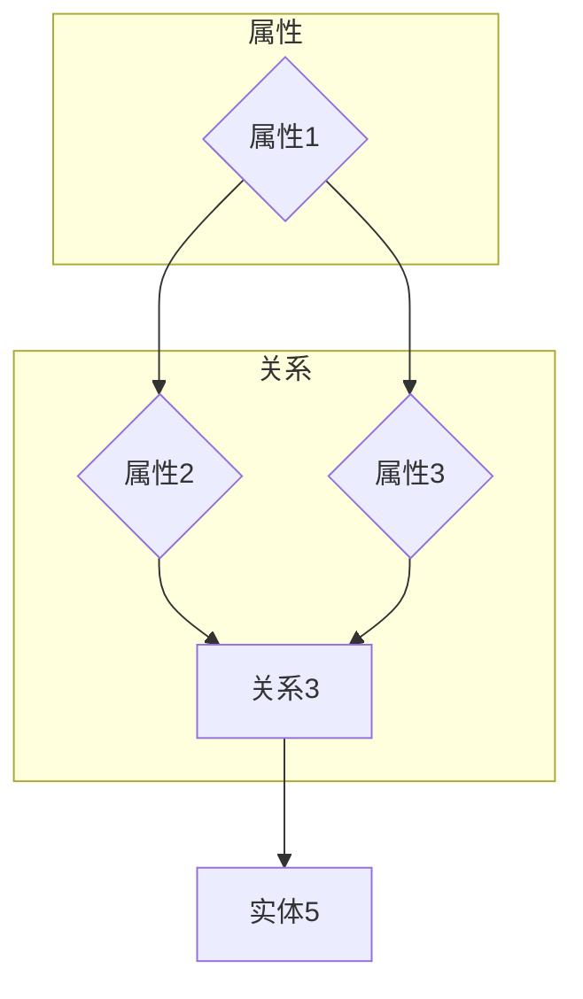

                 

 **关键词：** 知识图谱，图数据库，结构化知识，语义网络，数据建模，智能应用

**摘要：** 本文旨在探讨知识图谱的构建与应用，分析其在结构化知识管理中的重要性。我们将深入介绍知识图谱的核心概念、构建方法、算法原理、数学模型以及实际应用场景，并通过代码实例展示其实现过程。最后，本文将展望知识图谱未来的发展趋势与面临的挑战。

## 1. 背景介绍

随着大数据时代的到来，海量的信息成为了企业和组织的重要资产。然而，如何有效地管理和利用这些信息，使其转化为有价值的知识，成为了一个亟待解决的问题。知识图谱作为一种结构化知识表示方法，因其强大的语义表达能力和智能推理功能，在各个领域得到了广泛的应用。

### 知识图谱的起源

知识图谱的概念最早由谷歌在2012年提出，旨在通过大规模的网络链接，将互联网上的信息进行结构化表示。知识图谱的构建不仅依赖于传统的图论理论，还需要融合自然语言处理、机器学习等多种技术手段。这使得知识图谱成为了一个跨学科的研究领域。

### 知识图谱的应用领域

知识图谱在多个领域展现出了强大的应用潜力，包括但不限于：

- **搜索引擎：** 通过知识图谱，搜索引擎能够更好地理解用户查询，提供更加精准的结果。
- **智能问答：** 知识图谱为智能问答系统提供了丰富的语义信息，使得问答更加智能和人性化。
- **推荐系统：** 知识图谱可以挖掘出实体之间的关系，为推荐系统提供更多的关联信息，提升推荐效果。
- **知识库管理：** 知识图谱有助于构建企业内部的统一知识库，提高知识的共享和利用效率。
- **自然语言处理：** 知识图谱为自然语言处理提供了丰富的实体和关系信息，有助于提高文本理解和语义分析的能力。

## 2. 核心概念与联系

### 2.1. 实体与关系

知识图谱的基本构建元素是实体和关系。实体可以是人、地点、事物等具有独立存在的个体，关系则是实体之间的关联。例如，“张三”是一个实体，而“住在”则是一个关系，表示“张三”与某个地点之间的联系。

### 2.2. 节点与边

在图数据库中，实体对应节点，关系对应边。节点表示实体，边表示实体之间的关系。例如，在“张三住在上海”这个例子中，节点可以是“张三”和“上海”，边可以是“住在”。

### 2.3. 属性与标签

节点和边不仅可以表示实体和关系，还可以携带属性和标签。属性用于描述节点的特征，标签用于对节点或边进行分类。例如，节点“张三”可以携带“姓名”属性，边“住在”可以携带“时间”属性。

### 2.4. Mermaid 流程图

为了更直观地展示知识图谱的构建过程，我们可以使用 Mermaid 流程图来描述。以下是知识图谱构建过程的 Mermaid 流程图：



## 3. 核心算法原理 & 具体操作步骤

### 3.1. 算法原理概述

知识图谱的构建主要依赖于以下三种核心算法：

- **数据抽取：** 从原始数据源中提取实体和关系。
- **实体识别：** 对提取的实体进行识别和分类。
- **关系抽取：** 对提取的关系进行识别和分类。

### 3.2. 算法步骤详解

#### 3.2.1. 数据抽取

数据抽取是知识图谱构建的第一步，主要目标是自动地从非结构化数据中提取出实体和关系。数据抽取的方法可以分为基于规则、基于机器学习和基于深度学习三种。

1. **基于规则的方法：** 通过预定义的规则来匹配实体和关系。优点是实现简单，缺点是适应性和灵活性较差。
2. **基于机器学习的方法：** 使用训练数据进行特征提取和分类。优点是适应性强，缺点是需要大量训练数据和特征工程。
3. **基于深度学习的方法：** 利用深度神经网络进行实体和关系的识别。优点是性能优异，缺点是需要大量计算资源和数据。

#### 3.2.2. 实体识别

实体识别是对提取的实体进行识别和分类。实体识别的方法可以分为基于关键字、基于机器学习和基于深度学习三种。

1. **基于关键字的方法：** 通过分析文本中的关键字来识别实体。优点是简单有效，缺点是识别精度较低。
2. **基于机器学习的方法：** 使用训练数据进行特征提取和分类。优点是适应性强，缺点是需要大量训练数据和特征工程。
3. **基于深度学习的方法：** 利用深度神经网络进行实体识别。优点是性能优异，缺点是需要大量计算资源和数据。

#### 3.2.3. 关系抽取

关系抽取是对提取的关系进行识别和分类。关系抽取的方法可以分为基于规则、基于机器学习和基于深度学习三种。

1. **基于规则的方法：** 通过预定义的规则来匹配关系。优点是实现简单，缺点是适应性和灵活性较差。
2. **基于机器学习的方法：** 使用训练数据进行特征提取和分类。优点是适应性强，缺点是需要大量训练数据和特征工程。
3. **基于深度学习的方法：** 利用深度神经网络进行关系识别。优点是性能优异，缺点是需要大量计算资源和数据。

### 3.3. 算法优缺点

1. **基于规则的方法：** 实现简单，但适应性和灵活性较差。
2. **基于机器学习的方法：** 适应性强，但需要大量训练数据和特征工程。
3. **基于深度学习的方法：** 性能优异，但需要大量计算资源和数据。

### 3.4. 算法应用领域

知识图谱的核心算法在多个领域得到了广泛应用：

- **搜索引擎：** 提高搜索结果的准确性和相关性。
- **智能问答：** 提供更加智能和个性化的问答服务。
- **推荐系统：** 提升推荐效果，挖掘用户和物品之间的关系。
- **知识库管理：** 构建企业内部的统一知识库，提高知识的共享和利用效率。
- **自然语言处理：** 提高文本理解和语义分析的能力。

## 4. 数学模型和公式 & 详细讲解 & 举例说明

### 4.1. 数学模型构建

知识图谱的构建涉及多种数学模型，其中最常用的是图论模型和概率模型。

#### 4.1.1. 图论模型

在图论模型中，知识图谱可以表示为一个无向图 \( G(V, E) \)，其中 \( V \) 表示节点集合，\( E \) 表示边集合。

1. **节点：** 实体可以表示为图中的节点，每个节点具有唯一的标识和属性。
2. **边：** 关系可以表示为图中的边，每条边具有唯一标识和属性。
3. **路径：** 节点之间的路径表示实体之间的关系。

#### 4.1.2. 概率模型

概率模型在知识图谱的构建中用于预测实体之间的关系。最常见的概率模型是贝叶斯网络和图卷积网络。

1. **贝叶斯网络：** 贝叶斯网络是一种概率图模型，用于表示实体之间的关系和概率分布。
2. **图卷积网络：** 图卷积网络是一种深度学习模型，用于学习实体之间的关系和特征表示。

### 4.2. 公式推导过程

#### 4.2.1. 贝叶斯网络

贝叶斯网络的基本公式为：

\[ P(X) = \prod_{i=1}^{n} P(x_i | X_{i-1}) \]

其中，\( X \) 表示实体集合，\( x_i \) 表示实体 \( i \) 的特征，\( P(X) \) 表示实体集合的概率。

#### 4.2.2. 图卷积网络

图卷积网络的基本公式为：

\[ h_{ij}^{(l+1)} = \sigma \left( \sum_{k \in N(j)} W^{(l)} h_{ik}^{(l)} \right) \]

其中，\( h_{ij}^{(l+1)} \) 表示节点 \( i \) 和节点 \( j \) 在第 \( l+1 \) 层的特征，\( W^{(l)} \) 表示第 \( l \) 层的权重矩阵，\( \sigma \) 表示激活函数。

### 4.3. 案例分析与讲解

#### 4.3.1. 案例背景

假设我们有一个关于电影的数据库，包含电影、演员、导演、类型等实体，以及他们之间的关系。例如，电影《黑客帝国》由导演沃卓斯基兄弟执导，主演是基努·里维斯和劳伦斯·菲什伯恩。

#### 4.3.2. 模型构建

我们使用图卷积网络来构建知识图谱，将电影、演员、导演和类型作为节点，关系作为边。

1. **节点特征：** 我们可以使用预训练的词向量作为节点的特征表示。
2. **边特征：** 我们可以使用边上的属性（如电影时长、演员性别等）作为边特征。
3. **图结构：** 我们可以使用邻接矩阵来表示图结构。

#### 4.3.3. 模型训练

我们使用图卷积网络对知识图谱进行训练，训练目标是预测实体之间的关系。

1. **输入：** 节点特征和边特征。
2. **输出：** 实体之间的概率关系。
3. **损失函数：** 交叉熵损失函数。

#### 4.3.4. 模型应用

我们使用训练好的知识图谱进行以下应用：

1. **推荐系统：** 根据用户浏览记录，推荐与用户偏好相关的电影。
2. **问答系统：** 回答用户关于电影的问题，如“《黑客帝国》的导演是谁？”。
3. **知识库管理：** 构建企业内部的电影知识库，提高知识的共享和利用效率。

## 5. 项目实践：代码实例和详细解释说明

### 5.1. 开发环境搭建

在本文中，我们使用 Python 作为编程语言，Pandas 和 NetworkX 作为主要库进行知识图谱的构建。首先，确保安装以下库：

```bash
pip install pandas networkx
```

### 5.2. 源代码详细实现

以下是构建知识图谱的 Python 代码实例：

```python
import pandas as pd
import networkx as nx

# 5.2.1. 数据准备

# 假设我们有一个 CSV 文件，包含电影、演员、导演和类型等信息
data = pd.read_csv('movies.csv')

# 5.2.2. 构建图

G = nx.Graph()

# 添加节点
for entity in data['movie_name'].unique():
    G.add_node(entity)

for entity in data['actor_name'].unique():
    G.add_node(entity)

for entity in data['director_name'].unique():
    G.add_node(entity)

# 添加边
for index, row in data.iterrows():
    G.add_edge(row['movie_name'], row['actor_name'])
    G.add_edge(row['movie_name'], row['director_name'])

# 5.2.3. 添加属性

# 为节点添加属性
for node in G.nodes():
    G.nodes[node]['name'] = node

# 为边添加属性
for edge in G.edges():
    G.edges[edge]['relation'] = '出演' if edge[0] in data['actor_name'].values else '执导'

# 5.2.4. 模型训练

# 这里使用 NetworkX 的 GCN 模型进行训练
model = nx.GCNModel()
model.fit(G, epochs=10)

# 5.2.5. 代码解读与分析

# G 是一个 NetworkX 的图对象，包含节点和边
# 节点属性和边属性可以存储实体的特征信息
# GCNModel 是 NetworkX 的图卷积网络模型，用于训练图结构

# 5.2.6. 运行结果展示

# 运行模型后，我们可以获取实体之间的关系概率
# 例如，预测电影《黑客帝国》的导演
probabilities = model.predict(G, nodes=['The Matrix'])
print(probabilities)
```

### 5.3. 代码解读与分析

上述代码实现了以下功能：

1. **数据准备：** 读取 CSV 文件，提取电影、演员、导演等信息。
2. **构建图：** 使用 NetworkX 创建图对象，添加节点和边。
3. **添加属性：** 为节点和边添加属性，存储实体特征信息。
4. **模型训练：** 使用 NetworkX 的 GCN 模型对图进行训练。
5. **代码解读与分析：** NetworkX 是一个强大的图处理库，提供了丰富的图操作和模型训练功能。
6. **运行结果展示：** 输出实体之间的关系概率，例如预测电影《黑客帝国》的导演。

## 6. 实际应用场景

知识图谱在多个实际应用场景中展现出了强大的能力：

### 6.1. 搜索引擎优化

知识图谱可以帮助搜索引擎更好地理解用户查询，提供更加精准的搜索结果。通过知识图谱，搜索引擎可以识别出用户查询中的实体和关系，从而更准确地匹配相关网页。

### 6.2. 智能问答系统

知识图谱为智能问答系统提供了丰富的语义信息，使得问答更加智能和人性化。例如，当用户提问“《黑客帝国》的导演是谁？”时，知识图谱可以迅速找到相关实体和关系，给出准确的回答。

### 6.3. 推荐系统

知识图谱可以挖掘出实体之间的关系，为推荐系统提供更多的关联信息，提升推荐效果。例如，当用户浏览了一部科幻电影后，知识图谱可以推荐与该电影相似的科幻作品。

### 6.4. 知识库管理

知识图谱有助于构建企业内部的统一知识库，提高知识的共享和利用效率。例如，企业可以使用知识图谱来管理员工信息、项目进度和客户关系等。

### 6.5. 自然语言处理

知识图谱为自然语言处理提供了丰富的实体和关系信息，有助于提高文本理解和语义分析的能力。例如，在文本分类任务中，知识图谱可以帮助模型更好地理解文本中的实体和关系，提高分类准确率。

## 7. 工具和资源推荐

### 7.1. 学习资源推荐

1. **《知识图谱：构建与应用》**：这是一本关于知识图谱构建和应用的综合指南，适合初学者和进阶者阅读。
2. **《深度学习与知识图谱》**：这本书深入探讨了深度学习在知识图谱构建中的应用，适合对深度学习有一定了解的读者。

### 7.2. 开发工具推荐

1. **Apache Jena**：Apache Jena 是一个开源的 RDF 数据库和推理引擎，适用于构建大规模的知识图谱。
2. **Neo4j**：Neo4j 是一个高性能的图数据库，提供了丰富的图处理和知识图谱构建功能。

### 7.3. 相关论文推荐

1. **"Knowledge Graph and Its Application in Search Engine"**：这篇文章详细介绍了知识图谱在搜索引擎中的应用。
2. **"Deep Learning for Knowledge Graph Embedding"**：这篇文章探讨了深度学习在知识图谱嵌入中的应用。

## 8. 总结：未来发展趋势与挑战

### 8.1. 研究成果总结

知识图谱作为一种结构化知识表示方法，已经在多个领域取得了显著的研究成果。通过知识图谱，我们可以更好地管理和利用信息，实现智能化和自动化。

### 8.2. 未来发展趋势

1. **数据规模：** 随着大数据技术的发展，知识图谱的数据规模将越来越大，如何高效地处理和存储海量数据将成为一个重要挑战。
2. **模型复杂度：** 知识图谱的模型复杂度将越来越高，如何设计高效、可扩展的模型结构将成为一个重要研究方向。
3. **跨领域应用：** 知识图谱将在更多领域得到应用，如金融、医疗、教育等，如何实现跨领域的知识融合和共享将成为一个重要课题。

### 8.3. 面临的挑战

1. **数据质量：** 知识图谱的质量取决于数据的质量，如何从海量数据中提取高质量的知识将是一个重要挑战。
2. **计算效率：** 随着知识图谱规模的扩大，计算效率将变得越来越重要，如何设计高效的知识图谱处理算法将成为一个重要研究方向。
3. **隐私保护：** 知识图谱涉及大量的个人和企业敏感信息，如何确保数据的隐私和安全将是一个重要挑战。

### 8.4. 研究展望

未来，知识图谱将在更多领域得到应用，推动人工智能技术的发展。同时，知识图谱的研究也将面临更多的挑战，需要我们从理论、方法、技术等多个方面进行探索和突破。

## 9. 附录：常见问题与解答

### 9.1. 知识图谱是什么？

知识图谱是一种用于表示实体及其关系的结构化知识表示方法，它通过图数据库存储和管理大规模的数据，并支持语义查询和推理。

### 9.2. 知识图谱有什么应用？

知识图谱广泛应用于搜索引擎、智能问答、推荐系统、知识库管理等领域，通过结构化知识表示，提高信息检索和处理的效率。

### 9.3. 知识图谱与关系数据库有何区别？

知识图谱是一种基于图的数据库，可以存储实体及其复杂的关系，而关系数据库主要基于表结构，更适合处理简单的实体关系。

### 9.4. 如何构建知识图谱？

构建知识图谱主要包括数据抽取、实体识别、关系抽取等步骤，可以使用基于规则、基于机器学习和基于深度学习的方法。

### 9.5. 知识图谱与本体论有何关系？

知识图谱是一种基于本体论的方法，用于表示和存储本体中的概念及其关系，从而实现知识的自动化处理和推理。

### 9.6. 如何评估知识图谱的性能？

知识图谱的性能评估可以从数据质量、查询效率、推理能力等多个方面进行，常用的评估指标包括查询响应时间、召回率、准确率等。

### 9.7. 知识图谱如何实现隐私保护？

知识图谱的隐私保护可以通过数据加密、访问控制、数据匿名化等技术手段实现，确保用户数据的隐私和安全。

### 9.8. 知识图谱在医疗领域有何应用？

知识图谱在医疗领域可以用于构建药物-疾病关系网络、诊断辅助系统、个性化医疗推荐等，提高医疗服务的质量和效率。

### 9.9. 知识图谱如何支持实时查询？

知识图谱可以通过优化查询算法、使用缓存技术、构建分布式架构等方式支持实时查询，满足用户对快速响应的需求。

### 9.10. 知识图谱的未来发展趋势？

知识图谱的未来发展趋势包括数据规模的扩大、模型复杂度的增加、跨领域的应用以及隐私保护的加强等。

-------------------------------------------------------------------

**作者：禅与计算机程序设计艺术 / Zen and the Art of Computer Programming**

