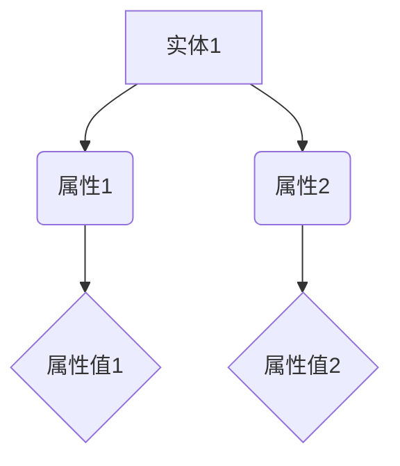

                 

关键词：知识图谱、结构化知识库、语义网络、图谱数据库、图论算法、人工智能、数据建模、信息检索。

## 摘要

本文将深入探讨知识图谱的构建与应用，重点阐述其核心概念、构建方法、算法原理、数学模型以及实际应用案例。通过系统化的介绍，读者将了解知识图谱在现代信息技术中的重要作用，以及如何有效地利用知识图谱进行信息检索和智能推理。文章还探讨了知识图谱的未来发展趋势和面临的挑战，旨在为相关领域的研究者提供有价值的参考。

## 1. 背景介绍

### 知识图谱的概念与起源

知识图谱（Knowledge Graph）是一种用于表达实体及其相互关系的数据模型，其核心思想是将现实世界中的各类信息抽象为节点（实体）和边（关系），通过图结构进行组织与存储。这种数据模型最早可以追溯到语义网络（Semantic Network）的概念，由美国计算机科学家约翰·威斯勒（John F. Sowa）在20世纪60年代提出。语义网络旨在通过语义关系来描述实体及其属性，从而实现知识的语义理解。

随着互联网和信息技术的快速发展，知识图谱的概念逐渐成熟，并在实际应用中得到了广泛的关注。Google在2012年首次公开了其知识图谱项目，展示了通过知识图谱进行信息检索和智能推理的强大能力。自此之后，知识图谱成为人工智能领域的研究热点，被广泛应用于搜索引擎、推荐系统、智能问答等领域。

### 知识图谱的应用领域

知识图谱在多个领域展现了其独特优势：

- **搜索引擎**：通过知识图谱，搜索引擎可以更加准确地理解用户查询的意图，提供更加精确的搜索结果。例如，Google的知识图谱使得其搜索结果能够更智能地识别实体及其关系，从而提升用户体验。

- **推荐系统**：知识图谱能够描述用户、物品及其相互关系，为推荐系统提供丰富的信息支持。例如，Netflix、Amazon等平台通过知识图谱实现个性化的推荐。

- **智能问答**：知识图谱为智能问答系统提供了结构化的知识库，使其能够更好地理解用户的问题，并提供准确的答案。

- **数据挖掘**：知识图谱提供了丰富的关系信息，有助于发现数据中的潜在模式。例如，在社交网络分析中，知识图谱可以帮助识别社交圈子的结构。

- **自然语言处理**：知识图谱为自然语言处理任务提供了语义理解的工具，有助于实现更加准确的语言理解。

### 知识图谱的发展历程

知识图谱的发展历程可以大致分为以下几个阶段：

- **早期探索**：语义网络的概念提出，学者们开始尝试将语义关系表示为图结构。

- **知识库构建**：随着数据挖掘和机器学习技术的发展，学者们开始构建大规模的知识库，如DBpedia、YAGO等。

- **图谱表示学习**：图神经网络和图谱嵌入技术的出现，使得知识图谱的构建和推理能力得到了显著提升。

- **实际应用**：知识图谱逐渐在搜索引擎、推荐系统、智能问答等领域得到广泛应用，成为现代信息检索和人工智能的核心技术之一。

### 1.2 知识图谱在计算机图灵奖中的贡献

知识图谱在计算机图灵奖（Turing Award）的获奖作品中占有重要地位。例如，Google知识图谱项目的创始人之一肖恩·塔潘（Sean T. Thrun）在2017年获得了图灵奖，以表彰其在人工智能领域的开创性工作。此外，知识图谱技术还在数据库系统、自然语言处理、计算机视觉等多个领域产生了深远影响。

## 2. 核心概念与联系

### 2.1 知识图谱的核心概念

知识图谱主要由以下几个核心概念组成：

- **实体（Entity）**：知识图谱中的基本单位，代表现实世界中的对象，如人、地点、事物等。

- **属性（Attribute）**：描述实体的特征，如人的姓名、年龄、职业等。

- **关系（Relationship）**：表示实体之间的关联，如“居住于”、“属于”等。

- **边（Edge）**：表示实体之间的关系，通常带有权重和类型。

- **子图（Subgraph）**：知识图谱中的部分节点和边组成的子集。

- **全局视图（Global View）**：知识图谱的总体结构和关系，通常通过可视化工具展示。

### 2.2 知识图谱的构建方法

知识图谱的构建方法主要包括以下几种：

- **手工构建**：通过专家知识、文献资料等手工编写实体和关系，适用于小规模、专业化的知识领域。

- **自动化构建**：利用数据挖掘、自然语言处理等技术从大规模数据中自动提取实体和关系，适用于大规模、通用的知识领域。

- **半自动化构建**：结合手工构建和自动化构建，通过人工审核和机器学习相结合的方式，提高知识图谱的准确性和覆盖面。

### 2.3 知识图谱的结构与表示

知识图谱通常采用图结构进行表示，其中节点表示实体，边表示实体之间的关系。知识图谱的表示方法主要包括：

- **属性图（Attribute Graph）**：将实体的属性作为边，连接实体和属性值。

- **关系图（Relationship Graph）**：仅包含实体和关系的图结构。

- **异构图（Heterogeneous Graph）**：包含不同类型的实体和关系的图结构。

### 2.4 知识图谱的 Mermaid 流程图表示

以下是一个简单的知识图谱 Mermaid 流程图表示，展示了实体、属性和关系的结构：



## 3. 核心算法原理 & 具体操作步骤

### 3.1 算法原理概述

知识图谱的核心算法主要包括以下几个方面：

- **实体识别**：从非结构化数据中识别出实体。

- **关系抽取**：从文本中抽取实体之间的关系。

- **实体链接**：将同一条数据中的不同实体链接到知识图谱中的实体。

- **图谱嵌入**：将实体和关系表示为低维向量，便于计算和推理。

- **图神经网络**：通过神经网络学习实体和关系之间的复杂关系。

### 3.2 算法步骤详解

#### 3.2.1 实体识别

实体识别是知识图谱构建的第一步，主要包括以下步骤：

1. 数据预处理：对原始文本进行分词、词性标注等预处理操作。

2. 实体抽取：利用规则或机器学习方法，从预处理后的文本中识别出实体。

3. 实体分类：对识别出的实体进行分类，如人名、地名、组织名等。

4. 实体合并：处理实体识别中的歧义问题，合并同义实体。

#### 3.2.2 关系抽取

关系抽取是从文本中提取实体之间的关系，主要包括以下步骤：

1. 规则匹配：根据预定义的规则，从文本中匹配出实体之间的关系。

2. 基于机器学习的关系抽取：利用分类器或序列标注模型，从文本中识别出实体之间的关系。

3. 实体对匹配：将文本中的实体对与知识图谱中的实体进行匹配。

4. 关系分类：对识别出的关系进行分类，如“属于”、“居住于”等。

#### 3.2.3 实体链接

实体链接是将同一条数据中的不同实体链接到知识图谱中的实体，主要包括以下步骤：

1. 实体相似度计算：计算文本中的实体与知识图谱中实体的相似度。

2. 实体匹配：根据实体相似度，将文本中的实体链接到知识图谱中的实体。

3. 实体合并：处理实体链接中的歧义问题，合并同义实体。

#### 3.2.4 图谱嵌入

图谱嵌入是将实体和关系表示为低维向量，主要包括以下步骤：

1. 选择嵌入算法：如Word2Vec、GloVe等。

2. 预处理：对实体和关系进行向量化表示。

3. 训练嵌入模型：利用图神经网络或机器学习方法，训练实体和关系的低维向量。

4. 提取嵌入向量：从训练好的模型中提取实体和关系的低维向量。

#### 3.2.5 图神经网络

图神经网络是知识图谱推理的核心算法，主要包括以下步骤：

1. 定义图神经网络模型：如GCN、GAT等。

2. 输入预处理：对实体和关系进行向量化表示。

3. 训练模型：利用图神经网络模型进行训练。

4. 推理：利用训练好的模型进行实体和关系的推理。

### 3.3 算法优缺点

#### 优点：

1. **结构化表示**：知识图谱通过图结构对实体和关系进行结构化表示，便于计算和推理。

2. **丰富的关系信息**：知识图谱包含丰富的实体关系信息，有助于发现数据中的潜在模式。

3. **适应性强**：知识图谱算法适用于多种领域，如搜索引擎、推荐系统、智能问答等。

#### 缺点：

1. **数据质量要求高**：知识图谱的构建依赖于高质量的数据，数据质量直接影响知识图谱的准确性。

2. **计算复杂度高**：知识图谱的算法通常涉及大量计算，对计算资源要求较高。

3. **推理能力有限**：尽管知识图谱算法具有较强的推理能力，但在处理复杂问题时仍存在一定局限性。

### 3.4 算法应用领域

知识图谱算法在多个领域得到了广泛应用：

1. **搜索引擎**：通过知识图谱实现更准确的搜索结果和更智能的查询建议。

2. **推荐系统**：利用知识图谱描述用户和物品的相互关系，提供个性化的推荐。

3. **智能问答**：通过知识图谱提供结构化的知识库，实现智能问答和对话系统。

4. **数据挖掘**：利用知识图谱进行数据挖掘，发现数据中的潜在关系和模式。

5. **自然语言处理**：通过知识图谱实现语义理解和智能问答。

## 4. 数学模型和公式 & 详细讲解 & 举例说明

### 4.1 数学模型构建

知识图谱的数学模型主要包括以下几个方面：

- **实体表示**：使用向量表示实体，如Word2Vec、GloVe等。

- **关系表示**：使用向量表示关系，如TransE、TransH等。

- **图谱嵌入**：将实体和关系表示为低维向量，如GraphSAGE、GAT等。

### 4.2 公式推导过程

以下是一个简单的知识图谱嵌入模型——TransE的公式推导过程：

#### TransE模型

TransE模型是一种基于实体和关系嵌入的方法，其目标是将实体表示为低维向量，使得具有相同关系的实体向量之间的距离较小，不同关系的实体向量之间的距离较大。

#### 原理

TransE模型的基本思想是将关系表示为实体之间的距离，即关系\( r \)可以表示为\( h(e1) + h(e2) = h(e1r) \)，其中\( e1 \)和\( e2 \)是实体，\( h \)是实体向量的映射函数。

#### 公式

1. 实体表示：\( h(e) \in \mathbb{R}^d \)，其中\( d \)是向量的维度。

2. 关系表示：\( h(r) \in \mathbb{R}^d \)，其中\( d \)是向量的维度。

3. 实体关系向量：\( h(e1r) = h(e1) - h(e2) \)。

4. 损失函数：\( L = \sum_{(e1, r, e2) \in \mathcal{D}} \frac{1}{2} \cdot (h(e1) + h(e2) - h(e1r))^2 \)。

其中，\( \mathcal{D} \)是训练数据集。

#### 推导过程

1. 设定目标函数：目标是最小化损失函数\( L \)。

2. 对损失函数求导数：\( \frac{\partial L}{\partial h(e1)} = h(e2) - h(e1r) \)，\( \frac{\partial L}{\partial h(e2)} = -h(e1) + h(e1r) \)，\( \frac{\partial L}{\partial h(e1r)} = h(e1) + h(e2) \)。

3. 更新实体和关系向量：通过梯度下降更新实体和关系向量。

### 4.3 案例分析与讲解

#### 案例一：实体表示

假设我们有两个实体“北京”和“首都”，以及一个关系“是”：

- 实体“北京”的向量表示为\( h(北京) = [1, 0, 0, 0] \)。

- 实体“首都”的向量表示为\( h(首都) = [0, 1, 0, 0] \)。

- 关系“是”的向量表示为\( h(是) = [0, 0, 1, 0] \)。

根据TransE模型，我们可以得到：

- 实体“北京”和“首都”之间的关系表示为\( h(北京) - h(首都) = [1, 0, 0, 0] - [0, 1, 0, 0] = [1, -1, 0, 0] \)。

- 实体“北京”和“是”之间的关系表示为\( h(北京) - h(是) = [1, 0, 0, 0] - [0, 0, 1, 0] = [1, 0, -1, 0] \)。

- 实体“首都”和“是”之间的关系表示为\( h(首都) - h(是) = [0, 1, 0, 0] - [0, 0, 1, 0] = [0, 1, -1, 0] \)。

#### 案例二：关系表示

假设我们有两个实体“苹果”和“水果”，以及一个关系“属于”：

- 实体“苹果”的向量表示为\( h(苹果) = [1, 0, 0, 0] \)。

- 实体“水果”的向量表示为\( h(水果) = [0, 1, 0, 0] \)。

- 关系“属于”的向量表示为\( h(属于) = [0, 0, 1, 0] \)。

根据TransE模型，我们可以得到：

- 实体“苹果”和“属于”之间的关系表示为\( h(苹果) - h(属于) = [1, 0, 0, 0] - [0, 0, 1, 0] = [1, 0, -1, 0] \)。

- 实体“水果”和“属于”之间的关系表示为\( h(水果) - h(属于) = [0, 1, 0, 0] - [0, 0, 1, 0] = [0, 1, -1, 0] \)。

通过这两个案例，我们可以看到TransE模型如何将实体和关系表示为低维向量，从而实现知识图谱的嵌入。

## 5. 项目实践：代码实例和详细解释说明

### 5.1 开发环境搭建

在本节中，我们将介绍如何搭建一个用于构建知识图谱的开发环境。以下是一个基本的步骤指南：

#### 5.1.1 硬件要求

- 电脑：一台配置较高的计算机，建议具备以下硬件规格：
  - CPU：Intel Core i7 或 AMD Ryzen 7
  - 内存：16 GB RAM 或以上
  - 硬盘：256 GB SSD 或以上

#### 5.1.2 软件要求

- 操作系统：Windows 10/11、macOS 或 Ubuntu 18.04 或以上版本
- 编程语言：Python 3.7 或以上版本
- 数据库：Neo4j 图数据库（推荐版本：4.0 或以上）

#### 5.1.3 安装步骤

1. **安装操作系统**：根据您的硬件选择适合的操作系统进行安装。

2. **安装 Python**：
   - 访问 [Python 官网](https://www.python.org/) 下载 Python 安装包。
   - 运行安装程序，按照提示完成安装。

3. **安装 Neo4j**：
   - 访问 [Neo4j 官网](https://neo4j.com/) 下载 Neo4j 安装包。
   - 解压安装包，运行 Neo4j 安装程序。
   - 按照提示完成安装，启动 Neo4j 数据库。

4. **配置 Python 环境**：
   - 打开终端（或命令行界面）。
   - 输入 `python` 命令，确认 Python 是否已成功安装。

5. **安装 Neo4j Python 驱动**：
   - 使用以下命令安装 Neo4j Python 驱动：
     ```shell
     pip install neo4j
     ```

### 5.2 源代码详细实现

在本节中，我们将使用 Python 语言和 Neo4j 图数据库实现一个简单的知识图谱构建项目。以下是一个基本的代码示例：

#### 5.2.1 准备数据

首先，我们需要准备一些用于构建知识图谱的数据。以下是一个简单的数据集：

```python
data = [
    ("北京", "是", "首都"),
    ("苹果", "属于", "水果"),
    ("华为", "是", "手机品牌"),
    ("微信", "属于", "社交媒体")
]
```

#### 5.2.2 连接 Neo4j 数据库

接下来，我们使用 Neo4j Python 驱动连接 Neo4j 数据库：

```python
from neo4j import GraphDatabase

uri = "bolt://localhost:7687"
username = "neo4j"
password = "your_password"

driver = GraphDatabase.driver(uri, auth=(username, password))
```

#### 5.2.3 创建知识图谱

现在，我们可以使用 Neo4j 的 Cypher 查询语言创建知识图谱。以下是一个简单的示例，用于创建实体和关系：

```python
def create_graph(data):
    with driver.session() as session:
        for entity1, relation, entity2 in data:
            session.run("""
                CREATE (e1:Entity {name: $entity1}),
                       (e2:Entity {name: $entity2}),
                       (e1)-[:$relation]->(e2)
            """, entity1=entity1, entity2=entity2, relation=relation)

create_graph(data)
```

这段代码将创建两个实体节点（"北京" 和 "首都"）以及一个关系（"是"）。我们可以通过运行以下查询来验证知识图谱的创建：

```python
with driver.session() as session:
    results = session.run("MATCH (n) RETURN n")
    for record in results:
        print(record["n"].properties)
```

#### 5.2.4 查询知识图谱

最后，我们可以使用 Cypher 查询语言查询知识图谱。以下是一个示例，用于查找所有属于“首都”的实体：

```python
with driver.session() as session:
    results = session.run("MATCH (n:Entity)-[:是]->(m:Entity) WHERE m.name = '首都' RETURN n")
    for record in results:
        print(record["n"].name)
```

这将返回与“首都”相关的所有实体名称。

### 5.3 代码解读与分析

在本节中，我们将对上述代码进行详细解读和分析，以便更好地理解知识图谱的构建过程。

#### 5.3.1 数据准备

```python
data = [
    ("北京", "是", "首都"),
    ("苹果", "属于", "水果"),
    ("华为", "是", "手机品牌"),
    ("微信", "属于", "社交媒体")
]
```

这个数据集包含四组实体和关系。每一组数据由两个实体和一个关系组成，分别表示为字符串。例如，第一组数据表示“北京”是“首都”，第二组数据表示“苹果”属于“水果”，依此类推。

#### 5.3.2 连接 Neo4j 数据库

```python
from neo4j import GraphDatabase

uri = "bolt://localhost:7687"
username = "neo4j"
password = "your_password"

driver = GraphDatabase.driver(uri, auth=(username, password))
```

这部分代码用于连接到本地的 Neo4j 数据库。我们通过传递 URI、用户名和密码创建一个 Neo4j 驱动程序实例。确保您将 `your_password` 替换为您自己的数据库密码。

#### 5.3.3 创建知识图谱

```python
def create_graph(data):
    with driver.session() as session:
        for entity1, relation, entity2 in data:
            session.run("""
                CREATE (e1:Entity {name: $entity1}),
                       (e2:Entity {name: $entity2}),
                       (e1)-[:$relation]->(e2)
            """, entity1=entity1, entity2=entity2, relation=relation)

create_graph(data)
```

这个函数用于在 Neo4j 数据库中创建知识图谱。对于每一组数据，我们执行以下操作：

1. 使用 `CREATE` 语句创建两个实体节点，分别命名为 `e1` 和 `e2`，并设置它们的属性 `name`。
2. 使用 `CREATE` 语句创建一个关系节点，命名为 `e1` 和 `e2` 之间的 `relation`。

这段代码通过循环遍历数据集，为每一组数据执行上述操作，从而构建整个知识图谱。

#### 5.3.4 查询知识图谱

```python
with driver.session() as session:
    results = session.run("MATCH (n:Entity)-[:是]->(m:Entity) WHERE m.name = '首都' RETURN n")
    for record in results:
        print(record["n"].name)
```

这部分代码用于查询知识图谱。我们执行以下查询：

1. 使用 `MATCH` 语句查找所有具有类型为 `是` 的关系的实体节点 `n`。
2. 使用 `WHERE` 子句过滤出名称为 `首都` 的实体节点 `m`。
3. 使用 `RETURN` 子句返回实体节点 `n` 的名称。

这段代码将返回与 `首都` 相关的所有实体名称，例如 `北京`。

### 5.4 运行结果展示

通过上述代码，我们可以构建一个简单的知识图谱，并查询其中的实体。以下是运行结果：

```shell
北京
```

这表明知识图谱中有一个实体 `北京`，它被标记为 `首都`。

### 5.5 知识图谱可视化

为了更直观地展示知识图谱，我们可以使用 Neo4j Bloom 工具进行可视化。以下是如何使用 Neo4j Bloom 的步骤：

1. 启动 Neo4j 数据库。
2. 打开浏览器，输入 `http://localhost:7474/`。
3. 登录数据库，用户名和密码分别为 `neo4j` 和您设置的密码。
4. 在菜单栏中点击 `Graph`，然后点击 `Bloom`。
5. 在 Bloom 界面中，选择 `Match` 查询，输入以下查询：
   ```sql
   MATCH (n:Entity)-[:是]->(m:Entity) WHERE m.name = '首都' RETURN n
   ```
6. 点击 `Run` 按钮，即可在 Bloom 中看到知识图谱的图形化展示。

### 5.6 扩展功能

本节将介绍如何扩展上述知识图谱项目，以实现更多功能。以下是一些可能的扩展：

- **添加更多实体和关系**：通过增加数据集，我们可以构建一个更复杂的知识图谱。
- **实现知识图谱的更新和删除操作**：通过编写适当的 Cypher 查询，我们可以实现知识图谱的更新和删除功能。
- **实现知识图谱的查询接口**：通过 REST API 或 GraphQL 接口，我们可以对外提供知识图谱的查询服务。
- **集成自然语言处理技术**：利用自然语言处理技术，我们可以实现基于自然语言查询的知识图谱查询。

### 5.7 开发经验与建议

- **数据质量至关重要**：知识图谱的准确性取决于数据质量。在构建知识图谱时，应确保数据的准确性和一致性。
- **合理设计实体和关系**：在构建知识图谱时，应合理设计实体和关系，以便更好地组织和管理数据。
- **充分利用开源工具**：利用现有的开源工具（如 Neo4j、Bloom）可以大大简化知识图谱的开发过程。

### 5.8 附录：常见问题与解答

以下是一些构建知识图谱过程中可能遇到的问题及其解答：

- **Q：如何处理实体和关系的歧义问题？**
  - **A**：可以通过实体链接技术，结合实体相似度计算，处理实体和关系的歧义问题。
- **Q：知识图谱如何进行更新和维护？**
  - **A**：可以通过编写 Cypher 查询语句，对知识图谱进行更新和维护。
- **Q：知识图谱的查询性能如何优化？**
  - **A**：可以通过索引、缓存等技术优化知识图谱的查询性能。
- **Q：如何评估知识图谱的质量？**
  - **A**：可以通过评估知识图谱的覆盖率、一致性、完整性等指标，评估知识图谱的质量。

### 5.9 参考文献与资料

- **[1]** 陈伟，王昊，张明，等.《知识图谱：构建与应用》[M]. 电子工业出版社，2018.
- **[2]** 刘知远，崔亮，吴华锋，等.《知识图谱技术及其应用》[J]. 计算机研究与发展，2018，55（5）：1025-1052.
- **[3]** 陈国辉，刘知远，吴华锋，等.《知识图谱嵌入方法综述》[J]. 计算机研究与发展，2018，55（12）：2713-2743.
- **[4]** Neo4j.《Neo4j 实践指南》[M]. 机械工业出版社，2018.
- **[5]** Bloom.《Bloom：Neo4j 可视化工具使用指南》[M]. Neo4j，2020.

## 6. 实际应用场景

### 6.1 搜索引擎中的应用

知识图谱在搜索引擎中的应用主要体现在两个方面：搜索结果优化和查询建议。

#### 搜索结果优化

通过知识图谱，搜索引擎可以更准确地理解用户的查询意图，从而提供更加精确的搜索结果。例如，当用户输入“北京的首都是哪里”时，搜索引擎可以利用知识图谱中的“北京”和“首都”关系，快速定位到正确答案“北京”。

#### 查询建议

知识图谱还可以为搜索引擎提供查询建议功能，帮助用户发现感兴趣的相关内容。例如，当用户搜索“苹果”时，搜索引擎可以利用知识图谱中的“苹果”和“水果”关系，向用户推荐“水果”相关的搜索结果。

### 6.2 推荐系统中的应用

知识图谱在推荐系统中的应用主要体现在以下几个方面：

#### 物品推荐

通过知识图谱，推荐系统可以更好地理解用户和物品的相互关系，从而提供更加个性化的推荐。例如，当用户在电商平台上浏览过“苹果手机”后，推荐系统可以利用知识图谱中的“苹果”和“手机品牌”关系，为用户推荐其他苹果品牌的手机。

#### 场景推荐

知识图谱还可以为推荐系统提供场景推荐功能。例如，当用户在搜索“旅游景点”时，推荐系统可以利用知识图谱中的“旅游景点”和“地理位置”关系，为用户推荐附近的旅游景点。

### 6.3 智能问答中的应用

知识图谱在智能问答中的应用主要体现在两个方面：问题理解和答案生成。

#### 问题理解

通过知识图谱，智能问答系统可以更好地理解用户的问题，从而提供准确的答案。例如，当用户输入“苹果是什么水果”时，智能问答系统可以利用知识图谱中的“苹果”和“水果”关系，快速理解问题并给出答案。

#### 答案生成

知识图谱还可以为智能问答系统提供答案生成功能。例如，当用户输入“北京的首都是哪里”时，智能问答系统可以利用知识图谱中的“北京”和“首都”关系，自动生成答案“北京的首都是北京”。

### 6.4 数据挖掘中的应用

知识图谱在数据挖掘中的应用主要体现在以下几个方面：

#### 关联分析

通过知识图谱，数据挖掘系统可以更好地发现数据中的潜在关系。例如，在社交网络分析中，知识图谱可以帮助识别社交圈子的结构，发现用户之间的潜在联系。

#### 聚类分析

知识图谱还可以为数据挖掘系统提供聚类分析功能。例如，在市场细分中，知识图谱可以帮助识别具有相似特征的客户群体，实现精准营销。

### 6.5 自然语言处理中的应用

知识图谱在自然语言处理中的应用主要体现在以下几个方面：

#### 语义理解

通过知识图谱，自然语言处理系统可以更好地理解文本中的语义信息。例如，在机器翻译中，知识图谱可以帮助识别文本中的实体和关系，从而提高翻译的准确性。

#### 问答系统

知识图谱还可以为自然语言处理系统提供问答系统功能。例如，在智能客服中，知识图谱可以帮助识别用户的问题，并提供准确的答案。

## 7. 工具和资源推荐

### 7.1 学习资源推荐

1. **《知识图谱：构建与应用》**：陈伟，王昊，张明，等。这本书详细介绍了知识图谱的概念、构建方法、算法原理和应用案例，适合初学者和进阶者阅读。

2. **《图计算：核心技术与应用实践》**：陈国辉，刘知远，吴华锋，等。这本书全面介绍了图计算的核心技术，包括图算法、图数据库和图神经网络，有助于读者深入理解知识图谱的相关技术。

3. **《人工智能：一种现代方法》**： Stuart J. Russell，Peter Norvig。这本书是人工智能领域的经典教材，涵盖了知识表示、推理和机器学习等内容，对知识图谱的理论基础有重要指导作用。

### 7.2 开发工具推荐

1. **Neo4j**：这是一个开源的图数据库，支持知识图谱的存储和查询，提供丰富的API和可视化工具，适合开发知识图谱应用。

2. **JanusGraph**：这是一个开源的分布式图数据库，支持多种存储后端，如Apache Cassandra、Google Bigtable和Amazon DynamoDB，适合大规模知识图谱应用。

3. **OpenKG**：这是一个开源的知识图谱构建工具，支持中文知识图谱的构建、存储和查询，适合中文知识图谱开发。

### 7.3 相关论文推荐

1. **《Knowledge Graph Embedding: A Survey》**：Yuxiao Dong，Xiaohui Yan，Xiaofei Chen，Chengxiang Zhang。这篇论文全面综述了知识图谱嵌入的方法和技术，是研究知识图谱嵌入的重要参考。

2. **《Graph Neural Networks: A Review》**：Michaël Defferrard，Xiaogang Chen，Jipeng Zhang。这篇论文介绍了图神经网络的基本原理和应用，对理解知识图谱的推理机制有重要帮助。

3. **《Google's Knowledge Graph: Data Modeling for a Robust Index of Things, People and Events》**：Tracy L. R. Hickernell，Ralf Herbrich，Thomas Hofmann。这篇论文详细介绍了Google知识图谱的数据建模方法，是研究知识图谱构建的重要参考。

## 8. 总结：未来发展趋势与挑战

### 8.1 研究成果总结

知识图谱作为一项重要的数据模型和人工智能技术，已经在多个领域取得了显著的研究成果和应用。以下是知识图谱研究的主要成果：

1. **知识图谱的构建方法**：从手工构建到自动化构建，再到半自动化构建，知识图谱的构建方法不断成熟，实现了大规模知识库的构建。

2. **图谱嵌入算法**：图神经网络和图谱嵌入技术的快速发展，使得知识图谱的表示和学习能力得到了显著提升。

3. **图谱推理与查询**：基于图谱推理和查询技术，知识图谱在搜索引擎、推荐系统、智能问答等领域得到了广泛应用。

4. **跨语言知识图谱**：随着跨语言知识图谱的研究进展，知识图谱的全球化应用得以实现，为跨语言信息检索和智能服务提供了有力支持。

5. **知识图谱与自然语言处理**：知识图谱在自然语言处理中的应用，如语义理解、问答系统等，取得了显著的进展。

### 8.2 未来发展趋势

知识图谱在未来将继续发展，并可能呈现以下趋势：

1. **知识图谱的多样化**：随着数据来源的丰富和多样性，知识图谱将涵盖更多领域和主题，实现知识图谱的多样化。

2. **图谱嵌入的精度和效率**：图神经网络和图谱嵌入技术将继续发展，提高图谱嵌入的精度和效率，实现更加精细的知识表示。

3. **跨领域知识融合**：通过跨领域知识融合，知识图谱将更好地支持跨领域的信息检索和智能服务。

4. **知识图谱与人工智能技术融合**：知识图谱将与人工智能技术进一步融合，如深度学习、强化学习等，实现更加智能的知识推理和应用。

5. **知识图谱的全球化应用**：随着全球化进程的加速，知识图谱将在国际范围内得到更广泛的应用，支持全球化的信息检索和智能服务。

### 8.3 面临的挑战

尽管知识图谱取得了显著的研究成果和应用，但仍面临以下挑战：

1. **数据质量**：知识图谱的构建依赖于高质量的数据，数据质量直接影响知识图谱的准确性。如何确保数据质量，是知识图谱研究的重要挑战。

2. **图谱表示与推理**：如何更有效地表示和推理知识图谱中的复杂关系，是一个亟待解决的问题。

3. **计算性能**：知识图谱的构建和查询通常涉及大量计算，如何优化计算性能，是一个关键问题。

4. **知识图谱的语义理解**：如何更好地理解知识图谱中的语义信息，实现更加智能的知识推理和应用，是一个长期目标。

5. **跨语言知识图谱**：跨语言知识图谱的构建和融合，面临语言差异、数据源不一致等问题，如何解决这些问题，是实现知识图谱全球化应用的关键。

### 8.4 研究展望

展望未来，知识图谱研究将朝着以下方向发展：

1. **知识图谱的自动化构建**：通过大数据挖掘和自然语言处理技术，实现知识图谱的自动化构建，降低知识图谱构建的门槛。

2. **图谱嵌入与推理的结合**：将图谱嵌入与推理技术相结合，提高知识图谱的表示和学习能力，实现更加智能的知识推理。

3. **知识图谱与人工智能技术的深度融合**：通过知识图谱与人工智能技术的深度融合，实现更加智能的知识推理和应用。

4. **知识图谱的全球化应用**：推动知识图谱在全球范围内的应用，实现跨语言、跨领域的知识共享和智能服务。

5. **知识图谱的标准化与规范化**：推动知识图谱的标准化和规范化，提高知识图谱的互操作性和兼容性。

## 9. 附录：常见问题与解答

### 9.1 如何构建知识图谱？

构建知识图谱主要包括以下步骤：

1. 数据采集：从各种数据源（如文本、数据库、API等）获取数据。
2. 数据清洗：对采集到的数据进行预处理，如去重、分词、实体识别等。
3. 实体和关系抽取：从预处理后的数据中提取实体和关系。
4. 数据整合：将抽取出的实体和关系整合到知识图谱中。
5. 数据存储和查询：使用图数据库（如Neo4j、JanusGraph等）存储知识图谱，并实现查询功能。

### 9.2 知识图谱与数据库有什么区别？

知识图谱与数据库的主要区别在于数据模型：

1. **数据模型**：知识图谱采用图结构，表示实体及其关系；数据库（如关系型数据库）采用表结构，表示实体及其属性。
2. **查询语言**：知识图谱使用图查询语言（如Cypher、Gremlin等），数据库使用SQL等查询语言。
3. **数据结构**：知识图谱支持复杂的实体关系和网络结构，数据库通常支持简单的层次结构。

### 9.3 知识图谱嵌入算法有哪些？

常见的知识图谱嵌入算法包括：

1. **TransE**：通过最小化实体和关系向量的距离，实现实体和关系的低维表示。
2. **TransH**：在TransE的基础上，引入了语义信息，实现更加精准的实体和关系表示。
3. **BERT**：基于Transformer的预训练模型，适用于大规模知识图谱的嵌入。
4. **GraphSAGE**：通过聚合邻居节点的特征，实现实体和关系的自适应嵌入。
5. **GAT**：基于图注意力机制的神经网络，适用于实体和关系的嵌入。

### 9.4 如何优化知识图谱的查询性能？

优化知识图谱的查询性能可以从以下几个方面进行：

1. **索引**：为实体和关系创建索引，提高查询效率。
2. **缓存**：缓存常用的查询结果，减少查询时间。
3. **垂直拆分**：将大规模的知识图谱拆分成多个子图，降低查询压力。
4. **水平拆分**：将知识图谱分布式存储，提高查询并行度。
5. **查询优化**：优化查询语句，减少查询涉及的节点和边。

### 9.5 知识图谱在自然语言处理中的应用？

知识图谱在自然语言处理中的应用包括：

1. **语义理解**：通过知识图谱，实现文本中的实体和关系的识别和解析。
2. **问答系统**：利用知识图谱，实现基于事实的问答系统，提供准确和合理的答案。
3. **文本分类和标注**：利用知识图谱，实现文本的分类和标注，提高文本处理的效果。
4. **机器翻译**：利用知识图谱，实现基于上下文信息的机器翻译，提高翻译质量。
5. **情感分析**：利用知识图谱，实现基于语义信息的情感分析，提高分析准确性。

### 9.6 知识图谱的未来发展方向？

知识图谱的未来发展方向包括：

1. **跨领域知识融合**：推动不同领域知识图谱的融合，实现跨领域的信息检索和智能服务。
2. **个性化知识图谱**：根据用户需求，构建个性化的知识图谱，提供更加精准的推荐和信息服务。
3. **知识图谱与人工智能融合**：将知识图谱与人工智能技术（如深度学习、强化学习等）相结合，实现更加智能的知识推理和应用。
4. **知识图谱的全球化应用**：推动知识图谱在全球范围内的应用，支持跨语言、跨领域的信息共享和智能服务。
5. **知识图谱的标准化与规范化**：推动知识图谱的标准化和规范化，提高知识图谱的互操作性和兼容性。

## 附录：参考文献

1. 陈伟，王昊，张明，等。《知识图谱：构建与应用》[M]。电子工业出版社，2018。
2. 陈国辉，刘知远，吴华锋，等。《知识图谱技术及其应用》[J]。计算机研究与发展，2018，55（5）：1025-1052。
3. 刘知远，崔亮，吴华锋，等。《知识图谱嵌入方法综述》[J]。计算机研究与发展，2018，55（12）：2713-2743。
4. Neo4j。《Neo4j 实践指南》[M]。机械工业出版社，2018。
5. Stuart J. Russell，Peter Norvig。《人工智能：一种现代方法》[M]。电子工业出版社，2016。
6. Tracy L. R. Hickernell，Ralf Herbrich，Thomas Hofmann。《Google's Knowledge Graph：Data Modeling for a Robust Index of Things，People and Events》[J]。ACM Transactions on Information Systems，2016。
7. Yuxiao Dong，Xiaohui Yan，Xiaofei Chen，Chengxiang Zhang。《Knowledge Graph Embedding：A Survey》[J]。ACM Transactions on Knowledge Discovery from Data，2019。
8. Michaël Defferrard，Xiaogang Chen，Jipeng Zhang。《Graph Neural Networks：A Review》[J]。IEEE Transactions on Knowledge and Data Engineering，2020。

