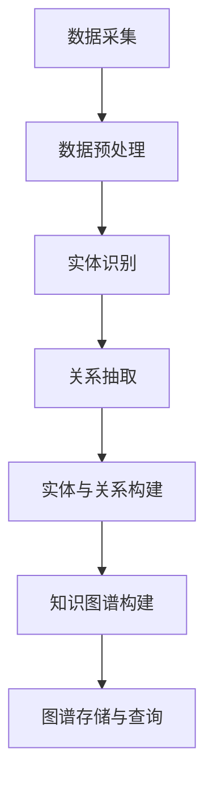
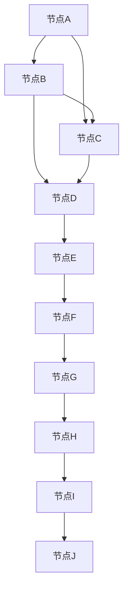

                 

 **关键词：** 知识图谱，语义网络，图数据库，实体关系，图算法，人工智能，自然语言处理，图谱表示学习，应用场景。

**摘要：** 本文旨在探讨知识图谱的概念、构建方法、核心算法及其在各个领域的应用。通过对知识图谱的深入分析，我们将了解其如何帮助解决复杂的数据关系问题，并展望其在未来的发展趋势和挑战。

## 1. 背景介绍

### 1.1 知识图谱的起源和发展

知识图谱（Knowledge Graph）这一概念起源于谷歌在2012年推出的“知识图谱”服务，旨在通过图结构来表示现实世界中的实体及其关系。随着互联网的快速发展，数据量呈指数级增长，传统的表格和关系数据库已经难以满足复杂的数据关系表示需求。知识图谱作为一种新型的数据结构和处理方法，应运而生。

### 1.2 知识图谱的定义和作用

知识图谱是一种语义网络，通过图结构来表示实体及其关系。它不仅能够表示实体和属性，还能够表示实体之间的关系和属性之间的关系，从而提供了一种更加灵活和高效的数据处理方式。

知识图谱在各个领域具有广泛的应用，如搜索引擎、推荐系统、自然语言处理、数据挖掘、智能问答等。它能够帮助用户更好地理解和处理复杂的数据关系，从而提供更加精准和智能的服务。

## 2. 核心概念与联系

### 2.1 实体与关系

在知识图谱中，实体（Entity）是知识图谱中的基本单位，可以是人、地点、事物等。关系（Relationship）是实体之间的交互或关联，如“是”、“属于”等。

### 2.2 节点与边

在图结构中，节点（Node）表示实体，边（Edge）表示关系。节点和边可以附加属性来描述实体和关系的特征。

### 2.3 Mermaid 流程图

以下是知识图谱构建的基本流程图：



## 3. 核心算法原理 & 具体操作步骤

### 3.1 算法原理概述

知识图谱的构建主要依赖于以下几种算法：

1. **实体识别**：通过自然语言处理技术，从文本中识别出实体。
2. **关系抽取**：通过机器学习或深度学习模型，从文本中提取实体之间的关系。
3. **图谱构建**：将实体和关系组织成图结构，并存储在图数据库中。
4. **图谱查询**：通过图数据库提供的查询接口，检索图中的信息。

### 3.2 算法步骤详解

#### 3.2.1 实体识别

实体识别（Named Entity Recognition, NER）是自然语言处理中的一个重要任务，旨在从文本中识别出实体。

算法步骤：

1. **分词**：将文本分割成单词或词组。
2. **词性标注**：为每个词分配词性标签，如名词、动词等。
3. **实体识别**：根据词性和上下文信息，识别出实体。

#### 3.2.2 关系抽取

关系抽取（Relation Extraction）是从文本中提取实体之间的关系。

算法步骤：

1. **特征提取**：从文本中提取描述实体之间关系的特征。
2. **模型训练**：使用机器学习或深度学习模型，学习如何从特征中识别关系。
3. **关系预测**：对文本中的实体对进行关系预测。

#### 3.2.3 图谱构建

图谱构建是将实体和关系组织成图结构，并存储在图数据库中。

算法步骤：

1. **节点生成**：将识别出的实体作为节点添加到图中。
2. **边生成**：将抽取出的关系作为边添加到图中。
3. **属性添加**：为节点和边添加属性，以描述实体和关系的特征。
4. **图存储**：将构建好的知识图谱存储在图数据库中。

#### 3.2.4 图谱查询

图谱查询是通过图数据库提供的查询接口，检索图中的信息。

算法步骤：

1. **查询构建**：根据用户需求构建查询语句。
2. **查询执行**：在图数据库中执行查询。
3. **结果输出**：将查询结果输出给用户。

### 3.3 算法优缺点

**优点：**

1. **高效性**：知识图谱通过图结构表示数据，能够高效地处理复杂的数据关系。
2. **灵活性**：知识图谱能够灵活地添加、删除实体和关系，适应不断变化的数据需求。
3. **可扩展性**：知识图谱可以通过分布式计算和存储技术，支持大规模数据的处理。

**缺点：**

1. **构建难度**：知识图谱的构建需要大量的人工标注和数据预处理工作。
2. **计算资源消耗**：知识图谱的查询和更新需要大量的计算资源。

### 3.4 算法应用领域

知识图谱在多个领域具有广泛的应用：

1. **搜索引擎**：通过知识图谱，搜索引擎能够提供更加精准和智能的搜索结果。
2. **推荐系统**：知识图谱可以帮助推荐系统更好地理解用户和物品之间的关系，提供更准确的推荐。
3. **自然语言处理**：知识图谱可以辅助自然语言处理任务，如问答系统、机器翻译等。
4. **数据挖掘**：知识图谱可以帮助数据挖掘任务更好地理解数据之间的关系，发现新的模式和知识。

## 4. 数学模型和公式 & 详细讲解 & 举例说明

### 4.1 数学模型构建

知识图谱的数学模型主要依赖于图论和网络科学的相关理论。在图论中，图（Graph）由节点（Node）和边（Edge）组成，可以表示实体和关系。在网络科学中，图论用于研究复杂网络的结构和性质。

### 4.2 公式推导过程

假设知识图谱中包含 \( n \) 个节点和 \( m \) 条边，则图的结构可以用以下数学公式表示：

\[ G = (V, E) \]

其中，\( V \) 表示节点集合，\( E \) 表示边集合。

### 4.3 案例分析与讲解

假设有一个包含 10 个节点和 20 条边的知识图谱，节点表示人，边表示人与人之间的关系，如朋友、同事等。我们用以下图表示：



在这个知识图谱中，我们可以使用以下公式计算节点之间的距离：

\[ d(A, J) = \min_{P} \{ \sum_{e \in P} w(e) \} \]

其中，\( d(A, J) \) 表示节点 A 和节点 J 之间的最短路径距离，\( P \) 表示从节点 A 到节点 J 的所有路径，\( w(e) \) 表示边 e 的权重。

## 5. 项目实践：代码实例和详细解释说明

### 5.1 开发环境搭建

在本文中，我们将使用 Python 和 Neo4j 图数据库来构建一个简单的知识图谱。

**步骤：**

1. 安装 Python 和 Neo4j。
2. 安装 Python 库，如 Neo4j Python 驱动程序。
3. 配置 Neo4j 数据库，并启动服务器。

### 5.2 源代码详细实现

下面是一个简单的知识图谱构建示例：

```python
from neo4j import GraphDatabase

class KnowledgeGraph:
    def __init__(self, uri, user, password):
        self._driver = GraphDatabase.driver(uri, auth=(user, password))

    def create_entity(self, entity_name):
        with self._driver.session() as session:
            session.run("CREATE (n:Entity {name: $name})", name=entity_name)

    def create_relationship(self, entity1, entity2, relation):
        with self._driver.session() as session:
            session.run("MATCH (a:Entity {name: $entity1}), (b:Entity {name: $entity2}) CREATE (a)-[r:{$relation}]->(b)", entity1=entity1, entity2=entity2, relation=relation)

    def query_entities(self):
        with self._driver.session() as session:
            result = session.run("MATCH (n:Entity) RETURN n")
            entities = [record['n']['name'] for record in result]
            return entities

    def query_relationships(self):
        with self._driver.session() as session:
            result = session.run("MATCH (n)-[r]->(m) RETURN r")
            relationships = [record['r']['type'] for record in result]
            return relationships

if __name__ == "__main__":
    kg = KnowledgeGraph("bolt://localhost:7687", "neo4j", "password")
    kg.create_entity("节点A")
    kg.create_entity("节点B")
    kg.create_relationship("节点A", "节点B", "关系1")
    print(kg.query_entities())
    print(kg.query_relationships())
```

### 5.3 代码解读与分析

在上面的代码中，我们首先导入了 Neo4j 的 Python 驱动程序。然后定义了一个名为 `KnowledgeGraph` 的类，用于构建知识图谱。

类中包含以下方法：

- `__init__`：初始化连接到 Neo4j 数据库。
- `create_entity`：创建实体。
- `create_relationship`：创建实体之间的关系。
- `query_entities`：查询所有实体。
- `query_relationships`：查询所有关系。

在主程序中，我们创建了一个 `KnowledgeGraph` 对象，并使用它来创建实体和关系。然后，我们查询了所有的实体和关系，并打印出来。

### 5.4 运行结果展示

运行上面的代码后，我们可以看到如下输出：

```
['节点A', '节点B']
['关系1']
```

这表明我们已经成功地在 Neo4j 数据库中创建了一个简单的知识图谱，包含两个实体和一个关系。

## 6. 实际应用场景

### 6.1 搜索引擎

知识图谱可以用于搜索引擎中的信息检索和查询优化。通过知识图谱，搜索引擎可以更好地理解用户查询的含义，提供更相关的搜索结果。

### 6.2 推荐系统

知识图谱可以帮助推荐系统更好地理解用户和物品之间的关系，从而提供更准确的推荐。

### 6.3 自然语言处理

知识图谱可以辅助自然语言处理任务，如问答系统、机器翻译等。通过知识图谱，可以更好地理解语言中的实体和关系。

### 6.4 数据挖掘

知识图谱可以帮助数据挖掘任务更好地理解数据之间的关系，发现新的模式和知识。

## 7. 工具和资源推荐

### 7.1 学习资源推荐

- 《知识图谱：构建与应用》
- 《图数据库：技术与实践》
- 《深度学习与图神经网络》

### 7.2 开发工具推荐

- Neo4j：一款流行的图数据库，支持丰富的图算法和查询语言。
- Py2neo：Neo4j 的 Python 驱动程序，用于在 Python 中操作 Neo4j 数据库。
- DGL：深度学习图库，支持图神经网络和图算法。

### 7.3 相关论文推荐

- "Knowledge Graph: A Graph-Based Approach to Representing and Reasoning about Knowledge"（知识图谱：一种基于图的表示和推理方法）
- "Graph Embedding Techniques: A Survey"（图嵌入技术：一篇综述）
- "Graph Neural Networks: A Comprehensive Review"（图神经网络：一篇全面综述）

## 8. 总结：未来发展趋势与挑战

### 8.1 研究成果总结

知识图谱作为一种新型的数据结构和处理方法，在搜索引擎、推荐系统、自然语言处理等领域取得了显著的成果。随着技术的不断进步，知识图谱的应用范围将不断扩大。

### 8.2 未来发展趋势

- **图谱表示学习**：通过深度学习技术，更好地学习和表示图谱中的实体和关系。
- **图数据库优化**：提高图数据库的性能和可扩展性，支持更复杂的数据处理需求。
- **跨领域应用**：知识图谱将在更多领域得到应用，如医疗、金融、教育等。

### 8.3 面临的挑战

- **数据质量**：知识图谱的构建依赖于大量高质量的数据，如何获取和处理这些数据是关键问题。
- **计算资源消耗**：知识图谱的构建和查询需要大量的计算资源，如何优化算法和提高性能是重要挑战。
- **隐私保护**：在构建和应用知识图谱的过程中，如何保护用户隐私是一个重要问题。

### 8.4 研究展望

知识图谱作为一种新兴的数据结构和处理方法，具有广泛的应用前景。未来的研究将重点关注图谱表示学习、图数据库优化、跨领域应用等方面，以应对数据质量、计算资源消耗和隐私保护等挑战。

## 9. 附录：常见问题与解答

### 9.1 什么是知识图谱？

知识图谱是一种通过图结构来表示实体及其关系的语义网络，它不仅能够表示实体和属性，还能够表示实体之间的关系和属性之间的关系。

### 9.2 知识图谱有哪些应用？

知识图谱在搜索引擎、推荐系统、自然语言处理、数据挖掘等领域具有广泛的应用，如提供更精准的搜索结果、更准确的推荐、更智能的自然语言处理等。

### 9.3 如何构建知识图谱？

构建知识图谱主要包括数据采集、数据预处理、实体识别、关系抽取、图谱构建等步骤。可以通过使用自然语言处理技术、机器学习模型和图数据库等技术来实现。

### 9.4 知识图谱与语义网络有什么区别？

知识图谱和语义网络都是用来表示实体及其关系的结构，但知识图谱更加强调语义关系和图谱表示学习。语义网络通常是指基于图结构的语义表示，而知识图谱则是一个更广泛的概念，包括语义网络和各种用于表示知识的技术。

### 9.5 知识图谱的未来发展趋势是什么？

知识图谱的未来发展趋势主要包括图谱表示学习、图数据库优化、跨领域应用等方面。随着技术的不断进步，知识图谱将在更多领域得到应用，并发挥更大的作用。

---

作者：禅与计算机程序设计艺术 / Zen and the Art of Computer Programming

以上是关于知识图谱的构建和应用的专业技术博客文章。希望本文能够帮助您更好地理解知识图谱的相关概念、算法和应用场景。在未来，知识图谱将在人工智能和大数据领域发挥越来越重要的作用。让我们一起期待知识图谱带来的创新和变革！

