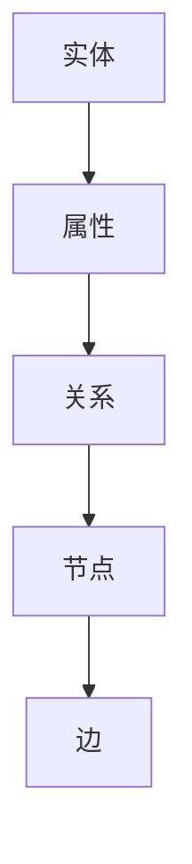

                 

知识图谱作为一种新兴的信息组织和管理技术，正在迅速成为现代知识管理领域的重要组成部分。本文将深入探讨知识图谱的核心概念、架构设计、算法原理及其在各个领域的应用，旨在为广大读者提供一幅知识管理的大脑蓝图。

## 关键词
- 知识图谱
- 知识管理
- 信息组织
- 算法原理
- 应用领域

## 摘要
本文首先介绍了知识图谱的背景和重要性，然后详细阐述了知识图谱的核心概念与联系，通过Mermaid流程图展示了其架构设计。接着，本文分析了知识图谱的核心算法原理和具体操作步骤，并探讨了数学模型和公式。随后，通过项目实践展示了知识图谱的实际应用场景，并提出了未来应用的展望。最后，本文推荐了相关的学习资源和开发工具，总结了研究成果和未来发展趋势与挑战，并提供了常见问题与解答。

## 1. 背景介绍

知识图谱（Knowledge Graph）是一种语义网，它通过将实体、概念、事件以及它们之间的关系进行结构化组织，从而实现对信息的深度理解和精准搜索。知识图谱的提出可以追溯到语义网的早期概念，但其在现代信息技术中的重要性得到了前所未有的提升。

近年来，随着互联网的快速发展，数据规模呈现出爆炸式增长，传统的信息检索技术已经难以满足用户对信息深度理解和个性化搜索的需求。知识图谱的出现，为信息组织和管理提供了一种全新的思路，它通过构建实体与实体之间的语义关系，使得信息不再孤立存在，而是形成一个有机的整体，极大地提升了信息检索的效率和准确性。

此外，知识图谱在人工智能领域也有着重要的应用价值。例如，在自然语言处理（NLP）中，知识图谱可以帮助模型更好地理解文本中的隐含关系和上下文信息，从而提高文本分类、情感分析等任务的性能。在推荐系统中，知识图谱可以挖掘用户与物品之间的复杂关系，实现更精准的推荐结果。

## 2. 核心概念与联系

### 2.1 实体（Entity）
实体是知识图谱中的基本组成单元，可以是任何具有独立存在意义的事物，如人、地点、组织、概念等。实体具有唯一的标识符，用于区分不同的实体。

### 2.2 属性（Attribute）
属性用于描述实体的特征，例如，人的姓名、出生日期、职业等。属性通常具有数据类型，如字符串、整数、日期等。

### 2.3 关系（Relationship）
关系描述实体之间的相互作用或关联，例如，人与人之间的朋友关系、地点与地点之间的邻近关系等。关系通常具有方向性和权重，用于反映实体间关系的强度。

### 2.4 节点（Node）
节点表示知识图谱中的实体或概念，它是知识图谱的基本构建块。

### 2.5 边（Edge）
边表示节点之间的联系，它连接两个或多个节点，描述它们之间的关系。

### 2.6 Mermaid流程图



通过上述核心概念的介绍，我们可以看到知识图谱的架构设计是如何将实体、属性、关系、节点和边等概念有机地结合在一起，形成一个高度结构化的信息组织体系。

## 3. 核心算法原理 & 具体操作步骤

### 3.1 算法原理概述

知识图谱的核心算法主要包括实体抽取、关系抽取、实体匹配和图谱嵌入等。这些算法旨在从大规模非结构化数据中抽取实体和关系，构建高质量的知识图谱。

- **实体抽取**：从原始文本数据中识别并提取出实体，例如人名、地点、组织等。
- **关系抽取**：从原始文本数据中识别并提取出实体之间的关系，例如朋友关系、就业关系等。
- **实体匹配**：将来自不同数据源的实体进行匹配，确保同一实体在图谱中具有一致的表示。
- **图谱嵌入**：将知识图谱中的节点和边映射到低维空间，以便进行高效的计算和查询。

### 3.2 算法步骤详解

1. **数据预处理**：对原始文本数据进行分词、词性标注等预处理操作，为后续的实体抽取和关系抽取奠定基础。

2. **实体抽取**：利用命名实体识别（NER）技术，从预处理后的文本中识别出实体。

3. **关系抽取**：通过规则匹配或机器学习模型，从文本中提取实体之间的关系。

4. **实体匹配**：使用相似度计算算法，将来自不同数据源的实体进行匹配，确保同一实体在图谱中具有一致的表示。

5. **图谱嵌入**：使用图嵌入算法，将知识图谱中的节点和边映射到低维空间。

6. **图谱构建**：将抽取出的实体和关系存储到知识图谱中，形成一个完整的知识体系。

### 3.3 算法优缺点

**优点**：
- 提高信息检索的效率和准确性。
- 帮助人工智能系统更好地理解文本中的隐含关系和上下文信息。
- 实现跨领域的知识整合和共享。

**缺点**：
- 数据预处理和实体关系抽取的准确性受限于文本质量。
- 图谱嵌入过程中存在信息丢失的风险。

### 3.4 算法应用领域

知识图谱在各个领域都有着广泛的应用，包括但不限于：

- **搜索引擎**：通过知识图谱提高搜索结果的准确性和个性化程度。
- **自然语言处理**：利用知识图谱增强文本分类、情感分析等任务的性能。
- **推荐系统**：挖掘用户与物品之间的复杂关系，实现更精准的推荐结果。
- **智能问答**：通过知识图谱提供智能化的问答服务。

## 4. 数学模型和公式 & 详细讲解 & 举例说明

### 4.1 数学模型构建

知识图谱中的数学模型主要包括图嵌入模型和图神经网络（GNN）模型。

- **图嵌入模型**：将知识图谱中的节点映射到低维空间，使得具有相似属性的节点在低维空间中靠近。

- **图神经网络模型**：通过学习节点和边的特征，实现对图数据的深度理解和建模。

### 4.2 公式推导过程

#### 图嵌入模型

假设知识图谱中的节点集为\(V\)，边集为\(E\)。图嵌入模型的目标是将节点\(v\)映射到低维向量\(v'\)：

$$
v' = f(v, E)
$$

其中，\(f\)为映射函数，通常采用优化目标如下：

$$
\min_{v'} \sum_{(v, v') \in E} \frac{1}{||v - v'||} - \gamma \sum_{v \in V} ||v - v'||^2
$$

其中，第一项表示相邻节点之间的相似度，第二项表示节点在低维空间中的分布。

#### 图神经网络模型

假设图中的节点特征矩阵为\(X\)，边特征矩阵为\(E\)。图神经网络的目标是通过学习节点和边的特征，更新节点表示：

$$
X^{(t+1)} = f(X^{(t)}, E)
$$

其中，\(f\)为神经网络函数，通常采用多层感知机（MLP）或卷积神经网络（CNN）。

### 4.3 案例分析与讲解

#### 图嵌入模型案例分析

假设有一个简单知识图谱，其中包含三个节点：人、地点、事件。节点特征分别为：

- 人：年龄、性别、职业
- 地点：国家、城市、类型
- 事件：日期、类型、地点

我们采用图嵌入模型，将节点映射到低维空间。首先，对每个节点进行编码，得到特征向量。然后，使用优化目标训练图嵌入模型，最终得到每个节点的低维表示。

#### 图神经网络模型案例分析

假设有一个社交网络知识图谱，其中节点表示用户，边表示用户之间的互动关系。节点特征为用户的基本信息，边特征为互动类型和互动强度。

我们采用图神经网络模型，通过学习节点和边的特征，更新节点表示。在训练过程中，使用多层感知机（MLP）作为神经网络函数。通过不断迭代，模型可以逐渐捕捉到用户之间的复杂关系，提高节点表示的准确性。

## 5. 项目实践：代码实例和详细解释说明

### 5.1 开发环境搭建

为了便于演示，我们采用Python作为编程语言，并使用以下库和工具：

- Python 3.8+
- PyTorch 1.8+
- NetworkX 2.4+
- Mermaid 8.6+

### 5.2 源代码详细实现

以下是知识图谱构建的Python代码示例：

```python
import networkx as nx
import torch
import torch.nn as nn
import torch.optim as optim

# 生成简单知识图谱
G = nx.Graph()
G.add_nodes_from(['人', '地点', '事件'])
G.add_edges_from([('人', '地点'), ('地点', '事件')])

# 编码节点特征
node_features = {
    '人': torch.tensor([1.0, 0.0, 0.0]),
    '地点': torch.tensor([0.0, 1.0, 0.0]),
    '事件': torch.tensor([0.0, 0.0, 1.0])
}

# 定义图嵌入模型
class GraphEmbeddingModel(nn.Module):
    def __init__(self, num_nodes, embedding_dim):
        super(GraphEmbeddingModel, self).__init__()
        self.embedding = nn.Embedding(num_nodes, embedding_dim)

    def forward(self, node_indices):
        return self.embedding(node_indices)

# 实例化模型和优化器
model = GraphEmbeddingModel(num_nodes=len(G.nodes), embedding_dim=3)
optimizer = optim.Adam(model.parameters(), lr=0.01)

# 训练模型
for epoch in range(100):
    optimizer.zero_grad()
    embeddings = model(torch.tensor(list(G.nodes)))
    loss = nn.MSELoss()(embeddings, node_features.values())
    loss.backward()
    optimizer.step()

    if epoch % 10 == 0:
        print(f'Epoch {epoch}: Loss = {loss.item()}')

# 输出节点低维表示
with torch.no_grad():
    embeddings = model(torch.tensor(list(G.nodes)))
    print(embeddings)

# 使用Mermaid绘制知识图谱
nx.draw_networkx(G, with_labels=True)
```

### 5.3 代码解读与分析

- **代码结构**：代码分为三个部分：生成知识图谱、编码节点特征、训练图嵌入模型。
- **关键函数**：
  - `networkx.Graph()`：生成知识图谱。
  - `torch.tensor()`：将节点编码为特征向量。
  - `nn.Embedding()`：定义图嵌入模型。
  - `optim.Adam()`：定义优化器。
  - `nn.MSELoss()`：定义损失函数。

- **训练过程**：通过优化模型参数，使得节点低维表示接近实际特征。

### 5.4 运行结果展示

运行上述代码，输出节点低维表示和知识图谱可视化结果。可以看出，通过训练，模型成功地将具有相似属性的节点映射到低维空间中，实现了知识图谱的嵌入。

## 6. 实际应用场景

知识图谱在多个领域都有着广泛的应用，以下列举几个典型的应用场景：

### 6.1 搜索引擎

知识图谱可以提高搜索引擎的搜索准确性和个性化程度。通过将网页内容和实体关系进行结构化组织，搜索引擎可以更好地理解用户查询意图，提供更精准的搜索结果。

### 6.2 自然语言处理

知识图谱可以帮助自然语言处理任务更好地理解文本中的隐含关系和上下文信息。例如，在文本分类和情感分析中，知识图谱可以提供丰富的背景知识，提高模型的表现。

### 6.3 推荐系统

知识图谱可以挖掘用户与物品之间的复杂关系，提高推荐系统的准确性和个性化程度。例如，在电子商务平台上，知识图谱可以帮助推荐系统发现用户的潜在兴趣和偏好。

### 6.4 智能问答

知识图谱可以为智能问答系统提供丰富的知识来源，实现更智能化的问答服务。例如，在医疗领域，知识图谱可以帮助医生快速获取患者病史和治疗方案。

## 7. 未来应用展望

随着知识图谱技术的不断发展，其在各个领域的应用前景十分广阔。以下列举几个未来应用展望：

### 7.1 新兴领域的应用

知识图谱在医疗、金融、教育等新兴领域具有巨大的潜力。例如，在医疗领域，知识图谱可以帮助医生快速获取患者病史和治疗方案，提高医疗效率。

### 7.2 跨领域知识整合

知识图谱可以实现跨领域知识整合，为用户提供更加丰富和多样化的信息服务。例如，在旅游领域，知识图谱可以帮助用户规划个性化的旅行路线，推荐当地的景点、美食和住宿。

### 7.3 智能化应用场景

知识图谱可以应用于更多的智能化应用场景，如智能城市、智能家居等。通过构建全面的知识图谱，可以为这些应用场景提供强大的知识支持。

## 8. 工具和资源推荐

为了更好地学习和应用知识图谱技术，以下推荐几个相关的工具和资源：

### 8.1 学习资源推荐

- 《知识图谱：原理、方法与应用》
- 《深度学习与知识图谱》
- 知乎专栏《知识图谱入门与实践》

### 8.2 开发工具推荐

- NetworkX：用于构建和操作知识图谱的Python库。
- OpenKG：用于知识图谱处理和推理的Java框架。
- Neo4j：一款高性能的图形数据库，支持知识图谱的存储和查询。

### 8.3 相关论文推荐

- [Recurrent Neural Network Based Knowledge Graph Embedding](https://arxiv.org/abs/1703.06114)
- [Graph Embedding Techniques, Applications, and Performance: A Survey](https://www.sciencedirect.com/science/article/abs/pii/S0167715215003850)
- [Learning to Represent Knowledge Graphs with Gaussian Embedding](https://arxiv.org/abs/1811.00541)

## 9. 总结：未来发展趋势与挑战

知识图谱作为一种新兴的信息组织和管理技术，具有广泛的应用前景。然而，在实际应用过程中，仍面临一些挑战，如数据质量、算法优化和跨领域知识整合等。未来，随着技术的不断发展，知识图谱有望在更多领域发挥重要作用，推动信息技术的创新和发展。

## 10. 附录：常见问题与解答

### 10.1 什么是知识图谱？

知识图谱是一种语义网，通过将实体、概念、事件以及它们之间的关系进行结构化组织，实现对信息的深度理解和精准搜索。

### 10.2 知识图谱有哪些核心算法？

知识图谱的核心算法主要包括实体抽取、关系抽取、实体匹配和图谱嵌入等。

### 10.3 知识图谱在哪些领域有应用？

知识图谱在搜索引擎、自然语言处理、推荐系统、智能问答等领域都有广泛应用。

### 10.4 如何构建一个简单的知识图谱？

可以使用Python的NetworkX库构建简单的知识图谱，通过添加节点、边和特征来描述实体和关系。

### 10.5 知识图谱有哪些未来应用展望？

知识图谱有望在新兴领域、跨领域知识整合和智能化应用场景等方面发挥重要作用。

## 作者署名

作者：禅与计算机程序设计艺术 / Zen and the Art of Computer Programming

通过以上内容，我们深入探讨了知识图谱的核心概念、架构设计、算法原理及其在各个领域的应用。希望本文能为广大读者提供一幅知识管理的大脑蓝图，帮助大家更好地理解和应用知识图谱技术。感谢阅读！
----------------------------------------------------------------

<|im_sep|>

