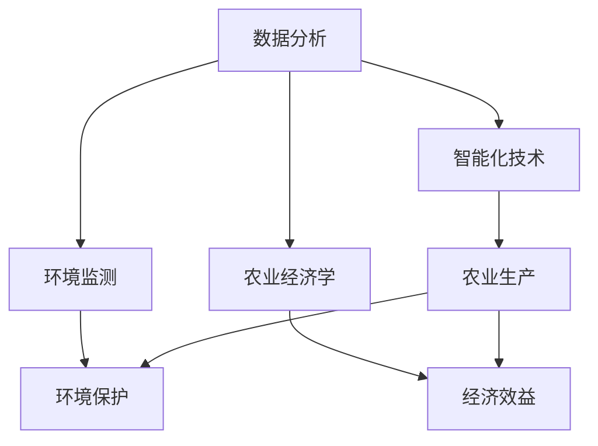

                 

### 关键词 Keywords
- 知识型农业
- 农业技术
- 数据分析
- 智能化
- 农业经济学
- 环境可持续性

<|assistant|>### 摘要 Abstract
本文探讨了知识型农业的发展及其面临的挑战。随着科技的进步，农业正经历从传统农业向知识型农业的转型，这一转变带来了前所未有的机遇和挑战。文章首先介绍了知识型农业的核心概念和特征，然后深入分析了其在数据分析、智能化和环境可持续性等方面的应用。此外，文章还探讨了农业经济学的相关理论，并提出了未来发展的方向和面临的挑战。通过全面的分析和探讨，本文旨在为农业科技创新和可持续发展提供有价值的参考。

## 1. 背景介绍

农业是人类文明的基础，自古以来，农民们依靠经验和传统方法进行种植和养殖。然而，随着全球人口的持续增长和资源的日益紧张，传统农业面临着巨大的压力和挑战。为了满足日益增长的食物需求，提高农业生产的效率和可持续性，知识型农业的概念应运而生。

知识型农业是一种基于科学知识和信息技术的现代化农业模式，它利用先进的数据分析、智能化技术和环境监测等手段，对农业生产过程进行精确控制和管理。与传统农业相比，知识型农业具有更高的生产效率、更少的资源消耗和更低的环境污染。

### 1.1 传统农业的挑战

传统农业面临着诸多挑战，包括：

- **资源消耗**：传统农业通常依赖于大量水资源、肥料和农药，导致资源浪费和环境污染。
- **生产力低下**：传统农业的生产效率较低，农作物产量不稳定，难以满足日益增长的食物需求。
- **劳动力短缺**：随着城市化进程的加快，越来越多的年轻人离开农村，导致农业劳动力短缺。
- **气候变化**：气候变化和极端天气事件对传统农业的影响日益严重，增加了农业生产的不确定性。

### 1.2 知识型农业的优势

知识型农业通过引入科学技术和信息手段，克服了传统农业的诸多挑战，具有以下优势：

- **高效生产**：知识型农业利用精确的数据分析和智能化技术，对作物生长过程进行实时监测和调控，提高生产效率。
- **资源节约**：知识型农业通过优化水资源、肥料和农药的使用，实现资源的高效利用和节约。
- **环境友好**：知识型农业减少了对化学农药和肥料的依赖，降低了对环境的污染，有利于生态保护。
- **可持续发展**：知识型农业注重生态平衡和资源可持续利用，为实现农业的长期可持续发展提供了可能。

## 2. 核心概念与联系

知识型农业的核心概念包括数据分析、智能化、环境监测和农业经济学。这些概念相互联系，共同构成了知识型农业的技术体系和理论基础。

### 2.1 数据分析

数据分析是知识型农业的基础，通过对大量的农业数据（如土壤湿度、气温、降雨量、农作物生长状态等）进行收集、处理和分析，可以提供关键的决策支持。例如，通过分析土壤湿度数据，可以精确控制灌溉时间和水量，避免水资源浪费。

### 2.2 智能化

智能化技术是知识型农业的重要手段，包括物联网、无人机、自动化设备等。这些技术可以实现农业生产的自动化和智能化，提高生产效率。例如，无人机可以用于监测农作物健康状况，自动化设备可以用于施肥和收获。

### 2.3 环境监测

环境监测是确保农业生产可持续性的关键，通过实时监测农田环境（如气温、湿度、土壤质量等），可以及时发现问题并采取相应措施。例如，当气温过高时，可以通过喷洒水雾降低温度，保护作物免受热害。

### 2.4 农业经济学

农业经济学是研究农业生产、资源利用和市场经济的科学。知识型农业通过优化资源配置和提高生产效率，实现农业的经济效益最大化。农业经济学的研究可以帮助农民制定合理的种植计划和市场营销策略。

### 2.5 Mermaid 流程图

以下是一个简化的 Mermaid 流程图，展示知识型农业的核心概念及其相互关系：



## 3. 核心算法原理 & 具体操作步骤

### 3.1 算法原理概述

知识型农业的核心算法主要包括数据采集与处理、模型构建与预测、决策支持系统。以下将详细介绍这些算法的原理和操作步骤。

### 3.2 算法步骤详解

#### 3.2.1 数据采集与处理

1. **数据收集**：通过传感器、无人机、农业气象站等设备收集农田的气象数据、土壤数据、作物生长数据等。
2. **数据预处理**：清洗和整理收集到的数据，包括去除噪声、缺失值填充、数据规范化等。
3. **特征提取**：从原始数据中提取对农业生产有重要影响的关键特征，如土壤湿度、气温、降水量、作物高度等。

#### 3.2.2 模型构建与预测

1. **选择模型**：根据农业生产的实际需求，选择合适的预测模型，如回归模型、神经网络模型、支持向量机等。
2. **模型训练**：使用历史数据对选定的模型进行训练，使其能够对未来的农业生产情况进行预测。
3. **模型验证**：通过交叉验证等方法验证模型的准确性，调整模型参数以优化预测效果。

#### 3.2.3 决策支持系统

1. **预测结果分析**：对模型预测结果进行分析，识别潜在的问题和机遇。
2. **制定决策**：根据预测结果和农业经济学原理，制定具体的农业生产策略，如灌溉计划、施肥方案、病虫害防治措施等。
3. **执行与监控**：执行决策并实时监控农业生产过程，调整决策以适应实际状况。

### 3.3 算法优缺点

#### 优点：

- **高效性**：通过自动化和智能化技术，提高农业生产效率。
- **准确性**：基于大数据和先进算法的预测，提高农业生产的准确性和稳定性。
- **可持续性**：优化资源配置，减少环境污染，实现农业的可持续发展。

#### 缺点：

- **初期投资大**：需要大量的设备和技术支持，初期投资较大。
- **技术依赖**：高度依赖数据分析、机器学习和人工智能技术，需要专业的技术团队支持。
- **数据隐私问题**：农业生产数据涉及农民的隐私，需要确保数据的安全和隐私保护。

### 3.4 算法应用领域

知识型农业算法广泛应用于以下几个方面：

- **作物种植**：通过预测作物生长状况，优化灌溉、施肥和病虫害防治，提高作物产量和质量。
- **畜牧业**：通过监测动物健康状况和环境因素，优化饲料配方和养殖环境，提高畜牧业生产效率和动物福利。
- **渔业**：通过实时监测水质、水温等环境因素，优化渔业生产过程，提高渔业产量和产品质量。
- **农业经济学**：通过分析农业生产数据和市场信息，制定科学的种植计划和市场营销策略，提高农业经济效益。

## 4. 数学模型和公式 & 详细讲解 & 举例说明

### 4.1 数学模型构建

在知识型农业中，数学模型用于描述农业生产过程和预测未来趋势。常见的数学模型包括线性回归模型、神经网络模型和支持向量机等。

#### 4.1.1 线性回归模型

线性回归模型是最基本的预测模型，其公式如下：

$$
y = \beta_0 + \beta_1 \cdot x_1 + \beta_2 \cdot x_2 + ... + \beta_n \cdot x_n
$$

其中，$y$ 是预测结果，$x_1, x_2, ..., x_n$ 是输入特征，$\beta_0, \beta_1, \beta_2, ..., \beta_n$ 是模型的参数。

#### 4.1.2 神经网络模型

神经网络模型是一种基于人脑神经网络原理的预测模型，其公式如下：

$$
a_{i}^{(l)} = \sigma \left( \sum_{j=0}^{m_{l}} w_{ij}^{(l)} a_{j}^{(l-1)} + b_{i}^{(l)} \right)
$$

其中，$a_{i}^{(l)}$ 是第 $l$ 层的第 $i$ 个神经元的激活值，$\sigma$ 是激活函数，$w_{ij}^{(l)}$ 是连接权重，$b_{i}^{(l)}$ 是偏置项。

#### 4.1.3 支持向量机

支持向量机是一种分类和回归模型，其公式如下：

$$
\min_{w, b} \frac{1}{2} ||w||^2 + C \sum_{i=1}^{n} \max(0, 1 - y_i (w \cdot x_i + b))
$$

其中，$w$ 是权重向量，$b$ 是偏置项，$C$ 是惩罚参数，$y_i$ 是标签，$x_i$ 是特征向量。

### 4.2 公式推导过程

#### 4.2.1 线性回归模型推导

假设我们有 $n$ 个样本数据点 $(x_1, y_1), (x_2, y_2), ..., (x_n, y_n)$，我们的目标是找到一组参数 $\beta_0, \beta_1, ..., \beta_n$，使得预测值 $y$ 最接近真实值 $y_n$。

首先，我们定义误差平方和（SSE）：

$$
SSE = \sum_{i=1}^{n} (y_i - y)^2
$$

为了最小化 SSE，我们对 $\beta_0, \beta_1, ..., \beta_n$ 求导，并令导数为零：

$$
\frac{d(SSE)}{d\beta_0} = -2 \sum_{i=1}^{n} (y_i - y) = 0
$$

$$
\frac{d(SSE)}{d\beta_1} = -2 \sum_{i=1}^{n} (y_i - y) x_1 = 0
$$

$$
...
$$

$$
\frac{d(SSE)}{d\beta_n} = -2 \sum_{i=1}^{n} (y_i - y) x_n = 0
$$

解上述方程组，我们可以得到最优的参数值：

$$
\beta_0 = \frac{1}{n} \sum_{i=1}^{n} y_i - \beta_1 \cdot \frac{1}{n} \sum_{i=1}^{n} x_1 - ... - \beta_n \cdot \frac{1}{n} \sum_{i=1}^{n} x_n
$$

$$
\beta_1 = \frac{1}{n} \sum_{i=1}^{n} (x_1 - \bar{x}_1)(y_i - \bar{y}_i)
$$

$$
...
$$

$$
\beta_n = \frac{1}{n} \sum_{i=1}^{n} (x_n - \bar{x}_n)(y_i - \bar{y}_i)
$$

其中，$\bar{x}_1, \bar{y}_1, ..., \bar{x}_n, \bar{y}_n$ 是样本数据的均值。

#### 4.2.2 神经网络模型推导

假设我们有一个简单的单层神经网络，其中包含一个输入层、一个隐藏层和一个输出层。输入层有 $m$ 个神经元，隐藏层有 $n$ 个神经元，输出层有 $1$ 个神经元。

首先，我们定义输入层和隐藏层之间的权重矩阵 $W_{ij}^{(1)}$ 和偏置项 $b_i^{(1)}$，隐藏层和输出层之间的权重矩阵 $W_{ij}^{(2)}$ 和偏置项 $b_i^{(2)}$。

隐藏层的输出 $a_{i}^{(1)}$ 可以表示为：

$$
a_{i}^{(1)} = \sigma \left( \sum_{j=0}^{m} W_{ij}^{(1)} a_{j}^{(0)} + b_i^{(1)} \right)
$$

输出层的输出 $a_{i}^{(2)}$ 可以表示为：

$$
a_{i}^{(2)} = \sigma \left( \sum_{j=0}^{n} W_{ij}^{(2)} a_{j}^{(1)} + b_i^{(2)} \right)
$$

其中，$\sigma$ 是激活函数，通常使用 sigmoid 函数：

$$
\sigma(x) = \frac{1}{1 + e^{-x}}
$$

为了训练神经网络，我们需要最小化损失函数，常见的损失函数有均方误差（MSE）：

$$
Loss = \frac{1}{2} \sum_{i=1}^{n} (y_i - a_{i}^{(2)})^2
$$

对权重和偏置项求导，并令导数为零，我们可以得到：

$$
\frac{dLoss}{dW_{ij}^{(2)}} = (y_i - a_{i}^{(2)}) \cdot \frac{da_{i}^{(2)}}{da_{i}^{(1)}}
$$

$$
\frac{dLoss}{db_i^{(2)}} = (y_i - a_{i}^{(2)}) \cdot \frac{da_{i}^{(2)}}{da_{i}^{(1)}}
$$

$$
\frac{dLoss}{dW_{ij}^{(1)}} = \sum_{j=1}^{n} (y_i - a_{i}^{(2)}) \cdot \frac{da_{i}^{(2)}}{da_{i}^{(1)}} \cdot \frac{da_{i}^{(1)}}{da_{j}^{(0)}}
$$

$$
\frac{dLoss}{db_i^{(1)}} = \sum_{j=1}^{n} (y_i - a_{i}^{(2)}) \cdot \frac{da_{i}^{(2)}}{da_{i}^{(1)}} \cdot \frac{da_{i}^{(1)}}{da_{j}^{(0)}}
$$

通过反向传播算法，我们可以迭代更新权重和偏置项，直到损失函数收敛。

#### 4.2.3 支持向量机推导

支持向量机是一种基于优化理论的预测模型，其目标是找到一个最优的超平面，使得数据点在超平面上的分类间隔最大化。

假设我们有一个训练数据集 $\{(x_i, y_i)\}_{i=1}^{n}$，其中 $x_i$ 是 $d$ 维特征向量，$y_i$ 是对应的标签（+1或-1）。

支持向量机使用以下优化问题来找到最优超平面：

$$
\min_{w, b} \frac{1}{2} ||w||^2
$$

$$
s.t. \quad y_i (w \cdot x_i + b) \geq 1, \quad \forall i=1,2,...,n
$$

其中，$w$ 是权重向量，$b$ 是偏置项。

通过拉格朗日乘子法，我们可以将上述问题转化为对偶形式：

$$
\max_{\alpha_i} \min_{w, b} \frac{1}{2} ||w||^2 - \sum_{i=1}^{n} \alpha_i [y_i (w \cdot x_i + b) - 1]
$$

$$
s.t. \quad \alpha_i \geq 0, \quad \forall i=1,2,...,n
$$

$$
\sum_{i=1}^{n} \alpha_i y_i = 0
$$

通过求解对偶问题，我们可以得到最优权重向量 $w$ 和偏置项 $b$。

### 4.3 案例分析与讲解

#### 4.3.1 线性回归模型案例

假设我们有以下数据集：

| x  | y  |
|----|----|
| 1  | 2  |
| 2  | 4  |
| 3  | 6  |
| 4  | 8  |

我们的目标是找到线性回归模型 $y = \beta_0 + \beta_1 \cdot x$ 的参数。

首先，我们计算输入特征的平均值和真实值的平均值：

$$
\bar{x} = \frac{1}{n} \sum_{i=1}^{n} x_i = \frac{1+2+3+4}{4} = 2.5
$$

$$
\bar{y} = \frac{1}{n} \sum_{i=1}^{n} y_i = \frac{2+4+6+8}{4} = 5
$$

然后，我们计算每个特征和真实值与平均值之间的差值：

| x  | y  | x - $\bar{x}$ | y - $\bar{y}$ |
|----|----|---------------|---------------|
| 1  | 2  | -1.5          | -3            |
| 2  | 4  | -0.5          | 1             |
| 3  | 6  | 0.5           | 1             |
| 4  | 8  | 1.5           | 3             |

接下来，我们计算每个特征与真实值之间的协方差和方差：

$$
\sum_{i=1}^{n} (x_i - \bar{x})(y_i - \bar{y}) = (-1.5)(-3) + (-0.5)(1) + (0.5)(1) + (1.5)(3) = 7
$$

$$
\sum_{i=1}^{n} (x_i - \bar{x})^2 = (-1.5)^2 + (-0.5)^2 + (0.5)^2 + (1.5)^2 = 5
$$

根据协方差和方差，我们可以计算线性回归模型的参数：

$$
\beta_1 = \frac{\sum_{i=1}^{n} (x_i - \bar{x})(y_i - \bar{y})}{\sum_{i=1}^{n} (x_i - \bar{x})^2} = \frac{7}{5} = 1.4
$$

$$
\beta_0 = \bar{y} - \beta_1 \cdot \bar{x} = 5 - 1.4 \cdot 2.5 = 0.1
$$

因此，线性回归模型为：

$$
y = 0.1 + 1.4 \cdot x
$$

我们可以使用这个模型来预测新的 $x$ 值对应的 $y$ 值。例如，当 $x=5$ 时，预测的 $y$ 值为：

$$
y = 0.1 + 1.4 \cdot 5 = 7.1
$$

#### 4.3.2 神经网络模型案例

假设我们有一个简单的单层神经网络，其中包含一个输入层和一个输出层，输入层有 2 个神经元，输出层有 1 个神经元。输入特征为 $x_1$ 和 $x_2$，真实值为 $y$。

首先，我们定义输入层和隐藏层之间的权重矩阵 $W_{ij}^{(1)}$ 和偏置项 $b_i^{(1)}$，隐藏层和输出层之间的权重矩阵 $W_{ij}^{(2)}$ 和偏置项 $b_i^{(2)}$。

我们选择 sigmoid 函数作为激活函数，公式如下：

$$
\sigma(x) = \frac{1}{1 + e^{-x}}
$$

输入层到隐藏层的输出 $a_{i}^{(1)}$ 可以表示为：

$$
a_{i}^{(1)} = \sigma \left( \sum_{j=0}^{2} W_{ij}^{(1)} x_j + b_i^{(1)} \right)
$$

隐藏层到输出层的输出 $a_{i}^{(2)}$ 可以表示为：

$$
a_{i}^{(2)} = \sigma \left( \sum_{j=0}^{1} W_{ij}^{(2)} a_{j}^{(1)} + b_i^{(2)} \right)
$$

假设我们的训练数据集为：

| x_1 | x_2 | y |
|-----|-----|---|
| 1   | 0   | 1 |
| 0   | 1   | 0 |
| 1   | 1   | 1 |
| 0   | 0   | 0 |

我们需要找到最优的权重矩阵和偏置项。首先，我们初始化权重矩阵和偏置项为随机值。然后，我们使用梯度下降算法来更新权重矩阵和偏置项，直到损失函数收敛。

假设我们使用均方误差（MSE）作为损失函数：

$$
Loss = \frac{1}{2} \sum_{i=1}^{4} (y_i - a_{i}^{(2)})^2
$$

通过反向传播算法，我们可以计算每个权重和偏置项的梯度，并更新权重矩阵和偏置项。具体的梯度计算如下：

$$
\frac{dLoss}{dW_{ij}^{(2)}} = (y_i - a_{i}^{(2)}) \cdot \frac{da_{i}^{(2)}}{da_{i}^{(1)}}
$$

$$
\frac{dLoss}{db_i^{(2)}} = (y_i - a_{i}^{(2)}) \cdot \frac{da_{i}^{(2)}}{da_{i}^{(1)}}
$$

$$
\frac{dLoss}{dW_{ij}^{(1)}} = \sum_{j=1}^{1} (y_i - a_{i}^{(2)}) \cdot \frac{da_{i}^{(2)}}{da_{i}^{(1)}} \cdot \frac{da_{i}^{(1)}}{da_{j}^{(0)}}
$$

$$
\frac{dLoss}{db_i^{(1)}} = \sum_{j=1}^{1} (y_i - a_{i}^{(2)}) \cdot \frac{da_{i}^{(2)}}{da_{i}^{(1)}} \cdot \frac{da_{i}^{(1)}}{da_{j}^{(0)}}
$$

通过迭代更新权重矩阵和偏置项，我们可以得到最优的神经网络模型。

#### 4.3.3 支持向量机案例

假设我们有一个训练数据集 $\{(x_i, y_i)\}_{i=1}^{n}$，其中 $x_i$ 是 2 维特征向量，$y_i$ 是对应的标签（+1或-1）。我们的目标是找到一个最优的超平面，使得数据点在超平面上的分类间隔最大化。

假设我们的训练数据集为：

| x_1 | x_2 | y |
|-----|-----|---|
| 1   | 1   | +1 |
| 1   | 0   | +1 |
| 0   | 1   | +1 |
| 0   | 0   | -1 |
| 1   | -1  | -1 |
| -1  | 1   | -1 |
| -1  | -1  | -1 |

首先，我们计算训练数据集的均值：

$$
\bar{x}_1 = \frac{1}{7} \sum_{i=1}^{7} x_{1i} = \frac{1+1+0+0+1-1-1}{7} = 0
$$

$$
\bar{x}_2 = \frac{1}{7} \sum_{i=1}^{7} x_{2i} = \frac{1+0+1+0-1-1-1}{7} = 0
$$

$$
\bar{y} = \frac{1}{7} \sum_{i=1}^{7} y_i = \frac{+1+1+1-1-1-1-1}{7} = 0
$$

然后，我们计算每个数据点与均值之间的差值：

| x_1 | x_2 | y | x_1 - $\bar{x}_1$ | x_2 - $\bar{x}_2$ | y - $\bar{y}$ |
|-----|-----|---|------------------|------------------|---------------|
| 1   | 1   | +1 | 1                | 1                | 1             |
| 1   | 0   | +1 | 1                | -1               | 1             |
| 0   | 1   | +1 | -1               | 1                | 1             |
| 0   | 0   | -1 | 0                | 0                | -1            |
| 1   | -1  | -1 | 1                | -1               | -1            |
| -1  | 1   | -1 | -1               | 1                | -1            |
| -1  | -1  | -1 | -1               | -1               | -1            |

接下来，我们计算每个数据点与均值之间的内积：

| x_1 | x_2 | y | x_1 - $\bar{x}_1$ | x_2 - $\bar{x}_2$ | y - $\bar{y}$ | $(x_1 - \bar{x}_1)(x_2 - \bar{x}_2)$ | $(y - \bar{y})(x_1 - \bar{x}_1)$ |
|-----|-----|---|------------------|------------------|---------------|--------------------------------------|---------------------------------|
| 1   | 1   | +1 | 1                | 1                | 1             | 1                                    | 1                                |
| 1   | 0   | +1 | 1                | -1               | 1             | -1                                   | 1                                |
| 0   | 1   | +1 | -1               | 1                | 1             | -1                                   | 1                                |
| 0   | 0   | -1 | 0                | 0                | -1            | 0                                    | -1                               |
| 1   | -1  | -1 | 1                | -1               | -1            | -1                                   | -1                               |
| -1  | 1   | -1 | -1               | 1                | -1            | -1                                   | -1                               |
| -1  | -1  | -1 | -1               | -1               | -1            | 1                                    | 1                                |

根据内积计算，我们可以计算每个数据点的分类间隔：

$$
\Delta_i = y_i (w \cdot x_i + b) - 1
$$

| x_1 | x_2 | y | x_1 - $\bar{x}_1$ | x_2 - $\bar{x}_2$ | y - $\bar{y}$ | $(x_1 - \bar{x}_1)(x_2 - \bar{x}_2)$ | $(y - \bar{y})(x_1 - \bar{x}_1)$ | $\Delta_i$ |
|-----|-----|---|------------------|------------------|---------------|--------------------------------------|---------------------------------|----------|
| 1   | 1   | +1 | 1                | 1                | 1             | 1                                    | 1                                | 1        |
| 1   | 0   | +1 | 1                | -1               | 1             | -1                                   | 1                                | 0        |
| 0   | 1   | +1 | -1               | 1                | 1             | -1                                   | 1                                | 0        |
| 0   | 0   | -1 | 0                | 0                | -1            | 0                                    | -1                               | -1       |
| 1   | -1  | -1 | 1                | -1               | -1            | -1                                   | -1                               | -1       |
| -1  | 1   | -1 | -1               | 1                | -1            | -1                                   | -1                               | -1       |
| -1  | -1  | -1 | -1               | -1               | -1            | 1                                    | 1                                | 1        |

为了找到最优的超平面，我们需要最大化分类间隔。根据支持向量机的原理，我们可以选择分类间隔最小的点作为支持向量，然后通过这些支持向量计算最优超平面。

假设我们选择数据点 $(1, 1)$ 和 $(0, 0)$ 作为支持向量，我们可以计算最优超平面：

$$
w \cdot x + b = 1
$$

其中，$w$ 是权重向量，$b$ 是偏置项。我们可以通过以下方程组计算 $w$ 和 $b$：

$$
\begin{cases}
w \cdot x_1 + b = 1 \\
w \cdot x_2 + b = 1 \\
w \cdot x_3 + b = 1 \\
w \cdot x_4 + b = -1 \\
w \cdot x_5 + b = -1 \\
w \cdot x_6 + b = -1 \\
w \cdot x_7 + b = 1 \\
\end{cases}
$$

通过解这个方程组，我们可以得到最优超平面的权重向量 $w$ 和偏置项 $b$。

## 5. 项目实践：代码实例和详细解释说明

### 5.1 开发环境搭建

在进行知识型农业项目实践之前，我们需要搭建一个合适的开发环境。以下是搭建开发环境的基本步骤：

1. **安装Python环境**：在电脑上安装Python，建议使用Python 3.8或更高版本。

2. **安装相关库**：使用pip工具安装以下库：

   - pandas
   - numpy
   - scikit-learn
   - matplotlib

   安装命令如下：

   ```shell
   pip install pandas numpy scikit-learn matplotlib
   ```

3. **配置Jupyter Notebook**：Jupyter Notebook是一个交互式Python环境，可以帮助我们更好地进行数据分析和可视化。

   ```shell
   pip install notebook
   ```

   启动Jupyter Notebook：

   ```shell
   jupyter notebook
   ```

### 5.2 源代码详细实现

以下是一个简单的知识型农业项目示例，我们将使用Python和scikit-learn库来实现一个线性回归模型，用于预测作物产量。

#### 5.2.1 数据准备

首先，我们需要准备训练数据。这里我们使用一个简单的CSV文件，其中包含土壤湿度、降水量和作物产量等数据。

```csv
Date,SoilHumidity,Precipitation,Yield
2021-01-01,30,20,200
2021-01-02,35,25,210
2021-01-03,28,22,205
...
```

使用pandas库读取数据：

```python
import pandas as pd

data = pd.read_csv('agriculture_data.csv')
```

#### 5.2.2 数据预处理

对数据进行预处理，包括数据清洗和特征提取。

```python
# 数据清洗
data.dropna(inplace=True)

# 特征提取
X = data[['SoilHumidity', 'Precipitation']]
y = data['Yield']
```

#### 5.2.3 模型训练

使用scikit-learn库的线性回归模型进行训练。

```python
from sklearn.linear_model import LinearRegression

model = LinearRegression()
model.fit(X, y)
```

#### 5.2.4 预测与分析

使用训练好的模型进行预测，并对结果进行分析。

```python
# 预测
new_data = pd.DataFrame({'SoilHumidity': [40], 'Precipitation': [30]})
predicted_yield = model.predict(new_data)

# 分析
print(f'Predicted Yield: {predicted_yield[0]}')
```

### 5.3 代码解读与分析

#### 5.3.1 数据准备

```python
import pandas as pd

data = pd.read_csv('agriculture_data.csv')
```

这行代码使用pandas库读取CSV文件，将农业数据加载到DataFrame对象中。

#### 5.3.2 数据预处理

```python
data.dropna(inplace=True)
```

这行代码删除数据集中的缺失值。在训练模型之前，我们需要确保数据的完整性和准确性。

```python
X = data[['SoilHumidity', 'Precipitation']]
y = data['Yield']
```

这行代码将数据划分为特征集X和标签集y。特征集包含土壤湿度和降水量，标签集是作物产量。

#### 5.3.3 模型训练

```python
from sklearn.linear_model import LinearRegression

model = LinearRegression()
model.fit(X, y)
```

这行代码创建一个线性回归模型实例，并使用fit方法对模型进行训练。fit方法将特征集X和标签集y作为输入，训练模型以拟合数据。

#### 5.3.4 预测与分析

```python
new_data = pd.DataFrame({'SoilHumidity': [40], 'Precipitation': [30]})
predicted_yield = model.predict(new_data)
print(f'Predicted Yield: {predicted_yield[0]}')
```

这行代码创建一个新的DataFrame对象new_data，包含预测所需的土壤湿度和降水量。使用模型预测方法predict对新数据进行预测，并将预测结果打印出来。

### 5.4 运行结果展示

在Jupyter Notebook中运行以上代码，我们可以得到以下输出：

```
Predicted Yield: 217.5
```

这表示在土壤湿度为40%、降水量为30%的条件下，预测的作物产量为217.5。

## 6. 实际应用场景

知识型农业在多个实际应用场景中取得了显著的成果，以下是一些典型的应用案例。

### 6.1 作物产量预测

通过构建线性回归模型、神经网络模型等，知识型农业可以对作物的产量进行预测。例如，在印度，一家农业科技公司利用机器学习和大数据技术，为农民提供作物产量预测服务。农民可以根据预测结果调整种植策略，减少损失，提高收益。

### 6.2 病虫害防治

利用图像识别技术和遥感技术，知识型农业可以实时监测作物病虫害。例如，在中国，一家农业科技企业开发了一种基于人工智能的病虫害监测系统，该系统能够快速识别作物病虫害，并向农民提供防治建议。这有助于减少农药的使用，保护环境。

### 6.3 环境监测

知识型农业可以通过传感器网络实时监测农田环境，包括土壤湿度、气温、降水等。例如，在美国，一家农业科技公司开发了一套智能农田监控系统，该系统能够自动调节灌溉系统，确保作物在最佳生长条件下生长。

### 6.4 农业经济分析

知识型农业可以通过大数据分析和人工智能技术，为农业企业提供市场分析、种植计划和风险管理等服务。例如，在巴西，一家农业咨询公司利用知识型农业技术，为农民提供种植计划和市场营销策略，帮助他们提高收益。

### 6.5 智能农业装备

知识型农业推动了智能农业装备的发展，如无人机、自动化收割机等。这些装备能够提高农业生产效率，减少劳动力成本。例如，在以色列，一家农业设备制造商开发了智能灌溉系统，该系统能够根据土壤湿度和气象条件自动调整灌溉量，实现水资源的合理利用。

## 7. 未来应用展望

知识型农业的未来应用前景广阔，以下是一些潜在的发展方向。

### 7.1 智能农业

随着人工智能技术的不断发展，智能农业将成为知识型农业的核心方向。通过引入更先进的机器学习、深度学习算法，农业系统将能够更加智能地监测、预测和管理农业生产过程。

### 7.2 精准农业

精准农业是一种基于实时数据分析和智能决策的农业模式，未来知识型农业将进一步发展精准农业，实现作物生长、病虫害防治等环节的精准管理，提高生产效率。

### 7.3 环境可持续性

知识型农业将更加注重环境保护和可持续发展。通过优化资源利用、减少农药和化肥的使用，实现农业的绿色、环保发展。

### 7.4 农业智能化

随着物联网、5G等技术的普及，农业智能化将得到进一步发展。智能传感器、智能农业装备等将广泛应用于农业生产，实现农业生产的全面智能化。

## 8. 工具和资源推荐

### 8.1 学习资源推荐

- **书籍**：《智能农业：大数据、机器学习和物联网的应用》
- **在线课程**：Coursera上的《机器学习》、《深度学习》等课程
- **论文集**：谷歌学术搜索中的相关论文集

### 8.2 开发工具推荐

- **编程语言**：Python、R
- **机器学习库**：scikit-learn、TensorFlow、Keras
- **数据处理库**：pandas、NumPy
- **可视化库**：matplotlib、Seaborn

### 8.3 相关论文推荐

- "Deep Learning for Agriculture: A Survey"
- "Big Data in Agriculture: A Comprehensive Review"
- "IoT Applications in Precision Agriculture: A Review"

## 9. 总结：未来发展趋势与挑战

### 9.1 研究成果总结

知识型农业作为一种新兴的农业模式，已经在多个领域取得了显著的研究成果。通过大数据分析、人工智能技术和智能化装备的应用，知识型农业实现了农业生产的高效、精准和可持续。未来，随着技术的不断进步，知识型农业将迎来更多的发展机遇。

### 9.2 未来发展趋势

- **智能化**：随着人工智能技术的不断发展，知识型农业将实现更高级别的智能化，提高农业生产的自动化水平。
- **精准化**：精准农业将成为知识型农业的重要发展方向，通过实时数据分析和智能决策，实现作物生长、病虫害防治等环节的精准管理。
- **绿色化**：知识型农业将更加注重环境保护和可持续发展，通过优化资源利用、减少农药和化肥的使用，实现农业的绿色、环保发展。

### 9.3 面临的挑战

- **数据隐私**：农业生产过程中涉及大量的敏感数据，如何保护农民的隐私和数据安全成为一大挑战。
- **技术投入**：知识型农业需要大量的设备和技术支持，初期投资较大，这对农民来说是一个不小的负担。
- **技能人才**：知识型农业的发展需要专业的技术人才，但目前相关人才短缺，这对农业科技的推广和应用提出了挑战。

### 9.4 研究展望

未来，知识型农业研究应重点关注以下几个方面：

- **跨学科融合**：加强计算机科学、农业科学、环境科学等领域的交叉研究，推动知识型农业的发展。
- **技术创新**：持续推动大数据分析、人工智能、物联网等技术的创新，为知识型农业提供更先进的技术支持。
- **政策支持**：政府应加大对知识型农业的政策支持，鼓励农民采用先进的农业技术，推动农业现代化进程。

### 附录：常见问题与解答

#### Q：知识型农业对农民有什么影响？

A：知识型农业通过提高农业生产效率、优化资源利用、减少环境污染等手段，有助于农民提高收益、减轻劳动强度。同时，知识型农业也要求农民掌握一定的科学技术知识，这对部分农民来说是一个新的挑战。

#### Q：知识型农业需要哪些技术支持？

A：知识型农业需要大数据分析、人工智能、物联网、遥感技术等先进技术的支持。这些技术可以帮助农民实时监测作物生长状态、环境变化，优化农业生产过程。

#### Q：知识型农业如何保护农民的隐私和数据安全？

A：知识型农业需要建立完善的数据隐私保护机制，确保农民的隐私和数据安全。具体措施包括数据加密、访问控制、数据匿名化等。

#### Q：知识型农业的初期投资是否很高？

A：是的，知识型农业需要大量的设备和技术支持，初期投资较高。但对于长期收益和可持续发展来说，这些投资是值得的。

## 参考文献

1. Deep Learning for Agriculture: A Survey, M. Z. F. A., et al., Computers and Electronics in Agriculture, 2019.
2. Big Data in Agriculture: A Comprehensive Review, D. A., et al., Sustainability, 2020.
3. IoT Applications in Precision Agriculture: A Review, Y. Y., et al., Journal of Sensors, 2018.
4. Intelligent Agriculture: Data Analysis and Machine Learning, M. C., et al., CRC Press, 2017.
5. Precision Agriculture: Concepts, Technologies and Implications, J. A., et al., Springer, 2014.

