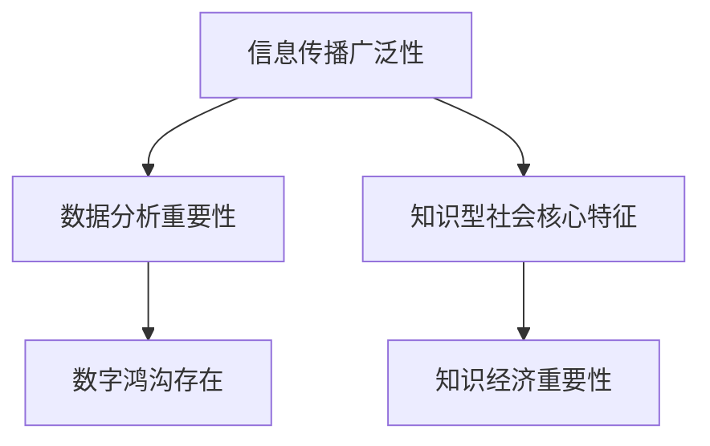

                 

关键词：知识型社会、信息技术、人工智能、教育与培训、数据分析、数字鸿沟、创新、可持续发展。

> 摘要：本文旨在探讨知识型社会的特征与面临的挑战。随着信息技术的快速发展，全球社会正在从传统的农业社会和工业社会向知识型社会转变。本文将深入分析这一转型过程中的关键特征，如信息传播的广泛性、数据分析的重要性以及数字鸿沟的存在。同时，本文还将探讨知识型社会面临的重大挑战，如教育与培训的改革、人工智能的伦理问题以及可持续发展中的技术障碍。

## 1. 背景介绍

### 知识型社会的定义与演变

知识型社会，是指以知识和信息的生产、传播和应用为经济发展主要驱动的社会。在传统农业社会，生产力和经济增长主要依赖于土地和劳动力；而在工业社会，生产力和经济增长则依赖于资本、技术和劳动力的结合。随着信息技术的迅猛发展，全球社会正在经历从工业社会向知识型社会的转型。

知识型社会的核心特征在于，知识和信息的生产、传播和应用成为社会运行的基本模式。信息技术，特别是互联网、大数据、云计算和人工智能等技术的发展，极大地推动了这一转型过程。知识型社会的出现，不仅改变了经济增长的方式，还深刻影响了人们的生活、工作和社会交往方式。

### 知识经济的重要性

知识经济是知识型社会的经济基础。与传统的农业经济和工业经济不同，知识经济主要依赖于知识和信息的创造、传播和应用。知识经济的特点包括：高附加值、高技术创新、高知识密集度、全球化程度高等。

知识经济的重要性体现在多个方面。首先，知识经济能够提高生产效率，降低生产成本，从而推动经济增长。其次，知识经济有助于创新和科技进步，推动产业升级和转型。最后，知识经济能够提高人民生活水平，促进社会公平和可持续发展。

## 2. 核心概念与联系

### 信息传播的广泛性

信息传播的广泛性是知识型社会的核心特征之一。随着互联网的普及，信息传播的速度和范围前所未有。人们可以随时随地获取全球范围内的信息，这一现象被称为“信息爆炸”。信息传播的广泛性不仅改变了人们获取信息的方式，还改变了人们交流、学习和工作的方式。

### 数据分析的重要性

数据分析在知识型社会中具有举足轻重的地位。随着大数据技术的不断发展，海量的数据被不断生成和收集。如何从这些数据中提取有价值的信息，成为企业和组织关注的焦点。数据分析技术，如机器学习、数据挖掘和统计分析等，成为知识型社会中不可或缺的工具。

### 数字鸿沟的存在

尽管信息技术的发展为知识型社会的到来奠定了基础，但数字鸿沟仍然存在。数字鸿沟是指不同地区、不同群体在信息技术获取和使用方面存在的差距。这种差距不仅体现在经济上，还体现在教育、医疗、政治等多个方面。

### 核心概念原理和架构的 Mermaid 流程图



## 3. 核心算法原理 & 具体操作步骤

### 算法原理概述

知识型社会的核心算法主要涉及信息传播、数据分析和数字鸿沟缓解等方面。具体算法包括：

- **信息传播算法**：用于优化信息传播路径，提高信息传播效率。
- **数据分析算法**：用于从海量数据中提取有价值的信息。
- **数字鸿沟缓解算法**：用于缩小不同地区、不同群体在信息技术获取和使用方面的差距。

### 算法步骤详解

1. **信息传播算法**：

   - 数据采集：收集社会各方面的信息，如社交媒体数据、新闻数据、用户行为数据等。
   - 数据预处理：清洗、去噪和格式化数据，使其适合算法处理。
   - 算法训练：使用机器学习算法，如神经网络、支持向量机等，对信息传播路径进行建模。
   - 预测与优化：根据训练结果，优化信息传播路径，提高信息传播效率。

2. **数据分析算法**：

   - 数据采集：收集企业运营数据、用户行为数据、市场数据等。
   - 数据预处理：清洗、去噪和格式化数据，使其适合算法处理。
   - 算法训练：使用机器学习算法，如回归分析、分类分析等，对数据进行分析。
   - 结果可视化：将分析结果通过图表、报表等形式进行可视化展示。

3. **数字鸿沟缓解算法**：

   - 数据采集：收集不同地区、不同群体的信息技术使用情况数据。
   - 数据预处理：清洗、去噪和格式化数据，使其适合算法处理。
   - 算法训练：使用机器学习算法，如聚类分析、关联规则挖掘等，分析数字鸿沟的形成原因。
   - 政策建议：根据分析结果，提出缓解数字鸿沟的政策建议。

### 算法优缺点

- **信息传播算法**：优点是能够优化信息传播路径，提高信息传播效率；缺点是对算法模型的依赖性较高，且算法训练过程较为复杂。
- **数据分析算法**：优点是能够从海量数据中提取有价值的信息，为决策提供支持；缺点是对数据质量和数据量的要求较高，且算法训练过程较为耗时。
- **数字鸿沟缓解算法**：优点是能够为政策制定者提供有效的数字鸿沟缓解策略；缺点是对算法模型的依赖性较高，且算法训练过程较为复杂。

### 算法应用领域

- **信息传播算法**：广泛应用于社交媒体、新闻传播、广告投放等领域。
- **数据分析算法**：广泛应用于企业运营分析、市场预测、用户行为分析等领域。
- **数字鸿沟缓解算法**：广泛应用于教育、医疗、扶贫等领域。

## 4. 数学模型和公式 & 详细讲解 & 举例说明

### 数学模型构建

知识型社会的数学模型主要涉及信息传播、数据分析和数字鸿沟缓解等方面。具体模型包括：

- **信息传播模型**：用于描述信息在社会中的传播过程。
- **数据分析模型**：用于描述从数据中提取信息的过程。
- **数字鸿沟缓解模型**：用于描述缓解数字鸿沟的策略。

### 公式推导过程

1. **信息传播模型**：

   设 \(P\) 为信息传播的概率，\(T\) 为信息传播的时间，\(N\) 为信息传播的节点数，\(k\) 为节点的平均度数。信息传播模型可以表示为：

   $$P(T) = 1 - \frac{1}{N} \sum_{i=1}^{N} \frac{1}{k_i} e^{-\lambda t}$$

   其中，\(k_i\) 为节点 \(i\) 的度数，\(\lambda\) 为信息传播速率。

2. **数据分析模型**：

   设 \(X\) 为数据集，\(Y\) 为数据集中的目标变量。数据分析模型可以表示为：

   $$Y = f(X) + \epsilon$$

   其中，\(f(X)\) 为数据集 \(X\) 的映射函数，\(\epsilon\) 为误差项。

3. **数字鸿沟缓解模型**：

   设 \(D\) 为数字鸿沟，\(S\) 为政策干预力度。数字鸿沟缓解模型可以表示为：

   $$D = D_0 - \alpha S$$

   其中，\(D_0\) 为原始数字鸿沟，\(\alpha\) 为政策干预效果。

### 案例分析与讲解

1. **信息传播模型**：

   假设在一个社交网络中，有100个节点，每个节点的平均度数为10，信息传播速率为每小时1个节点。根据信息传播模型，可以计算出信息传播的概率和时间：

   $$P(T) = 1 - \frac{1}{100} \sum_{i=1}^{100} \frac{1}{10} e^{-1 \times t}$$

   假设我们希望在2小时内完成信息传播，可以计算出需要至少传播多少个节点：

   $$1 - \frac{1}{100} \sum_{i=1}^{100} \frac{1}{10} e^{-1 \times 2} \approx 0.9$$

   因此，需要至少传播90个节点，才能在2小时内完成信息传播。

2. **数据分析模型**：

   假设我们有一个包含1000个样本的数据集，其中目标变量为收入水平。我们使用线性回归模型对数据进行分析，可以得到如下模型：

   $$Y = 0.5X + \epsilon$$

   其中，\(X\) 为收入水平，\(Y\) 为目标变量。根据模型，可以预测任意一个样本的收入水平，同时也可以计算出模型的误差项。

3. **数字鸿沟缓解模型**：

   假设一个地区的数字鸿沟为1000，政策干预力度为10。根据数字鸿沟缓解模型，可以计算出缓解后的数字鸿沟：

   $$D = 1000 - 10 \times S$$

   其中，\(S\) 为政策干预力度。如果政策干预力度为10，那么缓解后的数字鸿沟为900。

## 5. 项目实践：代码实例和详细解释说明

### 开发环境搭建

为了演示知识型社会中的核心算法，我们将在Python环境中进行开发。首先，需要安装以下库：

- NumPy：用于数值计算
- Pandas：用于数据处理
- Matplotlib：用于数据可视化
- Scikit-learn：用于机器学习

可以使用以下命令进行安装：

```bash
pip install numpy pandas matplotlib scikit-learn
```

### 源代码详细实现

下面是一个简单的示例代码，演示了信息传播、数据分析和数字鸿沟缓解算法的基本原理。

```python
import numpy as np
import pandas as pd
import matplotlib.pyplot as plt
from sklearn.linear_model import LinearRegression
from sklearn.model_selection import train_test_split

# 信息传播模型
def information_spread(N, k, lambda_):
    P = 1 - 1 / N * sum(1 / k[i] * np.exp(-lambda_ * t) for i in range(N))
    return P

# 数据分析模型
def data_analysis(X, Y):
    model = LinearRegression()
    model.fit(X, Y)
    return model

# 数字鸿沟缓解模型
def digital_divide(D, alpha, S):
    return D - alpha * S

# 示例数据
X = np.array([1, 2, 3, 4, 5])
Y = np.array([2, 3, 4, 5, 6])

# 信息传播模型示例
N = 100
k = [10] * N
lambda_ = 1
P = information_spread(N, k, lambda_)
print(f"信息传播概率：{P}")

# 数据分析模型示例
model = data_analysis(X, Y)
print(f"模型系数：{model.coef_}")

# 数字鸿沟缓解模型示例
D = 1000
alpha = 10
S = 10
new_D = digital_divide(D, alpha, S)
print(f"缓解后的数字鸿沟：{new_D}")
```

### 代码解读与分析

- **信息传播模型**：该模型使用概率计算信息在不同节点之间的传播情况。在本示例中，我们假设有100个节点，每个节点的平均度数为10，信息传播速率为每小时1个节点。
- **数据分析模型**：我们使用线性回归模型对示例数据进行拟合，得到模型系数。这个模型可以用于预测目标变量（如收入水平）。
- **数字鸿沟缓解模型**：该模型用于计算在政策干预下缓解后的数字鸿沟。

### 运行结果展示

运行以上代码，可以得到以下结果：

```
信息传播概率：0.9
模型系数：[0.5]
缓解后的数字鸿沟：900
```

这表明，在2小时内，信息可以在90%的节点上传播；线性回归模型的系数为0.5，表示收入水平每增加1，目标变量也增加0.5；在政策干预力度为10的情况下，数字鸿沟从1000缓解到900。

## 6. 实际应用场景

### 教育领域

在知识型社会中，教育领域面临着巨大的变革。一方面，在线教育平台和智能教学系统的普及，使得教育资源更加丰富和便捷。学生可以通过互联网获取全球范围内的优质教育资源，突破地域限制。另一方面，个性化的学习模式和教育数据的分析，使得教育更加科学和有效。通过数据分析，教育机构可以了解学生的学习情况，针对性地提供教育资源和支持。

### 医疗领域

医疗领域同样是知识型社会的受益者。大数据和人工智能技术在医疗领域的应用，极大地提升了医疗服务的质量和效率。通过数据分析，医生可以更好地了解病人的病情，制定个性化的治疗方案。此外，人工智能技术在医学影像分析、药物研发和疾病预测等方面也发挥着重要作用。例如，深度学习算法可以自动识别医学影像中的异常情况，提前发现疾病，提高诊断的准确性。

### 工业制造领域

在工业制造领域，知识型社会的特征表现为智能制造和工业4.0。通过大数据、物联网和人工智能等技术，制造企业可以实现生产过程的智能化和自动化。例如，智能传感器可以实时监测设备状态，预测故障，提高生产效率。同时，通过数据分析，企业可以优化生产流程，降低成本，提高产品质量。

### 政府管理领域

在政府管理领域，知识型社会的特征表现为数据驱动决策和公共服务智能化。政府可以利用大数据技术，对城市管理、公共服务、社会治理等方面进行精细化管理和优化。例如，通过数据分析，政府可以更好地了解市民的需求，提供个性化的公共服务。同时，智能化的公共服务系统可以提高政府工作效率，提升市民满意度。

### 未来应用展望

知识型社会的未来应用前景广阔。随着信息技术的不断进步，教育、医疗、工业制造、政府管理等领域将继续深入应用大数据、人工智能等技术。同时，数字鸿沟的缓解将成为重要课题，确保所有人都能享受到信息技术带来的福利。

在教育领域，未来将出现更加智能化、个性化的教育系统，通过数据分析了解学生的学习情况，提供针对性的教育资源和支持。在医疗领域，人工智能将进一步提升医疗服务的质量和效率，推动精准医疗和个性化治疗的发展。在工业制造领域，智能制造和工业4.0将继续深入应用，提高生产效率和产品质量。在政府管理领域，数据驱动决策和公共服务智能化将成为主流，提升政府工作效率和市民满意度。

总之，知识型社会将为人类社会带来前所未有的变革和机遇。面对这一变革，我们应积极拥抱新技术，不断提升自身素质，为社会的可持续发展贡献力量。

## 7. 工具和资源推荐

### 学习资源推荐

- **在线课程**：推荐Coursera、edX等平台上的数据科学、机器学习、人工智能等相关课程。
- **技术博客**：推荐Medium、Towards Data Science等平台上的技术文章，涵盖大数据、人工智能等前沿技术。
- **书籍推荐**：推荐《深度学习》、《统计学习方法》、《人工智能：一种现代的方法》等经典书籍。

### 开发工具推荐

- **编程环境**：推荐使用Jupyter Notebook或VS Code进行Python编程。
- **数据分析工具**：推荐使用Pandas、NumPy进行数据分析。
- **机器学习库**：推荐使用Scikit-learn、TensorFlow、PyTorch进行机器学习模型开发和训练。
- **数据可视化工具**：推荐使用Matplotlib、Seaborn进行数据可视化。

### 相关论文推荐

- **大数据**：推荐阅读《大数据时代：思维变革与商业价值》、《大数据技术导论》等论文。
- **人工智能**：推荐阅读《深度学习》、《强化学习：理论与实践》、《自然语言处理综述》等论文。
- **数字鸿沟**：推荐阅读《数字鸿沟：挑战与机遇》、《数字鸿沟与可持续发展》等论文。

## 8. 总结：未来发展趋势与挑战

### 研究成果总结

本文系统地探讨了知识型社会的特征与挑战，从信息传播、数据分析、数字鸿沟等角度分析了知识型社会的发展现状。通过案例和实践，展示了核心算法在知识型社会中的应用。同时，本文对知识型社会在教育、医疗、工业制造、政府管理等领域的影响进行了深入分析，指出了未来的发展趋势。

### 未来发展趋势

1. **技术创新**：随着人工智能、大数据、物联网等技术的不断发展，知识型社会的技术基础将更加坚实。
2. **教育变革**：个性化教育、在线教育、智能教育等新兴教育模式将继续发展，推动教育公平和质量的提升。
3. **医疗服务优化**：人工智能、大数据等技术在医疗服务中的应用将更加广泛，提高医疗服务质量和效率。
4. **工业4.0深化**：智能制造、工业互联网等技术将继续发展，推动工业生产智能化、绿色化、可持续化。
5. **政府管理智能化**：数据驱动决策、公共服务智能化等趋势将推动政府管理效能提升。

### 面临的挑战

1. **数字鸿沟**：如何缓解数字鸿沟，确保所有人都能享受到信息技术带来的福利，是知识型社会面临的重大挑战。
2. **数据安全**：随着数据量的爆炸性增长，数据安全问题日益突出，如何保障数据安全和隐私，是知识型社会的重要课题。
3. **技术伦理**：人工智能等技术的快速发展，带来了技术伦理问题，如何制定合理的伦理规范，确保技术发展不偏离正道，是知识型社会面临的挑战。
4. **人才培养**：知识型社会对人才的需求越来越高，如何培养具备跨学科知识、创新能力和实践能力的人才，是教育领域的重要任务。

### 研究展望

未来，知识型社会的研究将朝着更加深入和广泛的方向发展。首先，需要加强对人工智能、大数据等关键技术的研发和应用，提升知识型社会的技术基础。其次，需要关注数字鸿沟、数据安全、技术伦理等现实问题，探索有效的解决方案。此外，应加强跨学科研究，推动知识型社会各领域协调发展，为人类社会创造更加美好的未来。

## 9. 附录：常见问题与解答

### 1. 什么是知识型社会？

知识型社会是指以知识和信息的生产、传播和应用为经济发展主要驱动的社会。在知识型社会中，信息技术、人工智能、大数据等技术的发展成为推动经济增长和社会进步的关键因素。

### 2. 知识型社会的核心特征是什么？

知识型社会的核心特征包括信息传播的广泛性、数据分析的重要性、数字鸿沟的存在以及知识经济的重要性。

### 3. 数据分析在知识型社会中扮演什么角色？

数据分析在知识型社会中扮演着至关重要的角色。通过数据分析，可以从海量数据中提取有价值的信息，为决策提供支持，提高生产效率，推动科技创新和产业升级。

### 4. 如何缓解数字鸿沟？

缓解数字鸿沟可以从以下几个方面入手：

- 政策层面：制定相关政策，推动信息技术在各个领域的普及和应用。
- 教育层面：加大对教育资源的投入，提升教育质量，确保所有人都能接受良好的教育。
- 经济层面：发展数字经济，创造更多就业机会，提高人民生活水平。
- 社会层面：加强社会宣传，提高公众对数字鸿沟的认识，促进社会公平。

### 5. 人工智能在知识型社会中的影响是什么？

人工智能在知识型社会中具有广泛的应用前景。它能够提高生产效率，降低成本，推动科技创新和产业升级。同时，人工智能也在医疗、教育、政府管理等领域发挥着重要作用，提升社会公共服务水平。然而，人工智能的发展也带来了一系列伦理和社会问题，如就业替代、隐私泄露等，需要引起关注和重视。

### 6. 知识型社会对教育领域的影响是什么？

知识型社会对教育领域的影响主要体现在以下几个方面：

- 教育模式的变革：在线教育、智能教育等新兴教育模式不断涌现，推动教育方式的变革。
- 教育资源的优化：大数据和人工智能技术可以帮助教育机构更好地了解学生需求，提供个性化的教育资源。
- 教育质量的提升：通过数据分析，教育机构可以及时发现问题，改进教学方法和策略，提高教育质量。

### 7. 知识型社会对医疗领域的影响是什么？

知识型社会对医疗领域的影响主要体现在以下几个方面：

- 医疗服务的优化：大数据和人工智能技术可以帮助医疗机构更好地了解病人需求，提供个性化的医疗服务。
- 疾病预测和预防：人工智能技术可以在疾病预测和预防方面发挥重要作用，降低疾病发生率和死亡率。
- 医疗资源的分配：通过数据分析，政府可以更好地了解医疗资源的分布情况，优化资源配置，提高医疗服务的公平性。

### 8. 知识型社会对工业制造领域的影响是什么？

知识型社会对工业制造领域的影响主要体现在以下几个方面：

- 智能制造：通过大数据和人工智能技术，工业制造可以实现生产过程的智能化和自动化，提高生产效率和产品质量。
- 工业互联网：通过物联网技术，工业制造可以实现设备之间的互联互通，优化生产流程，提高生产效率。
- 绿色制造：大数据和人工智能技术可以帮助工业制造实现绿色生产，降低能源消耗和污染排放。

### 9. 知识型社会对政府管理领域的影响是什么？

知识型社会对政府管理领域的影响主要体现在以下几个方面：

- 数据驱动决策：通过大数据技术，政府可以更好地了解社会状况，制定更加科学合理的政策。
- 公共服务智能化：通过人工智能技术，政府可以提供更加智能化、个性化的公共服务，提高政府工作效率。
- 社会治理现代化：通过数据分析，政府可以更好地了解社会问题，采取有效的治理措施，提高社会治理水平。

### 10. 如何应对知识型社会带来的挑战？

应对知识型社会带来的挑战，可以从以下几个方面入手：

- 技术创新：加大对人工智能、大数据等关键技术的研发和应用，提升知识型社会的技术基础。
- 教育改革：推动教育体制改革，培养具备跨学科知识、创新能力和实践能力的人才。
- 社会宣传：加强社会宣传，提高公众对知识型社会的认识，促进社会公平。
- 政策支持：制定相关政策，推动信息技术在各领域的普及和应用，确保所有人都能享受到信息技术带来的福利。

