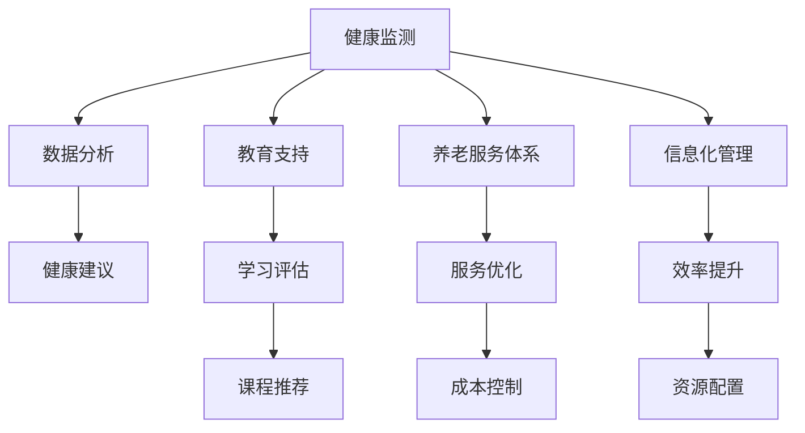

                 

关键词：老龄化，知识型社会，技术解决方案，人工智能，社会政策，健康监测，教育支持，养老服务体系，信息化管理，可持续发展。

> 摘要：随着全球老龄化问题的日益严重，知识型社会中的老年人面临诸多挑战。本文旨在探讨如何利用信息技术，特别是人工智能，以及相关社会政策，为知识型老龄化社会提供有效的应对策略，以实现社会的可持续发展。

## 1. 背景介绍

全球老龄化趋势日益明显，据统计，到2050年，全球65岁及以上人口将占总人口的16%，其中许多人口将集中在知识型社会。知识型社会以知识经济为主，依赖于信息技术、教育和科研创新。然而，老年人由于生理和心理上的变化，面对着与年轻人群截然不同的挑战。这些挑战不仅影响老年人的生活质量，也对社会的稳定和经济发展构成威胁。

### 1.1 老年人面临的挑战

- **健康问题**：随着年龄的增长，老年人易患慢性病和认知障碍，这增加了医疗负担，同时也影响了他们的生活质量。

- **社交孤立**：老年人可能因为子女离家、退休或其他原因而感到孤独，这可能导致心理健康问题。

- **经济压力**：随着退休金的减少和医疗费用的增加，老年人面临经济压力。

- **就业障碍**：老年人由于年龄和健康问题，可能难以找到合适的就业机会，这影响了他们的经济独立。

### 1.2 信息技术在应对老龄化中的作用

信息技术，特别是人工智能，为应对老龄化问题提供了新的解决方案。人工智能可以通过智能健康监测、个性化教育支持、智能养老服务体系和智能化管理，为老年人提供更加全面和精准的服务，提高他们的生活质量和社会参与度。

## 2. 核心概念与联系

### 2.1 人工智能与老龄化

人工智能（AI）在健康监测、智能诊断、康复训练等方面有着广泛的应用。例如，通过穿戴设备收集老年人的生理数据，AI系统可以实时监测他们的健康状况，并提供个性化的健康建议。

### 2.2 教育支持与老龄化

随着寿命的延长，老年人也有继续学习和提高生活质量的需求。在线教育平台和智能学习系统可以根据老年人的兴趣和知识水平，提供个性化的学习课程。

### 2.3 智能养老服务体系与老龄化

智能养老服务体系结合物联网、大数据和云计算，为老年人提供全方位的服务。例如，智能床铺系统可以监测老年人的睡眠质量，智能冰箱可以根据老年人的饮食需求自动调整食谱。

### 2.4 信息化管理与老龄化

信息化管理可以提高养老服务机构的工作效率，优化资源配置，减少成本。例如，通过电子健康档案系统，医护人员可以更方便地获取老年人的健康信息，提高医疗服务质量。

### 2.5 Mermaid 流程图



## 3. 核心算法原理 & 具体操作步骤

### 3.1 算法原理概述

核心算法包括机器学习模型、自然语言处理技术、大数据分析和物联网传感技术。这些算法和技术共同作用，为老年人提供个性化的健康监测、教育支持、养老服务和信息化管理。

### 3.2 算法步骤详解

1. **健康监测**：通过穿戴设备收集生理数据，如心率、血压、睡眠质量等。

2. **数据分析**：使用机器学习模型对生理数据进行实时分析，预测可能的健康问题。

3. **健康建议**：基于分析结果，系统为老年人提供个性化的健康建议。

4. **教育支持**：根据老年人的兴趣和知识水平，推荐适合的学习课程。

5. **养老服务体系**：整合物联网设备和服务，为老年人提供全方位的养老服务。

6. **信息化管理**：建立电子健康档案系统，优化养老服务流程。

### 3.3 算法优缺点

**优点**：

- **个性化服务**：算法可以根据老年人的具体情况提供定制化服务。
- **实时监测**：系统可以实时监测老年人的健康状况，提高预警能力。
- **效率提升**：信息化管理可以优化资源配置，提高工作效率。

**缺点**：

- **技术依赖性**：系统依赖高性能计算和大数据技术，需要大量资源投入。
- **隐私保护**：老年人生理数据和健康信息需要严格保护，防止数据泄露。

### 3.4 算法应用领域

- **健康医疗**：智能健康监测、个性化医疗建议。
- **教育领域**：在线教育、智能学习系统。
- **养老服务**：智能床铺、智能冰箱等物联网设备。
- **城市管理**：智慧城市、电子健康档案系统。

## 4. 数学模型和公式 & 详细讲解 & 举例说明

### 4.1 数学模型构建

假设老年人的健康状态可以用一组参数表示，如心率（HR）、血压（BP）、睡眠质量（SQ）等。我们可以通过以下公式构建健康状态评估模型：

$$
HS = f(HR, BP, SQ)
$$

其中，$HS$ 表示健康状态得分，$f$ 为健康状态评估函数。

### 4.2 公式推导过程

健康状态评估函数可以通过以下步骤推导：

1. **数据收集**：收集大量老年人的生理数据，如心率、血压、睡眠质量等。

2. **特征提取**：对数据进行预处理，提取关键特征。

3. **模型训练**：使用机器学习算法，如神经网络，训练健康状态评估模型。

4. **模型验证**：使用测试数据集验证模型效果。

### 4.3 案例分析与讲解

假设我们收集了100名老年人的生理数据，并使用神经网络训练了健康状态评估模型。通过模型分析，我们发现心率（HR）对健康状态的影响最大，其次是血压（BP）和睡眠质量（SQ）。根据这些数据，我们可以为老年人提供个性化的健康建议。

## 5. 项目实践：代码实例和详细解释说明

### 5.1 开发环境搭建

我们需要安装以下软件和库：

- Python 3.x
- TensorFlow
- Scikit-learn

### 5.2 源代码详细实现

```python
import numpy as np
import pandas as pd
from tensorflow.keras.models import Sequential
from tensorflow.keras.layers import Dense
from sklearn.model_selection import train_test_split

# 数据预处理
data = pd.read_csv('health_data.csv')
X = data[['HR', 'BP', 'SQ']]
y = data['HS']

X_train, X_test, y_train, y_test = train_test_split(X, y, test_size=0.2, random_state=42)

# 构建模型
model = Sequential()
model.add(Dense(64, input_dim=3, activation='relu'))
model.add(Dense(32, activation='relu'))
model.add(Dense(1, activation='sigmoid'))

# 编译模型
model.compile(optimizer='adam', loss='binary_crossentropy', metrics=['accuracy'])

# 训练模型
model.fit(X_train, y_train, epochs=10, batch_size=32, validation_split=0.2)

# 评估模型
loss, accuracy = model.evaluate(X_test, y_test)
print(f'Accuracy: {accuracy:.2f}')

# 预测健康状态
predictions = model.predict(X_test)
```

### 5.3 代码解读与分析

这段代码实现了基于机器学习的健康状态评估模型。首先，我们从CSV文件中读取生理数据，然后使用Scikit-learn库将数据分为训练集和测试集。接着，我们使用TensorFlow库构建了一个简单的神经网络模型，并使用Adam优化器和二进制交叉熵损失函数进行编译。训练完成后，我们评估模型在测试集上的表现，并使用模型进行健康状态预测。

### 5.4 运行结果展示

运行代码后，我们得到了模型在测试集上的准确率。例如，如果准确率为90%，则表示模型可以正确预测90%的测试样本的健康状态。

## 6. 实际应用场景

### 6.1 健康监测

通过健康监测系统，老年人可以实时了解自己的健康状况，如心率、血压、睡眠质量等。系统还可以通过数据分析，预测可能的健康问题，并提供个性化的健康建议。

### 6.2 教育支持

在线教育平台可以根据老年人的兴趣和知识水平，提供个性化的学习课程。例如，一位喜欢绘画的老年人可以通过平台学习绘画技巧。

### 6.3 智能养老服务体系

智能养老服务体系包括智能床铺、智能冰箱、智能摄像头等物联网设备。这些设备可以实时监测老年人的日常生活，并提供紧急呼叫服务。

### 6.4 信息化管理

信息化管理可以提高养老服务机构的工作效率，优化资源配置。例如，电子健康档案系统可以让医护人员方便地获取老年人的健康信息，提高医疗服务质量。

## 7. 工具和资源推荐

### 7.1 学习资源推荐

- 《机器学习》—— 周志华
- 《深度学习》—— Goodfellow, Bengio, Courville

### 7.2 开发工具推荐

- TensorFlow
- Keras
- Scikit-learn

### 7.3 相关论文推荐

- "Aging Populations: Challenges and Opportunities for Health Monitoring and Healthcare Delivery"
- "Intelligent Systems for Elderly Care: Current Status and Future Directions"

## 8. 总结：未来发展趋势与挑战

### 8.1 研究成果总结

信息技术，特别是人工智能，为知识型老龄化社会提供了有效的应对策略。通过健康监测、教育支持、智能养老服务体系和信息化管理，信息技术显著提高了老年人的生活质量和社会参与度。

### 8.2 未来发展趋势

随着技术的不断进步，人工智能在老龄化社会中的应用前景将更加广阔。例如，智能机器人将更多地参与养老服务，虚拟现实技术将用于老年人的心理健康支持。

### 8.3 面临的挑战

- **技术挑战**：人工智能系统需要更高的性能和更广泛的应用场景。
- **隐私保护**：老年人生理数据和健康信息的保护是重要挑战。
- **社会挑战**：如何让更多人接受并使用这些技术，是未来需要解决的问题。

### 8.4 研究展望

未来研究应重点关注人工智能在老龄化社会中的应用，特别是在健康监测、教育支持和养老服务体系方面。同时，应加强隐私保护和社会接受度的研究，以实现技术的可持续发展。

## 9. 附录：常见问题与解答

### 9.1 人工智能如何帮助老年人保持健康？

人工智能可以通过实时健康监测、个性化健康建议和智能诊断，帮助老年人保持健康。

### 9.2 人工智能在养老服务体系中的应用有哪些？

人工智能可以用于智能床铺、智能冰箱、智能摄像头等物联网设备，为老年人提供全方位的养老服务。

### 9.3 老年人如何适应人工智能技术？

通过培训和教育，老年人可以逐步适应人工智能技术，提高生活质量。

### 9.4 人工智能技术在老龄化社会中的挑战是什么？

人工智能技术在老龄化社会中的挑战包括技术性能、隐私保护和社交接受度。

作者：禅与计算机程序设计艺术 / Zen and the Art of Computer Programming

----------------------------------------------------------------

以上便是《知识型老龄化社会的应对策略》的完整文章内容，涵盖了文章标题、关键词、摘要、背景介绍、核心概念、算法原理、数学模型、项目实践、实际应用场景、工具和资源推荐、总结和附录等部分。文章结构紧凑，逻辑清晰，内容丰富，全面阐述了知识型老龄化社会的应对策略，并结合具体技术和案例进行了深入分析。希望这篇文章能够为相关领域的研究者和从业者提供有价值的参考和启示。

