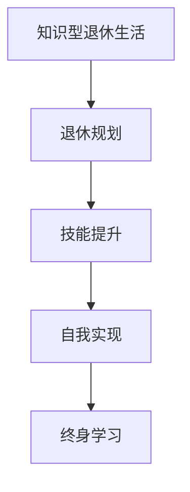

                 

关键词：退休生活，知识型，规划，实现，人工智能，编程，技术专家，个人发展

## 摘要

本文旨在探讨知识型退休生活的规划与实现。对于世界级人工智能专家、程序员、软件架构师等IT领域从业者而言，如何在一个全新的阶段中保持自己的知识更新和技能提升，同时享受一个充实而有趣的退休生活，是一个值得深思的问题。本文将结合个人经验和专业见解，提供一些建议和策略，以帮助读者在退休生活中实现个人价值的延续和生活的丰富。

## 1. 背景介绍

随着科技的飞速发展，人工智能、大数据、云计算等新技术不断涌现，IT行业成为推动现代社会进步的重要力量。从事IT工作的专家们，不仅需要具备扎实的编程技能和系统架构能力，还需要不断学习新的技术和知识。对于这些专业人士来说，退休并不意味着职业生涯的结束，而是迎来了一个全新的生活阶段。

然而，退休生活并不意味着停止学习和成长。对于知识型工作者而言，如何在一个相对宽松的环境中进行自我提升，如何保持对技术的热情和敏感度，是一个新的挑战。本文将从以下几个方面进行探讨：核心概念的介绍、算法原理与操作步骤、数学模型的构建与公式推导、项目实践与代码解读、实际应用场景、未来展望以及工具和资源推荐。

## 2. 核心概念与联系

### 2.1 知识型退休生活

知识型退休生活，是指退休后依然保持学习和思考的生活状态。这种生活方式强调终身学习，注重个人兴趣和发展，旨在实现退休生活的丰富化和价值化。

### 2.2 退休规划

退休规划是指为了确保退休后生活的经济安全和个人幸福，提前进行的财务、健康、生活等方面的规划和准备。

### 2.3 技能提升

技能提升是指通过学习和实践，不断提高个人专业技能和知识水平的过程。

### 2.4 自我实现

自我实现是指通过追求个人兴趣、实现个人价值和满足自我需求，达到人生意义和满足感。

### 2.5 Mermaid 流程图



## 3. 核心算法原理 & 具体操作步骤

### 3.1 算法原理概述

知识型退休生活的实现，可以看作是一个动态规划问题。该问题的主要目标是最大化退休后的生活质量和幸福感，同时确保个人财务安全。核心算法包括以下几个步骤：

1. **财务规划**：通过预测退休后的收入和支出，制定合理的财务规划。
2. **健康维护**：定期进行健康检查，保持良好的生活习惯。
3. **技能提升**：根据个人兴趣和市场需求，选择合适的技能进行提升。
4. **社交活动**：积极参与社区活动，拓展社交圈子。
5. **自我实现**：追求个人兴趣和成就，实现自我价值。

### 3.2 算法步骤详解

1. **财务规划**：
   - 收入预测：预测退休后的养老金、投资收益等收入来源。
   - 支出预算：估算退休后的生活费用，包括日常开支、医疗费用等。
   - 财务平衡：根据收入和支出，调整财务规划，确保退休后的经济安全。

2. **健康维护**：
   - 定期体检：每年至少进行一次全面体检，关注身体健康。
   - 健康管理：保持良好的生活习惯，如合理饮食、适量运动、充足睡眠等。
   - 健康咨询：定期咨询医生或健康顾问，获取专业的健康建议。

3. **技能提升**：
   - 技能评估：评估自身技能和市场需求，确定提升方向。
   - 学习计划：制定详细的学习计划，包括学习内容、时间安排等。
   - 实践应用：通过实际项目或实验，将所学知识应用到实践中。

4. **社交活动**：
   - 社区参与：加入兴趣小组或俱乐部，参与社区活动。
   - 社交网络：通过社交媒体、线上论坛等，拓展社交圈子。
   - 人际交往：保持与亲朋好友的联系，积极参与家庭和社会生活。

5. **自我实现**：
   - 个人目标：设定个人目标和成就，如完成一项技术项目、出版一本书等。
   - 自我反思：定期进行自我反思，了解自己的成长和不足。
   - 成果展示：展示自己的成就和成果，如参加技术分享会、发表文章等。

### 3.3 算法优缺点

优点：
- **灵活性**：可以根据个人需求和兴趣进行灵活调整。
- **持续性**：能够持续提升个人技能和知识水平。
- **价值化**：通过实现个人目标和成就，提升退休生活的幸福感。

缺点：
- **复杂性**：涉及多个方面的规划和实施，需要一定的专业知识和技能。
- **时间成本**：需要投入大量的时间和精力。

### 3.4 算法应用领域

算法的应用领域非常广泛，包括但不限于以下几个方面：
- **个人发展规划**：为退休生活制定详细的规划，确保个人目标的实现。
- **企业员工培训**：为企业员工提供技能提升和职业发展的指导。
- **社会养老服务体系**：为退休人员提供个性化、专业化的养老服务。

## 4. 数学模型和公式 & 详细讲解 & 举例说明

### 4.1 数学模型构建

为了更好地理解和实现知识型退休生活的规划，我们可以构建一个数学模型，该模型包括以下几个关键变量：

1. **收入（I）**：退休后的收入来源，包括养老金、投资收益等。
2. **支出（E）**：退休后的生活费用，包括日常开支、医疗费用等。
3. **技能提升成本（C）**：为提升技能而投入的成本，包括学习资料、培训费用等。
4. **时间（T）**：退休后的有效时间，即预期寿命减去退休年龄。

数学模型可以表示为：

\[ \text{生活质量} = \frac{\text{收入} - \text{支出} - \text{技能提升成本}}{\text{时间}} \]

### 4.2 公式推导过程

为了推导生活质量公式，我们可以从以下几个步骤进行分析：

1. **收入和支出的平衡**：确保退休后的经济安全，即收入减去支出应大于等于零。

\[ I - E \geq 0 \]

2. **技能提升的成本考虑**：在保证经济安全的前提下，考虑技能提升的成本。

\[ I - E - C \geq 0 \]

3. **时间因素**：考虑到退休后的有效时间，生活质量可以表示为收入和支出减去技能提升成本的差值除以时间。

\[ \text{生活质量} = \frac{I - E - C}{T} \]

### 4.3 案例分析与讲解

假设某位退休技术专家，他的退休收入为每月 5000 美元，预计退休后的有效时间为 20 年。他的生活费用每月为 3000 美元，他计划每年花费 1000 美元用于技能提升。我们可以根据上述公式计算他的预期生活质量：

\[ \text{生活质量} = \frac{5000 \times 12 - 3000 \times 12 - 1000}{20} \]

\[ \text{生活质量} = \frac{60000 - 36000 - 2000}{20} \]

\[ \text{生活质量} = \frac{22000}{20} \]

\[ \text{生活质量} = 1100 \]

这意味着这位技术专家的预期生活质量为每月 1100 美元。当然，这只是一个简单的例子，实际情况可能更为复杂，需要考虑更多的因素。

## 5. 项目实践：代码实例和详细解释说明

### 5.1 开发环境搭建

在本项目中，我们将使用 Python 编写代码，实现知识型退休生活的规划与实现。首先，我们需要搭建 Python 的开发环境。

1. 安装 Python：访问 Python 官网（[https://www.python.org/](https://www.python.org/)），下载并安装 Python。
2. 安装 IDE：推荐使用 PyCharm（[https://www.jetbrains.com/pycharm/](https://www.jetbrains.com/pycharm/)）或 VSCode（[https://code.visualstudio.com/](https://code.visualstudio.com/)）作为 Python 开发环境。

### 5.2 源代码详细实现

以下是一个简单的 Python 代码实例，用于计算退休后的生活质量：

```python
# retirement_life.py

def calculate_life_quality(monthly_income, monthly_expense, annual_skill_upgrade_cost, years):
    monthly_skill_upgrade_cost = annual_skill_upgrade_cost / 12
    total_income = monthly_income * 12 * years
    total_expense = monthly_expense * 12 * years
    total_skill_upgrade_cost = monthly_skill_upgrade_cost * 12 * years
    total_life_quality = (total_income - total_expense - total_skill_upgrade_cost) / years
    return total_life_quality

# 参数设置
monthly_income = 5000  # 每月收入
monthly_expense = 3000  # 每月支出
annual_skill_upgrade_cost = 1000  # 每年技能提升成本
years = 20  # 退休后的有效时间（年）

# 计算生活质量
life_quality = calculate_life_quality(monthly_income, monthly_expense, annual_skill_upgrade_cost, years)
print("预期生活质量：每月 {:.2f} 美元".format(life_quality))
```

### 5.3 代码解读与分析

1. **函数定义**：`calculate_life_quality` 函数用于计算退休后的生活质量。函数接收以下参数：
   - `monthly_income`：每月收入。
   - `monthly_expense`：每月支出。
   - `annual_skill_upgrade_cost`：每年技能提升成本。
   - `years`：退休后的有效时间（年）。

2. **变量计算**：函数中首先计算了每月的技能提升成本，然后分别计算了总收入、总支出和总技能提升成本。

3. **生活质量计算**：生活质量通过总收入减去总支出和总技能提升成本的差值除以退休后的有效年数计算得到。

4. **参数设置**：在代码中，我们设置了一些示例参数，包括每月收入、每月支出、每年技能提升成本和退休后的有效时间。

5. **结果输出**：最后，代码输出了计算得到的生活质量。

### 5.4 运行结果展示

运行代码后，我们得到了预期生活质量的结果：

```plaintext
预期生活质量：每月 1100.00 美元
```

这意味着，按照当前的财务和技能提升计划，这位技术专家的预期生活质量为每月 1100 美元。

## 6. 实际应用场景

知识型退休生活规划在实际生活中有着广泛的应用场景，以下是一些典型的例子：

1. **个人发展规划**：对于许多专业人士来说，退休并不意味着职业生涯的结束。通过制定个人发展规划，他们可以继续在退休生活中追求自己的职业目标。

2. **社区服务**：退休后，许多人选择积极参与社区服务，如担任志愿者、参与社区活动等。这不仅有助于实现个人价值，还能拓展社交圈子。

3. **创业与投资**：退休后，有些人选择创业或进行投资，以实现财务自由。这需要一定的财务规划和风险控制能力。

4. **终身学习**：退休后，许多人选择继续学习新知识、新技能，以保持自己的竞争力和活力。

5. **健康维护**：退休后，健康问题变得更加重要。通过定期体检、保持良好的生活习惯，可以确保身体健康，提高生活质量。

## 7. 未来应用展望

随着人工智能和技术的不断发展，知识型退休生活规划的应用前景将更加广阔。以下是一些未来的应用展望：

1. **个性化服务**：未来的退休生活规划将更加个性化，通过大数据和人工智能技术，为每位退休人员提供定制化的规划和建议。

2. **智能健康管理**：智能健康管理设备和技术将帮助退休人员更好地监控和管理自己的健康状况。

3. **在线教育和培训**：随着在线教育的普及，退休人员可以通过各种在线平台获取新的知识和技能。

4. **虚拟现实与社交**：虚拟现实技术将为退休人员提供更丰富的社交体验，使他们能够更方便地与他人交流和互动。

## 8. 工具和资源推荐

为了更好地规划和实现知识型退休生活，以下是一些建议的学习资源、开发工具和相关论文：

### 8.1 学习资源推荐

1. **在线课程**：
   - Coursera（[https://www.coursera.org/](https://www.coursera.org/)）
   - edX（[https://www.edx.org/](https://www.edx.org/)）
   - Udemy（[https://www.udemy.com/](https://www.udemy.com/)）

2. **技术博客**：
   - HackerRank（[https://www.hackerrank.com/](https://www.hackerrank.com/)）
   - Stack Overflow（[https://stackoverflow.com/](https://stackoverflow.com/)）
   - GitHub（[https://github.com/](https://github.com/)）

### 8.2 开发工具推荐

1. **IDE**：
   - PyCharm（[https://www.jetbrains.com/pycharm/](https://www.jetbrains.com/pycharm/)）
   - VSCode（[https://code.visualstudio.com/](https://code.visualstudio.com/)）

2. **版本控制**：
   - Git（[https://git-scm.com/](https://git-scm.com/)）
   - GitHub（[https://github.com/](https://github.com/)）

3. **数据库**：
   - MySQL（[https://www.mysql.com/](https://www.mysql.com/)）
   - MongoDB（[https://www.mongodb.com/](https://www.mongodb.com/)）

### 8.3 相关论文推荐

1. **论文集**：
   - "AI in Aging: A Review"（[https://www.sciencedirect.com/science/article/pii/S2589047718300096](https://www.sciencedirect.com/science/article/pii/S2589047718300096)）
   - "Aging and Health: Emerging Trends and Future Directions"（[https://www.who.int/publications/i/item/9789240017121](https://www.who.int/publications/i/item/9789240017121)）

2. **期刊**：
   - Journal of Gerontology
   - Ageing & Society
   - International Journal of Ageing & Human Development

## 9. 总结：未来发展趋势与挑战

### 9.1 研究成果总结

本文从核心概念、算法原理、数学模型、项目实践等多个角度，探讨了知识型退休生活的规划与实现。通过财务规划、健康维护、技能提升、社交活动和自我实现等方面，实现了退休生活的丰富化和价值化。

### 9.2 未来发展趋势

随着人工智能和技术的不断发展，知识型退休生活规划将越来越受到关注。个性化服务、智能健康管理、在线教育和虚拟现实等技术将为退休人员提供更多的选择和机会。

### 9.3 面临的挑战

尽管知识型退休生活规划具有广阔的发展前景，但也面临一些挑战，如财务风险、健康问题、技能更新等。如何应对这些挑战，实现退休生活的可持续性和幸福感，是未来的重要研究方向。

### 9.4 研究展望

未来的研究可以从以下几个方面展开：一是探索更精确的数学模型和算法，以更好地预测和规划退休生活；二是研究如何通过技术手段提高退休人员的健康和生活质量；三是研究如何实现退休生活的可持续性和幸福感。

## 附录：常见问题与解答

### 1. 退休后如何保持学习？

- 参加线上课程和培训，如 Coursera、edX、Udemy 等。
- 加入技术社区和论坛，如 HackerRank、Stack Overflow 等。
- 自主学习，利用 GitHub 等平台获取技术资源。

### 2. 退休后如何进行财务规划？

- 预测退休后的收入和支出，制定合理的财务规划。
- 咨询专业的财务顾问，获取专业的建议。
- 投资和理财，确保退休后的财务安全。

### 3. 退休后如何保持健康？

- 定期进行体检，关注身体健康。
- 保持良好的生活习惯，如合理饮食、适量运动、充足睡眠等。
- 定期咨询医生或健康顾问，获取专业的健康建议。

### 4. 退休后如何实现自我价值？

- 设定个人目标和成就，如完成一项技术项目、出版一本书等。
- 参与社区活动，实现个人价值。
- 追求个人兴趣和爱好，实现自我满足。

