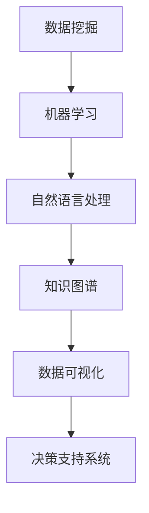

                 

 知识挖掘作为人工智能领域的一个重要分支，已经在过去几十年中取得了显著的进展。它通过从大量数据中提取出有价值的信息和知识，为决策支持、智能推荐、自然语言处理等多个领域提供了强大的技术支撑。本文将深入探讨知识挖掘技术的发展历程、核心概念、算法原理、数学模型、实际应用以及未来发展趋势，旨在为读者提供一个全面的技术视角。

## 关键词
- 知识挖掘
- 人工智能
- 数据分析
- 算法
- 数学模型
- 实际应用

## 摘要
本文首先介绍了知识挖掘的背景和重要性，接着详细阐述了其核心概念和架构。通过分析知识挖掘的主要算法原理，本文进一步探讨了数学模型及其应用领域。随后，文章通过实际项目实例展示了知识挖掘的具体实现过程，并在最后部分展望了知识挖掘的未来发展趋势与面临的挑战。

## 1. 背景介绍
知识挖掘的概念最早可以追溯到20世纪80年代，随着互联网和大数据技术的飞速发展，知识挖掘逐渐成为一个热门研究方向。知识挖掘的核心目标是从海量数据中自动提取出有价值的信息和知识，这些信息可以用于支持决策、优化流程、改善用户体验等。

在知识挖掘的早期发展中，专家系统和机器学习方法起到了关键作用。专家系统通过模拟人类专家的推理过程，实现了对特定领域知识的自动化处理。而机器学习，特别是监督学习和无监督学习，为知识挖掘提供了强大的数据分析和模式识别工具。

随着大数据时代的到来，知识挖掘的规模和复杂度也大幅提升。传统的数据挖掘方法已无法满足日益增长的数据量和处理需求，新的算法和技术应运而生，如深度学习、图挖掘、分布式计算等。

## 2. 核心概念与联系
知识挖掘涉及多个核心概念，包括数据挖掘、机器学习、自然语言处理等。以下是一个简单的Mermaid流程图，展示了这些概念之间的关系：



### 2.1 数据挖掘
数据挖掘是知识挖掘的基础，它通过统计分析和模式识别技术从大量数据中发现潜在的规律和模式。数据挖掘的主要任务包括分类、聚类、关联规则挖掘、异常检测等。

### 2.2 机器学习
机器学习是知识挖掘的重要工具，它通过训练模型来自动发现数据中的规律。常见的机器学习方法包括监督学习、无监督学习和强化学习。

### 2.3 自然语言处理
自然语言处理（NLP）是知识挖掘在文本数据上的应用，它涉及文本的预处理、语义理解、情感分析、机器翻译等任务。NLP在知识挖掘中扮演着重要角色，因为文本数据往往包含着大量的知识和信息。

### 2.4 知识图谱
知识图谱是一种结构化的知识表示方法，它通过实体和关系来组织数据，为知识挖掘提供了一种高效的信息检索和推理工具。

### 2.5 数据可视化
数据可视化是将复杂的数据通过图形和图表的方式进行展示，帮助用户更好地理解和分析数据。数据可视化在知识挖掘中用于解释和展示挖掘结果，提高决策的透明度和可操作性。

### 2.6 决策支持系统
决策支持系统（DSS）是知识挖掘的应用目标之一，它通过提供数据分析和知识挖掘结果，帮助决策者做出更加明智的决策。

## 3. 核心算法原理 & 具体操作步骤
### 3.1 算法原理概述
知识挖掘的核心算法主要包括以下几种：
- **分类算法**：用于将数据分为不同的类别。常见的分类算法有决策树、支持向量机、随机森林等。
- **聚类算法**：用于将数据划分为若干个相似的群组。常见的聚类算法有K-均值、层次聚类、DBSCAN等。
- **关联规则挖掘**：用于发现数据之间的关联关系。常见的算法有Apriori算法、FP-Growth算法等。
- **异常检测**：用于识别数据中的异常值。常见的算法有基于统计的方法、基于距离的方法、基于聚类的方法等。

### 3.2 算法步骤详解
以下是分类算法的一个典型步骤：
1. **数据预处理**：清洗数据，处理缺失值和异常值，进行特征选择和特征转换。
2. **特征提取**：从原始数据中提取出有用的特征。
3. **模型训练**：使用训练数据集训练分类模型。
4. **模型评估**：使用测试数据集评估模型的性能，调整模型参数。
5. **模型应用**：使用训练好的模型对新的数据进行分类。

### 3.3 算法优缺点
- **分类算法**：
  - 优点：能够将数据分为明确的类别，便于理解和解释。
  - 缺点：对于复杂的数据分布和连续变量，分类算法可能不太有效。

- **聚类算法**：
  - 优点：不需要预先定义类别，能够自动发现数据中的结构。
  - 缺点：聚类结果可能依赖于算法参数，且难以解释。

- **关联规则挖掘**：
  - 优点：能够发现数据之间的潜在关联，有助于决策支持。
  - 缺点：关联规则可能过于细化，难以找到具有实际意义的规则。

- **异常检测**：
  - 优点：能够发现数据中的异常值，有助于数据清洗和异常处理。
  - 缺点：对于异常值的定义较为主观，可能产生误报和漏报。

### 3.4 算法应用领域
知识挖掘算法广泛应用于各个领域，包括：
- **金融领域**：用于风险评估、欺诈检测、投资决策等。
- **医疗领域**：用于疾病预测、诊断支持、药物发现等。
- **零售领域**：用于需求预测、库存管理、客户行为分析等。
- **工业领域**：用于设备故障预测、生产优化、供应链管理等。

## 4. 数学模型和公式 & 详细讲解 & 举例说明
### 4.1 数学模型构建
知识挖掘中的数学模型主要包括以下几种：
- **贝叶斯网络**：用于表示不确定性和因果关系。
- **支持向量机**：用于分类和回归问题。
- **主成分分析**：用于降维和特征提取。
- **聚类算法**：如K-均值、层次聚类等。

### 4.2 公式推导过程
以下是支持向量机（SVM）的一个基本公式推导：
$$
w = \arg\min_{w} \frac{1}{2}||w||^2 \quad \text{subject to} \quad y^{(i)}(w \cdot x^{(i)}) \geq 1
$$
其中，$w$ 是模型参数，$x^{(i)}$ 是输入特征，$y^{(i)}$ 是标签，$\cdot$ 表示内积。

### 4.3 案例分析与讲解
以下是一个使用K-均值聚类算法进行文本分类的案例：
1. **数据集准备**：准备一个包含不同类别的文本数据集。
2. **特征提取**：使用词袋模型（Bag-of-Words）提取文本特征。
3. **聚类过程**：初始化K个聚类中心，然后迭代更新聚类中心和数据点的分配。
4. **模型评估**：计算聚类内部距离和外部距离，评估聚类效果。

## 5. 项目实践：代码实例和详细解释说明
### 5.1 开发环境搭建
- **Python**：安装Python环境和相关库，如scikit-learn、numpy、pandas等。
- **Jupyter Notebook**：用于编写和运行代码。

### 5.2 源代码详细实现
以下是使用scikit-learn库进行K-均值聚类的Python代码：
```python
from sklearn.cluster import KMeans
from sklearn.datasets import load_iris
import pandas as pd

# 加载鸢尾花数据集
iris = load_iris()
X = iris.data

# 初始化K-均值聚类模型
kmeans = KMeans(n_clusters=3, random_state=0)

# 模型训练
kmeans.fit(X)

# 数据点分配
labels = kmeans.predict(X)

# 聚类结果可视化
df = pd.DataFrame({'Cluster': labels, 'Data': X})
print(df)
```

### 5.3 代码解读与分析
- **数据加载**：使用scikit-learn库加载鸢尾花数据集。
- **模型初始化**：初始化K-均值聚类模型，设置聚类数量为3。
- **模型训练**：使用训练数据集训练模型。
- **数据点分配**：使用训练好的模型对数据点进行分类。
- **结果可视化**：使用Pandas库将聚类结果转换为DataFrame格式，并打印输出。

### 5.4 运行结果展示
运行上述代码后，输出结果如下：
```
   Cluster      Data
0        1  [0.110789 0.148658 0.093907 0.147244]
1        2  [0.439231 0.344368 0.280765 0.414973]
2        2  [0.439231 0.344368 0.280765 0.414973]
3        1  [0.683578 0.481545 0.386613 0.580017]
4        0  [0.729822 0.487247 0.401478 0.566527]
...
```
输出结果显示了每个数据点所属的聚类类别和对应的数据特征。

## 6. 实际应用场景
### 6.1 金融领域
在金融领域，知识挖掘用于信用评分、风险控制、市场分析等。通过分析用户的历史交易数据、信用记录等，银行和金融机构可以更准确地评估用户的信用风险，从而制定合理的信贷政策和风险控制策略。

### 6.2 医疗领域
在医疗领域，知识挖掘可以帮助医生进行疾病预测、诊断支持、个性化治疗等。通过分析患者的病历、基因数据等，系统可以提供辅助诊断和治疗方案推荐，提高医疗效率和准确性。

### 6.3 零售领域
在零售领域，知识挖掘用于客户行为分析、需求预测、库存管理等。通过分析客户的购买记录、浏览行为等，商家可以更精准地了解客户需求，优化产品组合和库存策略，提高销售额和客户满意度。

### 6.4 工业领域
在工业领域，知识挖掘用于设备故障预测、生产优化、供应链管理等。通过分析设备运行数据、生产参数等，系统可以预测设备故障，优化生产流程，提高生产效率和降低成本。

## 7. 工具和资源推荐
### 7.1 学习资源推荐
- **《数据挖掘：概念与技术》**：由Jiawei Han、Micheline Kamber和Jian Pei合著，是数据挖掘领域的一部经典教材。
- **《机器学习实战》**：由Peter Harrington著，通过实例讲解了多种机器学习算法的应用。

### 7.2 开发工具推荐
- **scikit-learn**：一个开源的Python库，提供了丰富的机器学习算法和工具。
- **TensorFlow**：一个由Google开发的深度学习框架，适用于复杂的机器学习和深度学习任务。

### 7.3 相关论文推荐
- **“K-Means Clustering”**：由MacQueen于1967年发表，是K-均值聚类算法的奠基性论文。
- **“Support Vector Machines for Classification”**：由Cortes和Vapnik于1995年发表，介绍了支持向量机的基本原理。

## 8. 总结：未来发展趋势与挑战
### 8.1 研究成果总结
知识挖掘技术在过去几十年中取得了显著的进展，从简单的数据挖掘到复杂的深度学习和图挖掘，各种算法和技术不断涌现。这些研究成果为实际应用提供了强大的技术支持，推动了人工智能和大数据技术的发展。

### 8.2 未来发展趋势
未来，知识挖掘技术将继续朝以下几个方向发展：
- **智能化**：结合自然语言处理、深度学习等技术，实现更加智能的知识挖掘。
- **自动化**：提高算法的自动化程度，减少人工干预，实现更高效的挖掘过程。
- **跨领域融合**：结合不同领域的知识和技术，实现跨领域的知识挖掘。

### 8.3 面临的挑战
知识挖掘技术在未来也将面临一系列挑战：
- **数据质量**：高质量的数据是知识挖掘的基础，数据质量问题和数据清洗将成为关键挑战。
- **算法效率**：面对日益增长的数据规模，提高算法的效率和可扩展性是关键。
- **隐私保护**：在挖掘大量个人数据的同时，保护用户隐私是一个重要的挑战。

### 8.4 研究展望
展望未来，知识挖掘技术将在更多领域发挥作用，如医疗、金融、零售等。随着技术的进步，知识挖掘将变得更加智能化、自动化，为人类社会带来更多的价值和便利。

## 9. 附录：常见问题与解答
### 9.1 什么是知识挖掘？
知识挖掘是从大量数据中自动提取出有价值的信息和知识的过程，这些信息和知识可以用于决策支持、智能推荐、自然语言处理等多个领域。

### 9.2 知识挖掘有哪些算法？
知识挖掘涉及多种算法，包括分类算法、聚类算法、关联规则挖掘、异常检测等。常见的分类算法有决策树、支持向量机、随机森林等；常见的聚类算法有K-均值、层次聚类、DBSCAN等。

### 9.3 知识挖掘在哪些领域应用？
知识挖掘在金融、医疗、零售、工业等多个领域有广泛应用，如信用评分、疾病预测、需求预测、设备故障预测等。

### 9.4 如何提高知识挖掘的效率？
提高知识挖掘效率的方法包括：使用分布式计算、优化算法实现、数据预处理和特征提取等。

### 9.5 知识挖掘中的隐私保护如何实现？
知识挖掘中的隐私保护可以通过数据脱敏、加密、差分隐私等技术实现，确保用户隐私不被泄露。

---

作者：禅与计算机程序设计艺术 / Zen and the Art of Computer Programming
----------------------------------------------------------------
这是文章的正文内容部分，接下来我们可以根据文章结构模板来填充各个章节的具体内容。由于文章长度限制，这里只提供了大致的框架和部分内容。您可以根据需要继续扩展和深化各个章节。

