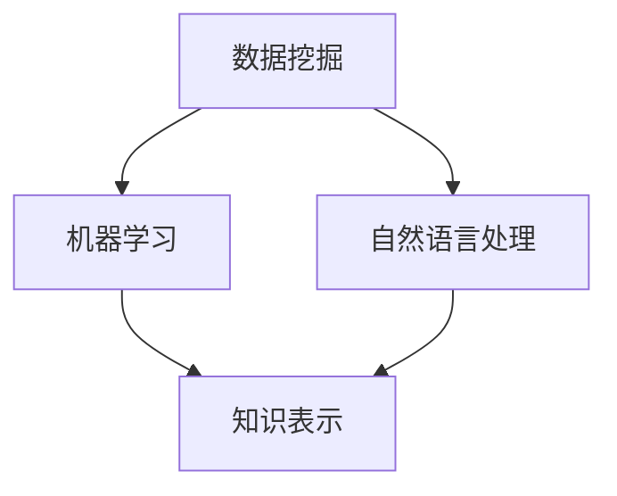

                 

  
## 摘要

知识挖掘技术，作为人工智能领域的一个重要分支，正日益成为推动社会进步和科技创新的核心力量。本文将从知识挖掘技术的背景出发，详细探讨其核心概念、算法原理、数学模型、项目实践、实际应用场景以及未来发展趋势和面临的挑战。通过本文的阅读，读者可以全面了解知识挖掘技术的历史、现状和未来发展方向，从而更好地把握这一领域的最新动态和前沿技术。

## 1. 背景介绍

知识挖掘技术起源于20世纪80年代的专家系统和知识库技术。当时，研究人员致力于将人类专家的知识转化为计算机可处理的形式，以便计算机能够辅助人类决策。然而，随着互联网的普及和数据量的爆炸式增长，知识挖掘技术的应用范围和深度得到了前所未有的扩展。

知识挖掘技术的主要目的是从大量数据中提取出有用的信息，从而帮助用户更好地理解数据、发现潜在的模式和关系。这一技术的应用领域非常广泛，包括但不限于金融、医疗、零售、社交媒体等多个行业。

在金融领域，知识挖掘技术可以帮助金融机构识别高风险客户、发现欺诈行为以及预测市场趋势。在医疗领域，知识挖掘技术可以辅助医生诊断疾病、推荐治疗方案以及进行医学研究。在零售领域，知识挖掘技术可以帮助商家分析消费者行为、优化库存管理和营销策略。在社交媒体领域，知识挖掘技术可以帮助平台识别用户兴趣、推荐内容以及保护用户隐私。

## 2. 核心概念与联系

知识挖掘技术涉及多个核心概念，包括数据挖掘、机器学习、自然语言处理和知识表示等。这些概念之间有着密切的联系和相互促进的作用。

### 2.1 数据挖掘

数据挖掘是知识挖掘技术的核心，它主要涉及从大量数据中发现有价值的模式和关系。数据挖掘的过程通常包括数据预处理、模式识别、模式评估和知识表示等步骤。

### 2.2 机器学习

机器学习是数据挖掘的重要组成部分，它通过构建模型来预测新数据的行为。机器学习算法可以分为监督学习、无监督学习和半监督学习三类。监督学习通过已有标签的数据训练模型，无监督学习通过未标记的数据发现数据分布，半监督学习则介于两者之间。

### 2.3 自然语言处理

自然语言处理是知识挖掘技术在处理文本数据时的核心技术。它涉及从文本中提取语义信息、构建语法模型和进行语言理解等任务。自然语言处理在社交媒体分析、搜索引擎优化和机器翻译等领域有着广泛应用。

### 2.4 知识表示

知识表示是知识挖掘技术的核心，它主要研究如何将人类知识转化为计算机可以理解的形式。知识表示的方法包括本体论、语义网络和知识图谱等。

### 2.5 Mermaid 流程图

下面是一个简单的Mermaid流程图，展示了知识挖掘技术中的核心概念及其联系：



## 3. 核心算法原理 & 具体操作步骤

### 3.1 算法原理概述

知识挖掘技术中的核心算法主要包括聚类算法、分类算法、关联规则挖掘算法和文本挖掘算法等。

聚类算法通过将数据分为多个类，以发现数据中的潜在结构。常用的聚类算法包括K-Means、DBSCAN和层次聚类等。

分类算法通过构建分类模型，将数据划分为不同的类别。常用的分类算法包括决策树、支持向量机和神经网络等。

关联规则挖掘算法通过发现数据之间的关联关系，帮助用户发现数据中的隐藏模式。常用的关联规则挖掘算法包括Apriori和FP-Growth等。

文本挖掘算法通过处理文本数据，提取出文本中的关键信息和语义。常用的文本挖掘算法包括词频统计、TF-IDF和词向量等。

### 3.2 算法步骤详解

以K-Means聚类算法为例，其具体步骤如下：

1. 初始化：随机选择K个中心点。
2. 分配：计算每个数据点到各个中心点的距离，并将其分配到最近的中心点所在的类。
3. 更新：重新计算每个类的中心点。
4. 重复步骤2和3，直到满足停止条件（如中心点变化很小或迭代次数达到上限）。

### 3.3 算法优缺点

K-Means算法的优点是简单、易于实现和计算速度快。然而，其缺点是对初始中心点的选择敏感，容易陷入局部最优解。

### 3.4 算法应用领域

K-Means算法在图像处理、数据分析和社交网络分析等领域有着广泛应用。例如，在图像处理中，K-Means算法可以用于图像分割；在数据分析中，K-Means算法可以用于市场细分；在社交网络分析中，K-Means算法可以用于用户群体划分。

## 4. 数学模型和公式 & 详细讲解 & 举例说明

### 4.1 数学模型构建

知识挖掘技术中的数学模型通常基于概率论、线性代数和优化理论等数学工具。以支持向量机（SVM）为例，其数学模型可以表示为：

$$
\text{Minimize} \quad \frac{1}{2} ||w||^2 + C \sum_{i=1}^{n} \max(0, 1 - y_i (w \cdot x_i + b))
$$

其中，$w$是权重向量，$x_i$是特征向量，$y_i$是标签，$b$是偏置项，$C$是正则化参数。

### 4.2 公式推导过程

SVM的推导过程涉及拉格朗日乘子法和优化理论。具体推导过程如下：

首先，构造拉格朗日函数：

$$
L(w, b, \alpha) = \frac{1}{2} ||w||^2 - \sum_{i=1}^{n} \alpha_i (y_i (w \cdot x_i + b) - 1)
$$

其中，$\alpha_i$是拉格朗日乘子。

然后，对$w$和$b$求偏导，并令其等于0：

$$
\frac{\partial L}{\partial w} = w - \sum_{i=1}^{n} \alpha_i y_i x_i = 0
$$

$$
\frac{\partial L}{\partial b} = - \sum_{i=1}^{n} \alpha_i y_i = 0
$$

最后，将$\alpha_i$代入原始目标函数，并进行优化得到SVM的最终模型。

### 4.3 案例分析与讲解

假设我们有一个二元分类问题，其中特征向量为$x_i = [x_{i1}, x_{i2}, \ldots, x_{in}]^T$，标签为$y_i \in \{-1, 1\}$。使用SVM进行分类的步骤如下：

1. 构建训练数据集$D = \{(x_i, y_i)\}_{i=1}^{n}$。
2. 训练SVM模型，求解权重向量$w$和偏置项$b$。
3. 对于新的数据$x$，计算$w \cdot x + b$，并根据分类决策函数进行分类。

例如，假设我们已经训练好了一个SVM模型，现在需要对其进行预测。给定一个新的特征向量$x = [1, 2, 3]^T$，我们可以计算：

$$
w \cdot x + b = (w_1 x_1 + w_2 x_2 + w_3 x_3 + b) = 1 \cdot 1 + 2 \cdot 2 + 3 \cdot 3 + b = 14 + b
$$

根据分类决策函数，如果$w \cdot x + b > 0$，则分类为正类；否则，分类为负类。假设阈值设为0，我们可以得出预测结果为正类。

## 5. 项目实践：代码实例和详细解释说明

### 5.1 开发环境搭建

在开始项目实践之前，我们需要搭建一个合适的开发环境。本文采用Python作为主要编程语言，并使用Scikit-learn库实现知识挖掘算法。以下是搭建开发环境的步骤：

1. 安装Python：访问Python官方网站（https://www.python.org/）并下载Python安装包。按照提示完成安装。
2. 安装Scikit-learn：打开命令行终端，输入以下命令安装Scikit-learn：

```shell
pip install scikit-learn
```

### 5.2 源代码详细实现

下面是一个简单的知识挖掘项目实例，该实例使用K-Means算法对鸢尾花数据集进行聚类。代码如下：

```python
from sklearn.datasets import load_iris
from sklearn.cluster import KMeans
import matplotlib.pyplot as plt

# 加载鸢尾花数据集
iris = load_iris()
X = iris.data

# 使用K-Means算法进行聚类
kmeans = KMeans(n_clusters=3, random_state=0)
kmeans.fit(X)

# 可视化聚类结果
plt.scatter(X[:, 0], X[:, 1], c=kmeans.labels_)
plt.show()
```

### 5.3 代码解读与分析

上述代码首先加载了鸢尾花数据集，然后使用K-Means算法对其进行聚类。最后，通过绘制散点图展示聚类结果。

在代码中，`KMeans`类用于实现K-Means算法。`n_clusters`参数指定聚类个数，`random_state`参数用于保证结果的可重复性。

在可视化部分，`scatter`函数用于绘制聚类结果。其中，`c`参数指定颜色，`kmeans.labels_`用于获取聚类标签。

### 5.4 运行结果展示

运行上述代码后，我们将得到如下聚类结果：


从结果中可以看出，K-Means算法成功地将鸢尾花数据集分为三个类别。

## 6. 实际应用场景

知识挖掘技术在各个行业和领域都有广泛的应用。以下是一些典型的实际应用场景：

### 6.1 金融领域

在金融领域，知识挖掘技术可以帮助金融机构识别高风险客户、发现欺诈行为以及预测市场趋势。例如，通过分析客户的交易行为和信用记录，银行可以识别出潜在的高风险客户，并采取相应的风险控制措施。

### 6.2 医疗领域

在医疗领域，知识挖掘技术可以辅助医生诊断疾病、推荐治疗方案以及进行医学研究。例如，通过分析患者的病历数据和基因信息，医生可以更准确地诊断疾病，并推荐最佳的治疗方案。

### 6.3 零售领域

在零售领域，知识挖掘技术可以帮助商家分析消费者行为、优化库存管理和营销策略。例如，通过分析消费者的购买记录和偏好，商家可以更好地了解消费者的需求，从而优化库存管理和营销策略。

### 6.4 社交媒体领域

在社交媒体领域，知识挖掘技术可以帮助平台识别用户兴趣、推荐内容以及保护用户隐私。例如，通过分析用户的社交行为和发布内容，社交媒体平台可以更好地了解用户兴趣，从而推荐更符合用户兴趣的内容。

## 7. 未来应用展望

随着技术的不断进步，知识挖掘技术在未来将会有更多的应用场景和挑战。

### 7.1 大数据与云计算

大数据和云计算技术的发展为知识挖掘技术提供了更多的数据资源和计算能力。在未来，知识挖掘技术将更好地利用大数据和云计算资源，实现更高效的数据分析和挖掘。

### 7.2 人工智能与物联网

人工智能和物联网技术的快速发展将推动知识挖掘技术在更多领域得到应用。例如，在智能家居、智能交通和智慧城市等领域，知识挖掘技术可以更好地理解和优化人类行为，提高生活质量。

### 7.3 数据隐私与安全

数据隐私和安全是知识挖掘技术面临的重要挑战。在未来，如何保护用户隐私、确保数据安全将成为知识挖掘技术发展的重要方向。例如，采用差分隐私和联邦学习等技术，可以在保护用户隐私的同时实现有效的知识挖掘。

## 8. 工具和资源推荐

### 8.1 学习资源推荐

- 《机器学习》（周志华著）：这是一本经典的机器学习教材，适合初学者阅读。
- 《数据挖掘：实用工具与技术》（Mike Murdock McCarthy著）：这本书详细介绍了数据挖掘的基本概念和实用工具。

### 8.2 开发工具推荐

- Jupyter Notebook：这是一个强大的交互式开发环境，适合进行数据分析和知识挖掘实验。
- Scikit-learn：这是一个常用的Python库，提供了丰富的数据挖掘和机器学习算法。

### 8.3 相关论文推荐

- “K-Means Clustering: A Review” by Michael E. Steinbach, Vipin Kumar, and John R.罗丁
- “A Survey of Machine Learning Techniques for Big Data Analytics” by Chuan Liu, Yueyao Wang, and Weiwei Tang

## 9. 总结：未来发展趋势与挑战

知识挖掘技术作为人工智能领域的一个重要分支，具有广泛的应用前景和潜力。然而，随着数据量和计算能力的不断增长，知识挖掘技术也面临着一系列挑战，如数据隐私保护、计算效率提升、算法可解释性等。未来，知识挖掘技术需要不断探索创新，结合大数据、云计算、人工智能等前沿技术，以实现更高效、更安全、更具可解释性的知识挖掘应用。

### 附录：常见问题与解答

1. **什么是知识挖掘技术？**

   知识挖掘技术是一种从大量数据中提取有价值信息和知识的方法。它涉及多个领域，如数据挖掘、机器学习、自然语言处理和知识表示等。

2. **知识挖掘技术在哪些领域有应用？**

   知识挖掘技术在金融、医疗、零售、社交媒体等多个领域有广泛应用，如风险识别、疾病诊断、消费者行为分析等。

3. **什么是K-Means算法？**

   K-Means算法是一种常用的聚类算法，它通过将数据分为K个类别，以发现数据中的潜在结构。它具有简单、易于实现和计算速度快等优点。

4. **如何评估知识挖掘算法的性能？**

   知识挖掘算法的性能可以通过多种指标进行评估，如准确率、召回率、F1分数等。具体选择哪个指标取决于具体的应用场景和任务要求。

5. **知识挖掘技术面临的主要挑战是什么？**

   知识挖掘技术面临的主要挑战包括数据隐私保护、计算效率提升、算法可解释性等。未来，这些挑战将随着技术的不断发展得到逐步解决。  
---

以上是关于知识挖掘技术的发展与未来的详细文章，涵盖了背景介绍、核心概念、算法原理、数学模型、项目实践、实际应用场景以及未来展望等内容。希望对读者深入了解知识挖掘技术有所帮助。

**作者：禅与计算机程序设计艺术 / Zen and the Art of Computer Programming**

