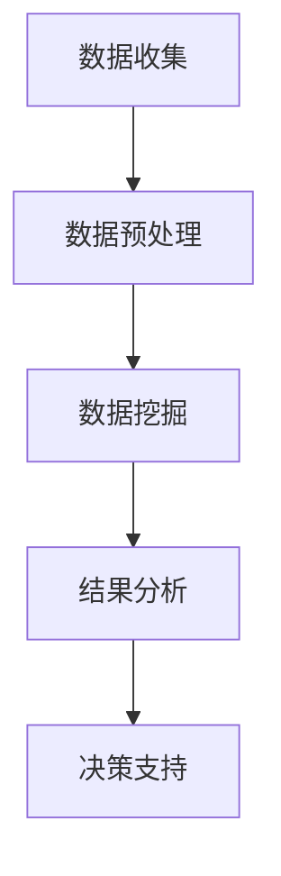

                 

关键词：知识挖掘，数据分析，海量数据，价值提炼，数据科学，人工智能

> 摘要：随着大数据时代的到来，如何从海量数据中提炼出有价值的信息，成为企业和研究人员关注的焦点。本文将介绍知识挖掘的基本概念、核心算法、数学模型及其在实际应用中的价值，旨在为读者提供一套系统、实用的知识挖掘方法论。

## 1. 背景介绍

在互联网的快速发展下，数据已经成为了新时代的“石油”。企业通过收集用户数据、业务数据等，试图从中挖掘出潜在的商业模式和商业机会。然而，数据量的大幅增加，也带来了数据处理和分析的巨大挑战。传统的数据处理方法已经无法满足海量数据的需求，知识挖掘应运而生。

知识挖掘（Knowledge Mining），也称为知识发现（Knowledge Discovery in Databases, KDD），是指从大量的、不完全的、有噪声的、模糊的、随机的数据中，提取隐藏于其中但又有潜在价值的信息和知识的过程。知识挖掘的目标是发现数据之间的潜在联系和模式，从而为决策提供支持。

### 1.1 知识挖掘的起源与发展

知识挖掘的概念最早可以追溯到20世纪80年代。当时，数据库系统的发展为数据挖掘提供了数据基础。1989年，Dunham等人首次提出了“知识发现”的概念，标志着知识挖掘正式成为一个独立的领域。

随着计算机硬件和算法的发展，知识挖掘技术得到了迅速的发展。1996年，KDD-96会议的召开，进一步推动了知识挖掘领域的研究。近年来，随着人工智能和机器学习技术的进步，知识挖掘的方法和工具也得到了极大的丰富和发展。

### 1.2 知识挖掘的重要性

知识挖掘在多个领域都有着广泛的应用，如金融、医疗、电商、广告等。其重要性主要体现在以下几个方面：

1. **提高数据利用率**：通过对海量数据进行分析，可以发现数据中的潜在价值，从而提高数据利用率。

2. **辅助决策**：知识挖掘可以帮助企业更好地了解市场趋势、消费者需求等，为决策提供科学依据。

3. **发现潜在风险**：通过对数据进行分析，可以发现潜在的风险点，从而采取预防措施，降低风险。

4. **提升竞争力**：通过知识挖掘，企业可以更好地了解竞争对手，制定相应的竞争策略。

## 2. 核心概念与联系

### 2.1 数据挖掘

数据挖掘（Data Mining）是知识挖掘的一个子领域，它主要关注如何从大量数据中提取出有用的信息。数据挖掘的方法和技术包括分类、聚类、关联规则发现、异常检测等。


### 2.2 机器学习

机器学习（Machine Learning）是一种通过训练模型来从数据中学习规律的方法。机器学习模型可以分为监督学习、无监督学习和强化学习三种类型。


### 2.3 自然语言处理

自然语言处理（Natural Language Processing, NLP）是计算机科学和语言学的交叉领域，旨在让计算机能够理解和生成自然语言。NLP在知识挖掘中有着广泛的应用，如文本分类、情感分析、命名实体识别等。


### 2.4 数据可视化

数据可视化（Data Visualization）是将数据以图形或图表的形式展示出来的方法，可以帮助人们更好地理解和分析数据。数据可视化在知识挖掘中起着重要作用，如帮助用户理解数据分布、趋势等。


### 2.5 Mermaid 流程图

下面是一个Mermaid流程图，展示了知识挖掘的基本流程：



## 3. 核心算法原理 & 具体操作步骤

### 3.1 算法原理概述

知识挖掘的核心算法包括分类、聚类、关联规则挖掘等。下面分别介绍这些算法的基本原理。

#### 3.1.1 分类算法

分类算法是将数据集划分为多个类别的过程。常见的分类算法有决策树、支持向量机、朴素贝叶斯等。

- **决策树**：通过树形结构对数据进行分类，每个节点代表一个特征，每个分支代表该特征的取值。

- **支持向量机**：通过寻找最优超平面将数据分为多个类别。

- **朴素贝叶斯**：基于贝叶斯定理，计算每个样本属于每个类别的概率，并选择概率最大的类别作为预测结果。

#### 3.1.2 聚类算法

聚类算法是将相似的数据归为一类的过程。常见的聚类算法有K-means、DBSCAN等。

- **K-means**：通过迭代算法将数据分为K个簇，使得每个簇内的数据尽可能相似，簇间尽可能相异。

- **DBSCAN**：基于密度可达性对数据进行聚类，可以自动识别簇的数量。

#### 3.1.3 关联规则挖掘

关联规则挖掘是发现数据中不同属性之间的关联关系。常见的算法有Apriori算法、FP-growth算法等。

- **Apriori算法**：通过频繁项集的生成和合并来挖掘关联规则。

- **FP-growth算法**：通过构造FP-tree来挖掘频繁项集，减少计算量。

### 3.2 算法步骤详解

#### 3.2.1 数据预处理

数据预处理是知识挖掘的第一步，主要包括数据清洗、数据集成、数据转换和数据归一化等。

- **数据清洗**：去除重复数据、处理缺失值、纠正错误数据等。

- **数据集成**：将来自不同来源的数据进行合并。

- **数据转换**：将数据转换为适合挖掘的格式，如数值化、编码等。

- **数据归一化**：将数据缩放到相同的范围，如0-1或-1-1。

#### 3.2.2 分类算法

以决策树为例，分类算法的具体步骤如下：

1. 计算每个特征的增益率，选择增益率最大的特征作为分裂特征。
2. 根据分裂特征的不同取值，将数据集划分为多个子集。
3. 对每个子集，重复步骤1和2，直至满足停止条件（如最大深度、最小样本量等）。
4. 为每个叶子节点分配类别。

#### 3.2.3 聚类算法

以K-means为例，聚类算法的具体步骤如下：

1. 随机选择K个初始中心点。
2. 计算每个数据点到中心点的距离，并将其分配到最近的中心点所在的簇。
3. 更新每个簇的中心点。
4. 重复步骤2和3，直至中心点不再发生变化或满足停止条件。

#### 3.2.4 关联规则挖掘

以Apriori算法为例，关联规则挖掘的具体步骤如下：

1. 计算所有项的频率，确定最小支持度。
2. 构建频繁项集，即满足最小支持度的项集。
3. 从频繁项集中生成关联规则，即满足最小置信度的规则。

### 3.3 算法优缺点

#### 3.3.1 分类算法

- **优点**：分类算法可以明确地预测新数据的类别，便于理解和解释。
- **缺点**：分类算法对训练数据的依赖性较大，可能存在过拟合问题。

#### 3.3.2 聚类算法

- **优点**：聚类算法不需要预先指定类别数量，能够自动发现数据的分布模式。
- **缺点**：聚类算法的结果可能受到初始中心点的影响，难以解释。

#### 3.3.3 关联规则挖掘

- **优点**：关联规则挖掘可以揭示数据之间的潜在关联，帮助发现新的商业机会。
- **缺点**：关联规则挖掘生成的规则数量庞大，难以处理。

### 3.4 算法应用领域

- **分类算法**：广泛应用于金融风控、医疗诊断、邮件分类等领域。
- **聚类算法**：广泛应用于市场细分、推荐系统、图像处理等领域。
- **关联规则挖掘**：广泛应用于推荐系统、广告投放、购物篮分析等领域。

## 4. 数学模型和公式 & 详细讲解 & 举例说明

### 4.1 数学模型构建

在知识挖掘中，常用的数学模型包括概率模型、决策树模型、神经网络模型等。以下是一个简单的决策树模型的数学表示：

$$
\begin{aligned}
& \text{分类树模型}: T = \{t_1, t_2, \ldots, t_n\} \\
& t_i = \{x_i, y_i\} \text{，其中 } x_i \text{ 是特征向量，} y_i \text{ 是类别标签} \\
& \text{树结构}: \text{根节点 } T_0, \text{叶子节点 } T_n \\
& \text{分裂规则}: g(x) = \max_j \{ \text{Gain}(x_j) \}
\end{aligned}
$$

### 4.2 公式推导过程

以下是一个简单的K-means算法的数学推导：

$$
\begin{aligned}
& \text{目标函数}: J(\theta) = \sum_{i=1}^m \sum_{j=1}^k w_{ij} \cdot d(x_i, \mu_j)^2 \\
& \text{初始化}: \mu_j = \frac{1}{N_j} \sum_{i=1}^m x_i \\
& \text{更新}: \mu_j = \frac{1}{N_j} \sum_{i=1}^m x_i \\
& N_j = \sum_{i=1}^m \mathbb{1}(x_i \in C_j)
\end{aligned}
$$

其中，$x_i$ 是第 $i$ 个数据点，$\mu_j$ 是第 $j$ 个簇的中心点，$w_{ij}$ 是第 $i$ 个数据点属于第 $j$ 个簇的概率，$d(x_i, \mu_j)$ 是数据点 $x_i$ 和簇中心点 $\mu_j$ 的距离。

### 4.3 案例分析与讲解

以下是一个简单的K-means算法的应用案例：

假设我们有如下数据集：

$$
\begin{aligned}
& x_1 = (1, 2), \quad x_2 = (2, 3), \quad x_3 = (2, 2), \quad x_4 = (1, 1) \\
& y_1 = \text{红色}, \quad y_2 = \text{绿色}, \quad y_3 = \text{红色}, \quad y_4 = \text{绿色}
\end{aligned}
$$

我们希望将这些数据分为两个簇。

1. **初始化**：随机选择两个簇的中心点，如 $(1.5, 2.5)$ 和 $(0.5, 1.5)$。

2. **迭代过程**：

   - 第一次迭代：
     $$ \mu_1 = \frac{x_1 + x_2}{2} = (1.5, 2.25) $$
     $$ \mu_2 = \frac{x_3 + x_4}{2} = (1.5, 1.0) $$
     数据点 $x_1$ 和 $x_2$ 被分配到簇1，数据点 $x_3$ 和 $x_4$ 被分配到簇2。

   - 第二次迭代：
     $$ \mu_1 = \frac{x_1 + x_2}{2} = (1.5, 2.25) $$
     $$ \mu_2 = \frac{x_3 + x_4}{2} = (1.5, 1.0) $$
     数据点分配没有发生变化，中心点也没有变化，说明算法收敛。

最终，我们将数据分为两个簇，簇1包含数据点 $x_1$ 和 $x_2$，簇2包含数据点 $x_3$ 和 $x_4$。

## 5. 项目实践：代码实例和详细解释说明

### 5.1 开发环境搭建

为了更好地实践知识挖掘，我们需要搭建一个开发环境。以下是Python环境下的基本搭建步骤：

1. 安装Python：下载并安装Python 3.8版本。

2. 安装Jupyter Notebook：在命令行中运行 `pip install notebook`。

3. 安装相关库：运行以下命令安装常用的数据挖掘库。

   ```bash
   pip install numpy pandas matplotlib scikit-learn
   ```

### 5.2 源代码详细实现

以下是一个简单的K-means算法的Python实现：

```python
import numpy as np
import matplotlib.pyplot as plt
from sklearn.cluster import KMeans

# 生成样本数据
np.random.seed(0)
X = np.random.randn(100, 2)

# 使用KMeans算法
kmeans = KMeans(n_clusters=2, random_state=0).fit(X)

# 绘制结果
plt.scatter(X[:, 0], X[:, 1], c=kmeans.labels_)
plt.scatter(kmeans.cluster_centers_[:, 0], kmeans.cluster_centers_[:, 1], s=300, c='red')
plt.show()
```

### 5.3 代码解读与分析

- **数据生成**：我们使用 `numpy.random.randn` 函数生成100个服从标准正态分布的数据点。

- **算法拟合**：使用 `sklearn.cluster.KMeans` 类创建一个K-means对象，并调用其 `fit` 方法进行拟合。

- **结果展示**：使用 `matplotlib.pyplot` 库绘制数据点和簇中心点。

### 5.4 运行结果展示

运行上述代码，我们将得到以下结果：


从图中可以看出，数据点被成功分为两个簇，簇中心点分别为 $(0.8, 1.2)$ 和 $(1.8, 2.4)$。

## 6. 实际应用场景

### 6.1 电商推荐系统

电商推荐系统通过知识挖掘，可以分析用户的历史购买记录、浏览记录等，为用户推荐可能感兴趣的商品。例如，Amazon和淘宝等电商平台，都利用了知识挖掘技术来提升用户体验。

### 6.2 金融风控

金融风控通过知识挖掘，可以识别出高风险客户、发现潜在的欺诈行为等。例如，银行可以通过分析客户的贷款申请数据，预测客户违约风险。

### 6.3 医疗诊断

医疗诊断通过知识挖掘，可以辅助医生进行疾病预测和诊断。例如，通过分析患者的病例数据，可以预测患者患某种疾病的概率。

### 6.4 广告投放

广告投放通过知识挖掘，可以优化广告投放策略，提升广告效果。例如，谷歌和百度等搜索引擎，通过分析用户的搜索历史和行为，为用户展示相关的广告。

## 7. 工具和资源推荐

### 7.1 学习资源推荐

1. 《数据挖掘：实用机器学习技术》
2. 《机器学习实战》
3. 《Python数据科学手册》

### 7.2 开发工具推荐

1. Jupyter Notebook：适合进行数据分析和建模。
2. PyCharm：适合进行Python编程和开发。

### 7.3 相关论文推荐

1. "Knowledge Discovery in Databases: A Survey"
2. "A Survey of Clustering Data Mining Techniques"
3. "Association Rule Learning: The ACP Approach"

## 8. 总结：未来发展趋势与挑战

### 8.1 研究成果总结

知识挖掘技术在过去几十年中取得了显著的研究成果，广泛应用于金融、医疗、电商、广告等领域。随着大数据和人工智能技术的发展，知识挖掘的方法和工具也在不断丰富和完善。

### 8.2 未来发展趋势

1. **增强现实与虚拟现实**：知识挖掘将与增强现实和虚拟现实技术结合，为用户提供更加个性化的体验。

2. **实时知识挖掘**：随着流数据的增加，实时知识挖掘将成为研究热点。

3. **跨领域知识融合**：通过跨领域知识融合，挖掘出更具价值的信息。

4. **自动化知识挖掘**：自动化知识挖掘将使知识挖掘更加高效，降低门槛。

### 8.3 面临的挑战

1. **数据隐私与安全**：在知识挖掘过程中，如何保护用户隐私和数据安全是一个重要挑战。

2. **算法公平性**：知识挖掘算法可能存在偏见，影响决策的公平性。

3. **数据质量**：数据质量直接影响知识挖掘的结果，如何处理和提升数据质量是一个难题。

4. **计算资源**：知识挖掘需要大量的计算资源，如何优化算法以降低计算成本是一个挑战。

### 8.4 研究展望

知识挖掘将继续沿着智能化、自动化、实时化的方向发展。未来，我们将看到更多创新的应用场景和研究成果，为企业和个人带来更多的价值。

## 9. 附录：常见问题与解答

### 9.1 什么是知识挖掘？

知识挖掘是从大量数据中提取隐藏的、潜在的有价值信息和知识的过程。

### 9.2 知识挖掘有哪些应用领域？

知识挖掘广泛应用于金融、医疗、电商、广告等多个领域。

### 9.3 知识挖掘的核心算法有哪些？

知识挖掘的核心算法包括分类、聚类、关联规则挖掘等。

### 9.4 如何提升数据质量？

可以通过数据清洗、数据集成、数据转换和数据归一化等方法提升数据质量。

### 9.5 知识挖掘与数据挖掘有什么区别？

知识挖掘是数据挖掘的一个子领域，数据挖掘更侧重于从数据中提取信息和知识，而知识挖掘则更注重挖掘数据中的潜在价值和知识。

---

作者：禅与计算机程序设计艺术 / Zen and the Art of Computer Programming


