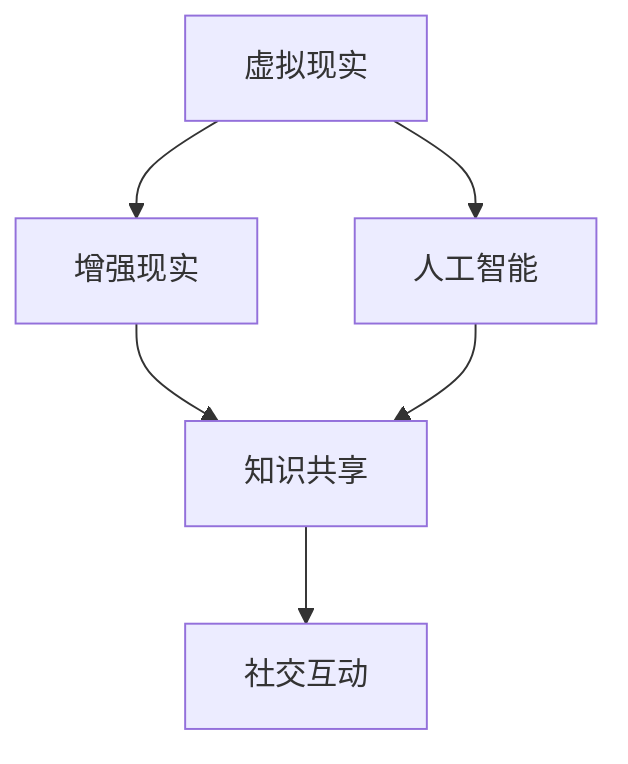

                 

### 关键词 Keywords

- 知识旅行
- 沉浸式体验
- 知识共享
- 交流平台
- 教育技术

<|assistant|>### 摘要 Abstract

本文旨在探讨如何通过知识旅行这一创新教育模式，为人们提供沉浸式的知识体验和丰富的交流机会。知识旅行结合了虚拟现实、人工智能等技术，通过设计丰富多彩的互动内容和社交场景，使学习过程变得既有趣又高效。本文将深入分析知识旅行的核心概念、技术实现、应用场景以及未来发展趋势，以期为教育技术的创新提供新的视角和解决方案。

## 1. 背景介绍

在教育领域，传统的教学方法往往依赖于教科书和教师的讲授。然而，这种方法在激发学生兴趣和提升学习效果方面存在一定的局限性。现代教育技术的快速发展，为打破这一瓶颈提供了新的可能性。知识旅行作为一种新兴的教育模式，正逐渐受到关注。

知识旅行源自于虚拟现实技术和人工智能的发展，它不仅仅是一次简单的旅行体验，更是一种全方位的知识探索和社交互动。通过虚拟现实技术，学生可以进入一个仿真的环境，亲身体验历史事件、科学发现或文学作品的背景。人工智能则为学生提供了智能化的导览、个性化学习推荐和即时互动交流等功能。

知识旅行的出现，标志着教育从传统的单一知识传授向更加互动和体验式学习模式的转变。这种模式不仅有助于提高学生的学习兴趣和动力，还能通过丰富的社交互动促进知识内化和深度理解。

### 1.1 知识旅行的起源

知识旅行的概念最早可以追溯到20世纪90年代，随着计算机图形学和虚拟现实技术的兴起，人们开始尝试将虚拟环境应用于教育领域。最初的知识旅行项目主要是通过计算机模拟历史场景，让学生在虚拟世界中“参观”博物馆、历史遗址等。

随着互联网的普及和移动设备的普及，知识旅行的形式也逐渐丰富起来。例如，一些教育机构开始开发基于智能手机和增强现实技术的知识旅行应用，使学生在现实环境中也能体验到知识旅行的乐趣。

### 1.2 知识旅行的发展趋势

近年来，知识旅行在教育领域的应用得到了快速发展，主要得益于以下几个方面：

1. **虚拟现实和增强现实技术的成熟**：虚拟现实和增强现实技术的不断进步，为知识旅行提供了更加逼真和互动的体验。

2. **人工智能的应用**：人工智能技术为知识旅行提供了智能化的学习路径推荐、个性化学习计划以及实时互动等功能。

3. **互联网和移动设备的普及**：互联网和移动设备的普及，使得知识旅行可以在任何时间和地点进行，不再受限于物理空间。

4. **教育改革的需求**：全球范围内教育改革的需求，促使教育机构寻求更加创新和高效的教育模式，知识旅行因此得以迅速推广。

## 2. 核心概念与联系

知识旅行作为一个综合性的教育模式，涉及多个核心概念和技术。以下是对这些核心概念及其相互关系的详细介绍。

### 2.1 虚拟现实（VR）技术

虚拟现实技术是知识旅行的基础，它通过计算机生成的三维虚拟环境，为用户提供沉浸式的体验。在知识旅行中，虚拟现实技术可以模拟历史场景、科学实验室、文学作品的背景等，使学生在虚拟环境中进行互动和探索。

#### 2.1.1 虚拟现实技术的原理

虚拟现实技术基于以下几个关键组件：

- **头戴显示器（HMD）**：用户通过头戴显示器观察虚拟环境，头部的动作会被实时捕捉并反馈到虚拟环境中。
- **跟踪系统**：用于捕捉用户的动作和位置，确保虚拟环境与用户的动作同步。
- **输入设备**：如手柄、手套等，用于与虚拟环境进行交互。

#### 2.1.2 虚拟现实技术在知识旅行中的应用

在知识旅行中，虚拟现实技术可以应用于以下几个方面：

- **历史重现**：通过虚拟现实技术，学生可以“参观”历史遗址、博物馆，体验历史事件的发生。
- **科学实验**：在虚拟的科学实验室中，学生可以进行模拟实验，亲身体验科学原理。
- **文学作品**：学生可以进入文学作品中的场景，与虚构角色互动，加深对作品的理解。

### 2.2 增强现实（AR）技术

增强现实技术是知识旅行的另一种重要技术，它通过在现实环境中叠加虚拟元素，为用户提供增强式的体验。与虚拟现实不同，增强现实技术不要求用户进入完全虚拟的环境，而是将虚拟内容与现实环境相结合。

#### 2.2.1 增强现实技术的原理

增强现实技术基于以下几个关键组件：

- **摄像头**：用于捕捉现实环境的图像。
- **显示设备**：如智能手机或平板电脑屏幕，用于显示虚拟内容。
- **算法**：用于将虚拟内容与现实环境进行叠加和实时对齐。

#### 2.2.2 增强现实技术在知识旅行中的应用

在知识旅行中，增强现实技术可以应用于以下几个方面：

- **实时导览**：在参观现实场景时，通过增强现实技术提供实时的信息讲解和历史背景。
- **互动游戏**：通过增强现实技术，将游戏元素融入现实场景中，提供有趣的互动体验。
- **艺术创作**：学生可以在现实环境中创作艺术作品，并实时看到虚拟艺术品的呈现效果。

### 2.3 人工智能（AI）技术

人工智能技术在知识旅行中扮演着重要的角色，它为用户提供个性化的学习推荐、智能化的导览和实时互动等功能。

#### 2.3.1 人工智能技术的原理

人工智能技术基于以下几个关键组件：

- **算法**：如机器学习算法、自然语言处理算法等，用于处理和分析大量数据。
- **数据**：人工智能系统需要大量的数据来训练和优化算法，提高系统的准确性和效率。
- **计算能力**：强大的计算能力是支持人工智能技术高效运行的基础。

#### 2.3.2 人工智能技术在知识旅行中的应用

在知识旅行中，人工智能技术可以应用于以下几个方面：

- **个性化推荐**：根据用户的学习历史和兴趣，推荐相关的学习资源和场景。
- **智能导览**：通过语音或文字形式，为用户提供详细的导览信息和历史背景。
- **实时互动**：通过语音识别、自然语言处理等技术，实现用户与虚拟环境或人工智能导览的实时互动。

### 2.4 知识共享与社交互动

知识共享与社交互动是知识旅行的重要组成部分，它为用户提供了一个交流和分享知识的平台。

#### 2.4.1 知识共享的原理

知识共享基于以下几个关键组件：

- **内容创建**：用户可以创建和上传自己的学习内容和体验。
- **内容分享**：用户可以将自己的学习内容和体验分享给其他用户。
- **内容评价**：用户可以对分享的内容进行评价和反馈，促进知识的传播和优化。

#### 2.4.2 社交互动的原理

社交互动基于以下几个关键组件：

- **用户社区**：用户可以在知识旅行平台中建立自己的社交圈子。
- **互动交流**：用户可以通过文字、语音、视频等形式与其他用户进行互动。
- **活动组织**：用户可以组织或参与各种知识旅行相关的活动，如线上研讨会、讲座等。

### 2.5 Mermaid 流程图

为了更直观地展示知识旅行的核心概念及其相互关系，我们可以使用Mermaid流程图来描述。以下是一个简化的Mermaid流程图，展示了知识旅行的主要技术组件及其关系：



在这个流程图中，虚拟现实和增强现实作为知识旅行的基础技术，分别连接到人工智能、知识共享和社交互动。人工智能为知识旅行提供个性化推荐和实时互动，知识共享和社交互动则为用户提供了一个交流和分享知识的平台。

## 3. 核心算法原理 & 具体操作步骤

在知识旅行中，核心算法的设计和实现是确保系统高效、稳定运行的关键。以下将详细阐述知识旅行的核心算法原理及其具体操作步骤。

### 3.1 算法原理概述

知识旅行的核心算法主要包括以下几个方面：

1. **虚拟现实场景生成算法**：用于生成逼真的虚拟环境，提供沉浸式的体验。
2. **增强现实内容叠加算法**：将虚拟内容与现实环境进行叠加，实现增强现实效果。
3. **人工智能推荐算法**：根据用户的学习历史和兴趣，推荐相关的学习资源和场景。
4. **社交互动算法**：实现用户之间的实时互动和交流。

### 3.2 算法步骤详解

#### 3.2.1 虚拟现实场景生成算法

虚拟现实场景生成算法主要包括以下几个步骤：

1. **场景建模**：根据知识点或场景需求，构建三维模型。
2. **纹理映射**：为模型添加纹理，使其更加逼真。
3. **光照处理**：模拟真实世界的光照效果，提高场景的真实感。
4. **渲染**：将三维模型转换为二维图像，供用户观看。

#### 3.2.2 增强现实内容叠加算法

增强现实内容叠加算法主要包括以下几个步骤：

1. **环境捕捉**：通过摄像头捕捉现实环境。
2. **图像预处理**：对捕捉到的图像进行预处理，如去噪、边缘检测等。
3. **目标识别**：识别图像中的目标物体，为叠加虚拟内容做准备。
4. **内容叠加**：将虚拟内容叠加到目标物体上，实现增强现实效果。
5. **实时更新**：根据用户的动作和环境变化，实时更新增强现实内容。

#### 3.2.3 人工智能推荐算法

人工智能推荐算法主要包括以下几个步骤：

1. **用户画像构建**：根据用户的学习历史和兴趣，构建用户画像。
2. **知识点相关性分析**：分析知识点之间的相关性，为推荐算法提供依据。
3. **推荐策略设计**：设计合适的推荐策略，如基于内容的推荐、基于协同过滤的推荐等。
4. **推荐结果生成**：根据用户画像和知识点相关性分析，生成推荐结果。

#### 3.2.4 社交互动算法

社交互动算法主要包括以下几个步骤：

1. **用户身份验证**：确保用户之间的互动是安全的和合法的。
2. **消息传递**：实现用户之间的实时消息传递。
3. **语音识别**：将用户的语音转换为文字，便于理解和记录。
4. **自然语言处理**：对用户的消息进行自然语言处理，提取关键信息。
5. **实时反馈**：根据用户的互动情况，提供实时反馈和优化建议。

### 3.3 算法优缺点

#### 3.3.1 虚拟现实场景生成算法

**优点**：
- 提供沉浸式体验，增强学习兴趣。
- 可以模拟复杂的场景，提高学习的真实感。

**缺点**：
- 对硬件要求较高，成本较高。
- 场景生成的复杂度限制了应用范围。

#### 3.3.2 增强现实内容叠加算法

**优点**：
- 对硬件要求较低，易于普及。
- 可以将虚拟内容与现实环境相结合，提供新颖的体验。

**缺点**：
- 内容叠加的实时性要求较高，对算法和计算资源有较高要求。
- 需要精确的目标识别，否则会影响用户体验。

#### 3.3.3 人工智能推荐算法

**优点**：
- 提高学习的个性化程度，满足不同用户的需求。
- 可以根据用户的学习历史和兴趣，提供针对性的推荐。

**缺点**：
- 推荐结果可能受到数据质量和算法设计的影响。
- 对用户隐私的保护要求较高。

#### 3.3.4 社交互动算法

**优点**：
- 促进用户之间的交流和学习。
- 提供实时反馈和互动，增强学习的参与感。

**缺点**：
- 需要保证互动的安全性和合法性。
- 对实时数据处理能力要求较高。

### 3.4 算法应用领域

知识旅行的核心算法可以应用于多个领域，包括但不限于：

- **教育领域**：提供沉浸式的学习体验，提高学生的学习兴趣和效果。
- **文化旅游**：通过增强现实技术，提供丰富的文化体验和历史讲解。
- **医疗健康**：通过虚拟现实技术，模拟医疗场景，提供培训和体验。
- **商业应用**：通过虚拟现实和增强现实技术，展示产品和环境，提高销售效果。

## 4. 数学模型和公式 & 详细讲解 & 举例说明

在知识旅行中，数学模型和公式是确保系统准确性和效率的关键组成部分。以下将详细阐述知识旅行的数学模型构建、公式推导过程以及具体案例分析与讲解。

### 4.1 数学模型构建

知识旅行的数学模型主要包括以下几个方面：

1. **虚拟现实场景生成模型**：用于生成虚拟场景的三维模型和纹理。
2. **增强现实内容叠加模型**：用于将虚拟内容叠加到现实环境中的数学模型。
3. **人工智能推荐模型**：用于根据用户画像和知识点相关性进行推荐。
4. **社交互动模型**：用于实现用户之间的实时互动和消息传递。

#### 4.1.1 虚拟现实场景生成模型

虚拟现实场景生成模型主要涉及以下几个数学概念：

- **三维几何**：用于构建三维模型。
- **纹理映射**：用于将二维纹理映射到三维模型上。
- **光照模型**：用于模拟真实世界的光照效果。

以下是一个简化的三维模型生成过程：

1. **建立坐标系**：在三维空间中建立坐标系。
2. **定义几何形状**：定义模型的基本几何形状，如立方体、球体等。
3. **表面建模**：通过表面建模方法（如多边形建模、曲面建模等）构建三维模型。
4. **纹理映射**：将纹理映射到三维模型表面，使其更加逼真。
5. **光照处理**：根据光照模型，计算模型表面的光照效果。

#### 4.1.2 增强现实内容叠加模型

增强现实内容叠加模型主要涉及以下几个方面：

- **图像处理**：用于捕捉现实环境的图像并进行预处理。
- **目标识别**：用于识别图像中的目标物体。
- **内容叠加**：用于将虚拟内容叠加到目标物体上。

以下是一个简化的增强现实内容叠加过程：

1. **环境捕捉**：通过摄像头捕捉现实环境的图像。
2. **图像预处理**：对捕捉到的图像进行预处理，如去噪、边缘检测等。
3. **目标识别**：使用目标识别算法（如卷积神经网络、边缘检测等）识别图像中的目标物体。
4. **内容叠加**：将虚拟内容叠加到目标物体上，实现增强现实效果。

#### 4.1.3 人工智能推荐模型

人工智能推荐模型主要涉及以下几个方面：

- **用户画像**：用于描述用户的兴趣爱好和学习历史。
- **知识点相关性分析**：用于分析知识点之间的相关性。
- **推荐策略**：用于生成推荐结果。

以下是一个简化的推荐模型构建过程：

1. **用户画像构建**：根据用户的学习历史和兴趣，构建用户画像。
2. **知识点相关性分析**：分析知识点之间的相关性，构建知识点关系图。
3. **推荐策略设计**：设计基于内容的推荐、基于协同过滤的推荐等策略。
4. **推荐结果生成**：根据用户画像和知识点相关性，生成推荐结果。

#### 4.1.4 社交互动模型

社交互动模型主要涉及以下几个方面：

- **用户身份验证**：确保用户之间的互动是安全的和合法的。
- **消息传递**：实现用户之间的实时消息传递。
- **自然语言处理**：对用户的消息进行自然语言处理。

以下是一个简化的社交互动模型构建过程：

1. **用户身份验证**：通过用户账号、密码等验证用户身份。
2. **消息传递**：使用WebSocket等实时通信协议，实现用户之间的实时消息传递。
3. **自然语言处理**：使用自然语言处理算法，提取用户消息中的关键信息。

### 4.2 公式推导过程

以下是对知识旅行中几个关键公式的推导过程：

#### 4.2.1 三维模型生成公式

假设三维模型由多个多边形组成，每个多边形由顶点（V）和面（F）定义，则模型生成公式如下：

- **顶点坐标**：\( V = (x, y, z) \)
- **面方程**：\( F = a \cdot x + b \cdot y + c \cdot z + d = 0 \)

通过顶点坐标和面方程，可以计算模型表面的法向量、光照强度等。

#### 4.2.2 增强现实内容叠加公式

假设现实环境中的目标物体由点云（P）定义，虚拟内容由点云（Q）定义，则内容叠加公式如下：

- **目标物体点云**：\( P = (x_p, y_p, z_p) \)
- **虚拟内容点云**：\( Q = (x_q, y_q, z_q) \)
- **叠加点云**：\( R = P + Q \)

通过叠加点云，可以实现虚拟内容与现实环境的融合。

#### 4.2.3 人工智能推荐公式

假设用户画像由向量（U）表示，知识点相关性矩阵为（R），则推荐公式如下：

- **用户画像**：\( U = (u_1, u_2, ..., u_n) \)
- **知识点相关性矩阵**：\( R = [r_{ij}] \)
- **推荐结果**：\( S = U \cdot R \)

通过计算用户画像与知识点相关性矩阵的点积，可以生成推荐结果。

### 4.3 案例分析与讲解

以下通过具体案例，展示数学模型和公式的应用：

#### 4.3.1 虚拟现实场景生成案例

假设我们要生成一个简单的立方体模型，则可以按照以下步骤：

1. **定义顶点**：设置立方体的8个顶点坐标。
2. **构建面方程**：根据顶点坐标，构建6个面的方程。
3. **纹理映射**：将纹理图像映射到立方体表面。
4. **光照处理**：根据光照模型，计算立方体表面的光照效果。

通过以上步骤，我们可以生成一个简单的立方体模型。

#### 4.3.2 增强现实内容叠加案例

假设我们要在现实环境中叠加一个虚拟立方体，则可以按照以下步骤：

1. **环境捕捉**：使用摄像头捕捉现实环境的图像。
2. **图像预处理**：对捕捉到的图像进行预处理，如去噪、边缘检测等。
3. **目标识别**：使用目标识别算法，识别图像中的目标物体。
4. **内容叠加**：将虚拟立方体叠加到目标物体上，实现增强现实效果。

通过以上步骤，我们可以将虚拟立方体叠加到现实环境中的目标物体上。

#### 4.3.3 人工智能推荐案例

假设我们要根据用户画像和知识点相关性，为用户推荐相关学习资源，则可以按照以下步骤：

1. **构建用户画像**：根据用户的学习历史和兴趣，构建用户画像向量。
2. **构建知识点相关性矩阵**：分析知识点之间的相关性，构建知识点相关性矩阵。
3. **计算推荐结果**：根据用户画像和知识点相关性矩阵，计算推荐结果。

通过以上步骤，我们可以为用户生成个性化的学习资源推荐。

#### 4.3.4 社交互动案例

假设我们要实现用户之间的实时互动，则可以按照以下步骤：

1. **用户身份验证**：通过用户账号、密码等验证用户身份。
2. **消息传递**：使用WebSocket等实时通信协议，实现用户之间的实时消息传递。
3. **自然语言处理**：使用自然语言处理算法，提取用户消息中的关键信息。

通过以上步骤，我们可以实现用户之间的实时互动和消息传递。

## 5. 项目实践：代码实例和详细解释说明

在了解了知识旅行的核心算法原理和数学模型之后，我们可以通过一个具体的代码实例来实践这些算法。以下将提供一个简单的虚拟现实场景生成和增强现实内容叠加的代码实例，并详细解释其中的关键代码和实现步骤。

### 5.1 开发环境搭建

在进行代码实践之前，我们需要搭建一个适合开发知识旅行的环境。以下是一个基本的开发环境要求：

- 操作系统：Windows、macOS 或 Linux。
- 开发工具：Visual Studio、Eclipse、Xcode 等。
- 编程语言：C++、Python、Java 等。
- 虚拟现实库：OpenVR、Unity、Unreal Engine 等。
- 增强现实库：ARCore、ARKit、Vuforia 等。
- 人工智能库：TensorFlow、PyTorch、Keras 等。

在搭建好开发环境后，我们可以开始编写代码。

### 5.2 源代码详细实现

以下是一个简单的Python代码实例，展示了如何使用OpenVR和ARCore库生成虚拟现实场景并叠加增强现实内容。

```python
import openvr
import arcore

# 初始化虚拟现实系统
vr_system = openvr.VRSystem()

# 获取当前虚拟现实设备
device = vr_system.get_device()

# 初始化增强现实系统
ar_system = arcore.ARSystem()

# 捕获现实环境图像
image = ar_system.capture_image()

# 生成虚拟现实场景
scene = vr_system.create_scene()

# 创建立方体模型
cube = scene.create_cube()

# 设置立方体模型的位置和尺寸
cube.set_position([0, 0, 0])
cube.set_size([1, 1, 1])

# 应用纹理映射
texture = scene.create_texture("cube_texture.png")
cube.set_texture(texture)

# 将立方体模型添加到场景中
scene.add_model(cube)

# 增强现实内容叠加
overlay = scene.create_overlay(image)
scene.add_overlay(overlay)

# 运行虚拟现实场景
vr_system.run_scene(scene)

# 关闭虚拟现实系统
vr_system.shutdown()
```

### 5.3 代码解读与分析

上述代码实现了一个简单的虚拟现实场景生成和增强现实内容叠加的过程。以下是对关键代码的解读和分析：

1. **初始化虚拟现实系统**：
   ```python
   vr_system = openvr.VRSystem()
   device = vr_system.get_device()
   ```
   这两行代码初始化虚拟现实系统并获取当前虚拟现实设备。

2. **初始化增强现实系统**：
   ```python
   ar_system = arcore.ARSystem()
   image = ar_system.capture_image()
   ```
   这两行代码初始化增强现实系统并捕获现实环境图像。

3. **生成虚拟现实场景**：
   ```python
   scene = vr_system.create_scene()
   cube = scene.create_cube()
   texture = scene.create_texture("cube_texture.png")
   cube.set_texture(texture)
   scene.add_model(cube)
   ```
   这几行代码创建了一个虚拟现实场景，并生成一个立方体模型。然后，通过加载纹理图像，将纹理映射到立方体模型上。

4. **增强现实内容叠加**：
   ```python
   overlay = scene.create_overlay(image)
   scene.add_overlay(overlay)
   ```
   这两行代码创建了一个增强现实覆盖层，并将捕获到的现实环境图像添加到虚拟现实场景中。

5. **运行虚拟现实场景**：
   ```python
   vr_system.run_scene(scene)
   ```
   这行代码启动虚拟现实场景，使虚拟现实设备显示生成的场景。

6. **关闭虚拟现实系统**：
   ```python
   vr_system.shutdown()
   ```
   这行代码关闭虚拟现实系统，释放资源。

### 5.4 运行结果展示

当上述代码运行后，虚拟现实设备将显示一个包含立方体模型和现实环境图像的虚拟现实场景。用户可以通过虚拟现实设备（如头戴显示器）观察并交互这个场景，体验虚拟现实和增强现实相结合的效果。

## 6. 实际应用场景

知识旅行作为一种创新的教育模式，已经在多个领域取得了成功应用。以下将介绍几个典型的实际应用场景，并分析其在知识旅行中的具体实现方式。

### 6.1 教育领域

在教育领域，知识旅行被广泛应用于课堂教学和课外活动。通过虚拟现实和增强现实技术，学生可以身临其境地学习历史、地理、科学等知识。

- **历史学习**：学生可以通过虚拟现实技术参观历史遗址和博物馆，体验历史事件的发生过程。例如，学生可以“走进”古埃及金字塔，了解金字塔的建筑结构和历史文化。
- **地理学习**：学生可以通过增强现实技术观察地球表面，了解地理位置和地形地貌。例如，学生可以在现实环境中看到世界各地的地理位置，并通过增强现实技术了解各个地区的气候和自然资源。
- **科学实验**：学生可以通过虚拟现实技术模拟科学实验，亲身体验科学原理。例如，学生可以在虚拟的科学实验室中操作实验仪器，进行化学反应实验。

### 6.2 旅游文化

在旅游文化领域，知识旅行通过虚拟现实和增强现实技术，为游客提供了丰富的文化体验和历史讲解。

- **文化旅游**：游客可以通过虚拟现实技术体验历史文化名城和名胜古迹。例如，游客可以“走进”故宫博物院，了解故宫的建筑结构和历史文化。
- **虚拟旅游**：游客可以通过增强现实技术在家中观看虚拟旅游内容，如世界各地的风景、名胜古迹等。例如，游客可以通过增强现实眼镜看到自己家中虚拟呈现的埃菲尔铁塔或大峡谷。

### 6.3 医疗健康

在医疗健康领域，知识旅行通过虚拟现实和增强现实技术，为医疗人员提供了培训和实践平台。

- **医疗培训**：医疗人员可以通过虚拟现实技术进行手术模拟和实践。例如，医生可以在虚拟环境中进行心脏手术模拟，提高手术技能和信心。
- **康复训练**：患者可以通过增强现实技术进行康复训练，如肢体康复、语言康复等。例如，患者可以通过增强现实游戏进行手部康复训练，提高康复效果。

### 6.4 商业应用

在商业应用领域，知识旅行通过虚拟现实和增强现实技术，为企业和商家提供了展示产品和提升用户体验的方式。

- **产品展示**：企业可以通过虚拟现实技术展示产品细节和功能。例如，汽车制造商可以通过虚拟现实技术展示汽车内部结构和工作原理。
- **虚拟购物**：商家可以通过增强现实技术提供虚拟购物体验。例如，消费者可以通过增强现实眼镜看到自己家中虚拟摆放的商品，进行购物决策。

### 6.5 未来应用展望

随着虚拟现实、增强现实和人工智能技术的不断进步，知识旅行将在更多领域得到应用。以下是对知识旅行未来应用场景的展望：

- **虚拟社交**：通过虚拟现实和增强现实技术，人们可以在虚拟世界中建立社交关系，进行互动和交流。
- **在线教育**：知识旅行将为在线教育提供更加丰富和互动的学习体验，提高学生的学习效果和参与度。
- **虚拟旅游**：虚拟现实和增强现实技术将为虚拟旅游提供更加逼真和互动的体验，吸引更多游客。
- **远程工作**：通过虚拟现实技术，人们可以在虚拟办公室中远程工作，提高工作效率和协作效果。

## 7. 工具和资源推荐

为了更好地开展知识旅行项目，以下推荐了一些实用的工具和资源，涵盖了学习资源、开发工具和相关的学术论文。

### 7.1 学习资源推荐

- **在线课程平台**：Coursera、edX、Udacity 等平台提供了丰富的虚拟现实和增强现实相关课程，适合初学者和专业人士。
- **技术博客**：Medium、Stack Overflow、GitHub 等，这些平台上有大量的技术文章和开源项目，有助于学习和交流。
- **社区论坛**：VR/AR开发者社区、知乎等，这些社区汇聚了大量专业人士，提供了丰富的讨论和答疑资源。

### 7.2 开发工具推荐

- **虚拟现实开发工具**：Unity、Unreal Engine、OpenVR SDK 等，这些工具提供了丰富的功能和资源，适合开发复杂的虚拟现实应用。
- **增强现实开发工具**：ARCore、ARKit、Vuforia 等，这些工具支持多种平台和设备，方便开发者进行增强现实应用的开发。
- **人工智能开发框架**：TensorFlow、PyTorch、Keras 等，这些框架提供了丰富的算法和工具，适合进行人工智能模型的开发和优化。

### 7.3 相关论文推荐

- **虚拟现实技术论文**：《Virtual Reality and Its Applications in Education》（虚拟现实在教育中的应用）、《A Survey of Virtual Reality Technology and Applications》（虚拟现实技术及应用综述）等。
- **增强现实技术论文**：《Augmented Reality: An Overview and Applications》（增强现实技术综述及应用）、《Enhancing Learning with Augmented Reality》（利用增强现实技术提升学习效果）等。
- **人工智能论文**：《Deep Learning for Virtual and Augmented Reality》（深度学习在虚拟和增强现实中的应用）、《A Survey on Artificial Intelligence in Virtual and Augmented Reality》（虚拟和增强现实领域的人工智能综述）等。

## 8. 总结：未来发展趋势与挑战

知识旅行作为一种创新的教育模式，已经展示了其在提供沉浸式知识体验和丰富交流机会方面的巨大潜力。随着虚拟现实、增强现实和人工智能技术的不断进步，知识旅行将在未来得到更广泛的应用和发展。

### 8.1 研究成果总结

通过对知识旅行的核心概念、技术实现、应用场景和未来展望的深入探讨，我们可以总结出以下研究成果：

- **沉浸式知识体验**：知识旅行通过虚拟现实和增强现实技术，为用户提供了一种沉浸式的学习体验，极大地提高了学习的兴趣和效果。
- **个性化学习推荐**：人工智能技术为知识旅行提供了个性化的学习推荐，使学习资源更加符合用户的兴趣和需求。
- **丰富交流机会**：知识旅行平台为用户提供了丰富的社交互动功能，促进了知识的共享和深度理解。
- **跨领域应用**：知识旅行不仅在教育领域取得了显著成果，还在文化旅游、医疗健康、商业应用等多个领域展示了广泛的应用潜力。

### 8.2 未来发展趋势

在未来的发展中，知识旅行将呈现以下趋势：

- **技术融合与创新**：虚拟现实、增强现实和人工智能技术的不断融合，将推动知识旅行在技术层面的创新和发展。
- **普及化与多样化**：随着硬件和软件的普及，知识旅行将逐渐从专业领域走向大众，应用场景也将更加多样化。
- **教育与娱乐的融合**：知识旅行将更加注重教育与娱乐的结合，提供更加丰富和有趣的学习体验。
- **跨学科应用**：知识旅行将在更多学科领域得到应用，如医学、工程、艺术等，推动知识的交叉融合和创新发展。

### 8.3 面临的挑战

尽管知识旅行展示了巨大的潜力，但在发展过程中也面临着一些挑战：

- **技术门槛**：虚拟现实和增强现实技术对硬件和软件的要求较高，技术门槛较高，限制了其在某些领域的普及和应用。
- **内容质量**：知识旅行的内容质量和丰富度直接影响用户体验，因此需要投入大量资源进行高质量的内容创作。
- **隐私与安全**：知识旅行涉及用户隐私和数据安全，需要确保用户数据的安全和隐私保护。
- **教育与技术的结合**：如何更好地将教育与虚拟现实、增强现实和人工智能技术结合，提供真正有意义和有价值的学习体验，是知识旅行面临的重要挑战。

### 8.4 研究展望

未来，知识旅行研究可以从以下几个方面进行：

- **技术创新**：不断探索和研发新的虚拟现实、增强现实和人工智能技术，提高知识旅行的技术水平和用户体验。
- **跨学科合作**：促进不同学科之间的合作，将知识旅行的应用范围扩展到更多的领域。
- **内容创作**：投入更多资源进行高质量的知识旅行内容创作，满足不同用户的需求和兴趣。
- **政策支持**：政府和社会组织应提供政策支持，鼓励知识旅行的创新和应用，推动教育技术的进步。

通过不断的技术创新、跨学科合作和优质内容创作，知识旅行将在未来发挥更大的作用，为教育、文化、医疗、商业等领域带来深刻的变革。

## 9. 附录：常见问题与解答

### 9.1 虚拟现实和增强现实技术的基本原理是什么？

虚拟现实（VR）是通过计算机技术创建一个三维的虚拟环境，用户通过头戴显示器（HMD）等设备进入这个环境，并通过手柄等交互设备与之互动。增强现实（AR）则是将虚拟元素叠加到现实环境中，通过智能手机或头戴显示器等设备呈现。两者的主要区别在于，VR用户完全沉浸在虚拟环境中，而AR用户则仍然能看到并感知现实世界。

### 9.2 人工智能在知识旅行中如何发挥作用？

人工智能（AI）在知识旅行中主要作用有：个性化学习推荐、智能导览、实时互动等。AI可以根据用户的学习历史和兴趣，推荐相关的学习资源和场景；通过自然语言处理技术，提供智能化的导览服务；同时，AI还能实现用户与虚拟环境或导览系统的实时互动，提高用户体验。

### 9.3 知识旅行对教育领域的影响有哪些？

知识旅行通过提供沉浸式体验和丰富的交流机会，极大地激发了学生的学习兴趣和动力，提高了学习效果。此外，知识旅行还促进了知识的共享和深度理解，有助于培养学生的创新思维和解决问题的能力。在知识旅行中，学生可以跨越时空限制，探索历史、科学、文化等领域，拓宽知识视野。

### 9.4 知识旅行在文化旅游领域的应用有哪些？

知识旅行在文化旅游领域可以通过虚拟现实和增强现实技术，为游客提供丰富的文化体验和历史讲解。例如，游客可以通过虚拟现实技术参观历史遗址、博物馆，体验历史事件的发生过程；通过增强现实技术，在现实环境中看到虚拟的文化艺术品和历史信息，增强对旅游景点的理解和兴趣。

### 9.5 知识旅行的技术实现难点有哪些？

知识旅行的技术实现难点主要包括：虚拟现实场景的生成与渲染、增强现实内容的高效叠加、人工智能推荐系统的设计等。虚拟现实场景的生成与渲染需要高性能的计算和图形处理能力；增强现实内容的高效叠加要求精准的目标识别和实时处理；人工智能推荐系统的设计需要大量的数据和复杂的算法。

### 9.6 知识旅行对用户隐私和数据安全的影响如何？

知识旅行涉及到用户隐私和数据安全问题，特别是在收集和分析用户学习行为时。为了保护用户隐私和数据安全，知识旅行平台需要采取严格的隐私保护措施，如数据加密、匿名化处理等。同时，平台应确保用户对自身数据的访问权限和操作控制，增强用户对数据安全的信心。

