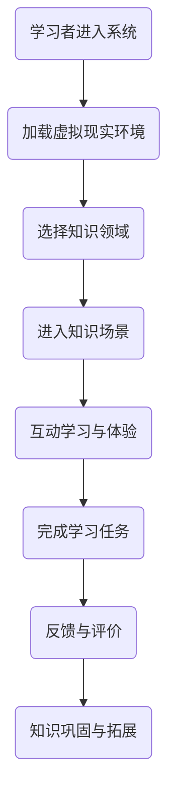

                 

关键词：知识旅行，沉浸式体验，交流机会，教育技术，互动学习

> 摘要：本文将探讨知识旅行作为一种新兴的教育技术，如何通过提供沉浸式的知识体验和交流机会，改变传统学习的模式，激发学习者的兴趣和参与度。

## 1. 背景介绍

在信息化时代，教育技术的创新和进步不断推动着教学方法的变革。传统教育往往依赖于课堂讲授和书本知识，学习过程缺乏互动性和体验感。而随着虚拟现实（VR）、增强现实（AR）和互联网技术的发展，一种新的教育形式——知识旅行逐渐兴起。知识旅行是一种通过数字技术模拟现实场景，将学习者带入特定的历史、文化或科学环境中，提供沉浸式的知识体验和交流机会的教育方式。

### 1.1 传统教育的局限

传统教育模式主要依赖于教师传授知识和学生被动接受。这种方式虽然在一定程度上能够传递信息，但往往缺乏互动性和实践性，难以满足现代教育对个性化、体验式学习的需求。例如，学生在课堂上学习历史，通常只能通过书本和教师的讲述了解历史事件，缺乏身临其境的感觉。这种学习方式难以激发学生的兴趣和主动性。

### 1.2 知识旅行的兴起

知识旅行作为一种新兴的教育形式，通过虚拟现实、增强现实等技术，将学习者带入虚拟的历史、文化或科学场景中。例如，学习者可以通过VR设备体验古代战争的场景，感受古代士兵的生活；或者通过AR技术，在现实环境中添加虚拟的文化元素，如历史建筑或科学实验。这种方式不仅提供了丰富的感官体验，还增强了学习的互动性和参与度。

## 2. 核心概念与联系

### 2.1 虚拟现实与增强现实

虚拟现实（VR）和增强现实（AR）是知识旅行中常用的两种技术。VR通过模拟现实场景，将学习者带入一个完全虚拟的环境；而AR则是在现实环境中叠加虚拟元素，使学习者在真实场景中感受到虚拟内容。这两种技术各有优劣，但都为知识旅行提供了强大的技术支持。

### 2.2 互动学习与沉浸式体验

互动学习和沉浸式体验是知识旅行的核心。通过互动学习，学习者能够积极参与到知识探索过程中，提高学习的主动性和兴趣。而沉浸式体验则通过模拟真实场景，使学习者感受到身临其境的感觉，从而更好地理解和记忆知识。

### 2.3 教育技术与知识的结合

知识旅行不仅是技术的应用，更是教育理念的革新。通过将虚拟现实、增强现实等技术与知识相结合，知识旅行实现了教育内容与技术的深度融合，为学习者提供了更加丰富、多样的学习体验。

## 2.4 Mermaid 流程图

下面是一个简化的知识旅行流程图，展示了从学习者进入知识旅行环境到完成学习任务的全过程。



## 3. 核心算法原理 & 具体操作步骤

### 3.1 算法原理概述

知识旅行的核心算法主要包括虚拟现实环境构建、互动学习机制和沉浸式体验技术。这些算法共同作用，为学习者提供了丰富的知识体验和交流机会。

- **虚拟现实环境构建**：通过计算机图形学和三维建模技术，构建出逼真的虚拟环境，使学习者在视觉、听觉和触觉等方面感受到沉浸式体验。
- **互动学习机制**：设计互动学习活动，如问答、游戏和实验等，使学习者在知识探索过程中能够积极参与，提高学习的主动性和兴趣。
- **沉浸式体验技术**：利用VR和AR技术，模拟真实场景，使学习者在学习过程中能够感受到身临其境的感觉，从而更好地理解和记忆知识。

### 3.2 算法步骤详解

#### 3.2.1 虚拟现实环境构建

1. **场景设计**：根据学习内容，设计虚拟环境的基本框架和场景布局。
2. **三维建模**：使用三维建模软件，对虚拟环境中的物体、人物等进行建模。
3. **渲染技术**：采用渲染技术，为虚拟环境添加光影、材质等细节，使其更加逼真。

#### 3.2.2 互动学习机制

1. **学习活动设计**：根据知识点的难易程度和学生的认知特点，设计互动学习活动。
2. **活动实施**：在虚拟环境中实施互动学习活动，如问答、游戏和实验等。
3. **活动评价**：对学习活动进行评价，以了解学习者的学习效果。

#### 3.2.3 沉浸式体验技术

1. **VR技术**：使用VR设备，如VR头盔、手柄等，模拟真实场景，提供沉浸式体验。
2. **AR技术**：在现实环境中叠加虚拟元素，如历史建筑或科学实验，提供沉浸式体验。

### 3.3 算法优缺点

#### 优点：

- **沉浸式体验**：通过虚拟现实和增强现实技术，提供沉浸式的知识体验，提高学习的兴趣和效果。
- **互动性**：通过设计互动学习活动，增强学习的主动性和参与度。
- **个性化**：根据学习者的兴趣和特点，提供个性化的学习体验。

#### 缺点：

- **技术依赖性**：知识旅行需要依赖虚拟现实和增强现实技术，技术成熟度和稳定性对学习效果有较大影响。
- **成本较高**：虚拟现实和增强现实技术的设备成本较高，对学校和家庭的财力要求较高。

### 3.4 算法应用领域

知识旅行算法广泛应用于教育领域，如历史教学、科学实验和外语学习等。例如，在历史教学中，学习者可以通过虚拟现实技术，体验古代战争的场景，了解历史事件；在科学实验中，学习者可以通过虚拟现实技术，进行虚拟实验，掌握科学原理。

## 4. 数学模型和公式 & 详细讲解 & 举例说明

### 4.1 数学模型构建

在知识旅行中，数学模型主要用于模拟虚拟环境中的物理现象，如光影效果、流体运动等。以下是一个简单的数学模型示例：

$$
\begin{aligned}
    &\text{光强} = I_0 \cdot e^{-\kappa d} \\
    &\text{流体速度} = v_0 + at
\end{aligned}
$$

其中，$I_0$ 为初始光强，$e$ 为自然对数的底数，$\kappa$ 为衰减系数，$d$ 为距离，$v_0$ 为初始速度，$a$ 为加速度，$t$ 为时间。

### 4.2 公式推导过程

#### 光强衰减模型

光强衰减模型用于模拟光线在传播过程中因距离增加而减弱的现象。根据物理学原理，光强与距离之间的关系可以表示为：

$$
I = I_0 \cdot e^{-\kappa d}
$$

其中，$I_0$ 为初始光强，$e$ 为自然对数的底数，$\kappa$ 为衰减系数，$d$ 为距离。

#### 流体运动模型

流体运动模型用于模拟流体在空间中的运动。根据牛顿第二定律，流体速度与加速度之间的关系可以表示为：

$$
v = v_0 + at
$$

其中，$v_0$ 为初始速度，$a$ 为加速度，$t$ 为时间。

### 4.3 案例分析与讲解

以下是一个简单的案例，用于说明如何使用数学模型构建虚拟环境。

#### 案例：模拟阳光照射效果

假设在一个虚拟环境中，有一盏灯位于场景中心，光线垂直向下照射。我们需要根据光强衰减模型，计算不同位置的光照强度。

1. **场景设置**：设置场景中心的光源位置和衰减系数，例如，$\kappa = 0.1$。
2. **计算光照强度**：使用光强衰减模型，计算不同位置的光照强度。例如，计算距离光源 $d = 1$ 米处的光照强度：

   $$
   I = I_0 \cdot e^{-\kappa d} = 100 \cdot e^{-0.1 \cdot 1} \approx 90.12
   $$

3. **渲染效果**：根据计算出的光照强度，调整虚拟环境中的光照效果，使场景更加逼真。

## 5. 项目实践：代码实例和详细解释说明

### 5.1 开发环境搭建

在本案例中，我们将使用Unity游戏引擎和Unity XR插件进行知识旅行的开发。以下是在Windows系统上搭建开发环境的步骤：

1. **安装Unity**：从Unity官网下载并安装Unity Hub。
2. **安装Unity XR插件**：在Unity Hub中创建一个新的Unity项目，然后在项目设置中安装Unity XR插件。
3. **配置VR设备**：根据所使用的VR设备（如Oculus Rift、HTC Vive等），按照设备说明进行配置。

### 5.2 源代码详细实现

以下是一个简单的Unity C#脚本，用于实现光强衰减模型：

```csharp
using UnityEngine;

public class LightIntensity : MonoBehaviour
{
    public float attenuationCoefficient = 0.1f;
    public Light lightComponent;

    private void Update()
    {
        float distance = Vector3.Distance(transform.position, lightComponent.transform.position);
        float intensity = 100f * Mathf.Exp(-attenuationCoefficient * distance);
        lightComponent.intensity = intensity;
    }
}
```

### 5.3 代码解读与分析

上述脚本中，`attenuationCoefficient` 是衰减系数，用于控制光线随距离衰减的速度。`lightComponent` 是光照组件，用于控制虚拟环境中的光照效果。`Update` 函数在每一帧调用，计算当前位置与光源之间的距离，并使用光强衰减模型计算光照强度，最终调整光照组件的强度。

### 5.4 运行结果展示

在Unity编辑器中，我们将上述脚本添加到虚拟环境中的物体上，并配置VR设备。运行项目后，可以看到虚拟环境中光照效果的动态变化，从而实现光强衰减模型。

## 6. 实际应用场景

### 6.1 历史教育

知识旅行在历史教育中的应用非常广泛。例如，学习者可以通过虚拟现实技术，进入古埃及金字塔的内部，了解古代文明的建筑和生活方式。这种沉浸式的学习方式不仅使历史知识更加生动，还能激发学习者的兴趣和好奇心。

### 6.2 科学实验

在科学教育中，知识旅行可以帮助学习者进行虚拟实验，掌握科学原理。例如，学习者可以通过虚拟现实技术，进行化学反应实验，观察反应过程和结果。这种方式不仅安全、方便，还能提高学习者的实践能力和创新思维。

### 6.3 外语学习

在外语学习中，知识旅行可以通过虚拟现实技术，模拟真实语言环境，帮助学习者提高口语和听力能力。例如，学习者可以通过虚拟现实技术，与虚拟人物进行对话练习，从而提高口语表达能力。

## 7. 未来应用展望

随着虚拟现实、增强现实等技术的不断发展和成熟，知识旅行在教育领域的应用前景非常广阔。未来，知识旅行有望实现以下几方面的突破：

### 7.1 个性化学习

通过分析学习者的兴趣和特点，知识旅行系统可以为每个学习者提供个性化的学习体验，使学习过程更加有趣和有效。

### 7.2 跨学科融合

知识旅行可以将不同学科的知识融合在一起，提供跨学科的学习体验。例如，在历史教学中，可以融入地理、文化、艺术等多方面的知识，使学习者获得更加全面的理解。

### 7.3 环境模拟

知识旅行可以通过虚拟现实技术，模拟现实环境，帮助学习者更好地理解抽象概念。例如，在医学教育中，可以模拟人体解剖结构，帮助医学生更好地掌握医学知识。

## 8. 工具和资源推荐

### 8.1 学习资源推荐

- 《虚拟现实技术与应用》：一本全面介绍虚拟现实技术的书籍，适合对VR技术感兴趣的学习者。
- 《增强现实技术基础》：一本介绍AR技术基本原理和应用的书籍，适合对AR技术感兴趣的学习者。

### 8.2 开发工具推荐

- Unity游戏引擎：一款功能强大、易于上手的游戏开发引擎，适合开发知识旅行应用。
- Oculus Rift、HTC Vive等VR设备：适合进行虚拟现实体验的开发者和学习者。

### 8.3 相关论文推荐

- "Virtual Reality in Education: A Comprehensive Review"：一篇关于虚拟现实在教育领域应用的综述性论文。
- "Augmented Reality in Education: A Review of Current Applications and Future Trends"：一篇关于增强现实在教育领域应用的综述性论文。

## 9. 总结：未来发展趋势与挑战

### 9.1 研究成果总结

知识旅行作为一种新兴的教育技术，已经在历史教育、科学实验、外语学习等领域取得了显著的应用成果。通过提供沉浸式的知识体验和交流机会，知识旅行有效提高了学习者的兴趣和参与度。

### 9.2 未来发展趋势

未来，知识旅行将在以下几个方面取得进一步发展：

- **个性化学习**：通过分析学习者的兴趣和特点，提供个性化的学习体验。
- **跨学科融合**：将不同学科的知识融合在一起，提供跨学科的学习体验。
- **环境模拟**：通过虚拟现实技术，模拟现实环境，帮助学习者更好地理解抽象概念。

### 9.3 面临的挑战

知识旅行在发展过程中也面临一些挑战：

- **技术依赖性**：知识旅行需要依赖虚拟现实、增强现实等高端技术，对技术成熟度和稳定性有较高要求。
- **成本较高**：虚拟现实、增强现实设备的成本较高，对学校和家庭的财力要求较高。
- **安全性和隐私保护**：在知识旅行过程中，需要确保学习者的安全和隐私。

### 9.4 研究展望

未来，知识旅行将在以下几个方面展开深入研究：

- **技术优化**：优化虚拟现实、增强现实技术，提高沉浸式体验效果。
- **教学模式创新**：探索知识旅行与其他教育模式的结合，创新教学模式。
- **跨学科研究**：将知识旅行应用于更多学科领域，推动跨学科研究。

## 10. 附录：常见问题与解答

### 问题1：知识旅行需要哪些技术支持？

解答：知识旅行主要依赖虚拟现实（VR）和增强现实（AR）技术。这些技术可以提供沉浸式的学习体验，使学习者感受到身临其境的感觉。

### 问题2：知识旅行是否需要特殊的硬件设备？

解答：知识旅行需要使用特定的硬件设备，如VR头盔、AR眼镜等。这些设备可以帮助学习者更好地体验虚拟环境。

### 问题3：知识旅行是否适用于所有学科？

解答：知识旅行适用于许多学科，如历史、科学、艺术等。通过虚拟现实和增强现实技术，知识旅行可以为不同学科的学习者提供丰富的学习体验。

### 问题4：知识旅行是否可以提高学习效果？

解答：是的，知识旅行通过提供沉浸式的知识体验和交流机会，可以激发学习者的兴趣和参与度，从而提高学习效果。

### 问题5：知识旅行是否会增加学生的学习负担？

解答：知识旅行旨在提高学习者的兴趣和参与度，而不是增加学习负担。通过设计互动性和沉浸性的学习活动，知识旅行可以使学习过程更加有趣和轻松。

[作者：禅与计算机程序设计艺术 / Zen and the Art of Computer Programming]

