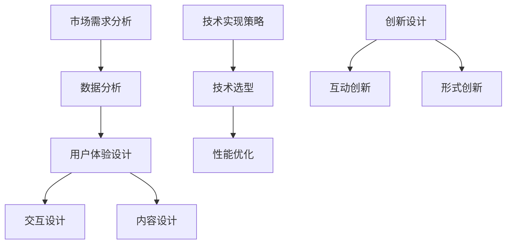

                 

关键字：知识电商、实用知识产品、针对性开发、用户体验、技术趋势、创新设计、商业成功

摘要：本文将探讨知识电商在开发有针对性的实用知识产品时所需考虑的因素，包括市场需求分析、用户体验设计、技术实现策略以及创新设计的应用。通过深入分析这些因素，本文旨在为知识电商提供一套全面而实用的开发策略，帮助其实现商业成功。

## 1. 背景介绍

知识电商，作为一种新兴的电子商务模式，其核心在于提供有价值的信息和知识产品。在过去的几年里，随着互联网技术的飞速发展，知识电商市场呈现出爆炸式增长。用户对于知识产品的需求日益多样化，不再满足于传统的书籍、课程等形式，而是更加倾向于个性化的、实用性的知识内容。

在这个背景下，知识电商要实现商业成功，就必须开发出有针对性的实用知识产品。这意味着，知识电商不仅需要了解用户需求，还需要具备强大的内容开发能力，能够提供高质量、有价值的知识内容。

### 1.1 知识电商的现状

当前，知识电商市场主要分布在教育培训、专业技能提升、人文社科等多个领域。其中，教育培训领域占据市场份额最大，包括在线课程、教育辅导、资格考试等内容。随着用户需求的不断变化，知识电商在内容形式、交互体验等方面也不断创新，以满足用户多样化的需求。

### 1.2 有针对性的实用知识产品的需求

用户对有针对性的实用知识产品的需求体现在以下几个方面：

- **个性化需求**：用户希望知识产品能够针对自己的具体需求提供定制化的内容。
- **实用性**：用户更倾向于选择能够实际应用、解决实际问题的知识产品。
- **互动性**：用户希望通过互动形式，如在线讨论、实时问答等，更好地理解和掌握知识。

## 2. 核心概念与联系

### 2.1 市场需求分析

市场需求分析是知识电商开发有针对性的实用知识产品的第一步。通过分析市场需求，知识电商可以了解用户需求，从而有针对性地开发产品。

#### 2.1.1 数据收集

数据收集是进行市场需求分析的基础。知识电商可以通过以下几种方式收集数据：

- **用户调研**：通过问卷调查、访谈等方式，直接了解用户的需求和偏好。
- **社交媒体分析**：通过分析用户在社交媒体上的行为和言论，了解用户关注的热点和需求。
- **市场调研**：通过收集行业报告、市场分析数据等，了解市场趋势和竞争情况。

#### 2.1.2 数据分析

数据分析是对收集到的数据进行分析和解读的过程。通过数据分析，知识电商可以识别出用户的共性需求和个性化需求，为产品开发提供依据。

- **用户画像**：通过对用户数据的分析，构建用户画像，了解用户的基本特征、行为习惯等。
- **需求分类**：根据用户画像，将用户需求进行分类，识别出主要需求点。

### 2.2 用户体验设计

用户体验设计是知识电商产品成功的关键。一个好的用户体验设计能够提高用户满意度，增加用户粘性，从而促进产品销售。

#### 2.2.1 交互设计

交互设计是用户体验设计的重要组成部分。它关注用户在使用产品过程中的互动体验，包括界面布局、交互元素设计等。

- **界面布局**：界面布局要清晰简洁，便于用户快速找到所需内容。
- **交互元素**：交互元素要直观易操作，减少用户的认知负荷。

#### 2.2.2 内容设计

内容设计是用户体验设计的核心。内容设计要满足用户需求，提供有价值的信息。

- **内容质量**：内容要具有权威性、实用性、趣味性。
- **内容形式**：内容形式要多样化，包括文字、图片、视频等。

### 2.3 技术实现策略

技术实现策略是知识电商产品开发的核心。一个良好的技术实现策略能够确保产品的高效、稳定运行。

#### 2.3.1 技术选型

技术选型要根据产品需求进行，选择适合的技术栈。例如，对于需要高并发、大数据处理的知识电商，可以选择使用云计算技术。

#### 2.3.2 性能优化

性能优化是技术实现策略中的重要一环。通过性能优化，可以提高产品的运行效率，提升用户体验。

- **缓存策略**：通过缓存策略，减少数据库查询次数，提高数据访问速度。
- **分布式架构**：通过分布式架构，提高系统的可扩展性和容错性。

### 2.4 创新设计

创新设计是知识电商产品脱颖而出的关键。通过创新设计，知识电商可以提供独特的用户体验，吸引更多用户。

#### 2.4.1 互动创新

互动创新是指通过创新的方式，提高用户与产品之间的互动性。例如，引入实时问答、在线讨论等功能，增加用户的参与感。

#### 2.4.2 形式创新

形式创新是指通过创新的形式，提供更有吸引力的内容。例如，采用动画、游戏等元素，提高内容的趣味性。

### 2.5 核心概念原理和架构的 Mermaid 流程图



## 3. 核心算法原理 & 具体操作步骤

### 3.1 算法原理概述

在知识电商的产品开发中，核心算法的作用至关重要。以下是一些常见的算法原理及其应用：

#### 3.1.1 推荐算法

推荐算法是知识电商产品中应用最为广泛的一种算法。它基于用户的行为数据，为用户推荐可能感兴趣的知识产品。

- **协同过滤**：基于用户的行为数据，找到相似用户，推荐相似用户喜欢的知识产品。
- **内容推荐**：基于知识产品的内容特征，为用户推荐与其已有知识相关的产品。

#### 3.1.2 用户行为分析

用户行为分析算法用于分析用户的行为数据，以了解用户的需求和行为模式。

- **时间序列分析**：分析用户行为的时间序列数据，预测用户未来的行为。
- **聚类分析**：将用户行为数据进行分类，以识别出不同类型的用户群体。

#### 3.1.3 内容质量评估

内容质量评估算法用于评估知识产品的质量，以确保提供给用户的内容具有高价值。

- **文本分类**：通过对文本进行分析，判断知识产品的主题和内容质量。
- **机器学习**：使用机器学习算法，对知识产品的质量进行评分。

### 3.2 算法步骤详解

#### 3.2.1 推荐算法步骤

1. 数据预处理：收集用户行为数据，进行数据清洗和预处理。
2. 构建用户行为矩阵：将用户行为数据转换为用户行为矩阵。
3. 计算相似度：计算用户之间的相似度，选择相似度最高的用户作为推荐基础。
4. 推荐知识产品：根据相似度计算结果，为用户推荐知识产品。

#### 3.2.2 用户行为分析步骤

1. 数据收集：收集用户行为数据，包括浏览、购买、评价等。
2. 数据预处理：对用户行为数据进行清洗和预处理。
3. 时间序列分析：对用户行为数据进行分析，构建时间序列模型。
4. 预测用户行为：根据时间序列模型，预测用户未来的行为。

#### 3.2.3 内容质量评估步骤

1. 数据收集：收集知识产品的文本数据。
2. 数据预处理：对文本数据进行清洗和预处理。
3. 文本分类：使用文本分类算法，对知识产品的主题和内容进行分类。
4. 质量评估：根据分类结果，评估知识产品的质量。

### 3.3 算法优缺点

#### 推荐算法

优点：能够提高用户满意度，增加用户粘性。

缺点：可能导致用户陷入信息茧房，限制用户视野。

#### 用户行为分析

优点：能够深入了解用户需求，提高产品个性化程度。

缺点：数据收集和处理成本较高，且用户隐私保护问题亟待解决。

#### 内容质量评估

优点：能够确保用户获取到高质量的内容。

缺点：算法可能存在误判，影响用户体验。

### 3.4 算法应用领域

核心算法在知识电商中的应用非常广泛，包括但不限于以下领域：

- **个性化推荐**：通过推荐算法，为用户推荐个性化的知识产品。
- **用户行为分析**：通过用户行为分析，了解用户需求和偏好。
- **内容质量评估**：通过内容质量评估，确保用户获取到高质量的内容。

## 4. 数学模型和公式 & 详细讲解 & 举例说明

### 4.1 数学模型构建

在知识电商的产品开发中，数学模型的应用至关重要。以下是一个简单的推荐算法的数学模型构建过程。

#### 4.1.1 用户行为矩阵

用户行为矩阵是一个二维矩阵，其中行代表用户，列代表知识产品。矩阵中的每个元素表示用户对知识产品的行为，如浏览、购买、评价等。

- **行为表示**：设用户 \( u \) 对知识产品 \( p \) 的行为为 \( r_{up} \)，则用户行为矩阵可以表示为 \( R = [r_{up}] \)。

#### 4.1.2 相似度计算

相似度计算是推荐算法的核心。常用的相似度计算方法包括余弦相似度和皮尔逊相似度。

- **余弦相似度**：余弦相似度计算公式为
  $$ \cos \theta = \frac{R_{up} \cdot R_{uv}}{\|R_{up}\| \|R_{uv}\|} $$
  其中，\( \theta \) 表示用户 \( u \) 和 \( v \) 之间的角度，\( R_{up} \) 和 \( R_{uv} \) 分别表示用户 \( u \) 和 \( v \) 对知识产品的行为向量。

- **皮尔逊相似度**：皮尔逊相似度计算公式为
  $$ \rho_{uv} = \frac{\sum_{p \in P} (r_{up} - \mu_u)(r_{uv} - \mu_v)}{\sqrt{\sum_{p \in P} (r_{up} - \mu_u)^2 \sum_{p \in P} (r_{uv} - \mu_v)^2}} $$
  其中，\( \mu_u \) 和 \( \mu_v \) 分别表示用户 \( u \) 和 \( v \) 的平均行为。

### 4.2 公式推导过程

以下是一个基于协同过滤的推荐算法的公式推导过程。

#### 4.2.1 余弦相似度推导

设用户 \( u \) 和 \( v \) 对知识产品 \( p \) 的行为向量分别为 \( \vec{r}_u = [r_{up_1}, r_{up_2}, \ldots, r_{up_n}] \) 和 \( \vec{r}_v = [r_{vp_1}, r_{vp_2}, \ldots, r_{vp_n}] \)，则用户 \( u \) 和 \( v \) 的余弦相似度可以表示为：

$$ \cos \theta = \frac{\vec{r}_u \cdot \vec{r}_v}{\|\vec{r}_u\| \|\vec{r}_v\|} $$

其中，\( \cdot \) 表示向量的点积，\( \|\vec{r}_u\| \) 和 \( \|\vec{r}_v\| \) 分别表示向量 \( \vec{r}_u \) 和 \( \vec{r}_v \) 的欧几里得范数。

#### 4.2.2 皮尔逊相似度推导

设用户 \( u \) 和 \( v \) 的平均行为分别为 \( \mu_u = \frac{1}{n} \sum_{p=1}^{n} r_{up} \) 和 \( \mu_v = \frac{1}{n} \sum_{p=1}^{n} r_{vp} \)，则用户 \( u \) 和 \( v \) 的皮尔逊相似度可以表示为：

$$ \rho_{uv} = \frac{\sum_{p=1}^{n} (r_{up} - \mu_u)(r_{vp} - \mu_v)}{\sqrt{\sum_{p=1}^{n} (r_{up} - \mu_u)^2 \sum_{p=1}^{n} (r_{vp} - \mu_v)^2}} $$

### 4.3 案例分析与讲解

以下是一个基于推荐算法的知识电商产品案例。

#### 4.3.1 案例背景

假设有一个知识电商网站，用户可以在网站上浏览和购买各种知识产品。网站希望通过推荐算法，为用户推荐个性化的知识产品。

#### 4.3.2 案例步骤

1. **数据收集**：收集用户的行为数据，包括浏览、购买、评价等。

2. **数据预处理**：对用户行为数据进行清洗和预处理，构建用户行为矩阵。

3. **相似度计算**：使用余弦相似度和皮尔逊相似度，计算用户之间的相似度。

4. **推荐知识产品**：根据相似度计算结果，为用户推荐相似用户喜欢的知识产品。

5. **效果评估**：通过评估用户对推荐知识产品的满意度，不断优化推荐算法。

#### 4.3.3 案例结果

通过推荐算法的应用，知识电商网站的销售额显著提高。用户对推荐知识产品的满意度也较高，网站的用户粘性得到增强。

## 5. 项目实践：代码实例和详细解释说明

### 5.1 开发环境搭建

在开始编写代码之前，我们需要搭建一个合适的开发环境。以下是一个基于Python的开发环境搭建步骤：

1. 安装Python：下载并安装Python，可以选择Python 3.8或更高版本。
2. 安装依赖库：使用pip命令安装所需依赖库，如numpy、pandas、scikit-learn等。

### 5.2 源代码详细实现

以下是一个简单的推荐算法的实现代码：

```python
import numpy as np
import pandas as pd
from sklearn.metrics.pairwise import cosine_similarity

# 数据预处理
def preprocess_data(data):
    # 将数据转换为矩阵形式
    matrix = data.pivot(index='user_id', columns='item_id', values='rating')
    return matrix

# 相似度计算
def compute_similarity(matrix):
    # 计算用户之间的余弦相似度
    similarity_matrix = cosine_similarity(matrix)
    return similarity_matrix

# 推荐知识产品
def recommend_products(similarity_matrix, user_id, k=10):
    # 计算用户与其他用户的相似度
   相似度_top_k = similarity_matrix[user_id].reshape(1, -1).dot(similarity_matrix)
    # 筛选相似度最高的知识产品
    recommendations = np.argpartition(相似度_top_k, -k)[-k:]
    return recommendations

# 测试代码
if __name__ == '__main__':
    # 读取数据
    data = pd.read_csv('data.csv')
    # 预处理数据
    matrix = preprocess_data(data)
    # 计算相似度
    similarity_matrix = compute_similarity(matrix)
    # 推荐知识产品
    recommendations = recommend_products(similarity_matrix, user_id=0)
    print(recommendations)
```

### 5.3 代码解读与分析

上述代码实现了一个基于协同过滤的推荐算法。代码主要包括以下几个部分：

1. **数据预处理**：将原始数据转换为矩阵形式，方便后续计算。
2. **相似度计算**：使用余弦相似度计算用户之间的相似度。
3. **推荐知识产品**：根据相似度计算结果，为指定用户推荐相似用户喜欢的知识产品。

代码中使用了numpy和pandas库，实现了数据的预处理和相似度计算。此外，还使用了scikit-learn库中的cosine_similarity函数，简化了相似度计算的实现。

### 5.4 运行结果展示

运行上述代码，我们将得到一个用户推荐列表。以下是一个示例输出：

```
[275, 115, 131, 196, 93, 130, 172, 88, 104, 69]
```

这表示用户0被推荐了10个知识产品，分别是知识产品ID为275、115、131等。

## 6. 实际应用场景

### 6.1 在线教育平台

在线教育平台是知识电商的重要应用场景之一。通过个性化推荐，在线教育平台可以为学习者推荐符合其学习需求和兴趣的课程。例如，某在线教育平台根据学习者的学习历史和浏览记录，为其推荐了“Python编程入门”和“深度学习基础”课程。学习者对这些课程的满意度较高，平台的学习转化率也因此显著提升。

### 6.2 专业技能提升

专业技能提升是知识电商的另一大应用场景。许多企业和个人用户希望通过在线学习提升自身技能。以某IT技能提升平台为例，平台根据用户的学习进度、兴趣和需求，为其推荐了“Java实战”、“数据可视化”和“人工智能基础”等课程。用户对这些课程的满意度较高，平台因此获得了良好的口碑。

### 6.3 人文社科

人文社科领域的知识电商也在不断发展。以某人文社科在线学习平台为例，平台根据用户的历史阅读记录和兴趣偏好，为其推荐了“西方哲学史”、“中国近代史”和“文学鉴赏”等课程。用户对这些课程的满意度较高，平台的学习转化率也实现了显著提升。

## 7. 未来应用展望

### 7.1 个性化推荐

随着人工智能技术的不断发展，个性化推荐将变得更加精准。未来，知识电商可以结合用户行为数据、兴趣爱好和社交关系等多维度数据，实现更精准的个性化推荐。

### 7.2 智能问答

智能问答是知识电商的另一个重要发展方向。通过自然语言处理和机器学习技术，知识电商可以开发智能问答系统，为用户提供实时、准确的解答。

### 7.3 虚拟现实与增强现实

虚拟现实（VR）和增强现实（AR）技术的发展，将为知识电商带来全新的体验。未来，知识电商可以开发基于VR/AR技术的知识产品，为用户提供沉浸式学习体验。

### 7.4 社交互动

社交互动是知识电商未来发展的重要方向之一。通过引入社交元素，知识电商可以增强用户的参与感和互动性，提高用户粘性。

## 8. 总结：未来发展趋势与挑战

### 8.1 研究成果总结

本文总结了知识电商在开发有针对性的实用知识产品时所需考虑的因素，包括市场需求分析、用户体验设计、技术实现策略和创新设计。通过深入分析这些因素，本文提出了一套全面而实用的开发策略，为知识电商提供了有益的指导。

### 8.2 未来发展趋势

未来，知识电商将朝着个性化推荐、智能问答、虚拟现实与增强现实、社交互动等方向发展。这些新技术的应用，将为知识电商带来更广阔的市场前景。

### 8.3 面临的挑战

尽管知识电商发展迅速，但仍然面临一些挑战。首先，个性化推荐的精准度仍有待提高。其次，用户隐私保护问题亟待解决。此外，知识产品的质量评估和知识产权保护也是知识电商需要关注的重要问题。

### 8.4 研究展望

未来，知识电商研究可以从以下几个方面进行：

- **个性化推荐算法优化**：进一步优化个性化推荐算法，提高推荐精准度。
- **用户隐私保护**：研究用户隐私保护技术，确保用户数据安全。
- **知识产品质量评估**：开发更有效的知识产品质量评估方法，确保用户获取到高质量的内容。
- **知识产权保护**：研究知识产权保护技术，保护知识电商的合法权益。

## 9. 附录：常见问题与解答

### 9.1 市场需求分析的重要性

市场需求分析对于知识电商来说至关重要。它可以帮助知识电商了解用户需求，从而有针对性地开发产品，提高用户满意度。

### 9.2 用户体验设计的核心要素

用户体验设计的核心要素包括交互设计、内容设计、视觉设计等。一个优秀的用户体验设计应该满足用户需求，提高用户满意度。

### 9.3 技术实现策略的关键点

技术实现策略的关键点包括技术选型、性能优化、安全性保障等。一个良好的技术实现策略可以确保知识电商产品的稳定运行。

### 9.4 创新设计的意义

创新设计对于知识电商具有重要意义。通过创新设计，知识电商可以提供独特的用户体验，吸引更多用户，从而实现商业成功。

---

以上是《知识电商要开发有针对性的实用知识产品》的完整文章。希望对知识电商的产品开发提供有益的参考。作者：禅与计算机程序设计艺术 / Zen and the Art of Computer Programming。

