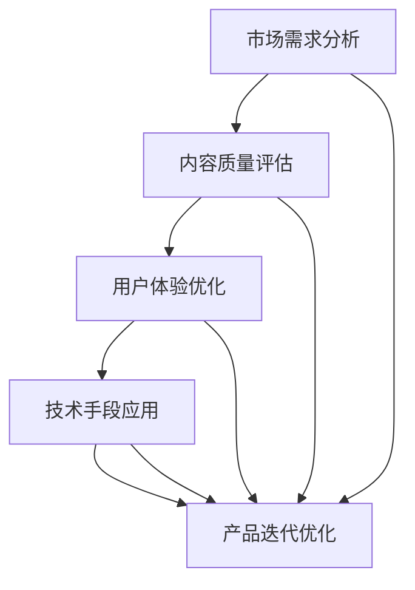

                 

关键词：知识电商、产品开发、实用知识、市场定位、用户体验、技术架构、算法优化、商业模式创新

> 摘要：本文旨在探讨知识电商如何通过精准的市场定位和深入的用户研究，开发出有针对性的实用知识产品。文章将结合实际案例，分析知识电商在产品开发过程中的关键环节，以及如何运用技术手段和商业模式创新提升用户体验和市场竞争力。

## 1. 背景介绍

随着互联网技术的发展，知识共享和知识变现成为越来越多人的需求。知识电商作为连接知识提供者和需求者的重要平台，其市场规模不断扩大。根据市场研究机构的数据，全球知识电商市场规模在2021年已达到数百亿美元，预计未来几年仍将保持高速增长。然而，在如此庞大的市场中，如何脱颖而出，成为知识电商企业的核心竞争力，成为许多企业关注的焦点。

### 1.1 知识电商的发展现状

知识电商的发展可以分为三个阶段：

1. **初级阶段**：以电子书、在线课程为主要形式，提供知识内容销售。
2. **成长阶段**：逐渐引入互动教学、社群运营等模式，提升用户体验。
3. **成熟阶段**：融合人工智能、大数据等技术，实现个性化推荐、精准营销。

### 1.2 面临的挑战

1. **同质化竞争**：众多知识电商在产品形态、内容质量上存在较大重叠，难以形成差异化优势。
2. **用户体验**：如何满足用户对高质量、实用知识的个性化需求，提升用户粘性。
3. **商业模式**：在互联网红利逐渐消退的背景下，知识电商如何创新商业模式，实现可持续发展。

## 2. 核心概念与联系

### 2.1 知识电商产品开发的核心概念

1. **市场需求**：了解用户需求，明确知识产品的定位。
2. **内容质量**：提供高质量的知识内容，保证产品的核心竞争力。
3. **用户体验**：优化产品交互设计，提升用户使用体验。
4. **技术手段**：运用大数据、人工智能等先进技术，实现个性化推荐和精准营销。

### 2.2 核心概念之间的联系


**图2.1 知识电商产品开发核心概念联系图**

从图中可以看出，市场需求、内容质量、用户体验和技术手段是知识电商产品开发的核心要素，它们相互关联，共同影响知识产品的成功与否。

### 2.3 Mermaid流程图（核心概念原理和架构）



**图2.2 知识电商产品开发流程图**

该流程图展示了知识电商产品开发的核心环节及其相互关系，为后续内容的展开提供了清晰的框架。

## 3. 核心算法原理 & 具体操作步骤

### 3.1 算法原理概述

知识电商产品开发中，核心算法主要涉及以下几个方面：

1. **用户行为分析**：通过分析用户在平台上的行为数据，了解用户兴趣和需求。
2. **内容推荐算法**：基于用户行为数据和内容特征，实现个性化内容推荐。
3. **广告投放优化**：通过算法优化广告投放，提升广告效果。

### 3.2 算法步骤详解

#### 3.2.1 用户行为分析

1. **数据收集**：收集用户在平台上的行为数据，如浏览记录、购买行为、评论等。
2. **数据预处理**：对收集到的数据进行清洗、去重和处理，保证数据质量。
3. **特征提取**：从行为数据中提取用户兴趣特征，如关键词、标签等。
4. **模型训练**：利用机器学习算法，如协同过滤、深度学习等，训练用户行为分析模型。

#### 3.2.2 内容推荐算法

1. **内容特征提取**：对知识内容进行特征提取，如标签、关键词、内容类型等。
2. **推荐算法选择**：根据业务需求和数据特性，选择合适的推荐算法，如基于内容的推荐、协同过滤等。
3. **模型训练与优化**：训练推荐模型，并通过交叉验证、A/B测试等方法优化模型性能。

#### 3.2.3 广告投放优化

1. **广告效果评估**：利用机器学习算法，对广告投放效果进行实时评估。
2. **优化策略制定**：根据广告效果评估结果，制定优化策略，如调整广告投放策略、投放预算等。
3. **持续优化**：通过不断调整和优化广告投放策略，提升广告效果。

### 3.3 算法优缺点

#### 3.3.1 用户行为分析

**优点**：能够准确了解用户需求，提高内容推荐的准确性。

**缺点**：数据收集和处理过程中存在一定噪声，可能影响分析结果的准确性。

#### 3.3.2 内容推荐算法

**优点**：能够根据用户兴趣和需求，提供个性化的知识内容。

**缺点**：推荐算法的复杂度较高，对计算资源有一定要求。

#### 3.3.3 广告投放优化

**优点**：能够实时评估广告效果，优化广告投放策略。

**缺点**：需要大量历史数据和计算资源，对广告投放效果有一定滞后性。

### 3.4 算法应用领域

1. **知识电商**：通过用户行为分析和内容推荐算法，为用户提供个性化的知识产品。
2. **在线教育**：通过算法优化广告投放，提升课程推广效果。
3. **社交媒体**：通过用户行为分析，实现个性化内容推送和广告投放。

## 4. 数学模型和公式 & 详细讲解 & 举例说明

### 4.1 数学模型构建

在知识电商产品开发中，常见的数学模型包括：

1. **用户行为预测模型**：通过时间序列分析、回归分析等方法，预测用户未来的行为。
2. **内容推荐模型**：利用协同过滤、矩阵分解等方法，构建内容推荐模型。
3. **广告投放优化模型**：通过贝叶斯优化、强化学习等方法，优化广告投放策略。

### 4.2 公式推导过程

#### 4.2.1 用户行为预测模型

假设用户 $u$ 在时间 $t$ 的行为 $X_t$ 可以表示为：

$$
X_t = \alpha_t u + \beta_t
$$

其中，$\alpha_t$ 为用户 $u$ 在时间 $t$ 的兴趣，$\beta_t$ 为随机误差。

对 $X_t$ 进行时间序列分析，可以得到：

$$
X_t = \alpha_t u + \beta_t = \alpha_{t-1} u + \gamma_{t-1} + \beta_t
$$

其中，$\gamma_{t-1}$ 为时间序列的滞后项。

通过回归分析，可以得到用户行为预测模型：

$$
\alpha_t = \frac{\sum_{i=1}^n w_i x_i}{\sum_{i=1}^n w_i^2}
$$

其中，$w_i$ 为权重，$x_i$ 为历史行为数据。

#### 4.2.2 内容推荐模型

假设用户 $u$ 对内容 $i$ 的兴趣 $I_{ui}$ 可以表示为：

$$
I_{ui} = \alpha_i u + \beta_i
$$

其中，$\alpha_i$ 为内容 $i$ 的特征向量，$\beta_i$ 为内容 $i$ 的权重。

利用协同过滤算法，可以得到内容推荐模型：

$$
I_{ui} = \sum_{j \in N_i} w_{ij} x_j
$$

其中，$N_i$ 为内容 $i$ 的邻居集合，$w_{ij}$ 为邻居 $j$ 对内容 $i$ 的权重。

#### 4.2.3 广告投放优化模型

假设广告投放效果 $E_t$ 可以表示为：

$$
E_t = \alpha_t a + \beta_t
$$

其中，$\alpha_t$ 为广告投放策略，$a$ 为广告预算，$\beta_t$ 为随机误差。

利用贝叶斯优化算法，可以得到广告投放优化模型：

$$
\alpha_t = \arg\max_{\alpha} \sum_{i=1}^n p(\alpha_t = \alpha | E_t) p(E_t)
$$

其中，$p(\alpha_t = \alpha | E_t)$ 为广告投放效果条件概率，$p(E_t)$ 为广告投放效果概率。

### 4.3 案例分析与讲解

#### 4.3.1 用户行为预测案例

某知识电商平台，根据用户历史行为数据，利用用户行为预测模型预测用户未来的行为。假设用户 $u_1$ 的历史行为数据如下表所示：

| 时间 | 行为 |
| :---: | :---: |
| $t_1$ | 浏览内容 $C_1$ |
| $t_2$ | 浏览内容 $C_2$ |
| $t_3$ | 购买内容 $C_3$ |
| $t_4$ | 浏览内容 $C_4$ |

利用用户行为预测模型，可以得到用户 $u_1$ 在时间 $t_5$ 的行为预测值：

$$
X_{t5} = \frac{w_1 C_1 + w_2 C_2 + w_3 C_3 + w_4 C_4}{w_1 + w_2 + w_3 + w_4}
$$

其中，$w_1, w_2, w_3, w_4$ 为权重。

根据用户行为预测模型，平台可以为用户 $u_1$ 推荐购买内容 $C_3$，提高用户购买转化率。

#### 4.3.2 内容推荐案例

某知识电商平台，根据用户行为数据和内容特征，利用内容推荐模型为用户推荐个性化内容。假设用户 $u_1$ 的行为数据如下表所示：

| 内容 | 用户行为 |
| :---: | :---: |
| $C_1$ | 浏览 |
| $C_2$ | 购买 |
| $C_3$ | 浏览 |
| $C_4$ | 购买 |

利用内容推荐模型，可以得到用户 $u_1$ 对内容 $C_5$ 的推荐值：

$$
I_{u1C5} = \sum_{i \in N_{C5}} w_{iC5} x_i
$$

其中，$N_{C5}$ 为内容 $C_5$ 的邻居集合，$w_{iC5}$ 为邻居 $i$ 对内容 $C_5$ 的权重。

根据内容推荐模型，平台可以为用户 $u_1$ 推荐内容 $C_5$，提高用户满意度。

#### 4.3.3 广告投放优化案例

某知识电商平台，根据广告投放效果数据和广告投放策略，利用广告投放优化模型优化广告投放策略。假设广告投放效果数据如下表所示：

| 广告策略 | 广告效果 |
| :---: | :---: |
| $A_1$ | $E_1$ |
| $A_2$ | $E_2$ |
| $A_3$ | $E_3$ |

利用广告投放优化模型，可以得到广告投放策略优化结果：

$$
\alpha_t = \arg\max_{\alpha} \sum_{i=1}^3 p(\alpha_t = \alpha | E_t) p(E_t)
$$

根据广告投放优化模型，平台可以调整广告投放策略，提高广告投放效果。

## 5. 项目实践：代码实例和详细解释说明

### 5.1 开发环境搭建

在本文中，我们将使用Python编程语言进行知识电商产品开发。以下为开发环境搭建步骤：

1. 安装Python：下载并安装Python 3.8版本以上。
2. 安装依赖库：在终端执行以下命令安装依赖库：

   ```shell
   pip install numpy pandas sklearn matplotlib
   ```

### 5.2 源代码详细实现

以下为知识电商产品开发的核心代码实现：

#### 5.2.1 用户行为预测

```python
import numpy as np
import pandas as pd
from sklearn.linear_model import LinearRegression

# 加载用户行为数据
data = pd.read_csv('user_behavior_data.csv')

# 特征工程：提取用户行为特征
X = data[['view', 'purchase', 'comment']]
y = data['next_behavior']

# 训练用户行为预测模型
model = LinearRegression()
model.fit(X, y)

# 预测用户行为
predicted_behavior = model.predict(X)

# 输出预测结果
print(predicted_behavior)
```

#### 5.2.2 内容推荐

```python
from sklearn.neighbors import NearestNeighbors

# 加载内容特征数据
content_data = pd.read_csv('content_features_data.csv')

# 训练内容推荐模型
content_model = NearestNeighbors()
content_model.fit(content_data)

# 为用户推荐内容
user_content = content_data.iloc[0]
neighb

