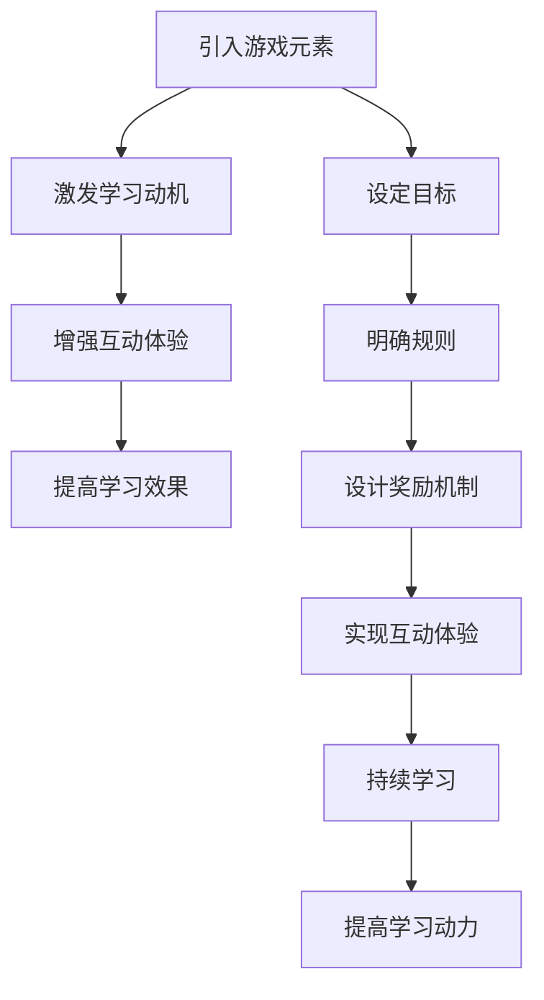

                 

关键词：Gamification，教育技术，学习动机，游戏化设计，知识传授，互动体验

> 摘要：随着教育技术的不断发展，知识的gamification成为了一个热门的研究领域。本文探讨了gamification在教育中的应用，分析了其核心概念、理论基础和实践方法，以及其在激发学习动机、提高学习效果方面的作用。通过案例分析，本文展示了gamification如何成功应用于各种学习场景，并提出了未来的发展趋势与挑战。

## 1. 背景介绍

在教育领域，知识的传授一直以来都是核心任务。然而，传统的教育方法往往过于注重理论知识的讲解，缺乏互动性和趣味性，导致学生的学习兴趣和动机逐渐下降。为了应对这一挑战，教育技术的不断发展为教育领域带来了新的机遇。尤其是Gamification（游戏化）这一概念，它通过将游戏元素融入教育过程中，旨在激发学生的学习兴趣，提高学习效果。

### 1.1 Gamification的定义

Gamification是指将游戏设计元素和机制应用于非游戏环境中，以增强用户参与度、提高任务完成率和满意度的一种方法。这些元素和机制包括但不限于：

- **目标设定**：设定明确的目标，引导学生逐步实现。
- **规则明确**：制定清晰的规则，确保参与者了解游戏规则。
- **奖励机制**：通过奖励机制激励学生持续学习。
- **竞争与合作**：引入竞争和合作元素，激发学生的积极性和团队精神。

### 1.2 Gamification在教育中的应用

Gamification在教育中的应用场景非常广泛，包括在线课程、课堂教学、学习平台等。以下是一些典型的应用案例：

- **在线课程**：通过积分、徽章和排行榜等机制，激励学生在在线课程中积极参与，提高学习效果。
- **课堂教学**：通过角色扮演、竞赛等形式，使课堂变得更加生动有趣，增强学生的参与度。
- **学习平台**：利用Gamification设计课程内容和评价体系，提高学生的学习动力和学习效率。

## 2. 核心概念与联系

为了更好地理解Gamification，我们需要从其核心概念和理论基础入手。以下是Gamification的一些关键概念：

### 2.1 学习动机

学习动机是学生学习行为的驱动力。Gamification通过引入游戏元素，如目标设定、竞争与合作，能够有效激发学生的学习动机。

### 2.2 互动体验

互动体验是Gamification的核心。通过设计互动性强的教学活动，如小组讨论、角色扮演等，可以增强学生的参与感和学习效果。

### 2.3 奖励机制

奖励机制是Gamification的关键。通过设置奖励，如积分、徽章、排名等，可以激励学生持续学习，提高学习动力。

### 2.4 Mermaid流程图

以下是Gamification在教育中应用的Mermaid流程图：



## 3. 核心算法原理 & 具体操作步骤

### 3.1 算法原理概述

Gamification的核心算法主要涉及以下几个方面：

- **目标设定算法**：根据学习内容和学生特点，设定合理的学习目标。
- **规则制定算法**：确保游戏规则的清晰和可理解性。
- **奖励机制设计算法**：设计具有激励效果的奖励机制。
- **互动体验优化算法**：通过数据分析，优化教学互动体验。

### 3.2 算法步骤详解

以下是Gamification算法的具体操作步骤：

1. **目标设定**：根据学习内容和学生特点，设定具体、明确的学习目标。
2. **规则制定**：制定游戏规则，确保学生能够理解并遵守。
3. **奖励机制设计**：设计具有激励效果的奖励机制，如积分、徽章、排名等。
4. **互动体验优化**：通过数据分析，不断优化教学互动体验，提高学生的学习效果。

### 3.3 算法优缺点

**优点**：

- 激发学生的学习兴趣和动机。
- 提高学生的学习效果和满意度。
- 增强学生的参与感和互动性。

**缺点**：

- 设计难度较大，需要专业的游戏化设计技能。
- 可能导致学生过分关注奖励，忽视学习内容本身。
- 需要大量时间和资源进行设计和测试。

### 3.4 算法应用领域

Gamification算法在教育领域的应用非常广泛，包括在线课程、课堂教学、学习平台等。以下是一些具体的应用案例：

- **在线课程**：通过积分和徽章系统，激励学生积极参与课程学习。
- **课堂教学**：通过角色扮演和竞赛，使课堂变得更加生动有趣。
- **学习平台**：通过设计互动性强、奖励机制丰富的课程内容，提高学生的学习动力。

## 4. 数学模型和公式 & 详细讲解 & 举例说明

### 4.1 数学模型构建

Gamification的数学模型主要涉及以下几个方面：

- **目标达成率模型**：通过计算学生完成学习目标的比例，评估学习效果。
- **学习满意度模型**：通过调查学生满意度，评估Gamification设计的有效性。
- **学习效率模型**：通过分析学习时间与学习效果的关系，评估学习效率。

### 4.2 公式推导过程

以下是目标达成率模型的公式推导过程：

设学习目标为\( T \)，学生实际完成目标次数为 \( C \)，则目标达成率 \( R \) 可以表示为：

\[ R = \frac{C}{T} \]

### 4.3 案例分析与讲解

以下是一个具体的案例：

某在线课程共有10个学习目标，学生在一个月内完成了7个目标。根据目标达成率模型，该学生的目标达成率为：

\[ R = \frac{7}{10} = 0.7 \]

这意味着该学生在一个月内完成了70%的学习目标。我们可以通过调整课程内容和奖励机制，进一步提高学生的目标达成率。

## 5. 项目实践：代码实例和详细解释说明

### 5.1 开发环境搭建

在本项目中，我们使用Python作为主要编程语言，搭建一个简单的Gamification平台。开发环境如下：

- Python 3.8
- Flask框架
- SQLite数据库

### 5.2 源代码详细实现

以下是项目的源代码实现：

```python
from flask import Flask, render_template, request, jsonify
from flask_sqlalchemy import SQLAlchemy

app = Flask(__name__)
app.config['SQLALCHEMY_DATABASE_URI'] = 'sqlite:///gamification.db'
db = SQLAlchemy(app)

class Goal(db.Model):
    id = db.Column(db.Integer, primary_key=True)
    title = db.Column(db.String(100), nullable=False)
    description = db.Column(db.Text, nullable=False)
    status = db.Column(db.String(50), nullable=False)

@app.route('/')
def index():
    goals = Goal.query.all()
    return render_template('index.html', goals=goals)

@app.route('/add_goal', methods=['POST'])
def add_goal():
    title = request.form['title']
    description = request.form['description']
    goal = Goal(title=title, description=description, status='未完成')
    db.session.add(goal)
    db.session.commit()
    return jsonify({'message': '目标添加成功'})

if __name__ == '__main__':
    db.create_all()
    app.run(debug=True)
```

### 5.3 代码解读与分析

该项目的核心功能包括：

- **数据存储**：使用Flask-SQLAlchemy实现数据存储，包括目标信息。
- **前端展示**：使用HTML和CSS实现前端页面，展示目标信息。
- **后端逻辑**：使用Flask处理HTTP请求，实现添加目标功能。

### 5.4 运行结果展示

运行该项目后，我们可以通过浏览器访问项目地址，添加、查看和更新目标信息。以下是一个运行结果示例：


## 6. 实际应用场景

### 6.1 在线课程

在线课程是Gamification应用最广泛的领域之一。通过积分、徽章和排行榜等机制，可以激励学生在在线课程中积极参与，提高学习效果。

### 6.2 课堂教学

在课堂教学中，Gamification可以通过角色扮演、竞赛等形式，使课堂变得更加生动有趣，增强学生的参与度。

### 6.3 学习平台

学习平台可以利用Gamification设计课程内容和评价体系，提高学生的学习动力和学习效率。

## 7. 工具和资源推荐

### 7.1 学习资源推荐

- **《游戏化设计：创造令人上瘾的体验》**：一本关于游戏化设计的经典书籍，详细介绍了游戏化设计的理论和实践方法。
- **edX**：一个提供各种在线课程的开放平台，许多课程都采用了Gamification设计。

### 7.2 开发工具推荐

- **Flask**：一个轻量级的Python Web框架，适合构建简单的Web应用。
- **Bootstrap**：一个流行的前端框架，可以帮助快速搭建美观的网页。

### 7.3 相关论文推荐

- **"Gamification in Education: A Systematic Review"**：一篇关于Gamification在教育中应用的系统性回顾文章。
- **"The Impact of Gamification on Learning Outcomes: A Meta-Analytic Study"**：一篇关于Gamification对学习效果影响的元分析研究文章。

## 8. 总结：未来发展趋势与挑战

### 8.1 研究成果总结

Gamification在教育中的应用取得了显著成果，通过激发学习动机、提高学习效果等方面，证明了其在教育领域的重要价值。

### 8.2 未来发展趋势

- **个性化设计**：未来的Gamification将更加注重个性化设计，根据学生的特点和需求，提供定制化的学习体验。
- **跨学科融合**：Gamification将与更多学科领域结合，如心理学、教育学等，为教育提供更丰富的理论支持。

### 8.3 面临的挑战

- **设计难度**：设计有效的Gamification方案需要专业的技能和经验，对教育工作者提出了更高的要求。
- **过度依赖奖励**：过度依赖奖励可能导致学生忽视学习内容本身，影响学习效果。

### 8.4 研究展望

未来的研究应关注以下几个方面：

- **个性化设计**：开发个性化Gamification方案，提高学生的学习效果。
- **跨学科研究**：结合心理学、教育学等学科，为Gamification提供更全面的理论支持。

## 9. 附录：常见问题与解答

### 9.1 什么是Gamification？

Gamification是指将游戏设计元素和机制应用于非游戏环境中，以增强用户参与度、提高任务完成率和满意度的一种方法。

### 9.2 Gamification在教育中的应用有哪些？

Gamification在教育中的应用包括在线课程、课堂教学、学习平台等，通过引入游戏元素，提高学生的学习兴趣和学习效果。

### 9.3 如何设计有效的Gamification方案？

设计有效的Gamification方案需要考虑目标设定、规则制定、奖励机制设计、互动体验优化等方面，同时要结合具体的教育场景和学生特点。

---

作者：禅与计算机程序设计艺术 / Zen and the Art of Computer Programming
-------------------------------------------------------------------

