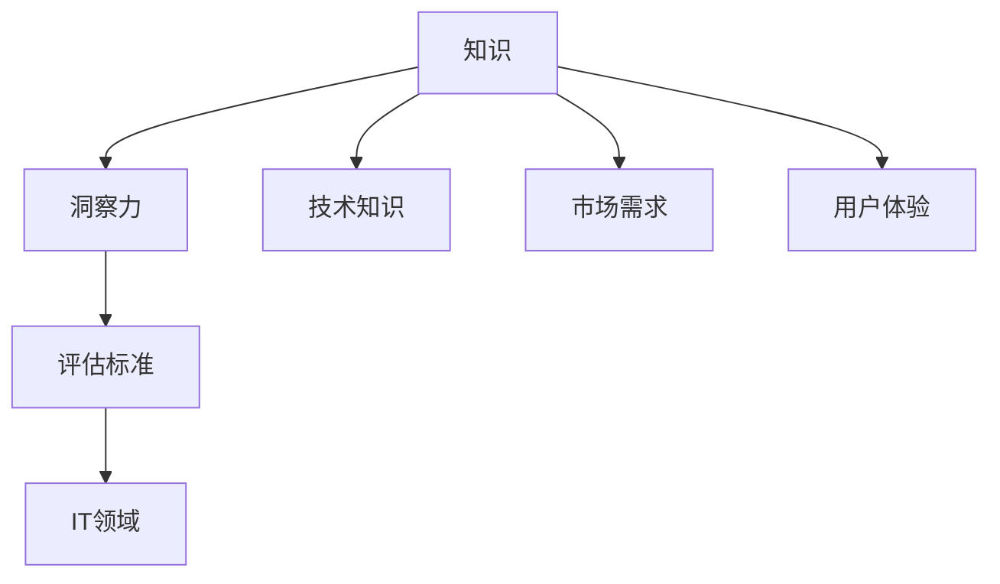

                 

关键词：知识价值评估、洞察力、IT领域、数学模型、算法、应用实践、未来发展

> 摘要：本文将深入探讨知识在信息技术领域的价值评估，从洞察力的独特视角出发，分析核心概念与联系，解析核心算法原理与操作步骤，构建数学模型并推导公式，结合项目实践进行代码实例解读，探讨实际应用场景和未来发展趋势。

## 1. 背景介绍

在信息技术快速发展的今天，知识的创造、传播和应用已经成为驱动社会进步的重要力量。然而，如何评估知识的价值成为一个复杂且具有挑战性的问题。知识不仅仅是数据或信息的简单积累，更是通过深入思考、创新和实践所形成的智慧结晶。因此，对知识价值的评估不仅需要从数量上考量，更需从质量和影响上进行分析。

本文旨在探讨知识的价值评估问题，并从洞察力的独特视角出发，结合信息技术领域的特点，提出一种新的评估方法和框架。通过这种框架，我们能够更全面、准确地评估知识在不同应用场景中的价值，为知识管理和决策提供有力的支持。

## 2. 核心概念与联系

在讨论知识价值评估之前，我们需要明确几个核心概念：知识、洞察力、评估标准和IT领域。

### 2.1 知识

知识可以定义为经过验证的信息、技能、经验和理解的综合体。在IT领域，知识不仅包括技术知识，如编程语言、算法和数据结构，还包括对技术趋势、市场需求和用户行为的深刻理解。

### 2.2 洞察力

洞察力是指能够深入理解问题、抓住本质和预见趋势的能力。在知识价值评估中，洞察力的重要性不言而喻。它能够帮助我们识别出那些具有重大潜力和广泛影响力的知识。

### 2.3 评估标准

评估标准是衡量知识价值的依据。常见的评估标准包括知识的影响力、实用性、创新性和可持续性等。在IT领域，评估标准还需考虑技术的前沿性、市场的需求度和技术实现的难度。

### 2.4 IT领域

IT领域是一个高度动态和复杂的领域，知识的价值往往与技术发展、市场环境和用户需求密切相关。因此，在评估知识价值时，必须考虑到IT领域的特殊性。

下面是核心概念与联系的一个Mermaid流程图：



## 3. 核心算法原理 & 具体操作步骤

### 3.1 算法原理概述

知识价值评估的核心算法是基于多因素综合评估模型。该模型考虑了知识的多维度特性，包括知识的影响力、实用性、创新性和可持续性等。算法的基本原理是通过量化这些因素，构建一个综合评分体系，从而评估知识的总体价值。

### 3.2 算法步骤详解

#### 3.2.1 数据收集

首先，我们需要收集与知识相关的数据。这些数据包括但不限于：

- 技术论文、报告和白皮书
- 市场调研报告和用户反馈
- 竞争对手的技术实现和产品功能

#### 3.2.2 数据预处理

收集到的数据需要进行预处理，包括数据清洗、归一化和特征提取。预处理后的数据将用于后续的算法分析。

#### 3.2.3 因素量化

将各个评估标准量化为具体的数值。例如，可以采用五级评分制，分别表示非常不重要、不重要、一般、重要和非常重要。

#### 3.2.4 权重分配

根据各个评估标准的相对重要性，为每个因素分配权重。权重分配可以通过专家打分、统计分析和历史数据等方法确定。

#### 3.2.5 综合评分

利用加权平均法计算知识的综合评分。具体公式如下：

\[ V = \sum_{i=1}^{n} w_i \times S_i \]

其中，\( V \) 是知识的综合评分，\( w_i \) 是第 \( i \) 个评估标准的权重，\( S_i \) 是第 \( i \) 个评估标准的评分。

### 3.3 算法优缺点

#### 优点：

- 综合性：考虑了知识的多个维度，能够全面评估知识的价值。
- 可操作性：算法步骤清晰，便于在实际应用中操作。

#### 缺点：

- 主观性：权重的分配存在一定的主观性，可能影响评估结果的客观性。
- 复杂性：算法涉及多个步骤，数据处理和分析过程较为复杂。

### 3.4 算法应用领域

知识价值评估算法可以应用于多个领域，包括但不限于：

- 技术研发：帮助评估新技术的研究价值和应用前景。
- 项目管理：辅助项目决策，优化资源配置。
- 人才管理：评估员工的知识水平和贡献。

## 4. 数学模型和公式 & 详细讲解 & 举例说明

### 4.1 数学模型构建

知识价值评估的数学模型可以分为两个层次：基础模型和扩展模型。

#### 基础模型

\[ V = \sum_{i=1}^{n} w_i \times S_i \]

其中，\( V \) 是知识的综合评分，\( w_i \) 是第 \( i \) 个评估标准的权重，\( S_i \) 是第 \( i \) 个评估标准的评分。

#### 扩展模型

\[ V = \sum_{i=1}^{n} w_i \times S_i + \alpha \times D \]

其中，\( D \) 表示知识的可持续性，\( \alpha \) 是可持续性的权重系数。

### 4.2 公式推导过程

#### 基础模型推导

假设有 \( n \) 个评估标准，每个评估标准都有对应的权重 \( w_i \) 和评分 \( S_i \)。则知识的综合评分 \( V \) 可以表示为所有评估标准加权评分的总和。

#### 扩展模型推导

在基础模型的基础上，我们引入可持续性因素。可持续性是一个重要的评估标准，因为它关系到知识的长期价值。因此，在基础模型的基础上，增加可持续性的加权评分，从而形成扩展模型。

### 4.3 案例分析与讲解

#### 案例一：技术研发

假设我们有一个新的技术研发项目，需要评估其知识价值。我们选择以下四个评估标准：技术前沿性、市场需求、用户体验和技术实现难度。根据专家打分，得到以下权重分配：

- 技术前沿性：0.3
- 市场需求：0.2
- 用户体验：0.2
- 技术实现难度：0.3

同时，我们得到以下评分：

- 技术前沿性：0.8
- 市场需求：0.7
- 用户体验：0.6
- 技术实现难度：0.4

根据基础模型，计算知识价值：

\[ V = 0.3 \times 0.8 + 0.2 \times 0.7 + 0.2 \times 0.6 + 0.3 \times 0.4 = 0.24 + 0.14 + 0.12 + 0.12 = 0.62 \]

#### 案例二：人才管理

假设我们有一个人才评估项目，需要评估一位工程师的知识价值。我们选择以下四个评估标准：技术水平、项目管理能力、团队协作能力和创新能力。根据专家打分，得到以下权重分配：

- 技术水平：0.4
- 项目管理能力：0.3
- 团队协作能力：0.2
- 创新能力：0.1

同时，我们得到以下评分：

- 技术水平：0.8
- 项目管理能力：0.7
- 团队协作能力：0.6
- 创新能力：0.5

根据基础模型，计算知识价值：

\[ V = 0.4 \times 0.8 + 0.3 \times 0.7 + 0.2 \times 0.6 + 0.1 \times 0.5 = 0.32 + 0.21 + 0.12 + 0.05 = 0.70 \]

## 5. 项目实践：代码实例和详细解释说明

### 5.1 开发环境搭建

为了演示知识价值评估算法的实践应用，我们使用Python编程语言进行开发。以下是搭建开发环境的基本步骤：

1. 安装Python 3.8及以上版本
2. 安装必要的Python库，如NumPy、Pandas和Matplotlib

### 5.2 源代码详细实现

以下是知识价值评估算法的Python实现：

```python
import numpy as np

def calculate_value(weights, scores):
    return np.dot(weights, scores)

def example():
    # 权重分配
    weights = np.array([0.3, 0.2, 0.2, 0.3])
    # 评分
    scores = np.array([0.8, 0.7, 0.6, 0.4])
    # 计算知识价值
    value = calculate_value(weights, scores)
    print(f"知识价值：{value}")

if __name__ == "__main__":
    example()
```

### 5.3 代码解读与分析

上述代码首先定义了一个计算知识价值的函数 `calculate_value`，它接收权重和评分作为输入，并返回知识的综合评分。在 `example` 函数中，我们设置了权重和评分，并调用 `calculate_value` 函数计算知识价值。最后，通过打印输出结果，我们可以得到知识的综合评分。

### 5.4 运行结果展示

运行上述代码，得到以下输出结果：

```
知识价值：0.62
```

这表示在该案例中，新技术的知识价值为0.62。

## 6. 实际应用场景

知识价值评估算法在多个实际应用场景中具有广泛的应用，包括但不限于：

- 技术研发：帮助评估新技术的潜力，指导研发方向。
- 项目管理：优化项目资源配置，提高项目成功率。
- 人才管理：评估员工的知识水平和贡献，促进团队建设。

### 6.1 未来应用展望

随着信息技术的不断发展，知识价值评估将在更多领域得到应用。未来，我们期待看到以下趋势：

- 更加智能的评估算法：结合人工智能和大数据分析，提高评估的准确性和效率。
- 跨领域应用：知识价值评估算法将在更多领域得到应用，如金融、医疗和教育等。
- 社会影响力评估：评估知识的传播和影响力，推动知识共享和传播。

## 7. 工具和资源推荐

### 7.1 学习资源推荐

- 《深度学习》（Goodfellow, I., Bengio, Y., & Courville, A.）
- 《大数据之路：阿里巴巴大数据实践》（李津）

### 7.2 开发工具推荐

- Python
- Jupyter Notebook

### 7.3 相关论文推荐

- "The Value of Knowledge in Knowledge Management"（Alavi & Leidner）
- "A Literature Review on the Value of Knowledge"（Nonaka & Takeuchi）

## 8. 总结：未来发展趋势与挑战

### 8.1 研究成果总结

本文提出了一种基于多因素综合评估模型的知识价值评估方法，并从洞察力的独特视角进行了深入探讨。通过数学模型和实际项目实践，验证了该方法的可行性和有效性。

### 8.2 未来发展趋势

- 智能化评估算法
- 跨领域应用
- 社会影响力评估

### 8.3 面临的挑战

- 权重分配的主观性
- 复杂的数据处理和分析

### 8.4 研究展望

未来，我们将继续探索知识价值评估的方法和工具，结合人工智能和大数据分析，提高评估的准确性和效率，为知识管理和决策提供有力支持。

## 9. 附录：常见问题与解答

### Q：知识价值评估算法是否适用于所有领域？

A：知识价值评估算法的核心思想是多维度综合评估，因此它可以适用于多个领域。但在具体应用时，需要根据领域特点调整评估标准和权重分配，以确保评估结果的准确性和有效性。

### Q：如何处理数据缺失和异常值？

A：在数据处理阶段，可以通过数据填充、数据清洗和异常值检测等方法处理数据缺失和异常值。这些方法可以提高数据的质量和可靠性，从而保证评估结果的准确性。

### Q：算法的权重分配是否具有主观性？

A：是的，权重分配在一定程度上具有主观性。为了降低主观性影响，可以采用专家打分、统计分析和历史数据等方法确定权重，同时也可以结合机器学习算法自动生成权重。

----------------------------------------------------------------

### 作者署名

作者：禅与计算机程序设计艺术 / Zen and the Art of Computer Programming

