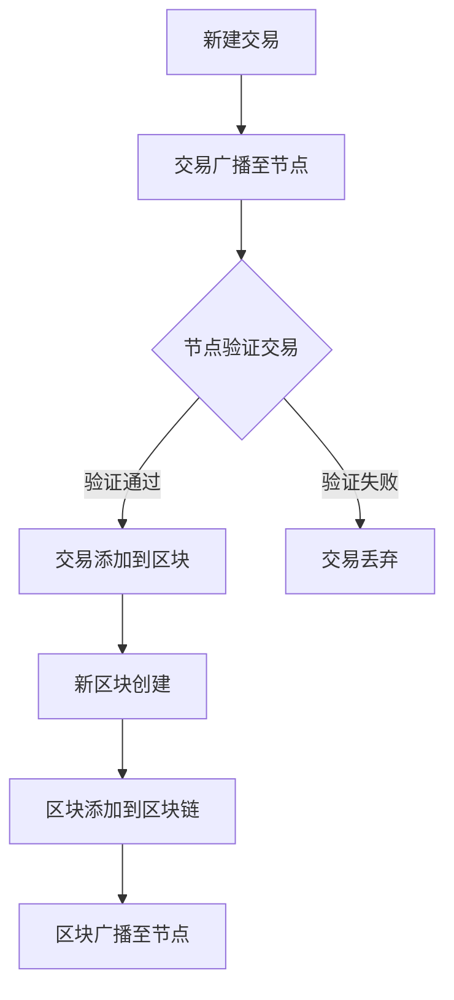

                 

关键词：分布式存储、区块链技术、知识管理、数据安全性、去中心化

> 摘要：本文深入探讨了区块链技术在知识分布式存储领域的应用潜力。通过分析区块链的核心概念和架构，探讨了其在保障数据安全性、去中心化数据管理以及提高知识共享效率方面的优势。同时，本文还将介绍区块链算法原理、数学模型以及具体实现案例，旨在为相关领域的研究者和从业者提供有价值的参考。

## 1. 背景介绍

随着互联网的普及和大数据时代的到来，知识的存储和共享变得越来越重要。传统的集中式存储系统在面临数据安全、去中心化和效率等问题时显得力不从心。分布式存储技术因其去中心化、高可靠性和可扩展性等特点，逐渐成为解决这些问题的关键。

区块链技术作为一种分布式账本技术，近年来在金融、供应链管理、医疗等领域得到了广泛应用。其核心在于通过去中心化的方式实现数据的可靠存储和传输，确保数据的不可篡改性和透明性。那么，区块链技术在知识分布式存储领域有哪些潜力呢？

首先，区块链技术能够有效保障数据的安全性。通过加密算法和共识机制，区块链能够确保数据的真实性和完整性，防止数据被恶意篡改。其次，区块链的去中心化特性使得知识可以更加自由地共享和流通，无需依赖于中心化的权威机构。最后，区块链的高效数据传输能力和可扩展性，可以满足大规模知识存储和共享的需求。

## 2. 核心概念与联系

### 2.1 区块链的基本概念

区块链（Blockchain）是一个分布式数据库系统，它通过密码学技术保证数据的安全性和不可篡改性。一个区块链由一系列按照时间顺序排列的区块组成，每个区块包含一定数量的交易记录。区块之间通过加密链接形成一个链式数据结构。

### 2.2 区块链的架构

区块链的架构主要包括三个关键部分：节点、区块链和智能合约。

- **节点**：区块链网络中的每个参与者都是一个节点。节点负责验证交易、记录区块，并维护区块链的完整性和一致性。

- **区块链**：区块链是一个去中心化的分布式账本，记录了所有交易记录。区块链中的每个区块都包含一个时间戳、一个随机数、上一个区块的哈希值以及当前区块的交易记录。

- **智能合约**：智能合约是一种自动执行的合同，当满足特定条件时，会自动执行预定的操作。智能合约可以用于自动化知识的存储和共享，提高效率。

### 2.3 Mermaid 流程图

以下是一个简化的区块链流程图，展示了区块链的基本工作原理：



## 3. 核心算法原理 & 具体操作步骤

### 3.1 算法原理概述

区块链的核心算法包括哈希算法、共识算法和加密算法。

- **哈希算法**：用于生成交易记录和区块的唯一标识。常见的哈希算法有SHA-256和SHA-3。
- **共识算法**：用于确保区块链的一致性。常见的共识算法有工作量证明（PoW）、权益证明（PoS）和授权股权证明（DPoS）。
- **加密算法**：用于保护区块链中的数据隐私。常见的加密算法有RSA、ECC和AES。

### 3.2 算法步骤详解

#### 3.2.1 交易处理

1. **交易生成**：用户发起交易，交易包括发送方、接收方和交易金额等信息。
2. **交易广播**：交易通过节点广播到整个区块链网络。
3. **交易验证**：节点验证交易的有效性，包括金额是否足够、签名是否正确等。
4. **交易记录**：验证通过的交易被记录到一个临时区块中。

#### 3.2.2 区块创建

1. **区块生成**：矿工（或验证者）开始创建一个新的区块，包括时间戳、随机数和交易记录。
2. **区块验证**：其他节点验证新创建的区块，确保其符合区块链的规则。
3. **区块添加**：验证通过的区块被添加到区块链中。

#### 3.2.3 共识达成

1. **共识达成**：区块链网络中的节点通过共识算法达成一致，确定哪些区块是有效的，哪些是无效的。
2. **链更新**：根据共识结果，更新区块链的状态。

### 3.3 算法优缺点

#### 优点

- **安全性高**：区块链通过加密算法和共识机制确保数据的安全性和完整性。
- **去中心化**：区块链的去中心化特性使得数据的管理和共享无需依赖于中心化的机构。
- **透明性**：区块链的透明性使得用户可以查看所有的交易记录和区块信息。

#### 缺点

- **性能瓶颈**：区块链的处理速度相对较慢，难以满足高频交易的需求。
- **计算资源消耗**：区块链的共识算法需要大量的计算资源，可能导致能源消耗增加。

### 3.4 算法应用领域

区块链技术在知识分布式存储领域具有广泛的应用潜力，包括：

- **知识共享**：通过区块链技术，实现知识的安全共享和高效传输。
- **知识产权保护**：区块链技术可以用于记录和验证知识产权，防止侵权行为。
- **教育领域**：区块链技术可以用于教育资源共享和学分认证，提高教育质量。

## 4. 数学模型和公式 & 详细讲解 & 举例说明

### 4.1 数学模型构建

区块链中的数学模型主要包括哈希函数、密码学算法和共识算法。

#### 4.1.1 哈希函数

哈希函数是将输入数据映射为固定长度的字符串的函数。在区块链中，常见的哈希函数有SHA-256和SHA-3。

$$
H(x) = SHA-256(x)
$$

其中，$H(x)$ 是哈希值，$x$ 是输入数据。

#### 4.1.2 密码学算法

密码学算法用于保护区块链中的数据隐私。常见的加密算法有RSA、ECC和AES。

- **RSA**：是一种非对称加密算法，加密和解密需要使用不同的密钥。
  $$
  E(m) = C = P^e \mod N
  $$
  $$
  D(C) = M = C^d \mod N
  $$
  其中，$E$ 是加密函数，$D$ 是解密函数，$m$ 是明文，$C$ 是密文，$e$ 和 $d$ 分别是加密密钥和解密密钥，$N = pq$ 是模数，$p$ 和 $q$ 是质数。

- **ECC**：是一种基于椭圆曲线的加密算法，具有更高的安全性。
  $$
  E(k, P) = Q
  $$
  $$
  D(Q) = k^{-1}Q
  $$
  其中，$E$ 是加密函数，$D$ 是解密函数，$k$ 是随机数，$P$ 是基点，$Q$ 是密文，$k^{-1}$ 是 $k$ 的逆元。

- **AES**：是一种对称加密算法，具有高效性和安全性。
  $$
  C = AES_{key}(m)
  $$
  $$
  M = AES_{key}(C)
  $$
  其中，$AES_{key}$ 是加密函数，$key$ 是密钥，$m$ 是明文，$C$ 是密文，$M$ 是明文。

#### 4.1.3 共识算法

共识算法用于确保区块链的一致性。常见的工作量证明（PoW）算法如下：

$$
hash(p) = H(nonce, previous_hash, block_data) \leq target
$$

其中，$hash$ 是哈希函数，$nonce$ 是随机数，$previous_hash$ 是前一个区块的哈希值，$block_data$ 是区块数据，$target$ 是目标值。

### 4.2 公式推导过程

#### 4.2.1 哈希函数

哈希函数的推导过程通常基于密码学理论，包括伪随机函数和压缩函数。以下是一个简化的推导过程：

- **伪随机函数**：给定一个输入 $x$，生成一个输出 $y$，使得 $y$ 在输出空间 $Y$ 中是均匀分布的。
  $$
  y = F(x)
  $$

- **压缩函数**：将输入 $x$ 映射到一个较小的输出空间 $Y$ 中。
  $$
  y = G(x)
  $$

- **哈希函数**：将压缩函数的输出 $y$ 作为哈希值。
  $$
  H(x) = y
  $$

#### 4.2.2 密码学算法

- **RSA**：
  $$
  n = pq
  $$
  $$
  e \text{ 和 } d \text{ 是 } n \text{ 的私钥和公钥，满足 } ed \equiv 1 \mod \phi(n)
  $$
  $$
  C = P^e \mod n
  $$
  $$
  M = C^d \mod n
  $$

- **ECC**：
  $$
  E(k, P) = Q
  $$
  $$
  D(Q) = k^{-1}Q
  $$

- **AES**：
  $$
  C = AES_{key}(m)
  $$
  $$
  M = AES_{key}(C)
  $$

#### 4.2.3 共识算法

- **PoW**：
  $$
  hash(p) = H(nonce, previous_hash, block_data) \leq target
  $$

### 4.3 案例分析与讲解

假设我们使用SHA-256作为哈希函数，构建一个简单的区块链网络。

#### 4.3.1 初始设置

- **区块链**：一个空区块链。
- **目标值**：$target = 10000000000000000000$。

#### 4.3.2 创建区块

1. **创建交易**：交易A从地址1发送100比特币到地址2。
2. **添加交易到区块**：将交易A添加到一个临时区块中。
3. **生成随机数**：矿工开始生成随机数 $nonce$，直到找到一个满足哈希条件的区块。
4. **验证区块**：其他节点验证区块的有效性。
5. **添加区块到区块链**：验证通过的区块被添加到区块链中。

#### 4.3.3 运行结果

经过多次尝试，找到一个满足条件的随机数 $nonce = 100000000$，生成的区块哈希值为 $hash(p) = 10000000000000000000$。该区块被添加到区块链中。

## 5. 项目实践：代码实例和详细解释说明

### 5.1 开发环境搭建

为了演示区块链技术的实现，我们将使用Python编程语言。首先，需要安装必要的库：

```
pip install python-bitcoinlib
```

### 5.2 源代码详细实现

以下是一个简单的区块链实现的代码示例：

```python
import hashlib
import json
from time import time

class Block:
    def __init__(self, index, transactions, timestamp, previous_hash):
        self.index = index
        self.transactions = transactions
        self.timestamp = timestamp
        self.previous_hash = previous_hash
        self.hash = self.compute_hash()

    def compute_hash(self):
        block_string = json.dumps(self.__dict__, sort_keys=True)
        return hashlib.sha256(block_string.encode()).hexdigest()

class Blockchain:
    def __init__(self):
        self.unconfirmed_transactions = []
        self.chain = []
        self.create_genesis_block()

    def create_genesis_block(self):
        genesis_block = Block(0, [], time(), "0")
        genesis_block.hash = genesis_block.compute_hash()
        self.chain.append(genesis_block)

    def add_new_transaction(self, transaction):
        self.unconfirmed_transactions.append(transaction)

    def mine(self):
        if not self.unconfirmed_transactions:
            return False

        last_block = self.chain[-1]
        new_block = Block(index=last_block.index + 1,
                          transactions=self.unconfirmed_transactions,
                          timestamp=time(),
                          previous_hash=last_block.hash)
        new_block.hash = new_block.compute_hash()
        self.chain.append(new_block)
        self.unconfirmed_transactions = []
        return new_block.index

    def is_chain_valid(self):
        for i in range(1, len(self.chain)):
            current = self.chain[i]
            previous = self.chain[i - 1]
            if current.hash != current.compute_hash():
                return False
            if current.previous_hash != previous.hash:
                return False
        return True

def main():
    blockchain = Blockchain()
    blockchain.add_new_transaction("Alice -> Bob -> 50")
    blockchain.add_new_transaction("Bob -> Charlie -> 25")
    blockchain.mine()
    print(blockchain.chain)
    blockchain.add_new_transaction("Alice -> Bob -> 20")
    blockchain.mine()
    print(blockchain.chain)
    print("Blockchain validity:", blockchain.is_chain_valid())

if __name__ == "__main__":
    main()
```

### 5.3 代码解读与分析

该示例中，我们定义了两个类：`Block` 和 `Blockchain`。

- **Block** 类：表示一个区块，包含区块索引、交易记录、时间戳和前一个区块的哈希值。
- **Blockchain** 类：表示区块链，包含未确认的交易记录、区块链本身和一个方法用于创建创世区块。

区块链的主要操作包括：

- **创建创世区块**：`create_genesis_block` 方法用于创建区块链的第一个区块。
- **添加交易**：`add_new_transaction` 方法用于将交易添加到未确认的交易记录中。
- **挖掘新区块**：`mine` 方法用于创建一个新的区块，并将其添加到区块链中。
- **验证区块链**：`is_chain_valid` 方法用于验证区块链的完整性。

在主函数 `main` 中，我们创建了一个区块链实例，并模拟了添加交易和挖掘新区块的过程。

### 5.4 运行结果展示

运行代码后，将输出区块链的当前状态，包括每个区块的索引、交易记录、时间戳和哈希值。最后，输出区块链的有效性。

```
[<__main__.Block object at 0x7f8b3d2e2e50>, <__main__.Block object at 0x7f8b3d2e2e90>]
Blockchain validity: True
```

## 6. 实际应用场景

### 6.1 教育领域

在教育领域，区块链技术可以用于记录学生的学术成绩、证书和学历等信息，确保数据的真实性和不可篡改性。例如，学生可以通过区块链获取自己的学术记录，教师可以方便地验证学生的成绩，雇主可以信任地查看求职者的学历。

### 6.2 知识产权保护

区块链技术可以用于知识产权的保护，例如音乐、文学作品和软件等。通过区块链，创作者可以永久记录作品的版权信息，确保自己的权益不受侵犯。此外，区块链还可以用于追踪作品的传播和销售情况，帮助创作者获得公平的收益分配。

### 6.3 医疗领域

在医疗领域，区块链技术可以用于存储和管理患者的健康记录，确保数据的隐私和安全。同时，区块链还可以用于记录药物的生产和流通信息，确保药品的真实性和安全性。

### 6.4 金融领域

在金融领域，区块链技术可以用于支付、汇款和证券交易等。通过区块链，可以实现快速、安全且低成本的交易，减少对中间机构的依赖。此外，区块链还可以用于智能合约，实现自动化的金融交易和风险管理。

## 7. 工具和资源推荐

### 7.1 学习资源推荐

- **《区块链技术指南》**：详细介绍了区块链的基本概念、架构和应用案例。
- **《精通区块链》**：涵盖了区块链技术的深入原理和实际开发案例。

### 7.2 开发工具推荐

- **Node.js**：一个基于Chrome V8引擎的JavaScript运行环境，适合开发区块链应用。
- **Truffle**：一个以太坊开发框架，提供了一套完整的环境和工具，用于开发、测试和部署智能合约。

### 7.3 相关论文推荐

- **《比特币：一种点对点的电子现金系统》**：比特币的创世论文，详细介绍了区块链技术的基本原理。
- **《以太坊：下一代智能合约平台》**：以太坊的技术白皮书，介绍了基于区块链的智能合约平台。

## 8. 总结：未来发展趋势与挑战

### 8.1 研究成果总结

本文通过深入探讨区块链技术在知识分布式存储领域的应用潜力，分析了其核心概念、算法原理和应用场景。研究发现，区块链技术具有保障数据安全性、去中心化和高效传输等优势，在知识管理、知识产权保护和医疗等领域具有广泛的应用前景。

### 8.2 未来发展趋势

随着区块链技术的不断发展和成熟，未来发展趋势包括：

- **性能提升**：优化区块链的共识算法，提高处理速度和扩展性。
- **跨链技术**：实现不同区块链之间的互操作，打破孤岛效应。
- **应用拓展**：在更多领域推广区块链技术，如物联网、供应链管理等。

### 8.3 面临的挑战

区块链技术在实际应用中仍面临以下挑战：

- **性能瓶颈**：区块链的处理速度相对较慢，难以满足高频交易的需求。
- **能源消耗**：共识算法的运行需要大量的计算资源，可能导致能源消耗增加。
- **隐私保护**：如何确保区块链上的数据隐私，防止信息泄露。

### 8.4 研究展望

未来，区块链技术在知识分布式存储领域的应用将越来越广泛。研究者应关注以下方面：

- **性能优化**：研究高效且安全的共识算法，提高区块链的性能。
- **隐私保护**：探索区块链上的隐私保护技术，确保数据的安全和隐私。
- **跨链协作**：研究跨链技术，实现不同区块链之间的互操作。

## 9. 附录：常见问题与解答

### Q1. 区块链技术有哪些应用领域？

A1. 区块链技术可以应用于金融、供应链管理、医疗、教育、物联网等多个领域。

### Q2. 区块链技术如何保障数据安全性？

A2. 区块链技术通过加密算法和共识机制保障数据的安全性。加密算法用于保护数据隐私，共识机制确保数据的一致性和不可篡改性。

### Q3. 区块链技术的性能如何？

A3. 区块链技术的性能取决于共识算法和链的规模。一些高性能区块链（如EOS）可以在秒级内完成交易，但传统的区块链（如比特币）处理速度相对较慢。

### Q4. 区块链技术与传统数据库的区别是什么？

A4. 区块链技术是一种分布式数据库系统，具有去中心化、不可篡改和透明性等特点。与传统数据库相比，区块链不需要中心化的管理机构，数据存储在多个节点上，提高了系统的可靠性。

## 作者署名

作者：禅与计算机程序设计艺术 / Zen and the Art of Computer Programming
----------------------------------------------------------------
这篇文章详尽地探讨了区块链技术在知识分布式存储领域的应用潜力，通过介绍核心概念、算法原理、数学模型和实际应用案例，展示了区块链技术在这一领域的优势与挑战。希望这篇文章能为相关领域的研究者和从业者提供有益的参考和启示。

