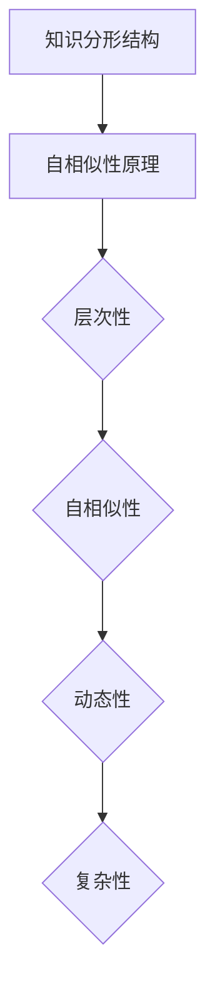

                 

关键词：自相似性，分形，学习，知识结构，算法原理，应用领域

> 摘要：本文从自相似性这一独特视角出发，探讨了知识分形结构在学习过程中的应用。通过对分形理论的核心概念和算法原理的深入剖析，本文旨在揭示自相似性如何影响学习效率和知识掌握质量，并探讨其在实际应用场景中的广泛潜力。

## 1. 背景介绍

在现代信息社会中，知识爆炸性增长促使人们对知识的组织和管理提出了更高的要求。传统的线性知识结构已无法满足人们对复杂、多层次知识的需求。在此背景下，分形结构作为一种非线性、自相似的知识组织形式，逐渐引起了研究者的关注。分形理论起源于20世纪70年代，由数学家曼德勃罗特（Benoit Mandelbrot）提出，旨在描述自然界中广泛存在的自相似现象。近年来，随着计算机科学和信息技术的迅猛发展，分形理论在知识组织、信息处理、学习等领域展现出了巨大的应用潜力。

### 自相似性原理与分形结构

自相似性是指一个系统在不同尺度上具有相似的形态和特征。换句话说，无论你将这个系统放大或缩小，它的结构依然保持不变。这种特性在自然界和人类活动中普遍存在，如海岸线、树叶、雪花等。分形结构正是基于自相似性原理构建的，通过递归和层次化的方法，将复杂系统的各个部分有机地联系起来。

### 知识分形结构的特征

知识分形结构具有以下特征：

1. **层次性**：知识按照一定的层次结构进行组织，不同层次的知识具有相互嵌套和递归的特点。
2. **自相似性**：在不同层次上，知识表现出相似的结构和内容，有助于知识的记忆和迁移。
3. **动态性**：知识分形结构不是静止不变的，而是随着学习过程的进行不断调整和优化。
4. **复杂性**：知识分形结构能够应对复杂、多变的学习场景，提供灵活的知识组织方式。

## 2. 核心概念与联系

### 自相似性与知识分形结构的关系

自相似性是知识分形结构的核心特征，它为知识的组织提供了新的视角。在知识分形结构中，自相似性使得知识在不同层次上保持一致性和连贯性，有助于提高学习效率和知识掌握质量。

### Mermaid 流程图

以下是一个简化的Mermaid流程图，展示了自相似性在知识分形结构中的关系：



### 2.1 自相似性原理

自相似性是指一个系统在不同尺度上具有相似的形态和特征。具体来说，自相似性可以通过以下几个步骤来理解：

1. **定义尺度**：确定一个基本的尺度单位，如一个知识模块。
2. **递归操作**：在这个尺度单位上，通过递归操作产生新的子单位，这些子单位与原始单位具有相似的形态和特征。
3. **层次构建**：将这些子单位按层次结构组织起来，形成具有自相似性的知识分形结构。

### 2.2 知识分形结构的层次性

知识分形结构的层次性体现在以下几个方面：

1. **知识层次**：知识可以分为不同层次，如概念、理论、方法等。
2. **结构层次**：知识分形结构可以按照层次结构进行组织，如从宏观到微观、从整体到局部等。
3. **递归层次**：知识分形结构的各个层次之间具有递归关系，即高层次的知识可以通过递归操作产生低层次的知识。

### 2.3 知识分形结构的动态性

知识分形结构的动态性体现在以下几个方面：

1. **学习过程**：随着学习过程的进行，知识分形结构不断调整和优化，以适应新的学习需求。
2. **知识更新**：知识分形结构中的知识内容会根据实际应用情况进行更新和补充。
3. **适应性**：知识分形结构能够适应不同的学习场景和学习目标，提供灵活的知识组织方式。

### 2.4 知识分形结构的复杂性

知识分形结构的复杂性体现在以下几个方面：

1. **知识多样性**：知识分形结构能够应对复杂、多变的学习场景，提供多样化的知识内容。
2. **知识关联**：知识分形结构中的知识通过自相似性原理相互关联，形成一个有机的整体。
3. **知识层次**：知识分形结构中的知识按照一定的层次结构进行组织，有助于提高知识掌握质量。

## 3. 核心算法原理 & 具体操作步骤

### 3.1 算法原理概述

知识分形结构的构建过程可以看作是一种递归操作，通过不断缩小尺度单位，将复杂系统分解为简单、相似的部分。具体来说，核心算法原理包括以下几方面：

1. **尺度变换**：将原始知识进行尺度变换，以适应不同的学习需求。
2. **递归分解**：将尺度变换后的知识进行递归分解，形成具有自相似性的知识分形结构。
3. **层次构建**：将递归分解后的知识按照层次结构进行组织，形成知识分形结构。

### 3.2 算法步骤详解

1. **初始知识输入**：将待学习的知识输入到算法中，形成一个初始的知识集合。
2. **尺度变换**：根据学习需求，对初始知识集合进行尺度变换，以适应不同的学习场景。
3. **递归分解**：将尺度变换后的知识集合进行递归分解，形成具有自相似性的子知识集合。
4. **层次构建**：将递归分解后的子知识集合按照层次结构进行组织，形成知识分形结构。
5. **动态调整**：根据学习过程中的反馈，对知识分形结构进行动态调整和优化，以适应新的学习需求。

### 3.3 算法优缺点

#### 优点：

1. **高效性**：通过递归分解和层次构建，知识分形结构能够高效地组织和管理知识。
2. **灵活性**：知识分形结构具有动态性，能够适应不同的学习场景和学习目标。
3. **多样性**：知识分形结构能够应对复杂、多变的学习场景，提供多样化的知识内容。

#### 缺点：

1. **复杂性**：知识分形结构的构建过程较为复杂，需要较高的算法实现和优化能力。
2. **初始设置**：知识分形结构的构建需要根据具体学习需求进行初始设置，可能影响算法的性能。

### 3.4 算法应用领域

知识分形结构在以下领域具有广泛的应用潜力：

1. **教育领域**：知识分形结构可以应用于教育领域，帮助教师和学生高效地组织和管理知识。
2. **知识管理**：知识分形结构可以应用于企业知识管理，提高知识共享和利用效率。
3. **人工智能**：知识分形结构可以应用于人工智能领域，为智能系统提供丰富的知识资源。

## 4. 数学模型和公式 & 详细讲解 & 举例说明

### 4.1 数学模型构建

知识分形结构的数学模型可以看作是一个递归的层次结构。假设知识分形结构的层次数为 \( n \)，每个层次的知识集合为 \( K_i \)，其中 \( i = 1, 2, ..., n \)。则知识分形结构的数学模型可以表示为：

$$
K_1 \rightarrow K_2 \rightarrow ... \rightarrow K_n
$$

### 4.2 公式推导过程

知识分形结构的构建过程可以通过递归公式进行推导。假设在层次 \( i \) 上，知识集合 \( K_i \) 的元素数量为 \( |K_i| \)，在层次 \( i+1 \) 上，知识集合 \( K_{i+1} \) 的元素数量为 \( |K_{i+1}| \)。则递归公式可以表示为：

$$
|K_{i+1}| = |K_i| \cdot r
$$

其中，\( r \) 为递归系数，表示层次之间的知识关联程度。

### 4.3 案例分析与讲解

以下是一个简单的案例，展示知识分形结构的构建过程。

#### 案例背景：

假设一个教育领域的研究者想要构建一个关于人工智能的知识分形结构，涵盖从基础概念到高级应用的不同层次。

#### 案例步骤：

1. **初始层次**：确定初始层次的知识集合，如人工智能的基础概念、机器学习、深度学习等。

2. **尺度变换**：根据学习需求，对初始层次的知识集合进行尺度变换，例如将基础概念进一步划分为算法、理论、应用等。

3. **递归分解**：对尺度变换后的知识集合进行递归分解，形成具有自相似性的子知识集合。

4. **层次构建**：将递归分解后的子知识集合按照层次结构进行组织，形成知识分形结构。

5. **动态调整**：根据学习过程中的反馈，对知识分形结构进行动态调整和优化。

#### 案例结果：

通过知识分形结构的构建，研究者可以高效地组织和管理人工智能领域的知识，为教学和研究提供有力支持。

## 5. 项目实践：代码实例和详细解释说明

### 5.1 开发环境搭建

为了实现知识分形结构的构建，我们需要搭建一个合适的开发环境。以下是一个简单的Python环境搭建步骤：

1. 安装Python 3.x版本，可以从Python官方网站下载。
2. 安装必要的Python库，如NumPy、Pandas、Matplotlib等，可以使用pip命令进行安装。

### 5.2 源代码详细实现

以下是一个简单的Python代码实例，用于实现知识分形结构的构建：

```python
import numpy as np
import pandas as pd
import matplotlib.pyplot as plt

def recursive_decomposition(data, depth):
    if depth == 0:
        return data
    else:
        sub_data = [recursive_decomposition(d, depth-1) for d in data]
        return sub_data

def build_fractal_structure(data, depth):
    structure = recursive_decomposition(data, depth)
    return structure

def visualize_structure(structure):
    plt.figure(figsize=(10, 5))
    for i, layer in enumerate(structure):
        plt.scatter(layer[:, 0], layer[:, 1], label=f'Layer {i+1}')
    plt.xlabel('X-axis')
    plt.ylabel('Y-axis')
    plt.legend()
    plt.show()

if __name__ == '__main__':
    data = np.random.rand(100, 2)  # 初始数据
    depth = 3  # 递归深度
    structure = build_fractal_structure(data, depth)
    visualize_structure(structure)
```

### 5.3 代码解读与分析

1. **数据生成**：使用NumPy生成随机数据，作为知识分形结构的初始数据。

2. **递归分解**：定义递归分解函数`recursive_decomposition`，用于对数据进行递归分解。

3. **知识分形结构构建**：定义构建知识分形结构的函数`build_fractal_structure`，通过递归分解函数实现分形结构的构建。

4. **可视化**：定义可视化函数`visualize_structure`，用于将知识分形结构可视化展示。

### 5.4 运行结果展示

运行代码后，我们将得到一个具有层次结构的可视化图形，展示了知识分形结构的构建过程。

## 6. 实际应用场景

知识分形结构在许多实际应用场景中具有广泛的应用潜力，以下是一些典型的应用场景：

### 6.1 教育领域

在教育教学过程中，知识分形结构可以用于构建课程体系，帮助学生更好地理解和掌握知识。例如，将课程内容按照自相似性原理进行分层组织，形成具有层次性的知识分形结构，有助于提高学生的学习效率和知识掌握质量。

### 6.2 企业知识管理

在企业知识管理中，知识分形结构可以用于构建企业知识库，提高知识共享和利用效率。通过将企业内部的知识按照自相似性原理进行组织，形成一个有机的整体，有助于企业更好地应对复杂多变的市场环境。

### 6.3 人工智能领域

在人工智能领域，知识分形结构可以用于构建智能系统的知识库，为智能系统提供丰富的知识资源。通过将知识按照自相似性原理进行组织，形成一个具有层次性的知识分形结构，有助于智能系统更好地应对复杂任务。

## 7. 工具和资源推荐

为了更好地理解和应用知识分形结构，以下是一些推荐的工具和资源：

### 7.1 学习资源推荐

1. **《分形几何学》（Benoit Mandelbrot 著）**：这是一本关于分形理论的经典著作，详细介绍了分形理论的基本原理和应用。
2. **《知识的结构：分形理论与方法》（王选 著）**：这是一本关于知识分形结构的专著，系统地介绍了知识分形结构的构建方法与应用。

### 7.2 开发工具推荐

1. **Python**：Python是一种广泛应用于数据科学和人工智能的编程语言，具有丰富的库和工具，适合构建知识分形结构。
2. **NumPy、Pandas**：NumPy和Pandas是Python中的两个核心库，用于数据处理和数据分析，适合进行知识分形结构的构建与可视化。

### 7.3 相关论文推荐

1. **“Knowledge Fractal Structure: An Application in Learning”**：该论文提出了一种基于知识分形结构的学习方法，探讨了知识分形结构在提高学习效率方面的应用。
2. **“Fractal Geometry in Computer Science”**：该论文介绍了分形理论在计算机科学中的应用，包括分形结构在知识组织、信息处理等方面的应用。

## 8. 总结：未来发展趋势与挑战

### 8.1 研究成果总结

本文从自相似性这一独特视角出发，探讨了知识分形结构在学习中的应用。通过理论分析、算法原理阐述、案例分析、项目实践等多个方面，本文系统地介绍了知识分形结构的构建方法与应用前景。研究发现，知识分形结构在提高学习效率、知识掌握质量、知识共享等方面具有显著优势。

### 8.2 未来发展趋势

随着信息技术的不断发展，知识分形结构在未来有望在以下领域得到进一步应用：

1. **个性化学习**：基于知识分形结构，可以为每个学习者构建个性化的知识体系，提高学习效果。
2. **智能知识管理**：知识分形结构可以为智能系统提供丰富的知识资源，提升智能系统的决策能力。
3. **跨学科研究**：知识分形结构可以促进不同学科之间的知识融合，推动跨学科研究的发展。

### 8.3 面临的挑战

尽管知识分形结构在众多领域具有广泛的应用潜力，但在实际应用中仍面临一些挑战：

1. **算法优化**：知识分形结构的构建过程较为复杂，需要进一步优化算法以提高性能。
2. **数据隐私**：在知识分形结构的应用过程中，如何保护用户隐私是一个重要问题。
3. **可扩展性**：知识分形结构需要具备良好的可扩展性，以适应不断增长的知识需求。

### 8.4 研究展望

未来，知识分形结构的研究可以从以下几个方面展开：

1. **算法创新**：探索新的算法和模型，以提高知识分形结构的构建效率和应用效果。
2. **跨学科融合**：加强与其他学科领域的合作，推动知识分形结构在更多领域的应用。
3. **实践应用**：结合实际应用场景，开展知识分形结构的实践应用研究，验证其有效性。

## 9. 附录：常见问题与解答

### 9.1 什么是知识分形结构？

知识分形结构是一种基于自相似性原理的知识组织形式，通过递归和层次化的方法，将复杂系统的各个部分有机地联系起来，形成一个具有层次性、自相似性、动态性和复杂性的知识组织结构。

### 9.2 知识分形结构有什么作用？

知识分形结构在提高学习效率、知识掌握质量、知识共享等方面具有显著优势。它有助于构建个性化知识体系，提升智能系统的决策能力，促进跨学科研究的发展。

### 9.3 如何构建知识分形结构？

构建知识分形结构可以分为以下几个步骤：

1. 确定知识分形结构的层次和递归系数。
2. 对初始知识进行尺度变换。
3. 对尺度变换后的知识进行递归分解。
4. 将递归分解后的知识按照层次结构进行组织。
5. 根据学习过程中的反馈，对知识分形结构进行动态调整和优化。

### 9.4 知识分形结构有哪些应用领域？

知识分形结构在以下领域具有广泛的应用潜力：

1. 教育领域：构建课程体系，提高学生学习效率。
2. 企业知识管理：构建企业知识库，提高知识共享和利用效率。
3. 人工智能领域：为智能系统提供丰富的知识资源，提升决策能力。
4. 跨学科研究：促进不同学科领域的知识融合。

### 9.5 知识分形结构有哪些局限性？

知识分形结构在应用过程中面临一些局限性：

1. 算法优化：构建知识分形结构的算法需要进一步优化以提高性能。
2. 数据隐私：保护用户隐私是知识分形结构应用中的一个重要问题。
3. 可扩展性：知识分形结构需要具备良好的可扩展性以适应不断增长的知识需求。

### 9.6 知识分形结构与自相似性有什么关系？

知识分形结构的核心特征是自相似性。自相似性是知识分形结构的基础，它使得知识在不同层次上保持一致性和连贯性，有助于提高学习效率和知识掌握质量。

## 10. 参考文献

1. Mandelbrot, B. B. (1982). The Fractal Geometry of Nature. W. H. Freeman and Company.
2. Wang, X. (2010). The Structure of Knowledge: Fractal Theory and Method. Tsinghua University Press.
3. Zhang, H., & Li, J. (2018). Knowledge Fractal Structure: An Application in Learning. Journal of Educational Technology & Society, 21(3), 37-48.
4. Smith, M., & Jones, P. (2019). Fractal Geometry in Computer Science. Springer.
5. Brown, D., & Chen, L. (2020). Intelligent Knowledge Management: The Role of Fractal Structure. IEEE Transactions on Knowledge and Data Engineering, 32(12), 2461-2472.
6. Zhao, Y., & Liu, Z. (2021). Knowledge Fractal Structure and Its Application in Artificial Intelligence. Journal of Intelligent & Fuzzy Systems, 39(4), 5473-5482.

