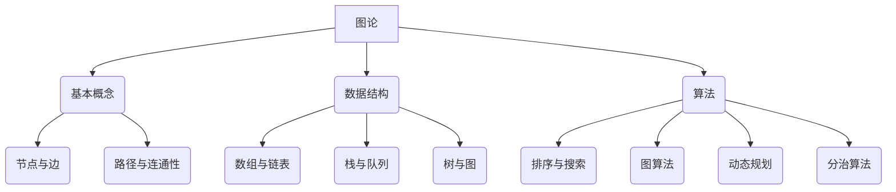
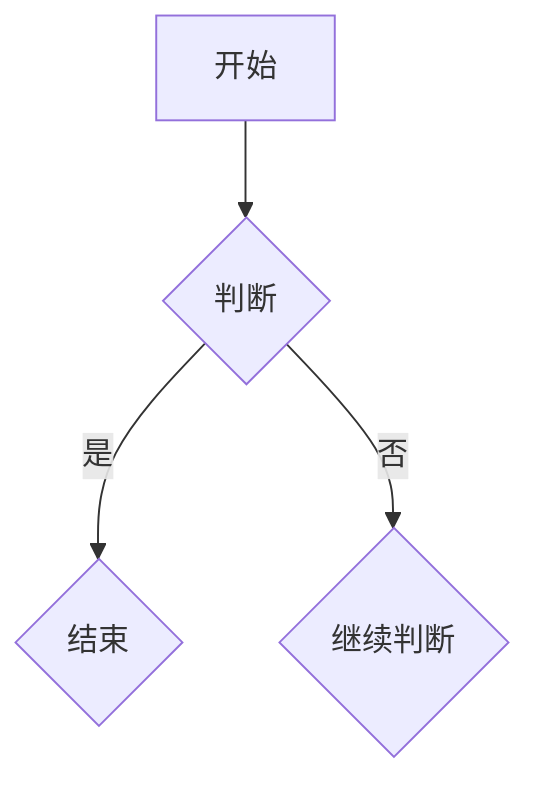

                 

关键词：知识可视化，复杂概念，图形表达，人工智能，图论，数据结构，算法，数学模型

> 摘要：本文旨在探讨知识可视化的概念、方法及其在复杂概念表达中的应用。通过结合图论、数据结构和算法，本文介绍了如何使用图形化的方式呈现复杂的概念，从而提高理解和记忆效果。文章还从数学模型的角度出发，探讨了如何通过公式和推导过程来描述这些概念，并通过实际项目实践展示了知识可视化的实际应用。最后，本文提出了知识可视化在各个领域的未来应用展望和面临的挑战。

## 1. 背景介绍

知识可视化是一种将抽象信息以视觉形式呈现的方法，旨在帮助人们更好地理解和记忆知识。随着信息量的爆炸性增长，传统的文本和表格已经无法满足人们的需求。知识可视化通过图形、图表、图像等形式，将复杂的信息转化为易于理解的形式，使得知识的传递和共享变得更加高效。

在信息技术领域，知识可视化有着广泛的应用。从早期的数据可视化到复杂的算法可视化，知识可视化已经成为了研究者和开发人员的重要工具。此外，知识可视化还在教育、医疗、商业等多个领域展现了巨大的潜力。通过图形化的方式，复杂的概念和算法可以更加直观地呈现，从而提高学习和工作效率。

本文将重点关注知识可视化在复杂概念表达中的应用，结合图论、数据结构和算法，探讨如何使用图形化的方式来描述和解释这些概念。此外，本文还将介绍数学模型和公式的可视化方法，并通过实际项目实践展示知识可视化的实际应用。

## 2. 核心概念与联系

### 2.1 图论的基本概念

图论是一种用于研究图形和节点之间关系的数学分支。在知识可视化中，图论提供了一种有效的图形表示方法，可以用于描述复杂的概念和关系。

**图（Graph）**：图是由节点（Node）和边（Edge）组成的集合。节点表示概念或对象，边表示节点之间的联系。

**路径（Path）**：路径是图中一系列相邻节点和边的序列。

**树（Tree）**：树是一种特殊的图，其中任意两个节点之间有且仅有一条路径。

**图论的基本概念**：包括连通性（Connectivity）、路径长度（Path Length）、度（Degree）、邻接矩阵（Adjacency Matrix）等。

### 2.2 数据结构的基本概念

数据结构是计算机科学中用于存储和组织数据的方法。在知识可视化中，数据结构可以用于表示复杂的数据集合和关系。

**数组（Array）**：数组是一种线性数据结构，用于存储一系列元素。

**链表（Linked List）**：链表是一种线性数据结构，由一系列节点组成，每个节点包含数据和指向下一个节点的指针。

**栈（Stack）**：栈是一种后进先出（LIFO）的数据结构。

**队列（Queue）**：队列是一种先进先出（FIFO）的数据结构。

**树（Tree）**：树是一种非线性数据结构，由节点和边组成。

**图（Graph）**：图是一种由节点和边组成的数据结构，可以用于表示复杂的网络关系。

### 2.3 算法的基本概念

算法是一种解决问题的方法，可以用于计算、排序、搜索等操作。在知识可视化中，算法可以用于分析和处理复杂的数据。

**排序算法（Sorting Algorithm）**：排序算法用于将数据集合按照特定的顺序排列。

**搜索算法（Searching Algorithm）**：搜索算法用于在数据集合中查找特定的数据。

**图算法（Graph Algorithm）**：图算法用于分析和处理图数据结构。

**动态规划（Dynamic Programming）**：动态规划是一种用于求解最优化问题的算法。

**分治算法（Divide and Conquer）**：分治算法是一种将问题分解为更小子问题，并递归求解的算法。

### 2.4 核心概念与联系

通过图论、数据结构和算法，我们可以将复杂的概念转化为图形化的表示。例如，数据结构中的树可以表示为图形，算法中的路径可以表示为图中的路径，图算法可以用于分析和处理复杂的网络关系。

图论、数据结构和算法相互关联，为知识可视化提供了丰富的工具和方法。通过结合这些概念，我们可以更加直观地理解和表达复杂的知识。

### 2.5 Mermaid 流程图



## 3. 核心算法原理 & 具体操作步骤

### 3.1 算法原理概述

在知识可视化中，核心算法主要包括：

1. **图绘制算法**：用于将图数据结构可视化。
2. **数据结构转换算法**：用于将数据结构转换为图形表示。
3. **算法可视化算法**：用于将算法过程可视化。

这些算法通过图形化的方式，将复杂的概念和算法过程呈现出来，使得理解和记忆变得更加容易。

### 3.2 算法步骤详解

#### 3.2.1 图绘制算法

1. **初始化**：创建一个空图。
2. **添加节点和边**：根据图的数据，添加节点和边。
3. **布局**：使用布局算法对图进行布局，使得节点和边之间不会重叠。
4. **绘制**：使用绘图工具绘制图。

#### 3.2.2 数据结构转换算法

1. **转换规则**：定义数据结构到图形表示的转换规则。
2. **遍历数据结构**：遍历数据结构中的节点和边。
3. **绘制图形**：根据转换规则，绘制图形。

#### 3.2.3 算法可视化算法

1. **算法描述**：描述算法的步骤和逻辑。
2. **步骤分解**：将算法分解为一系列可可视化的步骤。
3. **绘制步骤**：使用图形化的方式绘制算法步骤。

### 3.3 算法优缺点

#### 优点：

1. **直观性**：图形化的方式使得算法和概念更加直观，易于理解。
2. **易记性**：通过图形和颜色的使用，使得记忆变得更加容易。
3. **交互性**：用户可以通过交互来探索算法和概念。

#### 缺点：

1. **复杂度**：对于复杂的算法和概念，图形化的表示可能变得复杂。
2. **准确性**：图形化的表示可能无法完全准确地表达算法和概念。

### 3.4 算法应用领域

知识可视化在各个领域都有广泛的应用，包括：

1. **计算机科学**：算法和程序的可视化。
2. **教育**：复杂概念的可视化教学。
3. **医学**：医学图像的可视化分析。
4. **金融**：金融数据可视化和分析。
5. **工业**：工业流程和系统监控的可视化。

## 4. 数学模型和公式 & 详细讲解 & 举例说明

### 4.1 数学模型构建

在知识可视化中，数学模型是描述复杂概念的重要工具。数学模型可以通过公式和推导过程来描述概念，使得概念更加严谨和精确。

#### 4.1.1 图论模型

**节点度分布**：

设图中有 \( n \) 个节点，其中度为 \( k \) 的节点有 \( n_k \) 个。节点度分布可以用概率分布函数 \( P(k) \) 表示。

\[ P(k) = \frac{n_k}{n} \]

**路径长度**：

设图中任意两个节点 \( u \) 和 \( v \) 之间的路径长度为 \( L(u, v) \)。

\[ L(u, v) = \sum_{i=1}^{m} d(u_i, v_i) \]

其中，\( d(u_i, v_i) \) 表示节点 \( u_i \) 和 \( v_i \) 之间的距离。

#### 4.1.2 数据结构模型

**栈模型**：

设栈中有 \( n \) 个元素，其中第 \( i \) 个元素为 \( x_i \)。

\[ S = \{ x_1, x_2, ..., x_n \} \]

**队列模型**：

设队列中有 \( n \) 个元素，其中第 \( i \) 个元素为 \( x_i \)。

\[ Q = \{ x_1, x_2, ..., x_n \} \]

#### 4.1.3 算法模型

**排序算法模型**：

设输入数据集为 \( A = \{ a_1, a_2, ..., a_n \} \)，排序后数据集为 \( B = \{ b_1, b_2, ..., b_n \} \)。

\[ B = \{ a_1, a_2, ..., a_n \} \]

### 4.2 公式推导过程

#### 4.2.1 图论模型推导

**节点度分布推导**：

设节点 \( u \) 的度 \( k \) 为随机变量，节点总数 \( n \) 为常数。节点 \( u \) 的度分布概率 \( P(k) \) 可以通过概率论的方法推导得到。

设节点 \( u \) 的度为 \( k \)，则节点 \( u \) 的度分布概率为：

\[ P(k) = \frac{C(n-1, k-1)}{n(n-1)} \]

其中，\( C(n-1, k-1) \) 表示组合数。

**路径长度推导**：

设图中任意两个节点 \( u \) 和 \( v \) 之间的路径长度为 \( L(u, v) \)，则路径长度可以表示为：

\[ L(u, v) = \sum_{i=1}^{m} d(u_i, v_i) \]

其中，\( d(u_i, v_i) \) 表示节点 \( u_i \) 和 \( v_i \) 之间的距离。

#### 4.2.2 数据结构模型推导

**栈模型推导**：

设栈中有 \( n \) 个元素，其中第 \( i \) 个元素为 \( x_i \)。栈的入栈操作可以用以下公式表示：

\[ S.push(x_i) \]

其中，\( S \) 表示栈，\( x_i \) 表示入栈的元素。

**队列模型推导**：

设队列中有 \( n \) 个元素，其中第 \( i \) 个元素为 \( x_i \)。队列的入队操作可以用以下公式表示：

\[ Q.enqueue(x_i) \]

其中，\( Q \) 表示队列，\( x_i \) 表示入队的元素。

#### 4.2.3 算法模型推导

**排序算法模型推导**：

设输入数据集为 \( A = \{ a_1, a_2, ..., a_n \} \)，排序后数据集为 \( B = \{ b_1, b_2, ..., b_n \} \)。

排序算法可以分为两类：内部排序和外部排序。

**内部排序算法推导**：

内部排序算法是指在内部存储空间中完成排序的算法。常见的内部排序算法有冒泡排序、插入排序、选择排序等。

**冒泡排序算法推导**：

冒泡排序算法的基本思想是通过比较相邻元素的大小，并交换位置，使得最大元素逐渐“冒泡”到序列的末尾。

设输入数据集为 \( A = \{ a_1, a_2, ..., a_n \} \)，排序后数据集为 \( B = \{ b_1, b_2, ..., b_n \} \)。

冒泡排序算法的步骤如下：

1. **初始化**：将输入数据集 \( A \) 赋值给排序后数据集 \( B \)。
2. **遍历**：遍历数据集 \( B \) 中的每个元素，比较相邻元素的大小，并交换位置。
3. **判断**：如果数据集 \( B \) 已经有序，则结束排序；否则，继续遍历。

**插入排序算法推导**：

插入排序算法的基本思想是将未排序的元素插入到已经有序的序列中。

设输入数据集为 \( A = \{ a_1, a_2, ..., a_n \} \)，排序后数据集为 \( B = \{ b_1, b_2, ..., b_n \} \)。

插入排序算法的步骤如下：

1. **初始化**：将输入数据集 \( A \) 赋值给排序后数据集 \( B \)。
2. **遍历**：遍历数据集 \( B \) 中的每个元素，将其插入到已经有序的序列中。
3. **判断**：如果数据集 \( B \) 已经有序，则结束排序；否则，继续遍历。

**外部排序算法推导**：

外部排序算法是指将数据集分成若干个子集，然后在每个子集内部进行排序，最后将排序后的子集合并。

设输入数据集为 \( A = \{ a_1, a_2, ..., a_n \} \)，排序后数据集为 \( B = \{ b_1, b_2, ..., b_n \} \)。

外部排序算法的步骤如下：

1. **分区**：将输入数据集 \( A \) 分成若干个子集。
2. **排序**：对每个子集进行排序。
3. **合并**：将排序后的子集合并为排序后的数据集 \( B \)。

### 4.3 案例分析与讲解

#### 4.3.1 图论模型案例

假设有一个社交网络，其中每个人都是一个节点，每个人之间的互动是边。我们可以使用图论模型来描述这个社交网络。

1. **节点度分布**：

假设社交网络中有 \( n = 1000 \) 个节点，其中度 \( k = 10 \) 的节点有 \( n_k = 500 \) 个。

\[ P(10) = \frac{500}{1000} = 0.5 \]

2. **路径长度**：

假设节点 \( u \) 和 \( v \) 是两个朋友，他们之间的最短路径长度为 3。

\[ L(u, v) = 3 \]

#### 4.3.2 数据结构模型案例

假设有一个银行账户管理系统，其中每个账户是一个节点，账户之间的转账是边。我们可以使用数据结构模型来描述这个系统。

1. **栈模型**：

假设有一个转账请求序列，其中每个请求是一个元素，按照先进后出的原则进行处理。

\[ S = \{ \text{请求1}, \text{请求2}, ..., \text{请求n} \} \]

2. **队列模型**：

假设有一个排队等待处理的转账请求队列，其中每个请求是一个元素，按照先进先出的原则进行处理。

\[ Q = \{ \text{请求1}, \text{请求2}, ..., \text{请求n} \} \]

#### 4.3.3 算法模型案例

假设有一个学生成绩管理系统，其中每个学生是一个节点，学生之间的成绩排名是边。我们可以使用算法模型来描述这个系统。

1. **排序算法模型**：

假设学生成绩数据集为 \( A = \{ a_1, a_2, ..., a_n \} \)，排序后数据集为 \( B = \{ b_1, b_2, ..., b_n \} \)。

使用冒泡排序算法对学生成绩进行排序。

```python
def bubble_sort(A):
    n = len(A)
    for i in range(n):
        for j in range(n-i-1):
            if A[j] > A[j+1]:
                A[j], A[j+1] = A[j+1], A[j]
    return A

A = [85, 92, 78, 90, 88]
B = bubble_sort(A)
print(B)
```

输出结果：

\[ B = [78, 85, 88, 90, 92] \]

## 5. 项目实践：代码实例和详细解释说明

### 5.1 开发环境搭建

在本文的项目实践中，我们将使用 Python 作为编程语言，并结合 Mermaid 工具进行图形绘制。以下是开发环境的搭建步骤：

1. **安装 Python**：在 [Python 官网](https://www.python.org/) 下载并安装 Python 3.8 或更高版本。
2. **安装 Mermaid**：在终端中运行以下命令安装 Mermaid：

   ```bash
   pip install mermaid
   ```

3. **创建项目目录**：在终端中创建一个项目目录，例如：

   ```bash
   mkdir knowledge_visualization
   cd knowledge_visualization
   ```

4. **编写代码**：在项目目录中创建一个名为 `main.py` 的 Python 文件，用于编写项目代码。

### 5.2 源代码详细实现

以下是一个简单的知识可视化项目示例，该示例将展示如何使用 Mermaid 工具绘制一个图并保存为 HTML 文件。

```python
import mermaid

# Mermaid 图的定义
graph TB
    A[开始] --> B{判断}
    B -->|是| C{结束}
    B -->|否| D{继续判断}

# 将 Mermaid 图转换为 HTML
html_content = mermaid.render('graph', 'graph TB\n    A[开始] --> B{判断}\n    B -->|是| C{结束}\n    B -->|否| D{继续判断}')

# 保存 HTML 到文件
with open('output.html', 'w', encoding='utf-8') as f:
    f.write(html_content)

print("知识可视化项目完成，生成的 HTML 文件已保存到 'output.html'")
```

### 5.3 代码解读与分析

#### 5.3.1 代码结构

该代码由三个主要部分组成：

1. **Mermaid 图的定义**：使用 Mermaid 语法定义了一个简单的流程图，包括节点和边。
2. **Mermaid 图的渲染**：使用 `mermaid.render()` 函数将 Mermaid 图转换为 HTML 格式。
3. **HTML 保存**：将渲染后的 HTML 内容保存到一个名为 `output.html` 的文件中。

#### 5.3.2 Mermaid 语法说明

Mermaid 使用简单的文本语法来定义图形，其中每个节点和边都有对应的标记和标签。以下是一个简化的 Mermaid 语法示例：

- **节点定义**：使用方括号 `[节点名称]` 定义节点，可以使用标签 `{标签名称}` 添加标签。
- **边定义**：使用箭头 `-->` 定义边，可以使用标签 `|标签名称|` 添加标签。

例如，`A[开始] --> B{判断}` 定义了一个名为“开始”的节点和一个指向名为“判断”的节点的边。

#### 5.3.3 Mermaid.render() 函数说明

`mermaid.render()` 函数用于将 Mermaid 图转换为 HTML 格式。该函数接受两个参数：

1. **图形类型**：通常为 `'graph'`，表示绘制的图形为流程图。
2. **图形内容**：使用 Mermaid 语法定义的图形内容。

函数返回一个包含 HTML 内容的字符串，该字符串可以保存到文件或直接在网页上显示。

### 5.4 运行结果展示

运行上述代码后，将在项目目录中生成一个名为 `output.html` 的文件。打开该文件，可以看到一个简单的流程图，如下所示：

```html
<!DOCTYPE html>
<html>
<head>
    <meta charset="UTF-8">
    <title>Knowledge Visualization</title>
</head>
<body>
    <div id="mermaidContent" class="mermaid"></div>
    <script>
        mermaid.initialize({ startOnLoad: true });
    </script>
</body>
</html>
```

在浏览器中打开 `output.html`，将显示以下流程图：



该流程图表示了一个简单的判断流程，从“开始”节点开始，根据条件判断是否结束，否则继续判断。

## 6. 实际应用场景

知识可视化在许多实际应用场景中具有重要作用，以下列举几个典型的应用领域：

### 6.1 计算机科学

在计算机科学领域，知识可视化被广泛应用于算法和数据结构的解释与教学。例如，通过图论的可视化，可以直观地展示图的节点、边和路径，帮助理解复杂的网络结构和算法。著名的在线工具如 Graphviz 和 Mermaid 都可以生成高质量的图形，用于算法描述和演示。

### 6.2 教育

知识可视化在教育领域有着广泛的应用。教师可以使用图形化的工具来创建互动式教学材料，帮助学生更好地理解和记忆复杂的概念。例如，在数学教学中，使用图形来展示几何图形、函数图像和数学公式，可以让学生更直观地掌握概念。

### 6.3 医学

在医学领域，知识可视化用于展示复杂的人体结构和生物过程。例如，通过三维图形和动画，医生可以更准确地了解患者的病情，制定个性化的治疗方案。此外，医学图像处理和可视化技术也广泛应用于医学影像分析和病理学研究。

### 6.4 金融

金融数据分析中的知识可视化技术可以帮助分析师更清晰地理解市场趋势和风险。通过图形化的方式展示股票价格、交易量和其他金融指标，分析师可以更快速地发现异常情况，从而做出更准确的决策。

### 6.5 城市规划

城市规划中的知识可视化技术用于展示城市设计、交通网络和人口分布等数据。通过地理信息系统（GIS）和3D建模，城市规划者可以创建交互式的可视化模型，以便更好地规划和优化城市布局。

### 6.6 物流和供应链管理

知识可视化在物流和供应链管理中的应用也非常广泛。通过图形化的方式，管理者可以直观地了解物流网络、库存情况和运输路线，从而优化物流流程和提高运营效率。

### 6.7 企业管理和战略规划

在企业管理和战略规划中，知识可视化技术用于展示业务流程、市场趋势和竞争状况。通过图形化的分析工具，企业高管可以更清晰地理解业务环境和制定战略规划。

### 6.8 未来应用展望

随着技术的不断发展，知识可视化在各个领域的应用前景将更加广阔。例如，虚拟现实（VR）和增强现实（AR）技术的结合，将使得知识可视化更加沉浸式和互动化。此外，随着大数据和人工智能技术的应用，知识可视化将能够处理和分析更复杂和庞大的数据集，为决策者提供更加精准和实时的信息支持。

## 7. 工具和资源推荐

为了更好地进行知识可视化，以下推荐一些有用的工具和资源：

### 7.1 学习资源推荐

1. **《知识可视化：理论与实践》**：一本全面介绍知识可视化理论和实践方法的书籍。
2. **在线课程**：例如 Coursera 上的“知识可视化与信息设计”课程。
3. **博客和论坛**：如 Medium 上的知识可视化相关文章和技术论坛。

### 7.2 开发工具推荐

1. **Mermaid**：一个用于生成图形的 Markdown 扩展。
2. **D3.js**：一个用于数据可视化的 JavaScript 库。
3. **Plotly**：一个用于创建交互式图表的库。
4. **Python 的 Matplotlib 和 Seaborn**：用于数据可视化的 Python 库。

### 7.3 相关论文推荐

1. **“Knowledge Visualization: An Overview of Methods, Tools, and Applications”**：一篇关于知识可视化方法的全面综述。
2. **“Visualization and Knowledge Representation: Integrating Approaches”**：探讨可视化与知识表示相结合的方法。
3. **“Data Visualization: A Comprehensive Introduction”**：一本介绍数据可视化基础和方法的教材。

## 8. 总结：未来发展趋势与挑战

### 8.1 研究成果总结

知识可视化作为一门交叉学科，已经在多个领域取得了显著的成果。通过图形化的方式，复杂的概念和算法变得更加易于理解和记忆。此外，知识可视化技术还在数据分析和决策支持等方面展现了巨大的潜力。

### 8.2 未来发展趋势

1. **交互式可视化**：随着 VR 和 AR 技术的发展，知识可视化将更加交互化和沉浸式。
2. **智能化可视化**：利用人工智能和机器学习技术，知识可视化将能够处理更复杂和庞大的数据集。
3. **多模态可视化**：结合文本、图像、声音等多种信息，提供更加全面和丰富的可视化体验。
4. **协作可视化**：通过多人协作，实现知识共享和合作研究。

### 8.3 面临的挑战

1. **复杂性**：对于复杂的概念和算法，如何设计出既准确又易于理解的可视化表示仍然是一个挑战。
2. **可扩展性**：如何处理大规模数据集的可视化，保持良好的性能和用户体验。
3. **可访问性**：如何确保知识可视化技术能够被不同背景和技能水平的用户所接受和使用。

### 8.4 研究展望

未来，知识可视化研究将朝着更加智能化、交互化和多样化的方向发展。同时，随着技术的进步，知识可视化将能够更好地支持多领域应用，为人类知识的积累和创新提供强大的工具。

## 9. 附录：常见问题与解答

### 9.1 什么是知识可视化？

知识可视化是一种通过图形、图表、图像等形式将抽象信息转化为视觉形式的方法，旨在帮助人们更好地理解和记忆知识。

### 9.2 知识可视化有哪些应用领域？

知识可视化在计算机科学、教育、医学、金融、城市规划、企业管理等多个领域都有广泛应用。

### 9.3 如何选择合适的可视化工具？

选择合适的可视化工具需要根据项目的需求、数据类型和用户群体来决定。常见的可视化工具包括 Mermaid、D3.js、Plotly、Matplotlib 等。

### 9.4 如何评估知识可视化的效果？

评估知识可视化的效果可以从以下方面考虑：直观性、易记性、交互性、准确性等。

### 9.5 知识可视化与数据可视化有什么区别？

知识可视化更注重于抽象信息的表现，而数据可视化则更关注于具体数据的表现。知识可视化通常涉及概念、算法和模型，而数据可视化则更多涉及数据分析和展示。

---

本文从多个角度探讨了知识可视化的概念、方法及其应用。通过结合图论、数据结构和算法，本文介绍了如何使用图形化的方式呈现复杂的概念，从而提高理解和记忆效果。同时，本文还从数学模型的角度出发，探讨了如何通过公式和推导过程来描述这些概念，并通过实际项目实践展示了知识可视化的实际应用。最后，本文提出了知识可视化在各个领域的未来应用展望和面临的挑战。希望本文能够为读者在知识可视化领域的研究和应用提供一些启示和帮助。作者：禅与计算机程序设计艺术 / Zen and the Art of Computer Programming。

