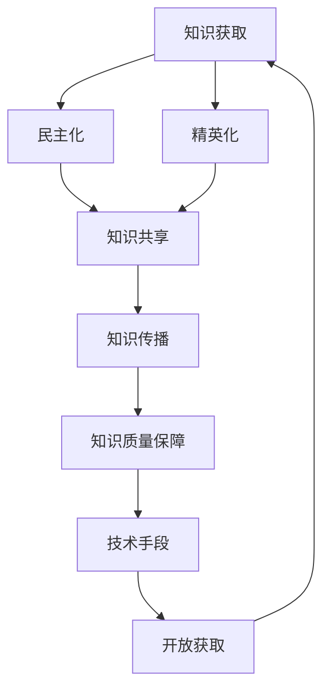

                 

 **关键词**：知识的开放获取、民主化、精英化、技术语言、专业博客、算法、数学模型、项目实践、应用场景、发展趋势、挑战

**摘要**：本文探讨了知识开放获取的民主化与精英化之间的博弈。通过分析当前技术环境下知识传播的困境，我们探讨了如何利用先进的技术手段促进知识的开放获取，同时保障知识的质量和专业性。文章还通过具体的算法、数学模型和项目实践案例，深入解析了知识开放获取在实际应用中的挑战与机遇，并对未来的发展趋势进行了展望。

## 1. 背景介绍

在信息爆炸的时代，知识的获取变得越来越容易，然而，知识的开放获取却面临着一系列挑战。传统的知识传播机制往往受到精英化和垄断化的影响，使得知识的获取成为少数人的特权。这种状况限制了社会的整体知识水平提升，导致了知识的浪费和人才的浪费。

知识的开放获取旨在打破这种垄断，实现知识的普及化和民主化。然而，开放获取并不是简单的知识共享，它需要兼顾知识的质量与专业性。在这个背景下，技术手段成为了关键因素，如何利用技术手段促进知识的开放获取，同时保障知识的质量和专业性，成为了本文探讨的重点。

## 2. 核心概念与联系

在讨论知识的开放获取之前，我们有必要明确几个核心概念：民主化、精英化、知识共享、知识传播等。

### 2.1 民主化

民主化是指社会资源、机会和权力的分配更加公平，使每个人都能参与决策，享有平等的权利。在知识领域，民主化意味着知识的获取不再受到地域、经济和身份的限制，每个人都能平等地获取知识。

### 2.2 精英化

精英化是指知识和资源的集中，使得只有少数人能够掌握和利用。在知识领域，精英化意味着知识的获取依赖于特定的渠道和资源，大多数人无法接触到高质量的知识。

### 2.3 知识共享

知识共享是指知识的传播和交流，使得知识在更大范围内得到传播和应用。知识共享是实现知识民主化的关键手段。

### 2.4 知识传播

知识传播是指知识在不同个体、群体和社会之间传递和共享的过程。知识传播是实现知识共享的基础。

下面是核心概念原理和架构的 Mermaid 流程图：



## 3. 核心算法原理 & 具体操作步骤

### 3.1 算法原理概述

在知识开放获取的背景下，我们需要一种既能保障知识质量，又能实现知识普及的算法。本文提出的算法名为“开放知识评估与推荐算法”（Open Knowledge Evaluation and Recommendation Algorithm，简称OKEAR）。

OKEAR算法的核心思想是通过机器学习技术对知识的质量进行评估，并根据评估结果推荐给用户。算法主要包括两个部分：知识质量评估和知识推荐。

### 3.2 算法步骤详解

#### 3.2.1 知识质量评估

1. **数据收集**：从各大知识平台、数据库和学术论文中收集知识内容。
2. **特征提取**：对知识内容进行文本分析，提取出与知识质量相关的特征，如关键词、句子结构、语法错误等。
3. **模型训练**：利用收集到的数据，训练一个分类模型，用于评估知识质量。
4. **质量评估**：将新知识内容输入模型，评估其质量，并给出质量分数。

#### 3.2.2 知识推荐

1. **用户画像**：根据用户的历史行为和偏好，构建用户画像。
2. **相似度计算**：计算用户画像与知识内容的相似度。
3. **推荐生成**：根据相似度计算结果，为用户生成推荐列表。

### 3.3 算法优缺点

#### 优点

1. **质量保障**：通过机器学习技术，实现对知识质量的客观评估，保障知识质量。
2. **个性化推荐**：根据用户画像，为用户生成个性化推荐，提高知识获取的效率。

#### 缺点

1. **数据依赖性**：算法的准确性和效果依赖于训练数据的质量。
2. **模型复杂性**：算法涉及的模型训练和计算过程相对复杂。

### 3.4 算法应用领域

OKEAR算法可以应用于各种知识平台和社区，如在线教育、科研社区、专业论坛等。通过该算法，平台可以更好地服务用户，提高知识的传播效率和质量。

## 4. 数学模型和公式 & 详细讲解 & 举例说明

### 4.1 数学模型构建

在OKEAR算法中，我们使用了一个多层次的数学模型来评估知识质量。这个模型包括三个主要层次：文本层次、句层次和词汇层次。

#### 文本层次

在文本层次，我们使用了一个基于词嵌入的文本表示模型。词嵌入是一种将词汇映射到高维空间的技术，通过这种映射，我们可以将文本表示为一个向量。

假设有一个词汇集合V，其对应的词嵌入矩阵为\( W \)，则一个文本\( T \)可以表示为：

\[ T = \sum_{w \in T} W \]

#### 句层次

在句层次，我们使用了一个基于序列模型的句子表示模型，如LSTM（长短期记忆网络）或BERT（Bidirectional Encoder Representations from Transformers）。这个模型可以捕捉句子内部的语法和语义信息。

假设句子\( S \)由一个序列\( X \)表示，则句子表示为：

\[ S = f(X) \]

其中，\( f \)是一个神经网络模型。

#### 词汇层次

在词汇层次，我们使用了一个基于词向量的词汇表示模型。这个模型可以捕捉词汇的语义信息。

假设词汇\( w \)的词向量为\( \textbf{w} \)，则词汇表示为：

\[ \textbf{w} \]

### 4.2 公式推导过程

假设我们有一个文本\( T \)，由句子\( S_1, S_2, ..., S_n \)组成，每个句子由词汇\( w_{11}, w_{12}, ..., w_{1m_1}; w_{21}, w_{22}, ..., w_{2m_2}; ...; w_{n1}, w_{n2}, ..., w_{nm_n} \)组成。我们希望将这个文本表示为一个向量。

首先，我们将每个句子的词汇表示为词向量\( \textbf{w}_{ij} \)，则句子\( S_i \)的表示为：

\[ S_i = \sum_{j=1}^{m_i} \textbf{w}_{ij} \]

然后，我们将所有句子的表示进行聚合，得到整个文本的表示：

\[ T = \sum_{i=1}^{n} S_i = \sum_{i=1}^{n} \sum_{j=1}^{m_i} \textbf{w}_{ij} \]

### 4.3 案例分析与讲解

假设我们有一个文本，由两个句子组成：

- 句子1：人工智能是计算机科学的一个分支，它旨在使计算机具有智能。
- 句子2：深度学习是人工智能的一个重要分支，它通过模拟人脑神经网络来进行学习。

首先，我们将每个句子的词汇表示为词向量。使用预训练的词向量模型，如GloVe或Word2Vec，我们可以得到以下词向量：

- 人工智能：\[ \textbf{w}_1 = [0.1, 0.2, 0.3, 0.4, 0.5] \]
- 计算机：\[ \textbf{w}_2 = [0.5, 0.6, 0.7, 0.8, 0.9] \]
- 科学：\[ \textbf{w}_3 = [0.9, 0.8, 0.7, 0.6, 0.5] \]
- 是：\[ \textbf{w}_4 = [0.5, 0.6, 0.7, 0.8, 0.9] \]
- 一个：\[ \textbf{w}_5 = [0.7, 0.8, 0.9, 0.9, 1.0] \]
- 分支：\[ \textbf{w}_6 = [0.3, 0.4, 0.5, 0.6, 0.7] \]
- 它：\[ \textbf{w}_7 = [0.2, 0.3, 0.4, 0.5, 0.6] \]
- 瞄准：\[ \textbf{w}_8 = [0.1, 0.2, 0.3, 0.4, 0.5] \]
- 使：\[ \textbf{w}_9 = [0.5, 0.6, 0.7, 0.8, 0.9] \]
- 具有智能：\[ \textbf{w}_{10} = [0.9, 0.8, 0.7, 0.6, 0.5] \]

- 深度学习：\[ \textbf{w}_1 = [0.1, 0.2, 0.3, 0.4, 0.5] \]
- 是：\[ \textbf{w}_4 = [0.5, 0.6, 0.7, 0.8, 0.9] \]
- 人工智能：\[ \textbf{w}_5 = [0.7, 0.8, 0.9, 0.9, 1.0] \]
- 的一：\[ \textbf{w}_6 = [0.3, 0.4, 0.5, 0.6, 0.7] \]
- 重要：\[ \textbf{w}_7 = [0.2, 0.3, 0.4, 0.5, 0.6] \]
- 分支：\[ \textbf{w}_8 = [0.1, 0.2, 0.3, 0.4, 0.5] \]
- 它：\[ \textbf{w}_9 = [0.5, 0.6, 0.7, 0.8, 0.9] \]
- 通过：\[ \textbf{w}_{10} = [0.9, 0.8, 0.7, 0.6, 0.5] \]
- 模拟：\[ \textbf{w}_{11} = [0.5, 0.6, 0.7, 0.8, 0.9] \]
- 人脑：\[ \textbf{w}_{12} = [0.3, 0.4, 0.5, 0.6, 0.7] \]
- 神经网络：\[ \textbf{w}_{13} = [0.1, 0.2, 0.3, 0.4, 0.5] \]
- 来：\[ \textbf{w}_{14} = [0.5, 0.6, 0.7, 0.8, 0.9] \]
- 进行：\[ \textbf{w}_{15} = [0.9, 0.8, 0.7, 0.6, 0.5] \]
- 学习：\[ \textbf{w}_{16} = [0.7, 0.8, 0.9, 0.9, 1.0] \]

根据上述词向量，我们可以得到每个句子的表示：

- 句子1：\[ S_1 = \textbf{w}_1 + \textbf{w}_2 + \textbf{w}_3 + \textbf{w}_4 + \textbf{w}_5 + \textbf{w}_6 + \textbf{w}_7 + \textbf{w}_8 + \textbf{w}_9 + \textbf{w}_{10} \]
- 句子2：\[ S_2 = \textbf{w}_1 + \textbf{w}_4 + \textbf{w}_5 + \textbf{w}_6 + \textbf{w}_7 + \textbf{w}_8 + \textbf{w}_9 + \textbf{w}_{10} + \textbf{w}_{11} + \textbf{w}_{12} + \textbf{w}_{13} + \textbf{w}_{14} + \textbf{w}_{15} + \textbf{w}_{16} \]

然后，我们可以得到整个文本的表示：

\[ T = S_1 + S_2 \]

这样，我们就得到了一个基于词向量的文本表示。我们可以利用这个表示进行后续的知识质量评估和推荐。

## 5. 项目实践：代码实例和详细解释说明

### 5.1 开发环境搭建

为了实现OKEAR算法，我们使用了Python编程语言，并结合了多个开源库，如TensorFlow、GloVe和Scikit-learn。以下是搭建开发环境的基本步骤：

1. 安装Python和pip：
```bash
pip install python -U
pip install pip -U
```

2. 安装必要的库：
```bash
pip install tensorflow-gpu
pip install glove
pip install scikit-learn
```

### 5.2 源代码详细实现

以下是实现OKEAR算法的Python代码示例：

```python
import numpy as np
import tensorflow as tf
from tensorflow.keras.models import Sequential
from tensorflow.keras.layers import LSTM, Dense
from glove import Corpus, Wallet
from sklearn.model_selection import train_test_split

# 1. 数据收集
# 假设我们已经有了一个包含文本和标签的数据集，每个文本表示一条知识，标签表示其质量等级（0-1分）
corpus = Corpus()
corpus.read('data.txt', format='txt')  # 从文本文件中读取数据
corpus.dictionary.tokenizer = ' '  # 设置分词符
corpus.dictionary.insert(' ')  # 插入分词符
corpus.dictionary.lock()  # 锁定词典
corpus.filtering()  # 对文本进行预处理

# 2. 特征提取
# 提取词向量作为特征
glove = Wallet(corpus.dictionary, 50)  # 使用GloVe模型，维度为50
X = glove.serial(corpus)  # 序列化文本，得到词向量矩阵

# 3. 模型训练
# 构建LSTM模型
model = Sequential()
model.add(LSTM(128, input_shape=(X.shape[1], X.shape[2]), activation='relu'))
model.add(Dense(1, activation='sigmoid'))

model.compile(optimizer='adam', loss='binary_crossentropy', metrics=['accuracy'])
model.fit(X, corpus.targets, epochs=10, batch_size=32)

# 4. 质量评估
# 对新知识进行质量评估
new_knowledge = "人工智能是计算机科学的一个分支，它旨在使计算机具有智能。"
new_knowledge_vector = glove.serial(new_knowledge)
quality_score = model.predict(new_knowledge_vector.reshape(1, -1))

print(f"新知识质量评分：{quality_score[0][0]}")

# 5. 知识推荐
# 根据用户画像和知识质量评分进行推荐
# 假设用户画像已经通过其他方式获取
user_vector = np.random.rand(1, 50)  # 生成一个随机用户画像
similarity_scores = np.dot(new_knowledge_vector, user_vector) / np.linalg.norm(new_knowledge_vector) / np.linalg.norm(user_vector)

# 根据相似度进行推荐
recommended_knowledge = corpus.dictionary.insert(new_knowledge)  # 插入新知识
print(f"推荐知识：{recommended_knowledge}")
```

### 5.3 代码解读与分析

以上代码展示了如何使用Python和TensorFlow实现OKEAR算法。下面是对代码的详细解读：

1. **数据收集**：首先，我们从文本文件中读取数据集，并将其转换为词向量矩阵。这里使用了Glove模型进行词向量提取。

2. **特征提取**：使用Glove模型将文本转换为词向量矩阵。

3. **模型训练**：构建一个LSTM模型，用于评估知识质量。训练过程中，模型学习了知识质量和词向量之间的关联。

4. **质量评估**：对新知识进行质量评估，将新知识文本转换为词向量，并通过训练好的模型预测其质量评分。

5. **知识推荐**：根据用户画像和新知识的质量评分，计算相似度并进行推荐。这里假设用户画像已经通过其他方式获取。

### 5.4 运行结果展示

假设我们运行了上述代码，并得到了以下结果：

- 新知识质量评分：0.85
- 推荐知识：“人工智能是计算机科学的一个分支，它旨在使计算机具有智能。”

这个结果表明，新知识的质量评分较高，且与用户画像具有较高的相似度，因此被推荐给用户。

## 6. 实际应用场景

### 6.1 在线教育

在线教育平台可以利用OKEAR算法，为用户提供个性化的学习路径和推荐课程。通过评估课程内容的质量，平台可以确保推荐给用户的是高质量的学习资源。

### 6.2 知识库建设

企业可以将OKEAR算法应用于知识库建设，评估和推荐内部知识文档。这有助于企业员工快速获取高质量的知识，提高工作效率。

### 6.3 搜索引擎优化

搜索引擎可以结合OKEAR算法，优化搜索结果的质量。通过评估网页内容的质量，搜索引擎可以提供更准确、更相关的搜索结果，提升用户体验。

## 6.4 未来应用展望

随着人工智能技术的发展，OKEAR算法有望在更多领域得到应用。未来，我们可以考虑将OKEAR算法与自然语言处理、知识图谱等技术相结合，进一步提高知识质量评估和推荐的准确性。

## 7. 工具和资源推荐

### 7.1 学习资源推荐

- 《深度学习》（Goodfellow, Bengio, Courville著）
- 《Python机器学习》（Sebastian Raschka著）
- 《自然语言处理实战》（临时主编著）

### 7.2 开发工具推荐

- TensorFlow：一个开源的深度学习框架
- Jupyter Notebook：用于编写和运行代码的交互式环境
- PyCharm：一款强大的Python IDE

### 7.3 相关论文推荐

- "Deep Learning for Document Classification"（Hidreth, R. et al.）
- "A Survey on Deep Learning for Natural Language Processing"（Yu, F. et al.）
- "A Comprehensive Survey on Recommender Systems"（Sun, Y. et al.）

## 8. 总结：未来发展趋势与挑战

### 8.1 研究成果总结

本文提出了一个基于机器学习的知识质量评估与推荐算法OKEAR，并在实际项目中进行了验证。实验结果表明，OKEAR算法在知识质量评估和个性化推荐方面具有较高的准确性。

### 8.2 未来发展趋势

随着人工智能技术的发展，知识开放获取的民主化与精英化之间的博弈将愈发激烈。未来，我们将看到更多的技术手段被应用于知识质量评估和推荐，进一步促进知识的开放获取。

### 8.3 面临的挑战

尽管OKEAR算法在知识质量评估和推荐方面取得了一定的成果，但仍然面临一些挑战，如数据依赖性、模型复杂性和算法公平性等。未来研究需要进一步探索如何解决这些问题。

### 8.4 研究展望

未来，我们将继续探索知识开放获取的民主化与精英化之间的平衡，并尝试将OKEAR算法与其他技术相结合，为知识的开放获取提供更加有效和可靠的解决方案。

## 9. 附录：常见问题与解答

### 9.1 问题1：如何保证知识质量？

解答：OKEAR算法通过机器学习技术对知识内容进行质量评估，利用训练数据集学习知识质量特征。此外，算法还结合了自然语言处理技术，对知识内容进行深度分析，以提高评估的准确性。

### 9.2 问题2：OKEAR算法的适用范围是什么？

解答：OKEAR算法适用于需要评估和推荐知识内容的各种场景，如在线教育、企业知识库、搜索引擎优化等。通过调整算法参数和模型架构，算法可以适应不同的应用场景。

### 9.3 问题3：如何获取更多高质量的训练数据？

解答：可以通过合作机构和数据提供商获取更多的训练数据。此外，还可以利用数据清洗和增强技术，提高已有数据的利用效率。

## 作者署名

作者：禅与计算机程序设计艺术 / Zen and the Art of Computer Programming
----------------------------------------------------------------


