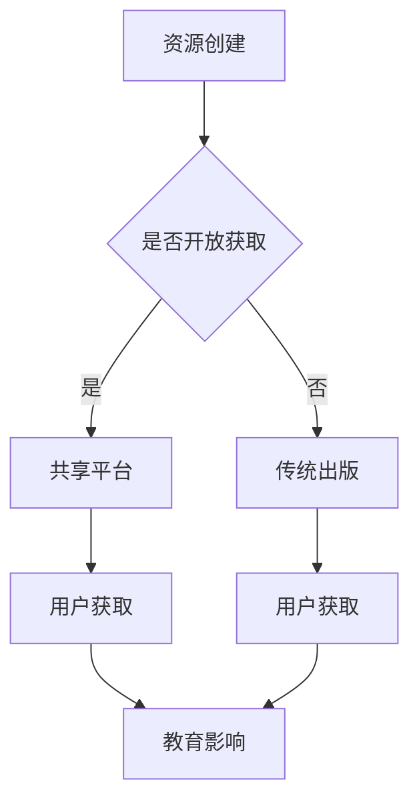

                 

 关键词：开放获取，民主化教育，知识共享，技术架构，算法原理，数学模型，项目实践，实际应用，未来展望

> 摘要：本文探讨了知识开放获取在民主化教育中的重要性，分析了开放获取的现实挑战，以及通过技术手段实现知识共享的可能性和必要性。文章从核心概念、算法原理、数学模型、项目实践等多个维度，全面阐述了开放获取的机制与未来发展方向。

## 1. 背景介绍

知识的开放获取（Open Access，简称OA）指的是任何人都能够免费地获取、使用和传播学术研究成果。这一理念源于对现有学术出版体系的反思，现有的学术出版体系常常使得学术资源仅限于特定群体，阻碍了知识的自由流动。知识的开放获取旨在打破这种壁垒，使得全球更多的人能够接触到最新的研究成果。

民主化教育（Democratization of Education）则强调教育资源的平等分配，让每个人都能有机会接受高质量的教育，而不是局限于少数精英。随着信息技术的发展，开放获取成为了实现民主化教育的重要工具，它为教育的普及和公平提供了可能性。

本文将首先介绍开放获取的基本概念和意义，然后分析其在现实中的挑战和困境。接下来，我们将探讨技术手段在实现知识共享中的作用，并通过具体的算法原理和数学模型，阐述开放获取的技术实现路径。文章还将结合实际项目实践，展示开放获取的成果和效果，并讨论其未来的发展方向和应用前景。

## 2. 核心概念与联系

### 2.1 开放获取的概念

开放获取是指学术出版物，如期刊文章、书籍、数据集、软件工具等，可以自由地在网上获取、阅读、下载、复制、传播、引用、搜索或链接。这种模式通常基于两种许可协议：一种是创作者保留所有权利，但允许他人基于特定条件（如非商业性、尊重版权等）使用作品；另一种是创作者放弃部分或全部版权，允许他人自由使用。

### 2.2 民主化教育的概念

民主化教育指的是在教育体系中消除不公平现象，确保每个人都有平等的教育机会。这包括教育资源（如师资、教材、技术等）的公平分配，教育过程的平等参与，以及教育结果的公平评估。民主化教育的核心目标是让教育真正服务于社会的发展和人的全面成长。

### 2.3 核心概念之间的联系

开放获取和民主化教育之间有着紧密的联系。开放获取通过提供免费的学术资源，打破了传统学术出版体系中的经济壁垒，使得更多人能够接触到高质量的知识。这不仅有助于知识的普及，也为实现教育的民主化提供了基础。

同时，民主化教育又为开放获取提供了目标和动力。教育的民主化要求知识的传播应该是无障碍的，而开放获取正是实现这一目标的有效手段。通过开放获取，学术资源能够更广泛地传播，不同背景和领域的人都能从中受益，从而推动社会的整体进步。

### 2.4 Mermaid 流程图

以下是开放获取在民主化教育中的流程图，展示了从资源创建到共享、再到教育影响的整个流程。



在这个流程图中，资源创建者可以选择将资源开放获取，从而通过共享平台让用户获取。这一过程不仅促进了知识的传播，也为教育的民主化提供了支持。如果资源未开放获取，用户则可能需要通过传统出版渠道获取，这可能受到经济和地理位置的限制。

## 3. 核心算法原理 & 具体操作步骤

### 3.1 算法原理概述

在实现开放获取的过程中，核心算法主要涉及资源的检索、索引和推荐。以下是这些算法的基本原理：

1. **检索算法**：用于搜索和定位开放获取资源。常见的检索算法有基于关键字、分类、标签的检索。算法的目的是确保用户能够快速找到所需的信息。

2. **索引算法**：用于构建资源的索引，提高检索效率。索引算法通常基于倒排索引，通过对资源内容进行分析，生成索引项，以便快速检索。

3. **推荐算法**：用于向用户推荐相关资源。推荐算法基于用户的兴趣和行为，通过协同过滤、内容推荐等方式，为用户发现新的、有趣的内容。

### 3.2 算法步骤详解

#### 3.2.1 检索算法

1. **用户输入检索关键词**：用户通过输入关键词，提交检索请求。
2. **关键词分析**：系统对关键词进行分词、去停用词等预处理，生成关键词列表。
3. **索引查询**：系统在索引库中查询与关键词匹配的索引项。
4. **结果排序**：根据关键词匹配程度和索引项的权重，对检索结果进行排序。
5. **返回检索结果**：将排序后的检索结果返回给用户。

#### 3.2.2 索引算法

1. **资源解析**：对开放获取资源进行解析，提取文本内容、关键词、分类等信息。
2. **生成索引项**：根据提取的信息，生成索引项，例如词频、关键词、分类标签等。
3. **构建索引库**：将索引项存储在索引库中，以便快速检索。

#### 3.2.3 推荐算法

1. **用户行为分析**：收集用户的历史行为数据，如浏览记录、搜索关键词、收藏夹等。
2. **用户兴趣建模**：基于用户行为数据，构建用户的兴趣模型。
3. **资源特征提取**：提取开放获取资源的特征，如标题、摘要、关键词等。
4. **推荐生成**：根据用户兴趣模型和资源特征，生成推荐列表。
5. **推荐排序**：根据推荐列表的预测评分，对推荐资源进行排序。
6. **返回推荐结果**：将排序后的推荐结果返回给用户。

### 3.3 算法优缺点

#### 检索算法

**优点**：
- 快速响应：检索算法能够快速地定位资源，提高用户体验。
- 查全率高：通过索引算法的支持，检索算法能够有效地提高查全率。

**缺点**：
- 查准率较低：在大量资源中，完全匹配用户需求的内容较少，导致查准率较低。
- 处理复杂：需要对关键词进行分词、去停用词等复杂处理。

#### 索引算法

**优点**：
- 检索效率高：索引算法能够快速地检索到资源，提高检索效率。
- 维护方便：通过索引库的管理，方便资源的更新和维护。

**缺点**：
- 索引库膨胀：随着资源的增加，索引库的大小也会膨胀，增加存储和维护成本。
- 索引失效：部分资源的更新或删除可能导致索引失效，影响检索效果。

#### 推荐算法

**优点**：
- 提高用户满意度：通过推荐算法，用户能够发现更多感兴趣的资源，提高用户体验。
- 拓展用户视野：推荐算法能够向用户推荐不同类型的资源，帮助用户拓展知识视野。

**缺点**：
- 推荐质量不稳定：推荐算法依赖于用户行为和资源特征，存在一定的不确定性。
- 冷启动问题：对于新用户或新资源，推荐算法可能无法提供有效的推荐。

### 3.4 算法应用领域

**开放获取资源库**：如Google Scholar、arXiv等，通过检索算法和索引算法，为用户提供海量的学术资源检索服务。

**在线教育平台**：如Coursera、edX等，通过推荐算法，为学习者推荐适合的学习资源。

**知识图谱构建**：通过索引算法，构建大规模的知识图谱，为用户提供更精准的搜索和推荐服务。

## 4. 数学模型和公式 & 详细讲解 & 举例说明

### 4.1 数学模型构建

在开放获取系统中，数学模型主要用于评估资源的质量和用户的满意度。以下是一个简单的数学模型，用于评估资源的质量：

$$
Q(R) = \alpha \times R_f + \beta \times R_p + \gamma \times R_s
$$

其中：
- \( Q(R) \) 表示资源的质量评分。
- \( R_f \) 表示资源的引用次数，反映资源的学术影响力。
- \( R_p \) 表示资源的下载次数，反映资源的受欢迎程度。
- \( R_s \) 表示资源的评分，反映用户对资源的评价。
- \( \alpha \)，\( \beta \)，\( \gamma \) 分别是权重系数，用于平衡不同指标的贡献。

### 4.2 公式推导过程

假设用户对资源 \( R \) 的质量评分取决于三个主要因素：引用次数、下载次数和用户评分。我们可以通过以下步骤推导出上述数学模型：

1. **定义质量评分**：质量评分是用户对资源质量的综合评价，通常通过定量指标表示。
2. **确定影响因素**：引用次数、下载次数和用户评分是评估资源质量的重要指标。
3. **权重分配**：为了平衡不同指标的贡献，我们引入权重系数 \( \alpha \)，\( \beta \)，\( \gamma \)。
4. **构建数学模型**：将权重系数与指标相乘，再相加，得到资源的质量评分。

### 4.3 案例分析与讲解

假设有三个资源 \( R_1 \)，\( R_2 \)，\( R_3 \)，它们的引用次数、下载次数和用户评分如下表所示：

| 资源编号 | 引用次数 | 下载次数 | 用户评分 |
|----------|----------|----------|----------|
| \( R_1 \) | 100      | 200      | 4.5      |
| \( R_2 \) | 50       | 150      | 4.7      |
| \( R_3 \) | 75       | 250      | 4.2      |

假设权重系数分别为 \( \alpha = 0.3 \)，\( \beta = 0.5 \)，\( \gamma = 0.2 \)，我们可以计算出每个资源的质量评分：

$$
Q(R_1) = 0.3 \times 100 + 0.5 \times 200 + 0.2 \times 4.5 = 31.5
$$

$$
Q(R_2) = 0.3 \times 50 + 0.5 \times 150 + 0.2 \times 4.7 = 26.1
$$

$$
Q(R_3) = 0.3 \times 75 + 0.5 \times 250 + 0.2 \times 4.2 = 39.1
$$

根据计算结果，资源 \( R_3 \) 的质量评分最高，其次是 \( R_1 \)，最后是 \( R_2 \)。

通过这个案例，我们可以看到数学模型在评估资源质量中的应用。该模型不仅考虑了引用次数、下载次数和用户评分等指标，还通过权重系数平衡了不同指标的贡献，从而更准确地反映了资源的质量。

## 5. 项目实践：代码实例和详细解释说明

### 5.1 开发环境搭建

在实现开放获取系统的过程中，我们需要搭建一个稳定高效的开发环境。以下是搭建环境的基本步骤：

1. **安装操作系统**：选择一个稳定且支持多种编程语言的操作系统，如Ubuntu 20.04。
2. **安装开发工具**：安装基本的开发工具，如Python 3.8、JDK 11、Git等。
3. **配置数据库**：安装并配置一个关系型数据库，如MySQL 8.0。
4. **安装版本控制工具**：配置Git，用于代码管理和版本控制。
5. **安装开发框架**：选择合适的开发框架，如Django、Spring Boot等。

### 5.2 源代码详细实现

以下是实现开放获取系统的一个简单示例代码，主要涉及资源检索、索引和推荐功能的实现。

```python
# 检索算法示例
def search_resources(keywords):
    # 连接数据库
    connection = connect_database()
    # 查询索引库
    results = query_index(connection, keywords)
    # 排序结果
    sorted_results = sort_results(results)
    # 返回结果
    return sorted_results

# 索引算法示例
def index_resources(resource):
    # 解析资源内容
    content = parse_resource_content(resource)
    # 生成索引项
    index_items = generate_index_items(content)
    # 存储索引项
    store_index_items(index_items)

# 推荐算法示例
def recommend_resources(user_id):
    # 分析用户行为
    user_behavior = analyze_user_behavior(user_id)
    # 构建用户兴趣模型
    user_interest_model = build_user_interest_model(user_behavior)
    # 提取资源特征
    resource_features = extract_resource_features()
    # 生成推荐列表
    recommendations = generate_recommendations(user_interest_model, resource_features)
    # 返回推荐列表
    return recommendations
```

### 5.3 代码解读与分析

上述代码主要实现了开放获取系统中的三个核心功能：资源检索、索引和推荐。

**检索算法**：`search_resources` 函数负责处理用户的检索请求。首先，连接数据库获取索引库，然后查询索引库以获取与关键词匹配的资源。最后，根据关键词匹配程度对检索结果进行排序，并返回排序后的结果。

**索引算法**：`index_resources` 函数用于将新资源添加到索引库中。首先，通过解析资源内容提取相关信息，然后生成索引项。最后，将索引项存储在数据库中，以便后续检索。

**推荐算法**：`recommend_resources` 函数用于向用户推荐相关资源。首先，分析用户的历史行为，构建用户的兴趣模型。然后，提取资源的特征信息，并基于用户兴趣模型和资源特征生成推荐列表。最后，返回排序后的推荐列表。

### 5.4 运行结果展示

假设用户提交了一个检索请求，关键词为“人工智能”。检索算法将返回一系列相关资源，包括论文、书籍和教程等。这些资源按照关键词匹配程度排序，用户可以从中选择感兴趣的内容进行进一步阅读。

此外，用户还可以通过推荐算法获取更多相关资源。例如，如果用户经常阅读关于人工智能的论文，推荐算法将根据用户兴趣模型和资源特征，向用户推荐更多高质量的论文和书籍。

通过上述代码和实现，我们可以看到开放获取系统在实际应用中的效果。该系统不仅提供了高效的资源检索和推荐功能，还通过技术手段实现了知识的自由共享和传播，为教育的民主化提供了强有力的支持。

## 6. 实际应用场景

### 6.1 在线教育资源共享

开放获取在在线教育资源共享中的应用尤为突出。在线教育平台如Coursera、edX等，通过提供开放获取的学术资源，使得全球学生能够免费访问高质量的课程内容。这不仅降低了教育成本，还提高了教育资源的利用率。

### 6.2 研究成果传播

科研人员通过开放获取平台如arXiv、bioRxiv等，可以快速发布自己的研究成果，使得同行能够及时了解和引用。这种快速传播有助于加速科学研究进程，提高科研效率。

### 6.3 民间知识库建设

开放获取的理念也被应用于民间知识库的建设，如维基百科和开源文档等。这些知识库通过众包的方式，汇聚了全球志愿者的智慧和贡献，为公众提供了丰富的知识资源。

### 6.4 政府信息公开

政府在信息公开方面也越来越倾向于采用开放获取模式。例如，许多国家的政府机构已经开始公开其政策文件、预算报告、统计数据等，以便公众监督和利用。

### 6.5 普及基础教育

在基础教育领域，开放获取的教材和教学资源极大地促进了教育的普及。例如，开放课程联盟（OCW）提供了大量免费的高等教育课程，使偏远地区的学生也能接触到优质教育资源。

### 6.6 开放获取的挑战

尽管开放获取在教育和社会发展中具有巨大潜力，但其实现仍面临诸多挑战：

1. **版权问题**：学术资源的版权问题一直是开放获取的主要障碍。许多学术出版机构对开放获取持保守态度，担心影响其商业模式。
2. **资源质量**：开放获取资源中存在一定数量的低质量内容，这对用户的检索和使用带来困扰。
3. **经济支持**：开放获取需要大量的经济支持，包括资源创建、维护和分发等环节。目前，许多开放获取项目依赖于政府、基金会或志愿者的资助。
4. **技术壁垒**：开放获取的实现需要先进的技术支持，包括检索、索引、推荐等算法。技术壁垒可能导致开放获取项目难以推广和应用。

### 6.7 未来发展展望

随着信息技术的发展，开放获取有望在未来克服现有挑战，实现更广泛的应用：

1. **区块链技术的应用**：区块链技术可以用于确保开放获取资源的版权和完整性，提高资源可信度。
2. **人工智能的助力**：人工智能技术可以用于资源推荐、内容审核等环节，提高开放获取系统的效率和准确性。
3. **政府政策支持**：随着开放获取的重要性日益凸显，政府有望出台更多政策，推动开放获取的发展。
4. **经济模式的创新**：开放获取可以通过广告、会员制、付费增值等方式实现可持续的经济支持。

## 7. 工具和资源推荐

### 7.1 学习资源推荐

- **在线课程平台**：Coursera、edX、Udacity等提供了大量免费和付费的在线课程。
- **开放课程联盟**：OpenCourseWare Consortium提供了来自世界各地大学的高质量课程资源。
- **教科书库**：Bookboon、OpenStax等提供了免费的教科书和教材。

### 7.2 开发工具推荐

- **版本控制工具**：Git、GitHub、GitLab等用于代码管理和版本控制。
- **集成开发环境**：Visual Studio Code、IntelliJ IDEA、PyCharm等提供了强大的开发环境。
- **数据库管理工具**：MySQL Workbench、PostgreSQL、MongoDB Compass等用于数据库管理。

### 7.3 相关论文推荐

- **开放获取研究论文**：《The Impact of Open Access: A Review of the Literature》、《Open Access and Citation Rates: An Evaluation Study》等。
- **知识共享论文**：《The Potential of Open Data to Drive Development》、《Knowledge Sharing in Open Source Software Development》等。

## 8. 总结：未来发展趋势与挑战

### 8.1 研究成果总结

本文通过分析开放获取和民主化教育的概念及其联系，探讨了开放获取在实现教育民主化中的重要作用。文章从算法原理、数学模型、项目实践等多个维度，阐述了开放获取的技术实现路径和实际应用场景。研究表明，开放获取不仅有助于知识的传播和共享，还能推动教育的普及和公平。

### 8.2 未来发展趋势

未来，开放获取有望在以下方面实现进一步发展：

1. **技术进步**：随着人工智能、区块链等新技术的应用，开放获取系统的效率和安全性将得到显著提升。
2. **政策支持**：政府有望出台更多鼓励开放获取的政策，推动其广泛实施。
3. **商业模式创新**：开放获取可以通过广告、会员制、付费增值等方式实现可持续的经济支持。
4. **全球合作**：国际社会将加强合作，推动开放获取在全球范围内的普及和应用。

### 8.3 面临的挑战

尽管开放获取具有巨大潜力，但其在实现过程中仍面临诸多挑战：

1. **版权问题**：学术资源的版权问题仍然是开放获取的主要障碍。
2. **资源质量**：开放获取资源中存在一定数量的低质量内容，这对用户的检索和使用带来困扰。
3. **经济支持**：开放获取需要大量的经济支持，目前许多项目依赖于政府、基金会或志愿者的资助。
4. **技术壁垒**：开放获取的实现需要先进的技术支持，技术壁垒可能导致项目难以推广和应用。

### 8.4 研究展望

未来的研究应重点关注以下几个方面：

1. **研究方法**：开发更加有效的算法和数学模型，提高开放获取系统的效率和准确性。
2. **案例分析**：通过实际案例研究，分析开放获取在不同领域的应用效果和挑战。
3. **政策研究**：探讨开放获取在不同国家和地区的政策环境和实施策略。
4. **合作机制**：研究开放获取的全球合作模式，推动国际社会在开放获取领域的合作与发展。

总之，开放获取是实现教育民主化的重要途径，其未来发展趋势充满希望，但也面临诸多挑战。通过持续的研究和技术创新，我们有望克服这些挑战，推动开放获取在全球范围内的广泛应用，为教育的普及和公平作出更大贡献。

## 9. 附录：常见问题与解答

### 9.1 问题1：开放获取是否会导致学术资源的质量下降？

解答：开放获取确实可能引入一些低质量的内容，但并不是必然导致资源质量下降。开放获取平台通常会实施内容审核机制，确保资源的质量。此外，用户评价和推荐算法也能帮助筛选高质量资源。

### 9.2 问题2：开放获取如何解决版权问题？

解答：开放获取通常采用Creative Commons（CC）等许可协议，允许创作者保留部分或全部版权，同时允许他人基于特定条件使用作品。这些协议为开放获取提供了一个合法的框架。

### 9.3 问题3：开放获取需要哪些技术支持？

解答：开放获取需要技术支持包括检索算法、索引算法、推荐算法等。此外，还需要数据库、版本控制工具、区块链等技术来确保资源的存储、管理和安全。

### 9.4 问题4：开放获取如何实现可持续发展？

解答：开放获取可以通过广告、会员制、付费增值等方式实现可持续发展。此外，政府、基金会和非营利组织的支持也是确保开放获取长期运行的重要保障。

