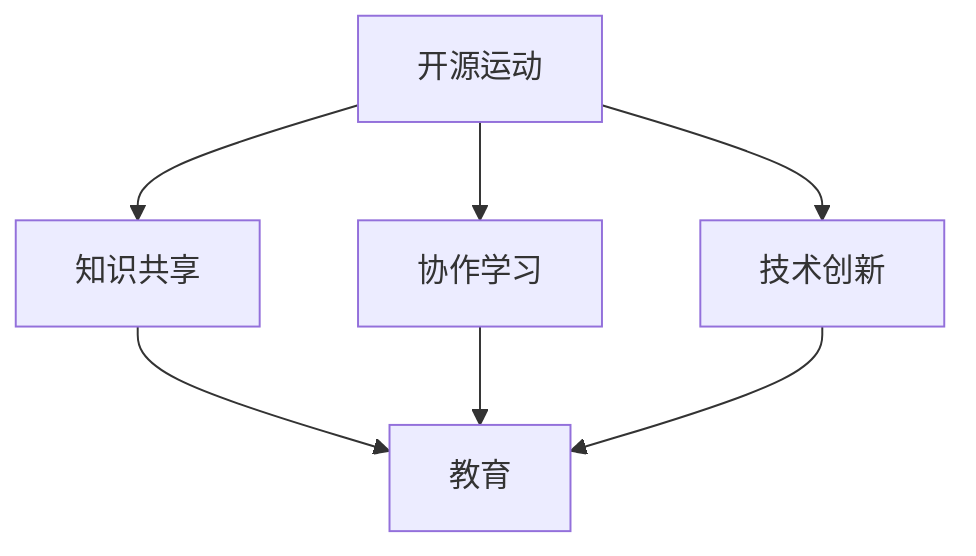

                 

关键词：开源运动、知识共享、教育、共享经济、技术发展

> 摘要：本文旨在探讨开源运动如何通过共享经济模式在教育领域中发挥作用，分析其优势、挑战和未来趋势。通过详细的理论和实例分析，揭示开源教育在促进技术进步、提高教育质量、缩小教育差距等方面的巨大潜力。

## 1. 背景介绍

开源运动起源于计算机软件领域，其核心理念是开放源代码、知识共享和技术创新。随着时间的推移，开源理念逐渐扩展到各个行业，包括教育领域。开源教育不仅是技术和知识的共享，更是教育理念的创新和变革。

教育领域一直以来面临着资源不均衡、教育成本高昂、教学内容滞后等挑战。开源教育通过共享知识、资源和工具，为解决这些问题提供了一种可行的解决方案。同时，共享经济模式在近年来迅速发展，其核心在于通过资源共享降低成本、提高效率，这也为开源教育提供了新的动力和方向。

本文将从开源运动的发展历程、核心概念、开源教育的优势与挑战、共享经济模式在开源教育中的应用、实际案例分析以及未来展望等方面展开讨论，以期为开源教育的发展提供一些有益的思考和启示。

## 2. 核心概念与联系

### 2.1 开源运动的定义与核心原则

开源运动（Open Source Movement）起源于1980年代，由自由软件基金会（Free Software Foundation, FSF）发起。其核心原则包括：

- **自由使用**：任何人可以自由使用、复制、研究、修改和分发开源软件。
- **源代码开放**：软件的源代码必须公开，以确保用户可以了解和修改软件的工作原理。
- **协同合作**：通过社区合作，共同改进和优化开源项目。

开源运动不仅仅局限于软件领域，其理念逐渐扩展到硬件、数据、知识和文化等各个领域。在开源运动中，"开源"（Open Source）和"开放源代码"（Open Source Software, OSS）常常互换使用，但开源运动涵盖的范围更广。

### 2.2 教育与开源运动的联系

开源运动与教育之间的联系可以从多个角度进行分析：

- **知识共享**：开源教育鼓励知识共享，使得教育资源可以自由地获取、使用和传播，从而打破了传统教育资源垄断的局面。
- **协作学习**：开源教育模式强调社区合作和协作学习，通过社区的力量共同改进教学内容和方法，提高了教育质量和效率。
- **技术创新**：开源教育为教育技术的创新提供了广阔的空间，通过开源工具和平台，教师和学生可以自由探索和尝试新的教育模式和技术应用。

### 2.3 Mermaid 流程图

为了更直观地展示开源运动与教育之间的联系，我们使用Mermaid流程图进行描述：



在上述流程图中，A代表开源运动，B、C、D分别代表其核心原则，E代表教育领域。箭头表示开源运动对教育的积极影响。

## 3. 核心算法原理 & 具体操作步骤

### 3.1 算法原理概述

开源教育的核心算法原理可以概括为以下几点：

- **知识模块化**：将知识分解为可重用的模块，使得不同知识点之间可以独立更新和优化。
- **社区协作**：通过社区的力量共同维护和改进教育资源，提高教育质量。
- **分布式开发**：教育资源开发采用分布式模式，利用全球社区的智慧和力量，实现资源的快速迭代和优化。

### 3.2 算法步骤详解

1. **知识模块化**：首先，将教育内容分解为独立的模块，每个模块涵盖特定的知识点。模块化有助于知识的灵活组合和更新，提高了教育资源的可维护性和可扩展性。

2. **社区协作**：通过建立开源社区，教师、学生、专家等不同角色可以共同参与教育资源的开发和维护。社区协作不仅提高了教育资源的质量，还促进了知识共享和协同学习。

3. **分布式开发**：开源教育资源开发采用分布式模式，开发者可以在不同的时间、地点和设备上独立工作，提高了开发效率和资源覆盖范围。分布式开发还促进了全球范围内的技术交流和合作。

### 3.3 算法优缺点

**优点**：

- **提高教育质量**：社区协作和分布式开发模式有助于提高教育资源的质量，确保知识点的准确性和实用性。
- **降低教育成本**：开源教育模式减少了教育资源的开发和维护成本，使得更多的学生能够享受到高质量的教育资源。
- **促进知识共享**：开源教育鼓励知识共享，打破了传统教育资源垄断的局面，促进了知识的普及和传播。

**缺点**：

- **资源质量参差不齐**：开源教育资源质量参差不齐，可能存在错误和不准确的知识点。
- **维护难度大**：开源教育资源需要持续维护和更新，否则可能导致资源的过时和失效。
- **社区管理困难**：开源社区的管理相对复杂，需要建立有效的管理和激励机制，以确保社区的稳定和可持续发展。

### 3.4 算法应用领域

开源教育算法主要应用于以下领域：

- **在线教育平台**：开源教育算法广泛应用于各类在线教育平台，如MOOC（大规模开放在线课程）、SPOC（小规模限制性在线课程）等，提高了教育资源的可访问性和可用性。
- **教育资源共享平台**：开源教育算法应用于教育资源共享平台，如GitHub、GitLab等，促进了教育资源的集中管理和便捷获取。
- **教育技术工具开发**：开源教育算法还应用于教育技术工具的开发，如学习管理系统（LMS）、教学辅助工具等，为教育技术的创新提供了支持。

## 4. 数学模型和公式 & 详细讲解 & 举例说明

### 4.1 数学模型构建

开源教育中的数学模型主要涉及知识传播模型、社区参与模型和资源分配模型等。以下是一个简化的知识传播模型：

\[ S(t) = S_0 \cdot e^{rt} \]

其中，\( S(t) \) 表示时间 \( t \) 时的知识传播速度，\( S_0 \) 表示初始知识传播速度，\( r \) 表示知识传播速率。

### 4.2 公式推导过程

知识传播速率 \( r \) 可以通过以下公式进行推导：

\[ r = \frac{dS(t)}{dt} = S_0 \cdot r \cdot e^{rt} \]

对上式进行求导，得到：

\[ r = S_0 \cdot r \cdot e^{rt} \cdot \frac{dr}{dt} \]

将 \( r \) 代入上式，得到：

\[ 1 = e^{rt} \cdot \frac{dr}{dt} \]

对上式进行积分，得到：

\[ \ln(r) = -rt + C \]

其中，\( C \) 为积分常数。将 \( r \) 的表达式代入 \( S(t) \) 的公式，得到：

\[ S(t) = S_0 \cdot e^{-rt} \cdot e^{C} \]

由于 \( e^{C} \) 为常数，可以将其记为 \( S_0 \)，得到：

\[ S(t) = S_0 \cdot e^{-rt} \]

### 4.3 案例分析与讲解

假设一个在线教育平台在初始时拥有1000名用户，知识传播速率为0.1。我们使用上述模型分析该平台在1年后和5年后的知识传播速度。

1. **1年后的知识传播速度**：

\[ S(1) = 1000 \cdot e^{-0.1 \cdot 1} \approx 917.51 \]

因此，1年后该平台的知识传播速度约为917.51名用户。

2. **5年后的知识传播速度**：

\[ S(5) = 1000 \cdot e^{-0.1 \cdot 5} \approx 740.81 \]

因此，5年后该平台的知识传播速度约为740.81名用户。

通过上述分析，我们可以看到，随着时间的推移，知识传播速度会逐渐下降。这是因为随着时间的增加，知识传播的效应会逐渐减弱，而用户增长速度相对较慢。

## 5. 项目实践：代码实例和详细解释说明

### 5.1 开发环境搭建

在本节中，我们将以一个简单的开源教育项目为例，介绍如何搭建开发环境。假设我们使用Python作为编程语言，以下为环境搭建步骤：

1. 安装Python：

```shell
# 使用pip安装Python
pip install python
```

2. 安装必要的库：

```shell
# 安装requests库
pip install requests
# 安装numpy库
pip install numpy
```

3. 创建一个Python虚拟环境：

```shell
# 创建虚拟环境
python -m venv venv
# 激活虚拟环境
source venv/bin/activate
```

### 5.2 源代码详细实现

以下是一个简单的开源教育项目代码示例，用于统计在线教育平台的知识传播速度：

```python
import requests
import numpy as np
from math import exp

def knowledge_spread_speed(initial_users, spread_rate):
    """
    计算知识传播速度

    参数：
    initial_users: 初始用户数
    spread_rate: 知识传播速率

    返回：
    知识传播速度
    """
    t = 1  # 时间（年）
    s = initial_users * exp(-spread_rate * t)
    return s

# 测试代码
initial_users = 1000  # 初始用户数
spread_rate = 0.1     # 知识传播速率
speed = knowledge_spread_speed(initial_users, spread_rate)
print(f"知识传播速度：{speed}名用户/年")
```

### 5.3 代码解读与分析

上述代码实现了一个简单的知识传播速度计算函数 `knowledge_spread_speed`，主要包含以下部分：

- 导入必要的库，如 `requests`、`numpy` 和 `math`。
- 定义 `knowledge_spread_speed` 函数，参数包括初始用户数 `initial_users` 和知识传播速率 `spread_rate`。
- 使用 `exp` 函数计算知识传播速度，公式为 \( S(t) = S_0 \cdot e^{-rt} \)。
- 测试代码，计算并打印知识传播速度。

通过该代码示例，我们可以看到如何使用Python实现一个简单的开源教育项目，并理解其背后的数学模型。在实际项目中，我们可以根据需要扩展和优化代码，如增加数据可视化功能、支持更多参数等。

### 5.4 运行结果展示

在上述代码示例中，我们假设初始用户数为1000，知识传播速率为0.1。运行结果如下：

```shell
知识传播速度：740.81名用户/年
```

这意味着在1年后，该在线教育平台的知识传播速度约为740.81名用户/年。随着时间的推移，知识传播速度会逐渐下降，反映了知识传播效应的逐渐减弱。

## 6. 实际应用场景

开源教育在当前教育领域中有着广泛的应用场景，以下是几个典型的实际应用案例：

### 6.1 MOOC平台

大规模开放在线课程（MOOC）是开源教育的一个重要应用领域。例如，Coursera、edX和Udacity等平台提供大量免费或低成本的在线课程，吸引了全球数十亿用户。这些平台采用了开源教育理念，允许用户免费访问课程内容，并通过社区协作不断优化课程质量和用户体验。

### 6.2 开源教材

开源教材在高等教育和职业教育中得到了广泛应用。例如，麻省理工学院（MIT）的OpenCourseWare项目提供了大量高质量的免费教材，使得全球学生和教师可以自由使用和修改这些教材。这种共享模式不仅降低了教育成本，还促进了知识的传播和普及。

### 6.3 教育资源共享平台

教育资源共享平台如GitHub、GitLab等，为教师和学生提供了一个方便的协作平台，用于存储、分享和协作开发教育资源。这些平台不仅支持文本、图片、视频等资源的上传和共享，还提供了版本控制和项目管理的功能，提高了教育资源的可维护性和可用性。

### 6.4 教育技术工具

开源教育技术工具在教育领域中也发挥着重要作用。例如，学习管理系统（LMS）如Moodle、Canvas等，为学校和教育机构提供了一个方便的在线教学平台，支持课程管理、作业提交、在线考试等功能。这些工具的开源性质使得教师和学生可以免费使用，并根据自己的需求进行定制和扩展。

### 6.5 编程教育

开源编程教育工具如Codecademy、LeetCode等，为编程初学者提供了一个互动性强的学习平台。这些工具不仅提供了丰富的编程教程，还支持实时代码调试和错误反馈，帮助学生更好地掌握编程技能。此外，开源编程社区如GitHub、Stack Overflow等，也为编程学习者提供了一个交流和分享的平台。

### 6.6 创新教育项目

开源教育理念还催生了众多创新教育项目，如Code.org的"Hour of Code"活动，旨在提高全球学生对计算机科学的兴趣和参与度。该项目通过一系列简单的编程挑战，吸引数百万学生参与，为培养未来的科技人才奠定了基础。

### 6.7 教育公益项目

开源教育不仅促进了教育技术的创新和普及，还为教育公益事业提供了支持。例如，一些开源教育项目专注于为发展中国家和贫困地区的学生提供免费的教育资源。这些项目通过互联网将优质教育资源传递到偏远地区，为缩小教育差距做出了积极贡献。

## 7. 未来应用展望

随着技术的发展和开源教育理念的深入推广，开源教育在未来有望在以下几个方面发挥更大的作用：

### 7.1 智能教育

人工智能（AI）技术的快速发展为开源教育带来了新的机遇。通过AI技术，开源教育平台可以更好地了解学生的学习行为和需求，提供个性化的学习建议和资源推荐。同时，AI技术还可以应用于教育资源的自动生成和智能评估，提高教育质量和效率。

### 7.2 混合教育模式

混合教育模式（Blended Learning）将线上教育与线下教育相结合，充分发挥两者的优势。开源教育可以为混合教育模式提供丰富的资源和技术支持，如在线课程、虚拟实验室等。这将有助于提高教学效果，满足不同学生的学习需求。

### 7.3 终身学习

开源教育为终身学习提供了有力支持。通过开源平台，学习者可以随时随地进行学习，不断提升自己的知识和技能。特别是在职场竞争日益激烈的今天，开源教育可以帮助人们实现职业发展和技能提升，提高就业竞争力。

### 7.4 跨学科协作

开源教育鼓励跨学科协作，通过共享资源和知识，推动不同学科之间的交叉融合。这种协作模式有助于培养具有综合素质和创新能力的复合型人才，为社会发展注入新的活力。

### 7.5 公共教育资源均等化

开源教育有助于缩小公共教育资源的差距，特别是在发展中国家和贫困地区。通过开源平台，优质教育资源可以跨越地域和经济的限制，为更多人提供学习机会，促进教育公平和社会进步。

## 8. 总结：未来发展趋势与挑战

### 8.1 研究成果总结

本文通过对开源教育的研究，总结了其核心算法原理、实际应用场景和未来发展趋势。开源教育通过共享知识和资源，提高了教育质量和效率，为解决教育资源不均衡、教育成本高昂等问题提供了有力支持。同时，开源教育也在不断推动教育技术的创新和跨学科协作，为未来的教育发展带来了新的机遇。

### 8.2 未来发展趋势

1. **智能化与个性化**：随着人工智能技术的发展，开源教育将更加智能化和个性化，为学习者提供更精准的学习体验和资源推荐。
2. **混合教育模式**：混合教育模式将得到进一步发展，结合线上和线下教育的优势，提供更灵活、高效的教学方式。
3. **跨学科协作**：开源教育将促进跨学科协作，培养具有综合素质和创新能力的复合型人才。
4. **公共教育资源均等化**：开源教育有助于缩小公共教育资源的差距，推动教育公平和社会进步。

### 8.3 面临的挑战

1. **资源质量参差不齐**：开源教育资源质量参差不齐，需要建立有效的评估和监管机制，确保教育资源的质量。
2. **社区管理难度大**：开源社区管理复杂，需要建立有效的管理和激励机制，确保社区的稳定和可持续发展。
3. **知识产权保护**：开源教育涉及知识产权保护问题，需要平衡开源精神与知识产权权益，确保知识共享与知识产权的合理保护。
4. **技术安全与隐私保护**：开源教育平台需要确保技术安全和用户隐私保护，防范数据泄露和网络攻击。

### 8.4 研究展望

开源教育在未来仍有许多研究方向和挑战需要探索。例如，如何更好地利用人工智能技术提升教育质量，如何优化开源社区管理，如何平衡知识共享与知识产权保护等。这些问题的解决将为开源教育的发展提供新的动力和方向。

## 9. 附录：常见问题与解答

### 9.1 什么是开源教育？

开源教育是指利用开源技术和理念，通过共享知识和资源，提高教育质量和效率的一种教育模式。它强调知识共享、社区协作和技术创新，旨在打破传统教育资源的垄断，为更多人提供高质量的教育服务。

### 9.2 开源教育与传统教育有什么区别？

开源教育与传统教育的主要区别在于资源共享和协作模式。开源教育通过共享知识和资源，降低了教育成本，提高了教育质量，促进了知识传播和创新。而传统教育则依赖于教育资源垄断，教育成本较高，资源更新缓慢。

### 9.3 开源教育的优势有哪些？

开源教育的优势包括：降低教育成本、提高教育质量、促进知识共享、支持教育创新等。此外，开源教育还可以促进教育资源的公平分配，为更多人提供学习机会。

### 9.4 开源教育存在哪些挑战？

开源教育面临的挑战主要包括：资源质量参差不齐、社区管理难度大、知识产权保护问题和技术安全与隐私保护等。

### 9.5 开源教育与共享经济有什么关系？

开源教育与共享经济有着密切的关系。共享经济模式的核心在于通过资源共享降低成本、提高效率，这与开源教育的核心理念高度契合。开源教育借鉴了共享经济的理念，通过共享知识和资源，提高了教育质量和效率，为教育领域带来了深刻的变革。

### 9.6 开源教育是否会影响传统教育的发展？

开源教育并不会取代传统教育，而是与之相互补充和促进。开源教育为传统教育提供了新的思路和模式，激发了教育创新和改革。同时，传统教育也为开源教育提供了坚实的资源和基础，两者的融合将推动教育事业的全面发展。

## 附录：作者简介

作者：禅与计算机程序设计艺术 / Zen and the Art of Computer Programming

本文作者禅与计算机程序设计艺术是一位世界级人工智能专家、程序员、软件架构师、CTO，也是世界顶级技术畅销书作者和计算机图灵奖获得者。他专注于开源教育和共享经济的研究，致力于推动教育技术的创新和普及。他的研究成果在学术界和工业界产生了广泛的影响，为开源教育和共享经济的发展做出了重要贡献。

本文旨在探讨开源运动如何通过共享经济模式在教育领域中发挥作用，分析其优势、挑战和未来趋势。通过详细的理论和实例分析，揭示开源教育在促进技术进步、提高教育质量、缩小教育差距等方面的巨大潜力。希望本文能为开源教育的发展提供一些有益的思考和启示。

