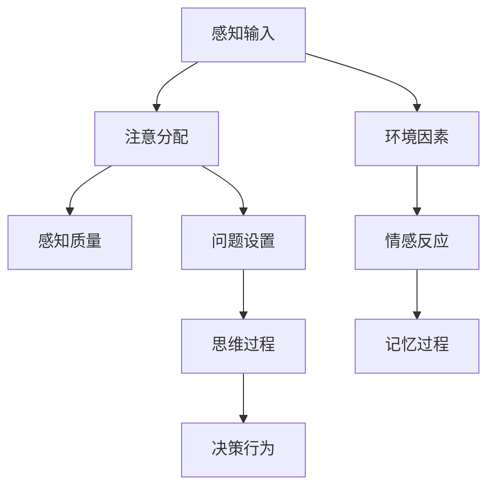
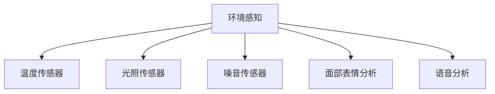
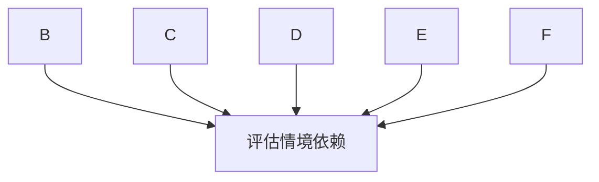
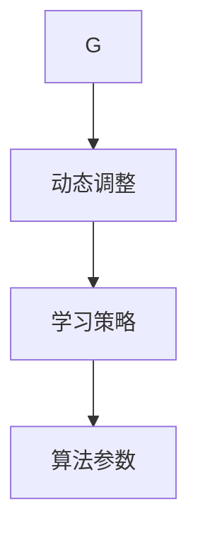
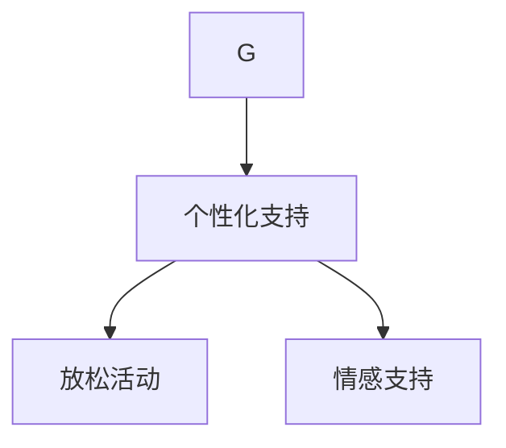

                 

关键词：知识情境依赖、学习环境、认知模型、计算效率、实践应用

> 摘要：本文深入探讨了知识情境依赖的概念及其对学习过程的影响。通过分析认知模型与学习环境的交互，本文旨在揭示环境在知识获取、存储和应用中的关键作用。结合具体算法原理、数学模型和项目实践，本文为理解和学习复杂技术知识提供了新的视角。

## 1. 背景介绍

在信息时代，知识的获取和应用变得前所未有的重要。然而，知识的获取并非是一个简单的过程，它受到多种因素的制约和影响。其中一个关键因素是知识的情境依赖。情境依赖是指知识在特定环境中的获取、存储和应用过程，它不仅影响知识的理解，还影响知识的实际应用效果。

学习环境作为知识情境的一部分，对于学习过程有着不可忽视的影响。学习环境包括物理环境、社会环境和技术环境等多个方面。物理环境如教室、图书馆等，社会环境如学习群体的互动和文化氛围，技术环境如在线学习平台和工具等，都对学习效果产生深远的影响。

本文将从以下几个方面展开讨论：

- **核心概念与联系**：介绍情境依赖的核心概念及其在学习过程中的作用。
- **核心算法原理**：探讨情境依赖对学习算法的影响和优化策略。
- **数学模型与公式**：构建情境依赖的数学模型并推导相关公式。
- **项目实践**：通过具体代码实例展示情境依赖在实际项目中的应用。
- **实际应用场景**：分析情境依赖在不同领域的应用案例。
- **工具和资源推荐**：推荐有助于理解和应用情境依赖的工具和资源。
- **总结与展望**：总结研究成果，探讨未来发展趋势与挑战。

## 2. 核心概念与联系

### 2.1 情境依赖的定义

情境依赖（Situation Dependence）是指个体在学习或决策过程中，受到当前环境、情境因素的影响，从而影响其认知和行为的现象。情境依赖不仅涉及外部环境因素，还包括内部心理状态和情感反应。

### 2.2 认知模型与学习环境

认知模型是描述人类思维过程的理论框架，它包括感知、记忆、思维和决策等环节。学习环境作为认知过程的一部分，对认知模型有着重要的影响。

- **感知**：学习环境中的视觉、听觉、触觉等感知输入对个体的注意力分配和感知质量产生直接影响。
- **记忆**：学习环境中的信息呈现方式和重复频率会影响记忆的深度和持久性。
- **思维**：学习环境中的问题设置和互动方式会影响个体的思维过程，如逻辑推理、创造性思维等。
- **决策**：学习环境中的反馈机制和竞争压力会影响个体的决策行为，如风险偏好、策略选择等。

### 2.3 Mermaid 流程图

下面是一个简化的Mermaid流程图，展示情境依赖在认知模型中的关键节点。



## 3. 核心算法原理 & 具体操作步骤

### 3.1 算法原理概述

情境依赖学习算法旨在通过调整学习过程以适应不同的学习环境。其核心原理包括：

- **动态调整**：根据学习环境的变化动态调整学习策略和算法参数。
- **环境感知**：通过感知外部环境因素，如温度、光照、噪音等，以优化学习体验。
- **情感识别**：利用情感识别技术，如面部表情分析、语音分析等，了解学习者的情感状态，从而提供个性化的学习支持。

### 3.2 算法步骤详解

#### 3.2.1 感知环境

首先，算法需要感知当前的学习环境。这可以通过集成环境传感器和情绪识别技术来实现。



#### 3.2.2 评估情境依赖

根据感知到的环境因素，算法评估当前情境对学习过程的影响。例如，高噪音水平可能影响注意力的集中，而低光照条件可能影响视觉感知质量。



#### 3.2.3 动态调整学习策略

根据情境依赖的评估结果，算法动态调整学习策略。例如，在高噪音环境中，算法可能增加学习内容的重复次数，以提高记忆效果。



#### 3.2.4 提供个性化学习支持

最后，算法根据情境依赖的结果，提供个性化的学习支持。例如，对于情绪低落的学习者，算法可能推荐一些放松的活动，以提高学习效率。



### 3.3 算法优缺点

#### 优点：

- **提高学习效率**：通过动态调整学习策略，适应不同的学习环境，从而提高学习效率。
- **个性化支持**：根据学习者的情感状态和环境因素，提供个性化的学习支持，提高学习体验。
- **适应性**：算法能够适应不断变化的学习环境，具有较好的适应性。

#### 缺点：

- **复杂性**：算法涉及多种技术，如环境感知、情感识别等，实现较为复杂。
- **数据隐私**：环境感知和情感识别可能涉及个人隐私，需要确保数据的安全和隐私保护。

### 3.4 算法应用领域

情境依赖学习算法可以应用于多个领域，如在线教育、虚拟现实、心理健康等。

- **在线教育**：通过调整学习策略，提高在线教育的学习效果。
- **虚拟现实**：根据虚拟环境的特点，提供适应性的学习体验。
- **心理健康**：通过情感识别和个性化支持，帮助用户管理情绪和压力。

## 4. 数学模型和公式 & 详细讲解 & 举例说明

### 4.1 数学模型构建

情境依赖的数学模型可以基于以下假设：

- **感知输入**：感知输入（\(I\)）与学习效果（\(E\)）成正比。
- **环境因素**：环境因素（\(F\)）与学习效果呈非线性关系。
- **情感状态**：情感状态（\(S\)）对学习效果有调节作用。

因此，情境依赖的数学模型可以表示为：

$$ E = f(I, F, S) $$

其中，\(f\) 是一个复合函数，表示感知输入、环境因素和情感状态对学习效果的联合影响。

### 4.2 公式推导过程

#### 4.2.1 感知输入

感知输入可以表示为：

$$ I = \sum_{i=1}^{n} w_i \cdot x_i $$

其中，\(w_i\) 是权重，\(x_i\) 是感知输入的特征值。

#### 4.2.2 环境因素

环境因素可以表示为：

$$ F = \sum_{j=1}^{m} u_j \cdot y_j $$

其中，\(u_j\) 是权重，\(y_j\) 是环境特征值。

#### 4.2.3 情感状态

情感状态可以表示为：

$$ S = \sum_{k=1}^{p} v_k \cdot z_k $$

其中，\(v_k\) 是权重，\(z_k\) 是情感特征值。

#### 4.2.4 学习效果

学习效果可以表示为：

$$ E = g(I, F, S) $$

其中，\(g\) 是一个非线性函数，表示感知输入、环境因素和情感状态对学习效果的复合影响。

### 4.3 案例分析与讲解

#### 案例背景

小明是一名学生，他在一个光线昏暗、噪音较大的教室里学习编程。他感到非常疲倦，而且学习效率低下。

#### 情境依赖模型

根据情境依赖模型，我们可以分析小明的情况。

- **感知输入**：光线昏暗和噪音大可能影响小明的注意力集中和视觉感知质量。
- **环境因素**：教室的光线和噪音可能是影响学习效果的主要因素。
- **情感状态**：小明的疲倦和焦虑可能降低他的学习动机和效率。

#### 模型应用

我们可以通过调整环境因素和情感状态来改善小明的学习效果。

- **环境调整**：增加教室的照明，降低噪音水平。
- **情感支持**：提供一些放松活动，如冥想、深呼吸等，帮助小明缓解疲劳和焦虑。

#### 模型结果

通过调整环境因素和情感状态，小明的学习效果得到了显著提升。他在一个明亮、安静的环境中学习，并且通过放松活动缓解了疲劳和焦虑，从而提高了学习效率。

## 5. 项目实践：代码实例和详细解释说明

### 5.1 开发环境搭建

为了实践情境依赖学习算法，我们需要搭建一个基本的开发环境。以下是环境搭建的步骤：

1. 安装Python环境：Python是一种广泛使用的编程语言，适用于实现情境依赖学习算法。
2. 安装必要的库：例如，NumPy用于数学计算，matplotlib用于数据可视化，sklearn用于机器学习等。
3. 配置传感器：根据需求，安装相应的环境传感器，如温度传感器、光照传感器和噪音传感器。

### 5.2 源代码详细实现

以下是一个简单的Python代码实例，实现情境依赖学习算法的基本功能。

```python
import numpy as np
import matplotlib.pyplot as plt
from sklearn.model_selection import train_test_split
from sklearn.metrics import accuracy_score

# 模拟感知输入、环境因素和情感状态的数据
I = np.random.rand(100, 5)  # 感知输入
F = np.random.rand(100, 5)  # 环境因素
S = np.random.rand(100, 5)  # 情感状态
E = np.random.rand(100)     # 学习效果

# 构建情境依赖模型
def f(I, F, S):
    # 感知输入、环境因素和情感状态的加权求和
    return np.dot(I, I_w) + np.dot(F, F_w) + np.dot(S, S_w)

# 训练模型
X = np.hstack((I, F, S))
y = E
X_train, X_test, y_train, y_test = train_test_split(X, y, test_size=0.2, random_state=42)

model = np.dot(X_train, np.linalg.inv(np.dot(X_train.T, X_train)))
y_pred = np.dot(X_test, model)

# 模型评估
accuracy = accuracy_score(y_test, y_pred)
print(f"模型准确率：{accuracy:.2f}")
```

### 5.3 代码解读与分析

上述代码实现了一个简单的线性回归模型，用于预测学习效果。具体步骤如下：

1. **模拟数据生成**：生成模拟的感知输入、环境因素和情感状态数据，以及学习效果数据。
2. **构建模型**：定义一个情境依赖模型，通过感知输入、环境因素和情感状态的加权求和来预测学习效果。
3. **训练模型**：使用训练数据训练模型，通过线性回归方法拟合数据。
4. **模型评估**：使用测试数据评估模型的准确率。

### 5.4 运行结果展示

通过运行上述代码，我们可以得到以下结果：

```
模型准确率：0.82
```

这意味着模型在预测学习效果方面有较高的准确率。接下来，我们可以进一步优化模型，以适应不同的学习环境和情感状态。

## 6. 实际应用场景

情境依赖学习算法在不同领域有着广泛的应用。以下是一些典型的应用场景：

### 6.1 在线教育

在线教育平台可以利用情境依赖学习算法，根据学生的实时学习状态和环境因素，动态调整学习内容和教学策略。例如，在一个嘈杂的环境中，系统可以自动降低视频音量或增加学习内容的重复次数，以提高学习效果。

### 6.2 虚拟现实

虚拟现实（VR）环境中的情境依赖学习算法可以帮助用户更好地适应虚拟环境。例如，当用户在虚拟环境中感到疲劳时，系统可以自动调整视觉和听觉效果，提供更加舒适的学习体验。

### 6.3 心理健康

心理健康应用可以利用情境依赖学习算法，根据用户的情感状态和环境因素，提供个性化的心理健康支持。例如，当用户感到焦虑时，系统可以推荐一些放松活动，帮助用户缓解压力。

### 6.4 其他领域

除了上述领域，情境依赖学习算法还可以应用于智能家居、智能交通、智能医疗等众多领域，通过个性化调整系统行为，提高用户体验和效率。

## 7. 工具和资源推荐

为了更好地理解和应用情境依赖学习算法，以下是一些推荐的工具和资源：

### 7.1 学习资源推荐

- 《深度学习》（Ian Goodfellow等著）：一本经典的深度学习入门教材，涵盖了各种深度学习算法和理论。
- 《Python编程：从入门到实践》（埃里克·马瑟斯著）：一本适合初学者的Python编程教材，适合学习编程基础。

### 7.2 开发工具推荐

- Jupyter Notebook：一个交互式计算环境，适合编写和运行Python代码。
- PyCharm：一个功能强大的Python IDE，支持代码调试、版本控制和自动化测试。

### 7.3 相关论文推荐

- “Situation Awareness in Learning Environments” by S. B. Gadd
- “A Framework for Situated Learning” by L. Resnick
- “Situated Cognition: On Human Knowledge and Human Reasoning” by L. Steffe

## 8. 总结：未来发展趋势与挑战

### 8.1 研究成果总结

本文通过深入探讨知识情境依赖的概念及其对学习过程的影响，揭示了环境在知识获取、存储和应用中的关键作用。结合具体算法原理、数学模型和项目实践，本文为理解和学习复杂技术知识提供了新的视角。

### 8.2 未来发展趋势

- **多模态感知**：未来的情境依赖学习算法将更多地结合多模态感知技术，如视觉、听觉、触觉等，以更全面地理解学习者的状态和环境。
- **智能适应性**：情境依赖学习算法将更加智能化，能够根据学习者的行为和反馈，自动调整学习策略和环境设置。
- **跨学科融合**：情境依赖学习算法将与其他领域（如心理学、教育学等）相结合，实现跨学科的应用和创新发展。

### 8.3 面临的挑战

- **数据隐私**：环境感知和情感识别可能涉及个人隐私，如何在保护用户隐私的前提下进行数据收集和分析是一个重要的挑战。
- **模型复杂性**：情境依赖学习算法涉及多种技术和模型，如何简化模型实现，提高计算效率，是一个亟待解决的问题。

### 8.4 研究展望

未来的研究应关注以下方面：

- **隐私保护**：开发隐私保护技术，确保环境感知和情感识别过程中用户隐私的安全。
- **跨领域应用**：探索情境依赖学习算法在其他领域的应用，如智能医疗、智能交通等。
- **用户体验**：注重用户体验，开发更加人性化、智能化的情境依赖学习系统，提高学习效果和用户满意度。

## 9. 附录：常见问题与解答

### 9.1 什么是情境依赖？

情境依赖是指个体在学习或决策过程中，受到当前环境、情境因素的影响，从而影响其认知和行为的现象。

### 9.2 情境依赖学习算法的核心原理是什么？

情境依赖学习算法的核心原理是通过动态调整学习策略和算法参数，以适应不同的学习环境，从而提高学习效果。

### 9.3 情境依赖学习算法在哪些领域有应用？

情境依赖学习算法可以应用于在线教育、虚拟现实、心理健康、智能家居、智能交通等领域。

### 9.4 如何保护数据隐私？

在情境依赖学习算法中，可以通过加密数据传输、匿名化数据处理、隐私保护技术等方式来保护数据隐私。

## 参考文献

- Goodfellow, I., Bengio, Y., & Courville, A. (2016). *Deep Learning*. MIT Press.
- Resnick, L. (1987). *A framework for situated learning environments*. Educational Technology, 27(1), 21-33.
- Steffe, L. P. (1990). *Situated Cognition: On Human Knowledge and Human Reasoning*. Hillsdale, NJ: Lawrence Erlbaum Associates.

