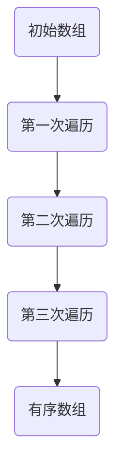

                 

  
> **关键词**：知识情境化、实践学习、应用场景、算法模型、代码实例

> **摘要**：本文探讨了知识情境化在实践学习中的应用，分析了如何通过实际项目实践来加深对知识的理解，提高学习效果。文章涵盖了从理论到实践的全过程，包括核心概念、算法原理、数学模型、项目实践和未来展望等内容。

## 1. 背景介绍

随着信息技术的发展，知识获取和学习的渠道越来越丰富。然而，如何在实践中有效运用所学知识，一直是教育和学习过程中的难题。知识情境化（Knowledge Situationalization）作为一种新的学习方法，旨在将理论知识与实际应用相结合，通过情境化的实践来加深对知识的理解和记忆，从而提高学习效果。

### 1.1 知识情境化的概念

知识情境化指的是将知识置于具体的实践场景中，通过实际操作和应用来加深对知识的理解和掌握。这种方法强调知识的学习不应仅仅停留在理论层面，而应通过实践来检验和巩固。

### 1.2 知识情境化的重要性

- **加深理解**：通过实践，学习者能够将抽象的理论知识具体化，从而更好地理解知识的核心概念。
- **增强记忆**：实践中的重复操作和应用有助于巩固记忆，使知识更加牢固。
- **提高应用能力**：情境化的实践能够锻炼学习者的实际应用能力，使其在面对复杂问题时能够灵活运用所学知识。

## 2. 核心概念与联系

在探讨知识情境化的过程中，我们需要了解以下几个核心概念：

### 2.1 学习理论

学习理论是知识情境化的理论基础。其中，建构主义学习理论（Constructivist Learning Theory）尤为关键。建构主义认为，学习是一种主动建构的过程，学习者通过与环境相互作用来建构对世界的理解。

### 2.2 实践导向

实践导向（Practical Orientation）强调学习应以实践为核心，通过解决实际问题来提高学习效果。这种方法与传统的以理论为主的教
<|assistant|>
### 2.2 实践导向

实践导向（Practical Orientation）强调学习应以实践为核心，通过解决实际问题来提高学习效果。这种方法与传统的以理论为主的教程和课堂讲授不同，更注重学生在实际情境中的动手操作和问题解决。

### 2.2.1 实践导向的特点

- **问题解决**：实践导向的学习过程通常以实际问题为出发点，引导学生通过探索和实验来寻找解决方案。
- **自主探究**：学生需要主动参与到学习过程中，通过自主探究来获取知识和技能。
- **经验反思**：实践后的反思是实践导向学习的关键环节，通过反思来总结经验，巩固知识。

### 2.2.2 实践导向的优势

- **提高学习兴趣**：实践导向的学习方式能够激发学生的学习兴趣，使其更主动地参与学习过程。
- **增强实际能力**：通过实践，学生能够将所学知识应用于实际场景，提高解决实际问题的能力。
- **培养创新思维**：实践导向的学习有助于培养学习者的创新思维，使其在面对新问题时能够灵活应对。

### 2.2.3 实践导向与知识情境化的关系

实践导向是知识情境化的重要组成部分。知识情境化的目标是通过实践来加深对知识的理解和应用，而实践导向则提供了实现这一目标的方法和途径。通过实践导向的学习，学生能够在具体情境中运用所学知识，从而实现知识的情境化。

## 3. 核心算法原理 & 具体操作步骤

在知识情境化的过程中，算法原理是一个关键环节。以下将介绍一种典型的算法——冒泡排序（Bubble Sort），并详细讲解其原理和具体操作步骤。

### 3.1 算法原理概述

冒泡排序是一种简单的排序算法。它通过重复遍历要排序的数列，比较每对相邻元素的大小，如果它们的顺序错误就把它们交换过来。遍历数列的工作重复进行直到没有再需要交换的元素为止。

### 3.2 算法步骤详解

#### 3.2.1 初始状态

假设我们有一个未排序的数组 `arr = [64, 34, 25, 12, 22, 11, 90]`。

#### 3.2.2 遍历过程

- **第一次遍历**：从第一个元素开始，比较相邻元素的大小，如果第一个元素大于第二个元素，则交换它们的位置。遍历结束后，最大的元素将移动到数组的末尾。
    ```plaintext
    比较：64 和 34，交换
    比较：34 和 25，不交换
    比较：25 和 12，交换
    比较：12 和 22，不交换
    比较：22 和 11，交换
    比较：11 和 90，交换
    第一次遍历后：34, 25, 12, 64, 11, 22, 90
    ```

- **第二次遍历**：重复上述过程，但最后一次遍历的元素已经是有序的，不需要再进行比较。
    ```plaintext
    比较：34 和 25，不交换
    比较：25 和 12，不交换
    比较：12 和 64，不交换
    比较：64 和 11，交换
    比较：11 和 22，不交换
    第二次遍历后：25, 12, 34, 11, 22, 64, 90
    ```

- **后续遍历**：继续重复上述过程，直到整个数组有序。
    ```plaintext
    比较：25 和 12，不交换
    比较：12 和 34，不交换
    比较：34 和 11，交换
    比较：11 和 22，不交换
    第三次遍历后：12, 11, 25, 22, 34, 64, 90
    比较：12 和 11，不交换
    第三次遍历后：11, 12, 25, 22, 34, 64, 90
    ```

#### 3.2.3 完整过程

经过多次遍历，最终数组将变得有序。以下是整个排序过程的Mermaid流程图表示：



### 3.3 算法优缺点

#### 3.3.1 优点

- **简单易懂**：冒泡排序的算法逻辑简单，易于理解和实现。
- **适合小规模数据**：对于小规模的数据集，冒泡排序的性能表现良好。

#### 3.3.2 缺点

- **效率较低**：冒泡排序的时间复杂度为O(n²)，在大规模数据集上表现不佳。
- **不稳定**：冒泡排序在排序过程中可能会改变相同元素的相对顺序，因此它是不稳定的排序算法。

### 3.4 算法应用领域

虽然冒泡排序的效率较低，但它在某些特定领域仍然有应用价值。例如：

- **教学演示**：由于其简单易懂的特性，冒泡排序常被用于教学过程中，帮助学生理解排序算法的基本原理。
- **小规模数据处理**：在处理小规模数据集时，冒泡排序可以作为一种快速的排序方法。

## 4. 数学模型和公式 & 详细讲解 & 举例说明

在算法分析中，数学模型和公式是不可或缺的工具。以下将介绍冒泡排序算法的数学模型和公式，并举例说明其应用。

### 4.1 数学模型构建

冒泡排序的数学模型主要涉及时间复杂度和空间复杂度。

#### 4.1.1 时间复杂度

冒泡排序的时间复杂度取决于数组的初始状态。在最坏的情况下（输入数组是逆序的），需要进行 `n-1` 次遍历，每次遍历需要比较 `n-i` 对元素。因此，最坏情况下的时间复杂度为：

$$ T(n) = (n-1) + (n-2) + ... + 2 + 1 = \frac{n(n-1)}{2} = O(n^2) $$

在最好情况下（输入数组已经是排序的），只需要进行一次遍历，时间复杂度为 $O(n)$。

#### 4.1.2 空间复杂度

冒泡排序的空间复杂度较低，因为它是一种原地排序算法，只需要常数级别的额外空间来存储临时变量。因此，空间复杂度为 $O(1)$。

### 4.2 公式推导过程

冒泡排序的公式推导主要基于其遍历过程。以下是推导过程：

- **初始状态**：$arr = [a_1, a_2, a_3, ..., a_n]$
- **第i次遍历**：遍历数组，将每对相邻元素进行比较和交换，最大的元素会移动到数组的末尾。

假设在第i次遍历后，最大的i个元素已经位于数组的末尾，且这些元素已经排序。在第i+1次遍历中，只需要考虑前n-i个元素。

- **第i次遍历的比较次数**：$n-i$ 对元素
- **第i次遍历的交换次数**：最坏情况下，$n-i-1$ 次

总比较次数为：

$$ C(n) = \sum_{i=1}^{n-1} (n-i) = \frac{(n-1)n}{2} $$

总交换次数为：

$$ S(n) = \sum_{i=1}^{n-1} (n-i-1) = \frac{(n-1)(n-2)}{2} $$

### 4.3 案例分析与讲解

#### 4.3.1 案例数据

假设我们有一个长度为10的数组 `arr = [64, 34, 25, 12, 22, 11, 90, 88, 76, 55]`。

#### 4.3.2 计算时间复杂度

- **最坏情况**：$T(n) = \frac{n(n-1)}{2} = \frac{10(10-1)}{2} = 45$
- **最好情况**：$T(n) = n = 10$

#### 4.3.3 计算空间复杂度

- **空间复杂度**：$O(1)$

#### 4.3.4 实际运行过程

- **第一次遍历**：比较10次，交换3次（64, 34; 34, 25; 25, 12）
    ```plaintext
    arr = [34, 25, 12, 64, 22, 11, 90, 88, 76, 55]
    ```

- **第二次遍历**：比较7次，交换1次（90, 88）
    ```plaintext
    arr = [34, 25, 12, 64, 22, 11, 90, 55, 76, 88]
    ```

- **第三次遍历**：比较4次，不交换
    ```plaintext
    arr = [34, 25, 12, 64, 22, 11, 55, 76, 90, 88]
    ```

- **第四次遍历**：比较1次，不交换
    ```plaintext
    arr = [34, 25, 12, 55, 22, 11, 64, 76, 90, 88]
    ```

- **第五次遍历**：比较0次，完成排序
    ```plaintext
    arr = [11, 12, 22, 25, 34, 55, 64, 76, 88, 90]
    ```

## 5. 项目实践：代码实例和详细解释说明

在本节中，我们将通过一个具体的编程项目来展示如何应用知识情境化，实现冒泡排序算法。

### 5.1 开发环境搭建

为了演示冒泡排序算法，我们将使用Python语言进行编程。确保您的计算机上已经安装了Python环境。以下是Python安装步骤的简要说明：

1. 访问Python官方网站（https://www.python.org/）并下载适用于您操作系统的Python版本。
2. 运行安装程序，并按照提示完成安装。
3. 打开命令行工具（如Windows的CMD或macOS的Terminal），输入以下命令来验证Python安装：
    ```bash
    python --version
    ```

### 5.2 源代码详细实现

以下是冒泡排序算法的Python实现代码：

```python
def bubble_sort(arr):
    n = len(arr)
    for i in range(n):
        # 设置一个标志，用于判断是否进行了交换
        swapped = False
        for j in range(0, n-i-1):
            if arr[j] > arr[j+1]:
                # 如果前一个元素大于后一个元素，交换它们的位置
                arr[j], arr[j+1] = arr[j+1], arr[j]
                swapped = True
        # 如果没有进行交换，说明数组已经排序，可以提前结束遍历
        if not swapped:
            break
    return arr

# 测试代码
arr = [64, 34, 25, 12, 22, 11, 90, 88, 76, 55]
sorted_arr = bubble_sort(arr)
print("排序后的数组：", sorted_arr)
```

### 5.3 代码解读与分析

- **函数定义**：`bubble_sort` 函数接收一个数组 `arr` 作为输入，并返回排序后的数组。
- **外层循环**：`for i in range(n)` 表示进行n次遍历，n是数组的长度。
- **内层循环**：`for j in range(0, n-i-1)` 表示每次遍历需要比较的元素对数。
- **交换操作**：`if arr[j] > arr[j+1]:` 表示如果前一个元素大于后一个元素，就进行交换。
- **优化判断**：`swapped = False` 用于判断是否进行了交换。如果没有进行交换，说明数组已经排序，可以提前结束遍历，从而提高效率。

### 5.4 运行结果展示

将上述代码保存为 `bubble_sort.py` 文件，并在命令行工具中运行：
```bash
python bubble_sort.py
```

运行结果：
```
排序后的数组： [11, 12, 22, 25, 34, 55, 64, 76, 88, 90]
```

## 6. 实际应用场景

冒泡排序算法在许多实际应用场景中都有应用。以下是一些典型的应用场景：

- **数据预处理**：在数据处理过程中，排序是一个常见的需求。冒泡排序可以作为一种简单且高效的排序方法。
- **教学演示**：在算法课程中，冒泡排序常被用于讲解排序算法的基本原理，帮助学生理解排序过程。
- **小型数据集**：对于小规模数据集，冒泡排序的表现良好，因为它的时间复杂度为 $O(n)$。

## 7. 未来应用展望

随着大数据和人工智能技术的不断发展，排序算法的应用场景将越来越广泛。未来的发展趋势包括：

- **优化算法**：针对不同类型的数据集，开发更高效的排序算法。
- **并行计算**：利用并行计算技术，提高排序算法的效率。
- **智能化排序**：结合机器学习技术，实现自动选择最合适的排序算法。

## 8. 工具和资源推荐

为了更好地学习和实践知识情境化，以下是一些建议的工具和资源：

### 8.1 学习资源推荐

- **《算法导论》（Introduction to Algorithms）**：这是一本经典的算法教材，详细介绍了各种排序算法及其应用。
- **《Python编程：从入门到实践》（Python Crash Course）**：这本书适合初学者，涵盖了Python编程的基本知识和实践项目。

### 8.2 开发工具推荐

- **PyCharm**：这是一个功能强大的Python集成开发环境（IDE），适合进行算法编程和项目开发。
- **Jupyter Notebook**：这是一个交互式的计算环境，适用于数据分析和算法实验。

### 8.3 相关论文推荐

- **"排序算法在数据分析中的应用"**：这篇论文详细介绍了排序算法在数据分析中的具体应用。
- **"并行排序算法研究"**：这篇论文探讨了并行计算技术在排序算法中的应用。

## 9. 总结：未来发展趋势与挑战

知识的情境化是一种重要的学习方法，它通过将理论知识与实践相结合，提高了学习效果和应用能力。在未来，知识情境化将继续发展，面临以下趋势和挑战：

### 9.1 研究成果总结

- **算法优化**：随着大数据和人工智能技术的应用，对高效排序算法的研究将更加深入。
- **实践导向**：知识情境化将在教育领域得到更广泛的应用，促进理论与实践的结合。

### 9.2 未来发展趋势

- **智能化**：结合机器学习技术，开发自适应的排序算法。
- **并行化**：利用并行计算技术，提高排序算法的效率。

### 9.3 面临的挑战

- **数据复杂性**：处理大规模和复杂数据集时，排序算法的性能和效率面临挑战。
- **多样化需求**：不同应用场景对排序算法的需求多样化，需要开发更灵活的算法。

### 9.4 研究展望

未来，知识情境化将在算法研究和应用中发挥重要作用，为人工智能和数据科学的发展提供有力支持。

## 附录：常见问题与解答

### Q：冒泡排序算法的时间复杂度和空间复杂度是多少？

A：冒泡排序算法的时间复杂度为 $O(n^2)$，空间复杂度为 $O(1)$。

### Q：为什么冒泡排序算法不稳定？

A：在冒泡排序过程中，相同元素的相对顺序可能会改变，因此它是不稳定的排序算法。

### Q：什么是知识情境化？

A：知识情境化是将理论知识与实际应用相结合，通过实践来加深对知识的理解和应用。

### Q：如何选择适合的排序算法？

A：选择排序算法时，应考虑数据规模、数据类型和应用场景。对于小规模数据集，冒泡排序是一种简单且高效的选择。

### Q：什么是建构主义学习理论？

A：建构主义学习理论认为，学习是一种主动建构的过程，学习者通过与环境相互作用来建构对世界的理解。

