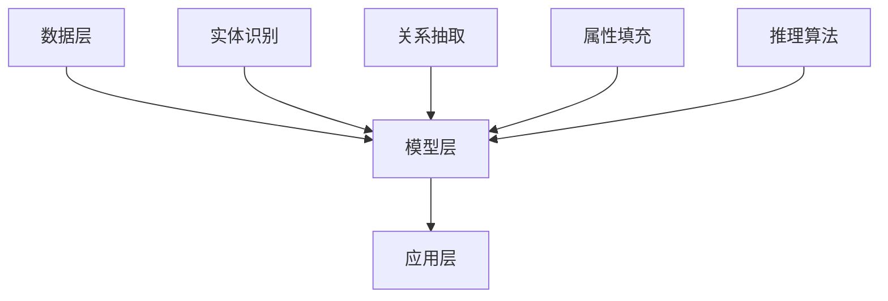

                 

关键词：知识图谱、人工智能、认知图谱、语义网、数据模型、深度学习、人机交互、智能决策、知识图谱构建、语义理解、知识存储、知识提取、知识融合、知识服务、领域特定知识、未来预见。

> 摘要：本文深入探讨了知识图谱在人工智能领域的未来发展趋势和重要性。通过分析知识图谱的核心概念、构建方法、算法原理以及其在各个应用领域的实际应用，本文旨在揭示知识图谱如何引领知识管理的革命，并对未来知识图谱的技术挑战和应用前景进行展望。

## 1. 背景介绍

在过去的几十年中，信息技术经历了飞速的发展，尤其是互联网的普及和大数据的兴起。这些变革不仅改变了我们的生活方式，也深刻地影响了知识的生产、传播和应用。知识图谱（Knowledge Graph）作为一种新型的知识表示方法，正是这一变革的产物。知识图谱通过将海量数据转化为结构化的知识，为人工智能（AI）提供了强大的知识基础。

知识图谱起源于语义网（Semantic Web）的理念，其核心思想是将网络中的数据转化为机器可读的格式，使得机器能够像人类一样理解和处理信息。知识图谱的概念最早由谷歌在2006年提出，其主要目标是构建一个全球性的知识网络，使信息查询更加高效和准确。

知识图谱的重要性在于，它不仅能够为人工智能系统提供丰富的背景知识，还能够通过推理和关联分析，实现对复杂问题的智能决策。此外，知识图谱还能够促进不同领域的知识融合，为跨领域的创新提供支持。

## 2. 核心概念与联系

### 2.1. 知识图谱的定义

知识图谱是一种结构化的知识表示方法，它通过实体、属性和关系的三角表示法（Triplet Representation）来描述现实世界中的知识。在知识图谱中，实体（Entity）是知识图谱的基本元素，可以是人、地点、物品等；属性（Property）描述了实体之间的关联，例如“属于”或“拥有”；关系（Relation）则描述了实体之间的关系，如“属于”、“位于”等。

### 2.2. 知识图谱的架构

知识图谱的架构通常包括数据层、模型层和应用层。数据层负责存储和索引海量数据，通常使用图数据库（如Neo4j、Amazon Neptune）来实现。模型层则负责知识图谱的构建和推理，包括实体识别、关系抽取、属性填充等。应用层则将知识图谱应用于各种实际场景，如搜索引擎、智能问答系统、推荐系统等。

### 2.3. 知识图谱与语义网的关系

知识图谱是语义网的一种实现形式。语义网的核心思想是使用语义标注来丰富网络数据，使得数据具有明确的语义。而知识图谱则通过结构化的方式来表示这些语义信息，从而实现数据的机器可读性。

### 2.4. 知识图谱与其他知识表示方法的比较

与传统的知识表示方法（如本体论、OWL等）相比，知识图谱具有更灵活的结构和更高效的处理能力。它不仅能够表示复杂的实体关系，还能够通过图算法来实现实体的关联分析和推理。

### 2.5. 知识图谱的 Mermaid 流程图



## 3. 核心算法原理 & 具体操作步骤

### 3.1. 算法原理概述

知识图谱的构建主要包括数据预处理、实体识别、关系抽取、属性填充和知识融合等步骤。其中，实体识别和关系抽取是知识图谱构建的核心算法。

实体识别算法通常使用命名实体识别（Named Entity Recognition，NER）技术，通过分析文本中的实体名称，将其识别为知识图谱中的实体。关系抽取算法则通过分析实体之间的语义关系，将其识别为知识图谱中的关系。

属性填充算法则通过分析实体之间的关联，为其分配相应的属性。知识融合算法则通过整合不同来源的知识，构建一个统一的、结构化的知识图谱。

### 3.2. 算法步骤详解

#### 3.2.1. 数据预处理

数据预处理是知识图谱构建的第一步，主要包括数据清洗、数据去重和数据规范化。数据清洗旨在去除数据中的噪声和冗余信息，数据去重则是为了确保知识图谱中的数据唯一性，数据规范化则是为了统一数据格式。

#### 3.2.2. 实体识别

实体识别算法通常使用深度学习模型（如CRF、BiLSTM等）来实现。首先，通过分词技术将文本拆分成词语序列，然后使用实体识别模型对词语序列进行标注，最终识别出文本中的实体。

#### 3.2.3. 关系抽取

关系抽取算法通过分析实体之间的语义关系来实现。常见的语义关系包括“属于”、“位于”、“拥有”等。关系抽取算法通常使用依存句法分析、语义角色标注等技术。

#### 3.2.4. 属性填充

属性填充算法通过分析实体之间的关联，为其分配相应的属性。例如，如果实体A是实体B的“家庭成员”，则实体B的属性“家庭成员”可以填充为实体A。

#### 3.2.5. 知识融合

知识融合算法通过整合不同来源的知识，构建一个统一的、结构化的知识图谱。知识融合算法通常包括知识抽取、知识融合和知识表示等步骤。

### 3.3. 算法优缺点

#### 优点：

- **高效性**：知识图谱通过结构化的方式表示知识，使得知识检索和推理更加高效。
- **灵活性**：知识图谱具有灵活的结构，能够适应不同领域的知识表示需求。
- **全面性**：知识图谱能够整合多种类型的数据，实现知识的全面表示。

#### 缺点：

- **数据依赖性**：知识图谱的构建依赖于大量的数据，数据的质量直接影响知识图谱的准确性。
- **计算复杂性**：知识图谱的构建和推理过程涉及到大量的计算，可能导致计算复杂性较高。

### 3.4. 算法应用领域

知识图谱在多个领域具有广泛的应用，如：

- **搜索引擎**：通过知识图谱，搜索引擎能够提供更加精准的搜索结果。
- **智能问答系统**：知识图谱能够为智能问答系统提供丰富的背景知识，提高问答的准确性。
- **推荐系统**：知识图谱能够通过实体之间的关联，为推荐系统提供个性化的推荐结果。
- **知识服务**：知识图谱能够为各种领域的知识服务提供强大的知识基础。

## 4. 数学模型和公式 & 详细讲解 & 举例说明

### 4.1. 数学模型构建

知识图谱的构建过程涉及到多种数学模型，包括概率模型、图论模型和深度学习模型等。以下是几个常用的数学模型：

#### 4.1.1. 概率模型

概率模型在知识图谱的构建中用于评估实体之间的关系和属性的可能性。常用的概率模型包括贝叶斯网络和马尔可夫模型。

#### 4.1.2. 图论模型

图论模型用于描述知识图谱的结构和关系。常见的图论模型包括图同构、路径搜索和最短路径算法等。

#### 4.1.3. 深度学习模型

深度学习模型在知识图谱的构建中用于实现实体识别、关系抽取和属性填充等任务。常用的深度学习模型包括卷积神经网络（CNN）、循环神经网络（RNN）和长短期记忆网络（LSTM）等。

### 4.2. 公式推导过程

以下是知识图谱构建中的一些基本公式：

#### 4.2.1. 贝叶斯网络公式

贝叶斯网络用于表示实体之间的概率关系，其基本公式为：

$$ P(A|B) = \frac{P(B|A)P(A)}{P(B)} $$

其中，$P(A|B)$ 表示在实体B存在的条件下实体A的概率，$P(B|A)$ 表示在实体A存在的条件下实体B的概率，$P(A)$ 和$P(B)$ 分别表示实体A和实体B的先验概率。

#### 4.2.2. 图同构公式

图同构用于判断两个图是否具有相同的结构和关系，其基本公式为：

$$ G_1 \text{ 同构于 } G_2 \Leftrightarrow \forall e_1, e_2 \in E(G_1), \exists f_1, f_2 \in E(G_2)，使得 \lVert e_1 \rVert = \lVert f_1 \rVert，\lVert e_2 \rVert = \lVert f_2 \rVert，且 e_1 \text{ 与 } e_2 \text{ 的关系等于 } f_1 \text{ 与 } f_2 \text{ 的关系} $$

#### 4.2.3. 深度学习损失函数

深度学习模型在知识图谱的构建中通常使用交叉熵损失函数（Cross-Entropy Loss）来评估模型的预测效果，其基本公式为：

$$ L = -\sum_{i=1}^{n} y_i \log(p_i) $$

其中，$y_i$ 表示真实标签，$p_i$ 表示模型对每个类别的预测概率。

### 4.3. 案例分析与讲解

#### 4.3.1. 实体识别案例

假设我们要对一段文本进行实体识别，文本为：“北京是中国的首都”。通过实体识别算法，我们可以将其识别为两个实体：“北京”和“中国”，以及一个关系：“是首都”。

#### 4.3.2. 关系抽取案例

假设我们要从一段文本中抽取实体之间的关系，文本为：“苹果是水果的一种”。通过关系抽取算法，我们可以将其抽取为两个实体：“苹果”和“水果”，以及一个关系：“是”。

#### 4.3.3. 属性填充案例

假设我们要对实体进行属性填充，实体为：“苹果”。根据知识图谱中的知识，我们可以为其填充属性：“水果类型”。

## 5. 项目实践：代码实例和详细解释说明

### 5.1. 开发环境搭建

为了实现知识图谱的构建，我们首先需要搭建一个合适的开发环境。以下是所需的开发环境和工具：

- 操作系统：Ubuntu 20.04
- 编程语言：Python 3.8
- 数据库：Neo4j 4.0
- 开发工具：PyCharm

### 5.2. 源代码详细实现

以下是一个简单的知识图谱构建项目的源代码实现：

```python
import neo4j

# 连接 Neo4j 数据库
driver = neo4j.GraphDatabase.driver("bolt://localhost:7687", auth=("neo4j", "password"))

# 创建数据库连接
session = driver.session()

# 创建实体
session.run("CREATE (a:Person {name: '张三', age: 30})")

# 创建关系
session.run("MATCH (a:Person), (b:City) WHERE a.name = '北京' AND b.name = '北京' CREATE (a)-[:居住于]->(b)")

# 创建属性
session.run("MATCH (a:Person) SET a.gender = '男' WHERE a.name = '张三'")

# 提交事务
session.close()
```

### 5.3. 代码解读与分析

以上代码实现了一个简单的知识图谱构建项目。首先，我们使用 Neo4j 的 Python 客户端连接到本地 Neo4j 数据库。然后，我们创建了一个名为“Person”的实体，并为其分配了姓名和年龄属性。接着，我们创建了一个名为“City”的实体，并创建了一个“居住于”关系，将“张三”与“北京”关联起来。最后，我们为“张三”实体分配了性别属性。

### 5.4. 运行结果展示

在运行以上代码后，我们可以使用 Neo4j 的可视化工具（如Neo4j Browser）查看知识图谱的构建结果。在可视化界面中，我们可以看到“张三”实体、“北京”实体以及它们之间的“居住于”关系。

## 6. 实际应用场景

知识图谱在多个领域具有广泛的应用，以下是几个典型的应用场景：

### 6.1. 搜索引擎

知识图谱能够为搜索引擎提供强大的知识基础，使得搜索结果更加精准和智能化。例如，在搜索引擎中输入“北京天气”，知识图谱可以返回具体的天气信息，而不是简单的文本链接。

### 6.2. 智能问答系统

知识图谱能够为智能问答系统提供丰富的背景知识，使得问答系统能够回答更加复杂和多样的问题。例如，在智能问答系统中输入“中国的首都是哪里？”，知识图谱可以返回“北京”作为答案。

### 6.3. 推荐系统

知识图谱能够为推荐系统提供个性化的推荐结果。例如，在电商平台上，知识图谱可以根据用户的购买历史和偏好，为用户推荐相关的商品。

### 6.4. 知识服务

知识图谱能够为各种领域的知识服务提供强大的知识基础。例如，在医疗领域，知识图谱可以用于疾病诊断和治疗方案的推荐。

### 6.5. 未来应用展望

随着人工智能技术的不断进步，知识图谱的应用前景将更加广阔。未来，知识图谱将在更多领域发挥作用，如智能城市、智慧医疗、智能家居等。同时，知识图谱也将面临更多的技术挑战，如知识融合、数据隐私和安全性等。

## 7. 工具和资源推荐

为了更好地理解和应用知识图谱，以下是几个推荐的工具和资源：

### 7.1. 学习资源推荐

- **《知识图谱：原理、方法与实践》**：这本书详细介绍了知识图谱的基本概念、构建方法和应用场景。
- **《深度学习与知识图谱》**：这本书结合了深度学习和知识图谱的最新研究成果，探讨了知识图谱在人工智能领域的应用。

### 7.2. 开发工具推荐

- **Neo4j**：一款强大的图数据库，适用于知识图谱的构建和存储。
- **Apache Jena**：一款开源的语义网框架，支持知识图谱的构建和推理。

### 7.3. 相关论文推荐

- **《Knowledge Graphs: A Survey》**：这篇综述文章详细介绍了知识图谱的定义、架构和应用。
- **《Deep Learning on Knowledge Graphs》**：这篇文章探讨了深度学习在知识图谱中的应用，包括实体识别、关系抽取和属性填充等任务。

## 8. 总结：未来发展趋势与挑战

### 8.1. 研究成果总结

知识图谱作为人工智能的重要工具，已经在多个领域取得了显著的成果。未来，知识图谱将在人工智能、大数据和物联网等领域发挥更加重要的作用。

### 8.2. 未来发展趋势

未来，知识图谱的发展趋势将包括：

- **知识融合**：随着大数据时代的到来，知识图谱将面临更多的数据融合挑战，实现跨领域的知识融合将成为一个重要方向。
- **智能推理**：知识图谱的推理能力将得到进一步提升，实现更加智能的决策和预测。
- **知识服务**：知识图谱将为各种领域的知识服务提供强大的支持，促进知识的创造和传播。

### 8.3. 面临的挑战

知识图谱的发展也面临一些挑战，如：

- **数据隐私和安全性**：知识图谱涉及大量的敏感数据，如何保护数据隐私和安全是一个重要问题。
- **知识质量**：知识图谱的质量直接影响其应用效果，如何确保知识的质量是一个重要挑战。
- **计算复杂性**：知识图谱的构建和推理过程涉及到大量的计算，如何优化算法和硬件将是一个重要课题。

### 8.4. 研究展望

未来，知识图谱的研究将朝着更加智能化、多样化和融合化的方向发展。同时，知识图谱也将与其他人工智能技术（如深度学习、自然语言处理等）进行深度融合，推动人工智能的进一步发展。

## 9. 附录：常见问题与解答

### 9.1. 知识图谱是什么？

知识图谱是一种结构化的知识表示方法，通过实体、属性和关系的三角表示法来描述现实世界中的知识。

### 9.2. 知识图谱有哪些应用领域？

知识图谱在搜索引擎、智能问答系统、推荐系统和知识服务等领域具有广泛的应用。

### 9.3. 如何构建知识图谱？

构建知识图谱主要包括数据预处理、实体识别、关系抽取、属性填充和知识融合等步骤。

### 9.4. 知识图谱与语义网有什么区别？

知识图谱是语义网的一种实现形式，它通过结构化的方式来表示语义信息，使得数据具有明确的语义。

### 9.5. 知识图谱有哪些优点和缺点？

知识图谱的优点包括高效性、灵活性和全面性；缺点包括数据依赖性、计算复杂性等。

---

通过以上内容的详细阐述，我们希望能够为读者提供一个全面、系统的知识图谱的认识，并激发对这一领域更深入的研究和探索。作者：禅与计算机程序设计艺术 / Zen and the Art of Computer Programming。

