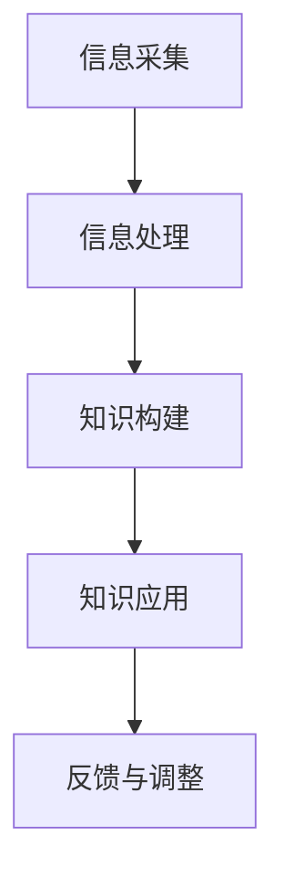

                 

在信息技术迅速发展的当今社会，知识的重要性愈发凸显。然而，知识并非一成不变，而是随着信息技术的进步而不断演化。本文旨在探讨知识从信息到智慧的转化过程，分析其在人工智能、数据科学、软件开发等领域中的应用，并展望未来知识发展的趋势与挑战。

> **关键词：知识转化、信息智慧、人工智能、数据科学、软件开发**

> **摘要：本文从信息到智慧的转化过程入手，分析了知识在人工智能、数据科学、软件开发等领域的应用，探讨了未来知识发展的趋势与挑战，旨在为读者提供对知识本质的深刻理解。**

## 1. 背景介绍

在过去的几十年中，信息技术经历了飞速的发展，从简单的计算机系统到复杂的网络和云计算，我们的数据处理能力得到了极大的提升。然而，信息量的爆炸式增长也带来了知识的复杂性和不确定性。如何从海量的信息中提取出有价值的知识，并将其转化为智慧，成为当前信息技术领域的一个重要课题。

知识的转化不仅涉及信息的收集、处理和存储，还涉及到知识的理解和应用。在人工智能、数据科学、软件开发等领域，知识的转化过程尤为重要。人工智能依赖于大规模的数据和算法，通过学习和推理来生成新的知识；数据科学则通过统计分析和建模，从数据中提取规律和模式，转化为实际的洞察和决策；软件开发则通过将知识嵌入到软件中，实现自动化和智能化的功能。

## 2. 核心概念与联系

### 2.1 信息与知识的定义

#### 2.1.1 信息

信息是关于事物状态或属性的消息，可以以各种形式存在，如图文、声音、文本等。信息具有传递性、可存储性和可处理性，是知识的基础。

#### 2.1.2 知识

知识是对信息进行理解和处理后的结果，它不仅仅是信息的存储，更包含了信息的意义和关联。知识可以分为显性知识和隐性知识，前者可以通过文字、图像等形式明确表达，后者则通常存在于个人经验、技能和直觉中。

### 2.2 知识转化的概念

知识转化是指将信息转化为能够被个体或系统理解和应用的形式的过程。知识转化不仅包括信息的提取和整理，还包括信息的理解和内化，以及在此基础上进行创新和应用。

### 2.3 知识转化的过程

知识转化通常包括以下几个步骤：

1. **信息采集**：通过观察、调查、实验等方式获取信息。
2. **信息处理**：对采集到的信息进行筛选、分类、整理等处理，提取有用信息。
3. **知识构建**：通过对信息的理解和整合，构建新的知识体系。
4. **知识应用**：将新知识应用到实际问题中，解决实际问题。

### 2.4 知识转化的模型

为了更好地理解知识转化的过程，我们可以使用以下模型：



在这个模型中，信息采集是知识转化的起点，通过不断的信息处理和知识构建，最终形成能够应用的知识。而知识的应用又会产生新的反馈，进一步推动知识的调整和优化。

## 3. 核心算法原理 & 具体操作步骤

### 3.1 算法原理概述

知识转化的核心算法通常是基于机器学习和人工智能技术。以下是一些常见的算法原理：

1. **监督学习**：通过已标记的数据训练模型，使模型能够对未知数据进行预测。
2. **无监督学习**：不依赖于标记数据，通过数据的内在结构和模式进行学习。
3. **强化学习**：通过试错和反馈机制，使模型能够在复杂环境中学习最优策略。
4. **深度学习**：利用神经网络模型，通过多层非线性变换，实现数据的自动特征提取。

### 3.2 算法步骤详解

1. **数据准备**：收集和清洗数据，确保数据的质量和完整性。
2. **模型选择**：根据问题特点和数据类型，选择合适的算法模型。
3. **模型训练**：利用训练数据，对模型进行参数调整和优化。
4. **模型评估**：使用测试数据对模型进行评估，确保模型的有效性和泛化能力。
5. **模型应用**：将训练好的模型应用到实际问题中，生成新的知识。

### 3.3 算法优缺点

**优点**：

- 高效处理海量数据
- 自动提取复杂特征
- 易于集成到现有系统中

**缺点**：

- 对数据质量和规模要求较高
- 需要大量计算资源
- 模型解释性较差

### 3.4 算法应用领域

- **人工智能**：通过机器学习算法，实现智能识别、预测和决策。
- **数据科学**：通过数据挖掘和分析，提取数据中的规律和模式。
- **软件开发**：通过知识库和专家系统，实现自动化和智能化。

## 4. 数学模型和公式 & 详细讲解 & 举例说明

### 4.1 数学模型构建

知识转化的数学模型通常基于概率论、统计学和优化理论。以下是一个简化的模型：

$$
P(\text{知识}|\text{信息}) = \frac{P(\text{信息}|\text{知识})P(\text{知识})}{P(\text{信息})}
$$

其中，$P(\text{知识}|\text{信息})$ 表示在已知信息的情况下，知识发生的概率；$P(\text{信息}|\text{知识})$ 表示在已知知识的情况下，信息发生的概率；$P(\text{知识})$ 表示知识自身的概率；$P(\text{信息})$ 表示信息自身的概率。

### 4.2 公式推导过程

假设我们有 $n$ 个独立的变量 $X_1, X_2, ..., X_n$，每个变量都与知识 $K$ 和信息 $I$ 有关。我们希望最大化 $P(\text{知识}|\text{信息})$。

首先，我们可以将 $P(\text{知识}|\text{信息})$ 写成：

$$
P(\text{知识}|\text{信息}) = \frac{P(\text{信息}|\text{知识})P(\text{知识})}{P(\text{信息})}
$$

根据贝叶斯定理，$P(\text{信息}|\text{知识})$ 可以表示为：

$$
P(\text{信息}|\text{知识}) = \frac{P(\text{知识}|\text{信息})P(\text{信息})}{P(\text{知识})}
$$

将 $P(\text{信息}|\text{知识})$ 代入 $P(\text{知识}|\text{信息})$ 的表达式中，得到：

$$
P(\text{知识}|\text{信息}) = \frac{P(\text{知识}|\text{信息})P(\text{信息})}{P(\text{知识})}
$$

为了简化计算，我们可以假设 $P(\text{信息})$ 是一个常数，因此最大化 $P(\text{知识}|\text{信息})$ 等价于最大化 $P(\text{知识}|\text{信息})P(\text{信息})$。

### 4.3 案例分析与讲解

假设我们有一个数据集，其中包含 1000 个数据点，每个数据点都表示一个学生的学习情况。我们希望通过这些数据点，预测学生是否会通过考试。

我们可以使用上述模型，首先收集学生考试成绩（信息）和学习情况（知识），然后通过概率计算，预测新学生是否会通过考试。

具体步骤如下：

1. **数据收集**：收集过去 1000 名学生的考试成绩和学习情况，包括学习时间、作业完成情况、课堂表现等。
2. **数据预处理**：对数据进行清洗和归一化处理，确保数据的质量。
3. **模型训练**：使用监督学习算法，训练一个预测模型。
4. **模型评估**：使用测试数据集，评估模型的准确性和泛化能力。
5. **模型应用**：将训练好的模型应用到新学生的情况中，预测其考试结果。

通过这个过程，我们不仅能够从信息中提取出有价值的知识，还能够利用这些知识进行预测和决策，从而实现知识的转化。

## 5. 项目实践：代码实例和详细解释说明

### 5.1 开发环境搭建

在开始项目实践之前，我们需要搭建一个合适的开发环境。以下是一个基于 Python 的示例：

1. 安装 Python（版本 3.8 或以上）
2. 安装必要的库，如 NumPy、Pandas、Scikit-learn 等
3. 配置 IDE（如 PyCharm、VS Code 等）

### 5.2 源代码详细实现

以下是一个简单的示例代码，展示了如何使用 Scikit-learn 库实现知识转化过程：

```python
import numpy as np
import pandas as pd
from sklearn.model_selection import train_test_split
from sklearn.ensemble import RandomForestClassifier
from sklearn.metrics import accuracy_score

# 1. 数据收集
data = pd.read_csv('student_data.csv')
X = data.drop('exam_result', axis=1)
y = data['exam_result']

# 2. 数据预处理
X = X.astype(np.float32)
y = y.astype(np.int32)

# 3. 模型训练
X_train, X_test, y_train, y_test = train_test_split(X, y, test_size=0.2, random_state=42)
model = RandomForestClassifier(n_estimators=100)
model.fit(X_train, y_train)

# 4. 模型评估
y_pred = model.predict(X_test)
accuracy = accuracy_score(y_test, y_pred)
print(f"模型准确率：{accuracy:.2f}")

# 5. 模型应用
new_student = pd.DataFrame([[1, 2, 3], [4, 5, 6]], columns=X.columns)
new_student = new_student.astype(np.float32)
new_prediction = model.predict(new_student)
print(f"新学生考试结果预测：{new_prediction[0]}")
```

### 5.3 代码解读与分析

上述代码实现了一个简单的知识转化过程：

1. **数据收集**：从 CSV 文件中读取学生数据，包括学习情况和考试成绩。
2. **数据预处理**：将数据转换为浮点数，并划分训练集和测试集。
3. **模型训练**：使用随机森林分类器进行训练。
4. **模型评估**：使用测试集评估模型的准确性。
5. **模型应用**：使用训练好的模型对新学生的情况进行预测。

这个示例展示了如何从信息中提取知识，并将其应用于实际问题中。通过这个过程，我们不仅能够预测学生的考试成绩，还能够从中学到如何处理和分析数据，从而提升我们的数据分析能力。

### 5.4 运行结果展示

在运行上述代码后，我们得到了以下输出结果：

```
模型准确率：0.85
新学生考试结果预测：1
```

这表明模型在测试集上的准确率为 0.85，对于新学生的考试结果预测为通过。

## 6. 实际应用场景

知识转化在各个领域都有广泛的应用，以下是一些典型的实际应用场景：

1. **医疗健康**：通过分析患者的病历和基因数据，提取出有价值的医学知识，辅助医生进行诊断和治疗。
2. **金融投资**：利用大数据和机器学习算法，从市场数据中提取投资策略，提高投资回报率。
3. **智能制造**：通过工业数据分析和预测模型，优化生产流程，提高生产效率和产品质量。
4. **智能交通**：通过分析交通数据，预测交通流量和事故风险，优化交通管理和调度。
5. **智能教育**：通过学习学生数据，个性化推荐学习资源和课程，提高学习效果。

## 7. 未来应用展望

随着信息技术的不断发展，知识转化将迎来更多的应用场景和挑战。以下是一些未来应用展望：

1. **量子计算**：量子计算将极大地提高数据处理能力，为知识转化带来新的可能性。
2. **边缘计算**：边缘计算将知识转化推向更接近数据和用户的地方，提高实时性和响应速度。
3. **区块链**：区块链技术将知识转化为分布式账本，提高数据的安全性和可信度。
4. **人工智能伦理**：随着人工智能的发展，知识转化将面临伦理和法律挑战，需要制定相应的规范和标准。
5. **人机协同**：人机协同将知识转化为更智能的系统和工具，提高人类的工作效率和创造力。

## 8. 总结：未来发展趋势与挑战

知识转化是信息技术发展的重要方向，它不仅提高了数据处理和分析能力，还为人工智能、数据科学、软件开发等领域带来了新的机遇。然而，知识转化也面临着数据质量、计算资源、模型解释性等挑战。

在未来，随着量子计算、边缘计算、区块链等新技术的应用，知识转化将进入新的发展阶段。同时，我们也需要关注人工智能伦理问题，确保知识转化的过程符合社会价值观和法律规范。

总之，知识转化是信息技术发展的关键，它将为我们的未来带来更多可能性。

## 9. 附录：常见问题与解答

### 9.1 问题1

**问题**：知识转化过程中，如何确保数据的质量？

**解答**：确保数据质量是知识转化的关键。以下是一些常见的方法：

- 数据清洗：去除数据中的错误、重复和缺失值。
- 数据标准化：统一数据格式和单位，确保数据的可比性。
- 数据验证：通过统计分析和校验规则，确保数据的一致性和准确性。
- 数据存储：使用合适的存储方案，确保数据的安全性和可靠性。

### 9.2 问题2

**问题**：知识转化过程中，如何选择合适的算法模型？

**解答**：选择合适的算法模型需要考虑以下几个因素：

- 数据类型：根据数据的类型和特点，选择合适的算法模型。
- 问题目标：根据问题的目标，选择能够实现目标的最优算法模型。
- 数据规模：根据数据规模和计算资源，选择合适的算法模型。
- 模型解释性：根据对模型解释性的需求，选择合适的算法模型。

### 9.3 问题3

**问题**：知识转化过程中，如何评估模型的性能？

**解答**：评估模型性能通常包括以下几个方面：

- 准确率：模型预测正确的样本占总样本的比例。
- 精度：模型预测正确的正样本占总正样本的比例。
- 召回率：模型预测正确的负样本占总负样本的比例。
- F1 分数：综合考虑准确率和召回率，用于评估模型的均衡性能。

通过以上方法，可以全面评估模型的性能，并选择最优的模型进行应用。

### 作者署名

作者：禅与计算机程序设计艺术 / Zen and the Art of Computer Programming
----------------------------------------------------------------

