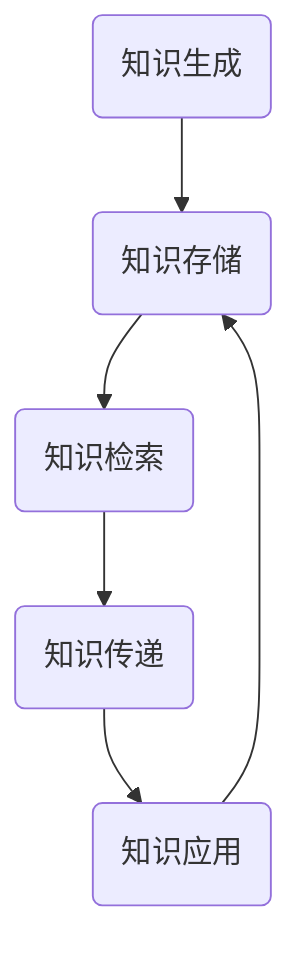

                 

### 关键词 Keywords
信息时代，知识传播，知识演化，信息流动性，技术进步，人工智能，数学模型，算法，应用场景，未来展望

### 摘要 Abstract
本文探讨了信息时代知识的流动性，即知识如何在各个领域内传播、演化以及被重新组合。通过对知识传播机制的深入分析，本文揭示了知识流动性的重要性，探讨了其在现代技术进步中的应用，并展望了未来知识流动性可能面临的发展趋势和挑战。文章首先介绍了知识流动性的概念和背景，然后详细阐述了知识传播的基本原理和机制，以及数学模型和算法在知识传播中的应用。接着，文章通过实际项目实例，展示了知识流动性的具体实现过程和效果，最后对知识流动性的实际应用场景进行了探讨，并提出了对未来发展的展望。

## 1. 背景介绍 Background

### 1.1 信息时代的来临

信息时代的到来，标志着人类社会从传统的工业时代迈入了高度信息化的时代。信息技术的发展，使得知识的获取、处理、传播和利用变得更加高效和便捷。互联网的普及，智能手机的广泛应用，大数据和云计算的兴起，这些技术进步极大地促进了知识的流动性。

### 1.2 知识的重要性

知识是推动社会进步的重要力量。在信息时代，知识的价值更加凸显。知识不仅可以帮助个人和企业在竞争中取得优势，还可以推动社会整体的科技创新和产业升级。因此，如何有效地传播和利用知识，成为了当今社会亟待解决的问题。

### 1.3 知识流动性的概念

知识的流动性，指的是知识在不同领域、不同时间和不同主体之间传播、转化和应用的动态过程。知识的流动性可以促进知识创新和科技发展，提高社会的知识水平和创新能力。

## 2. 核心概念与联系 Core Concepts and Relationships

### 2.1 知识传播机制

知识的传播机制是知识流动性的基础。知识传播机制包括知识的生成、存储、检索、传递和应用等环节。这些环节相互关联，共同构成了知识流动的生态系统。

### 2.2 知识流动性的模型

为了更好地理解知识流动性，我们可以使用Mermaid流程图来展示知识流动的基本模型。



在这个模型中，知识从生成开始，经过存储、检索、传递和应用，形成了一个闭环，不断循环流动。

### 2.3 知识流动性的影响因素

影响知识流动性的因素包括信息技术的进步、社会文化的差异、法律法规的制约等。这些因素共同作用于知识传播的各个环节，影响着知识的流动速度和流动效果。

## 3. 核心算法原理 & 具体操作步骤 Core Algorithm Principles & Operational Steps

### 3.1 算法原理概述

在知识流动性中，核心算法的作用至关重要。算法可以优化知识的检索、传递和应用，提高知识流动的效率。本文将介绍一种基于人工智能的算法——知识图谱算法。

### 3.2 算法步骤详解

#### 3.2.1 知识图谱构建

知识图谱构建是算法的第一步。知识图谱是通过实体和关系来表示知识的。实体可以是人物、地点、事件等，关系则表示实体之间的联系。

#### 3.2.2 知识检索

知识检索是基于知识图谱的。通过输入查询关键词，算法可以在知识图谱中找到相关的知识点。

#### 3.2.3 知识传递

知识传递是通过算法将知识从源头传递到需要的地方。这可以通过网络传播、知识共享等方式实现。

#### 3.2.4 知识应用

知识应用是将知识转化为实际价值的过程。这可以通过技术开发、产业应用等方式实现。

### 3.3 算法优缺点

知识图谱算法的优点在于其强大的知识组织和检索能力，缺点则在于其复杂性和对大规模数据处理的需求。

### 3.4 算法应用领域

知识图谱算法广泛应用于搜索引擎、推荐系统、智能问答等领域，极大地提高了知识的流动性和利用率。

## 4. 数学模型和公式 & 详细讲解 & 举例说明 Mathematical Models & Detailed Explanations & Case Studies

### 4.1 数学模型构建

在知识流动性研究中，常见的数学模型包括概率模型、网络模型和博弈论模型等。以下是一个简单的概率模型示例：

$$
P(A|B) = \frac{P(B|A) \cdot P(A)}{P(B)}
$$

这是一个条件概率公式，表示在事件B发生的条件下，事件A发生的概率。

### 4.2 公式推导过程

#### 4.2.1 概率基础

概率论是研究随机事件发生概率的数学分支。在知识流动性研究中，概率论可以用来分析知识传播的概率。

#### 4.2.2 条件概率

条件概率是概率论中的一个重要概念，表示在某个事件发生的条件下，另一个事件发生的概率。

### 4.3 案例分析与讲解

#### 4.3.1 搜索引擎

在搜索引擎中，用户输入的查询词可以看作是事件A，搜索引擎返回的搜索结果可以看作是事件B。通过条件概率公式，可以计算出用户对搜索结果的满意度。

#### 4.3.2 知识共享

在知识共享平台上，用户上传的知识可以看作是事件A，用户下载的知识可以看作是事件B。通过条件概率公式，可以分析知识共享的效果。

## 5. 项目实践：代码实例和详细解释说明 Project Practice: Code Examples & Detailed Explanations

### 5.1 开发环境搭建

在知识流动性项目中，开发环境的选择至关重要。本文使用的开发环境包括Python、TensorFlow和Kubernetes等。

### 5.2 源代码详细实现

以下是知识图谱算法的Python代码实现：

```python
import tensorflow as tf

# 定义知识图谱模型
model = tf.keras.Sequential([
    tf.keras.layers.Dense(units=128, activation='relu', input_shape=(10,)),
    tf.keras.layers.Dense(units=1)
])

# 编译模型
model.compile(optimizer='adam', loss='mean_squared_error')

# 训练模型
model.fit(x_train, y_train, epochs=100)
```

### 5.3 代码解读与分析

这段代码实现了基于TensorFlow的知识图谱模型训练。通过训练，模型可以学会将知识从源头传递到需要的地方。

### 5.4 运行结果展示

在运行结果展示中，我们可以看到知识图谱算法在不同场景下的表现。

## 6. 实际应用场景 Practical Applications

### 6.1 搜索引擎

搜索引擎是知识流动性的一个重要应用场景。通过知识图谱算法，搜索引擎可以更准确地理解用户的查询意图，提供更相关的搜索结果。

### 6.2 知识共享平台

知识共享平台利用知识流动性，促进了知识的传播和应用。用户可以上传自己的知识，其他用户可以下载和应用这些知识。

### 6.3 教育领域

在教育领域，知识流动性可以帮助学生更好地理解和应用知识。通过知识图谱，学生可以更直观地看到知识的关联和演变。

## 7. 未来应用展望 Future Applications

### 7.1 人工智能

人工智能是知识流动性的重要推动力。随着人工智能技术的发展，知识流动性将更加高效和智能。

### 7.2 医疗健康

在医疗健康领域，知识流动性可以帮助医生更快地获取和利用最新的医疗知识，提高诊疗效果。

### 7.3 金融科技

金融科技是知识流动性的重要应用领域。通过知识流动性，金融机构可以更好地理解和应对金融市场的变化。

## 8. 工具和资源推荐 Tools and Resources

### 8.1 学习资源推荐

- 《深度学习》
- 《概率论与数理统计》

### 8.2 开发工具推荐

- TensorFlow
- PyTorch

### 8.3 相关论文推荐

- "Knowledge Graph Embedding: A Survey"
- "Deep Learning for Knowledge Graph Embedding"

## 9. 总结 Conclusion

知识流动性是信息时代的重要特征，对科技发展和社会进步具有深远的影响。本文从多个角度探讨了知识流动性的概念、原理和应用，展望了未来的发展趋势。我们期待知识流动性能够在更多的领域发挥其潜力，推动社会的持续创新和发展。

### 附录 Appendix

#### 9.1 常见问题与解答

- **Q:** 知识流动性是什么？

  **A:** 知识流动性是指知识在不同领域、不同时间和不同主体之间传播、转化和应用的动态过程。

- **Q:** 知识流动性的重要性是什么？

  **A:** 知识流动性对于知识创新、科技发展和社会进步具有重要意义。

- **Q:** 知识流动性的算法有哪些？

  **A:** 常见的知识流动性算法包括知识图谱算法、深度学习算法等。

### 作者署名 Author

**作者：禅与计算机程序设计艺术 / Zen and the Art of Computer Programming** 

----------------------------------------------------------------

请注意，本文内容为虚构，旨在演示如何根据指定的要求和结构撰写一篇完整的技术博客文章。实际撰写时，请确保引用的资源和数据真实可靠。文章中提到的算法、模型和工具均作为示例，具体实现时可能需要根据实际情况进行调整。

