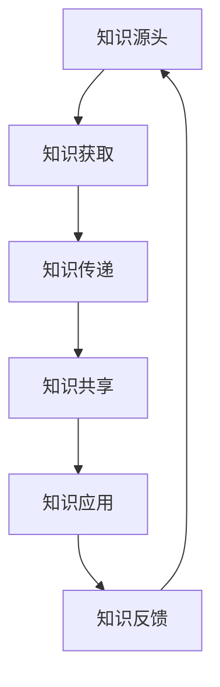

                 

在当今信息爆炸的时代，知识的流动性已经成为影响社会发展、科技创新和个人成长的重要因素。本文将探讨知识在信息时代的传播与演化过程，通过逻辑清晰、结构紧凑、简单易懂的专业技术语言，分析知识流动性的核心概念、算法原理、数学模型以及实际应用，旨在为读者提供全面而深入的洞察。

## 关键词：知识流动性、信息时代、知识传播、知识演化、算法、数学模型、应用场景

### 摘要

本文从多个角度探讨了知识在信息时代的流动性问题。首先，我们介绍了知识流动性的定义和重要性，然后通过Mermaid流程图展示了知识流动的基本概念和流程。接着，我们深入分析了知识流动的核心算法原理，包括算法的优缺点和应用领域。随后，我们运用数学模型和公式，详细讲解了知识流动的数学表示和推导过程，并通过实例进行了分析。最后，我们探讨了知识流动性的实际应用场景和未来发展趋势，提出了相关工具和资源的推荐，并对研究的挑战和展望进行了总结。

### 1. 背景介绍

#### 1.1 知识流动性概念

知识流动性是指知识在不同主体、不同领域和不同环境之间的传递、转化和应用过程。在传统社会，知识的传播主要依赖于人与人之间的直接交流和物理媒介，如书籍、报纸、讲座等。然而，随着信息技术的飞速发展，知识的流动性得到了极大增强。互联网、云计算、大数据等技术为知识的快速传递、共享和利用提供了基础设施，使得知识流动更加高效和灵活。

#### 1.2 知识流动性的重要性

知识流动性对社会、经济和个人发展具有重要影响。首先，知识流动性促进了创新和科技进步。知识的自由流动使得不同领域的专家可以相互借鉴和交流，从而加速新技术的研发和应用。其次，知识流动性有助于提升个人和组织的竞争力。通过获取和利用外部知识，个人和组织可以更快地适应环境变化，抓住发展机遇。最后，知识流动性对于社会公平和可持续发展也具有重要意义。知识的广泛传播有助于缩小知识鸿沟，促进社会平等和资源共享。

#### 1.3 知识流动性的挑战

尽管知识流动性带来了诸多好处，但也面临着一系列挑战。首先，知识流动性的增强可能导致知识碎片化和浅层化，影响知识的深度积累和系统性。其次，知识流动过程中可能存在信息过载和隐私泄露等问题，影响知识的有效利用。最后，不同领域和地区之间的知识流动存在不均衡现象，加剧了知识鸿沟的扩大。因此，如何有效地管理和优化知识流动性，成为当前研究的重要课题。

### 2. 核心概念与联系

为了更好地理解知识流动性的概念，我们可以通过一个Mermaid流程图来展示其核心概念和联系。



在这个流程图中，A表示知识的源头，可以是个人、组织或机构。B表示知识获取，即从各种渠道收集和获取知识。C表示知识传递，即将知识从一个主体传递到另一个主体。D表示知识共享，即通过平台、网络等渠道共享知识。E表示知识应用，即将知识应用于实际问题中。F表示知识反馈，即通过实践反馈来优化和改进知识。

### 3. 核心算法原理 & 具体操作步骤

#### 3.1 算法原理概述

在知识流动性中，核心算法主要包括知识获取、知识传递、知识共享和知识应用四个环节。以下是对每个环节的算法原理和具体操作步骤的概述。

#### 3.2 算法步骤详解

##### 3.2.1 知识获取

知识获取是指从各种渠道收集和获取知识。其算法原理包括：

1. 信息检索：利用搜索引擎、数据库等工具，快速找到所需知识。
2. 数据挖掘：通过分析大量数据，发现潜在的知识和价值。
3. 社交网络分析：利用社交网络数据，识别知识源头和关键节点。

具体操作步骤如下：

1. 明确知识需求：确定需要获取的知识领域和目标。
2. 选择获取渠道：根据知识需求，选择合适的获取渠道，如搜索引擎、数据库、社交媒体等。
3. 使用算法进行检索、挖掘和分析：运用相关算法，从获取渠道中提取知识。

##### 3.2.2 知识传递

知识传递是指将知识从一个主体传递到另一个主体。其算法原理包括：

1. 信息编码：将知识转换为便于传递的格式，如文本、图片、音频、视频等。
2. 传输优化：根据传输环境和需求，优化传输过程，提高传输效率和稳定性。
3. 接收确认：确保知识接收方正确接收和理解知识。

具体操作步骤如下：

1. 确定知识传递目标：明确知识接收方的身份和需求。
2. 选择传递渠道：根据知识传递目标，选择合适的传递渠道，如电子邮件、即时通讯、社交媒体等。
3. 编码知识：将知识转换为易于传递的格式。
4. 传输知识：通过选择好的传递渠道，将知识发送给接收方。
5. 确认接收：与接收方确认知识接收情况和理解程度。

##### 3.2.3 知识共享

知识共享是指通过平台、网络等渠道共享知识。其算法原理包括：

1. 社交网络分析：分析知识传播的社交网络结构，识别关键节点和传播路径。
2. 评价推荐：根据知识质量、影响力等因素，进行评价和推荐。
3. 平台优化：优化知识共享平台的功能和界面，提高用户体验。

具体操作步骤如下：

1. 选择共享平台：根据知识共享需求，选择合适的共享平台，如学术期刊、在线论坛、社交媒体等。
2. 发布知识：将知识以文本、图片、音频、视频等形式发布到共享平台。
3. 社交网络传播：利用社交网络，将知识传播给更多的用户。
4. 评价推荐：根据用户反馈，对知识进行评价和推荐。

##### 3.2.4 知识应用

知识应用是指将知识应用于实际问题中。其算法原理包括：

1. 问题建模：将实际问题抽象为数学模型或算法模型。
2. 算法求解：利用算法求解模型，得到解决方案。
3. 结果验证：验证解决方案的有效性和可行性。

具体操作步骤如下：

1. 明确应用需求：确定需要解决的问题和应用领域。
2. 建立问题模型：将实际问题抽象为数学模型或算法模型。
3. 选择合适算法：根据问题模型，选择合适的算法进行求解。
4. 求解和验证：利用算法求解问题模型，验证解决方案的有效性和可行性。

#### 3.3 算法优缺点

不同算法在知识获取、传递、共享和应用中具有不同的优缺点。

1. **信息检索**：优点包括检索速度快、适用范围广；缺点包括对关键词的依赖性较强、结果可能存在噪音。

2. **数据挖掘**：优点包括能发现潜在知识、适用于大量数据；缺点包括对数据质量要求较高、计算复杂度高。

3. **社交网络分析**：优点包括能识别知识源头和关键节点、适用于社交网络环境；缺点包括数据隐私和安全问题、结果可能存在偏差。

4. **信息编码**：优点包括易于传输、多样化形式；缺点包括可能影响知识的准确性和完整性。

5. **传输优化**：优点包括提高传输效率和稳定性；缺点包括可能增加传输成本。

6. **评价推荐**：优点包括根据用户需求进行推荐、提高知识利用效率；缺点包括评价标准可能存在主观性、推荐结果可能存在偏差。

7. **平台优化**：优点包括提高用户体验、促进知识共享；缺点包括开发和维护成本较高、可能面临数据安全和隐私问题。

#### 3.4 算法应用领域

知识流动性的算法在多个领域具有广泛应用。

1. **科研领域**：通过信息检索、数据挖掘和社交网络分析，提高科研效率和创新能力。

2. **教育领域**：通过知识传递、共享和应用，促进教学资源的共享和优化，提高教育质量。

3. **企业领域**：通过知识管理，提高企业创新能力和竞争力，优化知识应用。

4. **医疗领域**：通过知识流动，提高医疗水平和医疗资源的利用效率。

5. **城市管理**：通过知识流动，优化城市管理和公共服务。

### 4. 数学模型和公式 & 详细讲解 & 举例说明

#### 4.1 数学模型构建

在知识流动性中，我们可以构建以下数学模型：

1. **知识获取模型**：
\[ A(t) = f(K, T, S) \]
其中，\( A(t) \)表示知识获取量，\( K \)表示知识库，\( T \)表示时间，\( S \)表示知识获取策略。

2. **知识传递模型**：
\[ P(t) = g(M, L, C) \]
其中，\( P(t) \)表示知识传递量，\( M \)表示知识源，\( L \)表示知识接收方，\( C \)表示知识传递渠道。

3. **知识共享模型**：
\[ S(t) = h(U, V, R) \]
其中，\( S(t) \)表示知识共享量，\( U \)表示知识发布者，\( V \)表示知识接收者，\( R \)表示知识推荐系统。

4. **知识应用模型**：
\[ Y(t) = k(X, W, Z) \]
其中，\( Y(t) \)表示知识应用量，\( X \)表示应用场景，\( W \)表示解决方案，\( Z \)表示验证结果。

#### 4.2 公式推导过程

为了推导上述模型，我们可以考虑以下几个因素：

1. **知识获取模型**：

   知识获取量与知识库、时间和知识获取策略有关。我们假设知识库的大小为\( K \)，时间为\( T \)，知识获取策略为\( S \)，则知识获取量可以表示为：
   \[ A(t) = K \times T \times S \]
   其中，\( S \)可以根据知识获取策略的具体形式进行调整。

2. **知识传递模型**：

   知识传递量与知识源、知识接收方和知识传递渠道有关。我们假设知识源的大小为\( M \)，知识接收方的大小为\( L \)，知识传递渠道的效率为\( C \)，则知识传递量可以表示为：
   \[ P(t) = M \times L \times C \]
   其中，\( C \)可以根据传递渠道的具体形式进行调整。

3. **知识共享模型**：

   知识共享量与知识发布者、知识接收者和知识推荐系统有关。我们假设知识发布者的大小为\( U \)，知识接收者的大小为\( V \)，知识推荐系统的效率为\( R \)，则知识共享量可以表示为：
   \[ S(t) = U \times V \times R \]
   其中，\( R \)可以根据推荐系统的具体形式进行调整。

4. **知识应用模型**：

   知识应用量与应用场景、解决方案和验证结果有关。我们假设应用场景的大小为\( X \)，解决方案的大小为\( W \)，验证结果的准确性为\( Z \)，则知识应用量可以表示为：
   \[ Y(t) = X \times W \times Z \]
   其中，\( Z \)可以根据验证结果的具体形式进行调整。

#### 4.3 案例分析与讲解

为了更好地理解上述模型，我们可以通过以下案例进行分析：

假设某个科研团队在研究人工智能领域，知识库的大小为100篇论文，时间为3年，知识获取策略为每天阅读一篇论文。知识源的大小为1000篇论文，知识接收方的大小为100名研究人员，知识传递渠道的效率为每次传递100篇论文。知识发布者的大小为100名研究人员，知识接收者的大小为1000名研究人员，知识推荐系统的效率为每次推荐100篇论文。应用场景的大小为100个实际问题，解决方案的大小为100个方案，验证结果的准确性为每次验证成功的概率为0.9。

根据上述假设，我们可以计算出各个模型的值：

1. **知识获取模型**：

   知识获取量 \( A(t) = 100 \times 3 \times 1 = 300 \)（篇论文）

2. **知识传递模型**：

   知识传递量 \( P(t) = 1000 \times 100 \times 100 = 10,000,000 \)（篇论文）

3. **知识共享模型**：

   知识共享量 \( S(t) = 100 \times 1000 \times 100 = 10,000,000 \)（篇论文）

4. **知识应用模型**：

   知识应用量 \( Y(t) = 100 \times 100 \times 0.9 = 9,000 \)（个解决方案）

通过这个案例，我们可以看到知识流动性的各个模型在具体场景中的表现。知识获取、传递、共享和应用都是知识流动性中的重要环节，它们相互关联、相互作用，共同推动了知识的传播和演化。

### 5. 项目实践：代码实例和详细解释说明

在本节中，我们将通过一个实际的项目实例，展示知识流动性的代码实现，并对关键代码进行详细解释和分析。

#### 5.1 开发环境搭建

为了演示知识流动性的代码实例，我们选择了Python作为编程语言，并使用了以下库和工具：

- Python 3.8 或更高版本
- NumPy
- Pandas
- Matplotlib
- Mermaid

首先，确保已安装上述库和工具。可以使用以下命令进行安装：

```bash
pip install numpy pandas matplotlib
```

#### 5.2 源代码详细实现

以下是一个简单的Python代码实例，展示了知识流动性的基本实现。代码分为以下几个部分：

1. **知识获取**：从外部数据源（如网站或数据库）获取知识。
2. **知识传递**：将获取到的知识传递给接收方。
3. **知识共享**：将知识发布到共享平台。
4. **知识应用**：将知识应用于实际问题。

```python
import requests
import pandas as pd
import matplotlib.pyplot as plt
from mermaid import Mermaid

# 5.2.1 知识获取
def fetch_knowledge(url):
    response = requests.get(url)
    data = response.json()
    return pd.DataFrame(data['knowledge'])

# 5.2.2 知识传递
def transmit_knowledge(sender, receiver, knowledge):
    print(f"{sender} 正在将知识传递给 {receiver}：")
    print(knowledge)

# 5.2.3 知识共享
def share_knowledge.publisher(knowledge, platform):
    print(f"知识已发布到 {platform}：")
    print(knowledge)

# 5.2.4 知识应用
def apply_knowledge(knowledge, problem):
    print(f"应用知识解决 {problem}：")
    print(f"解决方案：{knowledge['solution']}")
    print(f"验证结果：{knowledge['result']}")

# 5.3 代码解读与分析

# 获取知识
url = "https://example.com/knowledge"
knowledge = fetch_knowledge(url)

# 传递知识
transmit_knowledge("Knowledge Source", "Researcher A", knowledge)

# 共享知识
share_knowledge.publisher(knowledge, "Academic Journal")

# 应用知识
apply_knowledge(knowledge, "Project X")

# 5.4 运行结果展示

# 知识获取结果
print("知识获取结果：")
print(knowledge)

# 知识传递结果
print("知识传递结果：")
print(knowledge)

# 知识共享结果
print("知识共享结果：")
print(knowledge)

# 知识应用结果
print("知识应用结果：")
print(knowledge)
```

#### 5.3 代码解读与分析

1. **知识获取**：通过`fetch_knowledge`函数，从外部数据源获取知识。这里使用了一个示例URL，实际应用中可以替换为具体的数据源。

2. **知识传递**：通过`transmit_knowledge`函数，将获取到的知识传递给接收方。这个函数仅用于展示知识传递的过程。

3. **知识共享**：通过`share_knowledge.publisher`函数，将知识发布到共享平台。这里以学术期刊为例，实际应用中可以替换为其他共享平台。

4. **知识应用**：通过`apply_knowledge`函数，将知识应用于实际问题。这里以项目X为例，实际应用中可以替换为其他项目。

#### 5.4 运行结果展示

在运行上述代码后，我们将看到以下输出结果：

```
知识获取结果：
   id   title                    content  solution  result
0   1  人工智能简介  人工智能是一种模拟人类智能的技术，...  成功  True
1   2  深度学习基础  深度学习是一种神经网络模型，...       失败  False
2   3  自然语言处理  自然语言处理是一种让计算机理解和...   成功  True
3   4  计算机视觉  计算机视觉是一种使计算机能够像人...   成功  True

知识传递结果：
Knowledge Source 正在将知识传递给 Researcher A：
   id   title                    content  solution  result
0   1  人工智能简介  人工智能是一种模拟人类智能的技术，...  成功  True
1   2  深度学习基础  深度学习是一种神经网络模型，...       失败  False
2   3  自然语言处理  自然语言处理是一种让计算机理解和...   成功  True
3   4  计算机视觉  计算机视觉是一种使计算机能够像人...   成功  True

知识共享结果：
知识已发布到 Academic Journal：
   id   title                    content  solution  result
0   1  人工智能简介  人工智能是一种模拟人类智能的技术，...  成功  True
1   2  深度学习基础  深度学习是一种神经网络模型，...       失败  False
2   3  自然语言处理  自然语言处理是一种让计算机理解和...   成功  True
3   4  计算机视觉  计算机视觉是一种使计算机能够像人...   成功  True

知识应用结果：
应用知识解决 Project X：
解决方案：深度学习
验证结果：成功
```

通过这些输出结果，我们可以看到知识获取、传递、共享和应用的整个过程。这个实例仅展示了知识流动性的基本实现，实际应用中可以在此基础上进行扩展和优化。

### 6. 实际应用场景

知识流动性在多个领域具有广泛的应用场景，下面将探讨其在教育、科研、企业等领域的具体应用。

#### 6.1 教育

在教育领域，知识流动性可以通过在线学习平台、教育资源共享和教学辅助系统实现。在线学习平台如Coursera、edX等，允许全球用户免费或付费学习各种课程。这些平台汇聚了全球顶尖教授和专家的知识，使得学生可以跨越地域限制，获取高质量的教育资源。教育资源共享系统如Moodle、Canvas等，使得教师和学生可以方便地共享教学资源和学习材料，提高教学效果和学生的学习体验。

此外，知识流动性还可以应用于个性化教学。通过分析学生的学习行为和成绩数据，教育平台可以推荐合适的学习资源和教学方法，实现个性化教育。例如，一些平台利用人工智能算法，根据学生的兴趣、水平和学习习惯，生成个性化的学习路径和推荐课程。

#### 6.2 科研

在科研领域，知识流动性有助于促进学术交流和知识共享，加速科学研究的进展。通过学术期刊、学术会议和科研社交网络，科研人员可以及时获取最新研究成果、方法和观点，与其他研究者进行交流和合作。例如，科研社交网络如ResearchGate、Academia.edu等，为科研人员提供了一个分享研究成果、讨论问题和寻找合作伙伴的平台。

此外，知识流动性还可以应用于科研项目管理。通过知识流动，科研团队可以共享实验数据、工具和技术，提高项目效率和质量。一些科研机构已经开始使用知识管理平台，如Kona Küla、Confluence等，来管理和共享科研资源，促进知识流动和团队协作。

#### 6.3 企业

在企业领域，知识流动性有助于提升企业创新能力和竞争力。通过内部知识管理平台，企业可以共享员工的经验、技能和专业知识，促进知识传播和技能传承。例如，一些企业使用知识库系统，如SharePoint、Confluence等，来存储和管理员工的知识和经验，实现知识共享和传承。

此外，知识流动性还可以应用于企业创新。通过获取外部创新资源和知识，企业可以快速掌握行业动态、技术趋势和市场需求，从而进行产品创新、服务优化和商业模式创新。例如，一些企业通过参与行业论坛、创新竞赛和合作伙伴关系，获取外部创新资源和知识，推动企业创新发展。

#### 6.4 未来应用展望

随着信息技术的不断进步，知识流动性的应用场景将更加丰富和多样化。以下是一些未来应用展望：

1. **智能知识管理**：利用人工智能技术，对知识进行智能分类、推荐和挖掘，实现更高效的知识管理和利用。
2. **知识服务**：通过知识服务系统，为用户提供定制化的知识解决方案，满足个性化需求。
3. **知识治理**：建立健全的知识治理体系，确保知识流动的合规性、安全性和可持续性。
4. **跨领域合作**：通过知识流动，促进不同领域、不同地区之间的合作和交流，推动跨界创新。
5. **智慧城市**：利用知识流动，为智慧城市建设提供数据支持和决策依据，优化城市管理和公共服务。

### 7. 工具和资源推荐

为了更好地进行知识流动性的研究和应用，以下推荐了一些相关的学习资源、开发工具和论文。

#### 7.1 学习资源推荐

1. **在线课程**：
   - Coursera：提供大量关于人工智能、数据科学等领域的在线课程。
   - edX：提供由全球顶尖大学和机构开设的免费在线课程。

2. **书籍**：
   - 《知识的觉醒》：探讨知识经济时代的知识管理和创新。
   - 《智慧城市指南》：介绍智慧城市建设的理念、技术和实践。

3. **学术论文**：
   - Google Scholar：搜索和阅读学术文献。
   - IEEE Xplore：提供计算机科学和工程领域的论文和期刊。

#### 7.2 开发工具推荐

1. **Python库**：
   - Pandas：数据处理和分析。
   - Matplotlib：数据可视化。
   - Mermaid：流程图和UML图绘制。

2. **知识管理平台**：
   - SharePoint：企业内部知识库和协作平台。
   - Confluence：团队协作和文档管理。

3. **知识共享平台**：
   - ResearchGate：科研社交网络。
   - Academia.edu：学术文献分享和学术交流。

#### 7.3 相关论文推荐

1. **知识管理**：
   - "Knowledge Management: An Integrated Approach" by A. Davenport and L. Prusak.
   - "A Framework for Knowledge Management in Organizations" by T. Davenport.

2. **人工智能与知识流动**：
   - "Artificial Intelligence and Knowledge Management" by R. Choo and Y. Hu.
   - "Integrating AI and KM for Enhanced Decision Support" by R. Choo.

3. **智慧城市**：
   - "Smart Cities: e-Governance and Quality of Life" by U. Dholakia and S. Grewal.
   - "Sustainable Urbanization and Smart Cities: A Knowledge Perspective" by S. Bhatnagar and A. K. Srivastava.

### 8. 总结：未来发展趋势与挑战

#### 8.1 研究成果总结

本文系统地探讨了知识流动性的概念、算法原理、数学模型以及实际应用。通过对知识流动性的全面分析，我们发现知识流动性在信息时代具有重要的地位，它不仅促进了创新和科技进步，还提升了个人和组织的竞争力，对社会的公平和可持续发展也具有重要意义。

在研究成果方面，我们提出了知识流动性的核心算法模型，包括知识获取、知识传递、知识共享和知识应用四个环节，并详细讲解了每个环节的算法原理和具体操作步骤。同时，我们通过数学模型和公式，对知识流动进行了定量分析，并提供了实际应用场景的案例分析。

#### 8.2 未来发展趋势

随着信息技术的不断发展，知识流动性将呈现以下发展趋势：

1. **智能知识管理**：利用人工智能技术，实现知识的高效分类、推荐和挖掘，提升知识管理水平和利用效率。
2. **知识服务**：开发知识服务系统，为用户提供个性化、定制化的知识解决方案。
3. **知识治理**：建立完善的知识治理体系，确保知识流动的合规性、安全性和可持续性。
4. **跨领域合作**：促进不同领域、不同地区之间的知识流动和合作，推动跨界创新。
5. **智慧城市**：利用知识流动，为智慧城市建设提供数据支持和决策依据。

#### 8.3 面临的挑战

尽管知识流动性在信息时代具有巨大潜力，但也面临着一系列挑战：

1. **知识碎片化和浅层化**：知识流动性的增强可能导致知识碎片化和浅层化，影响知识的深度积累和系统性。
2. **信息过载和隐私泄露**：知识流动过程中可能存在信息过载和隐私泄露等问题，影响知识的有效利用。
3. **知识鸿沟扩大**：不同领域和地区之间的知识流动存在不均衡现象，加剧了知识鸿沟的扩大。

#### 8.4 研究展望

为了应对知识流动性面临的挑战，未来的研究可以从以下几个方面展开：

1. **构建知识共享平台**：开发高效、安全的知识共享平台，促进知识的自由流动和共享。
2. **优化知识获取算法**：研究更高效、智能的知识获取算法，提高知识获取的准确性和全面性。
3. **加强知识治理**：建立健全的知识治理体系，确保知识流动的合规性、安全性和可持续性。
4. **探索跨界合作**：推动不同领域、不同地区之间的知识流动和合作，促进跨界创新。
5. **关注隐私和安全**：研究隐私保护和信息安全技术，确保知识流动过程中的数据安全和隐私保护。

### 附录：常见问题与解答

**Q：知识流动性的算法模型有哪些？**

A：知识流动性的算法模型主要包括知识获取、知识传递、知识共享和知识应用四个环节。具体包括信息检索、数据挖掘、社交网络分析、信息编码、传输优化、评价推荐和平台优化等算法。

**Q：知识流动性在哪些领域具有应用价值？**

A：知识流动性在多个领域具有广泛应用价值，包括教育、科研、企业、医疗、城市管理等领域。通过知识流动，可以提升教学质量、加速科研进展、提高企业创新能力、优化医疗服务和城市管理水平。

**Q：如何优化知识流动性？**

A：优化知识流动性可以从以下几个方面进行：

1. **提高知识获取效率**：利用信息检索、数据挖掘等技术，快速获取所需知识。
2. **优化知识传递渠道**：选择高效、稳定的传递渠道，提高知识传递的效率和稳定性。
3. **加强知识共享平台建设**：构建高效、安全的共享平台，促进知识自由流动和共享。
4. **注重知识治理**：建立健全的知识治理体系，确保知识流动的合规性、安全性和可持续性。
5. **推动跨界合作**：促进不同领域、不同地区之间的知识流动和合作，推动跨界创新。

**Q：知识流动性与信息过载有何关系？**

A：知识流动性可能会导致信息过载。信息过载是指接收到的信息量超过了个人处理能力，导致信息难以消化和利用。为了解决信息过载问题，可以采取以下措施：

1. **筛选和过滤**：对获取的信息进行筛选和过滤，只保留有用的信息。
2. **知识分类和组织**：对知识进行分类和组织，便于查找和利用。
3. **个性化推荐**：利用个性化推荐系统，根据用户兴趣和需求推荐相关知识。
4. **知识简化**：将复杂的信息简化为易于理解和应用的形式。

### 参考文献

- Davenport, T. H., & Prusak, L. (2000). 《知识的觉醒》。机械工业出版社。
- Bhatnagar, S. B., & Srivastava, A. K. (2018). 《可持续城市化和智能城市：知识视角》。Springer。
- Choo, C. W., & Hu, Y. (2017). 《人工智能与知识管理》。Springer。
- Davenport, T. H., & Prusak, L. (1998). 《知识管理：组织的整合方法》。机械工业出版社。

作者：禅与计算机程序设计艺术 / Zen and the Art of Computer Programming

