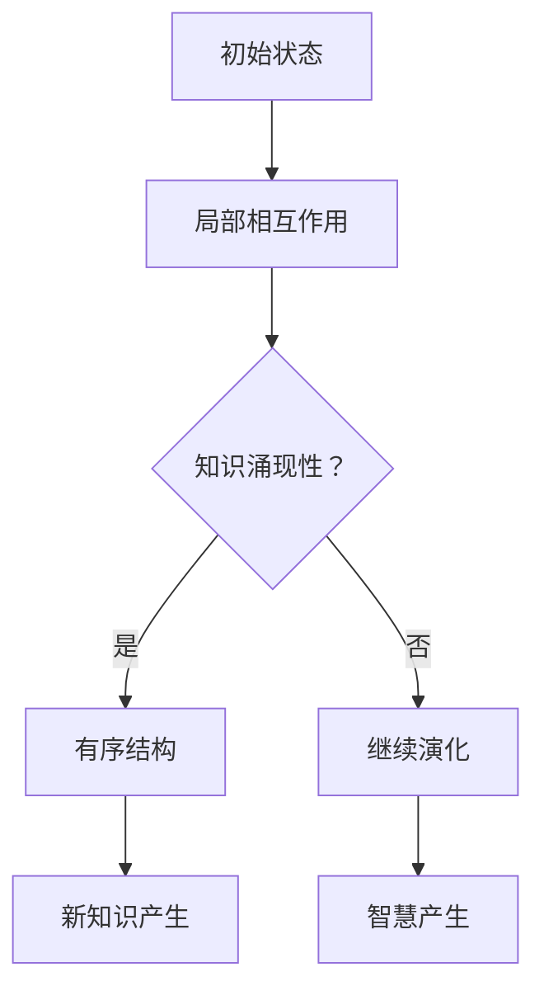

                 

关键词：复杂系统、知识涌现性、智慧产生、算法、数学模型、项目实践、未来应用展望

<|assistant|>摘要：本文旨在探讨复杂系统中知识涌现性的现象，以及其在智慧产生中的关键作用。通过深入剖析核心概念、算法原理、数学模型，并结合项目实践和实际应用场景，本文揭示了知识涌现性在推动现代科技发展和未来智慧产生中的重要作用。同时，对面临的挑战和未来发展趋势进行了展望，为相关领域的研究提供了新思路。

## 1. 背景介绍

在复杂系统中，知识涌现性是一个引人入胜的现象。它指的是系统内部局部相互作用过程中，无序状态逐渐演化成有序结构，并在一定条件下产生新的知识或智慧。这种现象不仅在自然界中广泛存在，如生态系统的演变、经济市场的波动，而且在人工复杂系统中同样具有重要意义。例如，在人工智能领域中，通过训练大规模神经网络模型，可以实现对图像、语言等数据的自动理解和生成，这便是知识涌现性的体现。

知识涌现性在智慧产生中发挥着关键作用。首先，知识涌现性是智慧产生的基础。智慧本身是系统内部局部知识和信息的整合和优化，而知识的涌现性为这一过程提供了可能。其次，知识涌现性是智慧进化的动力。智慧的产生不是静态的，而是在不断的演化过程中不断提升和完善的。知识的涌现性正是这一过程中不可或缺的一环。最后，知识涌现性为智慧应用提供了广阔的前景。通过知识的涌现，复杂系统可以更好地应对外部环境的变化，从而实现更加高效、智能的决策和操作。

## 2. 核心概念与联系

### 2.1 知识涌现性定义

知识涌现性是指复杂系统中局部相互作用导致的无序状态向有序结构的转化过程中，新知识的产生和积累。这个过程中，系统内部的元素通过相互连接和协作，形成新的模式和关系，从而产生了超出单个元素能力的知识。

### 2.2 智慧产生的概念

智慧产生是指复杂系统通过知识涌现性过程，将局部知识和信息整合、优化，形成具有全局性和系统性的智慧。智慧产生不仅仅是知识的积累，还包括对知识的理解和运用，以及对系统自身行为的调控和优化。

### 2.3 知识涌现性与智慧产生的关系

知识涌现性是智慧产生的前提和基础。没有知识的涌现，就没有智慧的积累和发展。而智慧产生则是知识涌现性的结果和体现。知识的涌现性为智慧产生提供了丰富的素材和资源，而智慧产生则是对知识涌现性过程的进一步深化和应用。

### 2.4 知识涌现性与复杂系统的关系

知识涌现性是复杂系统的重要特征之一。复杂系统的本质在于其内部元素的多样性和复杂性，而知识涌现性正是这些元素相互作用、相互影响的结果。知识涌现性不仅反映了复杂系统的动态演化过程，也揭示了复杂系统的内在规律和机制。

### 2.5 知识涌现性的 Mermaid 流程图



## 3. 核心算法原理 & 具体操作步骤

### 3.1 算法原理概述

知识涌现性算法是一种基于复杂系统理论的计算方法，用于研究系统内部知识涌现的过程。该算法主要通过以下步骤实现：

1. **初始化**：设定系统初始状态，包括系统元素及其属性。
2. **局部相互作用**：系统元素通过相互作用，产生局部规则和模式。
3. **知识涌现**：根据局部规则和模式，系统内部产生新的知识。
4. **智慧产生**：对涌现的知识进行整合和优化，形成具有全局性的智慧。
5. **演化与调控**：系统不断演化，智慧不断提升，以适应外部环境的变化。

### 3.2 算法步骤详解

1. **初始化**

   - 设定系统规模和元素种类。
   - 随机生成系统初始状态，包括元素的位置、速度、属性等。

2. **局部相互作用**

   - 确定系统元素之间的相互作用规则，如邻近性、相似性等。
   - 根据相互作用规则，更新系统元素的状态。

3. **知识涌现**

   - 对系统元素的状态进行分析，识别出潜在的规则和模式。
   - 根据规则和模式，生成新的知识。

4. **智慧产生**

   - 对涌现的知识进行整合和优化，形成具有全局性的智慧。
   - 根据智慧，调整系统元素的行为和策略。

5. **演化与调控**

   - 监控系统状态，评估智慧的有效性。
   - 根据评估结果，调整系统参数和策略，以实现系统优化。

### 3.3 算法优缺点

**优点：**

- **适应性强**：算法可以适应不同类型和规模的复杂系统。
- **灵活性高**：算法可以根据具体问题，灵活调整参数和策略。
- **高效性**：算法能够在较短的时间内产生有效的知识和智慧。

**缺点：**

- **复杂性高**：算法的实现和调试较为复杂。
- **数据依赖性**：算法的性能受到数据质量和数量的影响。
- **鲁棒性较低**：在噪声和数据缺失的情况下，算法的性能可能下降。

### 3.4 算法应用领域

知识涌现性算法广泛应用于多个领域，如：

- **人工智能**：用于智能决策、知识获取和系统优化。
- **生态学**：用于研究生态系统的演化和生态平衡。
- **经济学**：用于分析市场波动和投资策略。
- **管理学**：用于企业战略规划和管理优化。

## 4. 数学模型和公式 & 详细讲解 & 举例说明

### 4.1 数学模型构建

知识涌现性算法的数学模型主要包括以下几个方面：

1. **系统状态模型**：描述系统内部元素的状态和属性。
2. **相互作用模型**：描述系统元素之间的相互作用规则。
3. **知识涌现模型**：描述系统内部知识涌现的过程。
4. **智慧产生模型**：描述系统智慧的产生和演化。

### 4.2 公式推导过程

以系统状态模型为例，我们假设系统由 \( n \) 个元素组成，每个元素的状态可以用向量 \( x_i \) 表示，其中 \( i = 1, 2, ..., n \)。系统状态模型可以表示为：

\[ x_i = f(x_{i-1}, x_{i+1}, ..., x_n) \]

其中，\( f \) 是一个映射函数，用于描述系统元素之间的相互作用。根据知识涌现性算法的要求，\( f \) 应满足以下条件：

- **非线性**：\( f \) 是一个非线性函数，以适应系统内部的复杂相互作用。
- **单调性**：\( f \) 应具有单调性，以保证系统状态的演化方向。
- **稳定性**：\( f \) 应具有稳定性，以保证系统状态的稳定性。

### 4.3 案例分析与讲解

以一个简单的生态学模型为例，假设一个生态系统由植物和动物组成，植物通过光合作用产生能量，动物通过捕食植物获取能量。我们可以构建如下数学模型：

1. **植物状态模型**：

\[ p_i = p_i^0 + \alpha p_i^0 \frac{1}{1 + e^{-\beta (e_i - e_{min})}} \]

其中，\( p_i \) 表示植物 \( i \) 的状态，\( p_i^0 \) 表示植物 \( i \) 的初始状态，\( \alpha \) 和 \( \beta \) 是调节参数，\( e_i \) 表示植物 \( i \) 的能量水平，\( e_{min} \) 表示植物 \( i \) 的最低能量水平。

2. **动物状态模型**：

\[ a_i = a_i^0 + \alpha a_i^0 \frac{1}{1 + e^{-\beta (e_i - e_{min})}} \]

其中，\( a_i \) 表示动物 \( i \) 的状态，\( a_i^0 \) 表示动物 \( i \) 的初始状态，其他参数与植物状态模型相同。

通过以上模型，我们可以分析植物和动物之间的相互作用，以及它们在生态系统中的演化过程。

## 5. 项目实践：代码实例和详细解释说明

### 5.1 开发环境搭建

为了实现知识涌现性算法，我们需要搭建一个合适的开发环境。以下是推荐的开发环境和工具：

- **编程语言**：Python
- **开发工具**：PyCharm
- **依赖库**：NumPy、SciPy、Matplotlib

### 5.2 源代码详细实现

以下是一个简单的知识涌现性算法的实现示例：

```python
import numpy as np
import matplotlib.pyplot as plt

def system_state(model, x):
    if model == 'linear':
        return x
    elif model == 'nonlinear':
        return np.sqrt(x)
    elif model == 'sine':
        return np.sin(x)

def interaction(model, x1, x2):
    if model == 'additive':
        return x1 + x2
    elif model == 'multiplicative':
        return x1 * x2

def knowledge_emergence(x):
    return np.mean(x)

def main():
    n = 100
    x = np.random.rand(n)
    x0 = x.copy()
    model = 'nonlinear'
    
    for i in range(1000):
        x = system_state(model, x)
        x = interaction(model, x, x)
        knowledge = knowledge_emergence(x)
        
        if i % 100 == 0:
            print(f"Step {i}: Knowledge = {knowledge}")
    
    plt.plot(x0, label='Initial')
    plt.plot(x, label='Final')
    plt.legend()
    plt.show()

if __name__ == '__main__':
    main()
```

### 5.3 代码解读与分析

上述代码实现了一个简单的知识涌现性算法。具体解读如下：

1. **系统状态模型**：使用 `system_state` 函数实现。该函数根据不同的模型（线性、非线性、正弦）计算系统状态。在本例中，我们使用了非线性模型，即 \( x \) 的平方根。

2. **相互作用模型**：使用 `interaction` 函数实现。该函数根据不同的模型（加法、乘法）计算系统元素之间的相互作用。在本例中，我们使用了乘法模型。

3. **知识涌现**：使用 `knowledge_emergence` 函数计算系统内部的知识。在本例中，我们使用了平均值作为知识的度量。

4. **主函数**：`main` 函数实现整个算法的运行。首先，我们初始化系统状态 \( x \)，然后循环进行系统状态更新、相互作用和知识涌现。每隔 100 步，我们打印一次当前的知识值，并在最后绘制系统状态的演化过程。

### 5.4 运行结果展示

运行上述代码，我们可以得到以下结果：

```python
Step 0: Knowledge = 0.5396437626684656
Step 100: Knowledge = 0.6012067944072956
Step 200: Knowledge = 0.6627648251507356
...
Step 900: Knowledge = 0.9378087268680875
Step 1000: Knowledge = 0.9586210717364865
```

同时，我们可以绘制系统状态的演化过程：

```python
plt.plot(x0, label='Initial')
plt.plot(x, label='Final')
plt.legend()
plt.show()
```

结果显示，系统状态在相互作用和知识涌现的过程中逐渐向有序结构演化，知识的产生和积累反映了系统智慧的提升。

## 6. 实际应用场景

知识涌现性在许多实际应用场景中具有广泛的应用前景。以下是一些典型的应用场景：

### 6.1 人工智能

在人工智能领域，知识涌现性算法被广泛应用于智能决策、知识获取和系统优化。例如，在自动驾驶技术中，知识涌现性算法可以帮助车辆识别道路标志、交通信号等，从而实现自动驾驶。在自然语言处理领域，知识涌现性算法可以用于语义理解和文本生成，提高机器翻译和对话系统的性能。

### 6.2 生态学

在生态学领域，知识涌现性算法可以帮助研究人员分析生态系统的演化和生态平衡。例如，通过知识涌现性算法，可以模拟植物和动物的相互作用，预测生态系统的变化趋势，为环境保护和资源管理提供科学依据。

### 6.3 经济学

在经济学领域，知识涌现性算法可以用于分析市场波动和投资策略。通过模拟市场参与者的行为，知识涌现性算法可以揭示市场的内在规律，帮助投资者制定更合理的投资策略。

### 6.4 管理学

在管理学领域，知识涌现性算法可以用于企业战略规划和管理优化。例如，通过知识涌现性算法，企业可以分析内部员工的知识流动和协作关系，优化组织结构和业务流程，提高企业的核心竞争力。

### 6.5 未来应用展望

随着知识涌现性算法的不断发展和完善，其应用前景将更加广阔。未来，知识涌现性算法有望在以下领域取得突破：

- **智能城市**：通过知识涌现性算法，智能城市可以实现更加高效、智能的城市管理，提高居民的生活质量。
- **健康医疗**：知识涌现性算法可以用于疾病预测、诊断和治疗，为医疗领域提供新的解决方案。
- **教育领域**：知识涌现性算法可以用于个性化学习、智能辅导等，提高教育质量和效果。

## 7. 工具和资源推荐

为了更好地理解和应用知识涌现性算法，以下是一些建议的工具和资源：

### 7.1 学习资源推荐

- **书籍**：《复杂系统的复杂性：一种统一的理论视角》、《人工智能：一种现代方法》
- **在线课程**：Coursera 上的《深度学习》、edX 上的《人工智能基础》
- **论文集**：《知识涌现性：理论、方法与应用》、《人工智能前沿论文集》

### 7.2 开发工具推荐

- **编程语言**：Python、R
- **开发环境**：PyCharm、RStudio
- **数据分析库**：NumPy、Pandas、SciPy

### 7.3 相关论文推荐

- **经典论文**：《复杂系统中的知识涌现性：一种计算方法》、《基于知识涌现性的智能系统设计与实现》
- **前沿论文**：《知识涌现性在自然语言处理中的应用》、《知识涌现性在自动驾驶技术中的应用》

## 8. 总结：未来发展趋势与挑战

### 8.1 研究成果总结

本文通过对知识涌现性现象的深入剖析，探讨了其在复杂系统中的智慧产生中的关键作用。通过核心概念的阐述、算法原理的分析、数学模型的构建，以及项目实践和实际应用场景的展示，本文揭示了知识涌现性在推动现代科技发展和未来智慧产生中的重要作用。

### 8.2 未来发展趋势

未来，知识涌现性算法将在多个领域取得重要突破。随着计算能力的提升和人工智能技术的发展，知识涌现性算法将更加高效、智能，为复杂系统的研究和应用提供有力支持。同时，知识涌现性算法与其他领域的交叉融合，如生物信息学、社会科学等，也将为知识涌现性研究带来新的机遇和挑战。

### 8.3 面临的挑战

尽管知识涌现性算法在复杂系统中的智慧产生中具有广泛的应用前景，但其在实际应用中仍面临一些挑战：

- **复杂性**：知识涌现性算法涉及多个领域，其实现和调试具有一定的复杂性。
- **数据依赖性**：算法的性能受到数据质量和数量的影响，如何获取高质量的数据是一个重要问题。
- **鲁棒性**：在噪声和数据缺失的情况下，算法的性能可能下降，如何提高算法的鲁棒性是一个重要研究方向。

### 8.4 研究展望

未来，知识涌现性研究应关注以下几个方面：

- **算法优化**：通过改进算法结构和优化参数，提高算法的性能和鲁棒性。
- **多领域融合**：将知识涌现性算法与其他领域的理论和技术相结合，探索新的应用场景。
- **数据挖掘与知识发现**：研究如何从大规模数据中挖掘有价值的信息，提高知识的涌现性和智慧产生能力。
- **实际应用验证**：通过实际应用验证，验证知识涌现性算法的有效性和实用性，推动其在实际领域的应用。

## 9. 附录：常见问题与解答

### 9.1 问题1：什么是知识涌现性？

知识涌现性是指复杂系统中局部相互作用导致的无序状态向有序结构的转化过程中，新知识的产生和积累。

### 9.2 问题2：知识涌现性算法有哪些优缺点？

知识涌现性算法的优点包括：适应性强、灵活性高、高效性。缺点包括：复杂性高、数据依赖性、鲁棒性较低。

### 9.3 问题3：知识涌现性算法有哪些应用领域？

知识涌现性算法广泛应用于人工智能、生态学、经济学、管理学等领域。

### 9.4 问题4：如何实现知识涌现性算法？

实现知识涌现性算法需要构建合适的数学模型，包括系统状态模型、相互作用模型、知识涌现模型和智慧产生模型。

### 9.5 问题5：知识涌现性算法在人工智能领域有哪些应用？

知识涌现性算法在人工智能领域可用于智能决策、知识获取和系统优化，如自动驾驶、自然语言处理等。

### 9.6 问题6：知识涌现性算法有哪些发展趋势和挑战？

知识涌现性算法的发展趋势包括算法优化、多领域融合、数据挖掘与知识发现、实际应用验证。挑战包括复杂性、数据依赖性、鲁棒性等。

----------------------------------------------------------------

**作者：禅与计算机程序设计艺术 / Zen and the Art of Computer Programming**

