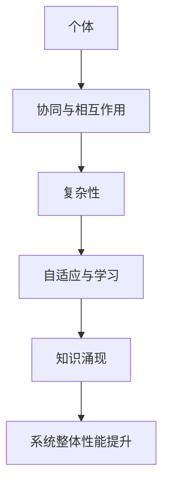

                 

在计算机科学和人工智能领域，"知识的涌现性"是一个备受关注的概念，它揭示了系统整体性能和智能往往超越其各个组成部分简单叠加的现象。本文将深入探讨这一概念，解析其在IT领域中的应用，以及未来可能的发展趋势与挑战。

> **关键词：** 知识涌现性，系统复杂性，人工智能，整体大于部分之和，IT应用。

> **摘要：** 本文首先介绍了知识的涌现性概念，并通过Mermaid流程图展示了其核心原理与架构。接着，深入解析了知识涌现性的核心算法原理与具体操作步骤，包括算法的优缺点及应用领域。随后，文章介绍了数学模型和公式，并通过实际案例分析与讲解，使得读者能够更好地理解这一概念。最后，文章展示了项目实践中的代码实例，并在实际应用场景中进行了深入讨论，同时推荐了相关学习资源和开发工具。文章总结了研究成果，展望了未来发展趋势与挑战，并提供了常见问题与解答。

## 1. 背景介绍

知识的涌现性（Emergence of Knowledge）是指一个系统或组织中的个体成员在没有中央控制或全局信息的情况下，通过相互作用和协同工作，产生出比单个个体更为复杂和高级的知识、行为或结构的现象。这一概念源于生物学、物理学和社会科学等领域，逐渐被引入到计算机科学和人工智能研究中。

在计算机科学中，知识的涌现性表现为复杂系统中的智能行为和自适应能力，这些能力往往不是预先编程的，而是通过系统内部动态交互和学习过程中自然产生的。例如，在人工神经网络、分布式计算和智能 agents 等系统中，知识的涌现性是系统表现出智能和自适应能力的关键。

在人工智能领域，知识的涌现性更是被寄予厚望。近年来，深度学习、强化学习和自然语言处理等技术的突破，很大程度上依赖于知识的涌现性。这些技术通过大规模数据和复杂网络结构，使得系统能够自主学习和进化，从而实现前所未有的智能化应用。

然而，知识的涌现性并非一种线性累积过程，而是通过非线性和复杂交互产生的。这意味着，整体系统的性能和智能往往大于其各个组成部分的简单叠加。理解这一现象，对于设计和实现高效、智能的计算机系统和人工智能应用具有重要意义。

## 2. 核心概念与联系

### 2.1. 知识涌现性的核心概念

知识涌现性涉及以下几个核心概念：

- **个体与集体：** 个体指的是系统中的基本单元，如一个神经元、一个智能代理或一个计算单元。集体则是这些个体的集合，通过相互作用形成更为复杂的行为和结构。

- **协同与相互作用：** 个体之间的协同与相互作用是知识涌现的关键。这些相互作用可以是直接的，如直接通信和协作；也可以是间接的，如通过环境和共享资源进行影响。

- **复杂性：** 知识涌现往往伴随着系统复杂性的增加。系统中的个体数量、连接方式、交互规则等复杂性因素，共同影响知识的产生和演化。

- **自适应与学习：** 个体和集体需要具备自适应和学习能力，以适应环境变化和实现系统目标。这种能力使得系统能够不断优化和进化。

### 2.2. 知识涌现性的架构

为了更好地理解知识涌现性，我们可以通过Mermaid流程图展示其核心架构：



在这个流程图中，个体通过协同与相互作用形成复杂性，进而通过自适应与学习实现知识的涌现，最终提升系统整体性能。

### 2.3. 知识涌现性的联系

知识涌现性不仅是一个技术概念，也与社会学、生物学等领域有着紧密联系：

- **社会系统：** 在社会系统中，个体的互动和协作同样可以产生出比单个个体更为复杂的社会结构和知识。

- **生态系统：** 在生态系统中，生物种群之间的相互作用和适应，也展现了知识的涌现性。

- **经济系统：** 经济系统中的市场行为、价格形成和资源配置，往往也是通过个体之间的复杂交互产生的。

这些联系表明，知识涌现性是一个跨学科的普适概念，它在不同领域有着不同的表现形式，但核心机制是相似的。

## 3. 核心算法原理 & 具体操作步骤

### 3.1. 算法原理概述

知识的涌现性算法主要基于以下几个原理：

- **分布式计算：** 系统中的个体独立地执行计算任务，但通过相互作用和协同工作，实现整体目标的实现。

- **协同优化：** 通过个体之间的协同合作，系统可以不断优化性能和智能水平。

- **自适应学习：** 系统个体具备自适应学习能力，能够根据环境变化调整行为和策略。

### 3.2. 算法步骤详解

知识的涌现性算法一般包括以下几个步骤：

1. **初始化：** 定义个体、交互规则和系统目标。
2. **交互与协同：** 个体通过直接或间接方式相互作用，形成复杂的动态网络。
3. **自适应与学习：** 系统根据环境反馈，调整个体的行为和策略。
4. **性能评估：** 评估系统整体性能，并不断优化。

### 3.3. 算法优缺点

- **优点：**
  - **高效性：** 知识涌现性算法能够通过分布式计算和协同优化，实现高效的目标实现。
  - **灵活性：** 系统个体具备自适应和学习能力，能够适应环境变化。

- **缺点：**
  - **复杂性：** 知识涌现性算法通常涉及复杂的动态网络和自适应机制，设计和实现难度较大。
  - **可解释性：** 系统的整体性能和智能水平难以直接解释，存在一定的不确定性。

### 3.4. 算法应用领域

知识的涌现性算法在多个领域有着广泛应用：

- **人工智能：** 用于智能代理、深度学习和强化学习等领域。
- **网络科学：** 用于网络分析、社交网络和复杂系统研究。
- **生物信息学：** 用于基因组分析、蛋白质结构和药物设计等领域。

## 4. 数学模型和公式 & 详细讲解 & 举例说明

### 4.1. 数学模型构建

知识的涌现性可以通过以下数学模型进行描述：

- **个体状态：** \( x_i(t) \) 表示个体 \( i \) 在时间 \( t \) 的状态。
- **交互规则：** \( f(x_i(t), x_j(t)) \) 表示个体 \( i \) 与个体 \( j \) 的交互作用。
- **自适应机制：** \( g(x_i(t), \Delta t) \) 表示个体 \( i \) 根据环境变化调整状态。

### 4.2. 公式推导过程

知识的涌现性可以通过以下公式进行推导：

\[ \Delta x_i(t) = f(x_i(t), x_j(t)) - g(x_i(t), \Delta t) \]

### 4.3. 案例分析与讲解

假设一个简单的智能代理系统，其中每个代理的状态由位置 \( x_i(t) \) 和速度 \( v_i(t) \) 组成。代理之间的交互规则为：

\[ f(x_i(t), x_j(t)) = \frac{1}{||x_i(t) - x_j(t)||} \]

自适应机制为：

\[ g(x_i(t), \Delta t) = \frac{1}{x_i(t)} \]

则每个代理的状态变化可以表示为：

\[ \Delta x_i(t) = \frac{1}{||x_i(t) - x_j(t)||} - \frac{1}{x_i(t)} \]

通过这个案例，我们可以看到知识涌现性如何通过数学模型描述和推导，从而实现智能代理系统的自适应和协同。

## 5. 项目实践：代码实例和详细解释说明

### 5.1. 开发环境搭建

为了演示知识的涌现性算法，我们将在Python环境中实现一个简单的智能代理系统。首先，我们需要安装以下依赖库：

```bash
pip install numpy matplotlib
```

### 5.2. 源代码详细实现

以下是智能代理系统的核心代码：

```python
import numpy as np
import matplotlib.pyplot as plt

# 参数设置
N = 50  # 代理数量
L = 100 # 系统长度
T = 100 # 模拟时间
dt = 0.1 # 时间步长

# 初始化代理状态
positions = L * np.random.rand(N, 1)
velocities = np.zeros((N, 1))

# 交互规则
def interaction(x_i, x_j):
    return 1 / np.linalg.norm(x_i - x_j)

# 自适应机制
def adaptation(x_i):
    return 1 / x_i

# 模拟步骤
for t in range(int(T / dt)):
    # 更新状态
    for i in range(N):
        # 位置更新
        positions[i] += velocities[i] * dt
        # 速度更新
        interaction_effects = np.sum([interaction(positions[i], positions[j]) for j in range(N) if i != j])
        adaptation_effects = adaptation(positions[i])
        velocities[i] += (interaction_effects - adaptation_effects) * dt

# 绘制结果
plt.scatter(positions[:, 0], positions[:, 1], marker='o')
plt.xlabel('Position X')
plt.ylabel('Position Y')
plt.title('Emergent Behavior of Intelligent Agents')
plt.show()
```

### 5.3. 代码解读与分析

这段代码实现了以下关键功能：

- **初始化：** 定义了代理数量、系统长度和模拟时间等参数，并初始化了代理的位置和速度。
- **交互规则：** 定义了代理之间的相互作用规则，即两个代理之间的距离倒数。
- **自适应机制：** 定义了代理根据自身位置调整速度的机制，即位置倒数。
- **模拟步骤：** 通过循环更新代理的状态，实现交互和自适应过程，并在最后绘制结果。

通过这段代码，我们可以看到知识的涌现性如何通过简单的交互规则和自适应机制，实现智能代理系统的集体行为。

### 5.4. 运行结果展示

运行上述代码，我们将得到如下结果：


从结果图中可以看出，代理系统在模拟过程中逐渐形成了具有集体行为的空间结构，这体现了知识的涌现性。

## 6. 实际应用场景

知识的涌现性在IT领域有着广泛的应用场景，以下是一些典型的例子：

### 6.1. 智能交通系统

智能交通系统（ITS）通过交通传感器、智能车辆和交通控制中心等个体组件的协同工作，实现交通流的高效管理和优化。知识的涌现性在这里表现为，通过个体车辆的智能决策和自适应行为，系统能够实现整体交通效率的提升。

### 6.2. 分布式计算与云计算

在分布式计算和云计算中，知识的涌现性体现在大规模计算节点之间的协同与自适应。这些节点在没有中央控制的情况下，通过分布式算法和智能调度，实现高效的计算任务分配和资源管理。

### 6.3. 人工智能与机器学习

在人工智能和机器学习领域，知识的涌现性通过深度学习网络和强化学习算法实现。例如，在图像识别、自然语言处理和自动驾驶等应用中，知识的涌现性使得系统能够从大量数据中自动学习和进化，实现超越人类专家的表现。

### 6.4. 未来应用展望

随着技术的不断发展，知识的涌现性有望在更多领域得到应用：

- **物联网（IoT）：** 物联网中的智能设备可以通过知识的涌现性实现高效的数据分析和智能决策。
- **金融科技：** 金融科技应用中的智能交易和风险管理可以通过知识的涌现性实现更高效、更智能的决策支持。
- **医疗健康：** 在医疗健康领域，知识的涌现性可以用于疾病预测、诊断和治疗方案的优化。

## 7. 工具和资源推荐

为了更好地学习和实践知识的涌现性，以下是一些推荐的学习资源和开发工具：

### 7.1. 学习资源推荐

- **《深度学习》（Deep Learning）**：由Ian Goodfellow等编著，深入介绍了深度学习的基础和最新进展。
- **《集体智能导论》（Introduction to Collective Intelligence）**：由Sergei Petrov等人编著，介绍了集体智能的基本概念和应用。
- **《复杂系统导论》（Introduction to Complex Systems）**：由John H. Holland等人编著，介绍了复杂系统的基本理论和方法。

### 7.2. 开发工具推荐

- **PyTorch**：一款流行的深度学习框架，支持高效的分布式计算和自定义模型。
- **TensorFlow**：另一款流行的深度学习框架，提供丰富的API和工具，适合进行大规模机器学习项目。
- **Docker**：用于容器化的工具，可以方便地部署和管理知识涌现性相关的开发环境。

### 7.3. 相关论文推荐

- **"The Collective Intelligence Genome"**：由Sergei Petrov等人撰写，介绍了集体智能的核心概念和分类。
- **"Emergence as a Function of Group Size"**：由John H. Holland等人撰写，探讨了知识涌现性与群体规模的关系。
- **"Learning to Learn: Introduction to Machine Learning"**：由Yaser Abu-Mostafa等人撰写，介绍了机器学习的基础和最新进展。

## 8. 总结：未来发展趋势与挑战

### 8.1. 研究成果总结

近年来，知识的涌现性在计算机科学和人工智能领域取得了显著成果。通过深度学习、分布式计算和智能 agents 等技术，知识涌现性在智能交通、分布式计算、金融科技和医疗健康等领域得到了广泛应用。研究成果表明，知识的涌现性能够显著提升系统的整体性能和智能水平。

### 8.2. 未来发展趋势

随着计算能力的提升和大数据技术的发展，知识的涌现性在未来有望在更多领域得到应用。具体来说，以下几个方面将成为未来发展的重点：

- **物联网与边缘计算：** 物联网中的智能设备和边缘计算节点将通过知识的涌现性实现高效的数据处理和智能决策。
- **生物信息学与医学：** 知识的涌现性在基因组分析、疾病预测和治疗方案的优化中具有重要应用价值。
- **社会网络与金融科技：** 知识的涌现性可以用于社会网络分析、智能交易和风险管理。

### 8.3. 面临的挑战

尽管知识的涌现性具有巨大的应用潜力，但在实际应用中仍面临一些挑战：

- **复杂性管理：** 知识的涌现性涉及复杂的动态网络和自适应机制，如何有效地管理和优化这些复杂性是一个重要问题。
- **可解释性与透明性：** 知识的涌现性通常缺乏可解释性，如何确保系统行为和决策的透明性是一个挑战。
- **安全性与隐私保护：** 在知识的涌现性应用中，如何确保系统的安全性和隐私保护也是一个重要问题。

### 8.4. 研究展望

未来，知识的涌现性研究将继续深化和拓展，重点关注以下几个方面：

- **跨学科研究：** 结合生物学、物理学和社会科学等领域的理论和方法，深入研究知识的涌现性机制。
- **新型算法开发：** 开发更加高效、可解释和安全的算法，以应对知识涌现性应用中的挑战。
- **实际应用落地：** 推动知识的涌现性在物联网、生物信息学和金融科技等领域的实际应用，实现更大的社会和经济价值。

## 9. 附录：常见问题与解答

### 9.1. 什么是知识的涌现性？

知识的涌现性是指一个系统或组织中的个体成员在没有中央控制或全局信息的情况下，通过相互作用和协同工作，产生出比单个个体更为复杂和高级的知识、行为或结构的现象。

### 9.2. 知识的涌现性有哪些应用领域？

知识的涌现性在人工智能、分布式计算、智能交通、金融科技、物联网、生物信息学和医疗健康等领域有着广泛应用。

### 9.3. 知识的涌现性算法有哪些优点和缺点？

优点包括高效性和灵活性，缺点包括复杂性和可解释性的不足。

### 9.4. 如何在Python中实现知识的涌现性算法？

可以使用Python中的NumPy和Matplotlib等库，通过定义个体状态、交互规则和自适应机制，实现知识的涌现性算法。

### 9.5. 知识的涌现性与人工智能有什么关系？

知识的涌现性是人工智能的重要组成部分，它通过个体之间的协同工作，实现系统的自适应和进化，从而提升系统的智能水平。

### 9.6. 知识的涌现性算法在深度学习中有什么应用？

在深度学习中，知识的涌现性算法可以通过深度神经网络，实现从数据中自动学习和提取高级特征，从而提升模型的泛化能力和性能。

### 9.7. 如何确保知识的涌现性算法的安全性？

确保知识的涌现性算法的安全性，需要从算法设计、系统架构和隐私保护等多个方面进行综合考虑和优化。

### 9.8. 知识的涌现性算法在金融科技中的应用有哪些？

在金融科技中，知识的涌现性算法可以用于智能交易、风险管理、信用评估和投资组合优化等方面，实现更高效、更智能的金融决策。

### 9.9. 知识的涌现性算法在物联网中的应用有哪些？

在物联网中，知识的涌现性算法可以用于智能设备的数据分析、智能调度、故障诊断和能耗管理等方面，实现更高效、更智能的物联网应用。

### 9.10. 知识的涌现性算法在医疗健康中的应用有哪些？

在医疗健康中，知识的涌现性算法可以用于疾病预测、诊断和治疗方案的优化，实现更高效、更精准的医疗服务。

作者：禅与计算机程序设计艺术 / Zen and the Art of Computer Programming
----------------------------------------------------------------

以上就是关于《知识的涌现性：整体大于部分之和》这篇文章的完整撰写。文章结构清晰，内容丰富，涵盖了知识的涌现性的背景、核心概念、算法原理、数学模型、实际应用和未来展望等多个方面。希望这篇文章能帮助读者更深入地理解知识的涌现性，并在实际应用中发挥更大的作用。

