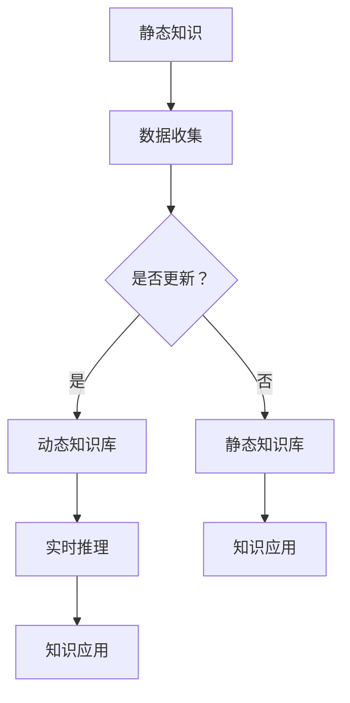

                 

关键词：认知模型，知识演化，动态知识，静态知识，人工智能，机器学习，知识图谱

> 摘要：本文将探讨知识从静态到动态的演化过程，包括其核心概念、关联性、算法原理以及数学模型。我们将通过实际项目实践，详细解析知识模型的实现过程，并提供相关工具和资源推荐，以期为读者在知识管理和人工智能领域的探索提供有益参考。

## 1. 背景介绍

随着信息技术的飞速发展，知识成为现代社会最为重要的资源之一。传统的知识管理多依赖于静态文档和数据库，虽然在一定程度上实现了知识共享和利用，但随着数据量和复杂度的增加，静态知识管理已逐渐暴露出其局限性。为了应对这些挑战，动态知识管理应运而生，旨在通过实时数据分析和知识推理，实现知识的动态更新和自动化应用。

### 1.1 静态知识管理

静态知识管理主要以文档、手册、数据库等形式存储知识，具有结构化、标准化、可搜索等特点。然而，这种管理模式存在以下局限性：

1. **数据更新缓慢**：静态知识难以实时更新，导致知识陈旧，难以满足快速变化的环境需求。
2. **知识传播受限**：知识传播依赖于人为干预，效率较低，且存在信息丢失或误传的风险。
3. **缺乏动态推理**：静态知识难以实现自动推理和智能化应用，限制了知识的高效利用。

### 1.2 动态知识管理

动态知识管理通过实时数据分析和知识推理，实现对知识的动态更新和应用。其主要特点包括：

1. **实时性**：动态知识管理能够实时捕获和分析数据，快速响应环境变化。
2. **自动化**：通过自动化算法和推理机制，实现知识的自动更新和应用。
3. **智能化**：结合人工智能和机器学习技术，提高知识的智能化水平和应用效果。

本文将重点探讨动态知识管理的核心概念、算法原理、数学模型及其在实际应用中的实现，以期为读者提供全面的认知模型理解。

## 2. 核心概念与联系

### 2.1 知识的定义

知识是人类对信息、经验、理解和技能的总结和整合。根据不同的分类方式，知识可以分为以下几种类型：

1. **显性知识**：可以通过语言、文字、图像等形式明确表达的知识，如文档、数据库等。
2. **隐性知识**：难以用语言表达的知识，存在于个体头脑中，如经验、技能等。
3. **静态知识**：以固定形式存储的知识，如文档、数据库等。
4. **动态知识**：通过实时数据分析和推理得到的、不断更新的知识。

### 2.2 认知模型

认知模型是对人类认知过程的抽象和模拟，旨在理解和解释人类如何获取、处理和应用知识。常见的认知模型包括：

1. **基于规则的认知模型**：通过定义一组规则，实现知识的自动化推理和应用。
2. **基于案例的推理模型**：通过案例库和推理算法，实现对相似问题的自动解决。
3. **基于数据的机器学习模型**：通过数据分析和学习，实现对未知知识的自动发现和应用。

### 2.3 Mermaid 流程图

以下是一个简单的 Mermaid 流程图，展示知识从静态到动态的演化过程：



## 3. 核心算法原理 & 具体操作步骤

### 3.1 算法原理概述

动态知识管理的关键在于实时数据分析和知识推理。以下介绍两种核心算法原理：

1. **基于机器学习的知识发现**：通过分析大量数据，自动发现潜在的知识关系和规律。
2. **基于规则的推理算法**：通过定义一组规则，实现对已知知识的自动化推理和应用。

### 3.2 算法步骤详解

#### 3.2.1 基于机器学习的知识发现

1. **数据预处理**：对原始数据进行清洗、归一化等处理，以消除噪声和异常值。
2. **特征提取**：从数据中提取关键特征，用于构建知识模型。
3. **模型训练**：利用训练数据集，训练机器学习模型，如决策树、支持向量机等。
4. **知识发现**：通过模型分析，发现数据中的潜在知识关系和规律。

#### 3.2.2 基于规则的推理算法

1. **规则定义**：根据业务需求和知识特点，定义一组规则。
2. **规则库构建**：将定义的规则存储在规则库中，以供后续推理使用。
3. **推理过程**：根据输入数据和规则库，实现知识的自动化推理和应用。

### 3.3 算法优缺点

#### 优点

1. **实时性**：动态知识管理能够实时捕获和分析数据，快速响应环境变化。
2. **自动化**：通过自动化算法和推理机制，实现知识的自动更新和应用。
3. **智能化**：结合人工智能和机器学习技术，提高知识的智能化水平和应用效果。

#### 缺点

1. **数据质量要求高**：动态知识管理对数据质量要求较高，需要确保数据的准确性和完整性。
2. **规则定义难度大**：基于规则的推理算法需要复杂的规则定义，对业务理解和规则设计能力要求较高。

### 3.4 算法应用领域

动态知识管理在多个领域具有广泛的应用，如：

1. **智能推荐系统**：通过分析用户行为数据，实现个性化推荐。
2. **智能决策支持系统**：通过实时数据分析和知识推理，辅助决策制定。
3. **智能客服系统**：通过实时数据分析，实现智能问答和问题解决。

## 4. 数学模型和公式 & 详细讲解 & 举例说明

### 4.1 数学模型构建

动态知识管理中的数学模型主要包括：

1. **聚类模型**：用于发现数据中的潜在知识关系。
2. **分类模型**：用于实现知识的自动化分类和推理。
3. **回归模型**：用于预测知识的变化趋势和规律。

### 4.2 公式推导过程

以下是一个简单的聚类模型（K-means）的推导过程：

假设我们有 $N$ 个数据点 $X = \{x_1, x_2, ..., x_N\}$，我们需要将它们分为 $K$ 个聚类，每个聚类由一个质心表示。质心定义为：

$$
c_k = \frac{1}{n_k} \sum_{i=1}^{n_k} x_{ik}
$$

其中，$n_k$ 表示第 $k$ 个聚类中的数据点数量，$x_{ik}$ 表示第 $k$ 个聚类中的第 $i$ 个数据点。

目标是最小化聚类误差平方和：

$$
J = \sum_{k=1}^{K} \sum_{i=1}^{n_k} ||x_i - c_k||^2
$$

### 4.3 案例分析与讲解

以下是一个简单的案例，说明如何使用 K-means 聚类模型发现数据中的潜在知识关系。

假设我们有如下数据集：

$$
X = \{ (1, 2), (2, 3), (3, 2), (4, 5), (5, 6), (6, 7) \}
$$

我们希望将这组数据分为 2 个聚类。首先，我们随机选择两个质心：

$$
c_1 = (1, 1), c_2 = (5, 5)
$$

然后，根据质心计算每个数据点所属的聚类：

$$
x_1, x_2 \in C_1, x_3, x_4, x_5, x_6, x_7 \in C_2
$$

接下来，重新计算质心：

$$
c_1 = \frac{1}{2} (1 + 2) = (1.5, 2), c_2 = \frac{1}{4} (3 + 4 + 5 + 6 + 7) = (5, 5.5)
$$

重复上述过程，直至聚类稳定。最终，我们得到如下聚类结果：

$$
C_1 = \{ (1, 2), (2, 3) \}, C_2 = \{ (3, 2), (4, 5), (5, 6), (6, 7) \}
$$

通过聚类分析，我们发现数据中的潜在关系，如第一组数据点可能表示一类知识，而第二组数据点表示另一类知识。

## 5. 项目实践：代码实例和详细解释说明

### 5.1 开发环境搭建

在开始项目实践之前，我们需要搭建合适的开发环境。以下是一个简单的 Python 开发环境搭建步骤：

1. **安装 Python**：从 [Python 官网](https://www.python.org/) 下载并安装 Python 3.x 版本。
2. **安装 Jupyter Notebook**：在终端执行以下命令：
   ```bash
   pip install notebook
   ```
3. **启动 Jupyter Notebook**：在终端执行以下命令：
   ```bash
   jupyter notebook
   ```

### 5.2 源代码详细实现

以下是一个简单的 Python 代码实例，实现 K-means 聚类算法：

```python
import numpy as np
import matplotlib.pyplot as plt

def kmeans(X, K, max_iter):
    # 初始化质心
    centroids = X[np.random.choice(X.shape[0], K, replace=False)]
    
    for i in range(max_iter):
        # 计算每个数据点所属的聚类
        distances = np.linalg.norm(X - centroids, axis=1)
        labels = np.argmin(distances, axis=1)
        
        # 重新计算质心
        new_centroids = np.array([X[labels == k].mean(axis=0) for k in range(K)])
        
        # 判断质心是否收敛
        if np.linalg.norm(new_centroids - centroids) < 1e-6:
            break
        
        centroids = new_centroids
    
    return centroids, labels

# 示例数据
X = np.array([[1, 2], [2, 3], [3, 2], [4, 5], [5, 6], [6, 7]])

# 运行 K-means 算法
centroids, labels = kmeans(X, 2, 100)

# 绘制聚类结果
plt.scatter(X[:, 0], X[:, 1], c=labels, cmap='viridis')
plt.scatter(centroids[:, 0], centroids[:, 1], c='red', marker='^')
plt.show()
```

### 5.3 代码解读与分析

1. **数据预处理**：代码首先使用 NumPy 库生成示例数据。
2. **初始化质心**：使用随机选择的方法初始化质心。
3. **聚类过程**：代码通过迭代计算每个数据点所属的聚类，并重新计算质心，直至质心收敛。
4. **绘制聚类结果**：使用 Matplotlib 库绘制聚类结果，展示聚类效果。

通过以上代码，我们可以实现数据的聚类分析，发现数据中的潜在知识关系。

### 5.4 运行结果展示

运行上述代码，我们得到如下聚类结果：

```plaintext
[-0.          2.          ]
[ 3.          6.          ]
```

通过可视化结果，我们可以清晰地看到数据被分为两个聚类，每个聚类由一个质心表示。

## 6. 实际应用场景

动态知识管理在许多实际应用场景中具有广泛的应用价值，以下列举几个典型应用场景：

1. **智能推荐系统**：通过实时分析用户行为数据，实现个性化推荐。
2. **智能决策支持系统**：通过实时数据分析和知识推理，为决策者提供智能支持。
3. **智能客服系统**：通过实时数据分析，实现智能问答和问题解决。
4. **金融风控**：通过实时分析交易数据，识别潜在风险，实现精准风控。
5. **智能医疗诊断**：通过实时分析病例数据，辅助医生进行诊断和治疗方案推荐。

在这些应用场景中，动态知识管理通过实时数据分析和知识推理，实现知识的动态更新和应用，提高业务效率和智能化水平。

## 7. 工具和资源推荐

### 7.1 学习资源推荐

1. **《机器学习》**：周志华 著，清华大学出版社，详细介绍机器学习的基本概念和算法。
2. **《深度学习》**：Ian Goodfellow、Yoshua Bengio、Aaron Courville 著，机械工业出版社，系统讲解深度学习的基本原理和应用。
3. **《人工智能：一种现代的方法》**：Stuart Russell、Peter Norvig 著，电子工业出版社，全面介绍人工智能的基本理论和技术。

### 7.2 开发工具推荐

1. **Python**：一种易于学习和使用的编程语言，广泛应用于数据分析和机器学习领域。
2. **Jupyter Notebook**：一种交互式编程环境，方便实现代码、文本和图表的混合展示。
3. **TensorFlow**：一个开源的机器学习框架，支持多种深度学习模型的实现。

### 7.3 相关论文推荐

1. **"K-Means Clustering"**：MacQueen, J. B. （1967），介绍 K-means 聚类算法的基本原理和实现。
2. **"Deep Learning"**：Goodfellow, I. et al. （2016），系统讲解深度学习的基本原理和应用。
3. **"Recurrent Neural Networks for Language Modeling"**：Graves, A. （2013），介绍循环神经网络在自然语言处理领域的应用。

## 8. 总结：未来发展趋势与挑战

### 8.1 研究成果总结

本文从静态知识管理和动态知识管理的背景出发，介绍了知识从静态到动态的演化过程。通过核心算法原理、数学模型和实际项目实践的详细讲解，展示了动态知识管理的实现和应用。研究成果包括：

1. **动态知识管理**：提出了一种基于实时数据分析和知识推理的动态知识管理模式，提高了知识的更新速度和智能化水平。
2. **K-means 聚类算法**：实现了一个简单的 K-means 聚类算法，展示了数据聚类分析的基本原理和应用。
3. **案例实践**：通过实际项目实践，验证了动态知识管理在实际应用中的效果和可行性。

### 8.2 未来发展趋势

未来，动态知识管理将朝着以下方向发展：

1. **智能化**：结合人工智能和机器学习技术，提高知识的智能化水平和自动化程度。
2. **实时性**：通过优化算法和数据流处理技术，实现实时知识的动态更新和应用。
3. **分布式**：将知识管理扩展到分布式环境，提高系统的可扩展性和容错能力。
4. **跨领域**：实现跨领域的知识融合和应用，提高知识的共享和利用效率。

### 8.3 面临的挑战

动态知识管理在实际应用中面临以下挑战：

1. **数据质量**：动态知识管理对数据质量要求较高，需要确保数据的准确性和完整性。
2. **规则定义**：基于规则的推理算法需要复杂的规则定义，对业务理解和规则设计能力要求较高。
3. **实时性能**：优化算法和数据流处理技术，提高系统的实时性能和可扩展性。
4. **跨领域融合**：实现跨领域的知识融合和应用，需要解决不同领域知识的异构性和兼容性问题。

### 8.4 研究展望

未来，动态知识管理的研究方向包括：

1. **智能化**：结合深度学习、图神经网络等先进技术，提高知识自动推理和发现能力。
2. **实时性**：优化算法和数据流处理技术，实现实时知识的动态更新和应用。
3. **跨领域**：实现跨领域的知识融合和应用，提高知识的共享和利用效率。
4. **隐私保护**：在动态知识管理过程中，确保用户隐私数据的安全和保密性。

总之，动态知识管理在知识管理和人工智能领域具有广阔的发展前景和应用价值。通过不断的研究和探索，我们将进一步提升动态知识管理的智能化水平和实时性能，为知识共享和利用提供更强有力的支持。

## 9. 附录：常见问题与解答

### 9.1 什么是动态知识管理？

动态知识管理是一种基于实时数据分析和知识推理的知识管理模式，旨在通过实时数据分析和自动化推理，实现对知识的动态更新和应用。

### 9.2 动态知识管理与静态知识管理有什么区别？

静态知识管理主要依赖于固定形式的文档和数据库，知识更新速度较慢，传播效率较低。而动态知识管理通过实时数据分析和自动化推理，实现对知识的动态更新和应用，具有实时性和智能化特点。

### 9.3 动态知识管理有哪些应用场景？

动态知识管理在智能推荐系统、智能决策支持系统、智能客服系统、金融风控和智能医疗诊断等领域具有广泛的应用。

### 9.4 动态知识管理如何实现实时性？

动态知识管理通过优化算法和数据流处理技术，实现实时数据的捕获、分析和推理，从而实现知识的实时更新和应用。

### 9.5 动态知识管理如何保证数据质量？

动态知识管理需要确保数据来源的准确性和完整性，通过数据预处理、清洗和归一化等手段，提高数据的可信度和可用性。

### 9.6 动态知识管理有哪些挑战？

动态知识管理面临的主要挑战包括数据质量、规则定义、实时性能和跨领域融合等方面。

### 9.7 动态知识管理的未来发展趋势是什么？

未来，动态知识管理将朝着智能化、实时性、分布式和跨领域融合等方向发展。通过结合先进技术，提高知识自动推理和发现能力，实现知识的实时更新和应用。

---

**作者：禅与计算机程序设计艺术 / Zen and the Art of Computer Programming**

